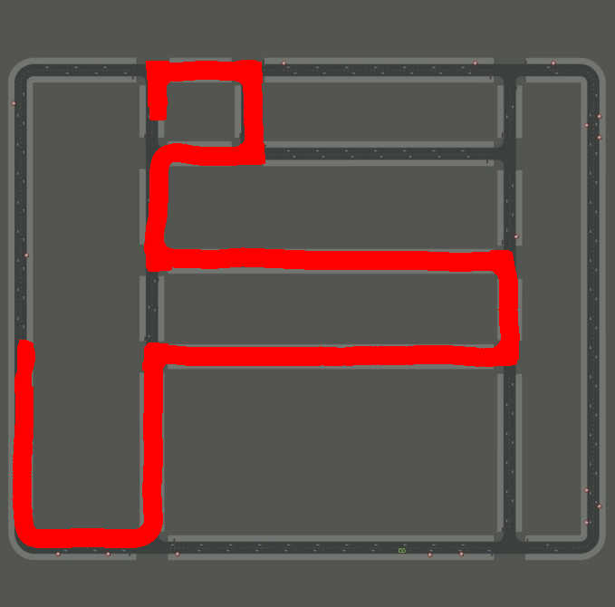

# goal_conditional_direction_prediction

如果想使用local_navg_map对道路方向进行修正，那么首先就要有一张全局地图global_navg_map:

给定目标点后,再进行全局规划,给出路径拓扑图：

再根据车辆当前位姿，从路径拓扑图中抠出局部拓扑图：；

这样做有局限性，不方便部署，可以考虑直接输入目标点坐标，给方向提取先验信息；

## 1.papers

### 1.1 Multi-Modal Fusion Transformer for End-to-End Autonomous Driving

> Multi-Modal Fusion Transformer for End-to-End Autonomous Driving

We consider the task of point-to-point navigation in an urban setting where the goal is to complete a given route while safely reacting to other dynamic agents and following traffic rules.

**inputs:**

front-camera and lidar

**outputs:**

预测车体坐标系下 未来T个waypoint

**waypoint prediction network**

MLP:256+128

使用MLP输出的64维向量

因为目标点和BEV在一个空间里面，所以直接使用目标点的GPS坐标（转换到车体坐标系）比把目标点转换成透视图要更好。

$w_t=w_{t-1}+\delta w_t$

使用GRU对waypoints进行迭代更新

goal_location直接和$w_t$相加

