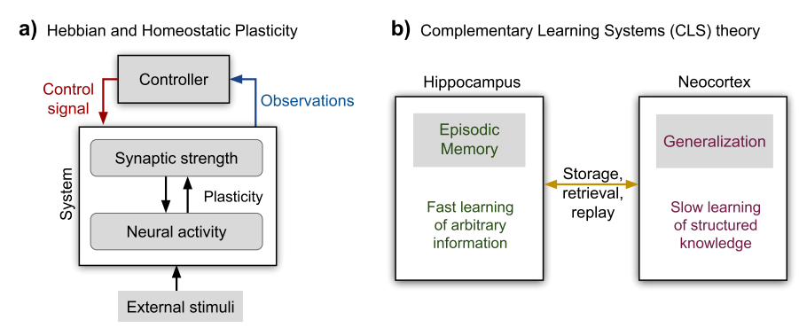
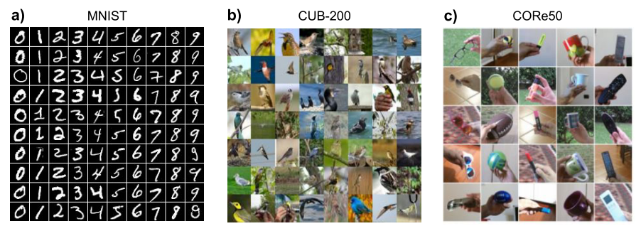
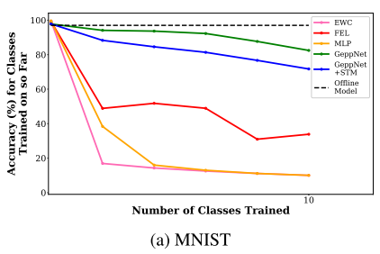
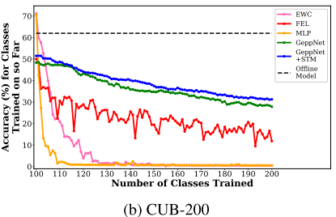
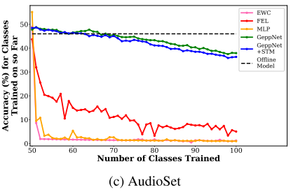
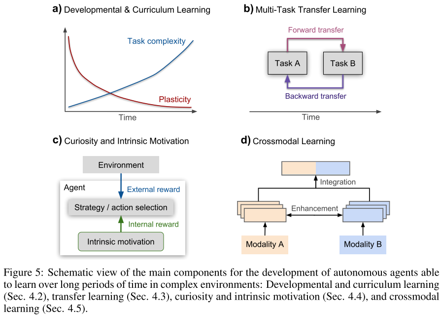
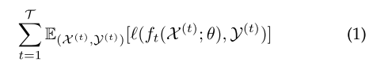
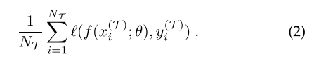
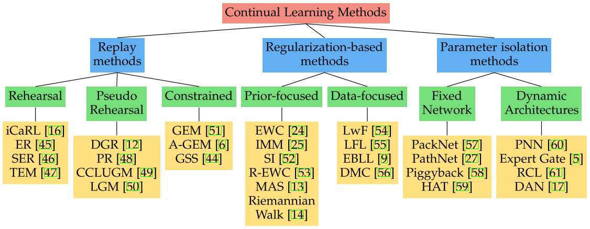

# 终生学习

> https://zhuanlan.zhihu.com/p/336250745

> Continual Lifelong Learning with Neural Networks: A Review [2019]

人和高级动物在整个生命中不断获取、微调和转让知识和技能。这种能力，称为**lifelong learning**，是由一系列神经认知机制协调的过程，这些机制共同促进了sensorimotor(感觉运行）技能的发展以及对长期记忆的巩固和检索。因此对于计算系统和自动化智体，lifelong learning能力，对能否在现实世界进行交互并处理连续信息，至关重要。

但是，长期来看，**lifelong/continual learning**仍然是机器学习和神经网络模型的挑战，因为从非平稳数据分布中不断递增地获取可用信息通常会导致**catastrophic forgetting（灾难性遗忘）或者interference**问题，即用新信息训练模型的时候会**干扰**先前学习的知识。 这种现象通常会导致性能突然下降，或者最坏的情况下导致旧知识被新知识完全overwrite。对于拿固定训练数据来学习的深度神经网络模型，**其随时间递增的信息无法可用这一点，会成为一个主要缺陷。**

在这篇综述中，总结了与人工学习系统的continual/lifelong learning相关挑战，并比较了现有那些在不同程度上减轻catastrophic forgetting的NN方法。尽管NN在特定领域学习方面已取得了重大进展，但要在自动化智体和机器人上开发强大的lifelong learning，还需要进行大量研究。为此作者讨论了由生物系统中的lifelong learning因素所激发的各种研究，如structural plasticity（结构可塑性）、memory replay（记忆重放）、curriculum & transfer learning（迁移学习）、intrinsic motivation和multisensory integration（多感官集成）等。

当前的深度神经网络学习模型依赖于标注训练样本。但这种学习方案是假定训练阶段所有样本可用，**因此需要在整个数据集对网络参数进行重训练以适应数据分布的变化**。常规神经网络模型训练串行任务时候，新任务的学习会使先前学习的任务性能大大降低。尽管**重新training from scratch从头开始训练**从实用上解决了catastrophic forgetting，但效率极低，还阻碍了实时地学习新数据。

**为克服catastrophic forgetting，学习系统一方面必须能连续获取新知识和完善现有知识，另一方面，还应防止新数据输入明显干扰现有的知识**。 为了整合新输入信息，系统必须具有怎样的可塑性，以及为了不灾难性地干扰合并的知识而必须具有怎样的稳定性，这个问题称作**稳定性-可塑性（stability-plasticity）难题**，其在生物系统和计算模型领域也得到了广泛研究。 由于lifelong learning的挑战性，许多从哺乳动物大脑学习汲取灵感的计算方法也被拿出来研究。

人类擅长终生学习，并根据学习的sensorimotor偶然性做出适当的决定。终身学习的生物学方面及其基于生物学的神经网络体系结构建模方面，本文对此也做了介绍。

**neurosynaptic可塑性**在多个大脑区域可以调节稳定性-可塑性的平衡。

可塑性是大脑在细胞和电路水平上神经延展性的基本特征。一个稳定、连续和终生的过程需要两种类型的可塑性：（i）正反馈不稳定性的**Hebbian可塑性**，以及

（ii）稳定神经活动补偿性的**homeostatic可塑性**。从实验上已经观察到，通过降低synaptic（突触）可塑性速率有特别的机制可保护先前学习任务的知识，也避免学习新任务中遇到的干扰。 Hebbian学习和homeostatic这两个可塑性共同促使神经电路的稳定，是形成经验驱动之连接性、集成性和功能性的最佳模式。

如图是neurosynaptic adaptation的两种形式：

a）带homeostatic可塑性的Hebbian learning 和

b）CLS（complementary learning systems）理论

【跳过】

**终身学习**系统被定义为一种能够从连续信息流学习的自适应算法，随着时间的流逝这些信息逐渐变得可用，并且未定义要学习的任务量（例如，分类任务的会员资格类别） 。**在连接主义（connectionist）模型，当要学习的新实例与先前观察的实例出现明显不同时，会发生灾难性遗忘**。脱机学习时，由于智体反复看到相同的伪随机重排样本，可以弥补这种知识的损失，但是当数据是连续流而且无法重排时，这是不可能做到的。**灾难性遗忘**已被研究了二十多年，尤其是在反向传播（BP）学习的网络和Hopfield网络。

减轻灾难性遗忘的早期尝试，**包括存储以前数据的存储系统，其定期重放那些与新数据抽取样本做交错的旧样本**。而这些方法，至今仍在使用。但是，基于内存系统的**一般缺点是它们需要显式地存储旧信息，从而增加大量的工作内存需求**。此外，在固定神经资源的情况下，应设计专门的机制来保护合并的知识不被新信息的学习所覆盖。直觉上，可以通过分配额外的神经资源来极大地减轻灾难性的遗忘。但是，这样可能会导致规模化（scalability）问题，因为非常庞大的神经体系结构会使计算工作量大大增加。相反，由于终生学习无法事先知道任务量和每个任务的样本，预定义足够量的神经资源将变得很重要，因为这样的话，不知道输入分布就可以防止灾难性遗忘。在这种情况下，避免连接主义模型的灾难性遗忘有三个关键点：**（i）为新知识分配额外的神经资源； （ii）如果资源固定，则使用非重叠的表示形式； （iii）把新信息和旧知识交织一起在表示中。**

人类大量利用时空关系和感知输入的高阶关联来学习和触发行为反应。相反，人工学习系统通常是分批训练的，按（伪）随机顺序将相同训练样本送给学习算法做多次迭代。做固定量的训练epoch之后，学习算法可以调整其内部表示，并且可以预测和训练数据集有相似分布的新样本。显然，这种方法是有效的，但并未反映出终身学习任务的特点。**从概念上讲，这些方法可以分为：1）重新训练整个网络同时进行正则化防止以前学过的任务造成灾难性遗忘，2）选择性训练网络并在必要时扩展以代表新网络，3） 为记忆整合建模互补学习系统，例如用内存重放来合并内部表示。**

如图所示即终生学习的一些神经网络方法： a) 带正则化的retraining, b) network extension 和 c) 可能扩展的selective retraining。

**正则化方法**通过对神经权重的更新施加约束来减轻灾难性的遗忘。 这些方法通常受到理论神经科学模型的启发，其模型表明，通过一个产生不同程度可塑性级联状态的突触（synapses），可以保护巩固的知识以免遗忘。 从计算角度来看，实际是附加正则项建模，惩罚神经网络映射函数的变化。文章分析了learning without forgetting (LwF)、elastic weight consolidation (EWC) model、Ensemble方法的fixed expansion layer (FEL)。

**Dynamic Architectures**方法对新信息的响应是通过动态适应新的神经资源改变体系结构属性，例如增加神经元或网络层进行重新训练。

在**CLS方法和内存重放**方面，文中提到两个递增学习方法：（i）修改的自组织图（SOM）和（ii）扩展了短期记忆（STM）的SOM，记作GeppNet和GeppNet + STM。还有一个Gradient Episodic Memory（GEM）模型，该模型将知识积极转移到先前的任务中。 GEM最小化灾难性遗忘的特点是一种情景记忆（episodic memory），存储给定任务中观察到的示例子集。一个evolvable Neural Turing Machine（ENTM），能够通过逐步分配附加外部存储组件来存储长期记忆。 ENTM的配置可以执行新关联的one shot学习，减轻递增学习任务期间的灾难性遗忘。

尽管在采用结构化正则化或动态体系结构更新等学习方法的设计方面大家已取得了重大进展，但在终身/递增学习（incremental learning）任务中这些算法的严格评估却很少。为此作者讨论了使用和设计量化指标去测量大规模数据集的灾难性遗忘。 如图是一些做终生学习的**benchmark数据集**：a) MNIST dataset, b) Caltech-UCSD Birds-200 (CUB-200) dataset 和 c) CORe50。

如下是一些方法的结果：数据集有MNIST (a), CUB-200 (b), 和 AudioSet (c)， 方法有FEL (红色), MLP (黄色), GeppNet (绿色), GeppNet+STM (蓝色), EWC (粉色), 和 offline model (虚点线)。

|  |  |  |
| ------------------------------------------------------------ | ------------------------------------------------------------ | ------------------------------------------------------------ |

神经网络方法通常设计为，递增地适应在受控环境收集（通常为合成的）的数据样本，这与人类生命中遭受的生态条件截然不同。 在现实世界中，智体必须处理感官不确定性，有效地处理多感官信息的连续数据，并有效地学习多个任务，避免灾难性地干扰先前学习的知识。 直观地看，上述神经网络模型与更复杂的终身学习智体之间存在着巨大的差距，后者希望从连续的sensorimotor体验中递增学习。

人类可以轻松获得新技能并跨领域和跨任务迁移知识，而人工学习系统仍处于这样能力的起步阶段，即所谓的迁移学习。

此外，与使用单感官（例如视觉或听觉）信息训练神经网络方法的趋势相反，人类大脑从**多感官信息**整合中受益，也在感知不确定情况下提供有效交互的手段。大脑早期发展的多感官和sensorimotor的专长激发了关于自主智体的大量研究。本文回顾了生物学学习动机所激发的计算方法，其中包括critical developmental stages和curriculum learning，为学习新任务做知识重用的transfer learning，还有由内在动机和自我监督驱动为环境自主探索的reinforcement learning，以及用于跨模式终身学习的多感官系统。

如图是开发自主智体在复杂环境长时间学习的主要部件图：Developmental & curriculum learning, transfer learning, curiosity & intrinsic motivation, crossmodal learning。

**发展性学习（Developmental learning）**实时调节智体与环境的具体交互。与提供大量信息的计算模型相反，发展性智体基于其sensorimotor经验以自主方式获得越来越复杂的技能。因此，**分阶段发展（staged development），**对于以较少的辅导经验来提升认知能力，至关重要。主动推理模型旨在了解如何通过动作和感知的双边使用来选择在动态和不确定环境下最能暴露原因的数据。

有意义的方式组织示例，例如使学习任务难度逐渐变大，人和动物的学习性能会更好，即**课程学习（curriculum learning）**。这激发了机器人技术中的类似方法和关于课程学习影响学习绩效的新机器学习方法。一些数据集（例如MNIST）进行的实验表明，课程学习可作为无监督的预训练，提高泛化能力，并加快训练收敛速度。但是，课程学习的有效性对于任务进展方式非常敏感。课程策略可以看作是迁移学习的特例，在初始任务收集的知识用来指导复杂的学习过程。

**迁移学习**方法（见上图），前向迁移是指学习任务TA对未来任务TB性能的影响，而后向迁移是指当前任务TB对先前任务TA的影响。因此，假设同时学习多个学习任务以提高一项特定任务的性能，迁移学习代表了一种人工系统的重要功能，即从有限量的特定样本推断一般规律。迁移学习一直是机器学习和自主智体的一个开放的挑战。尽管说，通过编码个体、目标或场景元素不变关系信息的概念表示，抽象知识的迁移得以实现，但人们对大脑的特定神经机制调节高级迁移学习的了解却很少。 零样本学习和单样本学习在新任务上表现出色，但不能防止灾难性遗忘。

**Intrinsic Motivation**的计算模型从人类婴幼儿选择目标并逐步掌握技能的方式中获得启发，以此定义终身学习框架的发展结构。内在动机的计算模型可以通过学习课程的在线（自）生成来收集数据并逐步获得技能。这允许通过主动控制复杂度的增长来有效和随机地选择学习任务。增强学习（reinforcement learning）的最新工作包括**curiosity**和Intrinsic Motivation，以解决奖励稀少或具有欺骗性的情况。在外部奖励非常稀疏的情况下，curiosity-driven exploration会提供内在的奖励信号，使智体能够自主地、逐步地学习日益复杂的任务。

整合多种感官信息的能力是大脑的关键特征，它与环境产生连贯、健壮和有效的交互作用。来自不同感官（例如视觉、音频和本体感知）的信息可以集成到多感官表示中，或用于增强单感官表示。

**多感官处理**（**Multisensory Learning）**是交叉模式激励的物理特性、先验知识、期望（例如，学习的相关性）、协同（scaffolding）感知、认知和行为之间相互作用的结果。Multisensory Learning的过程在整个生命是动态的，会受到短期和长期变化的影响。它由外在和内在（exogenous & endogenous）因素的动态加权组成，这些因素决定了多模态如何相互影响。

形成采用越来越复杂高级特征（例如语义一致性）学习的感知表示之前，低级激励特征（例如，空间相近度和时间匹配度）是可用的。在开发过程中，带多感官整合的复杂感知机制，从基本的处理能力开始，基于sensorimotor经验逐渐向更复杂的认知功能发展。

> **A continual learning survey: Defying forgetting in classification tasks**[2020]

人工神经网络在解决特定刚性任务的分类问题上很厉害，通过来自不同训练阶段的泛化学习行为获取知识。最终的网络类似于静态的知识体，努力在不针对原始任务的情况下扩展知识，从而导致catastrophic forgetting。continual learning将这种形式转移到可以不断积累不同任务知识的网络，无需retrain from scratch。这个综述专注于task incremental classification，即任务按顺序出现并由清晰的边界划定。本文主要工作包括

- **1）最新技术的分类和总结，**
- **2）使一个continual learner连续地确定stability-plasticity 折衷的新框架，**
- **3）对11种最先进的continual learning方法和4个baseline进行全面的实验比较。**

考虑到Tiny Imagenet和大规模unbalanced数据集iNaturalist以及一系列识别任务的数据集，作者在三个基准上对各种方法的优缺点进行了经验检查，在模型容量、权重衰减和dropout正则化的影响、任务的顺序、所需的内存、计算时间和存储方面定性地进行比较。

主要的标准是学习过程的**串行性质**，一个/多个任务仅有一小部分输入数据可用。 主要的挑战是学习时要避免**catastrophic forgetting**：随着新任务或领域的加入，先前学习的任务或领域其性能不应随时间显著下降。 这是神经网络一个普遍问题造成的直接结果，即==**稳定性-可塑性难题（stability-plasticity dilemma）**==，**可塑性指整合新知识的能力，而稳定性是指在编码时会保留先前的知识。**

作者考虑的Task Incremental Learning问题，需要设置一系列任务，**一次仅接收一个任务的训练数据**，然后执行训练直到收敛。

Task Incremental Learning的焦点就是在如下函数最优化情况下找到最优参数：其中数据（X，Y），分布D，任务t<T，损失函数ℓ, 参数 θ，f网络函数。

对于当前任务T，统计risk近似为经验risk：

当序列地学习不同输入模式的示例时，早期的一些工作观察到catastrophic interference问题。 大家已经探索了几个方向，例如减少表示的重叠、重放过去的样本或虚拟样本、或引入dual architectures。 由于资源限制，这些工作主要考虑很少的示例（数十的数量级），并且是基于特定的浅层架构。 随着神经网络的兴起，continual learning 和 catastrophic forgetting也受到了更多关注。 对两个连续任务，人们已经研究dropout和不同激活函数对forgetting的影响，并且有几篇论文从理论的角度研究了incremental task learning。

最近工作已经关注更长的任务序列和大量的示例下的continual learning问题。 作者根据序列学习过程中如何存储和使用任务特定信息分成三个类：

- **重放方法**以原始格式存储样本，或使用生成模型生成伪样本。 在学习新任务减轻遗忘的同时重放先前的任务样本。
- **基于正则化的方法**避免存储原始的输入，优先考虑隐私和减轻内存需求。 在损失函数中引入了一个额外的正则化项，在学习新数据时巩固先前的知识。这些方法进一步可分为聚焦数据的方法和聚焦先验的方法。
- **参数孤立方法**为每个任务分配了不同的模型参数，防止任何可能的遗忘。当没有限制适用于体系结构大小时，可以为新任务增加新的分支，同时冻结先前任务参数或该家族为每个任务分配了不同的模型参数，以防止任何可能的遗忘。当没有限制适用于体系结构大小时，**可以为新任务增加新的分支，同时冻结先前的任务参数或每个任务指定一个模型复制**。

如图给出的是三类方法的概述：

**continual hyperparameters framework**

解决continual learning问题通常涉及额外的hyperparameters以平衡stability-plasticity权衡。 许多情况下，这些hyperparameters是利用在所有任务上保留的validation data并通过grid search找到。 但是这违反了continual learning的主要假设，即无法访问先前任务的数据。 它可能会导致在真正的continual learning中无法重现的过度乐观结果。 作者在不违反continual learning设置的情况下建立一个原则性的框架来设置hyperparameters。 除了与现有方法比较，该通用策略还动态地确定了stability-plasticity的折衷，因此扩展至现实中的continual learners。

该框架包括两个主要模态（Maximal Plasticity Search和Stability Decay），其算法伪代码如图所示。

