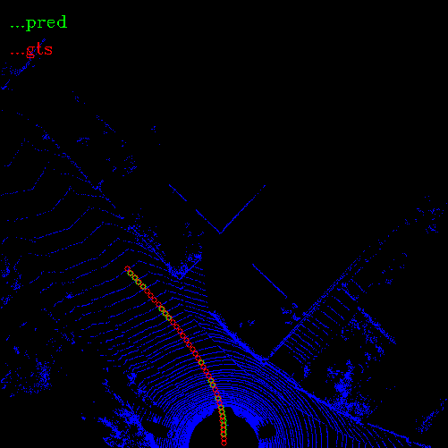
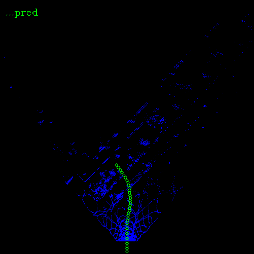
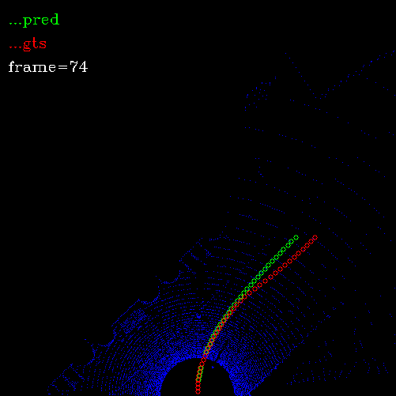
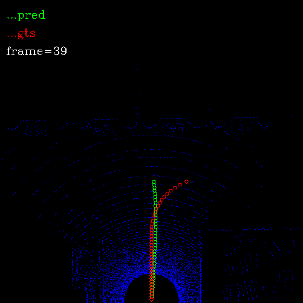
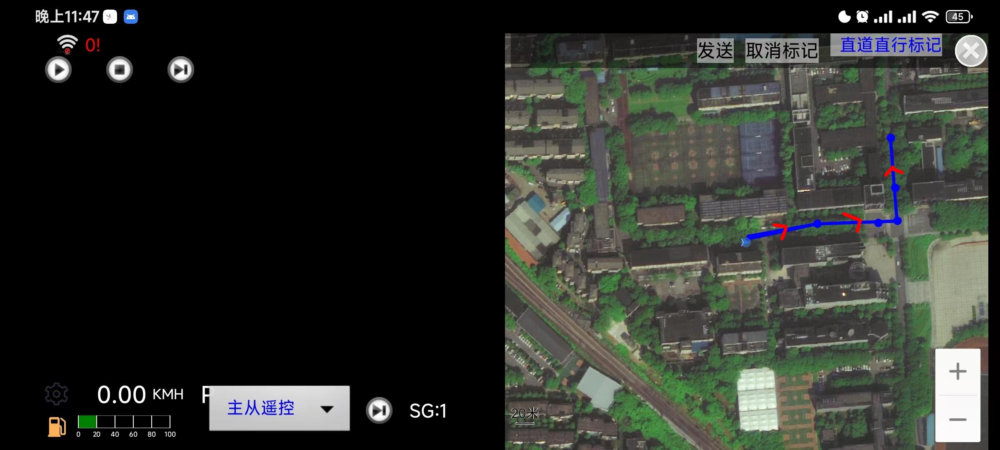

### 1.道路主方向表示方法

> 将历史轨迹点投影到当前帧点云后，有三种方案对主方向进行建模表示：

1. 基于时间采样

   由于历史轨迹点本身就是基于时间采样的，所以直接从当前帧点云时间戳往后，固定取N个轨迹点来表示道路的主方向，这种方法最简单，存在的问题是由于车速在不同路段不一样，遇到红灯或其他情况，车辆还会静止不动，这就导致采样轨迹分布不均匀，训练目标 是 每一个点都精确对应到历史轨迹点上，只会出现过拟合，测试误差很大。

2. 多项式曲线拟合

   将轨迹曲线使用多项式进行拟合，使用网络回归多项式系数。

   尝试使用三阶的多项式对曲线进行拟合，由于高阶项的存在，曲线非常容易出现震荡现象，网络预测回归的结果震荡现象更加明显。

3. 基于空间采样

   在x方向（车辆前方）每0.5m 采样一次$h_i$,目前视野是20m，就是在x-y平面画40条水平线，用这些水平线和轨迹曲线的交点的个数和横坐标(y)集合，来表示轨迹。

   具体方法采用线性插值：

   遍历每一条水平线$h_s$,找到距离它最近的上下两个轨迹点$p_i=(x_i,y_i)$和$p_j=(x_j,y_j)$, 如果上边界没有点，说明此时轨迹曲线长度不够，同时记录轨迹长度$l$

   水平线$h_s$对应的$y_s$通过差值获得：
   $$
   \frac{y_j-y_i}{x_j-x_i}=\frac{y_s-y_j}{x_s-x_j}  (x_j>x_s>x_i) \\
   y_s=y_j-\frac{y_j-y_i}{x_j-x_i}\times(x_s-x_j)
   $$
   这样一条轨迹曲线就可以表示为$direction=\{l,y_1,y_2,...,y_l\}$

   计算回归损失时，只计算前$l$个坐标的损失，剩下的置零。

   最后采用基于空间采样的方法对道路主方向进行建模表示，网络回归出轨迹的长度和每个采样点处的横坐标偏置。

### 2.数据增强

旋转+随机翻转

由于旋转之后，groud truth轨迹点点变化比较大，所以在数据生成时对每一帧数据都做了-10°~+10°的旋转。

而随机翻转比较简单，groud truth坐标取反就可以，在训练的时候以0.5的概率进行翻转

### 3.评价指标

目前使用轨迹点预测的准确率来对模型进行评价

第i帧数据：
$$
acc_i=\frac{p_i}{gt_i}
$$
$p_i$:正确预测的点数

$gt_i$:groud truth中的点数

当预测的坐标偏置与实际的差异小于设定阈值时,就认为改点预测正确，目前阈值设置为0.1m

我们设计了两种评价指标来评价我们提出的算法的性能，一种是预测成功率Success rate，用来评价方法的稳定性，因为只有点数足够多才能反映出道路的方向，所以只有当预测出的点数l大于阈值，才认为这是一次成功的预测

另一种是准确性，评价预测出的方向与真实方向的符合程度

### 4.测试结果

在使用基于时间的采样方法对轨迹进行表示时，训练好的模型只有在直路上表现尚可，在弯曲的道路上，车辆旋转时，预测结果基本上不可用，在路口处也没有出现意料中明显的左右摆动现象。

使用基于距离采样的轨迹表示方法，并进行数据增强后，这些问题都得到了很大的改善。

#### 4.1 KITTI测试结果

目前的模型在验证集上的预测准确率为98%

| 直行：                                                       |                                                     |
| ------------------------------------------------------------ | --------------------------------------------------- |
|             |    |
| **弯曲的道路：**                                             |                                                     |
|  |  |
| **路口(预测结果会出现明显的摆动现象）**                      |                                                     |
|           |  |
|           |  |

#### 4.2 其他雷达数据测试结果

由于不同雷达扫描得到的点分布不同，训练好的模型在其他雷达数据上表现很差

测试了速腾聚创和livox两款雷达数据：

| RS                                                           |                                                     |
| ------------------------------------------------------------ | --------------------------------------------------- |
|  |        |
| **Livox校园数据**                                            |                                                     |
|           |  |

#### 4.3 kitti-to-carla

carla中使用的雷达和kitti雷达都是64线的，所以表现尚可

|  |  |
| ---------------------------------------------- | ---------------------------------------------- |
|  |                                                |

#### 4.4 加入通道注意力和空间注意力

1.在没有先验信息的前提下，仅靠点云信息在路口处是无法确定哪一个方向是该行驶的方向，所以计划引入局部拓扑图提供额外的全局规划信息，通过通道注意力机制将点云特征图和局部拓扑图信息进行加权融合；

在没有先验信息的前提下，仅靠点云信息在路口处是无法确定哪一个方向是该行驶的方向，所以计划引入局部拓扑图提供额外的全局规划信息，通过通道注意力机制将点云特征图和局部拓扑图信息进行加权融合；

同时也能够保证在没有拓扑图信息下，模型能够正常工作，只有在路口处性能才会下降，这里具体做法还没有想好。

2.目前的模型在前方有障碍物时，预测的轨迹会有躲避的趋势，如下图所示，一方面是由于缺少道路前方有障碍物的数据，计划通过在历史轨迹点周围随机生成障碍物的方式进行数据增强进行改善，另一方面，模型预期结果应该是无论道路交通情况怎样，模型都可以稳定的输出道路方向，不应被无关的障碍物影响，所以计划加入空间注意力机制，关注显著性区域，抑制无关信息区域从而提高模型性能。

3.加入注意力机制后

在只用点云输入的网络backbone插入CBAM模块

预测时间由40ms增加到60ms

有几个改进的地方

1. 没有加注意力时，路口处的摆动不是很灵敏，有些距离很近才发现的路口，模型预测结果往往只是直行，没有摆动的情况，加入注意力后，能够发现的路口更多了，但仍有路口没有发现。
2. 路口有障碍物时，预测轨迹受到的影响变小了，但是没有完全消除：

#### 4.5 加入拓扑图

加入拓扑图后的路口对比测试：

第一列：使用加入拓扑图训练的模型，测试时使用拓扑图+点云作为输入

第二列：使用仅用点云训练的模型，测试时仅使用点云

|      |  |
| ------------------------------------------------------------ | ------------------------------------------------------------ |
|    |  |
|  |  |

使用加入拓扑图训练的模型，测试时仅仅使用点云数据

在非路口处性能没有明显的降低，在路口处会出现混淆：

| 非路口                                                       | 路口                                                         |
| ------------------------------------------------------------ | ------------------------------------------------------------ |
|    |  |
|  |  |
|  |  |

#### 4.6 carla-to-kitti迁移测试

性能有所下降，下降不多

由于准确率计算公式有bug，所以没有计算准确率

| 非路口                                                       | 路口                                                         |
| ------------------------------------------------------------ | ------------------------------------------------------------ |
|  |  |
|  |  |

#### 4.7 测试轨迹受拓扑图和点云的单独影响程度

**固定输入拓扑图为向左转：**

在一些比较宽的道路还有路口处，受拓扑图影响比较大

| 非路口                                                       | 路口                                                         |
| ------------------------------------------------------------ | ------------------------------------------------------------ |
|  |  |
|  |  |
|  |  |

**去除点云输入，只输入拓扑地图**

没有点云信息，得到的方向很片面，很多点没有落在道路上

| 非路口                                                       | 路口                                                         |
| ------------------------------------------------------------ | ------------------------------------------------------------ |
|  |  |
|  |  |

#### 4.8 三号院迁移到一号院

测试结果：

和在三号院的测试结果基本一致

1.直路基本上可以沿路走

2.大路路口可以拐进去，小路路口拐不进去

3.在有树的地方，gps信号抖动非常剧烈，会导致错误拐弯

4.实验前期，耗时200ms左右，在实验后期，工控机变得特别烫，耗时在700ms以上，这时直路上也走的不怎么好，预测结果经常不能与道边对齐

5.在直路上，实验中出现了预测结果向左走到路中央，但是实际中车还是向右走的现象

