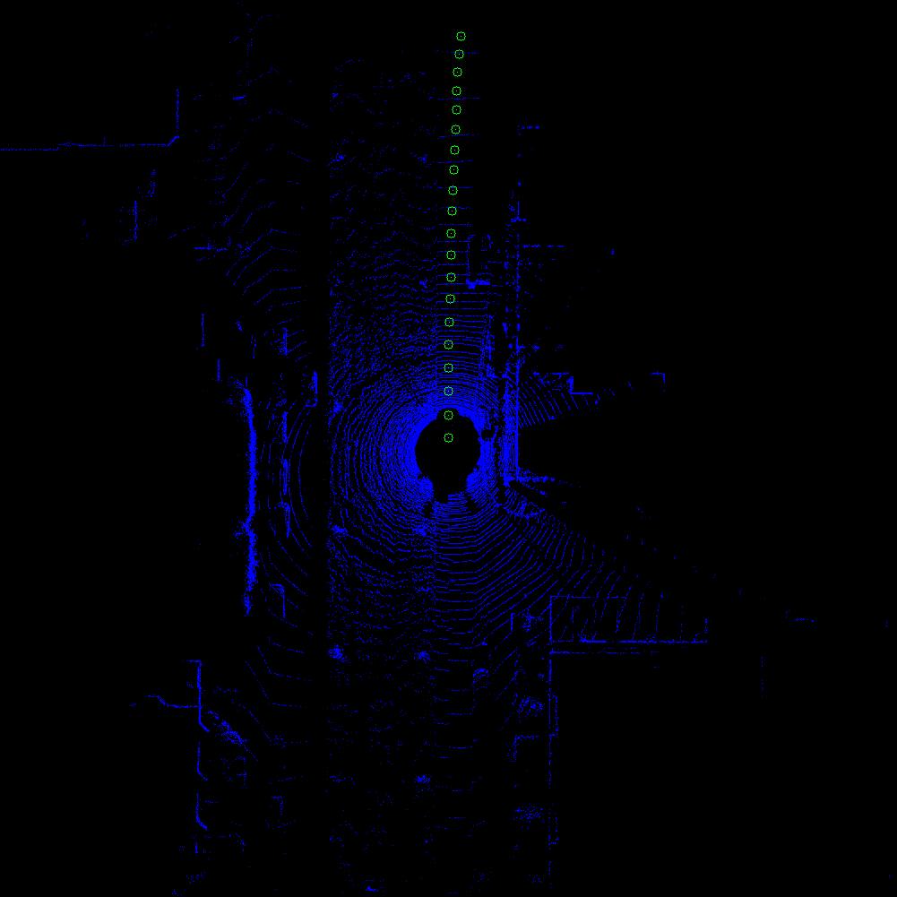
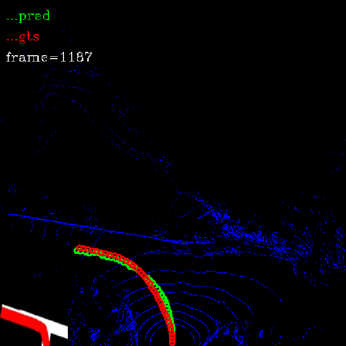

## lidar pointcloud 预测车辆未来轨迹（道路主方向）

### 1.模型


#### 1.1 naive

直接回归，这样每一张雷达图只会有一条轨迹

1. 数据采集

   直接投影轨迹，有时候会遇到红绿灯，轨迹会停止 

   ==数据增强：==

   随机旋转，模拟车头朝向没有指向道路方向

   随机镜像

2. 训练

   损失函数使用MSE，训练100个epoch，最终训练loss降到0.5左右不再下降，验证loss在30左右徘徊，无法进一步下降，初步判断原因是

   2.1  在训练数据中，遇到路口时，轨迹只会走其中一个路口轨迹方向，而实际是走哪一个路口都有可能，这就导致loss无法进一步降低

   2.2  另外一个原因是损失函数，直接使用MSE不够全面，只要能够描述轨迹方向就可以，不需要 每一个点都精确对应到历史轨迹点上,根本原因是轨迹的表示方法不正确

   2.3 目前的轨迹表示方法是将从记录的全局历程信息中提取未来20帧的数据投影到当前点云坐标系下，这其实是时间采样，如果车速很慢，相邻两个轨迹点之间的距离就比较近，反之就比较远，但是道路方向的轨迹应该是空间采样的，可以参照车道线的表示方法对轨迹进行表示

3. 测试结果

   1. 耗时30ms(1660ti)

   2. 直行

      

   3. 转弯

      由于只预测一条轨迹，在没有导向信息的情况下，预测轨迹会出现左右摆动的情况

      

      

#### 1.2 加入anchor- trajectory 机制

~~类似与目标检测，这样每一张雷达图会把所有可能的轨迹都检测出来~~

借鉴车道线检测的做法，回归出来很多条路径点

> Line-CNN: End-to-End Traffic Line Detection with Line Proposal Unit:


在这篇论文中，车道线的表示方式：

一条连续的车道线和图像行的交点


line proposal和实际车道线之间的距离作为评判正负样本的标准

使用它们之间相同的横线horizon编号作为距离


损失函数：

正样本的选择：

1. 所有proposals中距离gt最近的
2. 这个距离要小于一个阈值（超参数）

负样本：

​	距离大于一个阈值的proposal

既不是正样本也不是负样本的proposal不训练

多任务损失函数：分类+回归


回归的第一项是车道线的长度，即点的个数，最多有S个点，如果不够S个点，剩下的回归项都置为0


实现细节：

resnet-122

By choosing 122 layers we make sure that the maximal perceptive field for each grid of the last convolu-tional feature map is large enough to cover the whole image,which matches the global property of the traffic lines.

> Keep your Eyes on the Lane: Real-time Attention-guided Lane Detection

anchor+attention


### 2. anchor机制需要解决的几个问题

1. 轨迹的表示方法

   在车道线检测中是在图像上面画很多平行线，平行线和车道线的交点 点集作为车道线表示

   

2. anchor的表示方法

3. 正负样本的选择

4. 损失函数的设计


使用anchor机制的话，需要确定正负样本，但是目前的训练数据是车辆历史轨迹，每一帧只有一条轨迹，在一个路口有很多个方向，但是只有一个方向有轨迹，这样负样正样本个数会本的选择就会有问题，但是因为车辆之前没有经过这些地方，所以没有轨迹数据，这些负样本的位置实际上也是道路方向，造成标注错误，模型训练也会有问题

这个问题的解决方法：

1. 人工标注轨迹：时间成本

2. 不进行分类任务，只使用正样本进行回归，每一个anchor-line 都输出一个轨迹，最后根据距离进行聚类

   这样没有置信度输出，有些单独的错误轨迹也会预测输出，也不行

3. ==未解决==

4. 所以目前还不能照搬目标检测或者车道线检测中anchor-based的方法

==**新的思路：**==

虽然训练数据中只有一条轨迹，也可以做分类任务，将轨迹简单分为三类，左转轨迹，直行轨迹，右转轨迹（没有背景类），然后回归和anchor的offset

轨迹类别的确认：

判断轨迹是直线还是曲线，根据曲线的形状判断左转还是右转

数据增强时，随机旋转后，标签不变？

随机镜像后，左转和右转标签反转

**anchor标签的选择：**

所有anchor中与gt距离小于阈值的类别标签设为gt，如果没有小于阈值的anchor，就把距离最近的anchor作为训练样本；

**损失函数**

分类+回归

分类：轨迹的类别 （交叉熵）

回归：轨迹点数+轨迹offsets （L1-smooth）


分类回归之前输入的特征使用注意力机制进行处理，得到局部+全局的特征

当前anchor-feature和其余anchor-feature的加权


### 3.注意力机制


### 4.模型蒸馏

一直只保存两个模型

新+旧


### 5.carla

1.采集没有岔路口 的数据进行训练在x方向（车辆前方的方向）每0.5m 采样一次hi


## 记录

目前尝试了时间采样然后回归轨迹点和回归轨迹曲线的多项式系数两种方法来进行轨迹预测，问题都是训练集误差很小，但是验证集误差很大，且一直下降不下去

多项式回归出的曲线，因为高次项，非常容易出现震荡现象，曲线不平滑

所以最后决定还是使用距离采样方法进行轨迹预测，同时预测轨迹点的个数，与车道线回归类似

### 2022.03.10

#### 1.距离采样方法数据生成


目前的想法是用插值法

在x方向（车辆前方）每0.5m 采样一次$h_i$,共20m，就是画40条水平线，和轨迹曲线的交点横坐标集和，来表示轨迹

遍历每一条水平线$h_s$,找到距离它最近的上下两个轨迹点$p_i=(x_i,y_i)$和$p_j=(x_j,y_j)$, 如果上边界没有点，说明此时轨迹曲线长度不够，同时记录轨迹长度$l$

水平线$h_s$对应的$y_s$通过差值获得：
$$
\frac{y_j-y_i}{x_j-x_i}=\frac{y_j-y_s}{x_j-x_s}  (x_j>x_s>x_i) \\
y_s=y_j-\frac{y_j-y_i}{x_j-x_i}\times(x_j-x_s)
$$
这样一条轨迹曲线就可以表示为$direction=\{l,y_1,y_2,...,y_l\}$

计算回归损失时，只计算前$l$个坐标的损失 


#### 2.数据增强

旋转+随机翻转

由于旋转之后，gt点变化比较大，所以在数据生成时对每一帧数据都做了-10~+10的旋转

而随机翻转比较简单，gt坐标取反就可以，在训练的时候以0.5的概率进行翻转

### 2022.03.11

#### 1.开始基于距离采样的训练

损失函数使用L1-smooth

#### 2.关于路口的处理

目前预测输出大多都是直行


#### 3.评价指标

1.距离评价

第i帧数据：
$$
acc_i=\frac{c_i}{s_i}
$$
c:正确预测的点数

s:gt中的点数

当预测的坐标偏置与实际的差异小于设定阈值时,认为点预测正确

2.方向评价

   


#### 4.注意力机制

**通道注意力：**

拓扑图提取一层特征直接和伪图像concat？

再通过一个通道注意力模块？

没有拓扑图时就用全0代替

**空间注意力：**


### 2022.03.15

#### 1.加入CBAM注意力机制[Done]

**1.1** 在只用点云输入的网络backbone插入CBAM模块

预测时间由40ms增加到60ms


**1.2** 网络输入加入局部拓扑图像，使用一个小型网络提取特征后与点云特征图进行注意力加权融合，然后输入和1.1相同的backbone中

预测时间 66ms 左右


#### 2.SPN Spatial Transformer Network[TODO]

因为定位误差以及视角等原因，输入的拓扑图在空间上与点云BEV是无法对齐的，可以尝试使用SPN先对输入图像进行处理，学习出一个空间变换参数，让拓扑图和点云对齐

弃用这种处理


### 2022.03.20

#### 1.adding navg-map

done

#### 2.对比实验方法


#### 3.雷达域适应


### 2022.03.21

1.carla训练验证集上准确率 86.2% 的模型 在 kitti 验证集上准确率 83.3%

2.找到了计算acc的一个大bug，acc的计算还需要完善


### 2022.03.24

**1.新的acc计算方式**

+ 预测出的点数太少的话，轨迹点太短了，无法全面描述主方向，使用gt的length作为基准，直接设置没有预测到的点为false
+ 预测出的点数很多的话，轨迹点可以远到描述出主方向，使用pred的length作为基准，如果大于gt的length，截断为gt的length==[如果预测出的很多点都是错的，和gt之间的交集就很少，也有问题]==
+ 检测长度阈值设置为5m

**2.将目标点信息加入网络**

目标点特征提取网络

先简单融合点云特征和目标点信息

直接特征拼接，看看结果

后面要改成注意力机制进行融合

### 2022.03.25

1.训练goal网络

2.把不同雷达都改造成64线激光雷达？


### 2022.05.09

采集的三号院数据，对于localpose的有点问题，生成的轨迹点在转弯处不准确：


这也导致转弯处预测有问题，初步解决办法，对轨迹点缩放0.7倍，基本上恢复正常


==**基于距离采样时，直角转弯，因为几乎是水平的，很难预测**==

采集数据时，尽量拐大弯

### 2022.05.11

使用极坐标对轨迹点进行采样[Done]

每0.5m一个圆采样一次，这样才是真正意义上的基于空间的采样

因为极坐标的r是固定的，所以可以只用采样点的角度来表示采样点

样一条轨迹曲线就可以表示为$direction=\{\theta_1,\theta_2,...,\theta_l\}$

单位：度


数据增强也更加方便：

1. 旋转yaw角，直接相加 

   $\theta += yaw$

 2.  翻转

     $\theta =-\theta$

离线测试结果显示，在直角转弯处表现比基于距离采样方法要好，未做实车测试



### 2022.05.26


在实验中发现，对于这种局部导航地图，红色的全局规划结果给出的导向信息是向左，但是空间注意力机制有问题，导致网络可能会更多关注图片的下半部分，理解导向信息是向前的，实车测试时直接直行，无法再返回正确的方向：


目前局部导航地图的获取方式为：

首先获取待测试区域的卫星地图，在卫星地图上手动画出路网，最后生成黑底的路网地图

|        |            目标区域卫星地图            |                       画出路网                       |                  黑底路网地图                  |   尺寸    |
| ------ | :------------------------------------: | :--------------------------------------------------: | :--------------------------------------------: | :-------: |
| 一号院 |    |            |  | 1245x1199 |
| 三号院 |  |  |    | 1744x1871 |

在测试时，在手机端app中显示的卫星地图上，手动点出若干目标点，然后将这些目标点发送到导引点生成程序，在黑底的路网地图上，将这些目标点依次连接起来，得到全局规划路线图，然后根据车辆在地图中的位姿，抠出来一块固定大小（128x128）的局部导航地图，同点云一同输入网络。

|               卫星地图               |                           app选点                            |                      全局路线图（示例）                      |                      局部导航图（示例）                      |
| :----------------------------------: | :----------------------------------------------------------: | :----------------------------------------------------------: | :----------------------------------------------------------: |
|  |  |  |  |

**在这个过程中存在几个问题：**

1. 不同测试区域选用的卫星地图**尺寸**会不同，抠出来固定大小的局部导航地图，会造成训练场景和测试场景使用的局部导航地图对应的实际大小不同，如果测试卫星地图**非常大**，抠出的一小块区域会造成比较大的失真
2. 在手机app上**手动选点**，会有很大误差，红色轨迹往往不能和白色路网对齐，也会对导引点的预测产生影响
3. 网络对局部导航地图的理解存在偏差

实际上局部导航地图给网络提供的是全局导向信息，为了缓解上述流程中存在的问题，尝试直接使用目标点和车辆自身位置生成“指南针”图像，替换局部导航地图来给网络提供导向信息，无需测试区域的卫星地图和路网地图，也不需要扣局部地图，指南针只提供方向信息，不包含道路结构信息：

|  |  |
| :----------------------------------------------------------: | :----------------------------------------------------------: |
|  |  |

**测试结果:**

在基于局部地图表现不好地方的测试结果，其他路段两者表现几乎一致，结果显示，直接使用“指南针”图像，可以有效降低因为网络对局部地图理解有误造成的导引点预测偏差。

|          |                              1                               |                              2                               |                              3                               |
| -------- | :----------------------------------------------------------: | :----------------------------------------------------------: | :----------------------------------------------------------: |
| 局部地图 |              |              |              |
| 指南针   |  |  |  |
|          |                              4                               |                              5                               |                              6                               |
| 局部地图 |              |              |              |
| 指南针   |  |  |  |

### 2022.06.09

1.在python下使用ros接收到的点云数据不是list格式，转为list格式需要耗时100ms左右，为此，自定义了一种点云格式：

```
# lidar_points.msg
float32[] x # m
float32[] y
float32[] z
float32[] intensity
int32 dr_x    #centimeter
int32 dr_y    #centimeter
int32 dr_z    #centimeter
int32 dr_heading #0.01degree
```

在C++中处理点云数据效率较高，所以在C++中接收点云和localpose的ros消息，转写为自定义的点云格式，再转发出去，这个过程耗时10ms左右，python接收到后，再转为np格式，这个过程耗时大概10ms，加上网络的预测时间，总耗时20ms左右。

