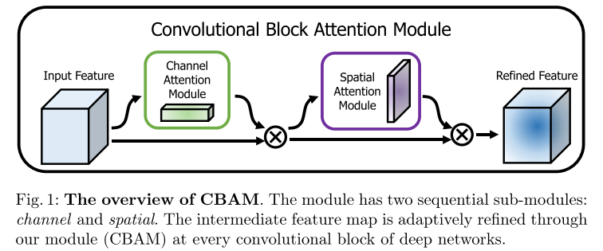

# cv中的注意力机制

计划在拓扑图像和点云BEV特征融合时 使用通道注意力机制

后续处理中使用空间注意力机制，关注道路两侧具有重复性的特征

> https://cloud.tencent.com/developer/article/1632202

注意力机制本质上与人类对外界事物的观察机制相似。通常来说，人们在观察外界事物的时候，首先会比较关注比较倾向于观察事物**某些重要的局部信息，然后再把不同区域的信息组合起来**，从而形成一个对被观察事物的整体印象。

Attention Mechanism可以帮助模型对输入的X每个部分赋予不同的权重，抽取出更加关键及重要的信息，使模型做出更加准确的判断，同时不会对模型的计算和存储带来更大的开销，这也是Attention Mechanism应用如此广泛的原因。

注意力机制可以分为软注意力(soft attention) 和 强注意力(hard attention):

- **软注意力**更关注区域或者通道，而且软注意力是确定性的注意力，学习完成后直接可以通过网络生成，最关键的地方是软注意力是可微的。可以微分的注意力就可以通过神经网络算出梯度并且前向传播和后向反馈来学习得到注意力的权重。 在计算机视觉中，很多领域的相关工作(例如，分类、检测、分割、生成模型、视频处理等)都在使用Soft Attention，典型代表：SENet、SKNet。
- **强注意力**是更加关注点，也就是图像中的每个点都有可能延伸出注意力，同时强注意力是一个随机的预测过程，更强调动态变化。当然，最关键是强注意力是一个**不可微的注意力**，训练过程往往是通过增强学习(reinforcement learning) 来完成的

近几年来，深度学习与视觉注意力机制结合的研究工作，大多数是集中于使用**掩码(mask)来形成注意力机制**。掩码的原理在于通过另一层新的权重，将图片数据中关键的特征标识出来，通过学习训练，让深度神经网络学到每一张新图片中需要关注的区域，也就形成了注意力。

计算机视觉中的注意力机制的基本思想是让模型学会专注，把注意力集中在重要的信息上而忽视不重要的信息，定位到感兴趣的信息，抑制无用信息。

==专注：道路上的车辆对direction没有影响==

**Attention机制的本质就是利用相关特征图学习权重分布，再用学出来的权重施加在原特征图之上最后进行加权求和**。不过施加权重的方式略有差别，大致总结为如下四点：

- 这个加权可以是保留所有分量都做加权（即soft attention）；也可以是在分布中以某种采样策略选取部分分量（即hard attention），此时常用RL来做。
- 加权可以作用在空间尺度上，给不同空间区域加权；
- 加权可以作用在Channel尺度上，给不同通道特征加权；
- 加权可以作用在不同时刻历史特征上，结合循环结构添加权重，例如[机器翻译](https://cloud.tencent.com/product/tmt?from=10680)，或者视频相关的工作。

通常将注意力机制中的模型结构分为三大注意力域来分析。

主要是：**空间域**(spatial domain)，**通道域**(channel domain)，**混合域**(mixed domain)。

1. 空间域——将图片中的的空间域信息做对应的空间变换，从而能将关键的信息提取出来。对空间进行掩码的生成，进行打分，代表是Spatial Attention Module。
2. 通道域——类似于给每个通道上的信号都增加一个权重，来代表该通道与关键信息的相关度的话，这个权重越大，则表示相关度越高。对通道生成掩码mask，进行打分，代表是senet, Channel Attention Module。
3. 混合域——空间域的注意力是忽略了通道域中的信息，将每个通道中的图片特征同等处理，这种做法会将空间域变换方法局限在原始图片特征提取阶段，应用在神经网络层其他层的可解释性不强。

**卷积神经网络中常用的Attention**

在卷积神经网络中常用到的主要有两种：一种是spatial attention, 另外一种是channel attention。当然有时也有使用空间与通道混合的注意力，其中混合注意力的代表主要是BAM, CBAM。

**Spatial Attention：**

对于卷积神经网络，CNN每一层都会输出一个C x H x W的特征图，C就是通道，同时也代表卷积核的数量，亦为特征的数量，H 和W就是原始图片经过压缩后的图的高度和宽度，

Spatial Attention就是对于所有的通道，在二维平面上，对H x W尺寸的特征图学习到一个权重，**对每个像素都会学习到一个权重**。你可以想象成一个像素是C维的一个向量，深度是C，在C个维度上，权重都是一样的，但是在平面上，权重不一样。

**Channel Attention**

对于每个C（通道），在channel维度上，学习到不同的权重，平面维度上权重相同。所以基于通道域的注意力通常是对一个通道内的信息直接全局平均池化，而忽略每一个通道内的局部信息。

spatial 和 channel attention可以理解为关注图片的不同区域和关注图片的不同特征。channel attention的全面介绍可以参考论文：SCA-CNN，通道注意力在图像分类中的网络结构方面，典型的就是SENet。

## 空间注意力机制spatial attention

**不是图像中所有的区域对任务的贡献都是同样重要的，只有任务相关的区域才是需要关心的**，比如分类任务的主体，空间注意力模型就是寻找网络中最重要的部位进行处理。

### 1.SPN

> Spatial Transformer Network [2015]
>
> https://github.com/fxia22/stn.pytorch

通过学习输入的形变，从而完成适合任务的预处理操作，是一种基于空间的Attention模型

如图是Spatial Transformer Networks的结构，主要的部分一共有三个，它们的功能和名称如下：

参数预测：Localisation net 生成平移，旋转，仿射变换等参数
坐标映射：Grid generator
像素的采集：Sampler

最终要实现的效果：

**即定位到目标的位置，然后进行旋转等操作**，使得输入样本更加容易学习。

该网络可以使模型具有空间不变性，它可以对数据进行空间的计算和变换，从而解决输入图像由形变位移旋转而造成的偏差，模型还可以补偿位置特征的信息，关注显著性区域，抑制无关信息区域 从而提高模型的准确性。

训练出的spatial transformer能够找出图片信息中需要被关注的区域，同时这个transformer又能够具有旋转、缩放变换的功能，这样图片局部的重要信息能够通过变换而被框盒提取出来。

### 2.Dynamic Capacity Networks

> Dynamic Capacity Networks

## 通道注意力机制 channel attention

### 1.SENet [2017]

> Squeeze-and-Excitation Networks
>
> https://github.com/moskomule/senet.pytorch

通道注意力可以理解为让神经网络在看什么，典型的代表是SENet。

卷积网络的每一层都有好多卷积核，每个卷积核对应一个特征通道，相对于空间注意力机制，通道注意力在于分配各个卷积通道之间的资源，分配粒度上比前者大了一个级别

> SENet的核心思想在于通过网络根据loss去学习特征权重，使得有效的feature map权重大，无效或效果小的feature map权重小的方式训练模型达到更好的结果。
>
> 具体来说，就是通过学习的方式来==自动获取到每个特征通道的重要程度==，然后依照这个重要程度去增强有用的特征并抑制对当前任务用处不大的特征。
>
> 通俗来讲，就是让网络利用全局信息有选择的增强有益feature通道并抑制无用feature通道，从而能实现feature通道自适应校准。
>
> **Sequeeze-and-Excitation(SE) block并不是一个完整的网络结构，而是一个子结构，可以嵌到其他分类或检测模型中**。

整体的结构如图所示，SE block

$F_{tr}$: 一个标准卷积操作，进行特征维度和尺度转换，严格上不属于SE

==**$F_{sq}$:squeeze 挤压操作 [红框]**==

公式非常简单，**就是一个global average pooling**

**这一步的结果相当于表明该层C个feature map的数值分布情况，或者叫全局信息**

Squeeze操作就是在得到U（多个feature map）之后采用全局平均池化操作对其每个feature map进行压缩，使其C个feature map最后变成1x1xC的实数数列。

一般CNN中的每个通道学习到的滤波器都对局部感受野进行操作，因此U中每个feature map都无法利用其它feature map的上下文信息，而且网络较低的层次上其感受野尺寸都是很小的，这样情况就会更严重。
  U（多个feature map）可以被解释为局部描述子的集合，这些描述子的统计信息对于整个图像来说是有表现力的。论文选择最简单的全局平均池化操作，从而使其具有全局的感受野，使得网络低层也能利用全局信息。
==$F_{ex}$**激励操作[蓝框]**==

论文通过Excitation操作来全面捕获通道依赖性（相互之间的重要性），论文提出需要满足两个标准：
	(1) 它必须是灵活的（特别是它必须能够学习通道之间的非线性交互）；
	(2) 它必须学习一个非互斥的关系，因为独热激活相反，这里允许强调多个通道
为了满足这些要求，**论文选择采用一个简单的gating mechanism，使用了sigmoid激活函数**

1）前面squeeze得到的结果是z，
2）这里先用W1乘以z，就是一个全连接层操作，W1的维度是C/r * C，这个r是一个缩放参数，在文中取的是16，这个参数的目的是为了减少channel个数从而降低计算量。又因为z的维度是1x1xC，所以W1z的结果就是1x1xC/r；然后再经过一个δ函数(其中δ是指ReLU函数)，输出的维度不变；
3）然后再和W2相乘，和W2相乘也是一个全连接层的过程，W2的维度是C*C/r，因此输出的维度就是1x1xC；
4）最后再经过sigmoid函数(门函数)，得到s。

这个s其实是本文的核心，它是用来刻画tensor U中C个feature map的权重。前面的squeeze都只是在某个channel的feature map里面操作，这两个全连接层的作用就是融合各通道的feature map信息。
而且这个权重是通过前面这些全连接层和非线性层学习得到的，因此可以end-to-end训练。

==$F_{scale}$==

在得到s之后，就可以对原来的tensor U操作了。

也很简单，就是channel-wise multiplication，什么意思呢？Uc表示U中第c个二维矩阵，下标c表示channel。

Uc是一个二维矩阵，Sc是上一步的输出S(向量)中的一个数值，也就是权重，因此相当于把Uc矩阵中的每个值都乘以Sc。

==**实际网络中怎样添加SE block**==

## 通道+空间

### 1.CBAM: Convolutional Block Attention Module [2018]

> CBAM: Convolutional Block Attention Module ECCV 2018
>
> 

CBAM由两个独立的子模块串联组成

#### 1.1 CAM

具体流程如下：
       将输入的特征图F（H×W×C）分别经过global max pooling（全局最大池化）和global average pooling（全局平均池化），得到两个1×1×C的特征图，接着，再将它们分别送入一个两层的神经网络（MLP），第一层神经元个数为 C/r（r为减少率），激活函数为 Relu，第二层神经元个数为 C，这个两层的神经网络是共享的。

而后，将MLP输出的特征进行基于element-wise的加和操作，再经过sigmoid激活操作，生成最终的channel attention feature，即M_c。最后，将M_c和输入特征图F做element-wise乘法操作，生成Spatial attention模块需要的输入特征。
CAM模块只是在SE的基础上并行加一个max_pooling,效果会更好一点

#### 1.2 SAM

具体流程如下：
       将Channel attention模块输出的特征图F‘作为本模块的输入特征图。

​		首先做一个基于channel的global max pooling 和global average pooling，得到两个H×W×1 的特征图，然后将这2个特征图基于channel 做concat操作（通道拼接）。然后经过一个7×7卷积（7×7比3×3效果要好）操作，降维为1个channel，即H×W×1。再经过sigmoid生成spatial attention feature，即M_s。最后将该feature和该模块的输入feature做乘法，得到最终生成的特征

#### 1.3 CAM和SAM的组合

 通道注意力和空间注意力这两个模块能够以并行或者串行顺序的方式组合在一块儿，关于通道和空间上的串行顺序和并行作者进行了实验对比，发现先通道再空间的结果会稍微好一点。具体实验结果如下：

+ CBAM和ResBlock的组合

  

#### 1.4 可视化效果

### 坐标注意力

[坐标注意力机制简介](https://www.cnblogs.com/Catherinezhilin/p/15463782.html)

