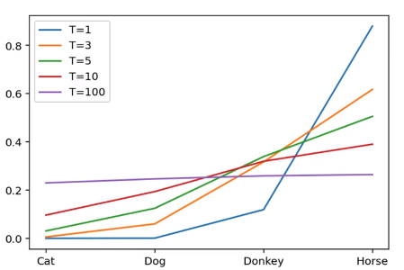
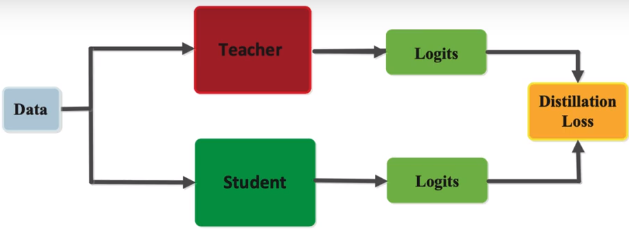

# 知识蒸馏基础knowledge distillation

把一个大网络的知识教给一个小的网络，teacher network->student network

教师网络通常比较臃肿，还有可能是多个网络，部署终端往往算力受限，知识蒸馏得到一个参数量比较小的学生网络，就可以顺利部署；

## 1.知识的表示和迁移

假设一个图像分类网络的目标是对“马”进行分类，那么在它的训练数据中马的概率是1，其他物体，驴子，汽车的概率都是0，这是hard targets，显然是不合理的，但是这个网络在预测时，输出的概率值，有可能是马：0.7，驴子0.25, 汽车0.05，这就比较合理，这是soft targets

马和驴的概率在同一数量级，而汽车的概率就很低，soft targets传递出的信息其实更多，使用大量的hard targets数据训练出一个教师网络，使用它的预测结果，soft targets作为标签，去训练学生网络

==**soft target/label 包含了更多的“知识”和“信息”**==

像谁，不像谁，有多像，有多不像

特别是对于非正确类别概率的相对大小（驴，车）

## 2.蒸馏温度T

上述的soft target虽然在一定程度上可以反映出非正确概率的分布情况，用教师网络的预测作为标签去训练学生网络更加高效。

但是还不够显著，希望除了正样本之外的其他标签的信息更加强烈，暴露的更加明显，这样训练出来的学生网络性能会更强。
这时在分类损失softmax中引入蒸馏温度T，T越高soft的程度也越高。
$$
q_i=\frac{exp(z_i/T)}{\sum_iexp(z_j/T)}
$$

T=1时即为softmax，从上图可以看出，T越大，正类概率越小，负类概率越大，但是整体趋势不变，就是越来越soft了

举个例子：

左侧学生网络是个神经网络，四个类别有一个线性分类层，猫的类别给出的分数logit为-5，狗的类别给出的分数logit为2，驴的类别给出的分数logit为7，马的类别给出的分数logit为9

原来的softmax在图中是当T=1时的计算，从计算结果可以看出，有不同数量级，贫富差异较大；

当T=3时，得到的分布就更软了，基本是同一个数量级。但是还是几个数值均分布在0-1之间且和为1

## 3.知识蒸馏的过程

首先有一个已经训练好的教师网络（Teacher model），先把数据（input）喂给教师网络，教师网络会预测一个温度为T的softmax（文中soft labels）；

同时把数据（input）喂给学生网络（student model），学生网络也预测一个温度T的softmax（文中soft predictions），对soft labels和soft predictions做一个损失函数L（distillation loss也叫soft loss），让他们两个越接近越好，解释就是学生在模拟老师的预测结果；

学生网络同时预测一个T=1的普通的softmax（文中的hard prediction）和hard label（gt）再做一个损失函数（student loss也叫hard loss），让他们两个越接近越好。

最终的损失函数是这两个损失的加权和。

所以这个学生网络既要在温度为T的预测结果和教师网络的预测结果尽可能接近，又要在温度为1的预测结果和标准答案更可能接近。

学生网络预测是T=1

**soft-loss:**

**hard loss:**

传统交叉熵

## 4.一个附带效果

知识蒸馏有一个附带的效果：

假如用没有3的minist手写数据集去训练学生网络，但是训练教师网络的时候是用的所有类别去训练的，教师网络也会将3的知识迁移给学生网络，虽然学生网络从来没见过3这个类别样本，但是最终学生网络也能预测3.

## 5.知识蒸馏的应用场景

1. 模型压缩

2. 优化训练，防止过拟合(潜在的正则化)

   

​		如果只使用3%的数据集，使用hard label进行训练，会发生过拟合，但是如果使用soft label,只使用3%的训练数据集就可以得到原来100%数据集的效果，并不会发生过拟合。

3. 少样本，零样本学习（4.附带效果）

## 6.知识蒸馏发展趋势

1. 教学相长

2. 助教，多个老师，多个同学

   

3. 多模态、知识图谱、预训练大模型的知识蒸馏

   

4. 知识的表示，不仅仅使用最后一层来蒸馏，使用中间层来蒸馏

   数据集蒸馏

   对比学习

​			

知识的表示：

基于特征的知识，基于响应的知识，基于关系的知识

+ **基于响应的蒸馏** 

+ **基于特征层的蒸馏**

  

+ **基于关系的蒸馏**

  

