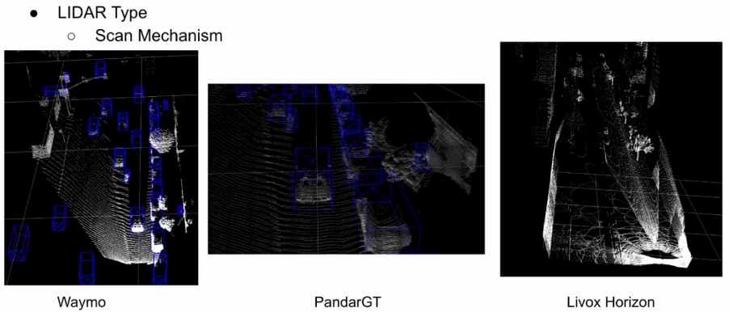
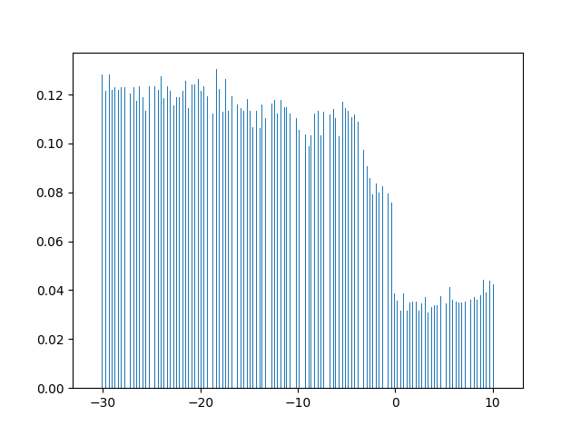

# 1.迁移学习中的领域自适应

> https://www.bilibili.com/video/BV1T7411R75a/?spm_id_from=333.788.recommend_more_video.1

## 1.迁移学习的背景

+ 数据量，以及数据类型不断增加
+ 对机器模型的要求：快速构建和强泛化能力
+ 虽然数据量很多，但是大部分数据往往没有标注
+ 收集标注数据，或者从头开始构建每一个模型，代价高昂且费时
+ 对已有标签的数据和模型进行**重用**成为了可能
  + 传统机器学习方法通常假定这些数据服从**相同分布**，目前大数据的背景下已经不再适用
+ 如何基于已有的不同分布数据，快速构建模型，实现**数据标定**？

## 2.迁移学习的分类

+ 基于实例的迁移

  通过权重 重用 源域和目标域的样例进行迁移

+ 基于特征的迁移

  将源域和目标域的特征变换到相同空间

+ 基于模型的迁移

  源域和目标域的参数共享(finetune)

+ 基于关系的迁移

  利用源域中的逻辑网络关系进行迁移

## 3.领域自适应

问题定义：

有标签的源域和（无标签）的目标域共享相同的特征和类别，但是特征分布不同

按照目标域有无标签可以分为：

全监督DA，半监督DA，无监督DA

### 3.1 概率分布适配

### 3.2 特征选择法

### 3.3 子空间

以上三个方法都是经典的传统方法,没有太多深度学习的内容

### 3.4 基于深度学习的方法

> 李宏毅
>
> https://www.bilibili.com/video/BV1TL411p7Us?spm_id_from=333.337.search-card.all.click

> domain adversarial training

# 2.papers

## 1. A Survey 

> A Survey on Deep Domain Adaptation for LiDAR Perception

**1.domain shift**

weather,time,geographic

sensor types,vehicle setups,sim-to-real

**2.可以使用迁移学习的方法将一个领域的知识传递到另一个不同但是有关联的领域**

**3.lidar perception**

object dection,tracking,scene flow estimatioin

semantic segmentation, instance segmentation

scene completion

number of different processing techniques and data representations for the raw data

**4.Domain Adaptation**

DA categorization:

domain-invariant feature learning

domain-mapping

normalization statistics

ensemble methods

target discriminative methods.

domain-invariant data representations(lidar)

**5.baselines**

1.adversarial entropy minimization which minimizes the distribution between the source and target

2.GANs adversarial networks

==**6.Applications and Use-Cases**==

1.sim-to-real DA

2.geography-to-geography DA

3.weather-to-weather DA

4.sensor-to-sensor DA

5.dataset-to-dataset DA = sensor + geography

**7.SOTA methods**

**A.Domain-Invariant Data Representation**

A domain-invariant representation is a hand-crafted approach to move different domains into a common representation.

this approach is basically a data pre-processing after which a regular perception pipeline starts.

It is mostly used to account for the ==**sensor-to-sensor**== domain shift.

**1) Sampling Alignment in 2D Space:**

simple DA methods for different lidars

up-sampling the data or by dropping scan lines

**2) Geometric Representation in 3D Space:**

such as pillars

**B. Domain Mapping**

most used in sim-to-real DA and dataset-to-dataset DA

Annotated source data is usually transformed to appear like target data, creating a labeled pseudo-target dataset.

For images, domain mapping is usually done adversarially and at pixel-level in the form of image-to-image translation with conditional GANs.

**1) Adversarial Domain Mapping:**

大多数论文都是对Lidar的BEV或者range-image进行GAN来实现DA

**2) Non-Adversarial Domain Mapping**

The non-adversarial mapping techniques primarily focus on the sampling and distribution differences between LiDAR sensors.

a. dataset-to-dataset: simple data augmentation techniques

b. sensor-to-senor: re-sampling 

**C. Domain-Invariant Feature Learning**

domain-invariant feature learning employ a training procedure that encourages the model to learn a feature representation that is independent of the domain.

In contrast to domain-invariant data representations, these approaches are not hand-crafted but use learned features.

**1) Divergence Minimization散度最小化:**

SqeezeSegV2类似文章

**2) Discriminator-based Approaches基于判别器:**

utilize adversarial training to force the feature encoder to learn only domain-invariant features.

使用对抗学习让特征提取器学习具有领域不变性的特征，直到判别器区（二分类器）分不出来这个特征是从哪个领域提取出来的。

LiDARNet：对抗学习

SF-UDA3D: Source-Free Unsupervised Domain Adaptation for LiDAR-Based 3D Object Detection

根据检测中的时域一致性，在目标域上生成伪标签，然后使用自学习的方式进行学习

**D. Normalization Statistics**

**E. Other Methods**

1. teacher-student knowledge distillation

   在源域上训练一个教师网络，然后在目标域上生成伪标签。一个较小的学生网络同时使用源域和目标域的数据进行训练。

   

   在Geography-to-Geography上的表现不错，在目标域上学生网络比教师网络表现出了更好的泛化能力，但是实际上不同域之间不仅仅只有地理信息不同，这时，网络可能就无法同时使用两个领域的数据进行训练了。

## 2.ST3D

> ST3D:Self-training for Unsupervised Domain Adaptation on 3D Object Detection
>
> https: //github.com/CVMI-Lab/ST3D
>
> https://www.bilibili.com/video/BV1fg411N7cD?spm_id_from=333.337.search-card.all.click

1. **不同类型雷达天然会有domain gap的现象：**

   1. 线数不同

   2. FOV不同

   3. 垂直分辨率不同，有的均匀分布，有的非均匀分布

      

   4. 扫描方式不同

      机械式，固态(livox)

      

​				在机械雷达训练的模型，在固态雷达下使用，性能损失会特别大

2. **仿真环境中数据和现实数据之间也会有domain gap**

3. **目标：**

   已经有了一个使用大量数据训练好的模型，当更换lidar或者更换运行场景后，希望只用很少的训练数据就可以让新环境下的模型性能和之前一样好。

4. gap对于目标检测准确率的影响:

   

​		source: Waymo

​		dest:	KITTI

​		在原数据集上进行全监督学习达到73.45的AP，不做任何处理，直接在KITTI上运行，AP仅为27.45, 使用ST3D之后，准确率可以提升到73.37

## 3.Simulation-based lidar super-resolution for ground vehicles

点云超分辨率重建

这样会不会也引入了domain-shift问题，怎样保证，不同线数，fov不同，不同环境下的雷达都能恢复出高分辨率点云

效率问题

# 3.DA Direction

多模态，其中一个模态会有domain-shift问题，另一个没有？

利用没有领域迁移问题的模态提供额外的信息？？

CARLA数据采集

传统方法尝试：

与线数无关的特征,与扫描方式无关的特征

以上工作相当于ST3D中的ROS部分

多帧累计 消除 线数的影响，怎样评判是否线数相关

相对坐标，高度差

协方差矩阵

惯性张量

特征值 

这都是全局特征，不好加到网络里面，还是考虑直接处理输入，通过多帧累积再下采样，点的特征增加法向量，消除扫描模式的区别

【加入之后速度很慢】一个batch（16）需要6s的时间计算svd

由于是batch计算，放入gpu会爆显存

分类器：64线、128线，，聚类？？？，按照线数聚类，最后簇的个数会逐渐相似

为什么图像对采集设备不敏感：

每个像素的rgb值不随设备发生太大变化

通过直接点云多帧累计，可以明显消除线数的样子，车辆的拖影：**通过其他车辆的轨迹找到主方向**

在全局特征中加入点云的三个特征值

下一步，生成32-64-128线的数据，同时采集数据，验证S2S的DA

完成预处理之后，ST3D后面的工作，不同的城镇数据，实现D2D的域适应

### 1.多帧累计后，计算垂直角度的分布直方图

单帧直方图：

| 32                                                      | 64                                                      | 80                                                      | 128                                                       |
| ------------------------------------------------------- | ------------------------------------------------------- | ------------------------------------------------------- | --------------------------------------------------------- |
|  |  |  |  |

累积3帧直方图

| 32                                                    | 64                                                    | 80                                                    | 128                                                     |
| ----------------------------------------------------- | ----------------------------------------------------- | ----------------------------------------------------- | ------------------------------------------------------- |
|  |  |  |  |

简单的多帧累积之后，不同线数雷达点垂直角度的分布趋于一致

| 32_fused3                                                    | 64_fused3                                                    |
| ------------------------------------------------------------ | ------------------------------------------------------------ |
|  |  |
| 80_fused3                                                    | 128_fused3                                                   |
|  |  |

### 2.点云下采样

(显示视角未统一)

==下采样评价指标==

| 128                                                          | 128->80                                                      | raw80                                                        |
| ------------------------------------------------------------ | ------------------------------------------------------------ | ------------------------------------------------------------ |
|  |  |  |
| 128->64                                                      | 128->32                                                      |                                                              |
|  |  |                                                              |
| raw 64                                                       | raw 32                                                       |                                                              |
|  |  |                                                              |

### 3.高线数知识转移到低线数

