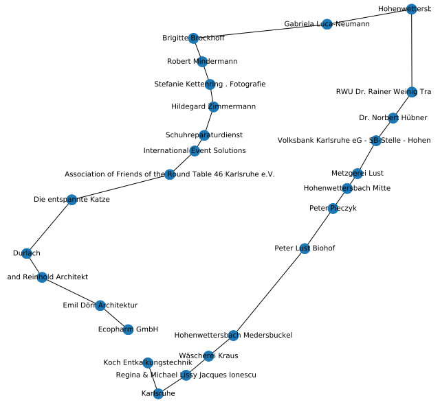

1.

现有的车辆行驶方向控制算法就像是有一条绳子在拉着车辆,而车辆就像一个盲人被绳子拉着走,没有自己对行驶方向的判断能力,人类在一条路上并不需要一个显示的目标点去引导自己就可以很自然的顺着路走,受此启发,希望无人车也可以具备类似这样的能力,即通道主方向提取能力，只根据激光雷达采集到的点云数据,就可以得到一个或多个当前时刻的待选行驶方向，再融合环境中的其他线索，只依靠点云数据得到行驶方向。

2.

同时对输入点云数据进行聚类分割与语义分割，在语义目标丰富的场景下根据语义分割的结果建立semantic graph，提取图特征进行图匹配，在语义目标不足的场景下根据聚类分割的结果提取底层的语义特征进行匹配，将高层语义信息和低层次的语义信息进行融合。

3.

