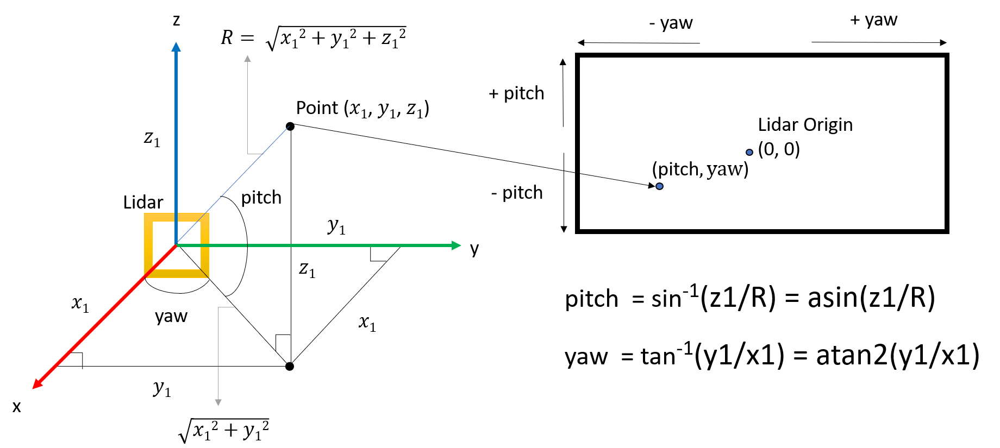
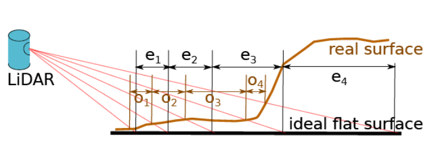

拟采取的研究方法、技术路线、实施方案及可行性分析

本课题希望实现一个新型的基于点云数据的环境建模和导航技术，针对上述研究内容，拟采取的研究方法、技术路线及实施方案如下

1.基于点云数据的环境建模

目前的想法：先实现语义拓扑地图，再实现语义矢量地图

为什么要将语义和拓扑联系在一起？

针对使用离线建立好的先验地图进行定位导航存在的问题,使用一种新型的环境表示方法“矢量地图”，基于点云数据对环境进行建模，主要技术路线如下：

==由于缺少相关文献阅读，具体的技术路线还在思考，先写一个简单版本，能写多少写多少==

参考

Visual-Based Semantic SLAM with Landmarks for Large-Scale Outdoor Environment

将landmark换成矢量地图里面的节点

所谓“矢量地图”，就是由节点和边组成的拓扑地图，与拓扑地图不同的是，这里的边含有度量信息，表示两个节点的相对位置，节点表示车辆行驶过程中前后差异比较大的地方，保存地点数据以及局部地图==为什么要自动发现==？自动发现不好控制，而且会有偶发的突然情况

最好人工指定关键节点

或者==在已经建好的先验地图上提取矢量地图==

一个全局里程计确定是否是回环

一个局部历程计确定行驶距离

2.基于点云数据的通道主方向获取

​		矢量地图构建完成后，为了使用它完成无人车的导航任务，首先要让无人车具备沿着道路行驶的能力。

​		现有的车辆行驶方向控制算法是在全局定位和全局规划、局部规划的基础上实现的,在已知车辆自身全局位姿A和目标点全局位姿B的情况下,全局规划算法会规划出一条从A到B的轨迹,控制算法根据这条轨迹去控制车辆沿着轨迹行驶,然后局部规划算法根据车辆行驶环境不断修正这条轨迹。这就像是有一条绳子在拉着车辆一样,而车辆就像一个盲人被绳子拉着走,没有自己对行驶方向的判断能力,人类在一条路上并不需要一个显示的目标点去引导自己就可以很自然的顺着路走,受此启发,希望无人车也可以具备类似这样的能力,即只根据激光雷达采集到的点云数据,就可以得到一个或多个当前时刻待选行驶方向。

​		考虑到通过激光雷达采集的原始点云数据量过大，直接处理点云数据计算量太大，非常耗时，可以将原始点云数据投影xy平面上得到雷达的鸟瞰图，也可以将原始点云数据投影到以z轴为中心轴的圆柱面上，两种方法都可以减少点云数据量，但是第二种方法与人类观察世界的形式更加相似，所以选择第二种投影方式对点云数据进行降维得到一张二维图像，具体做法为：

首先定义雷达坐标系为前方为x的右手坐标系；激光雷达垂直视场角范围为[FOV_Down,FOV_Up]，垂直角分辨率为v_resolution,水平角分辨率为h_resolution,

对于原始点云中的一个点P(x,y,z),计算其在雷达坐标系下的偏航角yaw和俯仰角pitch

将点P投影到图像上，其像素坐标系为

为了获得车辆的引导方向，我们关心偏航角（0，pi）之间的点云数据

[==TODO==]

根据像素属性的不同，最后由激光雷达点云数据可以生成前视高度图、深度图等，深度图的每一列表示一个水平角度，通过对比，深度图中包含的信息量更多，选择使用深度图进行无人车行驶方向的预测。

考虑一种特殊情况，即无人车停放在一处面积很大的平坦广场上，一个障碍物都没有，在没有全局规划引导的情况下，此时任何一个方向都是可选的行驶方向，将此时激光雷达前视深度图设为base_map，每一列的像素值都是固定的,设激光雷达安装高度为h，每一列的深度值范围为：

[h/tan(fov_down),+无穷)

在水平射线以下的深度值范围为：[h/(fov_down),h/tan(v_res)]

驾驶无人车可以上theta度的上坡

计算每一列的代价：

cost(v) = sum(g(x))  for x in v

对于cost<th的列，从中选择一个和上一帧列数最接近的，避免转弯角度过大，

同时也要考虑可通行区域的面积，在待选列中，如果两列列数差值小于阈值，则认为在同一块通行区域内，可通行面积+1，选择行驶方向的时候也要考虑这个面积。

3.基于点云数据的里程计估计

​		无人车具备沿着路行驶的能力后，就需要让无人车知道自己已经沿着路行驶了多远距离，这部分使用基于点云数据的里程计算法来进行估计，选择Zhang Ji等人提出的LOAM作为基础里程计算法，

​		LOAM里程计的思想是提取前后两帧点云中的特征后进行特征匹配从而完成前后两帧的关联，进而求解出前后两帧点云之间的相对位姿，在LOAM中根据点云中的每个点的曲率来判断其是否为特征点，每个点的曲率的计算公式如下：

4.基于点云数据的==多特征融合==地点识别

​		当无人车可以沿着道路行驶并可以估计出自己行驶的距离后，就需要确定自己是否已经行驶到了矢量地图的节点，这就需要基于点云数据进行地点识别。

​		传统的基于匹配的地点识别算法大多只利用点云数据的度量信息或者提取关键点在数据库中进行匹配，匹配效率低，而且容易出现低级的匹配错误；除此之外，在传统的匹配方法中，每一个三维点都公平的参与到了匹配过程，尽管有些点对匹配结果有负面影响，这些都和人类识别地点的方式不一样，首先人类识别地点是依靠一个一个独立的物体和它们之间的拓扑关系，其次人类并不会把看到的所有东西全部拿去匹配,而是有轻重选择的,比如重点观察一些显著的目标,或者自己已经认识的目标,同时会剔除一些无关目标，比如，运动目标；

5.基于语义地图匹配的局部高精度定位

6.可行性分析