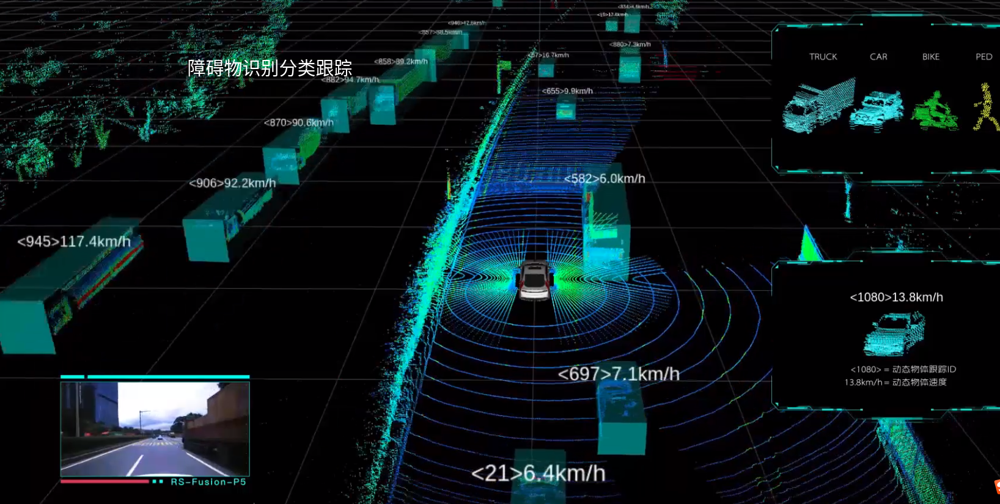

## 0.Pro WU：

1. 能否在建图的过程中，同时剔除运动目标（行人及其它机器人），同时自动发现环境中新增的或者减少的设施，从而动态更新环境地图。
     这样就把建图与目标识别场景理解合并在一起了。现在这个项目中先实现室内环境的理解，
     你硕士开题的时候可以针对室外自然场景，开展同步建模与语义标注，实时维护一张动态的语义地图。
3. 因为你是对激光雷达的目标识别感兴趣，所以你可以先将行人检测融入到地图构建中，
     将当前帧中的行人点云数据抹去，再送入到节点程序中进行地图构建。
4. 作为硕士课题，我觉得你可以考虑将激光雷达的目标识别与地图构建结合起来，
     这样能同步生成语义地图，而不是简单的点云地图。语义地图对无人车的导航更有帮助。
     点云地图是没有物体属性信息的，因为它只有测量没有识别。而融入目标识别后，不仅为点云打上了语义属性标签，同时这个属性标签还有助于提高点云匹配的准确性。因为有了物理含义，就能有效减少低级的匹配错误的概率。

## 1.动态+静态 分层

### 1.1 定位的时候使用动+静的方式

参考动画制作的过程前景+背景

人类定位的时候应该是**大体轮廓+部分细节**,

大概是背景粗略定位,部分物体细节进行精细定位,现在的定位好像是整体定位,没有分背景和细节

### 1.2 对于一些物体按照运动状态进行分级

**==有模型,基于物体识别==**

**固定**的物体:比如建筑物,树木,栅栏等,静态标志物,作为长期参考物,利用这些进行长期建图

长期**静止**的物体:比如停靠在路边的车,作为短期参考   参考cartographer的子图概念?

短期**静止**的物体:不动的行人等  超短期参考

**动态**物体:感觉也可以用于位姿估计,定位,处于动态环境,可以改善长廊效应?

==**无模型,或者说不分类,把动态目标提取出来**==

一个参考:

基于光流边缘引导的视频补全算法

项目地址:http://chengao.vision/FGVC/

论文:https://arxiv.org/abs/2009.01835

### 1.3 新的地图表达形式

**长期地图**(可以一直信赖)(绿色)+**短期地图**(可能会消失的物体)(红色) -----> 类似动画分层

### 1.4 建图+识别+跟踪

### 1.5 环境发生变换时,自动更新地图

## 2.RS-Lidar-algorithms

视频:

https://www.bilibili.com/video/BV1rp4y1i7sb/?spm_id_from=333.788.videocard.1

