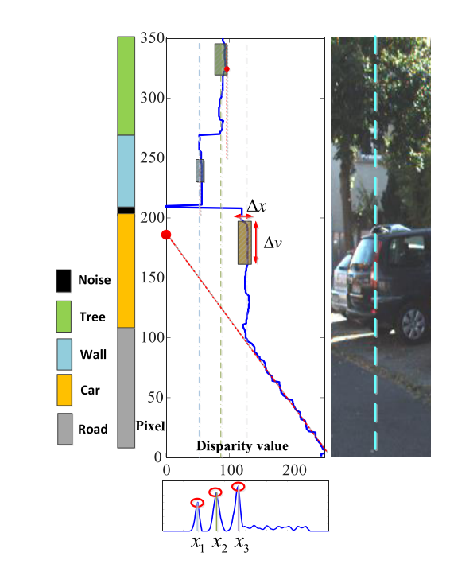

## 硕士开题思路与方仓医院项目分析

### 0.开题思路

自拟题目:基于语义图的场景理解和定位导航技术研究

#### 0.1 语义信息的使用

##### 0.1.1 基于semantic graph的闭环检测和建图

​		对输入传感器数据进行语义分割后,将语义目标抽象为一个个点,这个点包含语义目标的质心和语义标签.将语义点连接起来形成语义图,这个semantic graph同时包含了语义信息和拓扑信息,然后对语义图提取特征,提取特征的方法也分为传统的人工设计特征和基于深度学习使用图网络的方法,提取特征之后在和语义地图库中的特征进行匹配,达到地点识别或者定位的目的;

​		将语义信息和低层次的度量特征进行融合,既可以解决度量信息表达能力不足的问题,也可以解决语义信息很难准确获取的问题,在可以提取到语义信息的地方使用语义信息,提取不到的地方使用segmentation信息;具体如何融合还在思考中,可以将segmentation信息作为一个vertex直接放进graph中,或者将semantic信息放进seg-map中作为度量信息的补充,或者采用分层地图的形式,一张semantic graph,一张segmap

##### 0.1.2 多视角匹配,使用航拍图作为map

​		语义图方法应该也可以用于==跨视角==的匹配,虽然从各个视角各个传感器观测到的原始数据差异很大,但是其中包含的语义信息和语义实例之间的拓扑关系应该是具有高度一致性的,所以可以对多视角传回来的数据提取"语义图",然后使用图计算它们之间的相似性;

​		在已有航拍地图的情况下,将度量航拍地图转换为语义图,使用无人车激光雷达单帧语义图在其中搜索匹配,达到定位的目的;

##### 0.1.3 语义融合定位

​		之前基于度量的定位是把所有的扫描信息全拿去匹配,就算是严重的干扰目标也会去匹配,有了语义信息之后,如果检测到当前帧没有地图中的参照物,全都是动态的遮挡,例如很多人严重遮挡的情况,就判断此帧不依赖点云信息,找到方法将语义加到融合框架中,将其作为独立于点云测量的一个观测;

​		这个方法是使用语义信息去对传统融合方法进行改进,语义只是辅助手段;

### 0.2 行驶方向的确定

​		在感知空间进行直接规划,目前还没有想到很好的解决办法;

### 1 方仓医院环境特点

#### 1.0 机器人硬件

前视180度 16线激光雷达

后视270度 单线激光雷达

RGBD深度相机

IMU + 码盘

#### 1.1 颜色单一,特征单一,绝大部分为白色

|                                                              |                                                              |
| ------------------------------------------------------------ | ------------------------------------------------------------ |
|  |  |

#### 1.2 有两条长度较长且相似性很高的长廊

在长廊内除了门/门洞之外没有其他明显的参考物                                                                                                                                                               

#### 1.3 在最左侧的轻症病房呈现出高度对称性

病房内有大量的病床,床沿高度高于激光雷达高度,只能扫描到床头和床尾的板子,两侧床沿无法扫描到,病床在地图中的样子是两条对称的线段,病床均匀分布在病房的中部位置,高度对称;

#### 1.4 动态环境

1.机器人到达病房内后，医生或者护士会围绕在其周围进行操作，造成大范围的遮挡，出现类似“绑架机器人”的情况，只使用lidar进行定位会出现严重的跳变情况，融合IMU后可以解决；

2.医院内环境经常发生改变，床位挪动，方仓改动，设备增加等都会改变环境，使用没有更新的地图无法进行准确的定位；

### 2.方案对比

#### 2.1 cartographer+IMU定位

由于cartographer对计算能力要求比较高，无法使用全院的完整地图进行定位,只能将医院分割成一个个小单元，在每一个小单元内建图定位，在静态环境下稳定性较高，在动态环境下，也会发生定位偏移的情况，如果偏移量较小，不会使用IMU进行校准，无法消除累积误差，第一种方案无法保证定位长期精确稳定，但是可以实现任意AB两点的运动；

#### 2.2 视觉引导点

（据说）无法给出一个比较稳定的引导方向，会造成机器人的左右摇摆，行驶轨迹不平滑；

行驶路线固定，如果想要实现任意AB两点间的运动，需要训练大量的模型，算法不灵活；

#### 2.3 IMU里程计

鉴于感知的不稳定性，每次任务需要行驶的距离都很短，IMU的偏移也不会很大，可以使用IO进行短距离的定位：

具体的，每个机器人在执行不同的任务时，必须要从规定的起点出发，到达规定的终点，无法指定任意起始点，以机器人起始点为(0,0),给机器人下发一系列的动作序列,如:原地转向180度,直行10m,左转90度,直行1m,动作序列中的角度和距离全部由IO推算给出;

**出现的问题:**

机器人起点位置和预设有偏差时,严格按照动作序列规划去行驶,在关键节点会出现非常严重的偏差;

在行驶路径上如果出现避障然后回正的情况,会对IO推算出来的行驶距离造成影响,进而在关键节点出现偏差;

和方案2.2类似,这种方法无法实现任意指定AB点的运动,只能走固定路线,在任务数量较少,任务较简单的情况下,可以使用动作序列的方式,如果任务数量较大,动作序列的维护和更新会很困难,而且长距离下IO也失去了可靠性;

#### 2.4 其他方案

方仓医院内还配备了UBW定位基站,在每台机器人上都配有UWB标签,使用UWB定位的问题:

1.定位不稳定,会出现突然的跳变现象

### 3.方案小结

​		在方仓医院这个看似简单的环境下，本以为使用cartographer可以完美解决定位的问题，但实际上，在低算力下，面对动态场景和长时期的工作，cartographer无法保证稳定性；视觉引导在失去可靠特征的环境下也很难正常工作；只有IMU不受外界影响可以稳定工作

​		最后采用的方案是一种类似拓扑地图的形式的“矢量地图”，由节点和边组成，边 代表直行和直行的距离，节点 表示执行转弯或者其他关键动作的关键位置；

​		使用这种方案可以应付演习的情况，但是距离 真正投入使用还有很大的距离，如果想使用矢量地图进行定位导航，首先要解决矢量地图的构建，然后解决里程计的漂移问题，还要解决节点处的方向引导问题，这就和人类驾驶员根据导航软件的提示进行驾驶很相似，直行m米，在红绿灯路口左转....

### 3+ 与高精地图比较

**高精地图存在的问题**

​		1.地图本身存在的问题

​		现在无人驾驶领域主流使用的"高精地图",融合了相机,激光雷达,GNSS,IMU,码盘等各种车载传感器,精度可以达到10-5cm,是规划和定位等模块的基础,但是伴随着高精度的是高精地图的几个缺点:

​			1.多种传感器的融合导致数据量巨大,要比普通的导航地图大得多;

​			2.高精度也意味着低稳定性,精度越高,对环境的建模能力就越强,于此同时环境发生细微的变化对定位精度也会产生影响,为了持续保持地图的精度,就需要时刻检测环境的变化,并根据变化对地图进行更新,这就会带来巨大的成本;

​		2.定位匹配存在的问题

​		==匹配方法的分类还需要调研==

​		主流的定位/回环检测方法有scan-to-scan,scan-to-map无论是哪一种匹配方法都是用当前雷达采集到的所有数据进行匹配,每一个三维点都公平的参与到了匹配过程,场景中存在的对定位匹配没有帮助的物体,比如,突然出现的一个行人,暂时停放的车辆,随风飘过的垃圾袋等,都会对匹配结果造成影响.

​		3.车辆引导方向的获取存在的问题

​		传统无人驾驶行驶方向是在全局定位和全局规划的基础上获得的,在已知车辆自身全局位姿A和目标点全局位姿B的情况下,全局规划算法会规划出一条从A到B的轨迹,控制算法根据这条轨迹去控制车辆沿着轨迹行驶,然后局部规划算法和全局路径规划结合根据车辆行驶环境不断修正这条轨迹;

​		这种方法对全局定位算法的精度和稳定性都要求很高,一旦定位出现偏差,即使是在全局规划和局部规划算法稳定精确的情况下,车辆实际的行驶轨迹也会偏离期望轨迹,造成难以想象的可怕后果;

**以上问题现有的解决办法**

​		1.对于地图本身存在的问题:用拓扑图来代替高精地图

Topolog-ical maps provide a concise representation of the world
by only keeping information about relevant places, being
robust to environment changes.		

边缘服务器，对高精地图进行更新

​		2.对于匹配过程存在的问题

​		已经有很多工作去尝试解决这个问题,很多研究人员已经注意到现存的主流匹配方法人类识别地点的方式有很大不同,人类感知是object物体级别的,在人眼中的场景是由一个个物体组成的,同时也不会把眼睛看到的所有东西全部拿去匹配,而是有轻重选择的,比如重点观察一些显著的目标,或者自己已经认识的目标,把根据这些目标和自己的相对关系就可以确定自己的位置.

​		相应的,为了实现物体级别的匹配,有的文献segmatch先对输入的雷达点云数据进行地面点去除,然后对剩下的障碍物点进行聚类分割,对聚类的结果提取特征,使用这些特征进行匹配,这种方法在一定程度上实现了人类感知环境的形式,但是提取的特征层次太低,并且忽略了各个物体之间的拓扑关系;

​		semantic graph的方法

​		**自己的解决办法**

​		1.对于地图存在的问题

​		构建高精地图的主要目的是为了高精度定位,然而并不是时时刻刻都需要高精度的定位,人类在车载导航地图软件的提示下从地点A行驶到地点B,导航软件会给出直行多少米,在哪一个路口转弯等提示,在直行阶段,我们只需要知道自己是在这条路上,沿着路行驶就可以了,并不需要高精度的定位,直行阶段环境不需要建立地图,没有地图,环境发生的变化也就不会带来地图更新的成本,只有在转弯路口等关键地点,才需要建立高精度地图提供定位信息,并据此给车辆提供准确的导向信息;

​		因此提出一种由顶点和边组成的,和拓扑地图类似的"矢量地图",矢量的含义是组成地图的边是有长度和方向的,将简单的直行路段建模为"边",将前后差异比较大的关键路段建模为"顶点",顶点存储关键路段的局部地图,任意两个顶点之间由边连接,边存储它们之间的距离;

​		在建模的过程中自动发现"顶点",在导航的过程中进行顶点场景的识别;

​		2.匹配的解决办法

​		它们只依靠语义点,完全的忽视了原始点云的度量信息,各个语义实例的几何度量信息,比如说面积/体积等对匹配也会有帮助,可以将它们加入到vertex的属性中去;

​		上述使用语义信息的方法有一个非常大的问题,那就是默认假设每一帧数据都可以检测到semantic object,这就是非依赖于点云语义分割的结果,语义分割的类别数量是一定的,有时候在一帧雷达数据中不会出现语义分割的训练类别,但是不能说这一帧数据没有语义信息,有时候可以分割出语义信息,但只能片面的表示实际信息,这就需要借助于语义信息之下,纯粹度量信息之上的特征,SegMatch: Segment Based Place Recognition in 3D Point Clouds这篇文章的处理办法是,先对雷达数据进行地面点去除,然后对障碍物点进行聚类,对聚类得到的segment提取特征(低层次特征,形状函数等),后续版本(SegMap: Segment-based mapping and localization using data-driven descriptors)提取特征的方法更换成了数据驱动的卷积神经网络,使用这些特征去匹配定位;

​		所以可以考虑将语义信息和低层次的度量特征进行融合,既可以解决度量信息表达能力不足的问题,也可以解决语义信息很难准确获取的问题,在可以提取到语义信息的地方使用语义信息,提取不到的地方使用segmentation信息;具体如何融合还在思考中,可以将segmentation信息作为一个vertex直接放进graph中,或者将semantic信息放进seg-map中作为度量信息的补充,或者采用分层地图的形式,一张semantic graph,一张segmap

​		3.引导方向的解决办法

​		现有的车辆行驶方向控制算法就像是有一条绳子在拉着车辆一样,而车辆就像一个盲人被绳子拉着走,没有自己对行驶方向的判断能力,人类在一条路上并不需要一个显示的目标点去引导自己就可以很自然的顺着路走,受此启发,希望无人车也可以具备类似这样的能力,即只根据激光雷达采集到的点云数据,就可以得到一个或多个当前时刻最应该的待选行驶方向;

### 4.使用cartographer定位的反思

​		从cartographer在方仓医院中的定位效果可以看到传统的使用度量信息基于匹配建图定位的一些弊端,其他传统的基于度量信息的建图定位方法,如LOAM系列,并没有进行实验,但是它们应该也具有相同的弊端

#### 4.1 度量特征对于环境的表达能力有限

​		只使用度量信息进行匹配，容易出现低级的匹配错误，会强行定位到扫描匹配度最高的地方，但是人一看便知道定位错了，只是轮廓相似罢了，所以只是使用度量信息或者提取简单的点/线/面特征在map中匹配定位效率低,而且在使用cartographer进行定位的时候还发现,此类方法对初始位姿好像也比较敏感(cartographer是这样,考虑到这个算法是目前2D最成熟的,所以其他方法应该也有这个问题);

​		==所以要对雷达扫描帧进行语义信息的提取,使其具备一定的场景理解能力==,这样定位的时候就不会像无头苍蝇一样到处乱撞,也会减少低级的匹配错误;

​		已经有不少工作聚焦于语义建图和定位:

​		其中一个代表是SuMa++: Efficient LiDAR-based Semantic SLAM

| SuMa++: Efficient LiDAR-based Semantic SLAM                  |
| ------------------------------------------------------------ |
|  |
|  |

​		在SuMa++中,语义信息被用于两个任务:

  1. 利用前后帧面元的语义一致性分离出动态目标;

  2. 在帧到模型的ICP中,使用语义信息对残差的权重进行改进,几何部分使用Huber norm加权,语义部分,如果对应的语义label相同,权重就很大,label不同,权重就很小;

     所以,在SuMa++中仍然是point-wise的match,语义只是用来辅助ICP的,在ICP匹配时,真正发挥作用的还是几何度量信息,而且也没有用到语义目标之间的拓扑关系,所以它没有真正发挥出语义的作用.

​		另外一种使用语义信息的方法是:对输入传感器数据进行语义分割后,将语义目标抽象为一个个点,这个点包含语义目标的质心和语义标签.将语义点连接起来形成语义图,这个semantic graph同时包含了语义信息和拓扑信息,然后对语义图提取特征,提取特征的方法也分为传统的人工设计特征和基于深度学习使用图网络的方法,提取特征之后在和语义地图库中的特征进行匹配,达到地点识别或者定位的目的,

​		几个非常有参考价值的工作:

​		1.Semantic Graph Based Place Recognition for 3D Point Clouds,对雷达点云进行语义分割,然后提取实例,将所有实例的语义信息和它们之间的拓扑关系保存为一张"语义图",使用==图网络==计算各个语义图之间的相似性;

​		2.GOSMatch : Graph-of-Semantics Matching for Detecting Loop Closures in 3D LiDAR data提取semantic graph的==边个数统计直方图==进行相似匹配,使用RANSAC+SVD获得6-DOF姿态估计;

​	   它们只依靠语义点,完全的忽视了原始点云的度量信息,各个语义实例的几何度量信息,比如说面积/体积等对匹配也会有帮助;

​		还有其他语义建图定位的方法,还没有充分调研

| Semantic Graph Based Place Recognition for 3D Point Clouds   |
| ------------------------------------------------------------ |
|  |
|  |
| **GOSMatch : Graph-of-Semantics Matching for Detecting Loop Closures in 3D LiDAR data** |
|  |

​		3.这种语义图方法应该也可以用于==跨视角==的匹配,虽然从各个视角各个传感器观测到的原始数据差异很大,但是其中包含的语义信息和语义实例之间的拓扑关系应该是具备高度一致性的,所以可以对多视角传回来的数据提取"语义图",然后使用图计算它们之间的相似性;

​		X-View这篇文章从DeepWalk: Online learning of social representations这篇研究social network的论文中获得灵感,提取语义graph的==random walks==特征进行匹配,于此同时,研究"图相似性"和图连接的论文应该还有很多,可以从中寻找灵感,将其应用于语义图的相似性匹配和图的连接;

| X-View : Graph-Based Semantic Multi-View Localization        |
| ------------------------------------------------------------ |
|  |

​		上述使用语义信息的方法有一个非常大的问题,那就是默认假设每一帧数据都可以检测到semantic object,这就是非依赖于点云语义分割的结果,语义分割的类别数量是一定的,有时候在一帧雷达数据中不会出现语义分割的训练类别,但是不能说这一帧数据没有语义信息,有时候可以分割出语义信息,但只能片面的表示实际信息,这就需要借助于语义信息之下,纯粹度量信息之上的特征,SegMatch: Segment Based Place Recognition in 3D Point Clouds这篇文章的处理办法是,先对雷达数据进行地面点去除,然后对障碍物点进行聚类,对聚类得到的segment提取特征(低层次特征,形状函数等),后续版本(SegMap: Segment-based mapping and localization using data-driven descriptors)提取特征的方法更换成了数据驱动的卷积神经网络,使用这些特征去匹配定位;

​		所以可以考虑将语义信息和低层次的度量特征进行融合,既可以解决度量信息表达能力不足的问题,也可以解决语义信息很难准确获取的问题,在可以提取到语义信息的地方使用语义信息,提取不到的地方使用segmentation信息;具体如何融合还在思考中,可以将segmentation信息作为一个vertex直接放进graph中,或者将semantic信息放进seg-map中作为度量信息的补充,或者采用分层地图的形式,一张semantic graph,一张segmap

| SegMatch: Segment Based Place Recognition in 3D Point Clouds |
| ------------------------------------------------------------ |
|  |

​		上述方法在构建语义graph的时候,只把语义分割出来的object当做顶点,这样就有一个问题,可能临近很多帧的语义graph都是一样的,没有把语义object和车辆的==相对位置==表达出来,可以考虑将车辆的位置当做一个顶点去构建graph,在连续几帧中不与车辆自身连接那部分的子图图是不变的,而与车辆自身连接的完整图是时刻变化的;

#### 4.2 scan-to-some 匹配方式的不足

​		主流的定位/回环检测方法有scan-to-scan,scan-to-map,cartographer使用的是后一种,无论是哪一种匹配方法都是用当前雷达帧的所有数据进行匹配,其实这样和人类识别地点的方式有很大不同,人并不会把眼睛看到的所有东西全部同时拿去匹配,而是有先后顺序的,比如先观察一些显著的目标,就可以大致确定自己的位置,退而求其次,稍微笨点的做法是把看到的东西分成一块一块的,比如把前面180度的视野分成18*10份,从左之右逐个观察,随着观察份数的增加,对自己身处何处就越来越肯定,这和李时珍师兄的做法就十分相似;

​		上面提到的语义图匹配也是一次输入一整张图,也可以一个一个语义点,每个object依次匹配,逐渐获得位置信息;                                                                                                                                                                                                                                                                                                                                                                                                                                                                                                                                                                                                                                                                   

​		人类可以凭借一个角落的信息判断自己的位置,这样逐块多线索匹配,可以应对环境的变化,只要可以提取到一条有效线索,理论上就可以大致判断自己的位置;

​		理论上可以用来更新地图,更新发生变化的块;

#### 4.3 行驶方向的确定

==还没有想好==

和道路边缘检测融合在一起?

CurbScan: Curb Detection and Tracking Using Multi-Sensor Fusion

无人机可以飞行区域是如何确定的? 

从UAV的导航中寻找灵感:

| Real-time compact environment representation for UAV navigation |
| ------------------------------------------------------------ |
|  |

有工作涉及到直接在感知空间进行规划,不建立栅格地图,这篇PiPS: Planning in perception space的实验部分,目的是让机器人可以在躲避障碍物的情况下直行,传感器使用的双目相机,在深度图上进行规划,激光雷达也可以这么做,但是相比于直接使用激光雷达俯视栅格图进行规划,优点不是很明显,方仓医院里面的消毒车已经实现直行并且避障;

| PiPS: Planning in perception space                           |
| ------------------------------------------------------------ |
|  |

range-image 预处理:形态学滤波,高斯滤波等

把语义图扩充为一张完整的固定大小的图像?

把n帧内的点云全部直接叠加在一起,会出拖影的情况,这样生成的range-image 是否会更加纯净?直接叠加点云可能会很卡,可以在range-image上叠加,每个像素点保存每一帧距离的最小?最大值?

距离分层构建range-image,不同距离阈值下提取的黑洞 不一样,每层输出一个方向,最后融合,同时保存一个占据地图,黑洞不能全部拿去用,要根据占据信息,深度信息进行滤波;

体素化后再提取range-Image

然后角度分层构建range-image

==代价函数==

如果只有地面,没有障碍物,获得的range-image每个pixel的值是固定不变的,把这个当做base-image,获取到的range-image,从车体出发发出射线,表示行驶方向,每条射线和base-image求一个代价函数,选择代价最小的方向,为了避免近处有障碍物,远处有障碍物代价很小,误选为当前方向,这个代价函数要满足,只要近处有障碍物,代价就很大;

==动作代价==

如果想要机器人直行,那么初始代价为0,左拐代价--,右拐代价++,目标是让代价为0

内容：
1.基于点云数据的环境建模总体框架，具体包括矢量地图的基本概念、数学模型、特征表示；
2.矢量地图的构建，包含语义特征的提取；
3.基于点云数据的通道主方向提取；
4.基于点云数据的里程计估计；
5.基于语义地图匹配的局部高精度定位