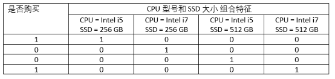
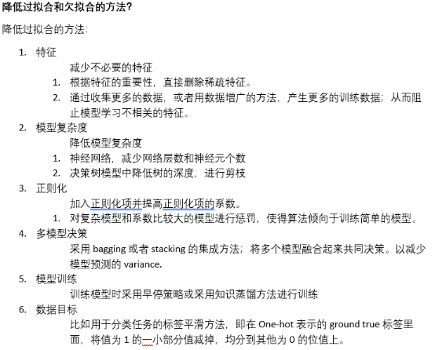

[TOC]

## Day 1

### 1.为什么要对特征做归一化

 

### 2.什么是组合特征？ 如何处理高维组合特征？

狭义的组合特征即将类别特征（Categorical feature）两个或者多个特征组合（数学里面的组合概念）起来，构成高阶组合特征。

比如：假设Mac笔记本电脑的CPU型号和SSD大小对是否购买行为的影响用下面的表格表示

 

那么CPU型号和SSD大小的组合特征对是否购买行为的影响为

###  3.请比较欧式距离与曼哈顿距离

### 4.为什么一些场景中使用余弦相似度而不是欧式距离

### 5.One-hot的作用是什么？为什么不直接使用数字作为表示？

One-hot 主要用来编码类别特征，即采用哑变量(dummy variables) 对类别进行编码。它的作用是避免因将类别用数字作为表示而给函数带来抖动。直接使用数字会给将人工误差而导致的假设引入到类别特征中，比如类别之间的大小关系，以及差异关系等等。

### 6.在模型评估过程中，过拟合和欠拟合具体指什么现象？

过拟合是指模型对于训练数据拟合呈过当的情况，反映到评估指标上，就是模型在训练集上的表现好，但是在测试集和新数据上的表现较差。欠拟合指的是模型在训练和预测时表现都不好。用模型在数据上的偏差和方差指标来表示就是。欠拟合时候，偏差和方差都比较大，而过拟合时，偏差较小但方差较大。

###  7.降低过拟合和欠拟合的方法?

###  8.L1和L2正则先验分别服从什么分布

### 9.对于树形结构为什么不需要归一化？

决策树的学习过程本质上是选择合适的特征，分裂并构建树节点的过程；而分裂节点的标准是由树构建前后的信息增益，信息增益比以及基尼系数等指标决定的。这些指标与当前特征值的大小本身并无关系。

### 10.什么是数据不平衡，如何解决？

数据不平衡主要指的是在有监督机器学习任务中，样本标签值的分布不均匀。这将使得模型更倾向于将结果预测为样本标签分布较多的值，从而使得少数样本的预测性能下降。绝大多数常见的机器学习算法对于不平衡数据集都不能很好地工作。

解决方法：

1. 重新采样训练集

   a.    欠采样 –减少丰富类的大小来平衡数据集

   b.    过采样 – 增加稀有样本，通过使用重复，自举或合成少数类

2. 设计使用不平衡数据集的模型

   a.    在代价函数中惩罚稀有类别的错误分类。

##  Day 2

### 1.逻辑回归相比于线性回归,有何异同

### 2.回归常用的性能评价指标有哪些?

### 3.常见分类问题的评价指标

### 4.逻辑回归的损失函数

**极大似然估计** 

是一种根据结果即 预测值来推测参数的一种普遍方法。提到极大似然是为了引出逻辑回归因为二项分布而得到的似然函数

### 5.逻辑回归处理多标签分类问题时,一般怎么做?

### 6.写出全概率公式&贝叶斯公式

### 7.朴素贝叶斯为什么"朴素 naive"

### 8.朴素贝叶斯有没有超参数可以调?

### 9.朴素贝叶斯的工作流程是怎样的?

### 10.朴素贝叶斯对异常值敏感吗?

