## 一、线程基本

From B站视频

[Linux多线程](https://www.bilibili.com/video/BV1bJ41117ho?p=5)

基于C语言,主要是学习基本概念

### 1.基本概念(♦♦)

**进程**：一个正在执行的程序，是**资源分配**的最小单位

一个可执行文件运行起来,就是一个进程被创建了;

**线程**：

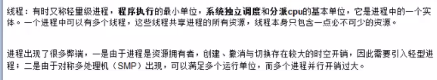

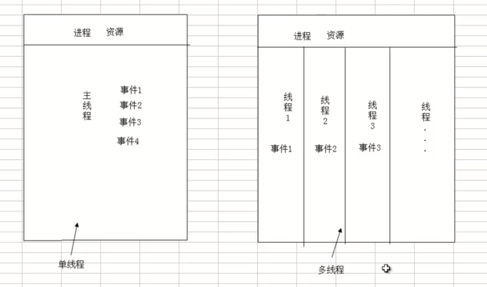

进程都有一个唯一的**主线程**,主线程执行main()函数,执行完return后,此时主线程结束运行,整个进程结束运行.

除了主线程外,可以写代码创建其他线程;

**并发：**

在同一时刻，只能有一条指令执行，但多个进程指令被快速轮换执行，使得在宏观上具有多个进程同时执行的效果。

看起来同时发生，单核上发生。

**并行：**

在同一时刻，有多条指令在多个处理器上同时执行，

真正的同时发生；

**同步：**

彼此有依赖关系的调用不应该“同时发生”，同步就是要阻止那些“同时发生”的事情

**异步：**

和同步相对，任何两个彼此独立的操作都是异步的，它表示事情独立的发生

**多线程的优势：**

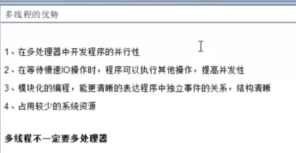

#### 线程ID:

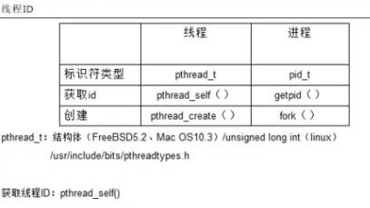

### 2.线程的生命周期(♦♦♦)

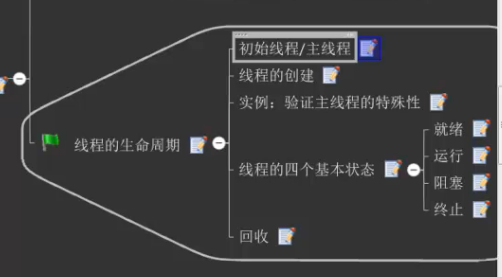

​                                                                                                                                                                                                                                                                                                                              

#### 2.1 主线程

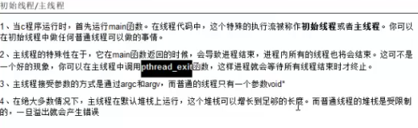

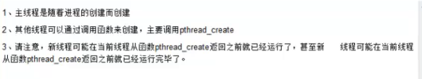

#### 2.2 线程的四个基本状态

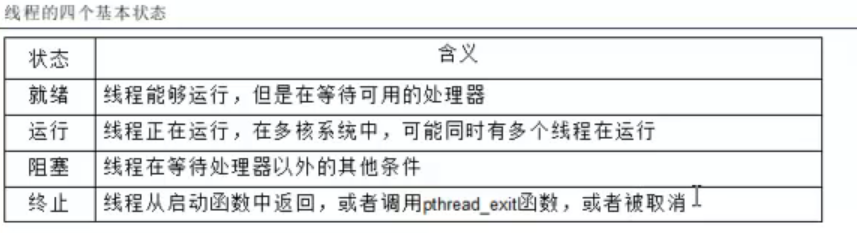

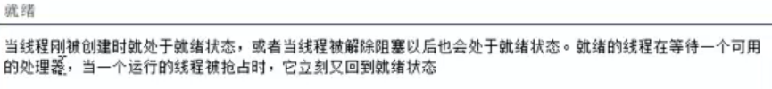

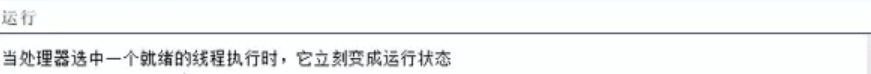

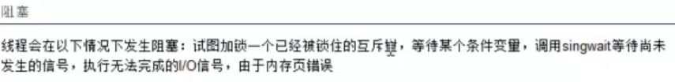

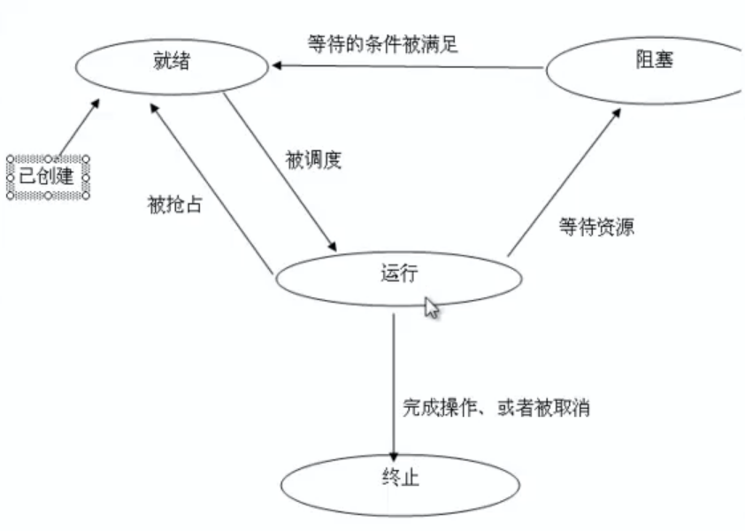

#### 2.3 线程的回收

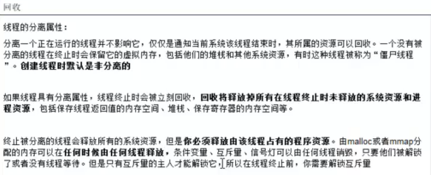

### 3.线程基本控制(♦♦)

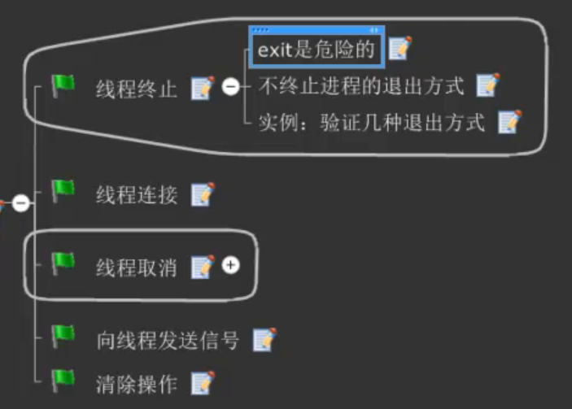

#### 3.1 线程的终止

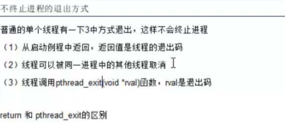

#### 3.2 线程的连接

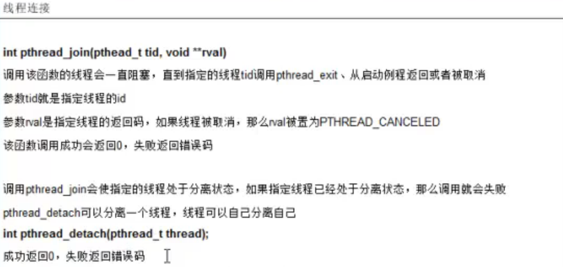

#### 3.3 线程的取消

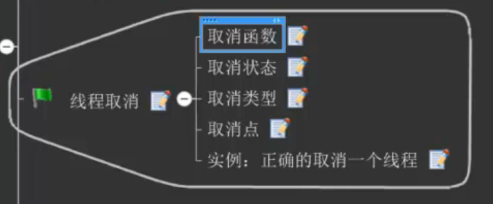

基于C的,没有细看

### 4 线程的同步(♦♦♦♦♦)

**同步：**

彼此有依赖关系的调用不应该“同时发生”，同步就是要阻止那些“同时发生”的事情

#### 4.1 互斥量

1.**概念**

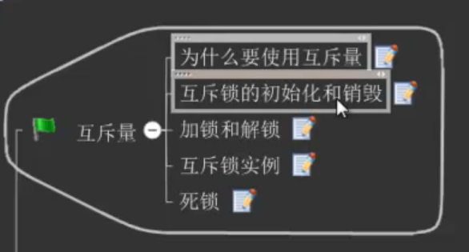

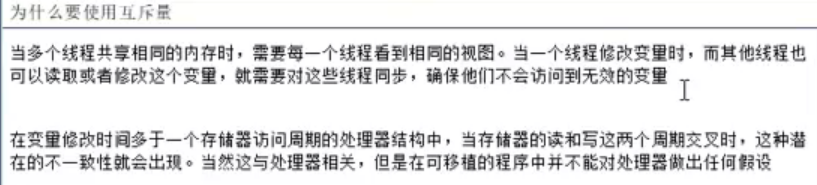

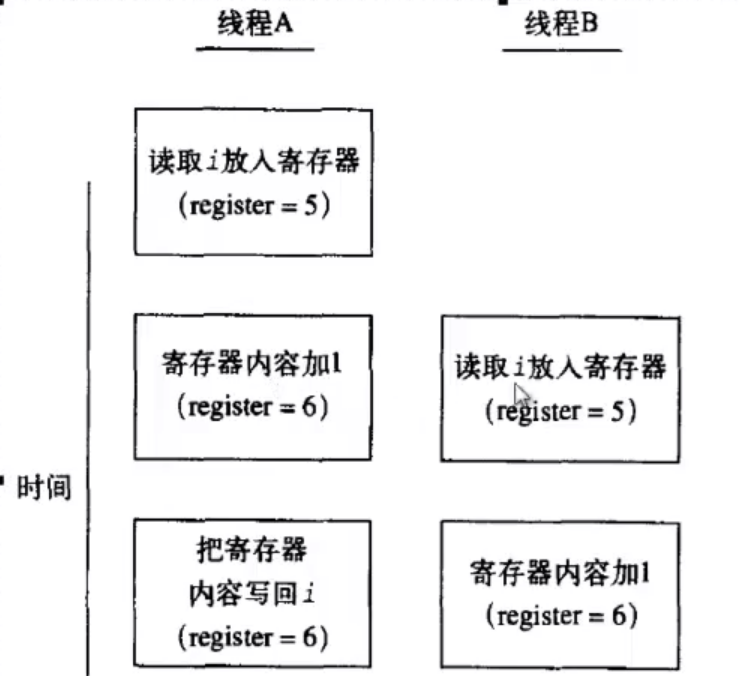

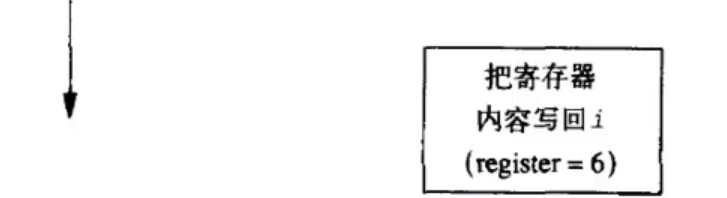

线程B的i应该为7,应为AB都加了一次

2.**互斥量的使用**

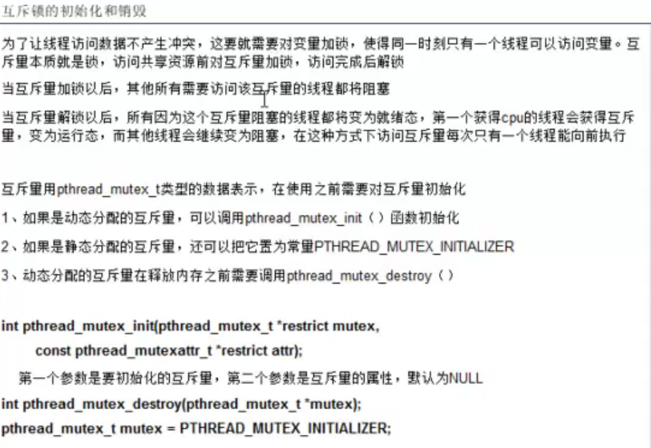

#### 4.2 读写锁

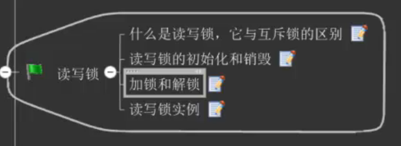

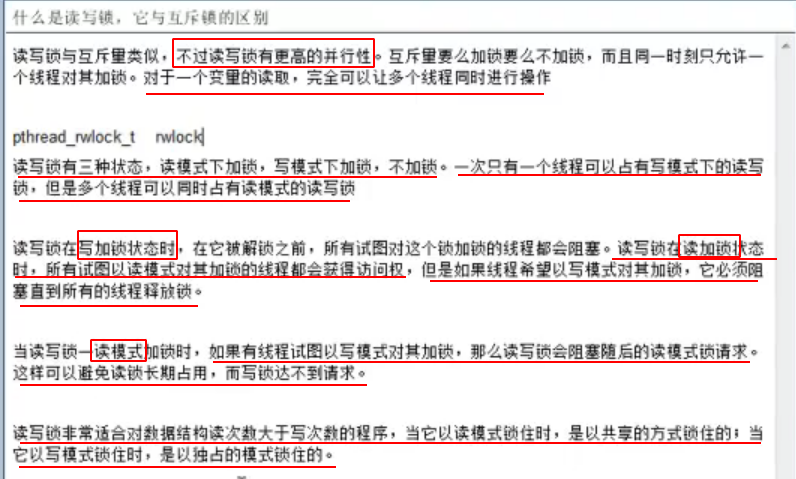

#### 4.3 条件变量

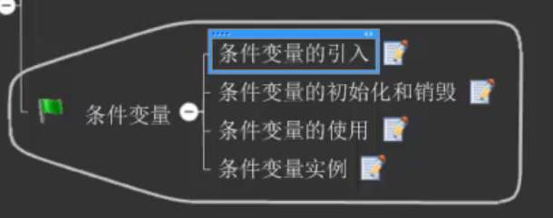

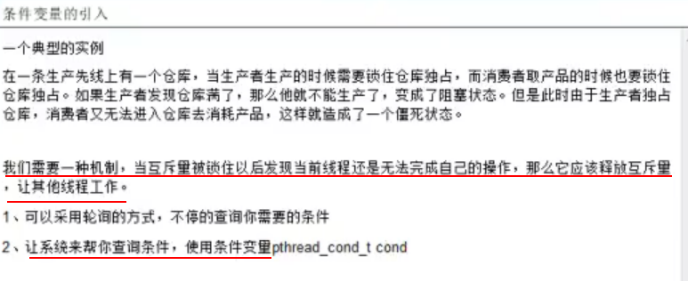

#### 4.4 死锁

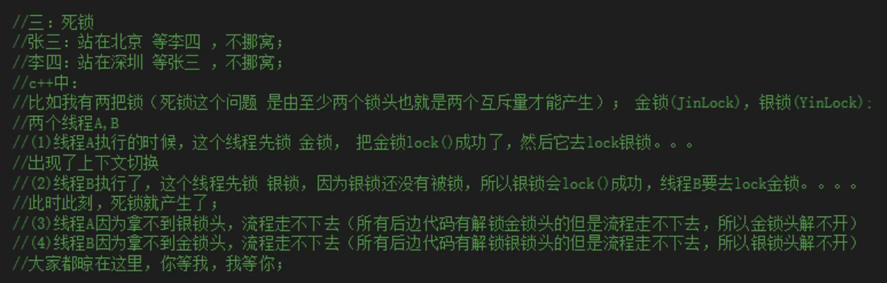

## 二 C++11多线程

> C++11 新标准中引入了四个头文件来支持多线程编程，他们分别是`<atomic> ,<thread>,<mutex>,<condition_variable>和<future>。`
>
> `<atomic>：`该头文主要声明了两个类, std::atomic 和 std::atomic_flag，另外还声明了一套 C 风格的原子类型和与 C 兼容的原子操作的函数。
> `<thread>：`该头文件主要声明了 std::thread 类，另外 std::this_thread 命名空间也在该头文件中。
> `<mutex>：`该头文件主要声明了与互斥量(mutex)相关的类，包括 std::mutex 系列类，std::lock_guard, std::unique_lock, 以及其他的类型和函数。
> `<condition_variable>：`该头文件主要声明了与条件变量相关的类，包括 std::condition_variable 和 std::condition_variable_any。
> `<future>：`该头文件主要声明了 std::promise, std::package_task 两个 Provider 类，以及 std::future 和 std::shared_future 两个 Future 类，另外还有一些与之相关的类型和函数，std::async() 函数就声明在此头文件中。

程序在`/home/swc/study/c++ study/C_plus_study_many_threads_1`

(edited in CLion)

### 1.线程的创建和执行

#### 1、成员类型和成员函数。

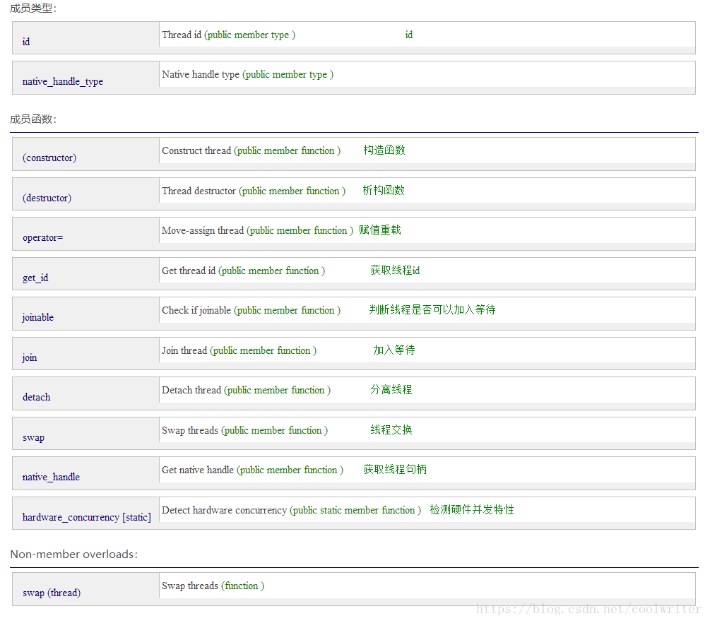

#### 2、std::thread 构造函数。

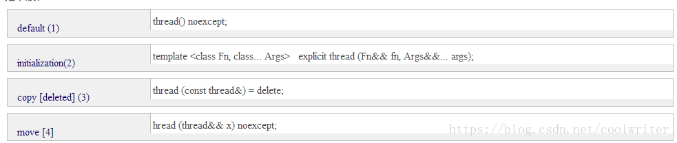
(1).默认构造函数，创建一个空的 thread 执行对象。
(2).初始化构造函数，创建一个 thread 对象，该 thread 对象可被 joinable，新产生的线程会调用 fn 函数，该函数的参数由 args 给出。
(3).拷贝构造函数（被禁用），意味着 thread 不可被拷贝构造。
(4).move 构造函数，move 构造函数，调用成功之后 x 不代表任何 thread 执行对象。
注意：可被 joinable 的 thread 对象必须在他们销毁之前被主线程 join 或者将其设置为 detached。

