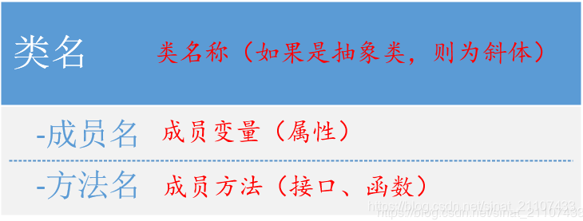

# C++设计模式

# 1.设计模式概述

## 1.1 设计模式定义

软件设计模式（Design pattern），又称设计模式，是一套被反复使用、多数人知晓的、经过分类编目的、代码设计经验的总结。

**设计模式主要是为了解决某类重复出现的问题而出现的一套成功或有效的解决方案。**

设计模式提供一种讨论软件设计的公共语言，使得熟练设计者的设计经验可以被初学者和其他设计者掌握。

设计模式还为软件重构提供了目标;

在他的经典著作《建筑的永恒之道》中，他给出了关于模式的定义：

> 每个模式都描述了一个在我们的环境中不断出现的问题，然后描述了该问题的解决方案的核心，
>
> 通过这种方式，我们可以无数次地重用那些已有的成功的解决方案，无须再重复相同的工作。

设计模式一般包含模式名称、问题、目的、解决方案、效果等要素：

+ **模式名称(Pattern Name)**：通过一两个词来描述模式的问题、解决方案和效果，以便更好地理解模式并方便开发人员之间的交流，绝大多数模式都是根据其功能或模式结构来命名的；
+ **问题(Problem)**：描述应该在何时使用模式，包含了设计中存在的问题以及问题存在的原因；
+ **解决方案(Solution**)：描述一个设计模式的组成成分，以及这些组成成分之间的相互关系，各自的职责和协作方式，**通常解决方案通过UML类图和核心代码来进行描述；**
+ **效果(Consequences)**：描述了模式的**优缺点**以及在使用模式时应权衡的问题

## 1.2 设计模式作用和分类

从上述设计模式的定义可以初步看出设计模式的作用，即：

> 设计模式(Design Pattern)是一套被反复使用、多数人知晓的、经过分类编目的、代码设计经验的总结，使用设计模式是为了可重用代码、让代码更容易被他人理解并且保证代码可靠性。
>

+ 设计模式是从许多优秀的软件系统中总结出的成功的、能够实现可维护性复用的设计方案，可避免重复性工作
+ 设计模式提供了一套通用的设计词汇和一种通用的形式来方便开发人员之间沟通，使得设计方案更加通俗易懂
+ 大部分设计模式兼顾了系统的可重用性和可扩展性，这使得我们可以更好地重用一些已有的设计方案、功能模块甚至一个完整的软件系统，避免我们经常做一些重复的设计、编写一些重复的代码
+ 有助于初学者更加深入地理解面向对象思想

狭义的设计模式一般分为**3大类共计23种**（广义上说，随着软件技术的逐步发展，不断有新的设计模式被总结出来并应用到工程实践中），如下表。

其中，**创建型模式关注对象的创建过程，结构性模式关注如何将现有类或对象组织在一起形成更加强大的结构，行为型模式关注系统中对象之间的交互研究系统在运行时对象之间的相互通信与协作，进一步明确对象的职责。**

| **类型**       | **种类**                                                     |
| -------------- | ------------------------------------------------------------ |
| **创建型模式** | 单例模式，简单工厂模式，抽象工厂模式，工厂方法模式，原型模式，建造者模式 |
| **结构型模式** | 适配器模式，桥接模式，组合模式，装饰模式，外观模式，享元模式，代理模式 |
| **行为型模式** | 职责链模式，命令模式，解释器模式，迭代器模式，中介者模式，备忘录模式，观察者模式，状态模式，策略模式，模板方法模式，访问者模式 |

## 1.3 设计模式的优点

设计模式是从众多优秀的软件系统中总结出的成功的、能够实现可维护性复用的设计方案，使用这些方案将避免一些重复性工作，高效设计出高质量的软件系统。总的来说，设计模式主要有以下优点：

+ 设计模式融合了众多专家的经验，以一种标准的形式供广大开发人员使用，通俗的设计词汇和通用的语言方便开发人员交流和学习；
+ 设计模式使人们可以更简单方便地复用成功的设计，使新开发者更容易理解设计思路；
+ 设计模式使设计方案更加灵活、易于修改；
+ 设计模式的使用将提高软件系统的开发效率和软件质量，节约开发成本；
+ 设计模式有助于初学者深入理解面向对象思想。

## 1.4 常用的设计模式

1.工厂模式

2.策略模式

3.单例模式

# 2.UML类图介绍

在正式介绍设计模式之前，我们有必要学习一下UML类图，因为我们需要一种直观的表示方法来描述设计模式，这种方法即是UML类图.

UML-Unified Model Language 统一建模语言，是在开发阶段，说明、可视化、构建和书写一个面向对象软件的开放方法。统一建模语言（UML）是一种模型化语言，通过一系列标准的图形符号来描述系统。**一份典型的建模图表通常包含几个块或框，连接线和作为模型附加信息之用的文本**。**UML类图是用户将所希望描述的事物抽象为类，描述类的内部结构和类之间关系的设计视图。**

## 2.1 UML类图常用关系

在UML类图中，常有以下几种关系：泛化(Generalization)、实现(Realization)、关联(Association)、聚合(Aggregation)、组合(Composition)和依赖(Dependency)。按照关系的强弱顺序：泛化≥实现>关联>聚合>组合>依赖。

## 2.2 UML模型结构

UML是一种主要由图形符号表达的建模语言，其结构主要包括：

+ **视图**（View）：从不同角度来表示待建模系统，视图是由许多图形组成的一个抽象集合；一个系统模型可能有多个视图，每个视图从特定角度来描述系统的特征，比如用户视图、结构视图、行为视图、实现视图等。

+ **图**（Diagram）：UML图是UML视图内容的图形，比如用例图、类图、对象图、包图等。

+ **模型元素**（Model Element）：指UML图中使用的一些概念，如类、对象、消息，以及概念之间的关系，如关联关系、以来关系等。

+ **通用机制**（General Mechanism）：UML提供的通用机制为模型元素提供额外的注释、语义和扩展机制，允许用户对UML进行扩展。

## 2.3 UML类的表示

如图，类由一个矩形框表示，矩形框分为3层：

+ 第一层：类的名称；如果该类是抽象类，则使用斜体；
+ 第二层：类的属性，即成员变量，[可见性]名称：类型[=默认值]；
+ 第三层：类的方法，即成员函数，[可见性]名称（[参数列表]）[：返回类型]。

成员变量和成员方法前面有权限修饰符：

+ “-”：private——私有
+ “+”：public——公有
+ “#”：protected——保护性

## 2.4 泛化(Generalization)

+ 含义：**类的继承关系**。
+ 表示：用空心三角和实线，空心三角指向父类。
+ 举例：狗和猫都是一种动物。

## 2.5 实现(Realization)

+ 含义：**类与接口的关系**，表示类是接口所有特征和行为的实现。
+ 表示：用空心三角和虚线，空心三角指向接口。
+ 举例：狗和猫实现了动物的“eat()”和"run()"的接口。

## 2.6 关联(Association)

关联是一种拥有关系（**has**），**一个类可以调用另一个类的公有的属性和方法**。**在类中以成员变量的方式表示。**

比如老师有自己的学生，知道学生的姓名学号成绩；学生有自己的老师，也知道老师的姓名和所教的科目。

关联分为单向关联、双向关联和自关联。

### 2.6.1 单向关联

+ 含义：只有一方可以调用对方的共同属性和方法
+ 表示：带箭头的直线表示。
+ 举例：老师（Teacher类）有（**has**）自己的地址（Address类）

### 2.6.2 双向关联

+ 含义：指双方都知道对方的存在，都可以调用对方的公共属性和方法。
+ 表示：用一条直线连接两个类，也可以用双向箭头。
+ 举例：老师（Teacher类）有自己的学生（Student类），学生也有自己的老师。

### 2.6.3 自关联

+ 含义：自己引用自己
+ 表示：带箭头的直线，指向自己。
+ 举例：二叉树结构体（刷题时经常碰见吧）

### 2.6.4 多重性关联

+ 含义：对象之间存在多种多重性关联关系，如下表：

+ 表示：带箭头的直线，指向有关系的对象，可以在关联直线上用一个数字或数字范围表示。
+ 举例：一个窗体界面对象有多个按钮对象

## 2.7 聚合(Aggregation)

+ 含义：**整体与部分的关系，部分离开整体后可以单独存在**。常用于类的成员变量。
+ 表示：带空心菱形和箭头的直线（或没有箭头），菱形挨着整体，箭头指向部分。
+ 举例：汽车和轮胎，轮胎是汽车的一部分，但轮胎也可以单独存在。

## 2.8 组合(Composition)

+ 含义：整体与部分的关系，**部分离开整体后\**不可以\**单独存在**，**代表整体的对象负责代表部分的对象的生命周期**。常用于类的成员变量。
+ 表示：带实心菱形和箭头的直线（或没有箭头），菱形挨着整体，箭头指向部分。
+ 举例：公司和部门，部门是公司的一部分，但部门不可以单独存在。

## 2.9 依赖(Dependency)

+ 含义：是一种使用的关系，即一个类的实现需要另一个类的协助，常用于**类方法的局部变量、方法参数**等。
+ 表示：带箭头的虚线，箭头指向协助的类（下面例子中箭头指向Food类）。
+ 举例：Animal的eat()方法的参数是Food

## 2.10 注意事项

**注意：关联、聚合和组合、依赖的区别**

+ 关联代表类与类的关系；
+ 聚合和组合代表整体与部分的关系；
+ 依赖是一种弱的关系，表示一个类的方法的实现需要用到另一个类，**但二者之间并没有明显的关系**。

# 3.简单工厂模式