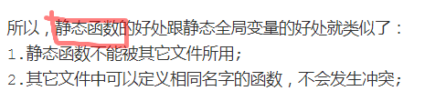

## 1.引用和指针的区别

1) ==指针是一个实体==，需要==分配内存空间==。引用只是变量的==别名==，不需要==分配内存空间==。

2) ==引用==在定义的时候==必须进行初始化==，并且不能够改变(为其他变量的引用)。

​	指针在定义的时候不一定要初始化，并且指向的空间可变。（注：不能有引用的值不能为 NULL）

3) 有==多级指针==，但是没有多级引用，只能有一级引用。

4) 指针和引用的自增运算结果不一样。（指针是指向下一个空间，引用时引用的变量值加 1）

5) ==sizeof==引用得到的是所指向的变量（对象）的大小，而 sizeof 指针得到的是指针本身的大小。

6) 引用访问一个变量是直接访问，而指针访问一个变量是间接访问。

7) 使用指针前最好做==类型检查==，防止野指针的出现；

避免野指针的产生

“野指针”的成因主要有：

1）指针变量没有被初始化。任何指针变量刚被创建时不会自动成为NULL指针，它的缺省值是随机的，它会乱指一气。所以，指针变量在创建的同时应当被初始化，要么将指针设置为NULL，要么让它指向合法的内存。

`char *p; //此时p为野指针`
2）指针p被free或者delete之后，没有置为NULL，让人误以为p是个合法的指针.

```C++
char *p=new char[10];  //指向堆中分配的内存首地址，p存储在栈区
cin>> p;
delete []p; //p重新变为野指针
```


3）指针操作超越了变量的作用范围。          

```C++
char *p=new char[10]; //指向堆中分配的内存首地址
cin>> p;
cout<<*(p+10); //可能输出未知数据
```

8) ==引用底层==是通过==指针==实现的；

9) 作为参数时也不同，传指针的实质是传值，传递的值是指针的地址；传引用的实质是传地址，传递的是变量的地址。

## 2. 从汇编层去解释一下引用


## 3.C++中的指针参数传递和引用参数传递

1) ==指针参数传递==本质上是==值传递==，它所传递的是一个==地址值==。

值传递过程中，被调函数的形式参数作为被调函数的局部变量处理，会在栈中开辟内存空间以存放由主调函数传递进来的实参值，

从而形成了实参的一个副本（替身）。

值传递的特点是，被调函数对形式参数的任何操作都是作为局部变量进行的，不会影响主调函数的实参变量的值（形
参指针变了，实参指针不会变）

平时说指针传递可以改变值,是可以改变传递进来的指针变量表示的地址中的内容,但是这个指针变量是不会变换的,地址是形参;

2) ==引用参数传递==过程中，被调函数的形式参数也作为局部变量在栈中开辟了内存空间，但
是这时存放的是由主调函数放进来的==实参变量的地址==。 被调函数对形参（ 本体）的任何
操作都被处理成==间接寻址==，即通过==栈中存放的地址访问主调函数中的实参变量==（根据别
名找到主调函数中的本体）。==因此，被调函数对形参的任何操作都会影响主调函数中的
实参变量==。

3) 引用传递和指针传递是不同的，虽然他们都是在==被调函数栈空间上==的一个==局部变量==，

但是任何对于引用参数的处理都会通过一个间接寻址的方式操作到主调函数中的相关变量。

而对于指针传递的参数，如果改变被调函数中的指针地址，它将应用不到主调函数的相关变量。

如果想通过指针参数传递来改变主调函数中的相关变量（地址），那就得使用指向指针的指针或者指针引用。

4) 从编译的角度来讲，程序在编译时分别将指针和引用添加到符号表上，符号表中记录的
是变量名及变量所对应地址。指针变量在符号表上对应的地址值为指针变量的地址值，
而引用在符号表上对应的地址值为引用对象的地址值（与实参名字不同，地址相同）。
符号表生成之后就不会再改，因此指针可以改变其指向的对象（指针变量中的值可以
改），而引用对象则不能修改。

## 4.形参与实参的区别？

1) 形参变量只有在==被调用时才分配内存单元==，在调用结束时， 即刻释放所分配的内存
单元。因此， ==形参只有在函数内部有效==。 函数调用结束返回主调函数后则不能再使
用该形参变量。

2) 实参可以是常量、变量、表达式、函数等， 无论实参是何种类型的量，在进行函数
调用时，它们都必须具有确定的值， 以便把这些值传送给形参。 因此==应预先用赋
值，输入等办法使实参获得确定值，会产生一个临时变量==。

3) ==实参和形参在数量上，类型上，顺序上应严格一致==， 否则会发生“ 类型不匹配” 的
错误。

4) ==函数调用中发生的数据传送是单向的==。 即只能把实参的值传送给形参，而不能把形
参的值反向地传送给实参。 ==因此在函数调用过程中，形参的值发生改变，而实参中
的值不会变化==。

5) 当形参和实参不是指针类型时，在该函数运行时，==形参和实参是不同的变量，他们
在内存中位于不同的位置，形参将实参的内容复制一份，在该函数运行结束的时候
形参被释放==，而实参内容不会改变。


1) 值传递：有一个==形参向函数所属的栈拷贝数据的过程==，如果==值传递的对象是类对象
或是大的结构体对象，将耗费一定的时间和空间==。 （传值）
2) 指针传递：同样有一个形参向函数所属的栈拷贝数据的过程，但拷贝的数据是一个
==固定为 4 字节的地址==。 （传值，传递的是地址值）
3) 引用传递：同样有上述的数据拷贝过程，但其是针对地址的，相当于==为该数据所在
的地址起了一个别名==。 （传地址）
4) 效率上讲， ==指针传递和引用传递比值传递效率高==。一般主张使用引用传递，代码逻
辑上更加紧凑、清晰。

## 5. static 的用法和作用？

1.**先来介绍它的第一条也是最重要的一条**： ==隐藏==。（ static 函数， static 变量均可）
当同时编译多个文件时，所有==未加 static 前缀==的全局变量和函数都具有全局可见性。


2.**static 的第二个作用是==保持变量内容的持久==。**

（ static 变量中的记忆功能和全局生存期）存储在静态数据区的变量会在==程序刚开始运行时就完成初始化==，也是唯一的一次初始化。

共有两种变量存储在静态存储区：全局变量和 static 变量，只不过和全局变量比起来， static 可以控制变量的可见范围，说到底 static 还是用来隐藏的。

**3.static 的第三个作用是==默认初始化为 0==（ static 变量）**

其实全局变量也具备这一属性，因为全局变量也存储在静态数据区。在静态数据区，内存中所有的字节默认值都是 0x00，某些时候这一特点可以减少程序员的工

作量。

**4.static 的第四个作用： ==C++中的类成员声明 static==**
1) 函数体内 static 变量的作用范围为该函数体，不同于 auto 变量，该变量的内存只被分配一次，==因此其值在下次调用时仍维持上次的值==；

2) 在模块内的 static 全局变量可以被模块内所用函数访问，但不能被模块外其它函数访问；

3) 在模块内的 static 函数只可被这一模块内的其它函数调用，这个函数的使用范围被限制在声明它的模块内；

4) 在类中的==static 成员变量属于整个类所拥有==，对类的所有对象只有一份拷贝；

5) 在类中的 ==static 成员函数属于整个类所拥有==，这个函数不接收 this 指针，因而只能访问类的 static 成员变量。

类内：

6) static 类对象必须要在==类外进行初始化==， ==static 修饰的变量先于对象存在，所以static 修饰的变量要在类外初始化==；

7) 由于 static 修饰的类成员属于类，不属于对象，因此 static 类成员函数是没有 this 指针的， this 指针是指向本对象的指针。正因为没有 this 指针，所以 ==static==

==类成员函数不能访问非 static 的类成员，只能访问 static 修饰的类成员==；

8) ==static 成员函数不能被 virtual 修饰==， static 成员不属于任何对象或实例，所以加上 virtual 没有任何实际意义；静态成员函数没有 this 指针，虚函数的实现是

为每一个对象分配一个 vptr 指针，而 vptr 是通过 this 指针调用的，所以不能为virtual；虚函数的调用关系， this->vptr->ctable->virtual function


c++static关键字的作用
以下是一般人都会背了的吧：

c/c++共有

           1）：修饰全局变量时，表明一个全局变量只对定义在同一文件中的函数可见。                         
    
           2）：修饰局部变量时，表明该变量的值不会因为函数终止而丢失。              
    
           3）：修饰函数时，表明该函数只在同一文件中调用。

c++独有：

           4）：修饰类的数据成员，表明对该类所有对象这个数据成员都只有一个实例。即该实例归 所有对象共有。
    
           5）：用static修饰不访问非静态数据成员的类成员函数。这意味着一个静态成员函数只能访问它的参数、类的静态数据成员和全局变量

以下各部分总结转载自：https://blog.csdn.net/majianfei1023/article/details/45290467





 

深究：
         （1）在头文件把一个变量申明为static变量，那么引用该头文件的源文件能够访问到该变量吗。

答：可以。声明static变量一般是为了在本cpp文件中的static变量不能被其他的cpp文件引用，但是对于头文件，因为cpp文件中包含了头文件，故相当于该static变量在本cpp文件中也可以被见到。当多个cpp文件包含该头文件中，这个static变量将在各个cpp文件中将是独立的，彼此修改不会对相互有影响。

https://blog.csdn.net/qq_17368865/article/details/79110149    （这篇文章谈到了头文件中声明static的利弊）

​     （2）为什么静态成员函数不能申明为const

答：这是C++的规则，const修饰符用于表示函数不能修改成员变量的值，该函数必须是含有this指针的类成员函数，函数调用方式为thiscall，而类中的static函数本质上是全局函数，调用规约是__cdecl或__stdcall,不能用const来修饰它。<span style="line-height:26px">一个静态成员函数访问的值是其参数、静态数据成员和全局变量，而这些数据都不是对象状态的一部分。而对成员函数中使用关键字const是表明：函数不会修改该函数访问的目标对象的数据成员。既然一个静态成员函数根本不访问非静态数据成员，那么就没必要使用const了

​     （3）为什么不能在类的内部定义以及初始化static成员变量，而必须要放到类的外部定义

答：因为静态成员属于整个类，而不属于某个对象，如果在类内初始化，会导致每个对象都包含该静态成员，这是矛盾的。参考两篇博客：

https://blog.csdn.net/jiayi_yao/article/details/50998765        https://blog.csdn.net/sevenjoin/article/details/81772792

​     （4）static关键字为什么只能出现在类内部的声明语句中，而不能重复出现在类外的定义中。

答：https://blog.csdn.net/wcybrain/article/details/79048052        https://blog.csdn.net/sinat_36053757/article/details/72636903   这两篇博客解释了一下。总的来说就是：如果类外定义函数时在函数名前加了static，因为作用域的限制，就只能在当前cpp里用，类本来就是为了给程序里各种地方用的，其他地方使用类是包含类的头文件，而无法包含类的源文件。

​     （5）为什么常量静态成员数据的初始化可以放在类内（注意：只有静态常量整型数据成员才可以在类中初始化）

答：是否可以这样理解: static数据成员在类外定义和初始化是为了保证只被定义和初始化一次,这样编译器就不必考虑类的函数里面第一个对static变量的’=’操作是赋值还是初始化了。 static const int可以在类里面初始化，是因为它既然是const的，那程序就不会再去试图初始化了。

​     （6）为什么静态成员函数只能访问静态成员变量。

答：1.静态成员函数只属于类本身，随着类的加载而存在，不属于任何对象，是独立存在的

 2.非静态成员当且仅当实例化对象之后才存在，静态成员函数产生在前，非静态成员函数产生在后，故不能访问

3.内部访问静态成员用self：：，而访问非静态成员要用this指针，静态成员函数没有this指针，故不能访问。

​     （7）静态成员函数与非静态成员函数的区别

答：根本区别：静态成员函数不存在this指针，不能访问非静态成员变量。https://blog.csdn.net/xiong452980729/article/details/71079827    这篇博客总结的还不错

​      （8）为什么要用得静态成员变量和静态成员函数

答：为了实现共享。因为静态成员函数和静态成员变量属于类，不属于类的实体，这样可以被多个对象所共享

​      （9）静态成员的作用、优点

答：静态成员函数主要为了调用方便，不需要生成对象就能调用。详细请看这两篇博客：https://www.cnblogs.com/jack-wangchong/p/7404748.html              https://blog.csdn.net/qq_38124695/article/details/78188411


## 6. 静态变量什么时候初始化

1) 初始化只有一次，但是可以多次赋值， 在主程序之前，编译器已经为其分配好了内存。

2) 静态局部变量和全局变量一样，数据都存放在全局区域，==所以在主程序之前，编译器已经为其分配好了内存==，但在 C 和 C++中静态局部变量的初始化节点又有

点不太一样。在 C 中，==初始化发生在代码执行之前，编译阶段分配好内存之后，就会进行初始化==，所以我们看到在 C 语言中无法使用变量对静态局部变量进行初

始化，在程序运行结束，变量所处的全局内存会被全部回收。

3) 而在 C++中，==在执行相关代码时才会进行初始化==，主要是由于 C++引入对象后，要进行初始化必须执行相应构造函数和析构函数，在构造函数或析构函

数中经常会需要进行某些程序中需要进行的特定操作，并非简单地分配内存。所以 C++标准定为全局或静态对象是有首次用到时才会进行构造，并通过 atexit()来

管理。在程序结束，按照构造顺序反方向进行逐个析构。所以在 C++中是可以使用变量对静态局部变量进行初始化的。

## 7. const?

1) ==阻止一个变量被改变==，可以使用 const 关键字。在定义该 const 变量时，通常需要对它进行初始化，因为以后就没有机会再去改变它了；

2) 对==指针来说==，可以指定指针本身为 const，也可以指定指针所指的数据为 const，或二者同时指定为 const；

3) 在一个函数声明中， ==const 可以修饰形参==，表明它是一个输入参数，在函数内部不能改变其值；

4) 对于类的成员函数，若指定其为 const 类型，则表明其是一个常函数，==不能修改类的成员变量==， ==类的常对象只能访问类的常成员函数==；

5) 对于类的成员函数，有时候必须指定其返回值为 const 类型，以使得其返回值不为“左值”。

6) ==const 成员函数==可以访问非 const 对象的非 const 数据成员、 const 数据成员，也可以访问 const 对象内的所有数据成员；

7) ==非 const 成员函数==可以访问非 const 对象的非 const 数据成员、 const 数据成员，但不可以访问 const 对象的任意数据成员；

(以上两条,涉及到函数值传递)

8) 一个没有明确声明为 const 的成员函数被看作是将要修改对象中数据成员的函数，而且编译器不允许它为一个 const 对象所调用。

因此 const 对象只能调用 const 成员函数。

9) const 类型变量可以通过类型转换符 ==const_cast== 将 const 类型转换为非 const 类型；

```
const_cast<type_id> (expression)
```

该运算符用来修改类型的 const 或 volatile 属性。除了 const 或 volatile 修饰之外， type_id 和 expression 的类型是一样的。常量指针被转化成非常量指针，并且仍然指向原来的对象；常量引用被转换成非常量引用，并且仍然指向原来的对象；常量对象被转换成非常量对象


10) ==const 类型变量必须定义的时候进行初始化==，因此也导致如果类的成员变量有 const类型的变量，那么==该变量必须在类的初始化列表中进行初始化==；

11) 对于函数值传递的情况，因为参数传递是通过复制实参创建一个临时变量传递进函数的， ==函数内只能改变临时变量==，但无法改变实参。则这个时候无论加不加

const对实参不会产生任何影响。但是在==引用或指针传递函数调用==中，因为传进去的是一个引用或指针，这样函数内部可以改变引用或指针所指向的变量，这时

 const 才是实实在在地保护了实参所指向的变量。因为在编译阶段编译器对调用函数的选择是根据实参进行的，所以，==只有引用传递和指针传递可以用是否加 const 来重载==。 一个拥有==顶层 const 的形参==无法和另一个==没有顶层 const 的形参==区分开来。


https://www.runoob.com/w3cnote/cpp-const-keyword.html

const 是 constant 的缩写，本意是不变的，不易改变的意思。在 C++ 中是用来修饰内置类型变量，自定义对象，成员函数，返回值，函数参数。

C++ const 允许指定一个语义约束，编译器会强制实施这个约束，允许程序员告诉编译器某值是保持不变的。如果在编程中确实有某个值保持不变，就应该明确使用const，这样可以获得编译器的帮助。

### 一、const修饰普通类型的变量

```C++
const int  a = 7; 
int  b = a; // 正确
a = 8;       // 错误，不能改变
```

a 被定义为一个常量，并且可以将 a 赋值给 b，但是不能给 a 再次赋值。对一个常量赋值是违法的事情，因为 a 被编译器认为是一个常量，其值不允许修改。

### 二、const 修饰指针变量。

const 修饰指针变量有以下三种情况。

+ A: const 修饰指针指向的内容，则内容为不可变量。
+ B: const 修饰指针，则指针为不可变量。
+ C: const 修饰指针和指针指向的内容，则指针和指针指向的内容都为不可变量。

对于 A:

```C++
const int *p = 8;
int b = 7;
// *p = 9; // 错误 *p 内存地址的值不能改变
// p = &b; // 正确,p指针变量不是const的 p可以变成别的变量的地址
```

则指针指向的内容 8 不可改变。简称左定值，因为 const 位于 * 号的左边。

对于 B:

```C++
int a = 8;
int* const p = &a;
*p = 9; // 正确
int  b = 7;
p = &b; // 错误
```

对于 const 指针 p 其指向的内存地址不能够被改变，但其内容可以改变。简称，右定向。因为 const 位于 * 号的右边。

对于 C: **则是 A 和 B的合并**

```
int a = 8;
const int * const  p = &a;
```

这时，const p 的指向的内容和指向的内存地址都已固定，不可改变。

对于 A，B，C 三种情况，根据 const 位于 * 号的位置不同，我总结三句话便于记忆的话：**"左定值，右定向，const修饰不变量"**。

### 三、const参数传递和函数返回值。

对于 const 修饰函数参数可以分为三种情况。

A：值传递的 const 修饰传递，一般这种情况不需要 const 修饰，因为函数会自动产生临时变量复制实参值。

```C++
#include<iostream>
 
using namespace std;
 
void Cpf(const int a)
{
    cout<<a;
    // ++a;  是错误的，a 不能被改变
}
 
int main(void)
 
{
    Cpf(8);
    system("pause");
    return 0;
}
```

B：当 const 参数为指针时，可以防止指针被意外篡改。

```C++
#include<iostream>
 
using namespace std;
 
void Cpf(int *const a)
{
    cout<<*a<<" ";
    *a = 9;
}
 
int main(void)
{
    int a = 8;
    Cpf(&a);
    cout<<a; // a 为 9
    system("pause");
    return 0;
}
```

C：自定义类型的参数传递，需要临时对象复制参数，对于临时对象的构造，需要调用构造函数，比较浪费时间，因此我们采取 const 外加引用传递的方法。

并且对于一般的 int、double 等内置类型，我们不采用引用的传递方式。

```C++
#include<iostream>
 
using namespace std;
 
class Test
{
public:
    Test(){}
    Test(int _m):_cm(_m){}
    int get_cm()const
    {
       return _cm;
    }
 
private:
    int _cm;
};

void Cmf(const Test& _tt)
{
    cout<<_tt.get_cm();
}
 
int main(void)
{
    Test t(8);
    Cmf(t);
    system("pause");
    return 0;
}
```

结果输出 **8**。

**对于 const 修饰函数的返回值。**

Const 修饰返回值分三种情况。

A：const 修饰内置类型的返回值，修饰与不修饰返回值作用一样。

```C++
#include<iostream>
 
using namespace std;
 
const int Cmf()
{
    return 1;
}
 
int Cpf()
{
    return 0;
}
 
int main(void)
{
    int _m = Cmf();
    int _n = Cpf();
 
    cout<<_m<<" "<<_n;
    system("pause");
    return 0;
}
```

B: const 修饰自定义类型的作为返回值，此时返回的值不能作为左值使用，既不能被赋值，也不能被修改。

C: const 修饰返回的指针或者引用，是否返回一个指向 const 的指针，取决于我们想让用户干什么。

### 四、const修饰类成员函数

const 修饰类成员函数，其目的是防止成员函数修改被调用对象的值，如果我们不想修改一个调用对象的值，所有的成员函数都应当声明为 const 成员函数。

**==注意：==**const 关键字不能与 static 关键字同时使用，因为 static 关键字修饰静态成员函数，静态成员函数不含有 this 指针，即不能实例化，const 成员函数必须具体到某一实例。

下面的 get_cm()const; 函数用到了 const 成员函数：

```C++
#include<iostream>
 
using namespace std;
 
class Test
{
public:
    Test(){}
    Test(int _m):_cm(_m){}
    int get_cm()const
    {
       return _cm;
    }
 
private:
    int _cm;
};
 
 
 
void Cmf(const Test& _tt)
{
    cout<<_tt.get_cm();
}
 
int main(void)
{
    Test t(8);
    Cmf(t);
    system("pause");
    return 0;
}
```

如果 get_cm() 去掉 const 修饰，则 Cmf 传递的 const _tt 即使没有改变对象的值，编译器也认为函数会改变对象的值(非const成员函数无法访问const对象的任意数据成员)所以我们尽量按照要求将所有的不需要改变对象内容的函数都作为 const 成员函数。

> 6) ==const 成员函数==可以访问非 const 对象的非 const 数据成员、 const 数据成员，也可以访问 const 对象内的所有数据成员；
>
> 7) ==非 const 成员函数==可以访问非 const 对象的非 const 数据成员、 const 数据成员，但不可以访问 const 对象的任意数据成员；

如果有个成员函数想修改对象中的某一个成员怎么办？这时我们可以使用 mutable 关键字修饰这个成员，mutable 的意思也是易变的，容易改变的意思，被 mutable 关键字修饰的成员可以处于不断变化中，如下面的例子。

```C++
#include<iostream>
using namespace std;
class Test
{
public:
    Test(int _m,int _t):_cm(_m),_ct(_t){}
    void Kf()const
    {
        ++_cm; // 错误
        ++_ct; // 正确
    }
private:
    int _cm;
    mutable int _ct;
};
 
int main(void)
{
    Test t(8,7);
    return 0;
}
```

这里我们在 Kf()const 中通过 `++_ct`; 修改 `_ct` 的值，但是通过 `++_cm` 修改 `_cm` 则会报错。因为` ++_cm` 没有用 mutable 修饰。

## 8. const 成员函数的理解和应用？

① const Stock & Stock::topval (②const Stock & s) ③const

①处 const：确保返回的 Stock 对象在以后的使用中不能被修改

②处 const：确保此方法不修改传递的参数 S

③处 const： 保证此方法不修改调用它的对象， const 对象只能调用 const 成员函数,不能调用非 const 函数

## 9. 指针和 const 的用法

1) 当 const 修饰指针时，由于 const 的位置不同，它的修饰对象会有所不同。

2) `int *const p2` 中 const 修饰 p2 的值,所以理解为 p2 的值不可以改变，即 p2 只能指向固定的一个变量地址，但可以通过*p2 读写这个变量的值。 顶层指针表示指针本身是一个常量;

3) `int const *p1` 或者 `const int *p1` 两种情况中 const 修饰`*p1`，所以理解为`*p1` 的值不可以改变，即不可以给`*p1` 赋值改变 p1 指向变量的值，但可以通过给 p 赋值不同的地址改变这个指针指向。 底层指针表示指针所指向的变量是一个常量。

4) `int const *const p`  指针本身和指针指向的变量都是常量

## 10.mutable

1) 如果需要在 ==const 成员方法中修改一个成员变量的值==，那么需要将这个成员变量修饰为 mutable。即用 ==mutable 修饰的成员变量不受 const 成员方法的限制==;

2) 可以认为 mutable 的变量是类的辅助状态，但是只是起到类的一些方面表述的功能，修改他的内容我们可以认为对象的状态本身并没有改变的。实际上由于 

==const_cast==的存在，这个概念很多时候用处不是很到了。


## 11.友元

生活中你的家有客厅(public)，有你的卧室(private)
客厅所有来的客人都可以进去，但是你的卧室是私有的，也就是说只有你能进去

但是呢，你也可以允许 **隔壁老王** 进去。

**在程序里，有些私有属性 也想让类外特殊的一些函数或者类进行访问，就需要用到友元的技术**

**友元的目的** 就是让一个函数或者类 访问另一个类中的私有成员

**友元的关键字为** friend

**友元的三种实现**

+ 全局函数做友元
+ 类做友元
+ 成员函数做友元

关于友元，有两点需要说明：

+ 友元的关系是单向的而不是双向的。如果声明了类 B 是类 A 的友元类，不等于类 A 是类 B 的友元类，类 A 中的成员函数不能访问类 B 中的 private 成员。
+ 友元的关系不能传递。如果类 B 是类 A 的友元类，类 C 是类 B 的友元类，不等于类 C 是类 A 的友元类。


除非有必要，一般不建议把整个类声明为友元类，而只将某些成员函数声明为友元函数，这样更安全一些。

### 1 全局函数做友元

首先，我们要定义一个房屋类，公共成员变量为客厅，私有成员变量为卧室

```C++
class Building
{
public:
	// Building的构造函数，给成员变量赋初值
	Building()
	{
		m_SittingRoom = "客厅";
		m_BedRoom = "卧室";
	}
	
	string m_SittingRoom;	// 客厅

private:
	string m_BedRoom;		// 卧室
};
```

然后定义一个全局函数 laoWang()，用来访问Building类中的私有成员

```C++
void laoWang1(Building *building)
{
	cout << "隔壁老王 全局函数 正在访问：（地址传递） " << building->m_SittingRoom << endl;

	cout << "隔壁老王 全局函数 正在访问：（地址传递） " << building->m_BedRoom << endl;
}
```

当然也可以用引用传递或者最简单的值传递

```C++
void laoWang2(Building &building)
{
	cout << "隔壁老王 全局函数 正在访问：（引用传递） " << building.m_SittingRoom << endl;

	cout << "隔壁老王 全局函数 正在访问：（引用传递） " << building.m_BedRoom << endl;
}

void laoWang3(Building building)
{
	cout << "隔壁老王 全局函数 正在访问：（ 值传递 ） " << building.m_SittingRoom << endl;

	cout << "隔壁老王 全局函数 正在访问：（ 值传递 ） " << building.m_BedRoom << endl;
}
```

最后定义一个测试函数test()，实现 **laoWang()** 这个全局函数做友元访问类的私有成员

```C++
void test()
{
	Building building;
	laoWang1(&building);
	laoWang2(building);
	laoWang3(building);
}
```

**但是，现在还不能实现全局函数访问类的私有成员！**

**==关键代码==**

```C++
friend void laoWang1(Building *building);
friend void laoWang2(Building &building);
friend void laoWang3(Building building);
```

在Building类中声明**友元函数**，告诉编译器 **laoWang**全局函数是 **Building**类 的好朋友，**可以访问Building对象的私有成员**

```C++
class Building
{
	// 告诉编译器 laoWang全局函数是 Building类  的好朋友，可以访问Building对象的私有成员
	friend void laoWang1(Building *building);
	friend void laoWang2(Building &building);
	friend void laoWang3(Building building);

public:
	Building()
	{
		m_SittingRoom = "客厅";
		m_BedRoom = "卧室";
	}
	
	string m_SittingRoom;	// 客厅

private:

	string m_BedRoom;		// 卧室
};
```

完整代码:

```C++
#include <iostream>
#include <string>

using namespace std;

// 房屋类
class Building
{
	// 告诉编译器 laoWang全局函数是 Building类  的好朋友，可以访问Building对象的私有成员
	friend void laoWang1(Building *building);
	friend void laoWang2(Building &building);
	friend void laoWang3(Building building);

public:

	Building()
	{
		m_SittingRoom = "客厅";
		m_BedRoom = "卧室";
	}
	
	string m_SittingRoom;	// 客厅

private:

	string m_BedRoom;		// 卧室
};


//全局函数
void laoWang1(Building *building)
{
	cout << "隔壁老王 全局函数 正在访问：（地址传递） " << building->m_SittingRoom << endl;

	cout << "隔壁老王 全局函数 正在访问：（地址传递） " << building->m_BedRoom << endl;
}

void laoWang2(Building &building)
{
	cout << "隔壁老王 全局函数 正在访问：（引用传递） " << building.m_SittingRoom << endl;

	cout << "隔壁老王 全局函数 正在访问：（引用传递） " << building.m_BedRoom << endl;
}

void laoWang3(Building building)
{
	cout << "隔壁老王 全局函数 正在访问：（ 值传递 ） " << building.m_SittingRoom << endl;

	cout << "隔壁老王 全局函数 正在访问：（ 值传递 ） " << building.m_BedRoom << endl;
}

void test()
{
	Building building;
	laoWang1(&building);
	laoWang2(building);
	laoWang3(building);
}


int main()
{
	test();
}
```

### 2 类做友元

友元类的成员函数可以访问它的友元的私有变量;

不仅可以将一个函数声明为一个类的“朋友”，还可以将整个类声明为另一个类的“朋友”，这就是友元类。友元类中的所有成员函数都是另外一个类的友元函数。

例如将类 B 声明为类 A 的友元类，那么类 B 中的所有成员函数都是类 A 的友元函数，可以访问类 A 的所有成员，包括 public、protected、private 属性的。


首先，声明一个要访问的私有变量所属的Building类，防止在下面的好LaoWang类中，编译器不认识Building（当然也可以采取先定义Building类，再定义隔壁老王LaoWang类，这样就不用声明Building类了）

```C++
class Building;
```

然后定义一个隔壁老王LaoWang类，声明了一个Building类型的指针变量building。其中，成员函数采用另一种方式：类内声明，类外定义，可以简化类的内容（在全局函数做友元的示例中，采用在类内声明并定义成员函数的方式，两种方式均可）

```C++
class LaoWang
{
public:
	//LaoWang的构造函数
	LaoWang();

	void visit();	//参观函数  访问Building中的属性

	Building * building;


private:


};
```

接着给出Building类的定义

```C++
class Building
{
public:
	//Building的构造函数类内声明，在类外定义
	Building();
		
	string m_SittingRoom;	// 客厅
	
private:
	
	string m_BedRoom;		// 卧室

};

```

下面给出**类外定义成员函数**，需要注意的是，在类外定义，需要在成员函数加上所在类的作用域（**类名::成员函数名()**），以便于告诉编译器，该成员函数属于哪个类。

```C++
//Building类的构造函数
Building::Building()
{
	m_SittingRoom = "客厅";
	m_BedRoom = "卧室";

	cout << m_SittingRoom << endl;
	cout << m_BedRoom << endl;

}

//LaoWang的构造函数
LaoWang::LaoWang()
{
	// 创建建筑物对象
	building = new Building;	//在堆区开辟一块内存，并赋给building指针

}

//LaoWang的成员函数visit()
void LaoWang::visit()
{
	cout << "隔壁老王类正在访问：" << building->m_SittingRoom << endl;

	cout << "隔壁老王类正在访问：" << building->m_BedRoom << endl;
}
```

最后定义一个测试函数，实现类做友元访问其他类的私有成员

```C++
void test()
{
	LaoWang lw	//定义一个LaoWang类的对象;
	lw.visit();
}
```

但是，现在还不能实现一个类访问另一个类的私有成员！

**关键代码**

```cpp
friend class LaoWang;
```

在Building类中声明一个友元类，告诉编译器 LaoWang类是 Building类 的好朋友，可以访问Building对象的私有成员

```C++
class Building
{
	// 告诉编译器，LaoWang类是Building类的好朋友，可以访问Building类的私有成员
	friend class LaoWang;
public:
	

	Building();
		
	string m_SittingRoom;	// 客厅

private:
	

	string m_BedRoom;		// 卧室

};
```

完整代码:

```C++
#include <iostream>
#include <string>

using namespace std;

// 类作友元

class Building;
class LaoWang
{
public:

	LaoWang();

	void visit();	//参观函数  访问Building中的属性

	Building * building;


private:


};

// 房屋类
class Building
{
	// 告诉编译器，LaoWang类是Building类的好朋友，可以访问Building类的私有成员
	friend class LaoWang;
public:
	
	Building();
		
	string m_SittingRoom;	// 客厅
	
private:
	
	string m_BedRoom;		// 卧室
};

// 类外定义成员函数

Building::Building()
{
	m_SittingRoom = "客厅";
	m_BedRoom = "卧室";
}

LaoWang::LaoWang()
{
	// 创建建筑物对象
	building = new Building;
}

void LaoWang::visit()
{
	cout << "隔壁老王LaoWang类正在访问：" << building->m_SittingRoom << endl;

	cout << "隔壁老王LaoWang类正在访问：" << building->m_BedRoom << endl;
}

void test()
{
	LaoWang lw;
	lw.visit();
}

int main()
{
	test();

	return 0;
}
```

### 3 成员函数做友元

类似于类作友元，我们首先声明一个Building类，防止在下面的好LaoWang类中，编译器不认识Building

```C++
class Building;
```

然后定义LaoWang类，同样采用成员函数在类内声明，类外定义的方式。其中定义两个访问函数

+ visit1()，**可以** 访问Building中的私有成员
+ visit2()，**不可以** 访问Building中的私有成员

```C++
class LaoWang
{
public:

	LaoWang();
	void visit1();	//让visit1()函数   可以 访问Building中的私有成员
	void visit2();	//让visit2()函数 不可以 访问Building中的私有成员

	Building *building;

private:

};
```

下面给出Building类的定义

```C++
class Building
{
public:
	Building();

	string m_SittingRoom;	//客厅
	
private:

	string m_BedRoom;		//卧室
};
```

下面给出**类外定义成员函数**

```C++
//LaoWang类的构造函数
LaoWang::LaoWang()
{
	building = new Building;
}

//LaoWang类的成员函数visit1()
void LaoWang::visit1()
{
	cout << "隔壁老王LaoWang类中的visit1()函数正在访问：" << building->m_SittingRoom << endl;
	cout << "隔壁老王LaoWang类中的visit1()函数正在访问：" << building->m_BedRoom << endl;	
}

//LaoWang类的成员函数visit2()
void LaoWang::visit2()
{
	cout << "隔壁老王LaoWang类中的visit2()函数正在访问：" << building->m_SittingRoom << endl;
	//cout << "隔壁老王LaoWang类中的visit2()函数正在访问：" << building->m_BedRoom << endl;	//错误！私有属性不可访问
}

//Building类的构造函数
Building::Building()
{
	m_SittingRoom = "客厅";
	m_BedRoom = "卧室";
}
```

最后用一个测试函数实现成员函数做友元实现对另一个类私有成员的访问

```C++
void test()
{
	LaoWang lw;
	
	lw.visit1();

	lw.visit2();
}
```

同样的，现在还没有声明友元，因此类中的成员函数还不能访问另一个类的私有成员

**关键代码**

```cpp
friend void LaoWang::visit1();
```

在Building类中声明一个**友元成员函数**，告诉编译器 **visit1()**成员函数是 **Building**类 的好朋友，**可以访问Building对象的私有成员**

```C++
class Building
{
	// 告诉编译器，LaoWang类下的visit1()函数是Building类的好朋友，可以访问Building的私有成员
	friend void LaoWang::visit1();

public:
	Building();

	string m_SittingRoom;	//客厅
	
private:

	string m_BedRoom;		//卧室
};
```

完整代码:

```C++
#include <iostream>
#include <string>

using namespace std;

class Building;

class LaoWang
{
public:

	LaoWang();
	void visit1();	//让visit1()函数   可以 访问Building中的私有成员
	void visit2();	//让visit2()函数 不可以 访问Building中的私有成员

	Building *building;

private:

	
};

class Building
{
	// 告诉编译器，LaoWang类下的visit1()函数是Building类的好朋友，可以访问Building的私有成员
	friend void LaoWang::visit1();

public:
	Building();

	string m_SittingRoom;	//客厅
private:

	string m_BedRoom;		//卧室
};


LaoWang::LaoWang()
{
	building = new Building;
}

void LaoWang::visit1()
{
	cout << "隔壁老王LaoWang类中的visit1()函数正在访问：" << building->m_SittingRoom << endl;
	cout << "隔壁老王LaoWang类中的visit1()函数正在访问：" << building->m_BedRoom << endl;
}

void LaoWang::visit2()
{
	cout << "隔壁老王LaoWang类中的visit2()函数正在访问：" << building->m_SittingRoom << endl;
	//cout << "隔壁老王LaoWang类中的visit2()函数正在访问：" << building->m_BedRoom << endl;	//错误！私有属性不可访问
}

Building::Building()
{
	m_SittingRoom = "客厅";
	m_BedRoom = "卧室";
}

void test()
{
	LaoWang lw;
	
	lw.visit1();

	lw.visit2();
}

int main()
{
	test();
	
	return 0;
}
```

## 12.智能指针

1) C++11 中引入了智能指针的概念，方便管理堆内存。使用普通指针， 容易造成==堆内存泄露==（忘记释放），二次释放，程序发生异常时内存泄露等问题等，使用智能指针能更好的管理堆内存。
2) 智能指针在 C++11 版本之后提供，包含在头文件` <memory>`中， shared_ptr、unique_ptr、 weak_ptr。

==shared_ptr 多个指针指向相同的对象。== shared_ptr 使用引用计数，每一个 shared_ptr 的拷贝都指向相同的内存。每使用他一次，内部的引用计数加 1，每析构

一次，内部的引用计数减 1，减为 0 时，自动删除所指向的堆内存。shared_ptr 内部的引用计数是线程安全的，但是对象的读取需要加锁。

3) 初始化。 

智能指针是个==模板类==，可以指定类型， 传入指针通过构造函数初始化。也可以使用 make_shared 函数初始化。 

==不能将指针直接赋值给一个智能指针，一个是类，一个是指针。==例如 `std::shared_ptr<int> p4 = new int(1);`的写法是错误的

拷贝和赋值。

拷贝使得对象的引用计数增加 1， 赋值使得原对象引用计数减 1，当计数为 0 时，自动释放内存。

后来指向的对象引用计数加 1，指向后来的对象

4) unique_ptr==“ 唯一” 拥有其所指对象==，同一时刻只能有一个 unique_ptr 指向给定对象（通过禁止拷贝语义、只有移动语义来实现）。

相比与原始指针 unique_ptr 用于其 RAII 的特性， 使得在出现异常的情况下，动态资源能得到释放。

unique_ptr 指针本身的生命周期：从 unique_ptr 指针创建时开始，直到离开作用域。

离开作用域时，若其指向对象， 则将其所指对象销毁(默认使用 delete 操作符，用户可指定其他操作)。 

unique_ptr 指针与其所指对象的关系：在智能指针生命周期内，可以改变智能指针所指对象，如创建智能指针时通过构造函数指定、通过 reset 方法重新指定、
通过 release 方法释放所有权、通过移动语义转移所有权。

5) 智能指针类将一个计数器与类指向的对象相关联，引用计数跟踪该类有多少个对象共享同一指针。每次创建类的新对象时，初始化指针并将引用计数置为 1；

当对象作为另一对象的副本而创建时，拷贝构造函数拷贝指针并增加与之相应的引用计数；

对一个对象进行赋值时， 赋值操作符减少左操作数所指对象的引用计数（如果引用计数为减至 0，则删除对象），并增加右操作数所指对象的引用计数；

调用析构函数时，构造函数减少引用计数（如果引用计数减至 0，则删除基础对象）。

6) weak_ptr 是一种不控制对象生命周期的智能指针, 它指向一个 shared_ptr 管理的对象. 进行该对象的内存管理的是那个强引用的 shared_ptr. 

weak_ptr 只是提供了对管理对象的一个访问手段。

 weak_ptr 设计的目的是为配合 shared_ptr 而引入的一种智能指针来协助 shared_ptr 工作, 它只可以从一个 shared_ptr 或另一个 weak_ptr 对象构造, 它的构造和析构不会引起引用记数的增加或减少.


## 13.怎么实现死锁

当一个多线程程序中存在多个互斥资源时，就有可能造成死锁。

比如有两个线程T1和T2,两个互斥锁A和B，线程T1拿到了锁A，在等待锁B，一直到等到B才能往下执行，释放锁A，而此时线程T2拿到了锁B，在等待锁A，一直到等到A才能往下执行，然后释放锁B。即线程T1和T2在等对方持有的锁，又都不肯释放锁，这时候线程T1和T2就会一直等下去了，在等待，永远在等待。这就是死锁。

```C++
Thread T1              Thread T2
A.lock()          		B.lock()
   //死锁               //死锁
B.lock()         		A.lock()
A.unlock()				B.unlock()
```

```C++
#include <iostream>
#include <thread>
#include <mutex>
 
std::mutex mtxA;
std::mutex mtxB;
 
void threadT1()
{
    std::unique_lock<std::mutex> lockA(mtxA);
	std::cout << "threasT1 got mtxA" << std::endl;
	// 线程1睡眠2s再获取锁B，保证锁B先被线程2获取，模拟死锁问题的发生
	std::this_thread::sleep_for(std::chrono::seconds(2));
 
	std::cout << "threasT1 try to get mtxB" << std::endl;
	std::unique_lock<std::mutex> lockB(mtxB);
	std::cout << "threasT1 got mtxB" << std::endl;
	std::cout << "threasT1 quit" << std::endl;	
}
 
 
void threadT2()
{
	std::unique_lock<std::mutex> lockB(mtxB);
	std::cout << "threasT2 got mtxB" << std::endl;
	// 线程2睡眠2s再获取锁A，保证锁A先被线程1获取，模拟死锁问题的发生
	std::this_thread::sleep_for(std::chrono::seconds(2));
 
	std::cout << "threasT2 try to get mtxA" << std::endl;
	std::unique_lock<std::mutex> lockA(mtxA);
	std::cout << "threasT2 got mtxA" << std::endl;
	std::cout << "threasT2 quit" << std::endl;
}
 
int main()
{
	std::thread t1(threadT1);
	std::thread t2(threadT2);
	// main主线程等待所有子线程执行完
	t1.join();
	t2.join();
	std::cout << "threasT1 threasT2 all quit" << std::endl;
	system("pause");
	return 0;
}
```


线程1一直在等待资源B，线程B一直在等待资源A，两个线程都在等待，没有退出


**解决死锁**

由于多个线程获取多个锁资源的时候，顺序不一致导致的死锁问题，那么保证它们获取锁的顺序是一致的，问题就可以解决。针对上面的代码线程1和线程B都先获取A再获取B，修改线程2函数如下。

```C++
void threadT2()
{
	std::unique_lock<std::mutex> lockA(mtxA);
	std::cout << "threasT2 got mtxA" << std::endl;
	// 线程2睡眠2s再获取锁A，保证锁A先被线程1获取，模拟死锁问题的发生
	std::this_thread::sleep_for(std::chrono::seconds(2));
 
	std::cout << "threasT2 try to get mtxB" << std::endl;
	std::unique_lock<std::mutex> lockB(mtxB);
	std::cout << "threasT2 got mtxB" << std::endl;
	std::cout << "threasT2 quit" << std::endl;
}
```

 运行结果如下


多线程问题通常难于复现，难以调查。与其事后修改不如写代码时预防。编写多线程需要注意的问题参考

c++多线程编程遇到的问题小结。

有以下几点

1、对类中成员函数加读写专用函数，专用函数中加互斥锁进行保护。

2、类中的成员函数要尽量避免在没有保护的情况下对某个成员变量的多次读取或者修改。

3、当一个加锁的函数中调用了另一个加锁函数时要注意检查连个函数的锁，**如果是同一把锁，会造成死锁。**

4、当一个函数中有**多个线程使用多个锁时要检查有没有类似于第一部分相互等待的造成的死锁问题。**

5、对于加锁的不可重入的函数，要使用pthread_mutex_trylock

对一个函数加锁，只能保证一个函数不会被多个线程同时执行，但是无法避免多个线程先后执行同一个函数，这时可以使用try_lock函数。该如果互斥锁当前被另一个线程锁定，则该函数将失败并返回false，而不会阻塞。

## 14.重载和重写,重定义

**一：重载**
重载指的是在同一个作用域内，两函数的函数名可以相同，但是参数不能完全相同，可以是==参数类型不同或者是参数个数不同==，==至于返回值，不影响重载==。

如图，构成了重载：


如何实现重载？
C++代码在编译时会根据参数列表对函数进行重命名，例如`void Test(int a, int b)`会被重命名为`_Test_int_int` 

`  void Test(int x, double y) `会被重命名为`_Test_int_double`。所以说函数重载从底层上看它们还是不同的函数。

**二：重定义**
重定义也叫隐藏，指的是在继承关系中，子类实现了一个和父类名字一样的函数，（==只关注函数名，和参数与返回值无关==）这样的话子类的函数就把父类的同名函数隐藏了。
举个例子，下面程序的运行结果为：

```C++
class A{
public:
    void f()
    {
        cout << "A" << endl;
    }

public:
    int _x;
};

class B : public A{
public:
    void f(int a)
    {
        cout << "B" << endl;
    }

public:
    int _x;
};

void test1()
{
    B b;
    b.f();
}
```

很明显，子类隐藏了父类的f函数，这个题目比较迷惑人的是子类的f函数有参数，所以会以为调的是父类的f函数；
但是隐藏只与函数名有关，与参数是没关系的，所以调用的还是子类的f函数，这个程序就跑不过。

程序编译不通过,因为类B 中实现了一个和父类 类A 中的一个同名函数,虽然参数不同,但是也把它隐藏了,这样类B的对象就无法调用类A的f函数了,只能调用类B自己的带参数的f(int a);

**三：重写**
重写指的在继承关系中，子类重新定义父类虚函数的方法;
具体怎么相似：==函数名必须相同，参数列表必须相同，返回值可以不相同，但是必须是父子关系的指针或引用==。

通过重写，可以实现动态多态，何为动态多态，就是当父类的指针或引用指向被重写的虚函数时，父类的指针或引用指向谁就调用谁的虚函数，而不是说根据类型。
在这里，如果去掉父类的虚函数的virtual，则构不成多态，如果去掉子类虚函数的virtual可以构成多态，可以理解为编译器优化。


重载：

是指允许存在多个同名函数，而这些函数的参数表不同（或许参数个数不同，或许参数类型不同，或许两者都不同）。
重写：

是指子类重新定义父类虚函数的方法。

从实现原理上来说：

​		重载：编译器根据函数不同的参数表，对同名函数的名称做修饰，然后这些同名函数就成了不同的函数（至少对于编译器来说是这样的）。

如，有两个同名函数： function func(p:integer):integer; 和 function func(p:string):integer;。那么编译器做过修饰后的函数名称可能是这样的： int_func、 str_func。对于这两个函数的调用，在编译器间就已经确定了，是**静态**的。也就是说，它们的地址在编译期就绑定了（早绑定），**因此，重载和多态无关！**
		**重写：和多态真正相关**。当子类重新定义了父类的虚函数后，父类指针根据赋给它的不同的子类指针，动态的调用属于子类的该函数，这样的函数调用在编译期间是无法确定的（调用的子类的虚函数的地址无法给出）。因此，这样的函数地址是在运行期绑定的（晚绑定）。

## 15.怎样检测内存泄露

“该死系统存在内存泄漏问题”，项目中由于各方面因素，总是有人抱怨存在内存泄漏，系统长时间运行之后，可用内存越来越少，甚至导致了某些服务失败。内存泄漏是最难发现的常见错误之一，因为除非用完内存或调用malloc失败，否则都不会导致任何问题。实际上，使用C/C++这类==没有垃圾回收机制的语言==时，你很多时间都花在处理如何正确释放内存上。如果程序运行时间足够长，如后台进程运行在服务器上，只要服务器不宕机就一直运行，一个小小的失误也会对程序造成重大的影响，如造成某些关键服务失败。

对于内存泄漏，本人深有体会！实习的时候，公司一个项目中就存在内存泄漏问题，项目的代码量非常大，后台进程也比较多，造成内存泄漏的地方比较难找。这次机会是我对如何查找内存泄漏问题，有了一定的经验，后面自己的做了相关实验，在此我分享一下内存泄漏如何调试查找，主要内容如下：

+ 1、内存泄漏简介
+ 2、Windows平台下的内存泄漏检测
  + 2.1、检测是否存在内存泄漏问题
  + 2.2、定位具体的内存泄漏地方
+ 3、Linux平台下的内存泄漏检测 
+ 4、总结

其实Windows、Linux下面的内存检测都可以单独开篇详细介绍，方法和工具也远远不止文中介绍到的，我的方法也不是最优的，如果您有更好的方法，也请您告诉我和大家。

### 1.内存泄漏简介及后果

wikipedia中这样定义内存泄漏：在计算机科学中，内存泄漏指由于疏忽或错误造成程序未能释放已经不再使用的内存的情况。内存泄漏并非指内存在物理上的消失，而是应用程序分配某段内存后，由于设计错误，导致在释放该段内存之前就失去了对该段内存的控制，从而造成了内存的浪费。

最难捉摸也最难检测到的错误之一是内存泄漏，即未能正确释放以前分配的内存的 bug。 只发生一次的小的内存泄漏可能不会被注意，但泄漏大量内存的程序或泄漏日益增多的程序可能会表现出各种征兆：从性能不良（并且逐渐降低）到内存完全用尽。 更糟的是，泄漏的程序可能会用掉太多内存，以致另一个程序失败，而使用户无从查找问题的真正根源。 此外，即使无害的内存泄漏也可能是其他问题的征兆。

内存泄漏会因为减少可用内存的数量从而降低计算机的性能。最终，在最糟糕的情况下，过多的可用内存被分配掉导致全部或部分设备停止正常工作，或者应用程序崩溃。内存泄漏可能不严重，甚至能够被常规的手段检测出来。在现代操作系统中，一个应用程序使用的常规内存在程序终止时被释放。这表示一个短暂运行的应用程序中的内存泄漏不会导致严重后果。

在以下情況，内存泄漏导致较严重的后果：

+ 程序运行后置之不理，并且随着时间的流失消耗越来越多的内存（比如服务器上的后台任务，尤其是[嵌入式系统](http://zh.wikipedia.org/wiki/嵌入式系统)中的后台任务，这些任务可能被运行后很多年内都置之不理）；
+ 新的内存被频繁地分配，比如当显示电脑游戏或动画视频画面时；
+ 程序能够请求未被释放的内存（比如[共享内存](http://zh.wikipedia.org/wiki/共享内存)），甚至是在程序终止的时候；
+ 泄漏在操作系统内部发生；
+ 泄漏在系统关键驱动中发生；
+ 内存非常有限，比如在[嵌入式系统](http://zh.wikipedia.org/wiki/嵌入式系统)或便携设备中；
+ 当运行于一个终止时内存并不自动释放的操作系统（比如[AmigaOS](http://zh.wikipedia.org/w/index.php?title=AmigaOS&action=edit&redlink=1)）之上，而且一旦丢失只能通过重启来恢复。

下面我们通过以下例子来介绍如何检测内存泄漏问题：

```C++
#include <stdlib.h>
#include <iostream>
using namespace std;
 
void GetMemory(char *p, int num)
{
    p = (char*)malloc(sizeof(char) * num);//使用new也能够检测出来
}
 
int main(int argc,char** argv)
{
    char *str = NULL;
    GetMemory(str, 100);
    cout<<"Memory leak test!"<<endl;
    //如果main中存在while循环调用GetMemory
    //那么问题将变得很严重
    //while(1){GetMemory(...);}
    return 0;
}
```

实际中不可能这么简单，如果这么简单也用不着别的方法，程序员一眼就可以看出问题，此程序只用于测试。

### 2、Windows平台下的内存泄漏检测

#### 2.1、检测是否存在内存泄漏问题

Windows平台下面Visual Studio 调试器和 C 运行时 (CRT) 库为我们提供了检测和识别内存泄漏的有效方法，原理大致如下：内存分配要通过CRT在运行时实现，只要在分配内存和释放内存时分别做好记录，程序结束时对比分配内存和释放内存的记录就可以确定是不是有内存泄漏。在vs中启用内存检测的方法如下：

+ STEP1，在程序中包括以下语句： （#include 语句必须采用上文所示顺序。 如果更改了顺序，所使用的函数可能无法正常工作。）

```C++
#define _CRTDBG_MAP_ALLOC
#include <stdlib.h>
#include <crtdbg.h>
```

通过包括 crtdbg.h，将 [malloc](http://msdn.microsoft.com/zh-cn/library/6ewkz86d.aspx) 和 [free](http://msdn.microsoft.com/zh-cn/library/we1whae7.aspx) 函数映射到它们的调试版本，即 [_malloc_dbg](http://msdn.microsoft.com/zh-cn/library/faz3a37z.aspx) 和 [_free_dbg](http://msdn.microsoft.com/zh-cn/library/16swbsbc.aspx)，这两个函数将跟踪内存分配和释放。 此映射只在调试版本（在其中定义了**_DEBUG**）中发生。 发布版本使用普通的 **malloc** 和 **free** 函数。

\#define 语句将 CRT 堆函数的基版本映射到对应的“Debug”版本。 并非绝对需要该语句；但如果没有该语句，内存泄漏转储包含的有用信息将较少。

+ STEP2， 在添加了上述语句之后，可以通过在程序中包括以下语句（==通常应恰好放在程序退出位置之前==）来转储内存泄漏信息：

```
_CrtDumpMemoryLeaks();
```

此时，完整的代码如下：

```C++
#define _CRTDBG_MAP_ALLOC
#include <stdlib.h>
#include <crtdbg.h>
 
#include <iostream>
using namespace std;
 
void GetMemory(char *p, int num)
{
    p = (char*)malloc(sizeof(char) * num);
}
 
int main(int argc,char** argv)
{
    char *str = NULL;
    GetMemory(str, 100);
    cout<<"Memory leak test!"<<endl;
    _CrtDumpMemoryLeaks();
    return 0;
}
```

当在调试器下运行程序时，[_CrtDumpMemoryLeaks](http://msdn.microsoft.com/zh-cn/library/d41t22sb.aspx) 将在[“输出”窗口](http://msdn.microsoft.com/zh-cn/library/3hk6fby3.aspx)中显示内存泄漏信息。 内存泄漏信息如下所示：

[](http://images.cnblogs.com/cnblogs_com/skynet/201102/20110220175032138.png)

如果没有使用 #define _CRTDBG_MAP_ALLOC 语句，内存泄漏转储将如下所示：

[](http://images.cnblogs.com/cnblogs_com/skynet/201102/201102201750331467.png)

未定义 _CRTDBG_MAP_ALLOC 时，所显示的会是：

+ 内存分配编号（在大括号内）。
+ [块类型](http://msdn.microsoft.com/zh-cn/library/htdyz80k.aspx)（普通、客户端或 CRT）。

> + “普通块”是由程序分配的普通内存。
> + “客户端块”是由 MFC 程序用于需要析构函数的对象的特殊类型内存块。 MFC new 操作根据正在创建的对象的需要创建普通块或客户端块。
> + “CRT 块”是由 CRT 库为自己使用而分配的内存块。 CRT 库处理这些块的释放，因此您不大可能在内存泄漏报告中看到这些块，除非出现严重错误（例如 CRT 库损坏）。
>
> 从不会在内存泄漏信息中看到下面两种块类型：
>
> + “可用块”是已释放的内存块。
> + “忽略块”是您已特别标记的块，因而不出现在内存泄漏报告中。

+ 十六进制形式的内存位置。
+ 以字节为单位的块大小。
+ 前 16 字节的内容（亦为十六进制）。

定义了 _CRTDBG_MAP_ALLOC 时，还会显示在其中分配泄漏的内存的文件。 文件名后括号中的数字（本示例中为 10）是该文件中的行号。

注意：如果程序总是在同一位置退出，调用 [_CrtDumpMemoryLeaks](http://msdn.microsoft.com/zh-cn/library/d41t22sb.aspx) 将非常容易。 如果程序从多个位置退出，则无需在每个可能退出的位置放置对 **_CrtDumpMemoryLeaks** 的调用，而可以在程序开始处包含以下调用：

```C++
_CrtSetDbgFlag ( _CRTDBG_ALLOC_MEM_DF | _CRTDBG_LEAK_CHECK_DF );
```

该语句在程序退出时自动调用 **_CrtDumpMemoryLeaks**。 必须同时设置 **_CRTDBG_ALLOC_MEM_DF** 和 **_CRTDBG_LEAK_CHECK_DF** 两个位域，如前面所示。

#### 2.2、定位具体的内存泄漏地方

通过上面的方法，我们几乎可以定位到是哪个地方调用内存分配函数malloc和new等，如上例中的GetMemory函数中，即第10行！但是不能定位到，在哪个地方调用GetMemory()导致的内存泄漏，而且在大型项目中可能有很多处调用GetMemory。如何要定位到在哪个地方调用GetMemory导致的内存泄漏？

定位内存泄漏的另一种技术涉及在关键点对应用程序的内存状态拍快照。 CRT 库提供一种结构类型 **_CrtMemState**，您可用它存储内存状态的快照：

```
_CrtMemState s1, s2, s3;
```

若要在给定点对内存状态拍快照，请向 [_CrtMemCheckpoint](http://msdn.microsoft.com/zh-cn/library/h3z85t43.aspx) 函数传递 **_CrtMemState** 结构。 该函数用当前内存状态的快照填充此结构：

```
_CrtMemCheckpoint( &s1 );
```

通过向 [_CrtMemDumpStatistics](http://msdn.microsoft.com/zh-cn/library/swh3417y.aspx) 函数传递 **_CrtMemState** 结构，可以在任意点转储该结构的内容：

```
_CrtMemDumpStatistics( &s1 );
```

若要确定代码中某一部分是否发生了内存泄漏，可以在该部分之前和之后对内存状态拍快照，然后使用 [_CrtMemDifference](http://msdn.microsoft.com/zh-cn/library/k4htzb06.aspx) 比较这两个状态：

```C++
_CrtMemCheckpoint( &s1 );
// memory allocations take place here
_CrtMemCheckpoint( &s2 );
if(_CrtMemDifference( &s3, &s1, &s2) )
	_CrtMemDumpStatistics( &s3 );
```

顾名思义，**_CrtMemDifference** 比较两个内存状态（s1 和 s2），生成这两个状态之间差异的结果（s3）。 在程序的开始和结尾放置 **_CrtMemCheckpoint** 调用，并使用**_CrtMemDifference** 比较结果，是检查内存泄漏的另一种方法。 如果检测到泄漏，则可以使用 **_CrtMemCheckpoint** 调用通过二进制搜索技术来划分程序和定位泄漏。

如上面的例子程序我们可以这样来定位确切的调用GetMemory的地方：

```C++
#define _CRTDBG_MAP_ALLOC
#include <stdlib.h>
#include <crtdbg.h>
 
#include <iostream>
using namespace std;
 
_CrtMemState s1, s2, s3;
 
void GetMemory(char *p, int num)
{
    p = (char*)malloc(sizeof(char) * num);
}
 
int main(int argc,char** argv)
{
    _CrtMemCheckpoint( &s1 );
    char *str = NULL;
    GetMemory(str, 100);
    _CrtMemCheckpoint( &s2 );
    if ( _CrtMemDifference( &s3, &s1, &s2) )
        _CrtMemDumpStatistics( &s3 );
    cout<<"Memory leak test!"<<endl;
    _CrtDumpMemoryLeaks();
    return 0;
}
```

调试时，程序输出如下结果：

[](http://images.cnblogs.com/cnblogs_com/skynet/201102/201102201750335022.png)

这说明在s1和s2之间存在内存泄漏！！！如果GetMemory不是在s1和s2之间调用，那么就不会有信息输出。

### 3、Linux平台下的内存泄漏检测

在上面我们介绍了，vs中在代码中“包含crtdbg.h，将 [malloc](http://msdn.microsoft.com/zh-cn/library/6ewkz86d.aspx) 和 [free](http://msdn.microsoft.com/zh-cn/library/we1whae7.aspx) 函数映射到它们的调试版本，即 [_malloc_dbg](http://msdn.microsoft.com/zh-cn/library/faz3a37z.aspx) 和 [_free_dbg](http://msdn.microsoft.com/zh-cn/library/16swbsbc.aspx)，这两个函数将跟踪内存分配和释放。 此映射只在调试版本（在其中定义了**_DEBUG**）中发生。 发布版本使用普通的 **malloc** 和 **free** 函数。”即为malloc和free做了钩子，用于记录内存分配信息。

Linux下面也有原理相同的方法——mtrace，http://en.wikipedia.org/wiki/Mtrace。方法类似，我这就不具体描述，参见给出的链接。这节我主要介绍一个非常强大的工具==**valgrind**==。如下图所示：

[](http://images.cnblogs.com/cnblogs_com/skynet/201102/201102201750352698.png)

如上图所示知道：

==6118== 100 bytes in 1 blocks are definitely lost in loss record 1 of 1
==6118==  at 0x4024F20: malloc (vg_replace_malloc.c:236)
==6118==  by 0x8048724: GetMemory(char*, int) (in /home/netsky/workspace/a.out)
==6118==  by 0x804874E: main (in /home/netsky/workspace/a.out)

是在main中调用了GetMemory导致的内存泄漏，GetMemory中是调用了malloc导致泄漏了100字节的内存。

> Things to notice:
> • There is a lot of information in each error message; read it carefully.
> • The 6118 is the process ID; it’s usually unimportant.
> • The first line ("Heap Summary") tells you what kind of error it is.
> • Below the first line is a stack trace telling you where the problem occurred. Stack traces can get quite large, and be
> confusing, especially if you are using the C++ STL. Reading them from the bottom up can help.
>
> • The code addresses (eg. 0x4024F20) are usually unimportant, but occasionally crucial for tracking down weirder
> bugs.
>
> The stack trace tells you where the leaked memory was allocated. Memcheck cannot tell you why the memory leaked,
> unfortunately. (Ignore the "vg_replace_malloc.c", that’s an implementation detail.)
> There are several kinds of leaks; the two most important categories are:
> • "definitely lost": your program is leaking memory -- fix it!
> • "probably lost": your program is leaking memory, unless you’re doing funny things with pointers (such as moving
> them to point to the middle of a heap block)

Valgrind的使用请见手册http://valgrind.org/docs/manual/manual.html。

## 16.内存中的堆和栈

下面就说说C语言程序内存分配中的堆和栈，这里有必要把内存分配也提一下，大家不要嫌我啰嗦，一般情况下程序存放在Rom（只读内存，比如硬盘）或Flash

中，运行时需要拷到RAM（随机存储器RAM）中执行，RAM会分别存储不同的信息，如下图所示：


内存中的栈区处于相对较高的地址以地址的增长方向为上的话，栈地址是向下增长的。

**栈中分配局部变量空间**，**堆区**是向上增长的用于**分配程序员申请的内存空间**。另外还有静态区是分配静态变量，全局变量空间的；只读区是分配常量和程序代码空

间的；以及其他一些分区。栈应该被看成一个短期存储数据的地方，存在在栈中的数据项没有名字，只是按照后进先出来操作罢了。栈经常可以用来在寄存器紧张

的情况下，临时存储一些数据，并且十分安全。当寄存器空闲后，我们可以从栈中弹出该数据，供寄存器使用。这种临时存放数据的特性，使得它经常用来存储局

部变量，函数参数，上下文环境等。

相反，堆相对于栈，更加强调需要进行控制。常见的就是我们手动申请，手动释放。因此可以分配更大的空间，但开销也会更多。

作者：QihuaZhou
链接：https://www.jianshu.com/p/52b5a1879aa1
来源：简书
著作权归作者所有。商业转载请联系作者获得授权，非商业转载请注明出处。

来看一个网上很流行的经典例子：

```C++
#include <stdio.h>
int a = 0; //全局初始化区
char *p1; //全局未初始化区

int main()
{
    int b; //栈
    char s[] = "abc"; //栈
    char *p2; //栈
    char *p3 = "123456"; //123456\0在常量区，p3在栈上
    static int c =0; //全局（静态）初始化区
    p1 = (char *)malloc(10); //堆
    p2 = (char *)malloc(20);  //堆

    return 0;
}
```

**栈应该被看成一个短期存储数据的地方**，存在栈中的数据项没有名字，只是按照后进先出来操作罢了。栈经常可以用来在寄存器紧张的情况下，临时存储一些数

据，并且十分安全。当寄存器空闲后，我们可以从栈中弹出该数据，供寄存器使用。**这种临时存放数据的特性，使得它经常用来存储局部变量，函数参数，上下文环境等。**

相反，堆相对于栈，更加强调需要进行控制。常见的就是我们手动申请，手动释放。因此可以分配更大的空间，但开销也会更多。


**0.申请方式和回收方式不同**

不知道你是否有点明白了。

堆和栈的第一个区别就是申请方式不同：栈（英文名称是stack）是**系统自动分配空间**的，例如我们定义一个 char a；系统会自动在栈上为其开辟空间。而堆（英

文名称是heap）则是**程序员根据需要自己申请的空间**，例如malloc（10）；开辟十个字节的空间。

由于栈上的空间是自动分配自动回收的，所以栈上的数据的生存周期只是在函数的运行过程中，运行后就释放掉，不可以再访问。

而堆上的数据只要程序员不释放空间，就一直可以访问到，不过缺点是一旦忘记释放会造成内存泄露。

 

**1.申请后系统的响应**

**栈**：只要栈的剩余空间大于所申请空间，系统将为程序提供内存，否则将报异常提示栈溢出。

**堆**：首先应该知道操作系统有一个记录空闲内存地址的链表，当系统收到程序的申请时，会遍历该链表，寻找第一个空间大于所申请空间的堆结点，然后将该结点

从空闲结点链表中删除，并将该结点的空间分配给程序，另外，对于大多数系统，会在这块内存空间中的首地址处记录本次分配的大小，这样，代码中的 delete语

句才能正确的释放本内存空间。另外，由于找到的堆结点的大小不一定正好等于申请的大小，系统会自动的将多余的那部分重新放入空闲链表中。 

也就是说**堆会在申请后还要做一些后续的工作这就会引出申请效率的问题。**

 

**2.申请效率的比较**

根据第0点和第1点可知。

**栈**：由系统自动分配，速度较快。但程序员是无法控制的。

**堆**：是由new分配的内存，一般速度比较慢，而且容易产生内存碎片,不过用起来最方便。

 

**3.申请大小的限制**

**栈**：在Windows下,栈是向低地址扩展的数据结构，是一块连续的内存的区域。这句话的意思是栈顶的地址和栈的最大容量是系统预先规定好的，在 WINDOWS下，栈的大小是2M（也有的说是1M，总之是一个编译时就确定的常数），如果申请的空间超过栈的剩余空间时，将提示overflow。因此，**能从栈获得的空间较小。** 

**堆**：堆是向高地址扩展的数据结构，是不连续的内存区域。这是由于系统是用链表来存储的空闲内存地址的，自然是不连续的，而链表的遍历方向是由低地址向高地址。堆的大小受限于计算机系统中有效的虚拟内存。由此可见，堆获得的空间比较灵活，也比较大。

 

**4.堆和栈中的存储内容**

**由于栈的大小有限，所以用子函数还是有物理意义的，而不仅仅是逻辑意义。**

**栈**： 在函数调用时，第一个进栈的是**主函数中函数调用后的下一条指令**（函数调用语句的下一条可执行语句）的地址，然后是函数的各个参数，在大多数的C编译器中，参数是由右往左入栈的，然后是**函数中的局部变量**。注意静态变量是不入栈的。 
当本次函数调用结束后，局部变量先出栈，然后是参数，最后栈顶指针指向最开始存的地址，也就是主函数中的下一条指令，程序由该点继续运行。 

**堆**：一般是在堆的头部用一个字节存放堆的大小。堆中的具体内容有程序员安排。

 

**5.存取效率的比较**

```
char s1[] = "aaaaaaaaaaaaaaa"; 
char *s2 = "bbbbbbbbbbbbbbbbb"; 
```

aaaaaaaaaaa是在运行时刻赋值的；放在栈中。 

而bbbbbbbbbbb是在编译时就确定的；放在堆中。 ps(堆中是存储对象的，而在栈中是存放引用)

但是，在以后的存取中，在栈上的数组比指针所指向的字符串(例如堆)快。 

## 17.虚函数和纯虚函数的概念以及区别

1) 纯虚函数只有定义没有实现，虚函数既有定义又有实现；

2) 含有纯虚函数的类不能定义对象，含有虚函数的类能定义对象；


**一、纯虚函数定义**
纯虚函数是一种特殊的虚函数，它的一般格式如下：

```C++
class <类名>
{
virtual <类型><函数名>(<参数表>)=0;
…
};
```

在许多情况下，在基类中不能对虚函数给出有意义的实现，而把它声明为纯虚函数，它的实现留给该基类的派生类去做。这就是纯虚函数的作用。

在许多情况下，在基类中不能对虚函数给出有意义的实现，而把它声明为纯虚函数，它的实现留给该基类的派生类去做。这就是纯虚函数的作用。

纯虚函数可以让类先具有一个操作名称，而没有操作内容，让派生类在继承时再去具体地给出定义。

凡是含有纯虚函数的类叫做**抽象类**。这种类不能声明对象，只是作为基类为派生类服务。除非在派生类中完全实现基类中所有的的纯虚函数，否则，派生类也变成了抽象类，不能实例化对象。

**二、纯虚函数引入原因**

1、为了方便使用多态特性，我们常常需要在基类中定义虚拟函数。

2、在很多情况下，基类本身生成对象是不合情理的。例如，动物作为一个基类可以派生出老虎、孔 雀等子类，但动物本身生成对象明显不合常理。为了解决上述问题，引入了纯虚函数的概念，将函数定义为纯虚函数（方法： virtualReturnType Function()= 0;）。

若要使派生类为非抽象类，则编译器要求在派生类中，必须对纯虚函数予以重载以实现多态性。同时含有纯虚函数的类称为抽象类，它不能生成对象。这样就很好地解决了上述两个问题。
例如，绘画程序中， shape 作为一个基类可以派生出圆形、矩形、正方形、梯形等， 如果我要求面积总和的话，那么会可以使用一个 shape * 的数组，只要依次调用派生类的 area()函数了。如果不用接口就没法定义成数组，因为既可以是 circle ,也可以是square ,而且以后还可能加上 rectangle，等等.

**三、相似概念**

**1、多态性**
指相同对象收到不同消息或不同对象收到相同消息时产生不同的实现动作。 C++支持两种多态性：编译时多态性，运行时多态性。

​		a.编译时多态性：通过重载函数实现

​		b.运行时多态性：通过虚函数实现。
2、虚函数

虚函数是在基类中被声明为 virtual，并在派生类中重新定义的成员函数，可实现成员函数的动态重载。

3、抽象类

包含纯虚函数的类称为抽象类。由于抽象类包含了没有定义的纯虚函数，所以不能定义抽象类的对象。

## 18.面向对象的三个基本特征，并简单叙述之？

1. 封装：将客观事物抽象成类，每个类对自身的数据和方法实行 protection(private,protected,public)
2. 继承：广义的继承有三种实现形式：实现继承（指使用基类的属性和方法而无需额外编码的能力）、可视继承（子窗体使用父窗体的外观和实现代码）、接口继承（仅使用属性和方法，实现滞后到子类实现）。前两种（类继承）和后一种（对象组合=>接口继承以及纯虚函数）构成了功能复用的两种方式。
3. 多态：是将父对象设置成为和一个或更多的他的子对象相等的技术，赋值之后，父对象就可以根据当前赋值给它的子对象的特性以不同的方式运作。简单的说，就是一句话：允许将子类类型的指针赋值给父类类型的指针。

## 19.多态

所谓多态（Polymorphism），按字面的意思就是“多种状态”。在[面向对象语言](https://baike.sogou.com/lemma/ShowInnerLink.htm?lemmaId=453873&ss_c=ssc.citiao.link)中，**接口的多种不同的实现方式即为多态**;

简单的说，就是一句话：允许将子类类型的指针赋值给父类类型的指针。多态性在C++中是通过[虚函数](https://baike.sogou.com/lemma/ShowInnerLink.htm?lemmaId=577043&ss_c=ssc.citiao.link)（Virtual Function） 实现的。

c++中，实现多态有以下方法：虚函数，抽象类，覆盖，模板（重载和多态无关）。 c++为了让一个类成为抽象类，至少必须有一个纯虚函数(加上个 = 0)。包含至少一个纯虚函数的类视为抽象类。

```C++
class L{
    virtual void fun() = 0;
}
```

注意的是，**函数重载不叫做多态**，其是对应不同的传入参数，一个对象同一名称的函数功能不同。

1、C++中，在调用重载函数时，能够根据参数的类型及个数来找到确定的函数。然而，这一过程是通过编译来完成的，**也就是说，程序中寻找重载函数具体地址的工作是在程序编译过程中完成的，程序一旦编译完成，所有函数、方法等（包括重载函数、方法）的调用地址都已明确。**

2、C++中，**多态是运行时特征**，也就是说，程序实现多态是在程序运行的过程中来实现的。这一过程通常是针对虚拟类或方法来的，即在程序运行过程中动态的确定虚拟类或方法的地址，从而实现具体的类或方法的调用。

3、、实现多态输入，无非是希望程序在运行过程中，自动区分输入内容的数据类型，此后程序根据具体的数据类型来调用相应的方法。由上述2所述，C++程序不具备针对变量的多态特性。因此，如果要实现这类“多态”，仍旧是程序员的职责，即程序员在代码中来实现输入的内容的具体数据类型。

对于没被定义为虚函数的对象，其在引用时不会根据实际传入的对象判断应该使用什么函数，而是编译器默认向上使用基类的函数（这里类似于下面的例子，这种情况下，输出的为基类的base）.

```C++
class base {
public:
	void fun() {
		cout << "base" << endl;
	}
};
 
class son : public base {
public:
	void fun() {
		cout << "son" << endl;
	}
};
 
void fun(base B){
    B.fun();
}
 
void main()
{
    son S;
    fun(S);        //输出base
    S.fun();        //输出son
    return;
}
```

下面是对析构函数进行多态的实现。

```C++
#include <iostream>
using namespace std;

class C {
  public:
    virtual void show() {
        cout << "C.show()" << endl;
    }
    virtual ~C() {
        cout << "~C()" << endl;
    }
};

class D: public C {
  public:
    void show() {
        cout << "D.show()" << endl;
    }
    ~D() {
        cout << "~D()" << endl;
    }
};

void test(C* ptr) {
    ptr->show();
}

int main() {
    C* ptr = new D;
    test(ptr);
    delete ptr;
    return 0;
}
```

运行结果:

```
D.show()
~D()
~C()
```

删除virtual,结果为:

```
D.show()
~C()
```

## 19.1 哪些函数不能是虚函数

1) **构造函数**，构造函数初始化对象，派生类必须知道基类函数干了什么，才能进行构造；当有虚函数时，每一个类有一个虚表，每一个对象有一个虚表指针，虚表指针在构造函数中初始化；

对于构造函数，从内存的角度看，虚函数的调用需要虚表，虚表储存在对象的内存空间，如果构造函数声明为虚函数，那就需要虚表来调用，但是对象没有实例化，没有内存空间，更没有虚表来调用构造函数了；另外，构造函数的调用是创建对象时自动调用的，而虚函数的调用是通过基类的指针去调用，所以构造函数不能声明为虚函数；


2) **内联函数**，内联函数表示在编译阶段进行函数体的替换操作，而虚函数意味着在运行期间进行类型确定，所以内联函数不能是虚函数；
3) **静态函数**，静态函数不属于对象属于类，静态成员函数没有 this 指针，因此静态函数设置为虚函数没有任何意义。
4) **友元函数， 友元函数不属于类的成员函数**，不能被继承。对于没有继承特性的函数没有虚函数的说法。
5) **普通函数，普通函数不属于类的成员函数**，不具有继承特性，因此普通函数没有虚函数。


**==析构函数最好是虚函数==**

析构函数，基类的指针指向派生类的对象，如果涉及到动态内存开辟，析构函数如果没有声明为虚函数，那么使用基类指针调用析构函数可能会造成内存泄漏，所以建议将析构函数声明为虚函数。

直接的讲， C++中基类采用 virtual 虚析构函数是为了==防止内存泄漏==。具体地说，如果派生类中==申请了内存空间，并在其析构函数中对这些内存空间进行释放==。假设基类中采用的是非虚析构函数，当删除基类指针指向的派生类对象时就不会触发动态绑定，因而==只会调用基类的析构函数， 而不会调用派生类的析构函数==。那么在这种情况下，==派生类中申请的空间就得不到释放从而产生内存泄漏==。所以，为了防止这种情况的发生， C++中基类的析构函数应采用 virtual 虚析构函数


## 20.inline

内联函数的原理是，在==编译期间==，对==调用内联函数的地方的代码替换成函数代码==。内联函数对于程序中需要==频繁使用==和调用的==小函数==非常有用。


## 21.lambda匿名函数

lambda 表达式的定义必须以方括号（ [ ]）打头。这些括号告诉编译器，接下来是一个 lambda 表达
式。方括号的后面是一个参数列表，该参数列表与不使用 lambda 表达式时提供给 operator( )的参数列表相同。

## 22.进程

1) 进程是指在系统中正在==运行的一个应用程序， 程序一旦运行就是进程==；
2) 进程可以认为是==程序执行的一个实例==，进程是系统进行==资源分配的最小单位==，且每个==进程拥有独立的地址空间==；
3) 一个进程==无法直接==访问另一个进程的==变量和数据结构==，如果希望一个进程去访问另一个进程的资源，需要使用进程间的通信，比如：管道、消息队列等
4) ==线程是进程的一个实体==，是进程的一条执行路径； ==比进程更小==的独立运行的基本单位，线程也被称为==轻量级进程==，一个程序至少有一个进程，一个进程至少有一个线程；

## 23.进程与线程的区别

1) 同一进程的线程==共享本进程的地址空间==，而进程之间则是独立的地址空间；
2) 同一进程内的线程==共享本进程的资源==，但是进程之间的资源是独立的；
3) 一个==进程崩溃==后，在保护模式下不会对其他进程产生影响，但是一个线程崩溃整个进程崩溃，所以==多进程比多线程健壮==；
4) ==进程切换， 消耗的资源大==。所以涉及到频繁的切换，使用线程要好于进程；
5) 两者均可并发执行；
6) 每个独立的进程有一个程序的入口、程序出口。但是线程不能独立执行，必须依存在应用程序中，由应用程序提供多个线程执行控制。

## 24.进程间通信


## 25.#pragma once的作用

1、编译器预编译命令，常用于头文件
2、命令内容显而易见：仅编译一次
3、用途：常出现在头文件中。因为同一头文件会在许多源文件中多次引用。如果没有指定编译一次，则编译时出现==重定义==错误。
4、相同作用命令
**#ifndef ABC_H**
**#define ABC_H**
//头文件代码内容

------

**#endif**
5.#pragma once与#ifndef的区别
**#ifndef**的方式依赖于宏名字不能冲突，可以保证同一个文件不会被同时包含多次，或者两个相同文件被同时包含，由于其天生受语言支持，不受任何编译器限制，因此其移植性好。

`#pragma once`出现在前者之后，部分编译器可能不支持，因此兼容性稍逊，但其可以保证不同文件只编译一次，简单易用，不必再绞尽脑汁想宏名。


## 26.c++11特性之override和final关键字

C++11之前，一直没有继承控制关键字。禁用一个类的进一步衍生是可能的但也很棘手。为避免用户在派生类中重载一个虚函数，你不得不向后考虑。

C++ 11添加了两个继承控制关键字：`override`和`final`。override确保在派生类中声明的重载函数跟基类的虚函数有相同的签名。final阻止类的进一步派生和虚函数的进一步重载。

**虚函数重载**

一个派生类可以重载在基类中声明的成员函数，这是面向对象设计的基础。然而像重载一个函数这么简单的操作也会出错。关于重载虚函数的两个常见错误如下： 
**无意中重载**
**签名不匹配**

首先，我们来分析一下无意中重载的综合症。你可能只是通过声明了一个与基类的某个虚成员函数具有相同的名字和签名的成员函数而无意中重载了这个虚函数。编译器和读代码的人很难发现这个bug因为他们通常以为这个新函数是为了实现对基类函数的重载：

```C++
class A
{
 public:
    virtual void func();
};            
class B: A{};
class F{};
class D: A, F
{
 public:
  void func();//meant to declare a new function but

 //accidentally overrides A::func};
```

阅读以上代码，你不能确定成员函数D::func()是否故意重载了`A::func()`.它也可能是个偶然发生的重载，因为两个函数的参数列表和名字都碰巧一样。

签名不匹配是一个更为常见的情景。这导致意外创建一个新的虚函数（而不是重载一个已存在的虚函数），正如以下例子所示：

```C++
class  G
{
public:
 virtual void func(int);
};

class H: G
{
public:
 virtual void func(double); 
};
```

这种情况下，程序员本打算在类H中重载`G::func()`的。然而，由于`H::func()`拥有不同的签名，结果创建了一个新的虚函数，而非对基类函数的重载：

```C++
H *p=new H;
p->func(5); //calls G::f
p->func(5.0); // calls H::f
```

碰到这种情况，不是所有的编译器都会给个警告，有时那样做会被设置成抑制这种警告。

基于上面的两个错误

在C++11中，通过使用新关键字override可以消除这两个bugs。**override明确地表示一个函数是对基类中一个虚函数的重载**。更重要的是，它会检查基类虚函数和派生类中重载函数的签名不匹配问题。如果签名不匹配，编译器会发出错误信息。

我们来看看override如何消除签名不匹配bug的：

```C++
class G
{
public:
 virtual void func(int);
};
class H: G
{
public:
 virtual void func(double) override; //compilation error
};
```

当处理到H::func()声明时，编译器会 在一个基类查找与之匹配的虚函数。

**final函数和类**

C++11的关键字final有两个用途。第一，它阻止了从类继承；第二，阻止一个虚函数的重载。我们先来看看final类吧。

程序员常常在没有意识到风险的情况下坚持从`std::vector`派生。在C++11中，无子类类型将被声明为如下所示：

```C++
class TaskManager {/*..*/} final; 
class PrioritizedTaskManager: public TaskManager {
};  //compilation error: base class TaskManager is final
```

同样，你可以通过声明它为final来禁止一个虚函数被进一步重载。如果一个派生类试图重载一个final函数，编译器就会报错：

```C++
class A
{
pulic:
  virtual void func() const;
};
class  B: A
{
pulic:
  void func() const override final; //OK
};
class C: B
{
pulic:
 void func()const; //error, B::func is final
};
```

`C::func()`是否声明为override没关系，一旦一个虚函数被声明为final，派生类不能再重载它。