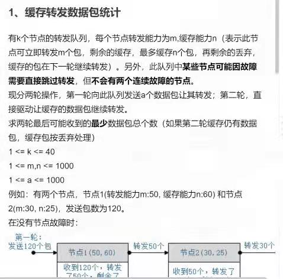
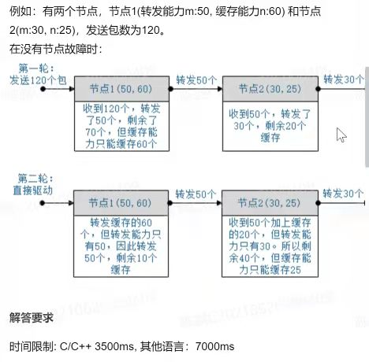
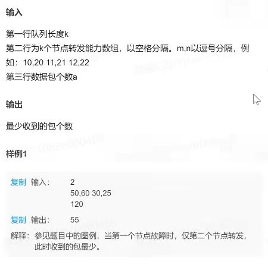
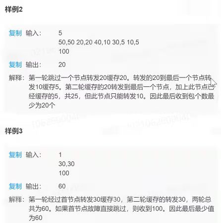
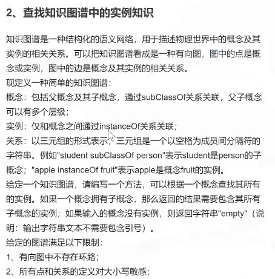
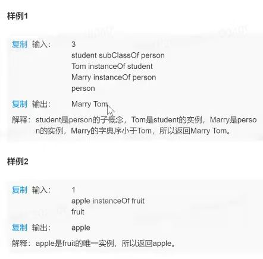
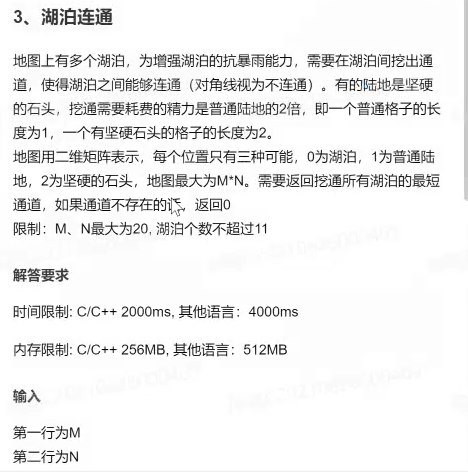
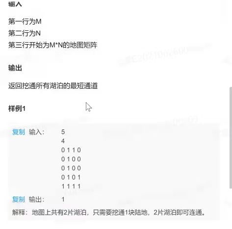

```C++
c++的几个内置函数

islower(char c) 是否为小写字母
isupper(char c) 是否为大写字母
isdigit(char c) 是否为数字
isalpha(char c) 是否为字母
isalnum(char c) 是否为字母或者数字
toupper(char c) 字母小转大
tolower(char c) 字母大转小

整数转字符串：
to_string(整数);

字符串 p 转整数 a ：
int a=atoi(p.c_str());
或者：a=stol(p);

进制转换：
十进制n 转十六进制 cout<<hex<<n<<endl;
        转八进制 cout<<oct<<n<<endl;
        装十进制 cout<<dec<<n<<endl;
```

## 2021.09.01 笔试

### 1.缓存转发数据包统计











> 总体就是用dp表储存到达某个节点处两次传递的状态，[第一次的传出数量，第二次的传出数量]，然后因为节点可能坏掉，那么节点i处的上一个传来节点可能是i-1或者i-2（i-2即i-1处的节点坏掉了，这样能保证没有连续的节点坏掉），取这两种情况下i处能够传递的总数量最小的那种情况记录i的状态；
>
> 然后就是理清楚如何从i-1或者i-2的状态得到i，就是下面的cal()函数完成的工作。
> 只需要一次遍历，最后输出n-1和n处的较小的那个即可。

```python
n = 3
a = 100
capability = [[50, 30], [40, 30], [20, 10]] # 测试数据

# 动态规划主函数
def main(n, a, capability):
    if(n<1): 
        return a
    # dp[i]为[第一次传递时从i发送的数量,第二次传递时从i发送的数量],最初传来的a可以相当于是从一个最大传送量无限，最大储存量为0的节点传过来的
    dp = [[a,0]] 
    # 通过dp[0]计算dp[1]
    dp.append(cal(dp[0],capability[0])) 
    for i in range(2,n+1):
        res1 = cal(dp[i-1],capability[i-1]) #上一个没坏，从上一个传来
        res2 = cal(dp[i - 2], capability[i - 1]) #上一个坏掉了，从上上个传来
        temp=res1 if(res1[0]+res1[1]<=res2[0]+res2[1]) else res2 #状态转移，选择值最小的一种传递方案
        dp.append(temp) #dp[i]
    return min(dp[n][0]+dp[n][1],dp[n-1][0]+dp[n-1][1]) #第n个节点和第n-1个节点中传出值较小的一个，后一个相当于最后一个节点坏了

# 通过dp[i-1]或者dp[i-2]的状态来计算现在的可能值：pre为第i-1或者i-2个节点处两次传递发出的数量（[第一次，第二次];
# cap为i处的传输能力，即[最大发送量,最大储存量]
def cal(pre,cap):
    send1 = min(pre[0], cap[0]) #第一次传递时从i发送的数量
    send2 = min(pre[0] - cap[0] + pre[1], cap[1] + pre[1], cap[0]) #第二次传递时从i发送的数量
    return [send1,send2]
```

### 2.查找知识图谱中的实例知识






### 3.湖泊连通






