```
cur_string
```

# 小象学院笔记

这里只记录基础知识,在qt里面做题

## 1.链表基础知识

==就把链表当成一种类型,不要去向有关指针的东西==

==链表考什么？就是哨兵节点+虚拟节点+链表指针的移动==


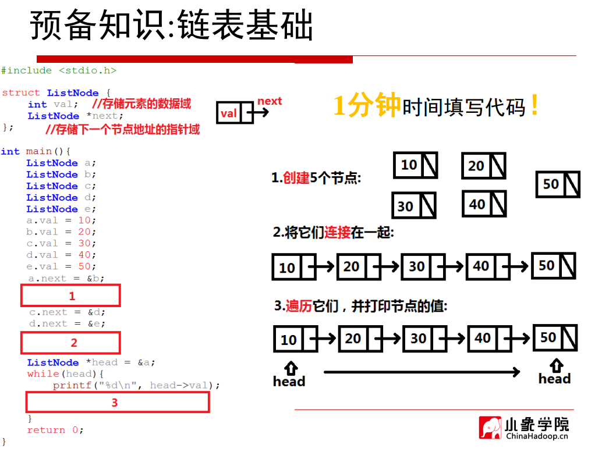


## 2.栈和队列

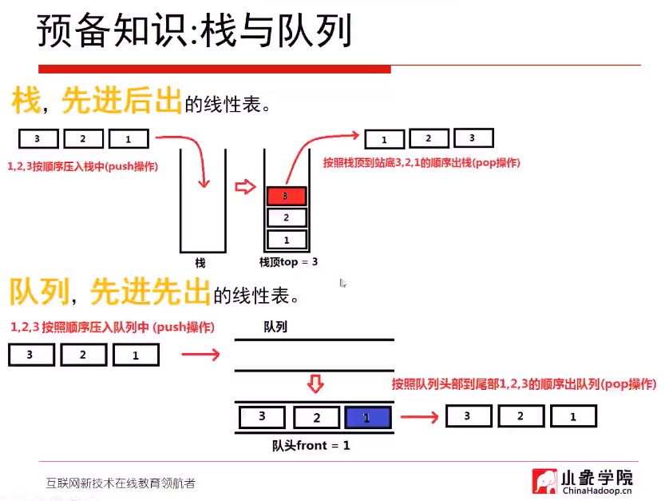


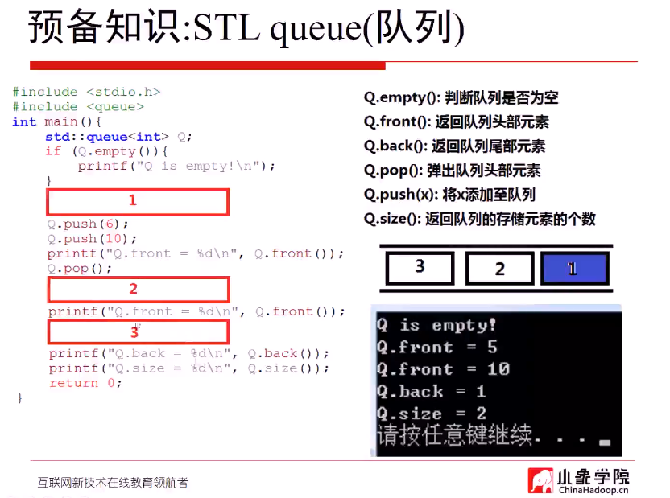

## 3.二叉堆

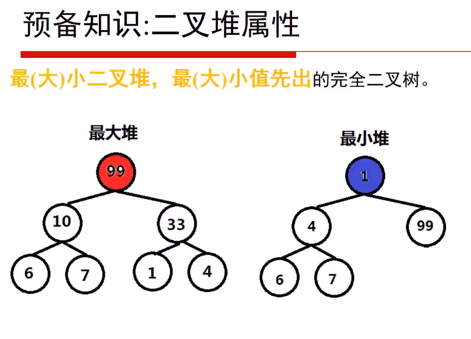

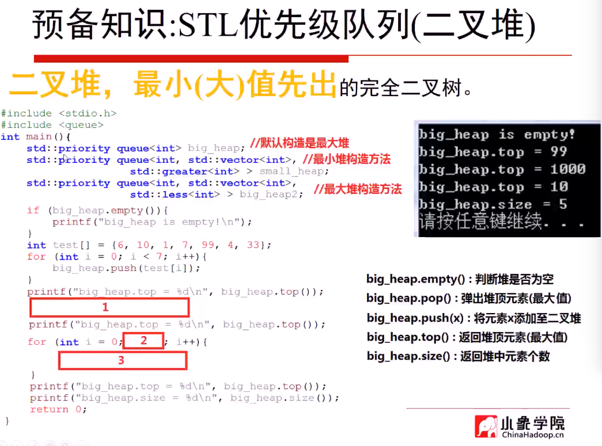

## 4.贪心

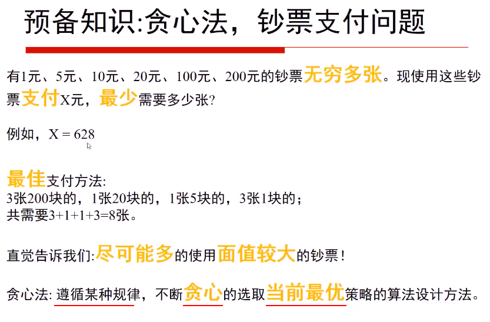

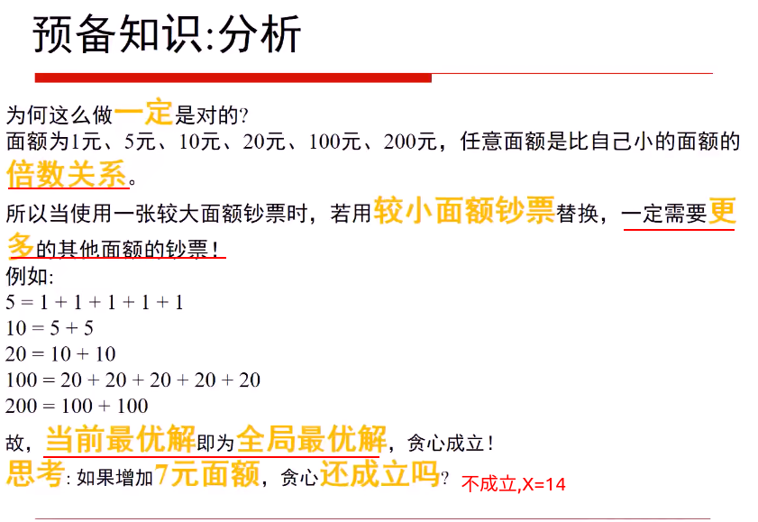

> 贪心题目:举例子,找反例


## 5.递归与回溯

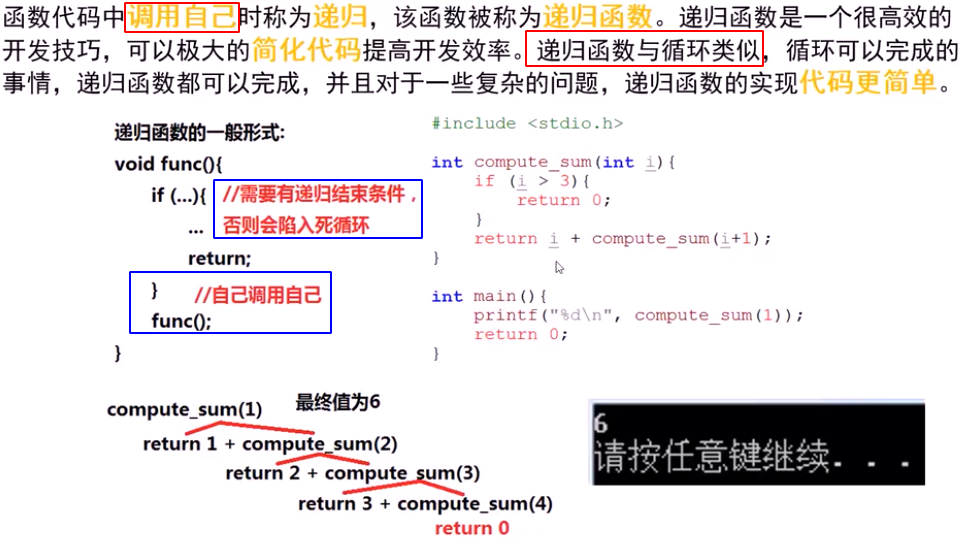

>一般递归有三个组成部分
>
>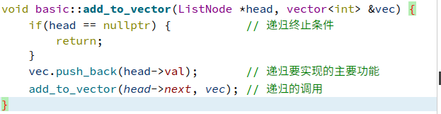

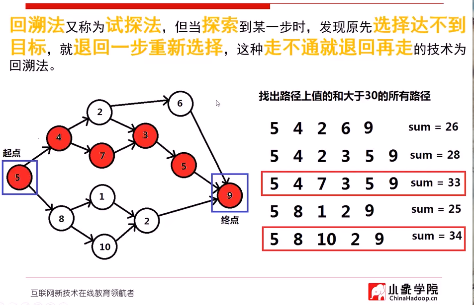

以一个有向无环图为例,要找到路径上值大于30的所有路径,

指定一种搜索顺序,每次都从上面的的节点开始,所以第一条路径是:

`5 4 2 6 9 sum=26 < 30`

所以向前回溯,到6,sum-9,发现没有其他节点,再往前回溯,到2,sum-6,有另外一个节点3,所以有了第二条路径:

`5 4 2 3 5 9 sum=28 < 30`

以此类推...

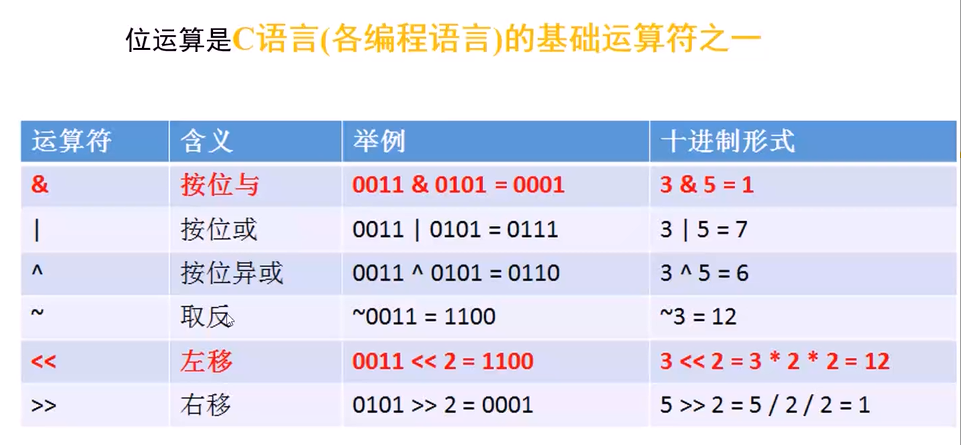

**leetcode-78 子集**

**解题思路：**
**1.DFS 和回溯算法区别**
DFS 是一个劲的往某一个方向搜索，而回溯算法建立在 DFS 基础之上的，但不同的是在搜索过程中，达到结束条件后，恢复状态，回溯上一层，**再次搜索**。因此回溯算法与 DFS 的区别就是**有无状态重置**

**2.何时使用回溯算法**
当问题需要 "回头"，以此来查找出所有的解的时候，使用回溯算法。即满足结束条件或者发现不是正确路径的时候(走不通)，要撤销选择，回退到上一个状态，继续尝试，直到找出所有解为止

**3.怎么样写回溯算法(从上而下，※代表难点，根据题目而变化)**
①画出递归树，找到状态变量(回溯函数的参数)，这一步非常重要※
②根据题意，确立结束条件
③找准选择列表(与函数参数相关),与第一步紧密关联※
④判断是否需要剪枝
⑤作出选择，递归调用，进入下一层
⑥撤销选择
**4.回溯问题的类型**
这里先给出，我总结的回溯问题类型，并给出相应的 leetcode题目(一直更新)，然后再说如何去编写。特别关注搜索类型的，搜索类的搞懂，你就真的搞懂回溯算法了,，是前面两类是基础，帮助你培养思维


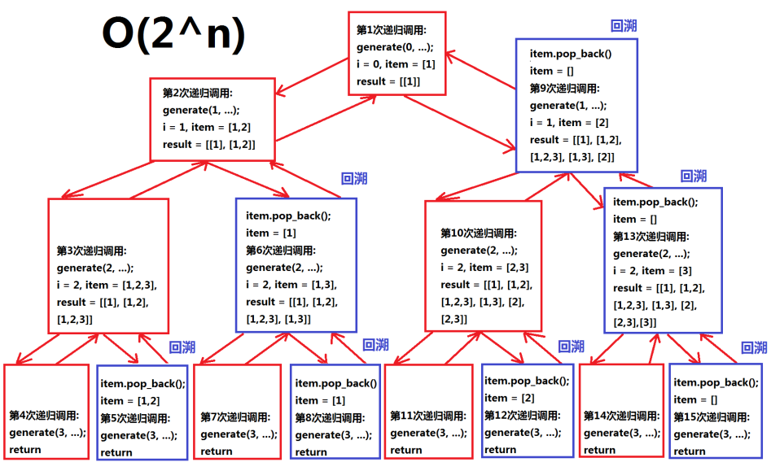

首先深度优先搜索,找到头之后,开始回溯,item删除一个元素,从这个位置再往后搜索,依次类推,如果再次搜索到底部,再回溯.

## 6.二分查找

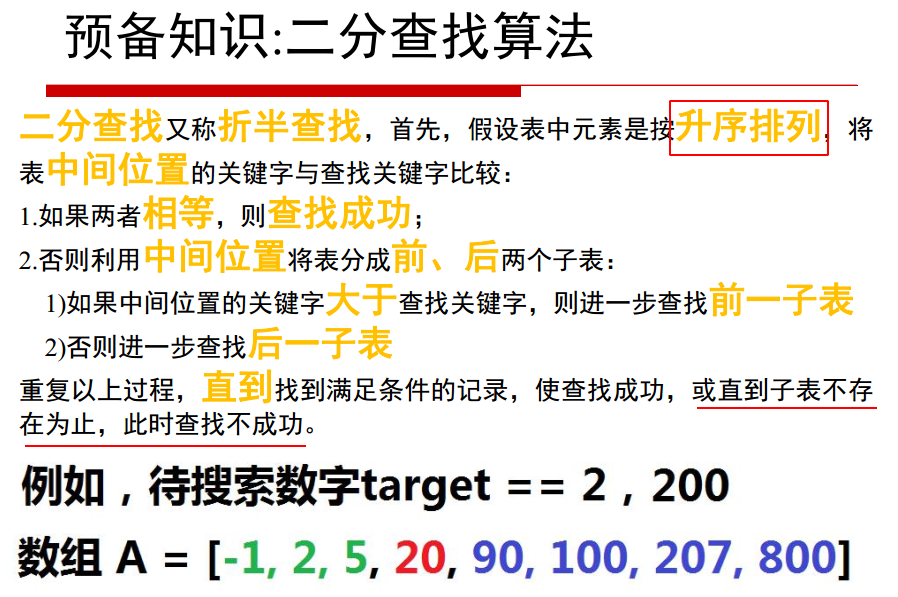

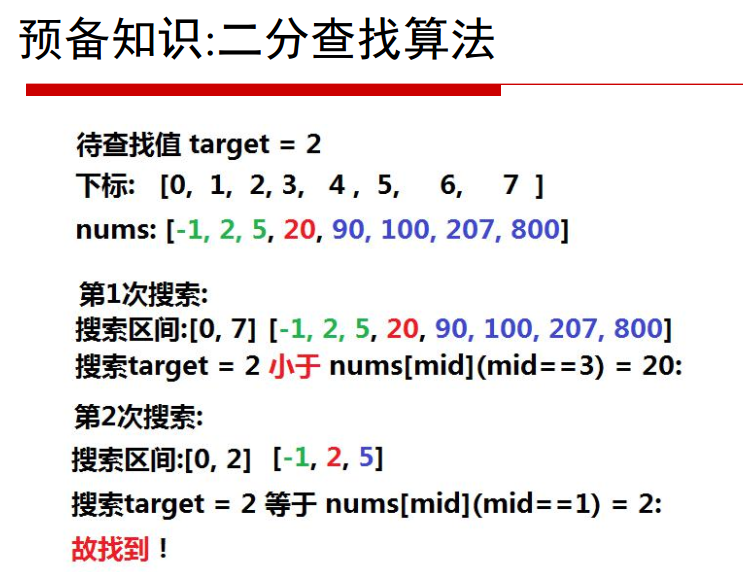

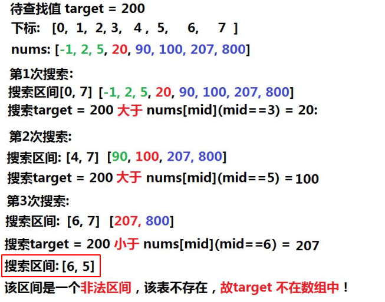

## 7.二叉树

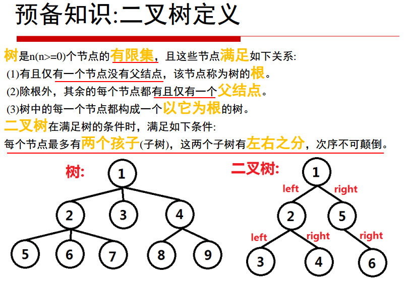

### 7.1 路径问题

**问题分类**
二叉树路径的问题大致可以分为两类：
**1、自顶向下：**
顾名思义，就是从某一个节点(不一定是根节点)，**从上向下寻找路径**，到某一个节点(不一定是叶节点)结束
具体题目如下：

[257. 二叉树的所有路径](https://leetcode-cn.com/problems/binary-tree-paths/)
[面试题 04.12. 求和路径](https://leetcode-cn.com/problems/paths-with-sum-lcci/)

[112. 路径总和](https://leetcode-cn.com/problems/path-sum/)
[113. 路径总和 II](https://leetcode-cn.com/problems/path-sum-ii/)

[437. 路径总和 III](https://leetcode-cn.com/problems/path-sum-iii/)
[988. 从叶结点开始的最小字符串](https://leetcode-cn.com/problems/smallest-string-starting-from-leaf/)

而继续细分的话还可以分成一般路径与给定和的路径

**2、非自顶向下：**
就是从**任意节点到任意节点的路径**，不需要自顶向下

[124. 二叉树中的最大路径和](https://leetcode-cn.com/problems/binary-tree-maximum-path-sum/)
[687. 最长同值路径](https://leetcode-cn.com/problems/longest-univalue-path/)
[543. 二叉树的直径](https://leetcode-cn.com/problems/diameter-of-binary-tree/)

**解题模板**
这类题通常用深度优先搜索(DFS)和广度优先搜索(BFS)解决，BFS较DFS繁琐，这里为了简洁只展现DFS代码
下面是我对两类题目的分析与模板
**一、自顶而下：**

DFS

```C++
// 一般路径：
vector<vector<int>>res;
void dfs(TreeNode*root,vector<int>& path)
{
    if(!root) return;  //根节点为空直接返回
    path.push_back(root->val);  //作出选择
    if(!root->left && !root->right) //如果到叶节点  
    {
        res.push_back(path);
        return;
    }
    dfs(root->left,path);  //继续递归
    dfs(root->right,path);
}

// 给定和的路径
void dfs(TreeNode*root, int sum, vector<int>&  path)
{
    if (!root)
        return;        // 根节点为空直接返回
    sum -= root->val;
    path.push_back(root->val);
    if (!root->left && !root->right && sum == 0)  // 如果到叶节点  并且 路径之和满足sum
    {
        res.push_back(path);
        return;
    }
    dfs(root->left, sum, path);
    dfs(root->right, sum, path);
}
```

**这类题型DFS注意点：**
1、如果是找路径和等于给定target的路径的，那么可以不用新增一个临时变量cursum来判断当前路径和，只需要用给定和target减去节点值，最终结束条件判断target==0即可

2、是否要回溯：

二叉树的问题大部分是不需要回溯的，原因如下：

二叉树的递归部分：dfs(root->left),dfs(root->right)已经把可能的路径穷尽了,因此到任意叶节点的路径只可能有一条，绝对不可能出现另外的路径也到这个满足条件的叶节点的;

而对比二维数组(例如迷宫问题)的DFS,for循环向四个方向查找每次只能朝向一个方向，并没有穷尽路径，因此某一个满足条件的点可能是有多条路径到该点的

并且visited数组标记已经走过的路径是会受到另外路径是否访问的影响，这时候必须回溯

3、**找到路径后是否要return:**
取决于题目是否要求找到叶节点满足条件的路径,如果必须到叶节点,那么就要return;
但如果是到任意节点都可以，那么必不能return,因为这条路径下面还可能有更深的路径满足条件，还要在此基础上继续递归

4、是否要双重递归(即调用根节点的dfs函数后，继续调用根左右节点的pathsum函数)：看题目要不要求从根节点开始的，还是从任意节点开始

## 8.哈希表

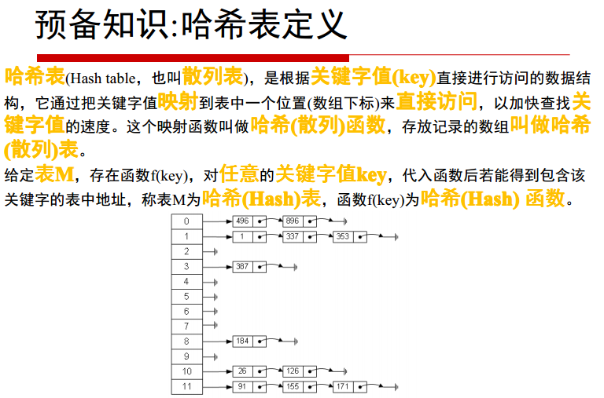

### ascii码表:

ASCII（American Standard Code for Information Interchange，美国信息互换标准代码）是一套基于拉丁字母的字符编码，共收录了 128 个字符，用一个字节就可以存储，它等同于国际标准 ISO/IEC 646。

ASCII 规范于 1967 年第一次发布，最后一次更新是在 1986 年，它包含了 33 个控制字符（具有某些特殊功能但是无法显示的字符）和 95 个可显示字符。

| 二进制   | 十进制 | 十六进制 | 字符/缩写                                    | 解释                               |
| -------- | ------ | -------- | -------------------------------------------- | ---------------------------------- |
| 00000000 | 0      | 00       | NUL (NULL)                                   | 空字符                             |
| 00000001 | 1      | 01       | SOH (Start Of Headling)                      | 标题开始                           |
| 00000010 | 2      | 02       | STX (Start Of Text)                          | 正文开始                           |
| 00000011 | 3      | 03       | ETX (End Of Text)                            | 正文结束                           |
| 00000100 | 4      | 04       | EOT (End Of Transmission)                    | 传输结束                           |
| 00000101 | 5      | 05       | ENQ (Enquiry)                                | 请求                               |
| 00000110 | 6      | 06       | ACK (Acknowledge)                            | 回应/响应/收到通知                 |
| 00000111 | 7      | 07       | BEL (Bell)                                   | 响铃                               |
| 00001000 | 8      | 08       | BS (Backspace)                               | 退格                               |
| 00001001 | 9      | 09       | HT (Horizontal Tab)                          | 水平制表符                         |
| 00001010 | 10     | 0A       | LF/NL(Line Feed/New Line)                    | 换行键                             |
| 00001011 | 11     | 0B       | VT (Vertical Tab)                            | 垂直制表符                         |
| 00001100 | 12     | 0C       | FF/NP (Form Feed/New Page)                   | 换页键                             |
| 00001101 | 13     | 0D       | CR (Carriage Return)                         | 回车键                             |
| 00001110 | 14     | 0E       | SO (Shift Out)                               | 不用切换                           |
| 00001111 | 15     | 0F       | SI (Shift In)                                | 启用切换                           |
| 00010000 | 16     | 10       | DLE (Data Link Escape)                       | 数据链路转义                       |
| 00010001 | 17     | 11       | DC1/XON (Device Control 1/Transmission On)   | 设备控制1/传输开始                 |
| 00010010 | 18     | 12       | DC2 (Device Control 2)                       | 设备控制2                          |
| 00010011 | 19     | 13       | DC3/XOFF (Device Control 3/Transmission Off) | 设备控制3/传输中断                 |
| 00010100 | 20     | 14       | DC4 (Device Control 4)                       | 设备控制4                          |
| 00010101 | 21     | 15       | NAK (Negative Acknowledge)                   | 无响应/非正常响应/拒绝接收         |
| 00010110 | 22     | 16       | SYN (Synchronous Idle)                       | 同步空闲                           |
| 00010111 | 23     | 17       | ETB (End of Transmission Block)              | 传输块结束/块传输终止              |
| 00011000 | 24     | 18       | CAN (Cancel)                                 | 取消                               |
| 00011001 | 25     | 19       | EM (End of Medium)                           | 已到介质末端/介质存储已满/介质中断 |
| 00011010 | 26     | 1A       | SUB (Substitute)                             | 替补/替换                          |
| 00011011 | 27     | 1B       | ESC (Escape)                                 | 逃离/取消                          |
| 00011100 | 28     | 1C       | FS (File Separator)                          | 文件分割符                         |
| 00011101 | 29     | 1D       | GS (Group Separator)                         | 组分隔符/分组符                    |
| 00011110 | 30     | 1E       | RS (Record Separator)                        | 记录分离符                         |
| 00011111 | 31     | 1F       | US (Unit Separator)                          | 单元分隔符                         |
| 00100000 | 32     | 20       | (Space)                                      | 空格                               |
| 00100001 | 33     | 21       | !                                            |                                    |
| 00100010 | 34     | 22       | "                                            |                                    |
| 00100011 | 35     | 23       | #                                            |                                    |
| 00100100 | 36     | 24       | $                                            |                                    |
| 00100101 | 37     | 25       | %                                            |                                    |
| 00100110 | 38     | 26       | &                                            |                                    |
| 00100111 | 39     | 27       | '                                            |                                    |
| 00101000 | 40     | 28       | (                                            |                                    |
| 00101001 | 41     | 29       | )                                            |                                    |
| 00101010 | 42     | 2A       | *                                            |                                    |
| 00101011 | 43     | 2B       | +                                            |                                    |
| 00101100 | 44     | 2C       | ,                                            |                                    |
| 00101101 | 45     | 2D       | -                                            |                                    |
| 00101110 | 46     | 2E       | .                                            |                                    |
| 00101111 | 47     | 2F       | /                                            |                                    |
| 00110000 | ==48== | 30       | 0                                            |                                    |
| 00110001 | 49     | 31       | 1                                            |                                    |
| 00110010 | 50     | 32       | 2                                            |                                    |
| 00110011 | 51     | 33       | 3                                            |                                    |
| 00110100 | 52     | 34       | 4                                            |                                    |
| 00110101 | 53     | 35       | 5                                            |                                    |
| 00110110 | 54     | 36       | 6                                            |                                    |
| 00110111 | 55     | 37       | 7                                            |                                    |
| 00111000 | 56     | 38       | 8                                            |                                    |
| 00111001 | 57     | 39       | 9                                            |                                    |
| 00111010 | 58     | 3A       | :                                            |                                    |
| 00111011 | 59     | 3B       | ;                                            |                                    |
| 00111100 | 60     | 3C       | <                                            |                                    |
| 00111101 | 61     | 3D       | =                                            |                                    |
| 00111110 | 62     | 3E       | >                                            |                                    |
| 00111111 | 63     | 3F       | ?                                            |                                    |
| 01000000 | 64     | 40       | @                                            |                                    |
| 01000001 | ==65== | 41       | A                                            |                                    |
| 01000010 | 66     | 42       | B                                            |                                    |
| 01000011 | 67     | 43       | C                                            |                                    |
| 01000100 | 68     | 44       | D                                            |                                    |
| 01000101 | 69     | 45       | E                                            |                                    |
| 01000110 | 70     | 46       | F                                            |                                    |
| 01000111 | 71     | 47       | G                                            |                                    |
| 01001000 | 72     | 48       | H                                            |                                    |
| 01001001 | 73     | 49       | I                                            |                                    |
| 01001010 | 74     | 4A       | J                                            |                                    |
| 01001011 | 75     | 4B       | K                                            |                                    |
| 01001100 | 76     | 4C       | L                                            |                                    |
| 01001101 | 77     | 4D       | M                                            |                                    |
| 01001110 | 78     | 4E       | N                                            |                                    |
| 01001111 | 79     | 4F       | O                                            |                                    |
| 01010000 | 80     | 50       | P                                            |                                    |
| 01010001 | 81     | 51       | Q                                            |                                    |
| 01010010 | 82     | 52       | R                                            |                                    |
| 01010011 | 83     | 53       | S                                            |                                    |
| 01010100 | 84     | 54       | T                                            |                                    |
| 01010101 | 85     | 55       | U                                            |                                    |
| 01010110 | 86     | 56       | V                                            |                                    |
| 01010111 | 87     | 57       | W                                            |                                    |
| 01011000 | 88     | 58       | X                                            |                                    |
| 01011001 | 89     | 59       | Y                                            |                                    |
| 01011010 | 90     | 5A       | Z                                            |                                    |
| 01011011 | 91     | 换行键5B | [                                            |                                    |
| 01011100 | 92     | 5C       | \                                            |                                    |
| 01011101 | 93     | 5D       | ]                                            |                                    |
| 01011110 | 94     | 5E       | ^                                            |                                    |
| 01011111 | 95     | 5F       | _                                            |                                    |
| 01100000 | 96     | 60       | `                                            |                                    |
| 01100001 | ==97== | 61       | a                                            |                                    |
| 01100010 | 98     | 62       | b                                            |                                    |
| 01100011 | 99     | 63       | c                                            |                                    |
| 01100100 | 100    | 64       | d                                            |                                    |
| 01100101 | 101    | 65       | e                                            |                                    |
| 01100110 | 102    | 66       | f                                            |                                    |
| 01100111 | 103    | 67       | g                                            |                                    |
| 01101000 | 104    | 68       | h                                            |                                    |
| 01101001 | 105    | 69       | i                                            |                                    |
| 01101010 | 106    | 6A       | j                                            |                                    |
| 01101011 | 107    | 6B       | k                                            |                                    |
| 01101100 | 108    | 6C       | l                                            |                                    |
| 01101101 | 109    | 6D       | m                                            |                                    |
| 01101110 | 110    | 6E       | n                                            |                                    |
| 01101111 | 111    | 6F       | o                                            |                                    |
| 01110000 | 112    | 70       | p                                            |                                    |
| 01110001 | 113    | 71       | q                                            |                                    |
| 01110010 | 114    | 72       | r                                            |                                    |
| 01110011 | 115    | 73       | s                                            |                                    |
| 01110100 | 116    | 74       | t                                            |                                    |
| 01110101 | 117    | 75       | u                                            |                                    |
| 01110110 | 118    | 76       | v                                            |                                    |
| 01110111 | 119    | 77       | w                                            |                                    |
| 01111000 | 120    | 78       | x                                            |                                    |
| 01111001 | 121    | 79       | y                                            |                                    |
| 01111010 | 122    | 7A       | z                                            |                                    |
| 01111011 | 123    | 7B       | {                                            |                                    |
| 01111100 | 124    | 7C       | \|                                           |                                    |
| 01111101 | 125    | 7D       | }                                            |                                    |
| 01111110 | 126    | 7E       | ~                                            |                                    |
| 01111111 | 127    | 7F       | DEL (Delete)                                 | 删除                               |