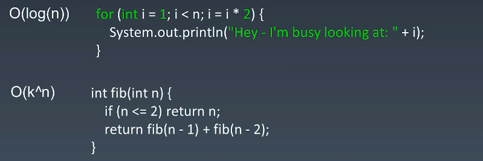

> 极客大学-算法训练营笔记

## 第 01 课 数据结构与算法总览

==**Time：2021/03/02**==

### 切题四件套

#### 1.Clarification

多看几遍题目,（和面试官沟通）确保对题目的理解是正确的

#### 2.Possible solutions

不要一想到一种方法就去解题,要思考多种方法,并比较它们的时间/空间复杂度

选择最优的方式去实现

#### 3.Coding

#### 4.Test cases

多测试几个例子

### 五遍刷题法

#### 第一遍

+ 5-15分钟:      读题 + 思考   如果15分钟后没有思路
+ 直接看解法:  注意 ! 多解法, 比较解法优劣
+ 背诵, 默写优秀的解法

#### 第二遍

+ 马上自己写-->LeetCode 提交
+ 多种解法比较、体会--> 优化(执行时间） !

#### 第三遍

+ 一天后，再重复做一遍题目
+ 根据不同解法的熟练程度 -> 专项练习

#### 第四遍

+ 一周后，再重复做一遍题目
+ 根据不同解法的熟练程度 -> 专项练习

#### 第五遍

+ 面试前一两周恢复性训练

### 小结

+ 职业训练：拆分知识点、刻意练习、反馈
+ 五遍刷题法
+ 做算法题的最大误区：只做一遍

## 第 02 课 训练准备和复杂度分析

==**Time：2021/03/02**==

### 01 训练环境设置、编码技巧和code style

+ Google搜索

+ VSCode

+ LeetCode
  + ==海外站==的discuss区,按照most views排序，至少看前三个
  + VSCode插件
  
+ Code Style

+ 自顶向下的编程方式

  根据程序逻辑，写把子函数理清楚，但是并不关系子函数的具体实现

### 02 时间复杂度和空间复杂度分析 

==**Time：2021/03/08**==

### 1.常见的时间复杂度：

### 2.分析时间复杂度

上面第一个是`O(log_2(n))`,忽略n的系数就是`O(log(n))`

### 优化时间复杂度例子

### 递归的时间复杂度

循环的时间复杂度很简单，递归就相对复杂一点.

计算递归语句执行了多少次：**执行顺序**画成**递归树**

Fib()例子：

每一层是上一层的（大概）两倍：O(2^n)指数级的运行时间

有很多重复的节点，有很多冗余的计算，可以加入缓存，保存中间结果，或者用循环来写。

**主定理**

各种递归的时间复杂度

**二分查找**：一维有序数列查找`O(log n)`

**二叉树遍历**：`O(n)`（每一个节点只访问一次）

有序**二维矩阵中查找**：`O(n)`

**归并排序**：`O(n log n)`

注意：所有排序算法中，==最优==的时间复杂度是`O(n log n)`

### 小结

+ 常用工具配置
+ 基本功和编程指法
+ 常见的时间、空间复杂度

## 第 03 课 数组、链表、跳表

==**Time：2021/04/03**==

### 01 基本实现和特性

**数组Array:**

创建数组时，在内存中分配一块连续的内存空间；

数组的随机访问时间复杂度O(1),插入，添加，删除是O(n)

**链表linked list**

添加，删除O(1)

随机访问O(n)

**跳表skip list**

为了弥补链表的缺陷，访问时间复杂度高

==》升维，空间换时间

建立多级索引，都是链表，但是步长变长了,时间复杂度是O(log n)

#### 小结

+ 数组、链表、跳表的原理和实现
+ 三者的时间复杂度、空间复杂度
+ 工程运用
+ 跳表：升维思想+空间换时间

### 02 实战题目：移动零

