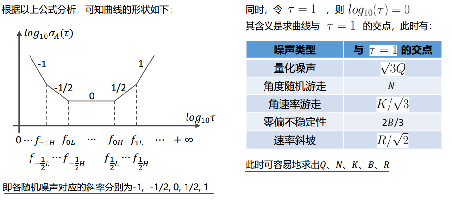
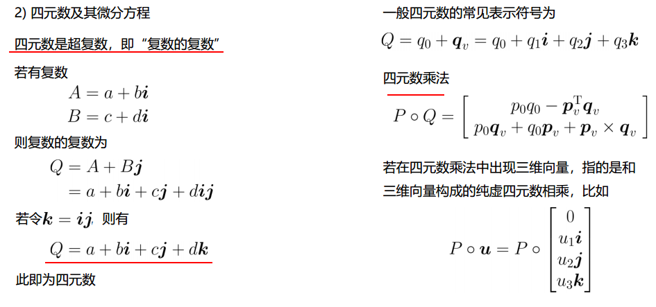
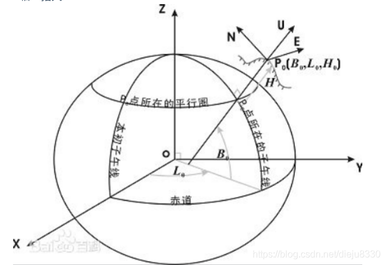
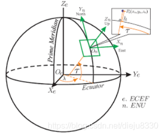
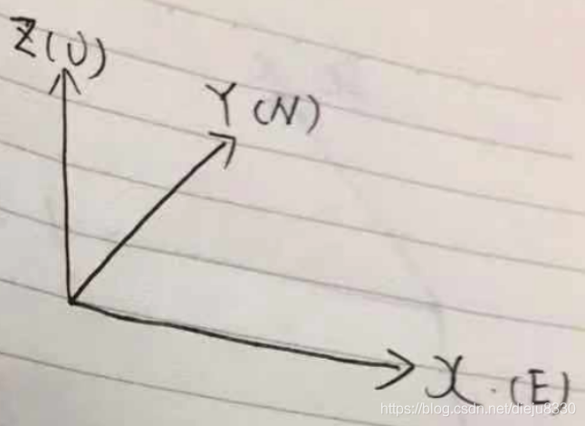

# 惯性导航基础

# 1.惯性技术简介


# 2. 惯性器件误差分析

## 2.1 信号误差组成


## 2.2 Allan方差分析

**【简单看看】**


------


------



------


# 3. 惯性器件内参标定

## 3.1 惯性器件内参误差模型

### 3.1.1 零偏


### 3.1.2 刻度系数误差


### 3.1.3 安装误差 


### 3.1.4 误差模型


## 3.2 惯性器件内参误差标定


### 3.2.1 分立级标定

**【需要转台，不考虑】**


### 3.2.2 半系统级标定


-----


-----


-----

### 3.2.3 系统级标定


### 3.2.4 标定方法比较


## 3.3 惯性器件温补


-----


# 4 惯性导航解算


## 4.1 基础知识


---



---


。。。

。。。

。。。


## 4.2 姿态更新


---


---


---


---


==数值计算==


## 4.3 姿态解算

姿态解算，进行GNSS和IMU、激光点云的融合定位;

from:[CSDN](https://blog.csdn.net/dieju8330/article/details/103103298?utm_medium=distribute.pc_relevant.none-task-blog-BlogCommendFromMachineLearnPai2-1.control&depth_1-utm_source=distribute.pc_relevant.none-task-blog-BlogCommendFromMachineLearnPai2-1.control)

### 4.3.1 常用坐标系

运载体在三维空间中运动包含==六个自由度==，既有角运动又有线运动。

在地球表面附近，运载体的角运动又有线运动。运载体上的惯性传感器（imu）是相对于惯性空间进行测量的，另外，地球绕其自转轴相对于惯性空间以常值角速度旋转，运载体在地球表面上的位置变化会引起其相对于地心的角速度变化。

#### 4.3.1.1 地心惯性坐标系(i系,inertial frame)

地心惯性坐标系用$O_iX_iY_iZ_i$表示，原点为地球中心，$X$轴指向春分点（赤道面与黄道面的交线再与天球相交的交点之一），春分点是天文测量中确定恒星时的起点，$Z$轴为地球自转轴，指向北极，**惯性传感器**的输出就是基于该坐标系为参考坐标系的。

#### 4.3.1.2 地球坐标系(e系,earth frame)

地球坐标系用$O_eX_eX_eZ_e$表示，$X$轴指向本初子午线与赤道面的交点，z轴为地球自转轴，指向北极。e系与地球固连，也称 **地心地固坐标系 （Earth-Centered Earth-Fixed,ECEF)**,地球坐标系相对于惯性坐标系的角速度大小为地球自传角速度，
$$
w_{ie}=7.2921151467*10^{-5} rad/s
$$

#### 4.3.1.3 地理坐标系(g系,geographic frame)

WGS-84

#### 4.3.1.4 当地导航坐标系(n系,navigation frame)

导航坐标系用$O_nX_nX_nZ_n$，它是惯性导航系统在求解导航参数时采用的参考坐标系。纯惯导系统的高度通道在原理上是发散的，因而惯导系统多采用当地水平坐标系作为参考坐标系，以实现水平和高度通道的解偶，即利用惯导长时间导航定位时只进行水平定位结算，简单地将高度值设为固定。
常用的导航坐标系为**东-北-天（ENU）导航坐标系**

+ X轴：指东
+ Y轴：指北
+ Z轴：指天
  

#### 4.3.1.5 载体坐标系(b系,body frame)

载体坐标系用 $O_bX_bY_bZ_b$ 表示，原点为载体重心，**右-前-上**坐标系描述：$x$ 轴沿载体横轴向右， $y$ 轴沿载体纵轴向前（即载体前进方向），$z$ 轴沿载体立轴向上。$b$ 系与载体固连，载体坐标系 $b$ 系与导航坐标系 $n$ 系的关系可用一组**欧拉角**表示。

#### 4.3.1.6 常用相连坐标系(特指载体坐标系和导航坐标系)

##### 4.6.1 东北天(ENU)——右前上

**(1)东北天——当地导航坐标系**

+ X轴：指东;
+ Y轴：指北;
+ Z轴：指天。
  
  画成平面，如下图：
  

**(2)右前上——当地导航坐标系**

+ X轴：指向载体右侧;
+ Y轴：指向载体前进方向;
+ Z轴：指天。
  
  

### 4.3.2 姿态的描述

#### 4.3.2.1 欧拉角

欧拉角用来直观表示载体的姿态，如下图


> + 偏航角Yaw $ (\psi) $
>   
> + 俯仰角Pitch $ (\theta)$
>   
> + 翻滚角Roll (*ϕ*)
>   

+ **Proper Euler angles** (z-x-z, x-y-x, y-z-y, z-y-z, x-z-x, y-x-y)
  指第一次旋转和第三次旋转中使用相同的轴（313），比较少用
+ **泰特-布莱恩角**
  泰特布莱恩角表示围绕三个不同轴的旋转，如Z-X’-Y’’
  
  **上图描述了一组欧拉角，主要看右图就好了**
+ (1)原坐标系1如蓝色的x-y-z
+ (2)坐标系1沿z轴，逆时针旋转$\psi(\psi>0)$，认为沿z轴逆时针旋转为正方向，$ψ=Yaw$；然后得到了黄色的坐标系2   x’-y’-z’
+ (3)将坐标系2沿x(N)轴逆时针旋转 $\theta(\theta >0)$，得到了红色的坐标系N-Y-Z
+ (4)将红色坐标系沿Y轴顺时针旋转($\varphi$)，得到了目的坐标系:红色的X-Y-Z坐标系

#### 4.3.2.2 旋转矩阵

> 由于使用欧拉角描述姿态存在万向节死锁的问题，具体参见：[万向节死锁 gimbal lock](https://www.cnblogs.com/timeObjserver/p/5936258.html)
> 因此引入方向余弦矩阵

**(1) 方向余弦矩阵的基本形式**

一个向量的方向（姿态）我们可以用他在参考坐标系（地理坐标系）各个轴向的夹角的余弦来表示（及在各个轴的投影）。
类似的 一个坐标系 可以看成是3个向量组成，所以三个向量分别在坐标轴上的投影可以用来表示一个坐标系与参考坐标系的关系。这总共9个方向余弦组成了一个三阶矩阵，其对应方式如下图。
$$
C_b^m=
\begin{bmatrix}
c_{11} & c_{12} & c_{13}\\
c_{21} & c_{22} & c_{23}\\
c_{31} & c_{32} & c_{33}
\end{bmatrix}
$$
其中，第 i 行、 j 列的元素表示参考坐标系 i 轴和姿态坐标系 j 轴夹角的余弦。事实上方向余弦和欧拉角没有本质区别，因为方向余弦实际上就是用欧拉角表示的。

**(2)方向余弦矩阵的举例推导**

一个二维的坐标变换如下：

点F为固定点，在坐标系1下的表示为 $F(r_{x1},r_{y1})$，在坐标系2下为 $F_{2}(r_{x2},r_{y2})$
由图可知

推广到三维的情况下，可看作是**原坐标系**绕Z轴逆时针旋转，并写成矩阵形式：

> （值得注意的是）:这个形式是**原坐标系**绕Z轴逆时针旋转，请不要看成了是 ‘点’绕Z轴逆时针旋转。


由上面的例子，可推理余弦矩阵各个元素的意义


+ 第1行表示旋转之后的**X2轴**在原坐标系(X1,Y1,Z1)轴下的投影
+ 第2行表示旋转之后的**Y2轴**在原坐标系(X1,Y1,Z1)轴下的投影
+ 第3行表示旋转之后的**Z2轴**在原坐标系(X1,Y1,Z1)轴下的投影

**(3) 东北天ENU---->右前上的余弦矩阵 $C_{n}^{b}$推导**

假设我们现在有一个东北天坐标系和一个载体坐标系，现需要将东北天坐标系经过3次旋转，使得最终得到的坐标系与载体坐标系重合。

> **在此之前，需要做出一些规定**
>
> + **旋转的正方向为：从旋转轴看的逆时针方向**
> + **旋转的顺序为：Z-X-Y**
> + **对应的欧拉角：Yaw-Pitch-Roll**

**1. 绕Z轴逆时针旋转 $\psi$——Yaw**


得到旋转矩阵 $C_{n}^{1}$


**2**.绕X’轴逆时针旋转$\theta$


得到旋转矩阵 $C_{1}^{2}$


**3. 绕Y’'轴逆时针旋转 $\phi$**


得到旋转矩阵$C_2^3$


**4. 得到ENU导航坐标系到右前上载体坐标系的方向余弦矩阵$C_{n}^{b}$**


> 这里补一个按Z-Y-X顺序的旋转矩阵$C_n^b$
> 

#### 4.3.2.3 四元数

> 用欧拉角表示姿态需要指定顺序和方向，用余弦矩阵表示姿态则参数较多，四元数出现了。
> 四元数（Quaternions）是由爱尔兰数学家哈密顿（William Rowan Hamilton）在1843年提出。

三维空间的任意旋转，都可以用绕三维空间的某个轴旋转过某个角度来表示，即所谓的**Axis-Angle**表示方法。这种表示方法里，Axis可用一个三维向量(x,y,z)来表示，Angle可以用一个角度值$\theta$来表示，直观来讲，一个四维向量(θ,x,y,z)就可以表示出三维空间任意的旋转。注意，这里的三维向量(x,y,z)只是用来表示axis的方向朝向，因此更紧凑的表示方式是用一个单位向量来表示方向axis，而用该三维向量的长度来表示角度值θ。

> 简单来说，==**四元数的思想就是把方向余弦矩阵的三次旋转表示为只绕一个旋转轴旋转一次完成**==，因此可以用4个数来表示这个过程，其中包括旋转轴向量的长度(θ)和旋转轴单位向量(x,y,z)

**(1) 四元数的表示**
$$
\begin{bmatrix}
q_0\\
q_1\\
q_2\\
q_3\\
\end{bmatrix}
=
\begin{bmatrix}
cos\frac\theta{2}\\
x*sin\frac\theta{2}\\
y*sin\frac\theta{2}\\
z*sin\frac\theta{2}\\
\end{bmatrix}
$$
**绕单位向量$n=(x,y,z)$旋转$\theta$角度**

**(2) 四元数的复数意义**
$$
q=q_0+q_1*i+q_2*j+q_3*k=
[s,\mathbf{v}]
$$
其中 $q_0,q_1,q_2,q_3$均为实数, $s=q_0,\mathbf v=[q_1,q_2,q_3]$，$i^2=j^2=k^2=−1$
对于 i,j,k 本身的几何意义可以理解为一种旋转，其中 i 代表 x 轴与 y 轴相交平面中 x 轴正向 向  y 轴正向的旋转， j 旋转代表 z 轴与 x 轴相交平面中 z 轴正向 向  x 轴正向的旋转，k 旋转代表 y 轴与 z 轴相交平面中 y 轴正向向 z 轴正向的旋转， −i,−j,−k 分别代表 i,j,k 的反向旋转。

**(3) 四元数的模**
$$
\begin{vmatrix}
q
\end{vmatrix}=\sqrt{q_0^2+q_1^2+q_2^2+q_3^2}
$$
**(4) 四元数的运算**


**乘法性质**

1. 满足结合律
2. 不满足交换律
3. 乘积的模等于模的乘积
4. 乘积的逆等于各个四元数的逆以相反的顺序相乘

+ 其他运算
  
  

*四元数部分参考：[旋转矩阵、欧拉角、四元数理论及其转换关系](https://blog.csdn.net/lql0716/article/details/72597719)

### 4.3.3 姿态解算

#### (1) 传感器坐标系准备

> 在进行解算之前，需要完成十分重要的一步(但是很多资料都没展开描述)，将加速度计、陀螺仪、磁力计对其到==右前上==坐标系。原因是一些集成的imu中三者坐标系并不一致。

##### 加速度计

+ 车头朝前
+ 向前加速，y轴加速度输出为+
+ 向右加速，x轴加速度输出为+
+ 向上加速，z轴加速度输出为+

##### 陀螺仪

+ 车头朝前
+ 从Z+看向Z-(即从上往下看)，逆时针旋转，Z轴角速度输出为+
+ 从X+看向X-(即从车右侧看)，逆时针旋转(车头上翘)，X轴角速度输出为+
+ 从Y+看向Y-(即从车头看)，逆时针旋转，Y轴角速度输出为+

#####磁力计


#### (2) 初始姿态计算

> 在进行姿态解算前，需要确定初始的姿态，
>
> + 使用加速度计确定俯仰和翻滚，pitch 和 roll
> + ** 使用磁力计确定偏航角 yaw

+ 对载体坐标系下的加速度(加速度计的输出)进行归一化

  $Acc=Norm(Acc)$

+ 计算俯仰pitch

  由于我们是以右前上作为载体坐标系，Y轴为车头方向，与网上很多飞控采用的前右下坐标系不一样，因此pitch与y轴方向加速度相关

  $pitch=atan2(acc_y,\sqrt{acc_x^2+acc_z^2})$

+ 计算翻滚roll

  $roll=-atan2(acc_x,acc_z)$

实现代码C++

```C++
Vector3d getPoseFrom_Acc(Vector3d _acc){
    Vector3d acc=_acc;
    acc.normalize();
    double norm=sqrt(acc[0]*acc[0]+acc[1]*acc[1]+acc[2]*acc[2]);
    Vector3d result;
    result<<0,atan2(acc[1],sqrt(acc[0]*acc[0]+acc[2]*acc[2])),-atan2(acc[0],acc[2]);
    return result;
}
```

+ 确定偏航角


#### (3) 基于Mahony算法的姿态解算


**数据准备**

+ 取初始姿态Yaw,pitch,roll
+ 利用euler_312_To_quaternion()函数，得到初始姿态对应的四元数q
+ 利用C_nb_312_from_qnb()函数，得到初始姿态对应的旋转矩阵Cnb


#### (4) 基于扩展卡尔曼滤波的姿态结算

##### 1 状态变量、观测量说明


##### 2 状态转移


##### 3 观测矩阵


##### 4 卡尔曼方程组


> 概览部分参考自：[四旋翼姿态解算–互补滤波和拓展卡尔曼](https://blog.csdn.net/hxudhdjuf/article/details/79594866)


# 5.实践

## 5.1 使用Livox自带的imu完成航迹推算

Horizon自带的IMU型号为: Bosch BMI088

Bosch BMI088高性能惯性测量单元 (IMU) 专门设计用于无人机和机器人应用。该款6轴传感器在3 x 4.5 x 0.95mm³小尺寸LGA封装中集成了16位三轴陀螺仪和16位三轴加速度计。该单元采用经过汽车验证的陀螺仪技术和全新的低TCO加速度计设计。

BMI088经过汽车验证的陀螺仪具有无与伦比的偏置稳定性（**低于2°/h**）和低于15mdps/K的低温度系数偏移 (TCO)。其他特性包括0.2mg/K的低TCO，以及在±24g的极宽测量范围内具有仅为230μg/√Hz的低频谱噪声。借助BMI088器件，即使在自然的高振动环境中也能更轻松地进行精确转向，因此改善了飞行和导航体验。

Horizon内置 BMI088 加速度量程为3g，角速度量程为2000deg/s，且量程固定无法通过任何方式设置。

### 5.1.1 数据格式

ros自带的imu格式为`sensor_msgs::Imu`，在头文件sensor_msgs/Imu.h中

**Raw Message Definition**

```
# This is a message to hold data from an IMU (Inertial Measurement Unit)
#
# Accelerations should be in m/s^2 (not in g's), and rotational velocity should be in rad/sec
#
# If the covariance of the measurement is known, it should be filled in (if all you know is the 
# variance of each measurement, e.g. from the datasheet, just put those along the diagonal)
# A covariance matrix of all zeros will be interpreted as "covariance unknown", and to use the
# data a covariance will have to be assumed or gotten from some other source
#
# If you have no estimate for one of the data elements (e.g. your IMU doesn't produce an orientation 
# estimate), please set element 0 of the associated covariance matrix to -1
# If you are interpreting this message, please check for a value of -1 in the first element of each 
# covariance matrix, and disregard the associated estimate.

Header header

geometry_msgs/Quaternion orientation
float64[9] orientation_covariance # Row major about x, y, z axes

geometry_msgs/Vector3 angular_velocity
float64[9] angular_velocity_covariance # Row major about x, y, z axes

geometry_msgs/Vector3 linear_acceleration
float64[9] linear_acceleration_covariance # Row major x, y z 
```

**Compact Message Definition**

```
std_msgs/Header header
geometry_msgs/Quaternion orientation
float64[9] orientation_covariance
geometry_msgs/Vector3 angular_velocity
float64[9] angular_velocity_covariance
geometry_msgs/Vector3 linear_acceleration
float64[9] linear_acceleration_covariance
```

```
geometry_msgs/Quaternion：

# This represents an orientation in free space in quaternion form.

float64 x
float64 y
float64 z
float64 w
```

```
geometry_msgs/Vector3

# This represents a vector in free space. 
# It is only meant to represent a direction. Therefore, it does not
# make sense to apply a translation to it (e.g., when applying a 
# generic rigid transformation to a Vector3, tf2 will only apply the
# rotation). If you want your data to be translatable too, use the
# geometry_msgs/Point message instead.

float64 x
float64 y
float64 z
```

### 5.1.2 


## 5.2 使用imu+码盘完成航迹推算