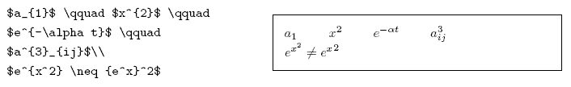
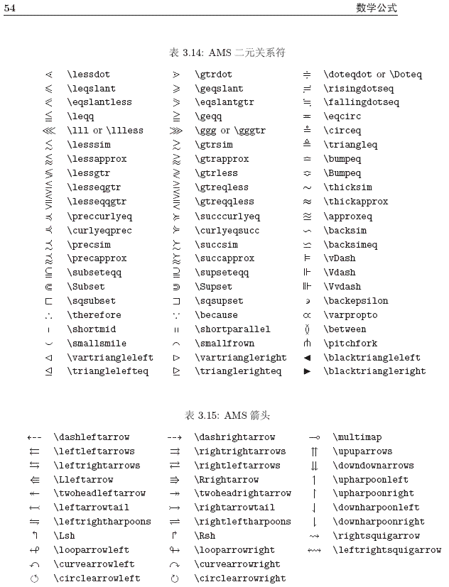

| 名称                       | 符号 | 代码            |
| -------------------------- | ---- | --------------- |
| 求和                       | ∑    | `$\sum$`        |
| 求积                       | ∏    | `$\prod$`       |
| 一重积分                   | ∫    | `$\int$`        |
| 二重积分                   | ∬    | `$\iint$`       |
| 三重积分                   | ∭    | `$\iiint$`      |
| 曲线积分                   | ∮    | `$\oint$`       |
| 微分算子                   | d*x* | `$\mathrm{d}x$` |
| 极限                       | lim  | `$\lim$`        |
| 空心字符(指示函数I(⋅)I(⋅)) | I    | `$\mathbb{I}$`  |
| 波浪线                     | ∼    | `$\sim$`        |

１、指数和下标可以用^和_后加相应字符来实现。比如：

2、平方根（square root）的输入命令为：\sqrt，n 次方根相应地为: \sqrt[n]。方根符号的大小由LATEX自动加以调整。也可用\surd 仅给出
符号。比如：

3、命令\overline 和\underline 在表达式的上、下方画出水平线。比如：

4、命令\overbrace 和\underbrace 在表达式的上、下方给出一水平的大括号。

5、向量（Vectors）通常用上方有小箭头（arrow symbols）的变量表示。这可由\vec 得到。另两个命令\overrightarrow 和\overleftarrow在定义从A 到B 的向量时非常有用。

6、分数（fraction）使用\frac{...}{...} 排版。一般来说，1/2 这种形式更受欢迎，因为对于少量的分式，它看起来更好些。

7、积分运算符（integral operator）用\int 来生成。求和运算符（sum operator）由\sum 生成。乘积运算符（product operator）由\prod 生成。上限和下限用^ 和_来生成，类似于上标和下标。

## 以下提供一些常用符号的表示方法

矩阵:
$$
\begin{pmatrix}
a & b\\
c & d
\end{pmatrix}
$$

$$
\begin{bmatrix}
a & b\\
c & d
\end{bmatrix}
$$

$$
\begin{Bmatrix}
a & b\\
c & d
\end{Bmatrix}
$$

