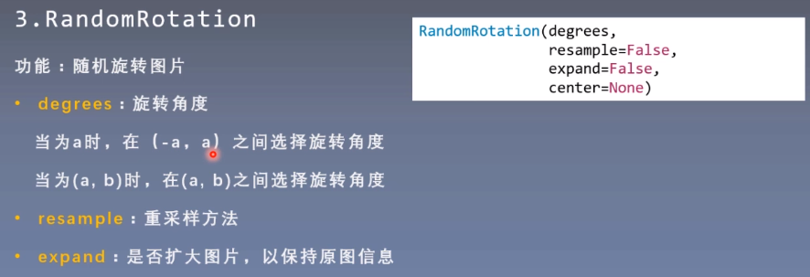
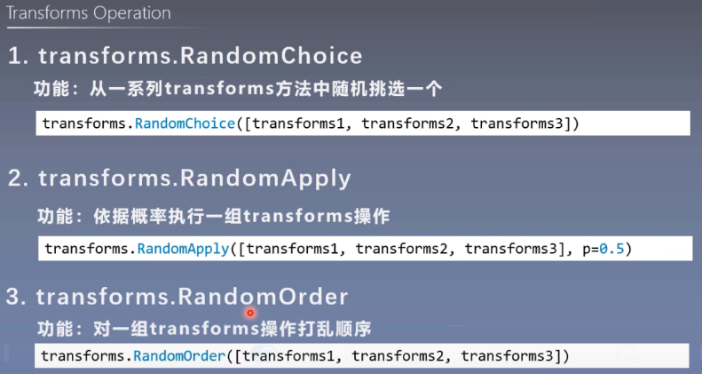
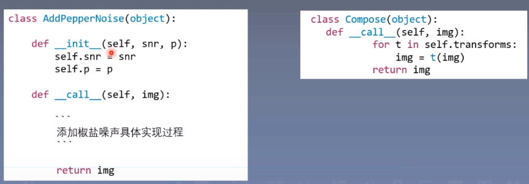

## Pytorch学习记录

[TOC]

[pytorch训练营视频记录]

### 1 tensor

```
Tensors类似于NumPy的Ndarry,唯一的区别是Tensor可以在GPU加速
```


**张量**是一个多维数组,是标量,向量,矩阵的高维拓展

+ **Tensor与Variable**

  

  Variable是torch.autograd中的数据类型,主要用于封装Tensor,进行==自动求导==

  + data:被包装的Tensor
  + grad:data的梯度
  + grad_fn:创建Tensor的Function,是自动求导的关键
  + requires_grad:是否需要梯度
  + is_leaf:是否是叶子节点

+ **Tensor**

  

  自Pytorch0.4.0开始,Variable并入Tensor

  + dtype:张量的数据类型,常用的有torch.float32 torch.int64
  + shape:张量的形状 (64,3,224,224)
  + device:张量所在的设备,GPU/CPU,是加速的关键

#### 1.0 Tensor 数据的存储

+ `.data`: 存储数据

+ `.grad`: 存储梯度

  ```
  如果我们想要修改 tensor 的数值，但是⼜不希望被 autograd 记录（即不会影响反向传播),
  那么可以对 tensor.data 进⾏操作
  ```

  tensor <-> numpy

  ```python
  x = torch.tensor([[1,2,3],[4,5,6],[7,8,9]])
  x.data 
  # tensor([[1, 2, 3],
  #        [4, 5, 6],
  #        [7, 8, 9]])
  y = x.data.numpy()  或者 y = x.numpy()
  print(y)
  # [[1 2 3]
  #  [4 5 6]
  #  [7 8 9]]
  ```

  - .data的其他操作

  ```python
  x.data.zero_()   # 用于网络初始化
  ```

#### 1.1 tensor 的创建

+ 直接创建

  

  + data:数据,可以是list,ndarray
  + dtype:默认与data一致,也可以在创建时指定
  + requires_grad:是否需要梯度计算
  + pin_memory:是否存于锁业内存(false)

+ 依据数据创建

+ 依据概率创建

```python
import torch
import numpy as np
# 直接创建 tensor
x = torch.empty(5, 3)
x = torch.rand(5,3)
x = torch.ones(5,3)
x = torch.zeros(5,3)
# 从数据直接构建tensor,(数据可以是list,numpy)
a = [1,2,3,4]
b = np.array([1,2,3,4])
x = torch.tensor(a)
x = torch.tensor(b) 	# 不与ndarry共享内存
x = torch.from_numpy(b) # 与ndarry共享内存

x = torch.arange(2,10,2)     # tensor([2, 4, 6, 8])
x = torch.linspace(2,10,6)	 # tensor([ 2.0000,  3.6000,  5.2000,  6.8000,  8.4000, 10.0000])

# 从一个已有的tensor构建一个新的tensor
x = x.new_ones(5,3)
x = torch.rand_like(x,dtype = torch.float)

# 依概率分布创建张量
torch.normal(mean,std) # 正态分布  mean: 张量 std: 张量  长度一定要相同
torch.randn() 			# 标准正态  只需要输入size
torch.rand() 			# [0,1) 均匀分布
torch.randint(low,high,size) # [low,high) 整数均匀分布
torch.randperm(n)  # 生成从0 到 n-1 的随机排列

```

#### 1.2 得到tensor的形状

```python
x = torch.tensor([[1,2,3],[4,5,6],[7,8,9]])
print("x.size(): ", x.size())  # x.shape    # x.size():  torch.Size([3, 3])
# 返回的是一个近似数组的类型?,可以取值,不可以赋值
print(x.shape[0])     # 3
```

#### 1.3 改变tensor的类型

x= x.double()
x=x.long()

```
tensor = torch.Tensor(3, 5)
```

torch.long() 将tensor投射为long类型

```
newtensor = tensor.long()
```

torch.half()将tensor投射为半精度浮点类型

```
newtensor = tensor.half()
```

torch.int()将该tensor投射为int类型

```
newtensor = tensor.int()
```

torch.double()将该tensor投射为double类型

```
newtensor = tensor.double()
```

torch.float()将该tensor投射为float类型

```
newtensor = tensor.float()
```

torch.char()将该tensor投射为char类型

```
newtensor = tensor.char()
```

torch.byte()将该tensor投射为byte类型

```
newtensor = tensor.byte()
```

torch.short()将该tensor投射为short类型

```
newtensor = tensor.short()
```

#### 1.4 tensor的操作

| 1. 拼接         |
| --------------- |
| 2. 切分         |
| 3.张量索引      |
| 4 .张量形状变换 |
| 5 .张量数学计算 |
| 6. 聚合类的操作 |


```python
# 1.拼接
t = torch.ones((2, 3))
torch.cat([t,t],dim = 0) 		# 将张量按维度dim进行拼接  0 : 按行拼接,列数不变 4*3
torch.stack([t,t],dim = 0) 		# 在新创建的维度dim上进行拼接 在第0维度拼接,创建一个新的维度 2*2*3

# 2.切分
torch.chunk(input,chunks,dim=0) # 将input张量按维度dim进行平均切分成chunks份 ,若不能整除,最后一份小于其他张量
torch.split(tensor,split_size_or_sections,dim=0) # split_size_or_sections: int:每个切片的长度 list:给定每个切片长度

# 3.张量索引
torch.index_select(input,dim,index)  # 在维度dim上,按index索引数据||返回值:依照index索引数据拼接的张量 (相当于选哪几行/列)
torch.masked_select(input,mask) # 按mask中的true进行索引 mask同input形状 返回:一维张量
#
#        生成mask:
#        gt(v) 大于v是true  te(v) 大于等于v
#        lt() le() 小于/小于等于

# 4 张量形状变换
torch.reshape(input,shape)
torch.transpose(input,dim0,dim1) # 交换dim0和dim1的维度 常用于图像预处理 C*H*W  -> H*W*C
torch.t() # 专门2维张量转置,对矩阵来说,等价于torch.transpose(input,0,1)
torch.squeeze(input,dim) # 压缩长度为1的维度(轴) dim:若为None,移除所有长度为1的轴;若指定维度,当且仅当该轴长度为1,可以被移除
torch.unsqueeze(input,dim) # 依据dim扩展维度
'''
5 张量数学计算
(1)加减乘除
(2)对数,指数,幂函数
(3)三角函数
'''
y = torch.rand(1,2)
torch.exp(y),torch.log2(y),torch.log(y),torch.cos(y)
or:# 两种操作都可以
y.exp(),y.log2(),y.log(),y.cos()

# 6 聚合类的操作
z = torch.ones(2,3)
z.sum(),z.min(),z.max(),z.mean()
# 按某一轴操作
z= torch.ones(2,3)
print(z)
print()
print(z.mean())       # tensor(1.) 整个tensor的均值(mean,max,sum...同理)
print(z.mean(axis=0)) # tensor([1., 1., 1.]) 对第0轴求均值
print(z.mean(axis=1)) # tensor([1., 1.])	 对第1轴求均值

# im2col
x = torch.ones(1,3,100,100) # [N,Channel,H,W]
windows = torch.nn.functional.unfold(x,kernel_size=5)
print(windows.size())       # [1,5*5*3,96*96]  torch.Size([1, 75, 9216])

processed = windows

out = torch.nn.functional.fold(processed,x.shape[-2:],kernel_size=5)
print(out.size())			# torch.Size([1, 3, 100, 100])
```

#### 1.5 统计信息


### 2 AutoGrad

#### 2.1 autograd基础操作

+ 计算梯度:`z.backward()`

  沿着计算图的每一条边计算梯度,直到叶子节点为止

+ 查看梯度:`x.grad`
  $$
  \frac{\partial z}{\partial x}
  $$
  注意:

+ 默认参数`backward(retain_graph=False)`下,计算图graph会被清空,如需保留,设置`retain_graph=True`

+ 如果多次调用`backward()`函数(训练的时候多次循环),梯度会不断累加,所以在下一次求梯度之前,要使用`net.zero_grad()`将梯度清零,或者`x.grad.zero_()` 也可以

+ 默认`requires_grad=False`,而且tensor类型必须是`float`

  需要求梯度:`x = torch.tensor([2,2],requires_grad=True,dtype = torch.float)`


```python
def f(a):
    return sum(a**2)
    
x = torch.tensor([2,2],requires_grad=True,dtype = torch.float)
y = x+1
z = f(y)
print(x,y,z)

if x.grad is not None:
    x.grad.zero_() # 梯度清零
    
z.backward()
print(x.grad)	# tensor([6., 6.])
x.grad.zero_() 
print(x.grad)  # tensor([0., 0.])

y.backward()  # 会报错,因为y不是一个标量,只能对标量进行求导
			  # Error: grad can be implicitly created only for scalar outputs
# 真的想要求梯度,可以在调⽤ backward 时需要传⼊⼀个和 y 同形的权重向量进⾏加权求和得到⼀个标量。
v = torch.tensor([2.,1.])
if x.grad is not None:
    x.grad.zero_()
y.backward(v)
print(x.grad) # tensor([2., 1.])
```

#### 2.2 自定义autograd

通过继承`torch.autograd.Function`可以定义自己的函数,并实现相应的梯度计算,

需要实现`forward()`和`backward()`

+ 属性（成员变量）
  `saved_tensors`: 传给`forward()`的参数，在`backward()`中会用到。
  `needs_input_grad`:长度为 :`attr:num_inputs`的`bool`元组，表示输出是否需要梯度。可以用于优化反向过程的缓存。
  `num_inputs`: 传给函数 `:func:forward`的参数的数量。
  `num_outputs`: 函数 :`func:forward`返回的值的数目。
  `requires_grad`: 布尔值，表示函数 :`func:backward` 是否永远不会被调用。

+ 成员函数
  `forward()`
  `forward`()可以有任意多个输入、任意多个输出，但是输入和输出必须是Variable。(官方给的例子中有只传入tensor作为参数的例子)
  `backward()`
  `backward()`的输入和输出的个数就是`forward()`函数的输出和输入的个数。其中，`backward()`输入表示关于`forward()`输出的梯度(计算图中上一节点的梯度)，`backward()`的输出表示关于`forward()`的输入的梯度。在输入不需要梯度时（通过查看`needs_input_grad`参数）或者不可导时，可以返回`None`。

```python
from torch.autograd import Function as Function
class Exp(Function):
    @staticmethod
    def forward(ctx,x):
        result = x.exp()
        ctx.save_for_backward(result)			# ctx可以理解为用于梯度缓存
        return result
    @staticmethod
    def backward(ctx,grad_output):				# backward() 就是在定义怎么对forward()求梯度module.parameters()
        result, = ctx.save_tensors
        return grad_output * result
```

```python
my_exp = Exp.apply # convert to function

x = torch.tensor([1.,2.],requires_grad = True)

y = my_exp(x)
print(y)				# tensor([2.7183, 7.3891], grad_fn=<ExpBackward>)
print(x.exp())

y.sum().backward()
print(x.grad)			# tensor([2.7183, 7.3891])
```

```python
class my_flip(Function):
    @staticmethod
    def forward(ctx,x):
        return x
    @staticmethod
    def backward(ctx,grad_output):    # 求导的结果是-1,用在链式法则里面,就是整体梯度反转
        return -1.0*grad_output

flip=my_flip.apply
x = torch.tensor([1.,2.],requires_grad=True)
xx = my_exp(x)
y = flip(xx)
print(y)						# tensor([2.7183, 7.3891], grad_fn=<my_flipBackward>)
z = y.sum()
print(z)						# tensor(10.1073, grad_fn=<SumBackward0>)
z.backward()
print(x.grad)					# tensor([-2.7183, -7.3891])
```

### 3.NN.MODULE

#### 3.0 模型创建步骤


==**模型创建- > 构建网络层+拓扑结构(拼接) -> 权值初始化**==

#### 3.1 基础概念

​	`	PyTorch`中已经为我们准备好了现成的网络模型，只要继承`nn.Module`，并实现它的`forward()`方法，PyTorch会根据`autograd`，自动实现`backward()`函数，在forward函数中可使用任何tensor支持的函数，还可以使用if、for循环、print、log等Python语法，写法和标准的Python写法一致。

`nn.Module`用来实现自定义的神经网络(或部分的网络),需要实现:

+ `__init__(self,...)`:网络的初始化,有哪些层,定义各层的结构
+ `forward(self,x)`:网络的前向传播

`nn.Module`的常用方法:

+ `zero_grad()`:清空所有层的梯度
+ `train()`:训练模式
+ `eval()`:测试模式
+ `cuda()/cpu()`:将整个网络(所有层)迁移到GPU或CPU上
+ `parameters()`:返回所有的参数(在初始化时有可能使用到),可以输入到优化器中

#### 3.2 MLP小例子

```python
import torch.nn as nn
import torch.nn.functional as F
```

```python
class My_MLP(nn.Module):		# 自定义层要继承`nn.Module`
    def __init__(self):
        super().__init__()
        # 定义两个全连接层
        self.fc1 = nn.Linear(100,1024)
        self.fc2 = nn.Linear(1024,10)
    def forward(self,x):
        x = F.relu(self.fc1(x))
        out = F.softmax(self.fc2(x),dim = 0)
        
        return out
```

```python
mlp = My_MLP()

data = torch.ones(50,100)

out = mlp(data)
print(out.shape)					# torch.Size([50, 10])
```

#### 3.3 常用组件

+ `nn.Conv2d`:二维卷积层(也有`nn.Conv1d`,`nn.Conv3d`)

+ `nn.ConvTranspose2d`:二维转置卷积层(反卷积)

  

+ `nn.Linear`:全连接层

+ `nn.MaxPool2d/nn.AvgPool2d`

  

+ `nn.ReLU`:ReLU层(也可用`F.relu`)
+ `nn.PReLU`:Leakey ReLU层(也可用`F.prelu`)


+ `nn.Dropout`

+ `BatchNorm2d`

#### 3.4 卷积例子(MNIST)

  ```python
  import torch
  import torch.nn as nn
  import torch.nn.functional as F
  '''
  我们还引用了nn.functional，这个包中包含了神经网络中使用的一些常用函数，这些函数的特点是，不具有可学习的参数(如ReLU，pool，DropOut等)，这些函数可以放在构造函数中，也可以不放，但是这里建议不放。
  '''
  ```

  ```python
  # 定义一个卷积block
  # 卷积 -> 激活 -> 池化 
  class ConvBlock(nn.Module):
      def __init__(self,in_channels,out_channels,use_pool=True):
          super().__init__()
          
          self.use_pool = use_pool
          # 卷积层 '1'表示输入图片为单通道， '6'表示输出通道数，'3'表示卷积核为3*3
          # self.conv1 = nn.Conv2d(1, 6, 3) module.parameters()
          self.conv = nn.Conv2d(in_channels,out_channels,kernel_size=3,padding=1)
          self.maxpool = nn.MaxPool2d(kernel_size=2)
      
      def forward(self,x):
          x = self.conv(x)
          x = F.relu(x)
          
          if self.use_pool:
              return self.maxpool(x)
          else:
              return x     
  ```

  ```python
  # 定义一个小型卷积神经网络
  class ConvNet(nn.Module):
      def __init__(self,num_classes=10):
          super().__init__()
          self.num_classes = num_classes
          # MNIST [28,28]
          self.conv1 = ConvBlock(1,32)   # [14,14]  经过一次pooling
          self.conv2 = ConvBlock(32,64)  # [7,7]	  经过一次pooling
          
          self.classifier = nn.Sequential(     # 顺序结构的网络 -> ->
              nn.Linear(7*7*64,1024),module.parameters()
              nn.ReLU(inplace=True),
              nn.Dropout(),
              nn.Linear(1024,256),
              nn.ReLU(inplace=True),
              nn.Dropout(),
              nn.Linear(256,num_classes)
          )
          
      def forward(self,x):
          x = self.conv1(x)
          x = self.conv2(x)
          # 把二维卷积的输出 压扁 ,输入全连接层 torch.flatten(x,1) 从dim=1开始压扁
          x = torch.flatten(x,1) # [N,64,7,7] --> [N,64*7*7] 
          
          out = self.classifier(x)
          return out
  ```

  ```python
  net = ConvNet()
  ```

#### 3.5 权重初始化


### 3+ 可视化

#### 1.打印log信息

```python
print(f'Train Epoch: {epoch} [{batch_id * len(data)}/{len(train_dataset)} ({100. * batch_id / len(train_loader):.0f}%)]'
      f'\tLoss: {loss.data.item():.5f}')
```

#### 2.TensorBoard

TensorBoard是tensorflow中强大的可视化工具,目前pytorch也可以使用

+ 运行机制
  + python脚本记录 需要可视化的 数据
  + 将数据保存为event_file的形式
  + tensorboard 读取 event_file 进行可视化


### 4.常用卷积的实现

####   4.1 LeNet


#### 4.2 ResNet-34

```

```


### 5.Datalodaer与Dataset


#### 5.1 DataLoader

DataLoader:构建==可迭代==的数据装载器,里面有个参数==dataset==,有自带的数据集,更多的是需要自己定义


**Epoch**:所有的训练样本都输入到模型中训练一遍,称之为一个Epoch

**Iteration:**一批样本输入到模型中,称为一个Iteration

**Batchsize:**批大小,决定一个Epoch有多少个Iteration


#### 5.2 Dataset

定义数据从哪里读取,如何读取


#### 5.3 实现Pipline


```python
import torch
import numpy as np
import torch.nn as nn
from torchvision import models,transforms
from torch.utils.data import Dataset
from torch.utils.data import DataLoader

"""
pytorch的数据读取模块
DataLoader Dataset

DataLodaer(11个参数)
主要参数:
DataSet类 定义数据从哪读取 如何读取
batchsize=1
num_works=0
shuffle=None
drop_last=False
"""

# dataset 是一个抽象类,不能直接实例化,要用一个子类去继承
# dataloader 可以直接实例化

class myDataset(Dataset):
    # 初始化
    def __init__(self):
        pass

    # 这个魔法方法实现的功能: 实例化这个类之后,可以支持下标操作,dataset[index]
    # 把第index条数据取出来
    def __getitem__(self, index):
        pass

    # 这个魔法方法返回数据集的长度 len(dataset)
    def __len__(self):
        pass

dataset = myDataset()   # 实例化我们的自定义数据集
train_loader = DataLoader(dataset=dataset,
                          batch_size=32,
                          shuffle=True,
                          num_workers=2)


def train():
    global  MAX_EPOCH
    # net.train()
    for epoch in range(MAX_EPOCH):
        for i, data in enumerate(train_loader):
            # 1.数据
            x,y = data
            # 2.前传
            y_pred = net(x)
            loss = criterion(y_pred,y)
			# 3.反传,更新
            optimizer.grad_zero()
            loss.backward()
            optimizer.step()
            pass
```

#### 5.4 图片数据集的简单实现方法

在图像分类任务中，PyTorch有一个现成的图片数据集读取函数 ： `torchvision.datasets.ImageFolder`。

这个api的使用方法为：

假设所有图片数据都按文件夹保存好，每个文件夹下存储的是同一类别的图片数据，文件夹的名字为类别的名字。

将这些按类别保存图片的文件夹都放到一个大文件夹下。

在代码中的命令如下：

```python
dataset = torchvision.datasets.ImageFolder(root=保存着类别文件夹的大文件夹的位置,
                                           transform=对图像数据设置的一些预处理操作)
```

对于简单的图像分类任务，并不需要自己定义一个 Dataset类，可以直接调用 torchvision.datasets.ImageFolder 返回训练数据与标签。

##### 1.数据集组织方式

  既然是调用API，那么你的数据集必然得按照API的要求去组织，

 torchvision.datasets.ImageFolder 要求数据集按照如下方式组织：

A generic data loader where the images are arranged in this way:

        root/dog/xxx.png
        root/dog/xxy.png
        root/dog/xxz.png
    
        root/cat/123.png
        root/cat/nsdf3.png
        root/cat/asd932_.png
注意：根目录 root 下存储的是类别文件夹（如cat，dog），每个类别文件夹下存储相应类别的图像（如xxx.png）。

##### 2. torchvision.datasets.ImageFolder 介绍


可以从源码看出，torchvision.datasets.ImageFolder 有 root, transform, target_transform, loader四个参数，现在依次介绍这四个参数。

1. **root：**图片存储的根目录，即各类别文件夹所在目录的上一级目录，在下面的例子中是’./data/train/’。

2. **transform**：对图片进行预处理的操作（函数），原始图片作为输入，返回一个转换后的图片。

3. **target_transform**：对图片类别进行预处理的操作，输入为 target，输出对其的转换。如果不传该参数，即对 target 不做任何转换，返回的顺序索引 0,1, 2…

4. **loade**r：表示数据集加载方式，通常默认加载方式即可。

   
  
   另外，该 API 有以下成员变量:

**self.classes**：用一个 list 保存类别名称
**self.class_to_idx**：类别对应的索引，与不做任何转换返回的 target 对应
**self.imgs：**保存(img-path, class) tuple的 list，与我们自定义 Dataset类的 def __getitem__(self, index): 返回值类似。注意看下面实例中 dataset.imgs 的返回值

##### 3.torchvision.datasets.ImageFolder 实例

先看数据集组织结构：


即根目录为 “./data/train/”，根目录下有三个类别文件夹，即Snowdrop、LilyValley、Daffodil，每个类别文件夹下有80个训练样本。

```python
import torchvision

dataset = torchvision.datasets.ImageFolder('./data/train/') # 不做transform
print(dataset.classes)
print(dataset.class_to_idx)
print(dataset.imgs)
```


那么如何取一个图片数据呢？

```
# dataset[0] 表示取第一个训练样本，即(path， class_index)。

print(dataset[0][0]) # 返回的数据是PIL Image对象
```

```python
# encoding: utf-8
"""
@author     : swc
@contact    : shenwancheng19@nudt.edu.cn
@software   : PyCharm
@file       : prepare_data.py
@time       : 2020/7/8 下午8:23
@brief      : 准备数据,dataset dataloader
"""
from torch.utils.data import Dataset, DataLoader
from torchvision import datasets, transforms
import numpy as np

# ===============================================step 1 dataset dataloader===================================================
train_dir = '../mnist_data/my_mnist/raw/train'
test_dir = '../mnist_data/my_mnist/raw/test'

train_dataset = datasets.ImageFolder(train_dir, transform=transforms.ToTensor())
test_dataset = datasets.ImageFolder(test_dir, transform=transforms.ToTensor())


train_loader = DataLoader(dataset=train_dataset,
                          batch_size=32,
                          shuffle=True,
                          num_workers=2)

test_loader = DataLoader(dataset=test_dataset,
                         batch_size=32,
                         shuffle=True,
                         num_workers=2)

if __name__ == '__main__':
    print(train_dataset.classes)
    print(train_dataset.class_to_idx)
    print("length:\t", len(train_dataset))

    print(train_dataset.imgs[0:10])  # 保存(img-path, class) tuple的 list
    # print(train_dataset[0])                 # dataset[0] 表示取第一个训练样本，即(img， class_index)
    print(test_dataset[5000][0].dtype)  # torch.Size([3, 28, 28]) ? 怎么变成3通道了?  torch.float32
    data = train_dataset[0]
    # print(data[0])                          # 第一张图片
    for i, data in enumerate(test_loader):
        x, labels = data
        print("labels:\t",labels.numpy())
        if i > 4:
            break
```

### 6.Transforms

`torchvision.transforms:常用的图像预处理模块`


#### 6.1 裁剪

1. **transforms.CenterCrop(size)**

   

2.**transforms.RandomCrop**


**3.RandomResizedCrop**


**4.FiveCrop/TenCrop**


#### 6.2 翻转和旋转




expand:

左图不进行expand,图片四个角的信息会丢失,

右图进行expand,图片扩大,保持原图信息


#### 6.3 图像变换

**1.Pad**


**2.ColorJitter**


**brightness < 1 图像变暗**


**3.transforms.Resize(size,interpolation=2)**

size:最好设置成h*w

**4.transforms.ToTensor**

将PIL Image 或者 ndarray 转换成tensor,并且归一化到[0,1]

这里的归一化是直接除以255,若自己的ndarry数据尺度有变化,需要自行修改

**5.transforms.ToPILImage**

transforms.ToPILImage(mode=None)

将tensor或者ndarray的数据转化为PIL Image 类型数据

mode---None:单通道

mode = 3 : RGB

**3.4.转为灰色图像**


**5.仿射变换**


**6.随机遮挡**

对张量进行操作,所以要先进行ToTensor()


#### 6.4 用户自定义


#### 6.5 transforms的操作



#### 6.6 自定义transforms


**code:**




#### 6.7 增强策略


### 7. 模型搭建技巧


1. 特征图的大小减半时,卷积核的个数也要增加一倍

2. Conv2d-BN-ReLu通常放在一起  

3. 卷积层向全连接层过渡时,经常使用自适应平均池化,自适应最大池化(可以只用一个)

   这样可以1.减少网络参数

   ​				2.正则化效果

   ​				3.最后输出的特征长度只与通道个数有关,和图片大小无关,这样就可以自适应输入图片大小


### 8.优化器

pass

### 9.Finetune

#### 9.1 模型的保存和加载

**1.保存模型**

PyTorch中保存和加载训练模型有两种常⻅的⽅法:
1. 仅保存和加载模型参数( state_dict )；(**一般用这种方法**)
2. 保存和加载整个模型。

```python
# 训练完成后保存模型
torch.save(model.state_dict(), PATH)  # 推荐的⽂件后缀名是pt或pth
```

**2.加载模型**

```python
# 网络结构相同的模型
net = model()
if pre_trained:
    pretrained_dict = torch.load('net_params.pth')
    net.load_state_dict(pretrained_dict)
```

**原有模型**:全连接层是256--->10


权重是以**字典**的形式保存的:

key:层的名字

value:权重

```python
print(pretrained_dict.keys())
```


**新模型**:全连接层改为256--->128--->10

==怎样复用前面几层的权重?==


```python
# 只复用256层之前的权重
# 构建一个字典，使得字典的keys和我们自己创建的网络相同，我们再从各种预训练网络把想要的参数对着新的keys填进去就可以有一个新的`state_dict`
# 这种办法需要知道用了预训练模型的哪几层
net = model()
net = net.to(device)

net_state_dict = net.state_dict().copy()                    # 获取刚创建的模型的参数字典
new_dict_list = list(net_state_dict.keys())					# 参数名称(keys)
print("(new)first layer:\n", net_state_dict[new_dict_list[0]])

pretrained_dict = torch.load('net_params_256_10.pth')       # 加载预训练的参数
old_dict_list = list(pretrained_dict.keys())				# 参数名称(keys)

# 查看新旧模型参数层个数
print(f'new size: {len(new_dict_list)},old size: {len(old_dict_list)}')

if pre_trained:
    # 这里只用了前四层
    for i in range(4):
        net_state_dict[new_dict_list[i]] = pretrained_dict[old_dict_list[i]]

    print("(old)first layer:\n", net_state_dict[new_dict_list[0]])

    # 加载更新后的参数
    net.load_state_dict(net_state_dict)
else:
    net.initialize_weights()
```

```python
resnet34_ft = models.resnet34(pretrained=False)
# 加载预训练模型
# 新建模型的字典
state_dict = resnet34_ft.state_dict().copy()
new_dict_list = list(state_dict.keys())
see_layer = 6             # 看第几层的参数 预训练模型的key排序和 新建模型的不一样, 但是相同层的权重相同
if 1:
    print("(new)first layer weights:\n", state_dict[new_dict_list[see_layer]])
# 预训练字典
pretrained_dict = torch.load(weights_path)
old_dict_list = list(pretrained_dict.keys())				# 参数名称(keys), 权重(value)
if 1:
    print("(pretrained)first layer weights:\n", pretrained_dict[old_dict_list[see_layer]])
# print("lenght:\t", len(old_dict_list))                      # 182
# 加载权重之后
resnet34_ft.load_state_dict(pretrained_dict)
update_dict = resnet34_ft.state_dict().copy()
update_dict_list = list(update_dict.keys())
if 1:
    print("(after update)first layer weights:\n", update_dict[update_dict_list[see_layer]])
# summary(resnet34_ft, input_size=(3, 224, 224), device='cpu')
# print(resnet34_ft)

# 替换fc层, 前面卷积层的权重依然保存 !!!
num_ftrs = resnet34_ft.fc.in_features
resnet34_ft.fc = nn.Linear(num_ftrs, classes)
# 替换全连接层后,查看前面层权重是否变化
replaced_dict = resnet34_ft.state_dict().copy()
replaced_dict_list = list(replaced_dict.keys())
if 1:
    print("(after replace)first layer weights:\n", replaced_dict[replaced_dict_list[see_layer]])
```


**3.自由载入部分模型参数并冻结**

Pytorch的`load`方法和`load_state_dict`方法只能较为**固定**的读入参数文件，他们要求读入的`state_dict`的key和`Model.state_dict()`的key对应相等。

而我们在进行迁移学习的过程中也许只需要使用某个预训练网络的**一部分**，**把多个网络拼和成一个网络**，或者为了得到中间层的输出而分离预训练模型中的Sequential 等等，这些情况下。传统的load方法就不是很有效了。

例如，我们想利用Mobilenet的前7个卷积并把这几层冻结，后面的部分接别的结构，或者改写成FCN结构，传统的方法就不奏效了。

最普适的方法是：构建一个字典，使得字典的keys和我们自己创建的网络相同，我们再从各种预训练网络把想要的参数对着新的keys填进去就可以有一个新的`state_dict`了，这样我们就可以load这个新的`state_dict`，目前只能想到这个方法应对较为复杂的网络变换。

网上查“载入部分模型”，“冻结部分模型”一般都是只改个FC,根本没有用，初学的时候自己写state_dict也踩了一些坑，发出来记录一下。

------

**一.载入部分预训练参数**

我们先看看Mobilenet的结构

( 来源github,附带预训练模型）

```python
class Net(nn.Module):
    def __init__(self):
        super(Net, self).__init__()

        def conv_bn(inp, oup, stride):
            return nn.Sequential(
                nn.Conv2d(inp, oup, 3, stride, 1, bias=False),
                nn.BatchNorm2d(oup),
                nn.ReLU(inplace=True)
            )

        def conv_dw(inp, oup, stride):
            return nn.Sequential(
                nn.Conv2d(inp, inp, 3, stride, 1, groups=inp, bias=False),
                nn.BatchNorm2d(inp),
                nn.ReLU(inplace=True),
    
                nn.Conv2d(inp, oup, 1, 1, 0, bias=False),
                nn.BatchNorm2d(oup),
                nn.ReLU(inplace=True),
            )

        self.model = nn.Sequential(
            conv_bn(  3,  32, 2), 
            conv_dw( 32,  64, 1),
            conv_dw( 64, 128, 2),
            conv_dw(128, 128, 1),
            conv_dw(128, 256, 2),
            conv_dw(256, 256, 1),
            conv_dw(256, 512, 2),
            conv_dw(512, 512, 1),
            conv_dw(512, 512, 1),
            conv_dw(512, 512, 1),
            conv_dw(512, 512, 1),
            conv_dw(512, 512, 1),
            conv_dw(512, 1024, 2),
            conv_dw(1024, 1024, 1),
            nn.AvgPool2d(7),
        )
        self.fc = nn.Linear(1024, 1000)

    def forward(self, x):
        x = self.model(x)
        x = x.view(-1, 1024)
        x = self.fc(x)
        return x
```

我们只需要前7层卷积，并且为了方便日后concate操作，我们把Sequential拆开，成为下面的样子

```python
class Net(nn.Module):
    def __init__(self):
        super(Net, self).__init__()

        def conv_bn(inp, oup, stride):
            return nn.Sequential(
                nn.Conv2d(inp, oup, 3, stride, 1, bias=False),
                nn.BatchNorm2d(oup),
                nn.ReLU(inplace=True)
            )

        def conv_dw(inp, oup, stride):
            return nn.Sequential(
                nn.Conv2d(inp, inp, 3, stride, 1, groups=inp, bias=False),
                nn.BatchNorm2d(inp),
                nn.ReLU(inplace=True),
    
                nn.Conv2d(inp, oup, 1, 1, 0, bias=False),
                nn.BatchNorm2d(oup),
                nn.ReLU(inplace=True),
            )
        
        self.conv1 = conv_bn(  3,  32, 2)
        self.conv2 = conv_dw( 32,  64, 1)
        self.conv3 = conv_dw( 64, 128, 2)
        self.conv4 = conv_dw(128, 128, 1)
        self.conv5 = conv_dw(128, 256, 2)
        self.conv6 = conv_dw(256, 256, 1)
        self.conv7 = conv_dw(256, 512, 2)
        
        # 原来这些不要了
        # 可以自己接后面的结构
        '''
        self.features = nn.Sequential(
        conv_dw(512, 512, 1),
        conv_dw(512, 512, 1),
        conv_dw(512, 512, 1),
        conv_dw(512, 512, 1),
        conv_dw(512, 512, 1),
        conv_dw(512, 1024, 2),
        conv_dw(1024, 1024, 1),
        nn.AvgPool2d(7),)
        
        self.fc = nn.Linear(1024, 1000)
        '''
        
    def forward(self, x):
        x1 = self.conv1(x)
        x2 = self.conv2(x1)
        x3 = self.conv3(x2)
        x4 = self.conv4(x3)
        x5 = self.conv5(x4)
        x6 = self.conv6(x5)
        x7 = self.conv7(x6)
        #x8 = self.features(x7)
        #out = self.fc
        return (x1,x2,x3,x4,x4,x6,x7)
```

我们更具改过的结构创建一个net,看看他的`state_dict`和我们预训练文件的`state_dict`有啥区别

```python
net = Net()
#我的电脑没有GPU,他的参数是GPU训练的cudatensor,于是要下面这样转换一下
dict_trained = torch.load("mobilenet_sgd_rmsprop_69.526.tar",map_location=lambda storage, loc: storage)["state_dict"]
dict_new = net.state_dict().copy()

new_list = list (net.state_dict().keys() )
trained_list = list (dict_trained.keys()  )
print("new_state_dict size: {}  trained state_dict size: {}".format(len(new_list),len(trained_list)) )
print("New state_dict first 10th parameters names")
print(new_list[:10])
print("trained state_dict first 10th parameters names")
print(trained_list[:10])

print(type(dict_new))
print(type(dict_trained))
```

得到输出如下：

我们截断一半之后，参数由137变成65了，前十个参数看出，名字变了但是顺序其实没变。state_dict的数据类型是Odict,可以按照dict的操作方法操作。

> new_state_dict size: 65 trained state_dict size: 137
>
> New state_dict first 10th parameters names
> ['conv1.0.weight', 'conv1.1.weight', 'conv1.1.bias', 'conv1.1.running_mean', 'conv1.1.running_var', 'conv2.0.weight', 'conv2.1.weight', 'conv2.1.bias', 'conv2.1.running_mean', 'conv2.1.running_var']
>
> trained state_dict first 10th parameters names
> ['module.model.0.0.weight', 'module.model.0.1.weight', 'module.model.0.1.bias', 'module.model.0.1.running_mean', 'module.model.0.1.running_var', 'module.model.1.0.weight', 'module.model.1.1.weight', 'module.model.1.1.bias', 'module.model.1.1.running_mean', 'module.model.1.1.running_var']
>
> <class 'collections.OrderedDict'>
> <class 'collections.OrderedDict'>

我们看出只要构建一个字典，使得字典的keys和我们自己创建的网络相同，我们在从各种预训练网络把想要的参数对着新的keys填进去就可以有一个新的state_*dict了，这样我们就可以load这个新的state*_dict，这是最普适的方法适用于所有的网络变化。

```text
for i in range(65):
    dict_new[ new_list[i] ] = dict_trained[ trained_list[i] ]

net.load_state_dict(dict_new)
```

还有别的情况，比如我们只是在后面加了一些层，没有改变原来网络层的名字和结构，可以用下面的简便方法：

```python
loaded_dict = {k: loaded_dict[k] for k, _ in model.state_dict()}       # 把原来的网络层权重加进字典,后面自定义的层 随机初始化
```

------

**二.冻结这几层参数**

方法很多，这里用和上面方法对应的冻结方法

```text
发现之前的冻结有问题，还是建议看一下
https://discuss.pytorch.org/t/how-the-pytorch-freeze-network-in-some-layers-only-the-rest-of-the-training/7088
或者
https://discuss.pytorch.org/t/correct-way-to-freeze-layers/26714
或者
```

对应的，在训练时候，optimizer里面只能更新requires_grad = True的参数，于是

```text
optimizer = torch.optim.Adam( filter(lambda p: p.requires_grad, net.parameters(),lr) )
```

### 10.Ignite - pytorch的高级训练库


### 11.TensorRT加速


## 平时遇到的小问题

### 1.关于label

在测试网络的输出时,想要计算loss看看

```python
distance_image  = torch.randn(4, 1, height, width).to(device)
intensity_image = torch.randn(4, 1, height, width).to(device)
# 需要注意
# 1.Label的type必须是long
# 2.模型输入是[N,C,H,W],label是[N,H,W]
# 3.label的值是0~classes-1
label           = torch.zeros(4,height, width).long()
label = label.to(device)

input_tensor = torch.cat([distance_image,intensity_image],1)

print("input size: ",input_tensor.shape)

out = model(distance_image, intensity_image)

print("output size: ",out.shape)

loss_function = nn.CrossEntropyLoss()

loss = loss_function(out,label)
```

