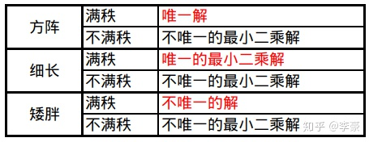

# 学习动机

平时很多地方都用到了SVD,比如PCA的高效解法,但一直对它一知半解,这样会出大问题,所以找个机会把它彻底搞懂.

# 1.SVD简介

[知乎__SVD的应用：求解Ax=b](https://zhuanlan.zhihu.com/p/131097680)

.......后面没看

# 2.SVD应用

## 2.1 曲线拟合

## 2.2 PCA

## 2.3 ICP

