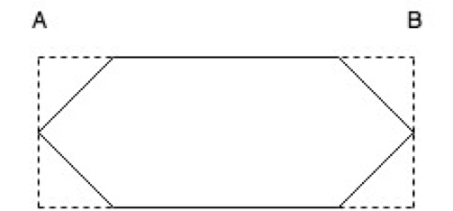
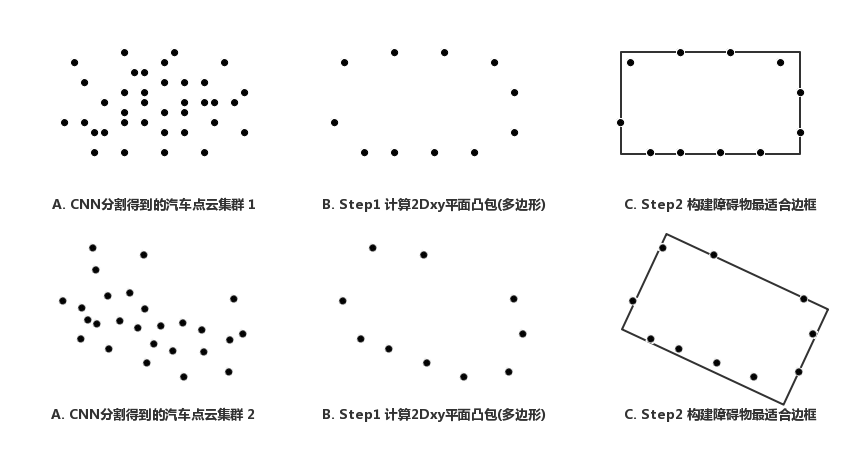
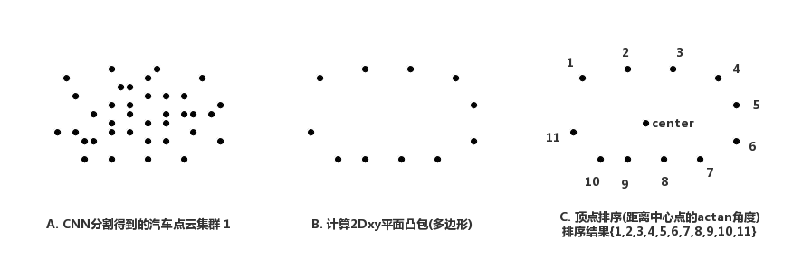
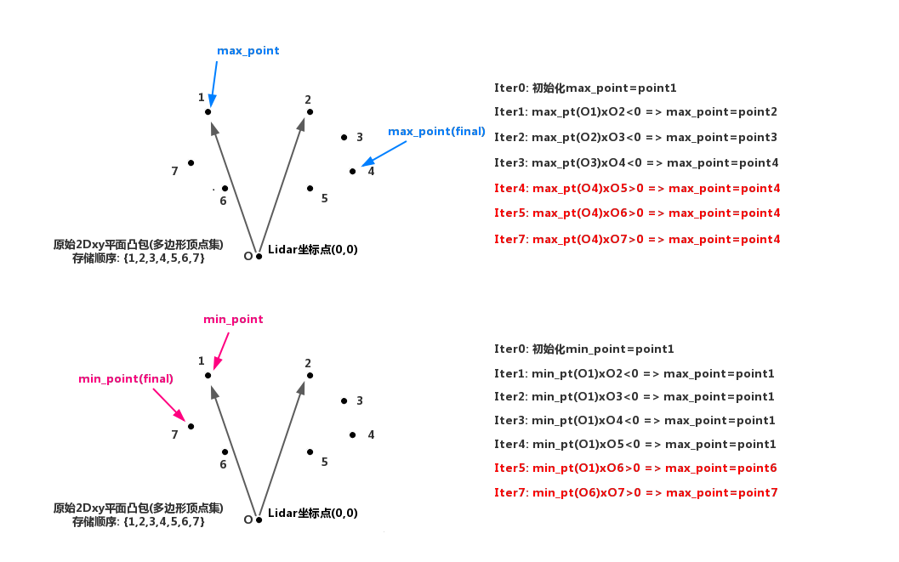
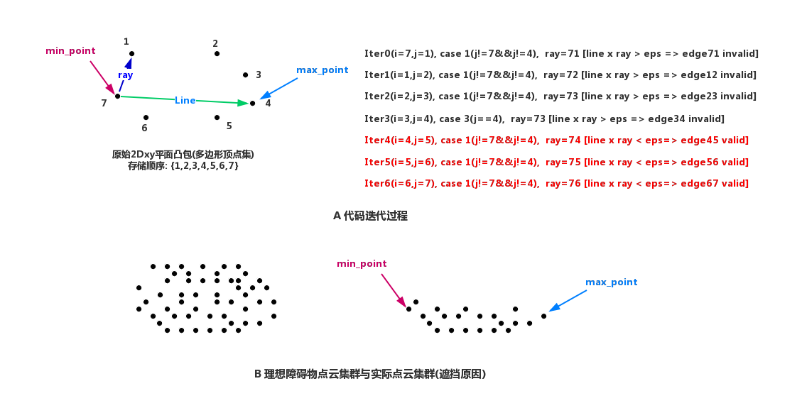

# MinBox障碍物边框构建

from https://github.com/YannZyl/Apollo-Note

>对象构建器组件为检测到的障碍物建立一个边界框。因为LiDAR传感器的遮挡或距离，形成障碍物的点云可以是稀疏的，并且仅覆盖一部分表面。因此，盒构建器将恢复给定多边形点的完整边界框。即使点云稀疏，边界框的主要目的还是预估障碍物（例如，车辆）的方向。同样地，边框也用于可视化障碍物。
>
>算法背后的想法是找到给定多边形点边缘的所有区域。在以下示例中，如果AB是边缘，则Apollo将其他多边形点投影到AB上，并建立具有最大距离的交点对，这是属于边框的边缘之一。然后直接获得边界框的另一边。通过迭代多边形中的所有边，在以下图4所示，Apollo确定了一个6边界边框，将选择具有最小面积的方案作为最终的边界框。



这部分代码看了比较久，有些地方一直没想明白，直到推理了很久才找到了一种合适的说法，下面我们依旧从代码入手，一步步解析障碍物边框构建的流程。

上一步CNN分割与后期处理，可以得到lidar一定区域内的障碍物集群。接下去我们将对这些障碍物集群建立其标定框。标定框的作用除了标识物体，还有一个作用就是标记障碍物的长length，宽width，高height。其中规定长length大于宽width，障碍物方向就是长的方向direction。MinBox构建过程如下：

- 计算障碍物2d投影(高空鸟瞰xy平面)下的多边形polygon(如下图B)
- 根据上述多边形，计算最适边框(如下图C)



大致的代码框架如下：

```c++
/// file in apollo/modules/perception/obstacle/onboard/lidar_process_subnode.cc
void LidarProcessSubnode::OnPointCloud(const sensor_msgs::PointCloud2& message) {
  /// call hdmap to get ROI
  ...
  /// call roi_filter
  ...
  /// call segmentor
  ...
  /// call object builder
  if (object_builder_ != nullptr) {
    ObjectBuilderOptions object_builder_options;
    if (!object_builder_->Build(object_builder_options, &objects)) {
      ...
    }
  }
}

/// file in apollo/modules/perception/obstacle/lidar/object_builder/min_box/min_box.cc
bool MinBoxObjectBuilder::Build(const ObjectBuilderOptions& options, std::vector<ObjectPtr>* objects) {
  for (size_t i = 0; i < objects->size(); ++i) {
    if ((*objects)[i]) {
      BuildObject(options, (*objects)[i]);
    }
  }
}
void MinBoxObjectBuilder::BuildObject(ObjectBuilderOptions options, ObjectPtr object) {
  ComputeGeometricFeature(options.ref_center, object);
}
void MinBoxObjectBuilder::ComputeGeometricFeature(const Eigen::Vector3d& ref_ct, ObjectPtr obj) {
  // step 1: compute 2D xy plane's polygen
  ComputePolygon2dxy(obj);
  // step 2: construct box
  ReconstructPolygon(ref_ct, obj);
}
```

上述是MinBox障碍物边框构建的主题框架代码，构建的两个过程分别在`ComputePolygon2dxy`和`ReconstructPolygon`函数完成，下面篇幅我们就具体深入这两个函数，详细了解一下Apollo对障碍物构建的一个流程，和其中一些令人费解的代码段。

## Step 1. MinBox构建--计算2DXY平面投影

这个阶段主要作用是障碍物集群做XY平面下的凸包多边形计算，最终得到这个多边形的一些角点。第一部分相对比较简单，没什么难点，计算凸包是调用PCL库的`ConvexHull`组件(具体请参考[pcl::ConvexHull](http://docs.pointclouds.org/trunk/classpcl_1_1_convex_hull.html))。下面是Apollo的凸包计算代码：

```C++
/// file in apollo/modules/perception/obstacle/lidar/object_builder/min_box/min_box.cc
void MinBoxObjectBuilder::ComputePolygon2dxy(std::shared_ptr<Object> obj) {
  Eigen::Vector4f min_pt;
  Eigen::Vector4f max_pt;
  pcl_util::PointCloudPtr cloud = obj->cloud;
  SetDefaultValue(cloud, obj, &min_pt, &max_pt);
  // 如果点数小于4
  if (cloud->points.size() < 4u) {
    return;
  }
    // ....
}
```

首先进入函数`SetDefaultValue()`

```C++
/// [IN]:   cloud
/// [IN]:   obj
/// [OUT]:	min_pt
/// [OUT]:	max_pt
virtual void SetDefaultValue(pcl_util::PointCloudPtr cloud,
                               std::shared_ptr<Object> obj,
                               Eigen::Vector4f* min_pt,
                               Eigen::Vector4f* max_pt) {
    // 这个函数 GetCloudMinMax3D() 就是把点云cloud中xyz三轴 的极值 存在 min_pt 和 max_pt中
    // min_pt[x_min,y_min,z_min]
    // max_pt[x_max,y_max,z_max]
    GetCloudMinMax3D<pcl_util::Point>(cloud, min_pt, max_pt);
    Eigen::Vector3f center(((*min_pt)[0] + (*max_pt)[0]) / 2,
                           ((*min_pt)[1] + (*max_pt)[1]) / 2,
                           ((*min_pt)[2] + (*max_pt)[2]) / 2);

    // handle degeneration case
    float epslin = 1e-3;
    for (int i = 0; i < 3; i++) {
      if ((*max_pt)[i] - (*min_pt)[i] < epslin) {
        (*max_pt)[i] = center[i] + epslin / 2;
        (*min_pt)[i] = center[i] - epslin / 2;
      }
    }

    // length
    obj->length = (*max_pt)[0] - (*min_pt)[0];
    // width
    obj->width = (*max_pt)[1] - (*min_pt)[1];
    if (obj->length - obj->width < 0) {
      float tmp = obj->length;
      obj->length = obj->width;
      obj->width = tmp;
      obj->direction = Eigen::Vector3d(0.0, 1.0, 0.0);
    } else {
      obj->direction = Eigen::Vector3d(1.0, 0.0, 0.0);
    }
    // height
    obj->height = (*max_pt)[2] - (*min_pt)[2];
    // center
    obj->center = Eigen::Vector3d(((*max_pt)[0] + (*min_pt)[0]) / 2,
                                  ((*max_pt)[1] + (*min_pt)[1]) / 2,
                                  ((*max_pt)[2] + (*min_pt)[2]) / 2);
    // polygon
    if (cloud->size() < 4) {
      obj->polygon.points.resize(4);
      obj->polygon.points[0].x = static_cast<double>((*min_pt)[0]);
      obj->polygon.points[0].y = static_cast<double>((*min_pt)[1]);
      obj->polygon.points[0].z = static_cast<double>((*min_pt)[2]);

      obj->polygon.points[1].x = static_cast<double>((*max_pt)[0]);
      obj->polygon.points[1].y = static_cast<double>((*min_pt)[1]);
      obj->polygon.points[1].z = static_cast<double>((*min_pt)[2]);

      obj->polygon.points[2].x = static_cast<double>((*max_pt)[0]);
      obj->polygon.points[2].y = static_cast<double>((*max_pt)[1]);
      obj->polygon.points[2].z = static_cast<double>((*min_pt)[2]);

      obj->polygon.points[3].x = static_cast<double>((*min_pt)[0]);
      obj->polygon.points[3].y = static_cast<double>((*max_pt)[1]);
      obj->polygon.points[3].z = static_cast<double>((*min_pt)[2]);
    }
  }
```

> 完成初始化的操作,或得了cloud的min_pt和max_pt,存在min_pt和max_pt中
>
> 对象obj中的 length,width,height和center由min_pt和max_pt也可以获得
>
> 同时,如果点数小于4,初始化cloud的polygon

点数小于4,函数`ComputePolygon2dxy`返回,下面看点数大于4的情况:

```C++

  if (cloud->points.size() < 4u) {
    return;
  }
  GetCloudMinMax3D<pcl_util::Point>(cloud, &min_pt, &max_pt);
  obj->height = static_cast<double>(max_pt[2]) - static_cast<double>(min_pt[2]);
  const double min_eps = 10 * std::numeric_limits<double>::epsilon();
  // double min_eps = 0.1;
  // if ((max_pt[0] - min_pt[0]) < min_eps) {
  //     cloud_->points[0].x += min_eps;
  // }
  // if ((max_pt[1] - min_pt[1]) < min_eps) {
  //     cloud_->points[0].y += min_eps;
  // }
  
  /// apollo 3.5 中,对下面这段代码进行了封装 判断点云 是否
  const double diff_x = cloud->points[1].x - cloud->points[0].x;
  const double diff_y = cloud->points[1].y - cloud->points[0].y;
  size_t idx = 0;
  for (idx = 2; idx < cloud->points.size(); ++idx) {
    const double tdiff_x = cloud->points[idx].x - cloud->points[0].x;
    const double tdiff_y = cloud->points[idx].y - cloud->points[0].y;
    if ((diff_x * tdiff_y - tdiff_x * diff_y) > min_eps) {
      break;
    }
  }
  if (idx >= cloud->points.size()) {
    cloud->points[0].x += min_eps;
    cloud->points[0].y += min_eps;
    cloud->points[1].x -= min_eps;
  }

  PointCloudPtr pcd_xy(new PointCloud);
  for (size_t i = 0; i < cloud->points.size(); ++i) {
    pcl_util::Point p = cloud->points[i];
    p.z = min_pt[2];
    pcd_xy->push_back(p);
  }
  // class ConvexHull2DXY : public pcl::ConvexHull<PointInT>
  // 这个类继承自pcl::ConvexHull
  ConvexHull2DXY<pcl_util::Point> hull;
  hull.setInputCloud(pcd_xy);
  hull.setDimension(2);
  std::vector<pcl::Vertices> poly_vt;
  PointCloudPtr plane_hull(new PointCloud);
  hull.Reconstruct2dxy(plane_hull, &poly_vt);

  if (poly_vt.size() == 1u) {
    std::vector<int> ind(poly_vt[0].vertices.begin(),
                         poly_vt[0].vertices.end());
    TransformPointCloud(plane_hull, ind, &obj->polygon);
  } else {
    obj->polygon.points.resize(4);
    obj->polygon.points[0].x = static_cast<double>(min_pt[0]);
    obj->polygon.points[0].y = static_cast<double>(min_pt[1]);
    obj->polygon.points[0].z = static_cast<double>(min_pt[2]);

    obj->polygon.points[1].x = static_cast<double>(min_pt[0]);
    obj->polygon.points[1].y = static_cast<double>(max_pt[1]);
    obj->polygon.points[1].z = static_cast<double>(min_pt[2]);

    obj->polygon.points[2].x = static_cast<double>(max_pt[0]);
    obj->polygon.points[2].y = static_cast<double>(max_pt[1]);
    obj->polygon.points[2].z = static_cast<double>(min_pt[2]);

    obj->polygon.points[3].x = static_cast<double>(max_pt[0]);
    obj->polygon.points[3].y = static_cast<double>(min_pt[1]);
    obj->polygon.points[3].z = static_cast<double>(min_pt[2]);
  }
}
```


```c++
/// file in apollo/modules/perception/obstacle/lidar/object_builder/min_box/min_box.cc
void MinBoxObjectBuilder::ComputePolygon2dxy(ObjectPtr obj) {
  ...
  ConvexHull2DXY<pcl_util::Point> hull;
  hull.setInputCloud(pcd_xy);
  hull.setDimension(2);
  std::vector<pcl::Vertices> poly_vt;
  PointCloudPtr plane_hull(new PointCloud);
  hull.Reconstruct2dxy(plane_hull, &poly_vt);

  if (poly_vt.size() == 1u) {
    std::vector<int> ind(poly_vt[0].vertices.begin(), poly_vt[0].vertices.end());
    TransformPointCloud(plane_hull, ind, &obj->polygon);
  } else {
    ...
  }
}

/// file in apollo/modules/perception/common/convex_hullxy.h
template <typename PointInT>
class ConvexHull2DXY : public pcl::ConvexHull<PointInT> {
public:
  void Reconstruct2dxy(PointCloudPtr hull, std::vector<pcl::Vertices> *polygons) {
    PerformReconstruction2dxy(hull, polygons, true);
  }

  void PerformReconstruction2dxy(PointCloudPtr hull, std::vector<pcl::Vertices> *polygons, bool fill_polygon_data = false) {  
    coordT *points = reinterpret_cast<coordT *>(calloc(indices_->size() * dimension, sizeof(coordT)));
    // step1. Build input data, using appropriate projection
    int j = 0;
    for (size_t i = 0; i < indices_->size(); ++i, j += dimension) {
      points[j + 0] = static_cast<coordT>(input_->points[(*indices_)[i]].x);
      points[j + 1] = static_cast<coordT>(input_->points[(*indices_)[i]].y);
    }
    // step2. Compute convex hull
    int exitcode = qh_new_qhull(dimension, static_cast<int>(indices_->size()), points, ismalloc, const_cast<char *>(flags), outfile, errfile);
    std::vector<std::pair<int, Eigen::Vector4f>, Eigen::aligned_allocator<std::pair<int, Eigen::Vector4f>>> idx_points(num_vertices);
    FORALLvertices {
      hull->points[i] = input_->points[(*indices_)[qh_pointid(vertex->point)]];
      idx_points[i].first = qh_pointid(vertex->point);
      ++i;
    }
    // step3. Sort
    Eigen::Vector4f centroid;
    pcl::compute3DCentroid(*hull, centroid);
    for (size_t j = 0; j < hull->points.size(); j++) {
      idx_points[j].second[0] = hull->points[j].x - centroid[0];
      idx_points[j].second[1] = hull->points[j].y - centroid[1];
    }
    std::sort(idx_points.begin(), idx_points.end(), pcl::comparePoints2D);
    polygons->resize(1);
    (*polygons)[0].vertices.resize(hull->points.size());
    for (int j = 0; j < static_cast<int>(hull->points.size()); j++) {
      hull->points[j] = input_->points[(*indices_)[idx_points[j].first]];
      (*polygons)[0].vertices[j] = static_cast<unsigned int>(j);
    }
  }
}
```

从上面代码的注释我们可以很清楚的了解到这个多边形顶点的求解流程，具体函数由`PerformReconstruction2dxy`函数完成，这个函数其实跟PCL库自带的很像[pcl::ConvexHull<PointInT>::performReconstruction2D/Line76](http://docs.pointclouds.org/trunk/convex__hull_8hpp_source.html)，其实Apollo开发人员几乎将pcl库的`performReconstruction2D`原封不动的搬过来了，去掉了一些冗余额外的信息。这个过程主要有：

1. 构建输入数据，将输入的点云复制到coordT \*points做处理
2. 计算障碍物点云的凸包，得到的结果是多边形顶点。调用`qh_new_qhull`函数
3. 顶点排序，从[pcl::comparePoints2D/Line59](http://docs.pointclouds.org/trunk/surface_2include_2pcl_2surface_2convex__hull_8h_source.html)可以看到排序是角度越大越靠前，atan2函数的结果是[-pi,pi]。所以就相当于是顺时针对顶点进行排序。



这个过程只要自己稍加关注一点就可以了解他的原理和过程，这里不再过度解释每个模块。上图是计算多边形交点的流程示意图。

## Step 2. MinBox构建--边框构建


边框构建的大致思想是对过程中1得到的多边形的每一条边，将剩下的所有点都投影到这条边上可以计算边框Box的一条边长度(最远的两个投影点距离)，同时选择距离该条边最远的点计算Box的高，这样就可以得到一个Box(上图case1-7分别是以这个多边形7条边作投影得到的7个Box)，最终选择Box面积最小的边框作为障碍物的边框。上图中case7得到的Box面积最小，所以case7中的Box就是最终障碍物的边框。当边框确定以后，就可以得到障碍物的长度length(大边长)，宽度(小边长)，方向(大边上对应的方向)，高度（点云的平均高度，CNN分割与后期处理阶段得到）。

但是实际这个过程有部分代码块是比较难理解的，而且加入了很多实际问题来优化这个过程。这里我将对这些问题一一进行解释，希望能够让大家理解。根据代码我简单地将这个过程归结为3步：

1. 投影边长的选择(为什么要选择？因为背对lidar那一侧的点云是稀疏的，那一侧的多边形顶点是不可靠的，不用来计算Box)
2. 每个投影边长计算Box

在进入正式的代码详解以前，这里有几个知识点需要我们了解。

假设向量a=(x0,y0)，向量b=(x1,y1)，那么有

- 两个向量的点乘, a·b = x0x1 + y0y1\
- 计算向量a在向量b上的投影: v = a·b/(b^2)·b，投影点的坐标就是v+(b.x, b.y)
- 两个向量的叉乘, axb = |a|·|b|sin(theta) = x0y1 - x1y0，叉乘方向与ab平面垂直，遵循右手法则。**叉乘模大小另一层意义是: ab向量构成的平行四边形面积**

**如果两个向量a，b共起点，那么axb小于0，那么a to b的逆时针夹角大于180度；等于则共线；大于0，a to b的逆时针方向夹角小于180度。**

接下来我们就正式的解剖`ReconstructPolygon`Box构建的代码

### (1) Step1：投影边长的选择

```c++
/// file in apollo/modules/perception/obstacle/lidar/object_builder/min_box/min_box.cc
void MinBoxObjectBuilder::ReconstructPolygon(const Eigen::Vector3d& ref_ct, ObjectPtr obj) {
  // compute max_point and min_point
  size_t max_point_index = 0;
  size_t min_point_index = 0;
  Eigen::Vector3d p;
  p[0] = obj->polygon.points[0].x;
  p[1] = obj->polygon.points[0].y;
  p[2] = obj->polygon.points[0].z;
  Eigen::Vector3d max_point = p - ref_ct;
  Eigen::Vector3d min_point = p - ref_ct;
  for (size_t i = 1; i < obj->polygon.points.size(); ++i) {
    Eigen::Vector3d p;
    p[0] = obj->polygon.points[i].x;
    p[1] = obj->polygon.points[i].y;
    p[2] = obj->polygon.points[i].z;
    Eigen::Vector3d ray = p - ref_ct;
    // clock direction
    if (max_point[0] * ray[1] - ray[0] * max_point[1] < EPSILON) {
      max_point = ray;
      max_point_index = i;
    }
    // unclock direction
    if (min_point[0] * ray[1] - ray[0] * min_point[1] > EPSILON) {
      min_point = ray;
      min_point_index = i;
    }
  }
}
```

首先我们看到这一段代码，第一眼看过去是计算`min_point`和`max_point`两个角点，那么这个角点到底是什么意思呢？里面这个关于`EPSILON`的比较条件代表了什么，下面我们图。有一个前提我们已经在polygons多边形角点计算中可知：obj的polygon中所有角点都是顺时针按照arctan角度由大到小排序。那么这个过程我们可以从下面的图中了解到作用：



图中叉乘与0(EPSILON)的大小就是根据前面提到的，两个向量的逆时针夹角。从上图我们可以很清晰的看到：**`max_point`和`min_point`就代表了lidar能检测到障碍物的两个极端点！**


```c++
/// file in apollo/modules/perception/obstacle/lidar/object_builder/min_box/min_box.cc
void MinBoxObjectBuilder::ReconstructPolygon(const Eigen::Vector3d& ref_ct, ObjectPtr obj) {
  // compute max_point and min_point
  ...
  // compute valid edge
  Eigen::Vector3d line = max_point - min_point;
  double total_len = 0;
  double max_dis = 0;
  bool has_out = false;
  for (size_t i = min_point_index, count = 0; count < obj->polygon.points.size(); i = (i + 1) % obj->polygon.points.size(), ++count) {
    //Eigen::Vector3d p_x = obj->polygon.point[i]
    size_t j = (i + 1) % obj->polygon.points.size();
    if (j != min_point_index && j != max_point_index) {
      // Eigen::Vector3d p = obj->polygon.points[j];
      Eigen::Vector3d ray = p - min_point;
      if (line[0] * ray[1] - ray[0] * line[1] < EPSILON) {
        ...
      }else {
        ...
      }
    } else if ((i == min_point_index && j == max_point_index) || (i == max_point_index && j == min_point_index)) {
      ...
    } else if (j == min_point_index || j == max_point_index) {
      // Eigen::Vector3d p = obj->polygon.points[j];
      Eigen::Vector3d ray = p_x - min_point;
      if (line[0] * ray[1] - ray[0] * line[1] < EPSILON) {
        ...
      } else {
        ...
      }
    }
  }
}
```

当计算得到`max_point`和`min_point`后就需要执行这段代码，这段代码是比较难理解的，为什么需要对每条边做一个条件筛选？请看下图



**上图中A演示了这段代码对一个汽车的点云多边形进行处理，最后的处理结果可以看到只有Edge45、Edge56、Edge67是有效的，最终会被计入`total_len`和`max_dist`。而且你会发现这些边都是在`line(max_point-min_point)`这条分界线的一侧，而且是靠近lidar这一侧。说明了靠近lidar这一侧点云检测效果好，边稳定；而背离lidar那一侧，会因为遮挡原因，往往很难(有时候不可能)得到真正的顶点，如上图B所示。**

经过这么分析，其实上述的代码理解起来还是比较能接受的，希望能帮到你。

### (2) Step2：投影边长Box计算

投影边长Box计算由`ComputeAreaAlongOneEdge`函数完成，分析这个函数的代码：

```c++
/// file in apollo/modules/perception/obstacle/lidar/object_builder/min_box/min_box.cc
double MinBoxObjectBuilder::ComputeAreaAlongOneEdge(
    ObjectPtr obj, size_t first_in_point, Eigen::Vector3d* center,
    double* lenth, double* width, Eigen::Vector3d* dir) {
  // first for
  std::vector<Eigen::Vector3d> ns;
  Eigen::Vector3d v(0.0, 0.0, 0.0);      // 记录以(first_in_point,first_in_point+1)两个定点为边，所有点投影，距离这条边最远的那个点
  Eigen::Vector3d vn(0.0, 0.0, 0.0);     // 最远的点在(first_in_point,first_in_point+1)这条边上的投影坐标
  Eigen::Vector3d n(0.0, 0.0, 0.0);      // 用于临时存储
  double len = 0;
  double wid = 0;
  size_t index = (first_in_point + 1) % obj->polygon.points.size();
  for (size_t i = 0; i < obj->polygon.points.size(); ++i) {
    if (i != first_in_point && i != index) {
      // o = obj->polygon.points[i]
      // a = obj->polygon.points[first_in_point]
      // b = obj->polygon.points[first_in_point+1]
      // 计算向量ao在ab向量上的投影，根据公式:k = ao·ab/(ab^2), 计算投影点坐标，根据公式k·ab+(ab.x, ab.y)
      double k =  ((a[0] - o[0]) * (b[0] - a[0]) + (a[1] - o[1]) * (b[1] - a[1]));
      k = k / ((b[0] - a[0]) * (b[0] - a[0]) + (b[1] - a[1]) * (b[1] - a[1]));
      k = k * -1;
      n[0] = (b[0] - a[0]) * k + a[0];
      n[1] = (b[1] - a[1]) * k + a[1];
      n[2] = 0;
      // 计算由ab作为边，o作为顶点的平行四边形的面积,利用公式|ao x ab|，叉乘的模就是四边形的面积，
      Eigen::Vector3d edge1 = o - b;
      Eigen::Vector3d edge2 = a - b;
      double height = fabs(edge1[0] * edge2[1] - edge2[0] * edge1[1]);
      // 利用公式： 面积/length(ab)就是ab边上的高，即o到ab边的垂直距离， 记录最大的高
      height = height / sqrt(edge2[0] * edge2[0] + edge2[1] * edge2[1]);
      if (height > wid) {
        wid = height;
        v = o;
        vn = n;
      }
    } else {
      ...
    }
    ns.push_back(n);
  }
}
```

从上面的部分代码可以看得出，`ComputeAreaAlongOneEdge`函数接受的输入包括多边形顶点集合，起始边`first_in_point`。代码将以`first_in_point`和`first_in_point+1`两个顶点构建一条边，将集合中其他点都投影到这条边上，并计算顶点距离这条边的高，也就是垂直距离。最终的结果保存到`ns`中。代码中`k`的计算利用了两个向量点乘来计算投影点的性质；`height`的计算利用了两个向量叉乘的模等于两个向量组成的四边形面积的性质。

```c++
/// file in apollo/modules/perception/obstacle/lidar/object_builder/min_box/min_box.cc
double MinBoxObjectBuilder::ComputeAreaAlongOneEdge(
  // first for
  ...
  // second for
  size_t point_num1 = 0;
  size_t point_num2 = 0;
  // 遍历first_in_point和first_in_point+1两个点以外的，其他点的投影高，选择height最大的点，来一起组成Box
  // 这两个for循环是寻找ab边上相聚最远的投影点，因为要把所有点都包括到Box中，所以Box沿着ab边的边长就是最远两个点的距离，可以参考边框构建。
  for (size_t i = 0; i < ns.size() - 1; ++i) {
    Eigen::Vector3d p1 = ns[i];
    for (size_t j = i + 1; j < ns.size(); ++j) {
      Eigen::Vector3d p2 = ns[j];
      double dist = sqrt((p1[0] - p2[0]) * (p1[0] - p2[0]) + (p1[1] - p2[1]) * (p1[1] - p2[1]));
      if (dist > len) {
        len = dist;
        point_num1 = i;
        point_num2 = j;
      }
    }
  }
  // vp1和vp2代表了Box的ab边对边的那条边的两个顶点，分别在v的两侧，方向和ab方向一致。
  Eigen::Vector3d vp1 = v + ns[point_num1] - vn;
  Eigen::Vector3d vp2 = v + ns[point_num2] - vn;
  // 计算中心点和面积
  (*center) = (vp1 + vp2 + ns[point_num1] + ns[point_num2]) / 4;
  (*center)[2] = obj->polygon.points[0].z;
  if (len > wid) {
    *dir = ns[point_num2] - ns[point_num1];
  } else {
    *dir = vp1 - ns[point_num1];
  }
  *lenth = len > wid ? len : wid;
  *width = len > wid ? wid : len;
  return (*lenth) * (*width);
}
```

剩下的代码就是计算Box的四个顶点坐标，以及他的面积Area。

综上所述，Box经过上述(1)(2)两个阶段，可以很清晰的得到每条有效边(靠近lidar一侧，在`min_point`和`max_point`之间)对应的Box四个顶点坐标、宽、高。最终选择Box面积最小的作为障碍物预测Box。这个过程的代码部分在理解上存在一定难度，经过本节的讲解，应该做MinBox边框构建有了一定的了解。

