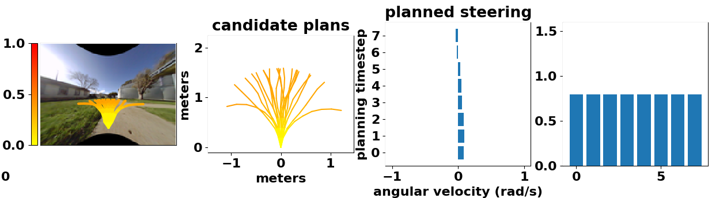
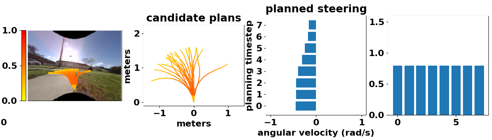
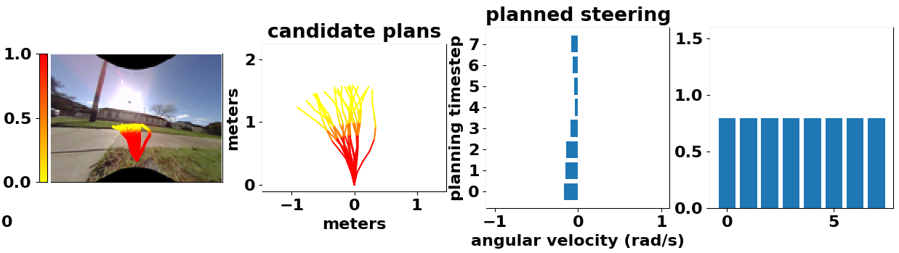
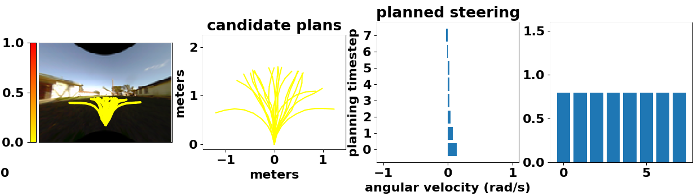
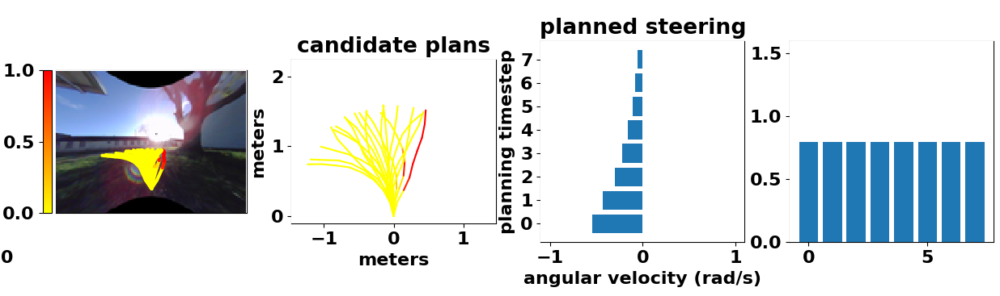
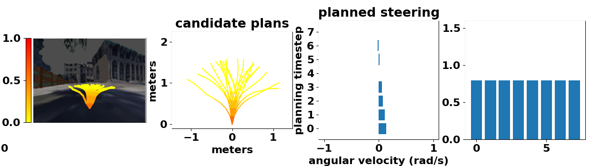
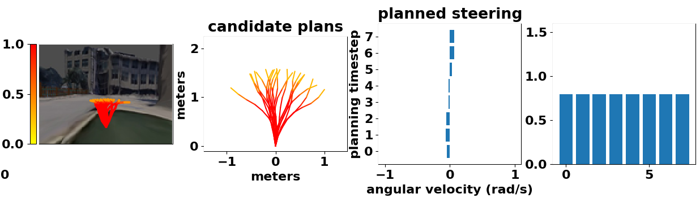
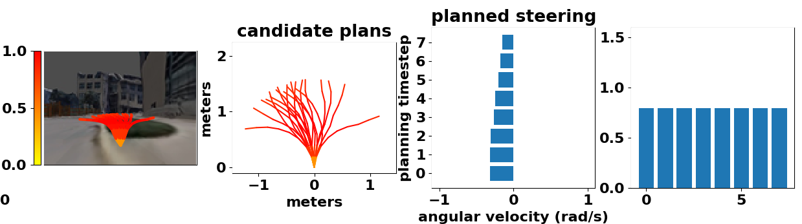

### 1.训练bumpy模型

配置文件：bumpy.config

```
params.exp_name = 'bump'

dataset:
    TfrecordRebalanceDataset

inputs:
    bumpy:  tensor [32,1]
    # actions:
    commands/angular_velocity: tensor [32,8,1]
    commands/linear_velocity:  tensor [32,8,1]

    images/rgb_left: tensor [32,96,128, 3]
            
    imu/angular_velocity: tensor [32,3]
    imu/linear_acceleration: tensor [32,3]
            
    jackal/imu/angular_velocity: tensor [32,3]
    jackal/imu/linear_acceleration: tensor [32,3]

outputs:
    bumpy: [32,8,1]
    done:  [32,8]
    imu/angular_velocity: [32,8,3]
    imu/linear_acceleration: [32,8,3]
    jackal/imu/angular_velocity: [32,8,3]
    jackal/imu/linear_acceleration: [32,8,3]

model: 
    jackalmodel

model_outputs: 
    bumpy: [32,8,1]
    kernels: list[11]

cost = cost_bumpy + cost_l2_reg  [32] + [32]
```


每个tfrecord文件存储100帧数据

训练时会出现loss循环下降的情况，未解决

**==模型输入==**

**CNN:**

image:

[b, 96, 128, 3]

LSTM:

image经过卷积层和fc层之后：

[b, 2*rnn_dim]作为LSTM的初始状态

actions:

[b, horizon, 2]

经过两层全连接层 送入LSTM

**==模型输出==**

[b, horizon, 1]    bumpy


#### 2021.12.20

1.解决loss循环下降的问题，是数据选取问题

2.采集的训练数据，action是8维的，怎样采集的呢？根据random_work 生成的未来轨迹吗？

aciton axamples:

`inputs/commands/angular_velocity:`

 [ 0.45070627]
 [ 0.27012986]
 [ 0.5702271 ]
 [-0.4912073 ]
 [-0.59850276]
 [ 0.30854815]
 [-0.06426742]
 [-0.67858434]

tf.Tensor(
[[ 0.14711757]
 [ 0.29636073]
 [ 0.24878931]
 [-0.6415074 ]
 [-0.03774878]
 [-0.52745765]
 [ 0.00515112]
 [-0.5463753 ]], shape=(8, 1), dtype=float32)

`inputs/commands/linear_velocity:`

tf.Tensor(
[[0.78468716]
 [0.78468716]
 [0.78468716]
 [0.78468716]
 [0.78468716]
 [0.78468716]
 [0.78468716]
 [0.78468716]], shape=(8, 1), dtype=float32)

`outputs/bumpy:`
tf.Tensor(
[[1]
 [1]
 [1]
 [1]
 [1]
 [1]
 [1]
 [1]], shape=(8, 1), dtype=uint8)

`outputs/done:`
tf.Tensor([False False False False False False False False], shape=(8,), dtype=bool)

#### 2021.12.21

1.rebalance data
true: 124984
false: 318386

batch数量 13855

2.终于发现了训练过程中loss突然下降为0的原因，
在一个epoch中，后面的batch中的数据 标签 [batch, 8] 几乎为全1数组， 导致loss为0，梯度无法下降，
网络参数无法更新

统计bumpy 0和1的比例：
total pos_nums: 3177235 neg_nums: 403613 pro: 7.87


### 2.训练collision_position模型

输入和bumpy相同

没有输入position信息，是怎么预测position信息的？？？

position信息用于计算costs


### 3.eval

`jackal_env:`

```
subscribe_names:
self.spec.observation_names:
{
'jackal/position', 
'jackal/angular_velocity', 
'jackal/imu/linear_acceleration', 
'images/rgb_left', 
'imu/compass_bearing', 
'imu/angular_velocity', 
'gps/latlong', 
'jackal/imu/angular_velocity', 
'imu/linear_acceleration', 
'collision/close', 
'jackal/yaw', 
'collision/stuck', 
'jackal/linear_velocity'
}
+
{
'collision/any',
'gps/utm',
'joy'
}
```


`obs,goal = env.reset()`

```
(AttrDict)
obs:
{
'jackal': {'yaw': array(-0.67541224), 'linear_velocity': array(0.60554653), 'position': array([46.130173 , -3.2534163,  0.       ], dtype=float32), 'imu': {'angular_velocity': array([ 0.00233885,  0.02570408, -0.18984316], dtype=float32), 'linear_acceleration': array([0.24659894, 1.0957259 , 9.558184  ], dtype=float32)}, 'angular_velocity': array(0.33495783)}, 

'gps': {'latlong': array([  37.914917, -122.33451 ], dtype=float32), 'utm': array([ 558495.6, 4196583.5], dtype=float32)}, 

'collision': {'stuck': array(False), 'close': array(False)}, 

'images': {'rgb_left': array([[[251, 251, 255],
    [134, 116,  90],
    [136, 117,  94],
    [135, 118,  96]]], dtype=uint8)}, 
    
 'imu': {'compass_bearing': array(-2.03288102), 
 'angular_velocity': array([ 0.029545  ,  0.14873517, -0.03959171], dtype=float32),     'linear_acceleration': array([ 1.1624322, -0.7594579,  9.994071 ], dtype=float32)}
 }
```


```
goal:
{
'position': array([-7.80231866,  1.92690139,  0.        ]), 
'cost_weights': 
	{'collision': array([1.], dtype=float32), 
	 'position': array([0.], dtype=float32), 
	 'action_magnitude': array([0.001], dtype=float32), 
	 'action_smooth': array([0.], dtype=float32), 
	 'bumpy': array([0.8], dtype=float32), 
	 'position_sigmoid_center': array([0.6], dtype=float32), 
	 'position_sigmoid_scale': array([100.], dtype=float32)}
}
```


### 4.A迁移到B

为什么可以解决灾难性遗忘问题？

使用A环境中数据训练的模型，直接拿到B环境中，是不能正常使用的，但是采集B环境中少量的数据，再次训练一个模型，就可以正常跑了

**==问题：==**

训练B模型时，使用的数据是A+B 还是 只有 B？

如果是A+B，那么随着环境的增加，数据量会变得非常大


训练好基本模型，元模型

基于LaND这篇工作，进入新的环境，人工干预，人机交互，适应新的环境


position_collsion的那个模型:

可以实现“直行100m,左拐”的功能吗？


### 5.badgr训练数据格式总结

#### 5.1 训练

每一个tfrecod文件保存100帧数据

##### 5.1.1 bumpy

`model: jackal_model`

**tfrecord格式：**

组成一个example的每一个feature的键值对 ：

value都是`tf.io.FixedLenFeature([], tf.string)`


key:

```
[
'inputs/images/rgb_left', 
'inputs/jackal/imu/angular_velocity', 
'inputs/jackal/imu/linear_acceleration', 
'inputs/imu/angular_velocity', 
'inputs/imu/linear_acceleration', 
'inputs/bumpy', 

'inputs/commands/angular_velocity', 
'inputs/commands/linear_velocity', 

'outputs/jackal/imu/angular_velocity', 
'outputs/jackal/imu/linear_acceleration', 
'outputs/imu/angular_velocity', 
'outputs/imu/linear_acceleration', 
'outputs/bumpy',
'outputs/done'
 ]
```

**模型输入：**

cnn_model: [b,h,w,c]      <= obs_ims

lstm_cell: [b,horizon,2]   <= actions

需要：

```
'inputs/images/rgb_left'

'inputs/commands/angular_velocity', 
'inputs/commands/linear_velocity', 
```

**模型输出：**

bumpy模型是一个二分类模型，输出执行一个动作后是否平坦

[b,horizon,1]

**损失计算：**

需要用到：

```
outputs.done
outputs.bumpy
```


##### 5.1.2 collsion_position

`model: jackal_position_model`

tfrecord格式：

keys:

```
[
'inputs/images/rgb_left', 
'inputs/jackal/position',
'inputs/jackal/yaw',
'inputs/jackal/angular_velocity',
'inputs/jackal/linear_velocity',
'inputs/jackal/imu/angular_velocity',
'inputs/jackal/imu/linear_acceleration',
'inputs/imu/angular_velocity',
'inputs/imu/linear_acceleration',
'inputs/imu/compass_bearing',
'inputs/gps/latlong',
'inputs/collision/close',
'inputs/collision/stuck'

'inputs/commands/angular_velocity', 
'inputs/commands/linear_velocity',

'outputs/jackal/position',
'outputs/jackal/yaw',
'outputs/jackal/angular_velocity',
'outputs/jackal/linear_velocity',
'outputs/jackal/imu/angular_velocity',
'outputs/jackal/imu/linear_acceleration',
'outputs/imu/angular_velocity',
'outputs/imu/linear_acceleration',
'outputs/imu/compass_bearing',
'outputs/gps/latlong',
'outputs/collision/close',
'outputs/collision/stuck'
'outputs/done'
]
```

**模型输入：**

cnn_model: [b,h,w,c]      <= obs_ims

lstm_cell: [b,horizon,2]   <= actions

需要：

```
'inputs/images/rgb_left'

'inputs/commands/angular_velocity', 
'inputs/commands/linear_velocity', 
```

**模型输出：**

collision_position是一个回归+分类模型，回归一个位置3维，一个是否碰撞1维

[b,horizon,4]


在计算模型输出global_position时

需要读取车辆目前所在的位置position和yaw，模型的直接输出是局部位置，使用

`rotate_to_global(curr_position, curr_yaw, local_position)`

将局部坐标转换为全局坐标，这里需要：

```
# test:
inputs.imu.compass_bearing  => yaw
# train:
inputs.jackal.position
inputs.jackal.yaw
```


**损失计算：**

需要用到：

```
outputs.done
outputs.jackal.position
outputs.collision.close
```


#### 5.2 测试

`model: merge_model`

网络是bumpy_model 和 position_model 的加和

测试时通过ros订阅消息获得数据

`lambda msg: np.array([msg.data])`

通过类似这样的回调函数，将ros消息转为np格式

图像回调：

`lambda msg: numpify_image_msg(msg)`

```python
def numpify_image_msg(msg):
    msg.__class__ = Image
    return ros_numpy.numpify(msg)
```

`_get_observation:`

订阅的话题有：

```
{
'images/rgb_left', 

'jackal/yaw', 
'jackal/position',
'jackal/linear_velocity', 
'jackal/angular_velocity', 
'jackal/imu/linear_acceleration', 
'jackal/imu/angular_velocity'，

'imu/angular_velocity', 
'imu/linear_acceleration', 
'imu/compass_bearing', 

'gps/utm', 
'gps/latlong',

'collision/close', 
'collision/stuck', 
}
```

`get_goal:`

订阅的话题：

```
'/goal_intermediate_latlong'   # 目标点坐标
```

并通过`rosparam`传递参数，控制各个`cost`的权重


==**计算损失：**==

collision+bumpy+position

`collision和bumpy：`

先sigmoid, 再clip_value  => min: clip_value   max: 1-clip_value

然后归一化到[0,1]

`position:`

有点复杂


==get_done:==

订阅ros消息：

```
'collision/any',
'gps/latlong',
'joy'			# 没有用到
```

当遇到碰撞 或者 接近目标点时  `done=True`


### 2021.12.29

#### 1.代码分析

已跑通大部分代码，显示卫星图的部分还有点问题，无伤大雅

目前每一帧耗时大概500ms，

需要预测4096条轨迹的代价，将输入复制4096份耗时450ms

改为2048条轨迹：复制需要220ms，整体280ms

`color:bumpy`







`color:collsion`






#### 2.使用CMU数据集测试bumpy

一些阴影的bumpy也很大，所以使用视觉作为输入不可靠，展现出点云的优势







#### 3.直接使用模型输出控制车辆在CMU校园仿真环境中行驶

由于缺少位置输入，只是预测bumpy，导致车辆频繁发生碰撞


#### 4.数据采集

1.首先从提供的bag包采集数据，制造tfrecords，actions先按向前取8帧，然后抽帧，验证流程


### 2021.12.30

#### 1.只使用image进行测试

`bumpy：`


### 2021.12.31


计划：

1  采集单张图片 进行测试

2 评估直接预测位置是否可行，查阅相关论文

3 制作数据集 带 actions 和 轨迹点


1.cmu data

image: 15hz 320*180  w,h

state_estimation: 200hz

trajectory:  pointcloud2

cmd_vel: 50hz


