# 一、cartographer基本原理

**Real-Time Loop Closure in 2D LIDAR SLAM**

## 1.算法总览

​		google的cartographer提供了一个使用2D激光雷达实时构建室内地图的解决方案，可以生成分辨率为5cm的2D网格地图。

​		cartographer的前端使用基于CSM(correlation scan matching)的扫描匹配(Scan Matchging)计算当前激光雷达扫描数据和当前子图(Sub map)的最佳估计位姿,然后使用这个最佳估计位资把当前帧数据加入到子图中。

​		cartographer并没有使用粒子滤波器,所以它对硬件要求不高，为了消除累计误差,后端使用图优化的方法不断进行位姿优化。

​	cartographer算法分为局部SLAM和全局SLAM

## 2.局部SLAM

​		在Local SLAM中，使用非线性优化方法将当前帧的扫描结果Scan 与 建图区域的局部子图Submap 匹配。扫描匹配会随着时间存在累计误差，在Global SLAM 中会消除误差。

### 2.1 当前帧和子图的坐标转换关系

​		假设Submap的坐标系原点是0∈*R*2，每一个雷达扫描点为p，当前帧雷达的扫描数据为H={hk}k=1,...K,hk∈R2当前雷达帧在子图坐标系下的位姿可以用转移矩阵T_ξ 表示，即使用下式可以把当前帧的扫描点转换到子图坐标系下

### 2.2 子图的构建

​		cartographer构建的地图以及地图子图都是以概率网格地图的形式保存的，地图在创建完成时，栅格概率小于p_{min}表示该点无障碍，在p_{min}与p_{max}之间表示未知，大于 p_{max}表示该点有障碍

​		地图子图的详细构建过程如下：

​		一个子图是由连续的几帧雷达扫描数据组成的，M:rZ×rZ→[pmin,pmax]

​		r表示地图的分辨率，网格的值p代表当前网格被障碍物占据的概率，每一个网格点的概率值由最接近该网格点的所有点计算得到。

​		当把当前帧扫描数据插入到概率网格地图中时，根据激光雷达扫描点将概率地图分为一组击中（hits）点集和一组未击中（misses）点集，击中点指网格中有雷达数据点，未击中指网格内没有雷达数据点，具体如下图所示:

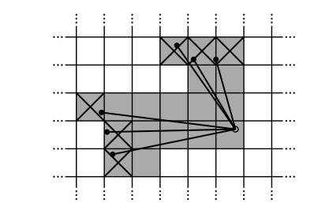

​		如图中网格，黑点表示扫描点，打叉的阴影点表示击中，未击中点表示击中点到雷达扫描中心的连线上的所有网格点，用未打叉的阴影点表示。

​		对于击中点和未击中点，如果前一帧没有观测值，则赋初值p_miss或者p_hit,一般赋值0.5，表示格子的占据状态未知，如果前一帧已经观测到数据，有了概率值，则根据下列公式对击中概率值进行更新，未击中的概率值计算方式相同：

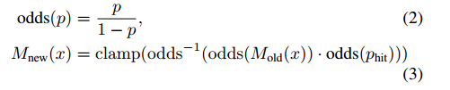

​		其中，clamp是区间限定函数，将概率值限定在[0,1]之间。

### 2.3 变换矩阵T的求解

​		每一帧雷达扫描数据插入到子图之前，首先要对这帧数据的位姿进行优化，使其经过转换后插入到子图中时，每个点的信度和最高，让当前扫描数据以最大的概率和子图匹配，通过扫描匹配对位姿变换T进行优化，这个优化问题可以看成一个非线性最小二乘问题：

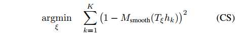

​		式中变换矩阵T将当前帧的雷达扫描点h从雷达坐标系下变换到子图坐标系下，M_smooth是线性评价函数，实现R+2-->R,使点变成子图中概率值的双三次差值，该函数的输出结果为（0，1）以内的数，在这之外的数可以生成，但不被考虑进去，通过这种平滑函数的优化，能够提供比栅格分辨率更好的精度。该最小二乘问题在cartographer中通过google的Ceres库进行求解。

## 3.全局SLAM

​		Cartographer的前端通过创建大量的子图来实现大场景建图，子图在短时间内的准确度是可靠的，但长时间会存在累积误差，为了消除累积误差，让这些子图形成一张完整的地图，后端需要通过回环检测和全局优化来优化所有子图的位姿。

### 3.1 回环优化

​		回环的优化问题同样是非线性最小二乘问题，其问题可以描述为：

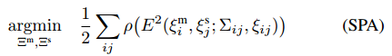

​		其中，m=。。。是子图的位姿，，s=。。。是当前帧雷达数据的位姿，它们之间的约束为位姿ij和协方差矩阵ij，位姿ij代表j帧雷达扫描数据在子图i下的位姿，残差E的计算公式如下:

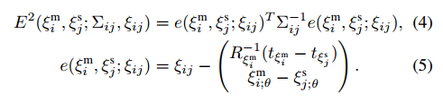

### 3.2 回环检测

​		回环检测是一种匹配过程，即当获得新的雷达扫描数据时，在其附近一定范围搜索最优匹配帧，若该最优匹配帧符合要求，则认为是一个回环。

​		首先，该匹配问题可以描述为：

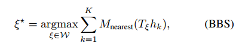

​		其中***W***是位姿的搜索空间，使用变换T将当前帧全部扫描点h变换到子图下，M_{nearest}是栅格点的M值，上式计算每一个扫描点插如到子图上时的置信度和，置信度越高则认为越相似，回环检测需要在**W**空间中寻找出该置信度和最大的匹配帧。

​		寻找最优解的搜索过程可以使用暴力匹配法，平移量x和y的搜索步长设置为地图分辨率r，角度搜索步长按如下公式设置：

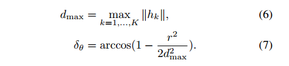

​		指定搜索宽度Wx，Wy，Wo，wx=[],wy=[],

所以搜索空间为：W={}

暴力匹配算法伪代码为：

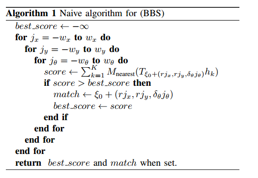

​			暴力匹配算法的效率很低，为了提高搜索效率，cartographer采用了分支定界法（branch and bound)，“分枝界限法”把问题的可行解展开如树的分枝，再经由各个分枝中寻找最佳解。 其主要思想：把全部可行的解空间（根节点）不断分割为越来越小的子集（分支），并为每个子集内的解的值计算一个下界或上界（称为定界）。在每次分支后，对凡是界限超出已知可行解值那些子集不再做进一步分支。这样，解的许多子集（即搜索树上的许多结点）就可以不予考虑了，从而缩小了搜索范围。

伪代码：

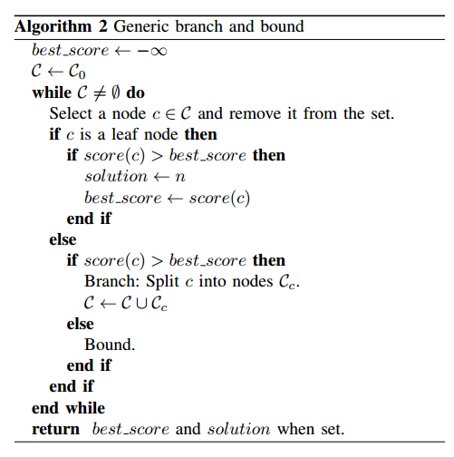

# 二、方仓医院建图

gazebo模型：

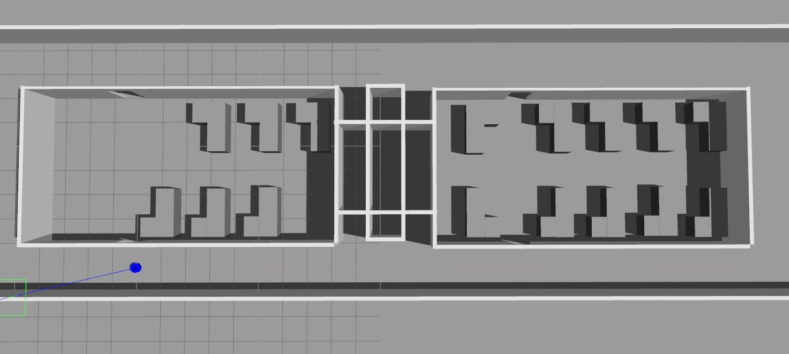

建图：

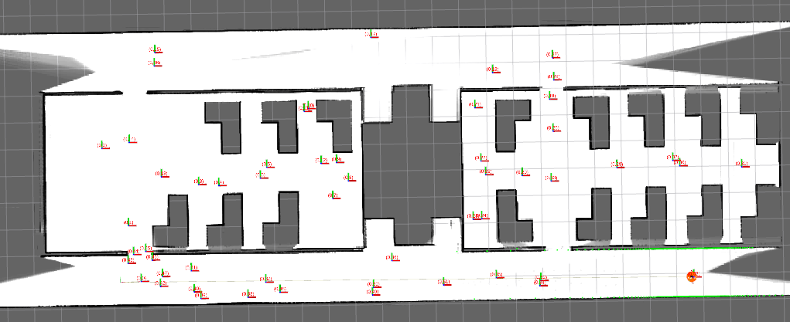

