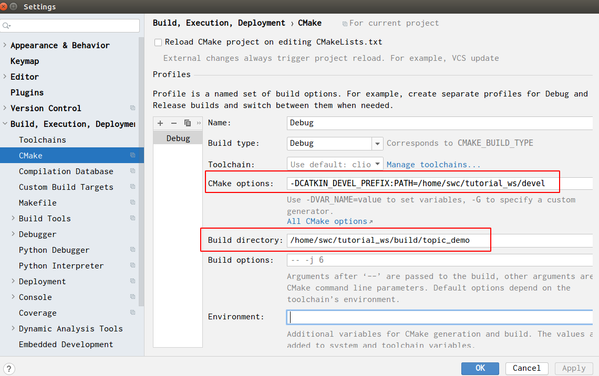
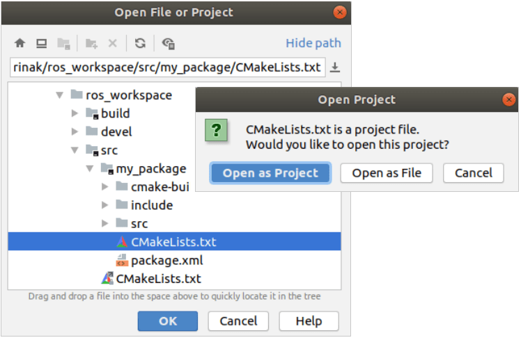
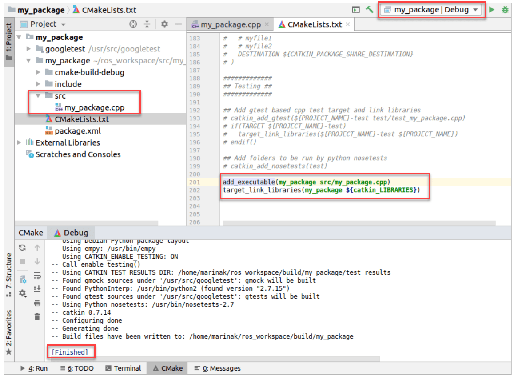
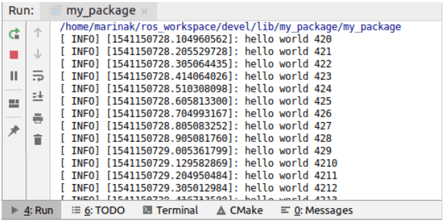
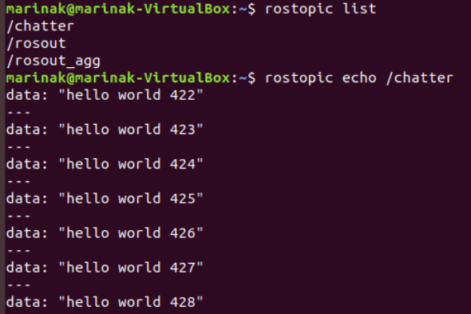

### 1.使用clion开发ros

之前一直是在用QT开发ros程序，但总感觉和ros兼容不太好，比如，一个package里面如果有多个node，就有多个main函数，qt就会报错，而且用qt开发的ros节点不能用rosrun运行，可能会有点麻烦；

和qt一样，需要在命令行运行clion才能加载工作空间，此外要在.bashrc文件中添加相关内容：

```sh
# ======================clion=======================
alias clion=/home/swc/clion-2020.2.1/bin/clion.sh
export PATH="/home/swc/clion-2020.2.1/bin:$PATH"
```


**修改Cmake设置：**

file->setting->build,execution->cmake

默认情况下，CLion将构建输出放在自动创建的cmake-build-debug或cmake-build-release 目录中。对于ROS开发，这意味着您将在CLion和运行的控制台中拥有两个不同的版本catkin_make。

要在IDE和控制台上进行单一构建，需要将CLion构建路径设置为catkin工作区目录。为此，请转到 文件| 设置Ctrl+Alt+S| 构建，执行，部署| CMake并更改两个字段：

+ 在生成路径中，设置workspace_folder/build。
+ 在CMake选项中，添加-DCATKIN_DEVEL_PREFIX:PATH=workspace_folder/devel。



#### 示例：创建基本ROS节点，在CLion中编辑并运行它 

在这个例子中，我们将创建一个简单的ROS包，编辑源代码，并从CLion运行节点。我们将在Ubuntu 18.04上使用ROS Melodic，并在ROS wiki上使用编写简单发布者和订阅者（C ++）教程 的基本发布者节点 。

创建一个基本的ROS包

创建和构建ROS工作区：

```
mkdir` `-p ros_workspace``/srccd` `ros_workspace``catkin_make
```

在工作区中，创建一个名为my_package的包：

```
cd` `src``catkin_create_pkg my_package roscpp rospy std_msgs
```

启动CLION

来源工作区：

```
cd` `../../..``/source` `.``/devel/setup``.``bash
```

并在同一终端启动CLion

```
sh ``/opt/clion-2018``.2``/bin/clion``.sh
```

在CLion中打开包作为项目 

在CLion中，转到File | 打开并选择位于包文件夹内的CMakeLists.txt文件，然后选择将其作为项目打开：



添加源文件并编辑CMakeLists.txt

向项目添加新的源文件：右键单击Project树中的src，选择New | C / C ++源文件 并将其命名为my_package.cpp。

将整个talker.cpp文件从Publisher和Subscriber教程复制到my_package.cpp中。

新创建的源添加到的CMakeLists.txt和链接其对应程序库：

```
add_executable(my_package src``/my_package``.cpp)``target_link_libraries(my_package ${catkin_LIBRARIES})
```

之后，重新加载CMake项目，并注意运行/调试配置列表中的my_package：



 

 运行ROS节点

1、在从CLion运行节点之前，在新终端中打开ROS主站：

```
roscore
```

2、在CLion，运行的my_package配置。 运行工具窗口将显示节点输出：



 

 3、在单独的终端中，检查当前活动的ROS主题。如果我们打印消息chatter，输出将类似于我们在CLion中看到的内容：



 

 现在，如果我们在CLion中停止应用程序，该 rostopic echo /chatter命令将没有输出。

### 2.CmakeLists.txt

#### 1.使用opencv

1. 打开工程的CMakeList，在末尾添加

   ```
   find_package(OpenCV REQUIRED)
   target_link_libraries(<project name> ${OpenCV_LIBS})
   ```

   以上代码需要修改两个地方：

   + 第二句的`<project name>`，去掉< >，把peoject name改成工程名字，如果不知道就看CMakeList的`projec()`括号中的内容
     （自己做个笔记：在Markdown里输出尖括号要用转义字符）

   + 第二句还有另一种写法，使用库的绝对路径

     在terminal中输入`$ pkg-config --cflags --libs opencv`

     能返回得到`-I/usr/local/include...... -lopencv_core`

     每个人的返回不一定一样，复制该内容，代替`${OpenCV_LIBS}`即可

     ```
     target_link_libraries(<project name> -I/usr/local/include/opencv -I/usr/local/include -L/usr/local/lib -lopencv_dnn -lopencv_ml -lopencv_objdetect -                  lopencv_shape -lopencv_stitching -lopencv_superres -lopencv_videostab -lopencv_calib3d -lopencv_features2d -lopencv_highgui -lopencv_videoio -lopencv_imgcodecs -lopencv_video -lopencv_photo -lopencv_imgproc -lopencv_flann -lopencv_core
      )
     ```

     事实上，${OpenCV_LIBS}也就是cmake通过find_package返回的库的路径的变量。

     不建议使用绝对路径，使用${OpenCV_LIBS}的移植性更好

2. 