# Open-source Navigation Autonomy Stack

> cmu-exploration.com

# I. Exploration and Planning Algorithms

未知环境+人员无法进入

eg:核电站事故,地下隧道

**难点:**

1.不知道未知环境的探索难度

2.由于通信原因,无法知道机器人当前的状态

## 1.1 Problem & Tasks

**problem:**

1.Robot perceives the environment from discrete viewpoints

从离散的视点观察环境

2.Solves for a path through the viewpoints to fulfill coverage

求解出来一条路径,通过视点实现覆盖的路径

**System Tasks:**

+ **更新环境表示**
  + 跟踪已经覆盖和还没有覆盖的区域
  + 分析可通行区域
  + 验证视点并与地图表示相关联
+ **评价视点的覆盖/信息 增益**
+ **搜索一条探索路径**

## 1.2 现有的探索做法

没有仔细看,是传统的做法

详细阐述了CMU在DARPA地下挑战赛上取得冠军使用的算法;

# II System,Applications and Extensions

## 1.前言

+ 使用自己的设备采集数据并公开数据集

  KITTI等数据为代表

  stereo images, 3D lidar scans, and GPS-INS poses for ground truth

+ 仿真

  CARLA:自动驾驶

  AirSim:无人机

+ 仿真环境 vs 真实场景

  仿真环境场景已经和真实环境很相似了

  易于获得ground truth:车辆位姿,语义信息

  易于改变环境:光照,天气,动态障碍物,模拟事故

  方便调试测试系统

## 2.System

算法,工具

## 3.Applications

# 高翔的解读

> https://zhuanlan.zhihu.com/p/389756544

> 本系列文章笔者与CMU团队合作发布，旨在介绍[http://cmu-exploration.com](https://link.zhihu.com/?target=http%3A//cmu-exploration.com)团队开发的系列算法。
> 系列(一)：CMU团队开发的全套开源自主导航算法:[http://cmu-exploration.com](https://link.zhihu.com/?target=http%3A//cmu-exploration.com)
> 系列(二)：CMU团队开发的全套开源自主导航算法——DSV Planner自主探索算法
> 系列(三)：CMU团队开发的全套开源自主导航算法——TARE自主探索算法
> 系列(四)：CMU团队开发的全套开源自主导航算法——FAR Planner全局路径规划算法
> 系列(五)：CMU团队开发的全套开源自主导航算法——扩展及应用

## 1.概述

与时下大火的自动驾驶相比，一个更普遍且更难的问题是如何让机器人==在没有人为划分可行驶区域的地方甚至在未知的环境里自主地运动及完成任务==。这一问题的解决将有助于真正将机器人技术应用在更复杂的现实世界，包括但不限于物流，农业，勘测，搜救等的行业和应用之中。接下来我们将针对这个问题给出我们的思考和解答。

通常来说，移动机器人的“智能”系统包含四个部分（如下图所示):

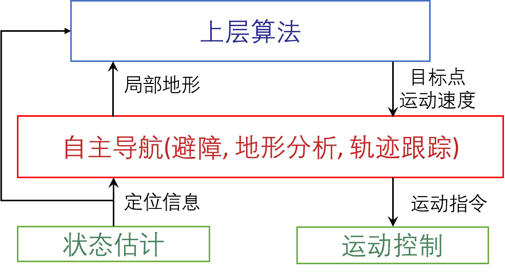

自主导航和上层规划算法是我们推出的这个平台的核心，它主要解决两个层次的问题:

- 局部规划： 如何安全高效地到达一个近距离目标点。
- 全局规划: 如何在没有已知地图的环境里建图和规划长距离路径。

## 2.仿真环境

所以我们根据移动机器人适合作业的五种真实环境分别搭建了相应的仿真环境。 这些环境可以用来测试机器人的自主导航能力，也可以用来测试上层的规划算法。下面是五种环境各自的图片以及他们相对应的一些典型特征。

+ 校园环境(340m x 340m): 根据卡内基梅隆大学(Carnegie Mellon University)的部分校园环境重建得到，包含一些上下坡以及盘绕的地形。

  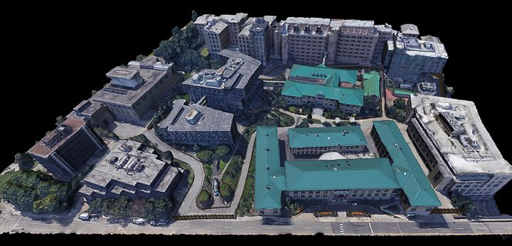

+ 室内环境(130m*100m): 包含长且窄的走廊以及许多桌子/椅子等障碍物，其中还有一个护栏，由于其中间可以穿透的特性，会对机器人的感知（perception）模块增加挑战性。

  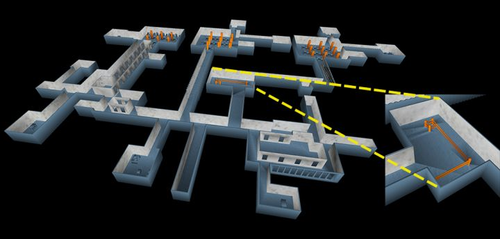

+ 停车场(140m * 130m, 5层): 包含多层楼且有上下坡，会对机器人3D导航任务增加难度

  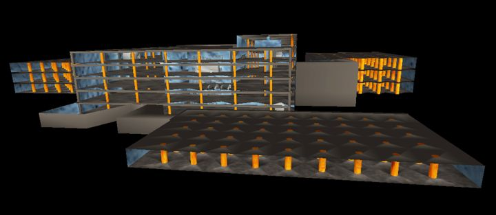

+ 隧道(330m*250m): 错综复杂的隧道构成的一个庞大的网格结构，这个环境来自内华达大学( University of Nevada, Reno) 的Tung Dang。

  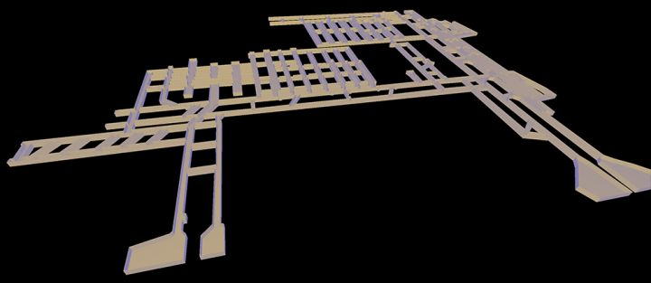

+ 森林(150m*150m): 包含无规律分布的树木以及几栋房子。

  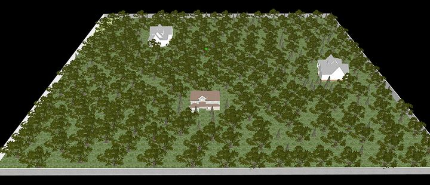

如果大家开发的上层算法能够适用于这五种环境，那么应该也能应付现实世界中大部分的挑战。

我们的开发环境最核心的还是我们推出的一整套自主导航算法，如上面所说的，包括==障碍物规避，路径跟随和可行驶区域分析==

**障碍物规避**是移动机器人实现“智能”必须具备的能力。自有机器人以来这个问题就在被人们研究，但直到最近由于状态估计算法的成熟让机器人对自身状态和对环境有了更精确的感知，才使快速高效的障碍物规避算法成为可能。我们提供的避障算法优势在于能实时高效地应对复杂环境,==同时最大化到达目标点的概率==。算法的主要思想在于尽可能地让计算在线下完成。具体来说，==一个避障算法最耗时的计算一般在于检测机器人在未来时间点与环境发生碰撞的可能==。我们的算法先通过离线生成一个庞大的轨迹库（trajectory library）来模拟机器人在未来一段时间内可能走过的轨迹。接下来对于所有轨迹覆盖的空间，我们计算其内部所有点（在一定解析度下）与所有轨迹发生碰撞的可能性。经过这样的离线计算，我们可以得到一个空间内3D点到轨迹的对应关系。==在实时运行的过程中，一旦空间内的某个点上有障碍物，我们可以马上知道哪些轨迹将会受到影响。我们的算法会降低选择这些轨迹作为最终路径的可能性。==因为大量的计算都在线下进行，线上运行的时候只需要实时选择无碰撞的轨迹，我们的算法可以在几毫秒之内规划出一条无碰撞而最接近目标点的路径。为了便于大家理解，我们截取了一张机器人行进过程中的无碰撞路径的示意图。所有的黄线都是当前时刻机器人周围的无碰撞路径，会导致碰撞的路径因为白色障碍物的影响已经被剔除。在实际的自主导航过程中，我们避障模块接收上层的算法提供的目标点来引导其行驶。如果大家有兴趣，可以参考我们的[论文](https://frc.ri.cmu.edu/~zhangji/publications/JFR_2020.pdf)和[代码](https://github.com/HongbiaoZ/autonomous_exploration_development_environment)来进一步理解这部分的原理。

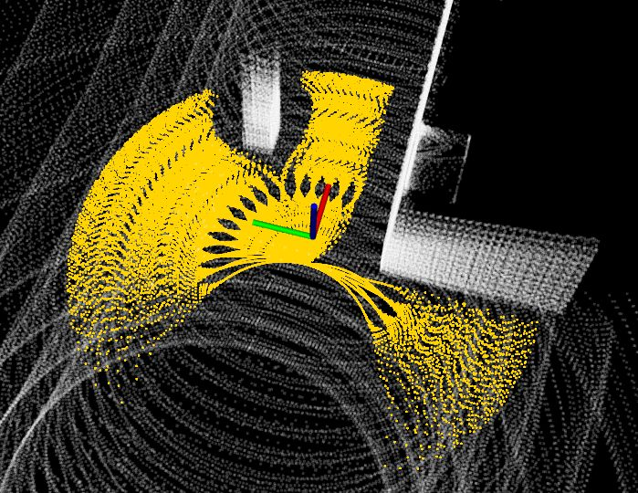

**可行驶区域（地形）分析**是我们提供的开发环境中的另一个亮点。这个模块可以帮助机器人区分可通过和不可通过区域。我们的算法借助一个区域相对于周围区域的高度差来判断一个区域可行驶与否。计算的结果会被存在一个随机器人滚动的局部地图中，以作为更高层的路径规划算法的输入。下面右侧图中，红色的点代表不可同行的区域而绿色点覆盖的区域则代表可通行区域。

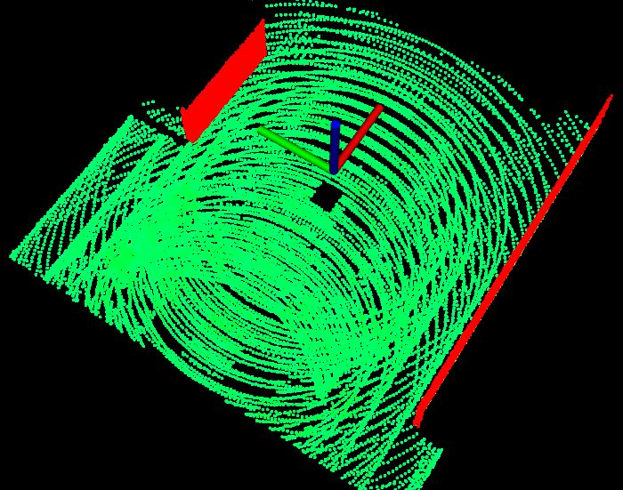

如前面所提到的，我们的团队基于这个开发环境开发了一些探索算法。为了能够更好的监测探索过程中机器人的状态以及算法的效果，我们开发了一些可视化的工具，包括显示所使用环境(上述五种环境)的完整点云地图(浅白色点)以及已探索区域的点云地图(蓝色点)，机器人的轨迹(彩色曲线)以及绘制机器人行驶距离，已探索区域的体积和规划时间随着时间变化的曲线等。如果是做探索算法的开发，相信这些工具一定能给大家带来一些帮助。而其他的上层算法和应用也能够在这些工具的基础上很简单的开发出适合自己的小工具。

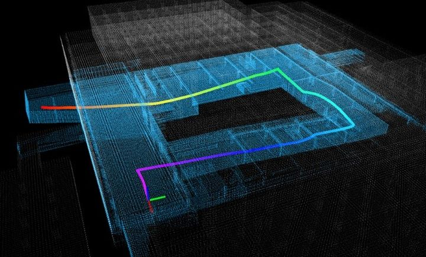

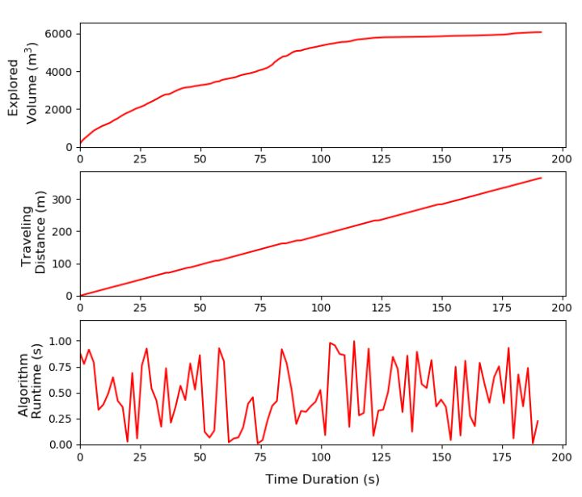

我们推出这个开发环境的目的还是希望帮助更多从事机器人导航和上层算法开发的人快速拥有一个稳定实用且普适性强的仿真和实验的平台，为他们节省更多的时间。本文只是对我们开发环境做了一个简要的介绍，如果真的希望使用我们的开发环境，可以参考我们的详细教程。

在这里我们提供了两种教程获取方式，最简单的是访问我们的网站([http://cmu-exploration.com](https://link.zhihu.com/?target=http%3A//cmu-exploration.com))，上面有很详细的步骤，但是这种方式需要能够连接到Google或者Google drive。**如果你无法访问我们的网站，也可以在百度网盘下载我们的教程以及其他资料，下载链接如下：**[https://pan.baidu.com/s/106faJDORrJAsu0LhF22BBA](https://link.zhihu.com/?target=https%3A//pan.baidu.com/s/106faJDORrJAsu0LhF22BBA)，提取码：qaiq

## 3.DSV Planner自主探索算法

我们把在一个未知的环境中获取信息的行为称之为探索（Exploration）。这一问题在机器人研究领域历史悠久。早在上世纪七八十年代，计算机和传感器的发展还处在初级阶段，人们便已经开始研究如何把一个机器人送进一个未知的环境里让其自主收集信息。随着硬件的发展，人们有了更精准的传感器和更强大的计算机，便有了让机器人从环境中获取更大信息量的途径。三维激光雷达技术的日趋成熟以及状态估计算法的逐渐完善催生出了一个很自然的想法，让机器人自主在未知的环境中构建出一个具有高保真度（fidelity）的三维地图。这样的地图（如下所示）包含了环境中所有的几何信息，稍加处理便可用于勘测，搜索，导航等目的。

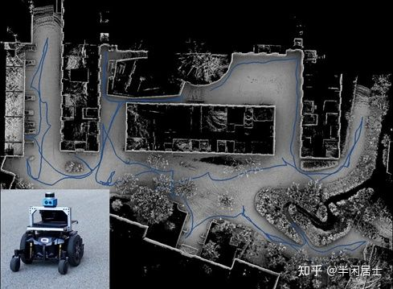

这样的想法固然美好，但要让机器人实现高效的探索甚至达到人类水平，在目前还是一个巨大的挑战。其中两个主要的难点在于：1. 随着探索的进行，算法需要维护一个越来越大的已知地图，同时从中提取出机器人接下来要去的方向； 2. 算法需要在环境中规划出一条可行驶且路程最短的路径来引导机器人至还未探索过的地方。在复杂的三维环境中，比如杂乱无章而拥挤的空间，这两个难点尤其突出，仍然需要大量的研究。

现在主流的探索算法主要有两种, 基于**边界点**(Frontier)的探索算法以及基于**随机采样观测点**(view-point)的探索算法。 基于随机采样观测点的算法核心是贪婪探索的策略，在理论上并不是最优的，这也是这类算法一直被诟病的地方。而基于边界点的探索算法，其主要的缺陷在于边界点提取的方式以及边界点的探索路径的优化问题仍然还没有很好的被解决。虽然基于随机采样观测点的方法由于其贪婪策略的本质，探索路径并不是最优，但是由于其理论以及实现方式都很简单，并被广泛应用，仍然有值得进一步研究的地方。本文所展示的探索算法就是对这一类型算法的延伸，极大提升其效率。