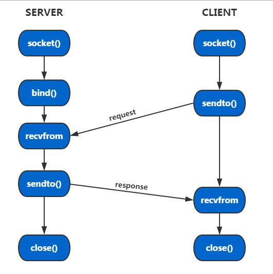

# `Linux socket UDP` 编程

No.1 from [zhihu](https://zhuanlan.zhihu.com/p/104809183)

**一、什么是socket？**

Socket的英文原义是“孔”或“插座”。在编程中，Socket被称做`套接字`，是网络通信中的一种约定。Socket编程的应用无处不在，我们平时用的QQ、微信、浏览器等程序，都与Socket编程有关。我们平时使用浏览器查资料，这个过程的技术原理是怎样的呢？


我们平时使用浏览器，大致就是这样的一个过程。这里有两个重要的名词：`服务端`与`客户端`。

Socket编程的目的就是如何实现这两端之间的通信。

## **1、Socket编程在嵌入式中也很重要**

Socket编程不仅仅在互联网方面很重要，在我们的嵌入式方面也是非常的重要，因为现在很多电子设备都趋向于联网。比如很多嵌入式工作的招聘要求都会有这一条要求：


说一点题外话，还在学校的朋友，如果感觉到很迷茫，不知道学什么的时候，可以上招聘网站上看看自己未来工作相关的职位的任职要求，这样就可以总结自己的一些不足、比较有针对性的去学习。


## **二、Socket编程中的几个重要概念**

Socket编程用于解决我们`客户端`与`服务端`之间通信的问题。我们平时多多少少都有听过IP地址、端口、TCP协议、UDP协议等概念，这些都与Socket编程中相关，想要知道怎么用起来，当然得先了解它们的一些介绍。下面看一下这些专业术语的一些要点介绍：

## **1、什么是IP地址？**

`IP地址（Internet Protocol Address）`是指互联网协议地址，又译为`网际协议地址`。IP地址被用来给Internet上的电脑一个编号。我们可以把“个人电脑”比作“一台电话”，那么“IP地址”就相当于“电话号码”。若计算机1知道计算机2的IP地址，则计算机1就能访问计算机2。

IP地址是一个32位的二进制数，通常被分割为4个“8位二进制数”（也就是4个字节）。IP地址通常用`点分十进制`表示成（a.b.c.d）的形式，其中，a,b,c,d都是0~255之间的十进制整数。例：点分十进IP地址（100.4.5.6），实际上是32位二进制数（01100100.00000100.00000101.00000110）。

IP地址有`IPv4`与`IPv6`之分，现在用得较多的是IPv4。其中，有一个特殊的IP地址需要我们记住：`127.0.0.1`，这是回送地址，即本地机，一般用来测试使用。后边我们的实例中会用到。

关于IP地址还有很多知识要点，但是对于在Socket编程中的应用，我们暂且知道这么多就可以。


## **2、什么是TCP/IP端口？**

上一点中我们提到，若计算机1知道计算机2的IP地址，则计算机1就能访问计算机2。但是，我们要访问计算机2中的不同的应用软件，则还得需要一个信息：`端口`。端口使用16bit进行编号，即其范围为：`0~65536`。但`0~1023` 的端口一般由系统分配给特定的服务程序，例如 Web 服务的端口号为 80，FTP 服务的端口号为 21等。


## **3、什么是协议？**

协议（Protocol）是通信双方进行数据交互的一种约定。如TCP、UDP协议：

### **（1）TCP协议**

TCP（Transmission Control Protocol 传输控制协议）是一种面向连接的、可靠的、基于字节流的传输层通信协议，数据可以准确发送，数据丢失会重发。TCP协议常用于web应用中。

### **TCP连接（三次握手）**

TCP传输起始时，客户端、服务端要完成三次数据交互工作才能建立连接，常称为**三次握手**。可形象比喻为如下对话：

> 客户端：服务端您好，我有数据要发给你，请求您开通访问权限。
> 服务端：客户端您好，已给您开通权限，您可以发送数据了。
> 客户端：收到，谢谢。

具体示意图为：


这里的SYN和ACK是都是标志位，其中SYN代表新建一个连接，ACK代表确认。其中m、n都是随机数。具体说明如：

+ 第一次握手：SYN标志位被置位，客户端向服务端发送一个随机数m。
+ 第二次握手：ACK、SYN标志位被置位。服务端向客户端发送m+1表示确认刚才收到的数据，同时向客户端发送一个随机数n。
+ 第三次握手：ACK标志被置位。客户端向服务端发送n+1表示确认收到数据。


### **TCP断开（四次挥手）**

TCP断开连接时，客户端、服务端要完成四次数据交互工作才能建立连接，常称为**四次挥手**。可形象比喻为如下对话：

> 客户端：服务端您好，我发送数据完毕了，即将和您断开连接。
> 服务端：客户端您好，我稍稍准备一下，再给您断开
> 服务端：客户端您好，我准备好了，您可以断开连接了。
> 客户端：好的，合作愉快！


具体示意图为：


这里的FIN也是一个标志位，代表断开连接。具体说明类似**三次握手**。

**为什么建立连接只需要三次数据交互，而断开连接需要四次呢？**

建立连接时，服务端在监听状态下，收到建立连接请求的SYN报文后，把ACK和SYN放在一个报文里发送给客户端。

而关闭连接时，当收到对方的FIN报文时，仅仅表示对方不再发送数据了但是还能接收数据，己方也未必全部数据都发送给对方了，所以己方可以立即close，也可以发送一些数据给对方后，再发送FIN报文给对方来表示同意现在关闭连接，因此，己方ACK和FIN一般都会分开发送。

### **（2）UDP协议**

UDP（User Datagram Protocol， 用户数据报协议）是一种无连接的传输层协议，提供面向事务的简单不可靠信息传送服务，可以保证通讯效率，传输延时小。例如视频聊天应用中用的就是UDP协议，这样可以保证及时丢失少量数据，视频的显示也不受很大影响。


## **4、什么是协议族？**

协议族是多个协议的统称。比如我们的TCP/IP协议族，其不仅仅是TCP协议、IP协议，而是多个协议的集合，其包含IP、TCP、UDP、FTP、SMTP等协议。


## **三、socket编程的API接口**

## **1、Linux下的socket API接口**

### **（1）创建socket：socket()函数**

**函数原型：**

```c
int socket(int af, int type, int protocol);
```

+ af参数：af 为地址族（Address Family），也就是 IP 地址类型，常用的有 AF_INET 和 AF_INET6，其前缀也可以是PF（Protocol Family），即PF_INET 和 PF_INET6。
+ type参数：type 为数据传输方式，常用的有 面向连接（`SOCK_STREAM`）方式（即TCP） 和 无连接（`SOCK_DGRAM`）的方式（即UDP）。
+ protocol参数：protocol 表示传输协议，常用的有 `IPPROTO_TCP` 和 `IPPTOTO_UDP`，分别表示 TCP 传输协议和 UDP 传输协议。

**使用示例：**

创建TCP套接字：

```c
int tcp_socket = socket(AF_INET, SOCK_STREAM, IPPROTO_TCP);
```

创建UDP套接字：

```c
int udp_socket = socket(AF_INET, SOCK_DGRAM, IPPROTO_UDP);
```


### **（2）绑定套接字：bind()函数**

**函数原型：**

```c
int bind(int sock, struct sockaddr *addr, socklen_t addrlen); 
```

+ sock参数：sock 为 socket 文件描述符。
+ addr参数：addr 为 sockaddr 结构体变量的指针。
+ addrlen参数：addrlen 为 addr 变量的大小，可由 sizeof() 计算得出。

**使用示例：**

将创建的套接字`ServerSock`与本地IP`127.0.0.1`、端口`1314`进行绑定：

```c
/* 创建服务端socket */
int ServerSock = socket(PF_INET, SOCK_STREAM, IPPROTO_TCP);

/* 设置服务端信息 */
struct sockaddr_in ServerSockAddr;
memset(&ServerSockAddr, 0, sizeof(ServerSockAddr));     // 给结构体ServerSockAddr清零
ServerSockAddr.sin_family = PF_INET;                    // 使用IPv4地址
ServerSockAddr.sin_addr.s_addr = inet_addr("127.0.0.1");// 本机IP地址
ServerSockAddr.sin_port = htons(1314);                  // 端口

/* 绑定套接字 */
bind(ServerSock, (SOCKADDR*)&ServerSockAddr, sizeof(SOCKADDR));
```

其中`struct sockaddr_in`类型的结构体变量用于保存IPv4的IP信息。若是IPv6，则有对应的结构体：

```c
struct sockaddr_in6 
{ 
    sa_family_t sin6_family;    // 地址类型，取值为AF_INET6
    in_port_t sin6_port;        // 16位端口号
    uint32_t sin6_flowinfo;     // IPv6流信息
    struct in6_addr sin6_addr;  // 具体的IPv6地址
    uint32_t sin6_scope_id;     // 接口范围ID
};
```


### **（3）建立连接：connect()函数**

**函数原型：**

```c
int connect(int sock, struct sockaddr *serv_addr, socklen_t addrlen);  
```

参数与`bind()`的参数类似。

**使用示例：**

```c
int ClientSock = socket(AF_INET, SOCK_STREAM, IPPROTO_TCP);
connect(ClientSock, (SOCKADDR*)&ServerSockAddr, sizeof(SOCKADDR));
```


### **（4）监听：listen()函数**

**函数原型：**

```c
int listen(int sock, int backlog);
```

+ sock参数：sock 为需要进入监听状态的套接字。
+ backlog参数：backlog 为请求队列的最大长度。

**使用示例：**

```c
/* 进入监听状态 */
listen(ServerSock, 10);
```


### **（5）接收请求：accept()函数**

**函数原型：**

```c
int accept(int sock, struct sockaddr *addr, socklen_t *addrlen);
```

+ sock参数：sock 为服务器端套接字。
+ addr参数：addr 为 sockaddr_in 结构体变量。
+ addrlen参数：addrlen 为参数 addr 的长度，可由 sizeof() 求得。
+ 返回值：一个新的套接字，用于与客户端通信。

**使用示例：**

```c
/* 监听客户端请求，accept函数返回一个新的套接字，发送和接收都是用这个套接字 */
int ClientSock = accept(ServerSock, (SOCKADDR*)&ClientAddr, &len);
```

### **（6）关闭：close()函数**

**函数原型：**

```c
int close(int fd);
```

+ fd：要关闭的文件描述符。

**使用示例：**

```c
close(ServerSock);
```


### **（7）数据的接收和发送**

数据收发函数有几组：

+ read()/write()
+ recv()/send()
+ readv()/writev()
+ recvmsg()/sendmsg()
+ recvfrom()/sendto()

函数原型：

```c
ssize_t read(int fd, void *buf, size_t count);
ssize_t write(int fd, const void *buf, size_t count);
ssize_t send(int sockfd, const void *buf, size_t len, int flags);
ssize_t recv(int sockfd, void *buf, size_t len, int flags);
ssize_t sendto(int sockfd, const void *buf, size_t len, int flags,
                      const struct sockaddr *dest_addr, socklen_t addrlen);
ssize_t recvfrom(int sockfd, void *buf, size_t len, int flags,
                        struct sockaddr *src_addr, socklen_t *addrlen);
ssize_t sendmsg(int sockfd, const struct msghdr *msg, int flags);
ssize_t recvmsg(int sockfd, struct msghdr *msg, int flags);
```

这里介绍一下recv()/send()、recvfrom()/sendto()。


**recv()函数：**

```c
ssize_t recv(int sockfd, void *buf, size_t len, int flags);
```

+ sockfd参数：sockfd为要接收数据的套接字。
+ buf参数：buf 为要接收的数据的缓冲区地址。
+ len参数：len 为要接收的数据的字节数。
+ flags参数：flags 为接收数据时的选项，常设为0。

**send()函数：**

```c
ssize_t send(int sockfd, const void *buf, size_t len, int flags);
```

+ sockfd参数：sockfd为要发送数据的套接字。
+ buf参数：buf 为要发送的数据的缓冲区地址。
+ len参数：len 为要发送的数据的字节数。
+ flags参数：flags 为发送数据时的选项，常设为0。


**recvfrom()函数：**

```c
ssize_t recvfrom(int sock, void *buf, size_t nbytes, int flags, struct sockadr *from, socklen_t *addrlen);
```

+ sock：用于接收UDP数据的套接字；
+ buf：保存接收数据的缓冲区地址；
+ nbytes：可接收的最大字节数（不能超过buf缓冲区的大小）；
+ flags：可选项参数，若没有可传递0；
+ from：存有发送端地址信息的sockaddr结构体变量的地址；
+ addrlen：保存参数 from 的结构体变量长度的变量地址值。


**sendto()函数：**

```c
ssize_t sendto(int sock, void *buf, size_t nbytes, int flags, struct sockaddr *to, socklen_t addrlen);
```

+ sock：用于传输UDP数据的套接字；
+ buf：保存待传输数据的缓冲区地址；
+ nbytes：带传输数据的长度（以字节计）；
+ flags：可选项参数，若没有可传递0；
+ to：存有目标地址信息的 sockaddr 结构体变量的地址；
+ addrlen：传递给参数 to 的地址值结构体变量的长度。


## **2、windows下的socket API接口**

跟Linux下的差不多：

```c
SOCKET socket(int af, int type, int protocol);
int bind(SOCKET sock, const struct sockaddr *addr, int addrlen);
int connect(SOCKET sock, const struct sockaddr *serv_addr, int addrlen);
int listen(SOCKET sock, int backlog);
SOCKET accept(SOCKET sock, struct sockaddr *addr, int *addrlen); 
int closesocket( SOCKET s);
int send(SOCKET sock, const char *buf, int len, int flags);
int recv(SOCKET sock, char *buf, int len, int flags);
int recvfrom(SOCKET sock, char *buf, int nbytes, int flags, const struct sockaddr *from, int *addrlen);
int sendto(SOCKET sock, const char *buf, int nbytes, int flags, const struct sockadr *to, int addrlen);
```


## **3、TCP、UDP通信的socket编程过程图**

**（1）TCP通信socket编程过程**


**（2）UDP通信socket编程过程**


## **四、socket的应用实例**

## **1、基于TCP的本地客户端、服务端信息交互实例**

本例的例子实现的功能为：本地TCP客户端往本地TCP服务端发送数据，TCP服务端收到数据则会打印输出，同时把原数据返回给TCP客户端。这个例子类似于我们在做单片机的串口实验时，串口上位机往我们的单片机发送数据，单片机收到数据则把该数据原样返回给上位机。

**（1）windows的程序：**

**服务端程序tcp_server.c：**

```c
#include <stdio.h>
#include <winsock2.h>

#define BUF_LEN  100

int main(void)
{
	WSADATA wd;
	SOCKET ServerSock, ClientSock;
	char Buf[BUF_LEN] = {0};
	SOCKADDR ClientAddr;
	SOCKADDR_IN ServerSockAddr;
	int addr_size = 0, recv_len = 0;
	
	/* 初始化操作sock需要的DLL */
	WSAStartup(MAKEWORD(2,2),&wd);  
	
	/* 创建服务端socket */
	if (-1 == (ServerSock = socket(AF_INET, SOCK_STREAM, IPPROTO_TCP)))
	{
		printf("socket error!\n");
		exit(1);
	}
	
	/* 设置服务端信息 */
    memset(&ServerSockAddr, 0, sizeof(ServerSockAddr)); 	// 给结构体ServerSockAddr清零
    ServerSockAddr.sin_family = AF_INET;  					// 使用IPv4地址
    ServerSockAddr.sin_addr.s_addr = inet_addr("127.0.0.1");// 本机IP地址
    ServerSockAddr.sin_port = htons(1314);  				// 端口
	
	/* 绑定套接字 */
    if (-1 == bind(ServerSock, (SOCKADDR*)&ServerSockAddr, sizeof(SOCKADDR)))
	{
		printf("bind error!\n");
		exit(1);
	}
		
	/* 进入监听状态 */
	if (-1 == listen(ServerSock, 10))
	{
		printf("listen error!\n");
		exit(1);
	}
	
	addr_size = sizeof(SOCKADDR);

	while (1)
	{
		/* 监听客户端请求，accept函数返回一个新的套接字，发送和接收都是用这个套接字 */
		if (-1 == (ClientSock = accept(ServerSock, (SOCKADDR*)&ClientAddr, &addr_size)))
		{
			printf("socket error!\n");
			exit(1);
		}

		/* 接受客户端的返回数据 */
		int recv_len = recv(ClientSock, Buf, BUF_LEN, 0);
		printf("客户端发送过来的数据为：%s\n", Buf);
		
		/* 发送数据到客户端 */
		send(ClientSock, Buf, recv_len, 0);
		
		/* 关闭客户端套接字 */
		closesocket(ClientSock);
		
		/* 清空缓冲区 */
		memset(Buf, 0, BUF_LEN);  
	}

	/*如果有退出循环的条件，这里还需要清除对socket库的使用*/
	/* 关闭服务端套接字 */
	//closesocket(ServerSock);
    /* WSACleanup();*/

	return 0;
}
```


**客户端程序tcp_client.c：**

```c
#include <stdio.h>
#include <winsock2.h>

#define BUF_LEN  100

int main(void)
{
	WSADATA wd;
	SOCKET ClientSock;
	char Buf[BUF_LEN] = {0};
	SOCKADDR_IN  ServerSockAddr;
	
	/* 初始化操作sock需要的DLL */
	WSAStartup(MAKEWORD(2,2),&wd);  
	
	/* 向服务器发起请求 */
    memset(&ServerSockAddr, 0, sizeof(ServerSockAddr));  
    ServerSockAddr.sin_family = AF_INET;
    ServerSockAddr.sin_addr.s_addr = inet_addr("127.0.0.1");
    ServerSockAddr.sin_port = htons(1314);
	
	while (1)
	{
		/* 创建客户端socket */
		if (-1 == (ClientSock = socket(AF_INET, SOCK_STREAM, IPPROTO_TCP)))
		{
			printf("socket error!\n");
			exit(1);
		}
		if (-1 == connect(ClientSock, (SOCKADDR*)&ServerSockAddr, sizeof(SOCKADDR)))
		{
			printf("connect error!\n");
			exit(1);
		}
		printf("请输入一个字符串，发送给服务端：");
		gets(Buf);
		/* 发送数据到服务端 */
		send(ClientSock, Buf, strlen(Buf), 0);
		
		/* 接受服务端的返回数据 */
		recv(ClientSock, Buf, BUF_LEN, 0);
		printf("服务端发送过来的数据为：%s\n", Buf);
		
		memset(Buf, 0, BUF_LEN);   // 重置缓冲区
		closesocket(ClientSock);   // 关闭套接字
	}
	
	// WSACleanup();  /*如果有退出循环的条件，这里还需要清除对socket库的使用*/
	return 0;
}
```


我们上边的IP地址概念那一部分中，有强调`127.0.0.1`这个IP是一个特殊的IP地址，这是回送地址，即本地机，一般用来测试使用。这个例子中我们就用到了。此外，端口我们设置为`1314`，这是随意设置的，只要范围在`1024~65536`之间就可以。

本文使用的是gcc编译器编译（关于gcc编译器的相关介绍可查看往期笔记：[【C语言笔记】使用notepad++、MinGW来开发C程序](https://link.zhihu.com/?target=https%3A//zhengnianli.github.io/2018/10/05/c-yu-yan-bi-ji-shi-yong-notepad-mingw-lai-kai-fa-c-cheng-xu/)及[【C语言笔记】windows命令行下编译C程序](https://link.zhihu.com/?target=https%3A//zhengnianli.github.io/2018/12/23/c-yu-yan-bi-ji-windows-ming-ling-xing-xia-bian-yi-c-cheng-xu/)），编译命令如下：

```c
gcc tcp_client.c -o tcp_client.exe -lwsock32
gcc tcp_server.c -o tcp_server.exe -lwsock32
```

这里必须要加`-lwsock32`这个参数用于链接windows下socket编程必须的winsock2这个库。若是使用集成开发环境，则需要把`wsock32.lib`放在工程目录下，并在我们代码中`#include <winsock2.h>` 下面加上一行 `#pragma comment(lib, "ws2_32.lib")`代码（这种情况本人未验证，有兴趣的朋友可尝试）。

**实验现象：**

先启动服务端程序`tcp_server.exe`，再启动客户端程序`tcp_client.exe`，并在客户端中输入字符串，则当服务端会接收到字符串时会打印输出，与此同时也会往客户端返回相同的数据：


**（2）Linux的程序：**

在linux下，“一切都是文件”，所以这里我们的套接字也当做文件来看待。

**服务端程序linux_tcp_server.c：**

```c
#include <stdio.h>
#include <string.h>
#include <stdlib.h>
#include <unistd.h>
#include <arpa/inet.h>
#include <sys/socket.h>
#include <netinet/in.h>

#define BUF_LEN  100

int main(void)
{
	int ServerFd, ClientFd;				
	char Buf[BUF_LEN] = {0};
	struct sockaddr ClientAddr;
	int addr_len = 0, recv_len = 0;
	struct sockaddr_in ServerSockAddr;  
	int optval = 1; 
	
	/* 创建服务端文件描述符 */
	if (-1 == (ServerFd = socket(AF_INET, SOCK_STREAM, IPPROTO_TCP)))
	{
		printf("socket error!\n");
		exit(1);
	}
	
	/* 设置服务端信息 */
	
    memset(&ServerSockAddr, 0, sizeof(ServerSockAddr)); 	// 给结构体ServerSockAddr清零
    ServerSockAddr.sin_family = AF_INET;  					// 使用IPv4地址
    ServerSockAddr.sin_addr.s_addr = htonl(INADDR_ANY);		// 自动获取IP地址
    ServerSockAddr.sin_port = htons(6666);  				// 端口
	

	// 设置地址和端口号可以重复使用  
    if (setsockopt(ServerFd, SOL_SOCKET, SO_REUSEADDR, &optval, sizeof(optval)) < 0)
	{
		printf("setsockopt error!\n");
		exit(1);
	}
	
	/* 绑定操作，绑定前加上上面的socket属性可重复使用地址 */
    if (-1 == bind(ServerFd, (struct sockaddr*)&ServerSockAddr, sizeof(struct sockaddr)))
	{
		printf("bind error!\n");
		exit(1);
	}
		
	/* 进入监听状态 */
	if (-1 == (listen(ServerFd, 10)))
	{
		printf("listen error!\n");
		exit(1);
	}
	
	addr_len = sizeof(struct sockaddr);

	while (1)
	{
		/* 监听客户端请求，accept函数返回一个新的套接字，发送和接收都是用这个套接字 */
		if (-1 == (ClientFd = accept(ServerFd, (struct sockaddr*)&ClientAddr, &addr_len)))
		{
			printf("accept error!\n");
			exit(1);
		}

		/* 接受客户端的返回数据 */
		if ((recv_len = recv(ClientFd, Buf, BUF_LEN, 0)) < 0)
		{
			printf("recv error!\n");
			exit(1);
		}
		
		printf("客户端发送过来的数据为：%s\n", Buf);
		
		/* 发送数据到客户端 */
		send(ClientFd, Buf, recv_len, 0);
		
		/* 关闭客户端套接字 */
		close(ClientFd);
		
		/* 清空缓冲区 */
		memset(Buf, 0, BUF_LEN);  
	}

	return 0;
}
```


**客户端程序linux_tcp_client.c：**

```c
#include <stdio.h>
#include <string.h>
#include <stdlib.h>
#include <unistd.h>
#include <arpa/inet.h>
#include <sys/socket.h>

#define BUF_LEN  100

int main(void)
{
	int ClientFd;
	char Buf[BUF_LEN] = {0};
	struct sockaddr_in  ServerSockAddr;
	
	
	/* 向服务器发起请求 */
    memset(&ServerSockAddr, 0, sizeof(ServerSockAddr));  
    ServerSockAddr.sin_family = AF_INET;
    ServerSockAddr.sin_addr.s_addr = inet_addr("127.0.0.1");
    ServerSockAddr.sin_port = htons(6666);
	
	while (1)
	{
		/* 创建客户端socket */
		if (-1 == (ClientFd = socket(AF_INET, SOCK_STREAM, IPPROTO_TCP)))
		{
			printf("socket error!\n");
			exit(1);
		}
		
		/* 连接 */
		if (-1 == connect(ClientFd, (struct sockaddr*)&ServerSockAddr, sizeof(ServerSockAddr)))
		{
			printf("connect error!\n");
			exit(1);
		}
		
		printf("请输入一个字符串，发送给服务端：");
		gets(Buf);
		/* 发送数据到服务端 */
		send(ClientFd, Buf, strlen(Buf), 0);
		memset(Buf, 0, BUF_LEN);   // 重置缓冲区
		
		/* 接受服务端的返回数据 */
		recv(ClientFd, Buf, BUF_LEN, 0);
		printf("服务端发送过来的数据为：%s\n", Buf);
		
		memset(Buf, 0, BUF_LEN);   // 重置缓冲区
		close(ClientFd);   // 关闭套接字
	}
	
	return 0;
}
```


Linux下编译就不需要添加`-lwsock32`参数：

```c
gcc linux_tcp_server.c -o linux_tcp_server
gcc linux_tcp_client.c -o linux_tcp_client
```

**实验现象：**


在调试这份程序时，出现了绑定错误：


经上网查询发现是端口重复使用，可以在调用`bind()`函数之前调用`setsockopt()`函数以解决端口重复使用的问题：


## **2、基于UDP的本地客户端、服务端信息交互实例**

**（1）windows的程序**

**服务端程序udp_server.c：**

```c
#include <stdio.h>
#include <winsock2.h>

#define BUF_LEN  100

int main(void)
{
	WSADATA wd;
	SOCKET ServerSock;
	char Buf[BUF_LEN] = {0};
	SOCKADDR ClientAddr;
	SOCKADDR_IN ServerSockAddr;
	int addr_size = 0;
	
	
	/* 初始化操作sock需要的DLL */
	WSAStartup(MAKEWORD(2,2),&wd);  
	
	/* 创建服务端socket */
	if(-1 == (ServerSock = socket(AF_INET, SOCK_DGRAM, IPPROTO_UDP)))
	{
		printf("socket error!\n");
		exit(1);
	}
	
	/* 设置服务端信息 */
    memset(&ServerSockAddr, 0, sizeof(ServerSockAddr)); 	// 给结构体ServerSockAddr清零
    ServerSockAddr.sin_family = AF_INET;  					// 使用IPv4地址
    ServerSockAddr.sin_addr.s_addr = htonl(INADDR_ANY); 	// 自动获取IP地址
    ServerSockAddr.sin_port = htons(1314);  				// 端口
	
	/* 绑定套接字 */
	
    if (-1 == (bind(ServerSock, (SOCKADDR*)&ServerSockAddr, sizeof(SOCKADDR))))
	{
		printf("bind error!\n");
		exit(1);
	}
		
	addr_size = sizeof(SOCKADDR);

	while (1)
	{
		/* 接受客户端的返回数据 */
		int str_len = recvfrom(ServerSock, Buf, BUF_LEN, 0, &ClientAddr, &addr_size);
		
		printf("客户端发送过来的数据为：%s\n", Buf);
		
		/* 发送数据到客户端 */
		sendto(ServerSock, Buf, str_len, 0, &ClientAddr, addr_size);
		
		/* 清空缓冲区 */
		memset(Buf, 0, BUF_LEN);  
	}

	/*如果有退出循环的条件，这里还需要清除对socket库的使用*/
	/* 关闭服务端套接字 */
	//closesocket(ServerSock);
    /* WSACleanup();*/

	return 0;
}
```


**客户端程序udp_client.c：**

```c
#include <stdio.h>
#include <winsock2.h>

#define BUF_LEN  100

int main(void)
{
	WSADATA wd;
	SOCKET ClientSock;
	char Buf[BUF_LEN] = {0};
	SOCKADDR ServerAddr;
	SOCKADDR_IN  ServerSockAddr;
	int ServerAddrLen = 0;
	
	/* 初始化操作sock需要的DLL */
	WSAStartup(MAKEWORD(2,2),&wd);  
	
	/* 创建客户端socket */
	if (-1 == (ClientSock = socket(AF_INET, SOCK_DGRAM, IPPROTO_UDP)))
	{
		printf("socket error!\n");
		exit(1);
	}
	
	/* 向服务器发起请求 */
    memset(&ServerSockAddr, 0, sizeof(ServerSockAddr));  
    ServerSockAddr.sin_family = PF_INET;
    ServerSockAddr.sin_addr.s_addr = inet_addr("127.0.0.1");
    ServerSockAddr.sin_port = htons(1314);
	
	ServerAddrLen = sizeof(ServerAddr);
	
	while (1)
	{
		printf("请输入一个字符串，发送给服务端：");
		gets(Buf);
		/* 发送数据到服务端 */
		sendto(ClientSock, Buf, strlen(Buf), 0, (struct sockaddr*)&ServerSockAddr, sizeof(ServerSockAddr));
		
		/* 接受服务端的返回数据 */
		recvfrom(ClientSock, Buf, BUF_LEN, 0, &ServerAddr, &ServerAddrLen);
		printf("服务端发送过来的数据为：%s\n", Buf);
		
		memset(Buf, 0, BUF_LEN);   // 重置缓冲区
	}
	
	closesocket(ClientSock);   // 关闭套接字
	// WSACleanup();  /*如果有退出循环的条件，这里还需要清除对socket库的使用*/
	return 0;
}
```


**（2）Linux下的程序**

**服务端程序linux_udp_server.c：**

```c
#include <stdio.h>
#include <string.h>
#include <stdlib.h>
#include <unistd.h>
#include <arpa/inet.h>
#include <sys/socket.h>
#include <netinet/in.h>

#define BUF_LEN  100

int main(void)
{
	int ServerFd;
	char Buf[BUF_LEN] = {0};
	struct sockaddr ClientAddr;
	struct sockaddr_in ServerSockAddr;
	int addr_size = 0; 
	int optval = 1; 
	
	/* 创建服务端socket */
	if ( -1 == (ServerFd = socket(AF_INET, SOCK_DGRAM, IPPROTO_UDP)))
	{
		printf("socket error!\n");
		exit(1);
	}
	
	/* 设置服务端信息 */
    memset(&ServerSockAddr, 0, sizeof(ServerSockAddr)); 	// 给结构体ServerSockAddr清零
    ServerSockAddr.sin_family = AF_INET;  					// 使用IPv4地址
    ServerSockAddr.sin_addr.s_addr = htonl(INADDR_ANY); 	// 自动获取IP地址
    ServerSockAddr.sin_port = htons(1314);  				// 端口
	
	// 设置地址和端口号可以重复使用  
    if (setsockopt(ServerFd, SOL_SOCKET, SO_REUSEADDR, &optval, sizeof(optval)) < 0)
	{
		printf("setsockopt error!\n");
		exit(1);
	}
	
	/* 绑定操作，绑定前加上上面的socket属性可重复使用地址 */
    if (-1 == bind(ServerFd, (struct sockaddr*)&ServerSockAddr, sizeof(ServerSockAddr)))
	{
		printf("bind error!\n");
		exit(1);
	}
	
	addr_size = sizeof(ClientAddr);

	while (1)
	{
		/* 接受客户端的返回数据 */
		int str_len = recvfrom(ServerFd, Buf, BUF_LEN, 0, &ClientAddr, &addr_size);
		
		printf("客户端发送过来的数据为：%s\n", Buf);
		
		/* 发送数据到客户端 */
		sendto(ServerFd, Buf, str_len, 0, &ClientAddr, addr_size);
		
		/* 清空缓冲区 */
		memset(Buf, 0, BUF_LEN);  
	}
	
	close(ServerFd);

	return 0;
}
```


**客户端程序linux_udp_client.c：**

```c
#include <stdio.h>
#include <string.h>
#include <stdlib.h>
#include <unistd.h>
#include <arpa/inet.h>
#include <sys/socket.h>

#define BUF_LEN  100

int main(void)
{
	int ClientFd;
	char Buf[BUF_LEN] = {0};
	struct sockaddr ServerAddr;
	int addr_size = 0;
	struct sockaddr_in  ServerSockAddr;
	
	/* 创建客户端socket */
	if (-1 == (ClientFd = socket(AF_INET, SOCK_DGRAM, IPPROTO_UDP)))
	{
		printf("socket error!\n");
		exit(1);
	}
	
	/* 向服务器发起请求 */
    memset(&ServerSockAddr, 0, sizeof(ServerSockAddr));  
    ServerSockAddr.sin_family = PF_INET;
    ServerSockAddr.sin_addr.s_addr = inet_addr("127.0.0.1");
    ServerSockAddr.sin_port = htons(1314);
	
	addr_size = sizeof(ServerAddr);
	
	while (1)
	{
		printf("请输入一个字符串，发送给服务端：");
		gets(Buf);
		/* 发送数据到服务端 */
		sendto(ClientFd, Buf, strlen(Buf), 0, (struct sockaddr*)&ServerSockAddr, sizeof(ServerSockAddr));
		
		/* 接受服务端的返回数据 */
		recvfrom(ClientFd, Buf, BUF_LEN, 0, &ServerAddr, &addr_size);
		printf("服务端发送过来的数据为：%s\n", Buf);
		
		memset(Buf, 0, BUF_LEN);   // 重置缓冲区
	}
	
	close(ClientFd);   // 关闭套接字
	
	return 0;
}
```


**实验现象：**

实验现象如实例1。

## **五、总结**

本笔记简单介绍了一些与socket编程相关的一些知识点：IP地址，什么是端口，协议等。重点介绍了TCP、UDP通信的一些原理及其API接口的用法，并给出了windows和linux下的TCP、UDP通信实例。以上就是关于socket编程的一些总结，如有错误，欢迎指出！




### **1. UDP网络编程主要流程**

UDP协议的程序设计框架，客户端和服务器之间的差别在于服务器必须使用`bind()`函数来**绑定侦听的本地UDP端口**，而客户端则可以不进行绑定，直接发送到服务器地址的某个端口地址。框图如上图所示

**UDP协议的==服务器端==流程**

服务器流程主要分为下述6个部分，即**建立套接字、设置套接字地址参数、进行端口绑定、接收数据、发送数据、关闭套接字**等。

(1)建立套接字文件描述符，使用函数socket()，生成套接字文件描述符。

(2)设置服务器地址和侦听端口，初始化要绑定的网络地址结构。

(3)绑定侦听端口，使用bind()函数，将套接字文件描述符和一个地址类型变量进行绑定。

(4)接收客户端的数据，使用`recvfrom()`函数接收客户端的网络数据。

(5)向客户端发送数据，使用`sendto()`函数向服务器主机发送数据。

(6)关闭套接字，使用close()函数释放资源。

**UDP协议的==客户端==流程**

UDP协议的客户端流程分为**套接字建立、设置目的地址和端口、向服务器发送数据、从服务器接收数据、关闭套接字**等5个部分。流程如下：

(1)建立套接字文件描述符，socket()；

(2)设置服务器地址和端口，`struct sockaddr`；

(3)向服务器发送数据，sendto()；

(4)接收服务器的数据，recvfrom()；

(5)关闭套接字，close()。

### 2.相关函数

(1)  int socket(AF_INET, SOCK_DGRAM, 0);

创建udp socket，返回套接字描述符，UDP协议建立套接字的方式同TCP方式一样，使用socket()函数，只不过协议的类型使用SOCK_DGRAM，而不是SOCK_STREAM。

(2) int sendto(int sockfd, const void *data, int data_len, unsigned int flags, struct sockaddr *remaddr,sock_lenremaddr_len)

功能：基于UDP发送数据报，返回实际发送的数据长度，出错时返回－1

参数说明：

sockfd:套接字描述符

data:指向要发送数据的指针

data_len:数据长度

flags:通常为0

remaddr:远端地址：IP地址和端口号

remaddr_len:地址长度

(3) int recvfrom(int sockfd, void *buf,int buf_len,unsigned int flags,struct sockaddr *from,sock_len *fromlen);

功能：从UDP接收数据，返回实际接收的字节数，失败时返回－1

参数说明：

Sockfd:套接字描述符

buf:指向内存块的指针

buf_len:内存块大小，以字节为单位

flags:一般为0

from:远端的地址，IP地址和端口号

fromlen:远端地址长度

(4) ssize_t recv(int s, void*buf,size_t len, int flags);

   连接的UDP可调用recv从服务器读取数据。

ssize_tsend(int s, const void*buf, size_t len, int flags);

连接的UDP可调用send向服务器发送数据。

### 3.`UDPSocket`客户服务器通信实例

下面依照通信流程，我们来实现一个UDP回射客户/服务器。


```C++
/*服务器端程序*/
#include<stdio.h>
#include<stdlib.h>
#include<unistd.h>
#include<errno.h>
#include<sys/types.h>
#include<sys/socket.h>
#include<netinet/in.h>
#include<string.h>
 
#define MYPORT 8887
 
 
#define ERR_EXIT(m) \
    do { \
    perror(m); \
    exit(EXIT_FAILURE); \
    } while (0)
 
void echo_ser(int sock)
{
    char recvbuf[1024] = {0};
    struct sockaddr_in peeraddr;
    socklen_t peerlen;
    int n;
    
    while (1)
    {
        
        peerlen = sizeof(peeraddr);
        memset(recvbuf, 0, sizeof(recvbuf));
        n = recvfrom(sock, recvbuf, sizeof(recvbuf), 0,
                     (struct sockaddr *)&peeraddr, &peerlen);
        if (n <= 0)
        {
            
            if (errno == EINTR)
                continue;
            
            ERR_EXIT("recvfrom error");
        }
        else if(n > 0)
        {
            printf("接收到的数据：%s\n",recvbuf);
            sendto(sock, recvbuf, n, 0,
                   (struct sockaddr *)&peeraddr, peerlen);
            printf("回送的数据：%s\n",recvbuf);
        }
    }
    close(sock);
}
 
int main(void)
{
    int sock;
    if ((sock = socket(PF_INET, SOCK_DGRAM, 0)) < 0)
        ERR_EXIT("socket error");
    
    struct sockaddr_in servaddr;
    memset(&servaddr, 0, sizeof(servaddr));
    servaddr.sin_family = AF_INET;
    servaddr.sin_port = htons(MYPORT);
    servaddr.sin_addr.s_addr = htonl(INADDR_ANY);
    
    printf("监听%d端口\n",MYPORT);
    if (bind(sock, (struct sockaddr *)&servaddr, sizeof(servaddr)) < 0)
        ERR_EXIT("bind error");
    
    echo_ser(sock);
    
    return 0;
}
```

# [Linux编程之UDP SOCKET全攻略](https://www.cnblogs.com/skyfsm/p/6287787.html)

这篇文章将对linux下udp socket编程重要知识点进行总结，无论是开发人员应知应会的，还是说udp socket的一些偏僻知识点，本文都会讲到。尽可能做到，读了一篇文章之后，大家对udp socket有一个比较全面的认识。本文分为两个专题，第一个是常用的upd socket框架，第二个是一些udp socket并不常用但又相当重要的知识点。 

**一、基本的udp socket编程**

**1. UDP编程框架**
要使用UDP协议进行程序开发，我们必须首先得理解什么是什么是UDP？这里简单概括一下。

UDP（user datagram protocol）的中文叫用户数据报协议，属于传输层。UDP是面向非连接的协议，它不与对方建立连接，而是直接把我要发的数据报发给对方。所以UDP适用于一次传输数据量很少、对可靠性要求不高的或对实时性要求高的应用场景。正因为UDP无需建立类如三次握手的连接，而使得通信效率很高。

UDP的应用非常广泛，比如一些知名的应用层协议（SNMP、DNS）都是基于UDP的，想一想，如果SNMP使用的是TCP的话，每次查询请求都得进行三次握手，这个花费的时间估计是使用者不能忍受的，因为这会产生明显的卡顿。所以UDP就是SNMP的一个很好的选择了，要是查询过程发生丢包错包也没关系的，我们再发起一个查询就好了，因为丢包的情况不多，这样总比每次查询都卡顿一下更容易让人接受吧。

UDP通信的流程比较简单，因此要搭建这么一个常用的UDP通信框架也是比较简单的。以下是UDP的框架图。


由以上框图可以看出，客户端要发起一次请求，仅仅需要两个步骤（socket和sendto），而服务器端也仅仅需要三个步骤即可接收到来自客户端的消息（socket、bind、recvfrom）。


**2. UDP程序设计常用函数**

```C++
#include <sys/types.h>          
#include <sys/socket.h>
int socket(int domain, int type, int protocol);
```

参数==domain==:用于设置网络通信的域，socket根据这个参数选择信息协议的族

Name                   Purpose             

AF_UNIX, AF_LOCAL      Local communication       

**AF_INET**              IPv4 Internet protocols     //用于IPV4

**AF_INET6**             IPv6 Internet protocols     //用于IPV6

AF_IPX               IPX - Novell protocols

AF_NETLINK           Kernel user interface device   

AF_X25               ITU-T X.25 / ISO-8208 protocol  

AF_AX25              Amateur radio AX.25 protocol

AF_ATMPVC            Access to raw ATM PVCs

AF_APPLETALK         AppleTalk            

AF_PACKET            Low level packet interface    

AF_ALG              Interface to kernel crypto API

 

对于该参数我们仅需熟记**AF_INET**和**AF_INET6**即可

 

**小插曲：PF_XXX和AF_XXX**

我们在看Linux网络编程相关代码时会发现PF_XXX和AF_XXX会混着用，他们俩有什么区别呢？以下内容摘自《UNP》。

AF_前缀表示地址族（Address Family），而PF_前缀表示协议族（Protocol Family）。历史上曾有这样的想法：单个协议族可以支持多个地址族，PF_的值可以用来创建套接字，而AF_值用于套接字的地址结构。但实际上，支持多个地址族的协议族从来就没实现过，而头文件<sys/socket.h>中为一给定的协议定义的PF_值总是与此协议的AF_值相同。

所以我在实际编程时还是偏向于使用AF_XXX。

 

参数type（只列出最重要的三个）:

SOCK_STREAM     Provides sequenced, reliable, two-way, connection-based byte streams.  //用于TCP

SOCK_DGRAM      Supports datagrams (connectionless, unreliable messages ). //用于UDP

SOCK_RAW        Provides raw network protocol access. //RAW类型，用于提供原始网络访问

 

参数protocol：置0即可

返回值：成功：非负的**文件描述符**

​      失败：-1

 

```c++
#include <sys/types.h>
#include <sys/socket.h>
ssize_t sendto(int sockfd, const void *buf, size_t len, int flags,
              const struct sockaddr *dest_addr, socklen_t addrlen);
```

第一个参数sockfd:正在监听端口的套接口文件描述符，通过socket获得

第二个参数buf：发送缓冲区，往往是使用者定义的数组，该数组装有要发送的数据

第三个参数len:发送缓冲区的大小，单位是字节

第四个参数flags:填0即可

第五个参数dest_addr:指向**接收**数据的**主机地址信息的结构体**，也就是**该参数指定数据要发送到哪个主机哪个进程**

第六个参数addrlen:表示第五个参数所指向内容的长度

返回值：成功：**返回发送成功的数据长度**

​      失败： -1


```C++
#include <sys/types.h>
#include <sys/socket.h>
ssize_t recvfrom(int sockfd, void *buf, size_t len, int flags,
                struct sockaddr *src_addr, socklen_t *addrlen);
```

第一个参数sockfd:正在监听端口的套接口文件描述符，通过socket获得

第二个参数buf：接收缓冲区，往往是使用者定义的数组，该数组装有接收到的数据

第三个参数len:接收缓冲区的大小，单位是字节

第四个参数flags:填0即可

第五个参数src_addr:指向**发送**数据的主机地址信息的结构体，也就是我们可以**从该参数获取到数据是谁发出的**

第六个参数addrlen:表示第五个参数所指向内容的长度

返回值：成功：返回接收成功的数据长度

​      失败： -1

 

```C++
#include <sys/types.h>
#include <sys/socket.h>
int bind(int sockfd, const struct sockaddr* my_addr, socklen_t addrlen);
```

第一个参数sockfd:正在监听端口的套接口文件描述符，通过socket获得

第二个参数my_addr:**需要绑定的IP和端口**

第三个参数addrlen：my_addr的结构体的大小

返回值：成功：0

​      失败：-1

 

```C++
#include <unistd.h>
int close(int fd);
```

close函数比较简单，只要填入socket产生的fd即可。

 

**3. 搭建UDP通信框架**

**server：**

```C++
 #include <stdio.h>
#include <sys/types.h>
#include <sys/socket.h>
#include <netinet/in.h>
#include <string.h>

#define SERVER_PORT 8888
#define BUFF_LEN 1024

void handle_udp_msg(int fd)
{
    char buf[BUFF_LEN];  //接收缓冲区，1024字节
    socklen_t len;
    int count;
    struct sockaddr_in clent_addr;  //clent_addr用于记录发送方的地址信息
    while(1)
    {
        memset(buf, 0, BUFF_LEN);
        len = sizeof(clent_addr);
        count = recvfrom(fd, buf, BUFF_LEN, 0, (struct sockaddr*)&clent_addr, &len);  //recvfrom是拥塞函数，没有数据就一直拥塞
        if(count == -1)
        {
            printf("recieve data fail!\n");
            return;
        }
        printf("client:%s\n",buf);  //打印client发过来的信息
        memset(buf, 0, BUFF_LEN);
        sprintf(buf, "I have recieved %d bytes data!\n", count);  //回复client
        printf("server:%s\n",buf);  //打印自己发送的信息给
        sendto(fd, buf, BUFF_LEN, 0, (struct sockaddr*)&clent_addr, len);  //发送信息给client，注意使用了clent_addr结构体指针

    }
}


/*
    server:
            socket-->bind-->recvfrom-->sendto-->close
*/

int main(int argc, char* argv[])
{
    int server_fd, ret;
    struct sockaddr_in ser_addr;

    server_fd = socket(AF_INET, SOCK_DGRAM, 0); //AF_INET:IPV4;SOCK_DGRAM:UDP
    if(server_fd < 0)
    {
        printf("create socket fail!\n");
        return -1;
    }

    memset(&ser_addr, 0, sizeof(ser_addr));
    ser_addr.sin_family = AF_INET;
    ser_addr.sin_addr.s_addr = htonl(INADDR_ANY); //IP地址，需要进行网络序转换，INADDR_ANY：本地地址
    ser_addr.sin_port = htons(SERVER_PORT);  //端口号，需要网络序转换

    ret = bind(server_fd, (struct sockaddr*)&ser_addr, sizeof(ser_addr));
    if(ret < 0)
    {
        printf("socket bind fail!\n");
        return -1;
    }

    handle_udp_msg(server_fd);   //处理接收到的数据

    close(server_fd);
    return 0;
}
```


**client：**

```C++
#include <stdio.h>
#include <sys/types.h>
#include <sys/socket.h>
#include <netinet/in.h>
#include <string.h>

#define SERVER_PORT 8888
#define BUFF_LEN 512
#define SERVER_IP "172.0.5.182"


void udp_msg_sender(int fd, struct sockaddr* dst)
{

    socklen_t len;
    struct sockaddr_in src;
    while(1)
    {
        char buf[BUFF_LEN] = "TEST UDP MSG!\n";
        len = sizeof(*dst);
        printf("client:%s\n",buf);  //打印自己发送的信息
        sendto(fd, buf, BUFF_LEN, 0, dst, len);
        memset(buf, 0, BUFF_LEN);
        recvfrom(fd, buf, BUFF_LEN, 0, (struct sockaddr*)&src, &len);  //接收来自server的信息
        printf("server:%s\n",buf);
        sleep(1);  //一秒发送一次消息
    }
}

/*
    client:
            socket-->sendto-->revcfrom-->close
*/

int main(int argc, char* argv[])
{
    int client_fd;
    struct sockaddr_in ser_addr;

    client_fd = socket(AF_INET, SOCK_DGRAM, 0);
    if(client_fd < 0)
    {
        printf("create socket fail!\n");
        return -1;
    }

    memset(&ser_addr, 0, sizeof(ser_addr));
    ser_addr.sin_family = AF_INET;
    //ser_addr.sin_addr.s_addr = inet_addr(SERVER_IP);
    ser_addr.sin_addr.s_addr = htonl(INADDR_ANY);  //注意网络序转换
    ser_addr.sin_port = htons(SERVER_PORT);  //注意网络序转换

    udp_msg_sender(client_fd, (struct sockaddr*)&ser_addr);

    close(client_fd);

    return 0;
}
```

 

以上的框架用于一台主机不同端口的UDP通信，现象如下：

我们先建立server端，等待服务；然后我们建立client端请求服务。

server端：


 

client端：


 

自己主机跟自己通信不是很爽，我们想跟其他主机通信怎么搞？很简单，上面client的代码的第49行的注释打开，并注释掉下面那行，在宏定义里填入自己想通信的serverip就可以了。现象如下：

server端：


 

client端：


 

这样我们就实现了主机172.0.5.183和172.0.5.182之间的网络通信。

 

UDP通用框架搭建完成，我们可以利用该框架跟指定主机进行通信了。

 

如果想学习UDP的基础知识，以上的知识就足够了；如果想继续深入学习一下UDP SOCKET一些高级知识（奇技淫巧），可以花点时间往下看。

 

**二、高级udp socket编程**

**1. udp的connect函数**
什么？UDP也有conenct？connect不是用于TCP编程的吗？
是的，UDP网络编程中的确有connect函数，但它仅仅用于表示确定了另一方的地址，并没有其他含义。
有了以上认识后，我们可以知道UDP套接字有以下区分：
1）未连接的UDP套接字
2）已连接的UDP套接字

对于未连接的套接字，也就是我们常用的的UDP套接字，我们使用的是sendto/recvfrom进行信息的收发，目标主机的IP和端口是在调用sendto/recvfrom时确定的；

在一个未连接的UDP套接字上给两个数据报调用sendto函数内核将执行以下六个步骤：
1）连接套接字
2）输出第一个数据报
3）断开套接字连接
4）连接套接字
5）输出第二个数据报
6）断开套接字连接

对于已连接的UDP套接字，必须先经过connect来向目标服务器进行指定，然后调用read/write进行信息的收发，目标主机的IP和端口是在connect时确定的，也就是说，一旦conenct成功，我们就只能对该主机进行收发信息了。

已连接的UDP套接字给两个数据报调用write函数内核将执行以下三个步骤：
1）连接套接字
2）输出第一个数据报
3）输出第二个数据报

由此可以知道，当应用进程知道给同一个目的地址的端口号发送多个数据报时，显示套接字效率更高。

下面给出带connect函数的UDP通信框架


具体框架代码不再给出了，因为跟上面不带connect的代码大同小异，仅仅多出一个connect函数处理而已，下面给出处理conenct()的基本步骤。

[](javascript:void(0);)

```
void udp_handler(int s, struct sockaddr* to)
{
    char buf[1024] = "TEST UDP !";
    int n = 0;
    connect(s, to, sizeof(*to);
 
    n = write(s, buf, 1024);
 
    read(s, buf, n);
}
```

[](javascript:void(0);)

 

**2. udp报文丢失问题**
因为UDP自身的特点，决定了UDP会相对于TCP存在一些难以解决的问题。第一个就是UDP报文缺失问题。
在UDP服务器客户端的例子中，如果客户端发送的数据丢失，服务器会一直等待，直到客户端的合法数据过来。如果服务器的响应在中间被路由丢弃，则客户端会一直阻塞，直到服务器数据过来。

防止这样的永久阻塞的一般方法是给客户的recvfrom调用设置一个超时，大概有这么两种方法：
1）使用信号SIGALRM为recvfrom设置超时。首先我们为SIGALARM建立一个信号处理函数，并在每次调用前通过alarm设置一个5秒的超时。如果recvfrom被我们的信号处理函数中断了，那就超时重发信息；若正常读到数据了，就关闭报警时钟并继续进行下去。

2）使用select为recvfrom设置超时
设置select函数的第五个参数即可。

 

**3. udp报文乱序问题**
所谓乱序就是发送数据的顺序和接收数据的顺序不一致，例如发送数据的顺序为A、B、C，但是接收到的数据顺序却为：A、C、B。产生这个问题的原因在于，每个数据报走的路由并不一样，有的路由顺畅，有的却拥塞，这导致每个数据报到达目的地的顺序就不一样了。UDP协议并不保证数据报的按序接收。

解决这个问题的方法就是发送端在发送数据时加入数据报序号，这样接收端接收到报文后可以先检查数据报的序号，并将它们按序排队，形成有序的数据报。

 

**4. udp流量控制问题**
总所周知，TCP有滑动窗口进行流量控制和拥塞控制，反观UDP因为其特点无法做到。UDP接收数据时直接将数据放进缓冲区内，如果用户没有及时将缓冲区的内容复制出来放好的话，后面的到来的数据会接着往缓冲区放，当缓冲区满时，后来的到的数据就会覆盖先来的数据而造成数据丢失（因为内核使用的UDP缓冲区是环形缓冲区）。因此，一旦发送方在某个时间点爆发性发送消息，接收方将因为来不及接收而发生信息丢失。

解决方法一般采用增大UDP缓冲区，使得接收方的接收能力大于发送方的发送能力。

int n = 220 * 1024; //220kB

setsocketopt(sockfd, SOL_SOCKET, SO_RCVBUF, &n, sizeof(n));

这样我们就把接收方的接收队列扩大了，从而尽量避免丢失数据的发生。


