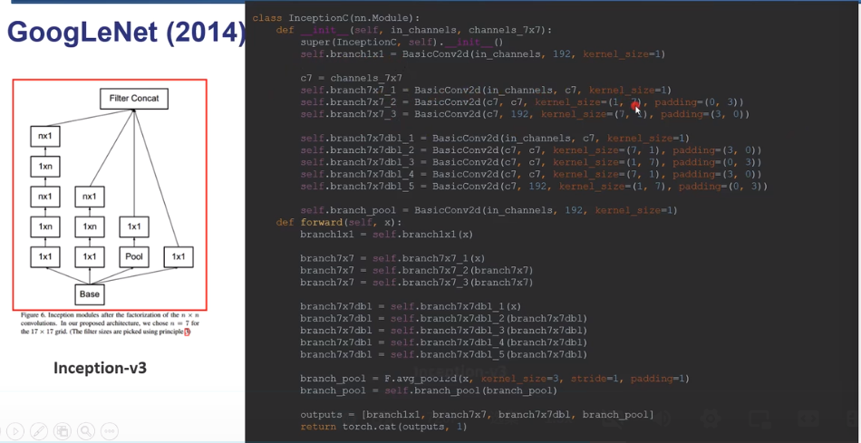
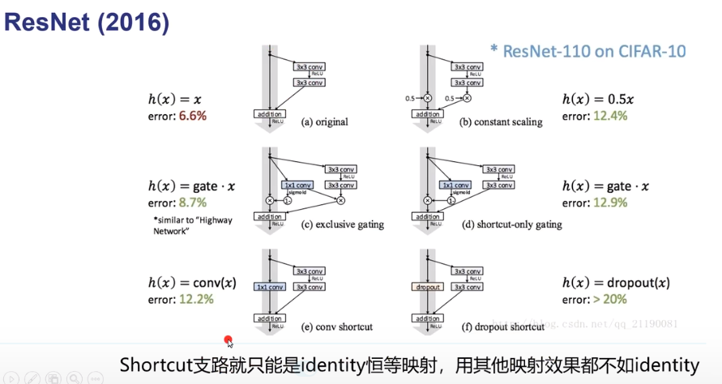
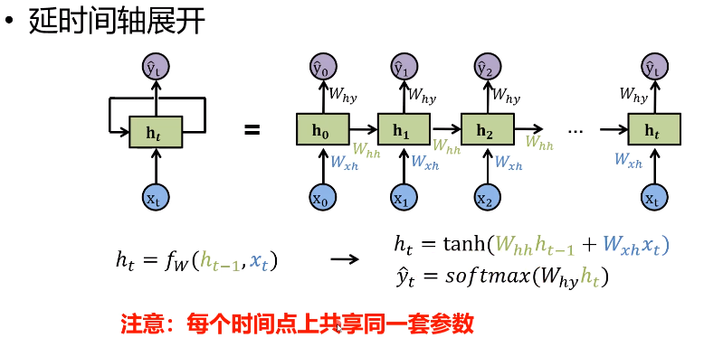
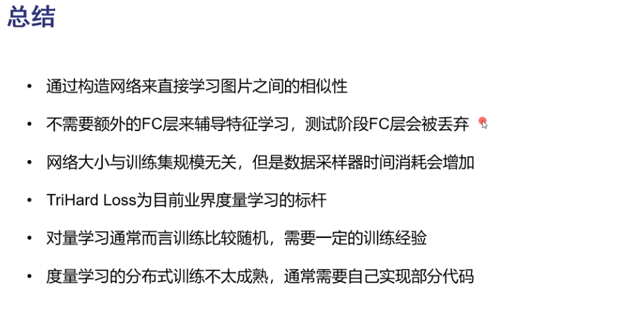

### 4.浙江大学罗浩博士 深度学习

#### 4.1 卷积结构类型

##### 4.1.1 **正常卷积**

`H*W*Ci` Ci:输入通道数

比如:

输入:`64*128*3`

kernel:`k*k*6`

有6个卷积核,每一个卷积核去对64*128的图像的三个通道进行卷积,三个结果求和得到一张feature map,以此类推,最后会得到6张feature map

(下面算Ho,Wo的公式错了,上面复旦大学讲的是对的),下面公式是对的:

kernel_size尽量和pdding值一致,这样如果stride=1,输入输出特征图是一样大的

3*3------ 1

5*5------ 2

7*7------ 3

##### 4.1.2 **点卷积**

1*1的卷积

对前一层输出的特征图进行全连接,联想LeNet中的链接表

可以用于升维/降维

**减少参数量**

##### 4.1.3 **分组卷积**

最开始作用:显卡不够用的时候可以用

​	

##### 4.1.4  **空洞卷积**

   不增加参数量的情况下,

   **扩大感受野,语义分割任务常用**

diliation=2:每隔两个像素 有一个 空洞

   

##### 4.1.5  **转置卷积/反卷积**

   

#### 4.2 常用的卷积神经网络

##### 4.2.1 **LeNet-5**

##### 4.2.2.**AlexNet**

   

##### 4.2.3 **ZFNet**

   

##### 4.2.4 **VGGNet**

提出 卷积block的概念

   

##### 4.2.5 **GoogleLeNet(Inception)**

   v1:和之前网络一条支路不同,它在同一层把不同尺度的feature map进行融合

   v2:使用point-wise(下图写错了)的1*1卷积,把通道数降低,减少了参数

   v3:卷积核的分解 `n*n ------  1*n + n*1`

==code:==

##### 4.2.6  **ResNet**

   

==code:==

****

##### 4.2.7  **ResNetXt**

   

##### 4.2.8  **DenseNet**

##### 4.2.9 **SENet**

   

   传统的思想是每一个channel的权重是一样的,都是同等重要的,但是SENet对每一个channel的重要程度进行打分:

   经过Sigmoid后的是一个**`C*1*1`**的向量,就代表每一个channel的权重信息,在与输入的feature map进行点乘.

   这个attention是自动学出来的.

#### 4.3 常用的小型网络结构

##### 4.3.1  **Fire Module**

   

   squeeze:先用1*1把通道数降低

   expand:用`1*1`代替一些`3*3`

   作用:压缩参数

   

##### 4.3.2 Xception**结构**

先用channel-wise卷积

再用point-wise卷积

**MobileNet**大量使用**Xception**结构,计算量大量集中在1*1的point-wise卷积上

**shuffleNet**做出了改进

### 5 罗浩:递归/循环神经网络 RNN

CNN:一个输入--------一个输出

RNN：一个/多个输入--------------一个/多个输出

#### **5.1 应用举例**

1.**图像描述**

2.**视频描述**

3.**动作识别**

#### 5.2 基本原理/建模

在每一时刻t,使用循环的方式来处理向量x序列

### 6.度量学习

#### 1.同济

**分类模型**:

想要得到一张图片的类别信息,N分类模型只需要将输入的图片分类为训练见过的类别即可.

局限:只会输出N类中的一个类型

人脸识别:分类模型很难去做,有一万个人,不可能每一个人都采集很多数据

**学习衡量图片的相似度**

为了人脸识别,一个朴素的想法就是,让模型去学习两张图片的**相似度**,同一个人的两张不同图片的相似误差要尽可能小,最好没有差异,不同人的两张图片的相似差距应该尽可能大,但也不用太大,只要大于一个可以用于辨别的阈值margin就可以.

pytorch实现:

embeddings:resnet卷积层输出的512维向量

target:输入的目标图片

#### 2.浙大

##### **2.1 表征学习**

##### 2.2 度量学习image-20200715212923389

**三元组损失没有考虑绝对距离**

红色的:正样本对的距离

绿色的:负样本对的距离

对于正样本对,距离越大,权重越大,

对于负样本对,距离越小,权重越大

w_p:softmax归一化

w_n:softmin归一化

表征学习学到的特征有很明显的分类面,不好直接用于度量学习,

1.归一化处理,投影到球面上

2.计算余弦距离

度量学习学到的特征 聚类性 更好

这种**联合训练**的结果是最好的

### 7.ResNet

ResNet在2015年由微软实验室提出， 斩获当年ImageNet竞赛中分类任务第一名， 目标检测第一名。 获得COCO数据集中目标检测第一名， 图像分割第一名。 

+ **网络亮点:**

  + 超深的网络结构(突破1000层)
  + 提出residual模块(残差模块)
  + 使用Batch Normalization加速训练

  从经验来看，网络的深度对模型的性能至关重要，当增加网络层数后，网络可以进行更加复杂的特征模式的提取，所以当模型更深时理论上可以取得更好的结果,但是网络不能单纯的堆叠卷积层和池化层,这样非但不会得到很好的效果,反而会让网络效果变差:

  在深度学习中，网络层数增多一般会伴着下面几个问题

  1. 计算资源的消耗
  2. 模型容易过拟合
  3. 梯度消失/梯度爆炸问题的产生

  + 问题1可以通过GPU集群来解决，对于一个企业资源并不是很大的问题；

  + 问题2的过拟合通过采集海量数据，并配合Dropout正则化等方法也可以有效避免；

  + 问题3通过Batch Normalization也可以避免。
    貌似我们只要无脑的增加网络的层数，我们就能从此获益，但实验数据给了我们当头一棒。实验发现深度网络出现了退化问题（Degradation problem）：网络深度增加时，网络准确度出现饱和，甚至出现下降。这个现象可以在下图中直观看出来：
    

    56层的网络比20层网络效果还要差。这不会是过拟合问题，因为56层网络的训练误差同样高。我们知道深层网络存在着梯度消失或者爆炸的问题，这使得深度学习模型很难训练。但是现在已经存在一些技术手段如BatchNorm来缓解这个问题。因此，出现深度网络的退化问题是非常令人诧异的。

  ​	

  + **梯度消失/梯度爆炸:**

    1. 梯度消失/梯度爆炸产生的原因:

       在神经网络中,网络参数的学习是通过反向传播的链式求导法则来求Loss对某个参数的偏导数,然后进行参数更新,当网络层数很深,而当前的参数所在层又靠近网络的输入时,求导链就会很长,如果其中的某些中间结果的值很小,经过链式求导的累乘,最终求得的梯度值就会接近与零,导致参数得不得更新,梯度爆炸产生的原因类似,当中间结果很大时,最后求得的梯度值就会很大,其**根本原因**在于反向传播训练法则，属于先天不足。

  + **退化问题**

  当网络退化时，浅层网络能够达到比深层网络更好的训练效果，这时如果我们把低层的特征传到高层，那么效果应该至少不比浅层的网络效果差，或者说如果一个VGG-100网络在第98层使用的是和VGG-16第14层一模一样的特征，那么VGG-100的效果应该会和VGG-16的效果相同。

  但是实验结果表明，VGG-100网络的训练和测试误差比VGG-16网络的更大。这说明A网络在学习恒等映射的时候出了问题，也就是`传统的网络（"plain" networks）很难去学习恒等映射。`也就是说，我们不得不承认肯定是目前的训练方法有问题，才使得深层网络很难去找到一个好的参数。
  所以，我们可以在VGG-100的98层和14层之间添加一条直接映射（Identity Mapping）来达到此效果。

  从信息论的角度讲，由于DPI（数据处理不等式）的存在，在前向传输的过程中，随着层数的加深，Feature Map包含的图像信息会逐层减少，而ResNet的直接映射的加入，保证了 l+1层的网络一定比 l 层包含更多的图像信息。

  基于这种使用直接映射来连接网络不同层直接的思想，残差网络应运而生。

+ **Residual残差模块**

  

  左边用在层数比较少的ResNet,比如resnet-18,resnet-34,右边的结构用在层数更深的ResNet,比如resnet-50/101/152

  > 主分支与shortcut的输出特征矩阵**shape必须相同**
  >
  > 1x1的卷积核用来降维和升维

  假设输入是256-d维的特征

  左边的参数个数:

  3x3x256x256+3x3x256x256 = 1,179,648

  右边的参数个数:

  1x1x256x64+ 3x3x64x64 +1x1x64x256 = 69,632

​	上表是各种不同层数的resnet网络结构图,

以resnet-34为例

首先是7x7的卷积层和3x3的池化层

再经过conv2_x    3个残差结构

再经过conv3_x    4个残差结构

再经过conv4_x    6个残差结构

再经过conv5_x    3个残差结构

> 注意,残差结构要求输入和输出的shape必须完全相同,但是有些残差层的输入输出shape不相同,
>
> 这就需要在short连接上加一个卷积层,改变输入shape和输出相同

比如 resnet-34的conv3_x:

输入特征矩阵shape是[56,56,64]

输出特征矩阵shape是[28,28,128]

所以在short连接上加一个1x1卷积层(虚线)

所以conv3_x的第一个残差结构应该是如下这样的:

同样的对于更高层数的resnet使用的残差结构,conv3_x第一个残差结构也要改动:

> conv3_1,conv4_1,conv5_1都是下采样层改变输入特征shape(short连接是虚线)

+ **Batch Normalization 批归一化**

  BN层的目的是使一批(Batch)的feature map(每一个channel)都满足均值为0,方差为1的分布;

  Batch Normalization是google团队在2015年论文《Batch Normalization: Accelerating Deep Network Training by Reducing Internal Covariate Shift》提出的。

  通过该方法能够加速网络的收敛并提升准确率;

  

  

  

  ​	