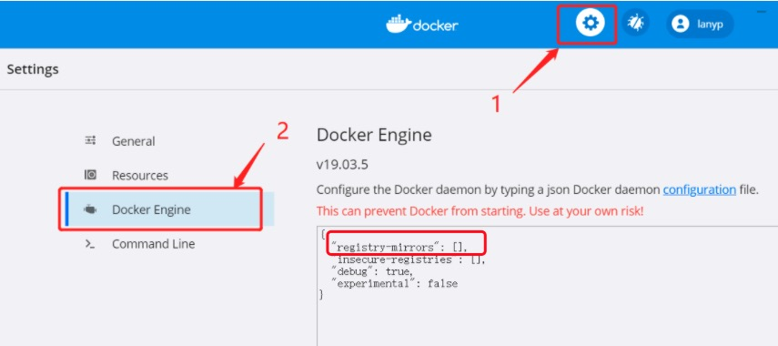
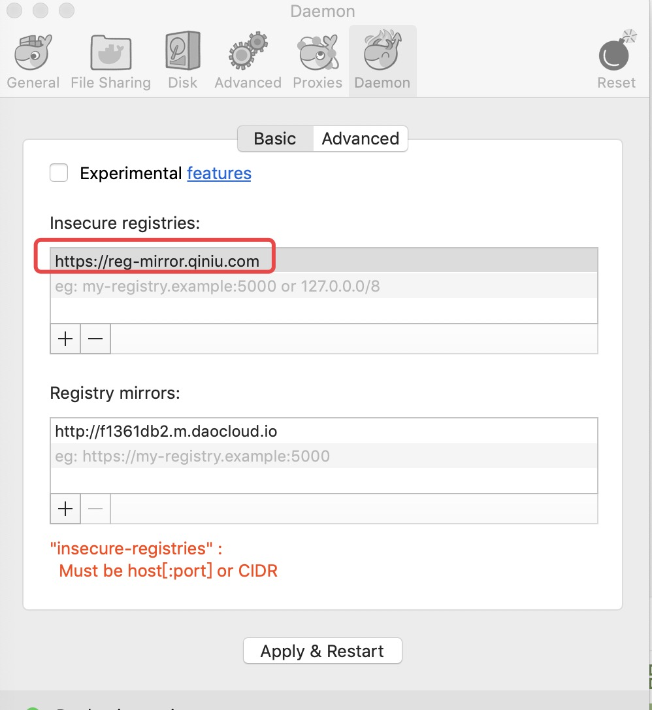

# Docker 教程

[菜鸟教程](https://www.runoob.com/docker/docker-tutorial.html)


Docker 是一个开源的应用容器引擎，基于 [Go 语言](https://www.runoob.com/go/go-tutorial.html) 并遵从 Apache2.0 协议开源。

Docker 可以让开发者打包他们的应用以及依赖包到一个轻量级、可移植的容器中，然后发布到任何流行的 Linux 机器上，也可以实现虚拟化。

容器是完全使用沙箱机制，相互之间不会有任何接口（类似 iPhone 的 app）,更重要的是容器性能开销极低。

Docker 从 17.03 版本之后分为 CE（Community Edition: 社区版） 和 EE（Enterprise Edition: 企业版），我们用社区版就可以了。

------

## 谁适合阅读本教程？

本教程适合运维工程师及后端开发人员，通过本教程你可以一步一步了解 Docker 的使用。

------

## 阅读本教程前，您需要了解的知识

在阅读本教程前，你需要掌握 Linux 的常用命令。你可以通过本站的 [Linux 教程](https://www.runoob.com/linux/linux-tutorial.html) 来学习相关命令。

------

## Docker的应用场景

+ Web 应用的自动化打包和发布。
+ 自动化测试和持续集成、发布。
+ 在服务型环境中部署和调整数据库或其他的后台应用。
+ 从头编译或者扩展现有的 OpenShift 或 Cloud Foundry 平台来搭建自己的 PaaS 环境。

------

## Docker 的优点

Docker 是一个用于开发，交付和运行应用程序的开放平台。**Docker 使您能够将应用程序与基础架构分开，从而可以快速交付软件**。借助 Docker，您可以与管理应用程序相同的方式来管理基础架构。通过利用 Docker 的方法来快速交付，测试和部署代码，您可以大大减少编写代码和在生产环境中运行代码之间的延迟。

### 1、快速，一致地交付您的应用程序

Docker 允许开发人员使用您提供的应用程序或服务的本地容器在标准化环境中工作，从而简化了开发的生命周期。

容器非常适合持续集成和持续交付（CI / CD）工作流程，请考虑以下示例方案：

+ 您的开发人员在本地编写代码，并使用 Docker 容器与同事共享他们的工作。
+ 他们使用 Docker 将其应用程序推送到测试环境中，并执行自动或手动测试。
+ 当开发人员发现错误时，他们可以在开发环境中对其进行修复，然后将其重新部署到测试环境中，以进行测试和验证。
+ 测试完成后，将修补程序推送给生产环境，就像将更新的镜像推送到生产环境一样简单。

### 2、响应式部署和扩展

Docker 是基于容器的平台，允许高度可移植的工作负载。Docker 容器可以在开发人员的本机上，数据中心的物理或虚拟机上，云服务上或混合环境中运行。

Docker 的可移植性和轻量级的特性，还可以使您轻松地完成动态管理的工作负担，并根据业务需求指示，实时扩展或拆除应用程序和服务。

### 3、在同一硬件上运行更多工作负载

Docker 轻巧快速。它为基于虚拟机管理程序的虚拟机提供了可行、经济、高效的替代方案，因此您可以利用更多的计算能力来实现业务目标。Docker 非常适合于高密度环境以及中小型部署，而您可以用更少的资源做更多的事情。

------

## 相关链接

Docker 官网：[https://www.docker.com](https://www.docker.com/)

Github Docker 源码：https://github.com/docker/docker-ce

# Ubuntu Docker 安装

Docker Engine-Community 支持以下的 Ubuntu 版本：


+ Xenial 16.04 (LTS)
+ Bionic 18.04 (LTS)
+ Cosmic 18.10
+ Disco 19.04
+ 其他更新的版本……

Docker Engine - Community 支持上 x86_64（或 amd64）armhf，arm64，s390x （IBM Z），和 ppc64le（IBM的Power）架构。

------

## 使用官方安装脚本自动安装

安装命令如下：

```
curl -fsSL https://get.docker.com | bash -s docker --mirror Aliyun
```

也可以使用国内 daocloud 一键安装命令：

```
curl -sSL https://get.daocloud.io/docker | sh
```

------

## 手动安装

### 卸载旧版本

Docker 的旧版本被称为 docker，docker.io 或 docker-engine 。如果已安装，请卸载它们：

```
$ sudo apt-get remove docker docker-engine docker.io containerd runc
```

当前称为 Docker Engine-Community 软件包 docker-ce 。

安装 Docker Engine-Community，以下介绍两种方式。

### 使用 Docker 仓库进行安装

在新主机上首次安装 Docker Engine-Community 之前，需要设置 Docker 仓库。之后，您可以从仓库安装和更新 Docker 。

### 设置仓库

更新 apt 包索引。

```
$ sudo apt-get update
```

安装 apt 依赖包，用于通过HTTPS来获取仓库:

```sh
$ sudo apt-get install \
  apt-transport-https \
  ca-certificates \
  curl \
  gnupg-agent \
  software-properties-common
```

添加 Docker 的官方 GPG 密钥：

```sh
$ curl -fsSL https://mirrors.ustc.edu.cn/docker-ce/linux/ubuntu/gpg | sudo apt-key add - 9DC8 5822 9FC7 DD38 854A E2D8 8D81 803C 0EBF CD88
```

 通过搜索指纹的后8个字符，验证您现在是否拥有带有指纹的密钥。

```sh
$ sudo apt-key fingerprint 0EBFCD88
   
pub   rsa4096 2017-02-22 [SCEA]
      9DC8 5822 9FC7 DD38 854A  E2D8 8D81 803C 0EBF CD88
uid           [ unknown] Docker Release (CE deb) <docker@docker.com>
sub   rsa4096 2017-02-22 [S]
```

使用以下指令设置稳定版仓库

```sh
$ sudo add-apt-repository \
   "deb [arch=amd64] https://mirrors.ustc.edu.cn/docker-ce/linux/ubuntu/ \
  $(lsb_release -cs) \
  stable"
```

### 安装 Docker Engine-Community

更新 apt 包索引。

```
$ sudo apt-get update
```

安装最新版本的 Docker Engine-Community 和 containerd ，或者转到下一步安装特定版本：

```
$ sudo apt-get install docker-ce docker-ce-cli containerd.io
```

要安装特定版本的 Docker Engine-Community，请在仓库中列出可用版本，然后选择一种安装。列出您的仓库中可用的版本：

```sh
$ apt-cache madison docker-ce

  docker-ce | 5:18.09.1~3-0~ubuntu-xenial | https://mirrors.ustc.edu.cn/docker-ce/linux/ubuntu  xenial/stable amd64 Packages
  docker-ce | 5:18.09.0~3-0~ubuntu-xenial | https://mirrors.ustc.edu.cn/docker-ce/linux/ubuntu  xenial/stable amd64 Packages
  docker-ce | 18.06.1~ce~3-0~ubuntu       | https://mirrors.ustc.edu.cn/docker-ce/linux/ubuntu  xenial/stable amd64 Packages
  docker-ce | 18.06.0~ce~3-0~ubuntu       | https://mirrors.ustc.edu.cn/docker-ce/linux/ubuntu  xenial/stable amd64 Packages
  ...
```


使用第二列中的版本字符串安装特定版本，例如 `5:18.09.1~3-0~ubuntu-xenial`。

```
$ sudo apt-get install docker-ce=<VERSION_STRING> docker-ce-cli=<VERSION_STRING> containerd.io
```

测试 Docker 是否安装成功，输入以下指令，打印出以下信息则安装成功:

```sh
$ sudo docker run hello-world

Unable to find image 'hello-world:latest' locally
latest: Pulling from library/hello-world
1b930d010525: Pull complete                                                                                                                                  Digest: sha256:c3b4ada4687bbaa170745b3e4dd8ac3f194ca95b2d0518b417fb47e5879d9b5f
Status: Downloaded newer image for hello-world:latest


Hello from Docker!
This message shows that your installation appears to be working correctly.


To generate this message, Docker took the following steps:
 1. The Docker client contacted the Docker daemon.
 2. The Docker daemon pulled the "hello-world" image from the Docker Hub.
    (amd64)
 3. The Docker daemon created a new container from that image which runs the
    executable that produces the output you are currently reading.
 4. The Docker daemon streamed that output to the Docker client, which sent it
    to your terminal.


To try something more ambitious, you can run an Ubuntu container with:
 $ docker run -it ubuntu bash


Share images, automate workflows, and more with a free Docker ID:
 https://hub.docker.com/


For more examples and ideas, visit:
 https://docs.docker.com/get-started/
```

------

## 使用 Shell 脚本进行安装

Docker 在 [get.docker.com ](https://get.docker.com/)和 [test.docker.com](https://test.docker.com/) 上提供了方便脚本，用于将快速安装 Docker Engine-Community 的边缘版本和测试版本。脚本的源代码在 docker-install 仓库中。 不建议在生产环境中使用这些脚本，在使用它们之前，您应该了解潜在的风险：

+ 脚本需要运行 root 或具有 sudo 特权。因此，在运行脚本之前，应仔细检查和审核脚本。
+ 这些脚本尝试检测 Linux 发行版和版本，并为您配置软件包管理系统。此外，脚本不允许您自定义任何安装参数。从 Docker 的角度或您自己组织的准则和标准的角度来看，这可能导致不支持的配置。
+ 这些脚本将安装软件包管理器的所有依赖项和建议，而无需进行确认。这可能会安装大量软件包，具体取决于主机的当前配置。
+ 该脚本未提供用于指定要安装哪个版本的 Docker 的选项，而是安装了在 edge 通道中发布的最新版本。
+ 如果已使用其他机制将 Docker 安装在主机上，请不要使用便捷脚本。

本示例使用 [get.docker.com ](https://get.docker.com/)上的脚本在 Linux 上安装最新版本的Docker Engine-Community。要安装最新的测试版本，请改用 test.docker.com。在下面的每个命令，取代每次出现 get 用 test。

```
$ curl -fsSL https://get.docker.com -o get-docker.sh
$ sudo sh get-docker.sh
```

如果要使用 Docker 作为非 root 用户，则应考虑使用类似以下方式将用户添加到 docker 组：

```
$ sudo usermod -aG docker your-user
```

### 卸载 docker

删除安装包：

```
sudo apt-get purge docker-ce
```

删除镜像、容器、配置文件等内容：

```
sudo rm -rf /var/lib/docker
```

# Docker 镜像加速

国内从 DockerHub 拉取镜像有时会遇到困难，此时可以配置镜像加速器。Docker 官方和国内很多云服务商都提供了国内加速器服务，例如：

+ 科大镜像：**https://docker.mirrors.ustc.edu.cn/**
+ 网易：**https://hub-mirror.c.163.com/**
+ 阿里云：**https://<你的ID>.mirror.aliyuncs.com**
+ 七牛云加速器：**https://reg-mirror.qiniu.com**

当配置某一个加速器地址之后，若发现拉取不到镜像，请切换到另一个加速器地址。国内各大云服务商均提供了 Docker 镜像加速服务，建议根据运行 Docker 的云平台选择对应的镜像加速服务。

阿里云镜像获取地址：https://cr.console.aliyun.com/cn-hangzhou/instances/mirrors，登陆后，左侧菜单选中镜像加速器就可以看到你的专属地址了：


之前还有 Docker 官方加速器 **https://registry.docker-cn.com** ，现在好像已经不能使用了，我们可以多添加几个国内的镜像，如果有不能使用的，会切换到可以使用个的镜像来拉取。

### Ubuntu14.04、Debian7Wheezy

对于使用 upstart 的系统而言，编辑 /etc/default/docker 文件，在其中的 DOCKER_OPTS 中配置加速器地址：

```
DOCKER_OPTS="--registry-mirror=https://registry.docker-cn.com"
```

重新启动服务:

```
$ sudo service docker restart
```

### Ubuntu16.04+、Debian8+、CentOS7

对于使用 systemd 的系统，请在 /etc/docker/daemon.json 中写入如下内容（如果文件不存在请新建该文件）：

```
{"registry-mirrors":["https://reg-mirror.qiniu.com/"]}
```

之后重新启动服务：

$ **sudo** systemctl daemon-reload
$ **sudo** systemctl restart docker

### Windows 10

对于使用 Windows 10 的系统，在系统右下角托盘 Docker 图标内右键菜单选择 Settings，打开配置窗口后左侧导航菜单选择 Daemon。在 Registrymirrors 一栏中填写加速器地址 **https://docker.mirrors.ustc.edu.cn/** ，之后点击 Apply 保存后 Docker 就会重启并应用配置的镜像地址了。



### Mac OS X

对于使用 Mac OS X 的用户，在任务栏点击 Docker for mac 应用图标-> Perferences...-> Daemon-> Registrymirrors。在列表中填写加速器地址 **https://reg-mirror.qiniu.com** 。修改完成之后，点击 Apply&Restart 按钮，Docker 就会重启并应用配置的镜像地址了。



### 检查加速器是否生效

检查加速器是否生效配置加速器之后，如果拉取镜像仍然十分缓慢，请手动检查加速器配置是否生效，在命令行执行 **docker info**，如果从结果中看到了如下内容，说明配置成功。

```
$ docker info
Registry Mirrors:
    https://reg-mirror.qiniu.com
```