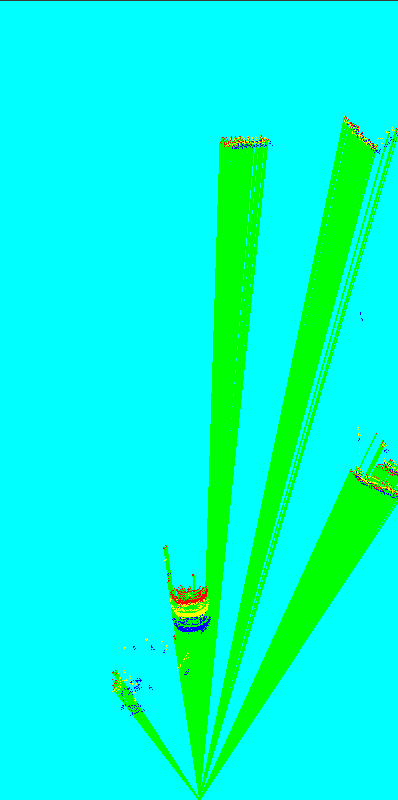
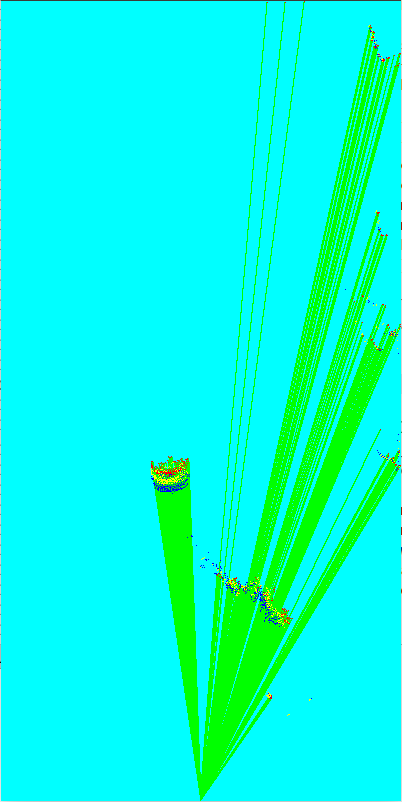
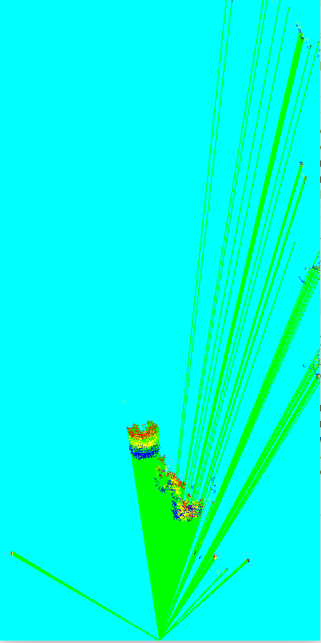
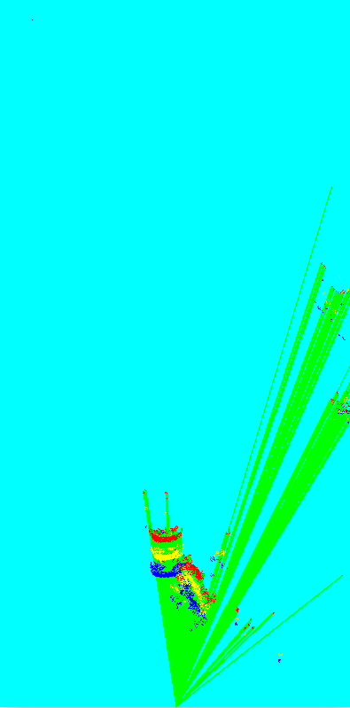
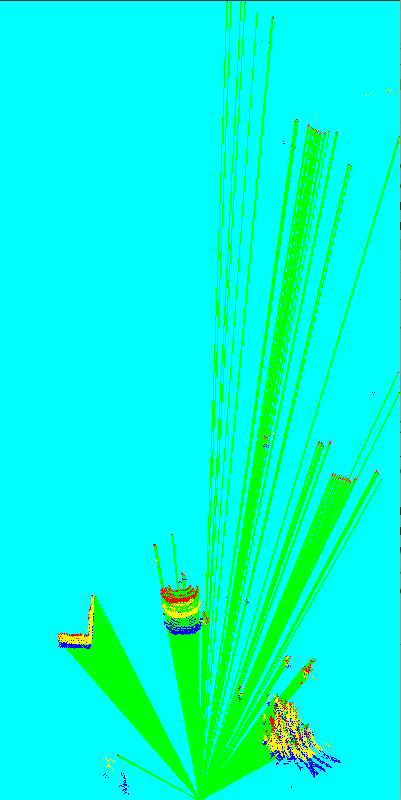
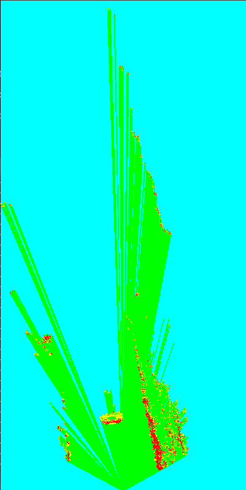
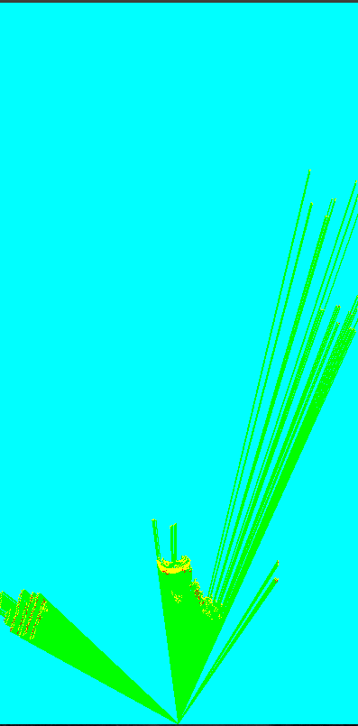

1.尝试使用栅格的占据状态进行动态信息的提取

以下是连续三帧雷达占据栅格图,绿色表示空闲,淡蓝色表示未知,红色表示当前帧t占据,黄色表示t-1占据,蓝色表示t-2占据

车尾部的粉尘,有时是静止状态,有时是运动状态

|  |  |  |
| --------------------------------------------- | --------------------------------------------- | --------------------------------------------- |
|  |  |                                               |

连续两帧占据图直接相减,得到运动目标,下图黄色为状态发生变化的栅格:

|                                                              |                                                              |
| ------------------------------------------------------------ | ------------------------------------------------------------ |
|  |  |

