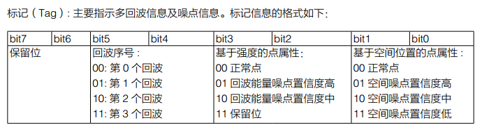
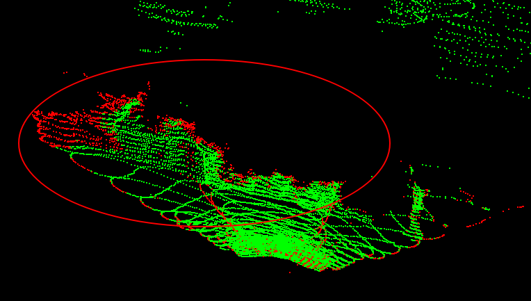
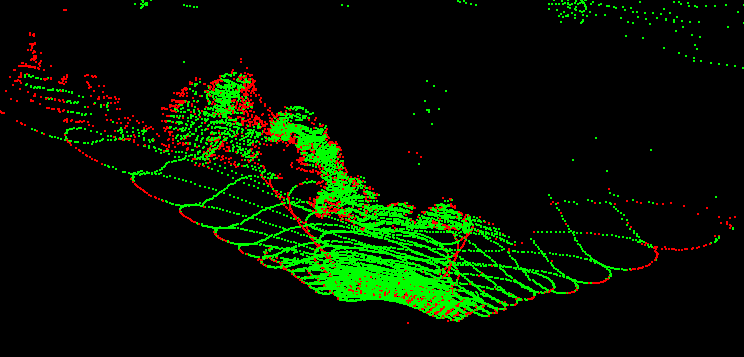
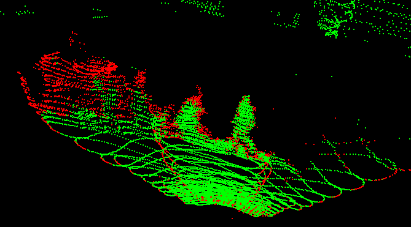
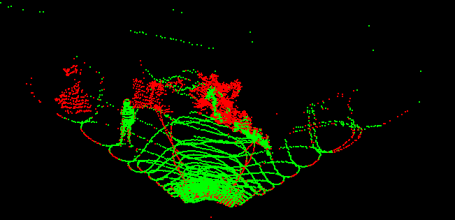
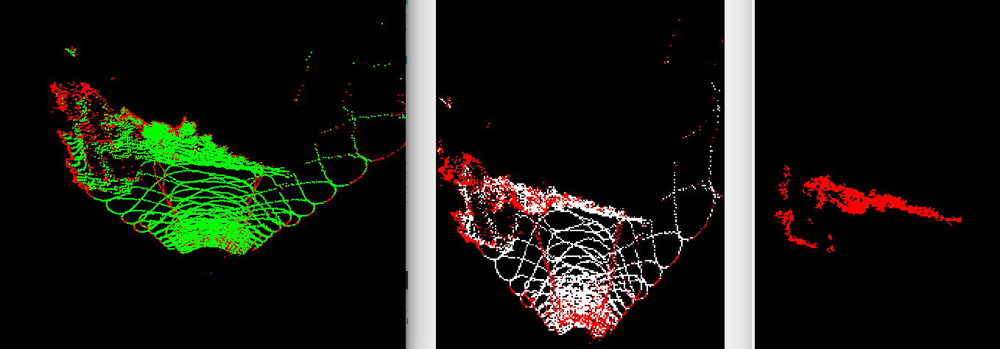
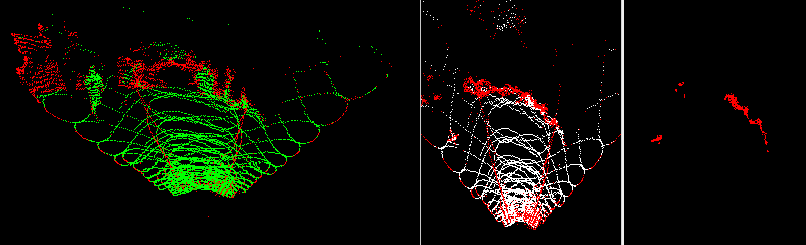
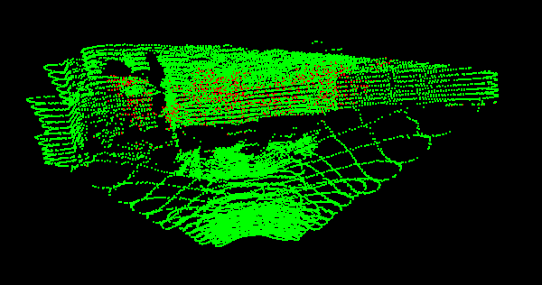
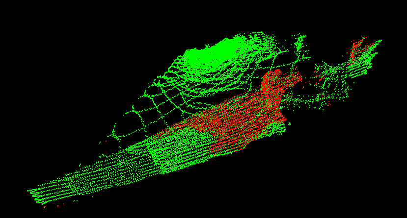

## Livox利用tag信息对输入点云进行去噪:

### 1.tag的定义:

### 2.实验

#### 2.1 单回波模式

绿色点为正常点,红色点为根据tag判断出的噪点,包括空间噪点和反射率噪点.

|  | 图中红圈中为烟雾大概范围                           |
| ------------------------------------------------------------ | -------------------------------------------------- |
|  | 对于很浓的烟雾,只会把烟雾的边缘识别为噪点          |
|                                  | 对于一般的烟雾,会检测出很多噪点,但是也不能完全去掉 |
|                                  | 很稀疏的烟雾                                       |

正障碍物地图:

#### 2.2 双回波模式

在双回波模式下,对于不太浓的烟雾,可以探测到被烟雾遮挡住的墙体,下图中的红色点,

前视图:

后视图:

## 统计特征分析

烟雾,粉尘和一般object的显著区别是,形状不固定;

一般的物体,障碍物是==硬的==,而烟雾,粉尘,草丛等是==软的==

硬 和 软 的区别有:

1.硬的 物体, 激光雷达不会穿过去,软的 物体,激光雷达有些射线会穿过它;

所以,如果将激光雷达点云进行三维体素化,使用光线追踪法追踪每一个三维点,给每一个体素添加穿透属性,被点占据的体素赋值击中属性,被穿过的体素赋值击穿属性,通过分析每一个被击中体素中,被击中次数和被击穿次数的比值,赋值体素的硬/软 属性.

2.与1 类似,对于硬的物体, 当激光雷达打到其表面时,返回点会形成一个 比较明显的表面,而对于软的物体,返回点会呈现 一团一团 的,不会有一个 厚度 很细 的 表面;

从另一个角度来看,就是 硬的物体 表面比较 整齐, 软的 物体 表面 比较 乱,使用统计属性来说就是:

+ 一个方差小, 一个方差大
+ 一个熵 小, 一个 熵大

怎样表征,这种厚度?

使用特征值?