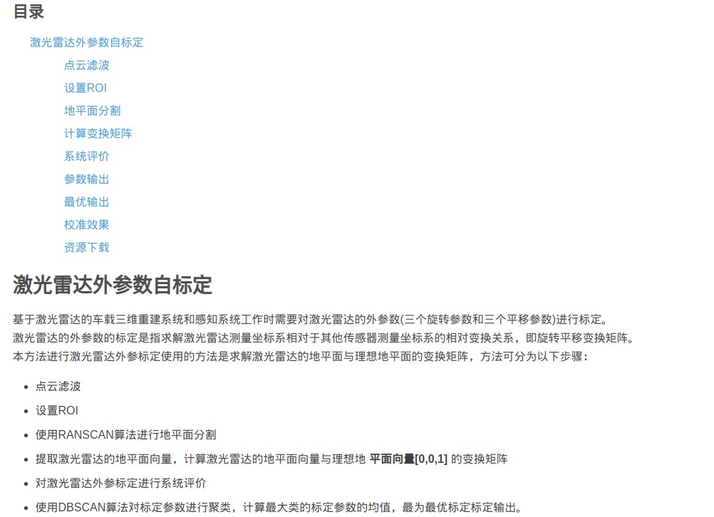
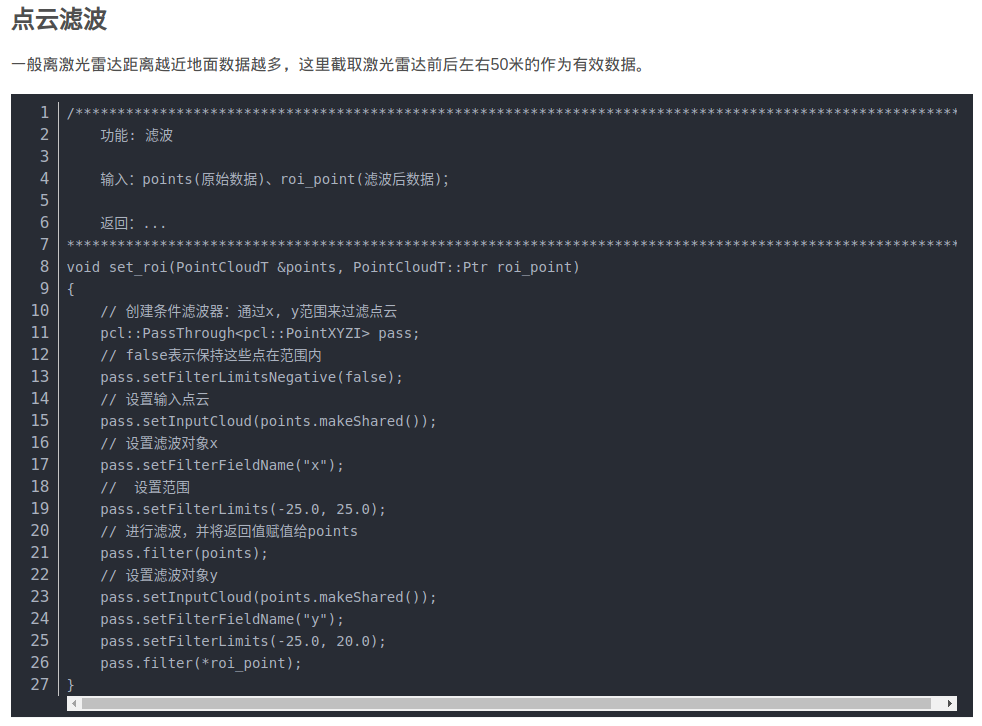
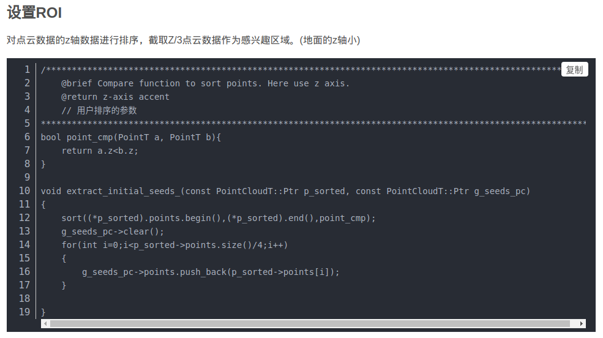
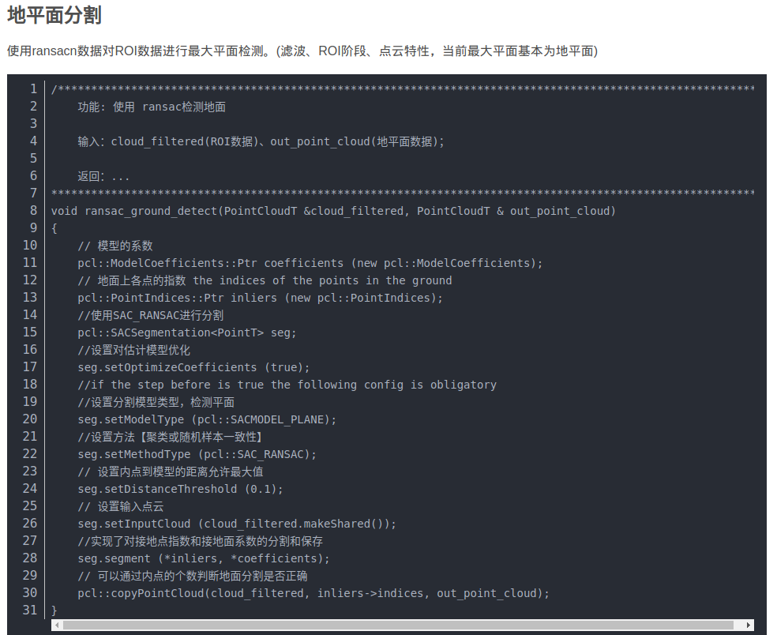
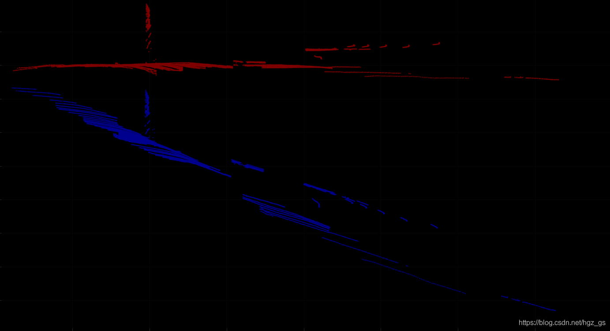
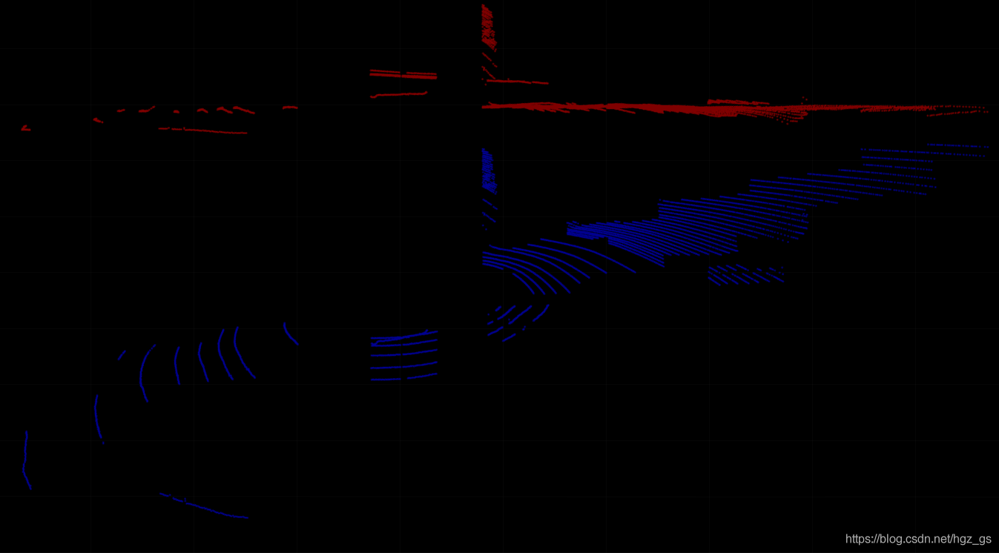
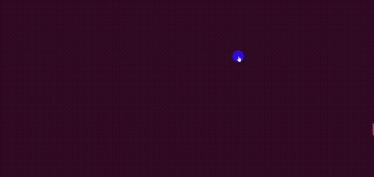
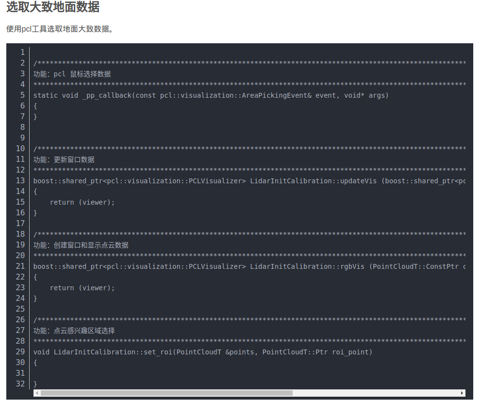

## 激光雷达外参数自标定

https://blog.csdn.net/hgz_gs/article/details/113484065









## 计算变换矩阵

```C++
/**********************************************************************************************************
	功能: 进行平面拟合 得到法向量normal_和 th_dist_d_.计算法向量normal_与[0,0,1]向量的变换矩阵

	输入：g_ground_pc(最大平面数据)、roll(X轴)、pitch(Y轴)、yaw(Z轴)：欧拉角；
        (x, y, z):位移；

	返回：...
**********************************************************************************************************/
//  和 th_dist_d_. 更新拟合平面的A B C D
void estimate_plane_(PointCloudT::Ptr g_ground_pc, double &roll, double &pitch, double &yaw, double &offset_z)
{
    MatrixXf normal_;
    // Create covarian matrix in single pass.
    // TODO: compare the efficiency.
    Eigen::Matrix3f cov;
    Eigen::Vector4f pc_mean; // 归一化坐标值
    // computeMeanAndCovarianceMatrix主要是PCA过程中计算平均值和协方差矩阵 ,对地面点(最小的n个点)进行计算协方差和平均值
    pcl::computeMeanAndCovarianceMatrix(*g_ground_pc, cov, pc_mean);
    // Singular Value Decomposition: SVD
    JacobiSVD<MatrixXf> svd(cov,Eigen::DecompositionOptions::ComputeFullU);
    // use the least singular vector as normal
    normal_ = (svd.matrixU().col(2)); // 取最小的特征值对应的特征向量作为法向量
    // mean ground seeds value
    Eigen::Vector3f seeds_mean = pc_mean.head<3>(); // seeds_mean 地面点的平均值

    // according to normal.T*[x,y,z] = -d
    offset_z = -(normal_.transpose()*seeds_mean)(0,0); // 计算d   D=d
    // set distance threhold to `th_dist - d`
    //th_dist_d_ = th_dist_ - offset_z;// 这里只考虑在拟合的平面上方的点 小于这个范围的点当做地面
    
    // return the equation parameters
    
    Eigen::MatrixXf vectorAfter = MatrixXf::Zero(3, 1);
    vectorAfter << 0.0, 0.0,1.0;
    Eigen::Matrix4f rotationMatrix = rotation_matrix_from_vectors(normal_,vectorAfter);
    
    
    
    Eigen::Matrix3d rotation_matrix;
    rotation_matrix<<   rotationMatrix(0, 0), rotationMatrix(0, 1), rotationMatrix(0, 2),
                        rotationMatrix(1, 0), rotationMatrix(1, 1), rotationMatrix(1, 2),
                        rotationMatrix(2, 0), rotationMatrix(2, 1), rotationMatrix(2, 2);

    // 2,1,0;
    Eigen::Vector3d eulerAngle = rotation_matrix.eulerAngles(0,1,2);
    yaw = eulerAngle(2);
    roll = eulerAngle(1);
    pitch = eulerAngle(0);
 
          
    yaw = fmod( ( yaw + 2*M_PI),  (2*M_PI) ) / M_PI * 180;
    roll = fmod( ( roll + 2*M_PI),  (2*M_PI) ) / M_PI * 180;
    pitch = fmod( ( pitch + 2*M_PI),  (2*M_PI) ) / M_PI * 180;
    
    /*
	std::cout << "yaw:"<< yaw << ", roll:" << roll << ", pitch:" << pitch << std::endl;  //45 -0 0
	std::cout << "offset_z:"<< offset_z << std::endl;  //45 -0 0
	cout<<  rotationMatrix(0, 0) <<","<< rotationMatrix(0, 1) <<","<< rotationMatrix(0, 2) <<","<< rotationMatrix(0, 3)<< endl; 
    cout<<  rotationMatrix(1, 0) <<","<< rotationMatrix(1, 1) <<","<< rotationMatrix(1, 2) <<","<< rotationMatrix(1, 3)<< endl;
    cout<<  rotationMatrix(2, 0) <<","<< rotationMatrix(2, 1) <<","<< rotationMatrix(2, 2) <<","<< rotationMatrix(2, 3)<< endl; 
    cout<<  rotationMatrix(3, 0) <<","<< rotationMatrix(3, 1) <<","<< rotationMatrix(3, 2) <<","<< rotationMatrix(3, 3)<< endl; 
    */
}
```

## 系统评价

```C++
// 点云变换
pcl::transformPointCloud(*g_seeds_pc, *cloud_filtered_ptr, transform_matrix);
/**********************************************************************************************************
    功能：评判校准是否有效
    
    输入：cloud_filtered_ptr(地面数据)、roi_point_num(roi中点的数量)

    输出：校准是否有效
    
    评判维度：
        1. 通过比较 ROI点云数量与 地面点云数量。
        2. 计算均值和方差

**********************************************************************************************************/

bool access_calibrate(PointCloudT::Ptr cloud_filtered_ptr, int roi_point_num)
{
    std::vector< double > resultSet;
	cloud_filtered_ptr->width = cloud_filtered_ptr->points.size();;
	cloud_filtered_ptr->height = 1;

	for (std::size_t i = 0; i < cloud_filtered_ptr->points.size(); ++i)
	{
	    if( cloud_filtered_ptr->points[i].z >= -0.1 && cloud_filtered_ptr->points[i].z <= 0.1)
        {
            resultSet.push_back(cloud_filtered_ptr->points[i].z);
        }
	}
	double sum = std::accumulate(std::begin(resultSet), std::end(resultSet), 0.0);
    double mean =  sum / resultSet.size(); //均值
    double accum  = 0.0;
    std::for_each (std::begin(resultSet), std::end(resultSet), [&](const double d) {accum  += (d-mean)*(d-mean);});
    double stdev = sqrt(accum/(resultSet.size()-1)); //方差
    double num_ratio = resultSet.size() *1.0 / roi_point_num; // 有效数据量/roi数据量
    
    
    cout<< roi_point_num <<"," << num_ratio << "," << resultSet.size() << "," << abs(mean) << "," << abs(stdev) <<endl;
    if( num_ratio>=min_num_ratio && resultSet.size() >= min_ground_num && abs(mean)<= max_mean && abs(stdev)<=max_stdev )
        return true;
        
   return false;
}
```

## 参数输出

```C++
/**********************************************************************************************************
功能：存储校准参数

 输入：roll(X轴)、pitch(Y轴)、yaw(Z轴)：欧拉角；
        (x, y, z):位移；
        lidar_matrix(变换矩阵)

 输出：校准文件

 返回：void
**********************************************************************************************************/
void generate_yaml_file( double yaw,double roll,double pitch,
                            double offset_x,double offset_y,double offset_z,
                            Eigen::Matrix4f lidar_matrix)
{
    // 用于读写yaml文件的对象
    static CalibrationYaml cYaml;
    Calibration_Lidar cLidar;
    cLidar.x = offset_x;
    cLidar.y = offset_y;
    cLidar.z = offset_z;
    cLidar.roll = roll;
    cLidar.pitch = pitch;
    cLidar.yaw = yaw;
    cLidar.lidar_matrix = lidar_matrix;
      // Write the results in an yaml file
    cYaml.yamlWrite(output_file_path, cLidar);
    
    /*
    // 读校准参数
    Calibration_Lidar cLidar2  = cYaml.yamlRead(output_file_path);
    cout<<  cLidar2.lidar_matrix(0, 0) <<","<< cLidar2.lidar_matrix(0, 1) <<","<< cLidar2.lidar_matrix(0, 2) <<","<< cLidar2.lidar_matrix(0, 3)<< endl; 
    cout<<  cLidar2.lidar_matrix(1, 0) <<","<< cLidar2.lidar_matrix(1, 1) <<","<< cLidar2.lidar_matrix(1, 2) <<","<< cLidar2.lidar_matrix(1, 3)<< endl;
    cout<<  cLidar2.lidar_matrix(2, 0) <<","<< cLidar2.lidar_matrix(2, 1) <<","<< cLidar2.lidar_matrix(2, 2) <<","<< cLidar2.lidar_matrix(2, 3)<< endl; 
    cout<<  cLidar2.lidar_matrix(3, 0) <<","<< cLidar2.lidar_matrix(3, 1) <<","<< cLidar2.lidar_matrix(3, 2) <<","<< cLidar2.lidar_matrix(3, 3)<< endl; 
    */
}
```

## 最优输出

```C++
	if( access_value )
        {
            std::cout << "The init calibration is finished, you could now stop the program!" << std::endl;
            roll_correction = roll_correction + roll;
            yaw_correction = yaw_correction + yaw;
            pitch_correction = pitch_correction + pitch;
            x_correction = x_correction + offset_x;
            y_correction = y_correction + offset_y;
            z_correction = z_correction + offset_z;
            counter++;
        
       
        }
        else
        {
            std::cout << "The init calibration is not finished, you could now stop the program!" << std::endl;
        }
        std::cout << "roll_correction " << roll << std::endl;
        std::cout << "pitch_correction " << pitch << std::endl;
        std::cout << "yaw_correction " << yaw << std::endl;
        std::cout << "z_correction " << offset_z << std::endl;
        
        if(counter == 1000) 
        {
            isCalibrationFinished = true;
            roll_correction = roll_correction/counter;
            yaw_correction = yaw_correction/counter;
            pitch_correction = pitch_correction/counter;
            x_correction = x_correction/counter;
            y_correction = y_correction/counter;
            z_correction = z_correction/counter;
            // 创建变换矩阵
            Eigen::Matrix4f transform_matrix1 = create_transform_matrix( yaw_correction/ 180 * M_PI, roll_correction/ 180 * M_PI, pitch_correction/ 180 * M_PI, 
                                            x_correction, y_correction, z_correction);
            // 存储校准参数
            generate_yaml_file( yaw_correction, roll_correction, pitch_correction,
                        x_correction, y_correction, z_correction,
                        transform_matrix1);
            std::cout<< "finished---------------------"<<std::endl;
            std::cout << "roll_correction " << roll_correction << std::endl;
            std::cout << "pitch_correction " << pitch_correction << std::endl;
            std::cout << "yaw_correction " << yaw_correction << std::endl;
            std::cout << "x_correction " << x_correction << std::endl;
            std::cout << "y_correction " << y_correction << std::endl;
            std::cout << "z_correction " << z_correction << std::endl;
            cout<<  transform_matrix1(0, 0) <<","<< transform_matrix1(0, 1) <<","<< transform_matrix1(0, 2) <<","<< transform_matrix1(0, 3)<< endl; 
            cout<<  transform_matrix1(1, 0) <<","<< transform_matrix1(1, 1) <<","<< transform_matrix1(1, 2) <<","<< transform_matrix1(1, 3)<< endl;
            cout<<  transform_matrix1(2, 0) <<","<< transform_matrix1(2, 1) <<","<< transform_matrix1(2, 2) <<","<< transform_matrix1(2, 3)<< endl; 
            cout<<  transform_matrix1(3, 0) <<","<< transform_matrix1(3, 1) <<","<< transform_matrix1(3, 2) <<","<< transform_matrix1(3, 3)<< endl; 
        
        }
```

## 校准效果

x-z平面：


y-z平面：




