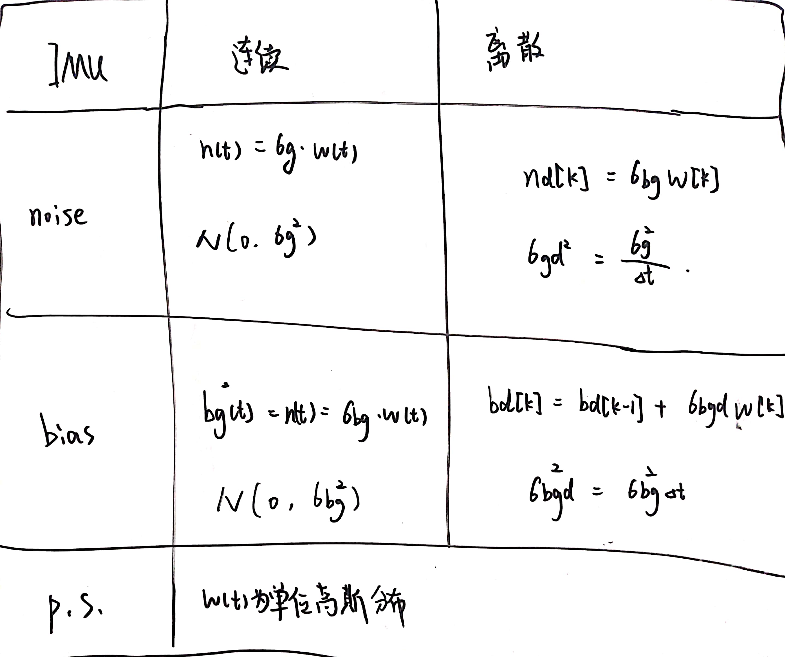

## 惯组IMU各种噪声参数的理解、设计导航系统示例

https://blog.csdn.net/chenshiming1995/article/details/109499578

文章目录
代码
一、噪声对于长波检测的影响
二、噪声模型
1）IMU惯组噪声参数定义
2）陀螺仪的噪声模型
3）Allan方差标定
4）设计卡尔曼滤波器系统
5）实际传感器参数理解
6）再次探索加噪声的过程
7）总结

### 代码

```matlab
clear all;
close all;

% data = load('data/SpiralStairs.mat');
% imu_data = data.imu_data';
data = dlmread('data.dat');
data = data(1:720000, 3:5);

Fs = 100; 
omega = data(:,1);

%% 生成数据
whiteNoise = 0.1 / sqrt(1/Fs);
walkNoise = 0.02 * sqrt(1/Fs);
omega = [];
count = 0;
walkBias= 0;
Bias = 1.3;
for t = 1/Fs:1/Fs:7200
   count = count + 1;
   walkBias = walkBias + walkNoise*randn;
   omega(count,1) = 0 + whiteNoise*randn + walkBias + Bias;
end
%%Bias Instability是什么玩意？

%% 
t0 = 1/Fs;
theta = cumsum(omega, 1)*t0;
maxNumM = 100;
L = size(theta, 1);
maxM = 2.^floor(log2(L/2));
m = logspace(log10(1), log10(maxM), maxNumM).';
m = ceil(m); % m must be an integer.
m = unique(m); % Remove duplicates.
tau = m*t0;
avar = zeros(numel(m), 1);
for i = 1:numel(m)
   mi = m(i);
   avar(i,:) = sum( (theta(1+2*mi:L) - 2*theta(1+mi:L-mi) + theta(1:L-2*mi)).^2, 1);
end
avar = avar ./ (2*tau.^2 .* (L - 2*m));
adev = sqrt(avar);
% figure
% loglog(tau, adev)
% title('Allan Deviation')
% xlabel('\tau');
% ylabel('\sigma(\tau)')
% grid on
% axis equal
% Find the index where the slope of the log-scaled Allan deviation is equal
% to the slope specified.
slope = -0.5;
logtau = log10(tau);
logadev = log10(adev);
dlogadev = diff(logadev) ./ diff(logtau);
[~, i] = min(abs(dlogadev - slope));
% Find the y-intercept of the line.
b = logadev(i) - slope*logtau(i);
% Determine the angle random walk coefficient from the line.
logN = slope*log(1) + b;
N = 10^logN;
fprintf('角速度白噪声(连续)(或者叫角度随机游走)的标准差N为:%f\n',N);

% Plot the results.
tauN = 1;
lineN = N ./ sqrt(tau);
figure
loglog(tau, adev, tau, lineN, '--', tauN, N, 'o')
title('Allan Deviation with Angle Random Walk')
xlabel('\tau')
ylabel('\sigma(\tau)')
legend('\sigma', '\sigma_N')
text(tauN, N, 'N')
grid on
axis equal


% Find the index where the slope of the log-scaled Allan deviation is equal
% to the slope specified.
slope = 0.5;
logtau = log10(tau);
logadev = log10(adev);
dlogadev = diff(logadev) ./ diff(logtau);
[~, i] = min(abs(dlogadev - slope));

% Find the y-intercept of the line.
b = logadev(i) - slope*logtau(i);

% Determine the rate random walk coefficient from the line.
logK = slope*log10(3) + b;
K = 10^logK;
fprintf('角速度随机游走(连续)(或者叫零偏不稳定性)的标准差K为:%f\n',K);

% Plot the results.
tauK = 3;
lineK = K .* sqrt(tau/3);
figure
loglog(tau, adev, tau, lineK, '--', tauK, K, 'o')
title('Allan Deviation with Rate Random Walk')
xlabel('\tau')
ylabel('\sigma(\tau)')
legend('\sigma', '\sigma_K')
text(tauK, K, 'K')
grid on
axis equal


% Find the index where the slope of the log-scaled Allan deviation is equal
% to the slope specified.
slope = 0;
logtau = log10(tau);
logadev = log10(adev);
dlogadev = diff(logadev) ./ diff(logtau);
[~, i] = min(abs(dlogadev - slope));

% Find the y-intercept of the line.
b = logadev(i) - slope*logtau(i);

% Determine the bias instability coefficient from the line.
scfB = sqrt(2*log(2)/pi);
logB = b - log10(scfB);
B = 10^logB;
fprintf('角速度零偏(或者叫bias、零偏)的标准差B为:%f\n',B);

% Plot the results.
tauB = tau(i);
lineB = B * scfB * ones(size(tau));
figure;
loglog(tau, adev, tau, lineB, '--', tauB, scfB*B, 'o')
title('Allan Deviation with Bias Instability')
xlabel('\tau')
ylabel('\sigma(\tau)')
legend('\sigma', '\sigma_B')
text(tauB, scfB*B, '0.664B')
grid on
axis equal
```

### 一、噪声对于长波检测的影响

### 二、噪声模型

#### 1）IMU惯组噪声参数定义

零偏（Bias）：可以理解为是输出减掉输入，一般指均值”：零偏的定义是传感器输出与标准输入之间的差值，零偏=实测陀螺数据-真值（≠均值），一般MEMS陀螺（高精度不可）使用短期静态下零输入时的输出均值近似表达静态下的零偏值，动态下零偏需要在转台上使用标准速率输入进行标定拟合。

零偏稳定性（Bias stability，In-Run Bias Stability）：衡量在一次上电过程中，零偏的变化，单位大多为°/h。是陀螺最为重要的指标，工程上常用一段时间采样平均值的标准差来衡量。但是平滑时间是不固定的，如果是光纤陀螺，平滑时间通常为10s，如果是激光陀螺，平滑时间通常为100s（注1），MEMS的平滑时间为10s。它体现的是陀螺仪的综合性能。

零偏不稳定性（Bias instability）：单位大多为°/h，这个参数是用Allan方差计算的，是Allan方差的最低点，与陀螺的零偏稳定性单位相同，但是二者的数值没有固定的关系。

零偏重复性（Run-Run Bias Stability）：单位大多为°/h，是衡量每一次陀螺上电的零偏的变化，测试时注意每一次上电之间的间隔要大一些，10-20min比较稳妥。

角度随机游走（Angular random walk，ARW）：利用Allan方差来计算，单位为°/√h。工程上可以理解为衡量陀螺白噪声方差的一个量，二者有一定的换算关系。

速率噪声密度（Rate Noise Density，RND）: 利用Allan方差来计算，单位为°/sec/√Hz。工程上可以理解为衡量陀螺白噪声方差的一个量，与角度随机游走相同二者有一定的换算关系。

角速度随机游走（Rate Random Walk，RRW）：利用Allan方差来计算，单位为 °/ (h)^1.5。陀螺的角速率输出随着时间缓慢变化，通常由系统误差引起，比如环境温度的缓慢变化。可以用来衡量零偏的变化规律。

一般的陀螺仪也不会给出角速度随机游走，其实可以暂时不用考虑这一项。重点是除了角速度的白噪声之外，考虑bias 不稳定性，可以通过跟踪bias的方法去对噪声进行估计。

那么怎么从零偏稳定性到零偏不稳定性呢？真的需要这个准确的量吗？应该理论上来说这些参量都是用来评价陀螺仪的性能的，并不需要直接使用这些数值进行设计惯导系统。并且在实际系统中，这些理论值只能作为调参数的参考值。


#### 2）陀螺仪的噪声模型

陀螺的随机噪声里包含零偏不稳定导致的低频噪声，高频白噪声（导致角度随机游走），以及角加速度白噪声导致的角速率随机游走噪声，只需要考虑这三个噪声量即可。

因此一个陀螺的噪声通常可以简化成为如下
$$ \Omega(t)=\Omega_{\text {Ideal}}(t)+\operatorname{Bias}_{N}(t)+\operatorname{Bias}_{B}(t)+\operatorname{Bias}_{K}(t)$$

使用长时间静止的陀螺仪数据对陀螺仪噪声参数进行分析，上式中，三个噪声参数N（角度随机游走）（备注：角速度的白噪声，积分出来的角度就是随机游走），K（速率随机游走）和B（bias不稳定性）（或者叫零偏不稳定性）。他们的单位分别如下，都可以通过Allan方法标定。

+ 白噪声：deg/h^0.5

+ 零偏不稳定性：deg/h

+ 角速度随机游走：deg/h/h^0.5

> 零偏稳定性是陀螺给出的参数，但是零偏不稳定性是可以标定出来的值，这是两个的重要区别。

这里的噪声参数都是标准差的形式，并且都是针对于连续信号。那么在对信号进行采样时，会有采样率fs、采样间隔1/fs。将信号离散化，信号的噪声的功率（标准差）也会发生变化。参考1，两者有如下关系：



因此也可以表示为：


下面以随机游走噪声为例：（白噪声相类似）


因此，随机游走噪声的分析得分两个过程：

离散到连续的转化
随时间增长的变化：随机游走噪声的方差与时长成正比

#### 3）Allan方差标定

allan方差标定很简洁有效，但是没办法标定出常值偏差。具体加噪见代码，可以直接标定出三个重要的量，单位是deg/s。

下面的噪声只有白噪声和角速度随机游走，但是在标定中依然可以标定出bias不稳定性。（斜率为0的曲线）

角速度白噪声(连续)(或者叫角度随机游走)的标准差N为:0.099985
角速度随机游走(连续)(或者叫零偏不稳定性)的标准差K为:0.019042
角速度零偏(或者叫bias、零偏)的标准差B为:0.072457

那么这是为什么呢？

零偏不稳定性误差是一种介于高斯白噪声和维纳过程之间的噪声，它的功率谱密度和 1/f成正比。这种噪声是由某些电子原件的特性造成的，是一种物理上存在的噪声，并且在极低频率下通过测量仍然满足和1/f成正比的特性。

零偏不稳定性是一种非静态噪声，可以理解为高斯白噪声和维纳过程的混合。直观上理解，零偏不稳定性误差会使陀螺仪和加速度计的零偏随时间慢慢变化，逐渐偏离开机时校准的零偏误差；同时还会造成一部分随机行走误差的效果。陀螺仪零偏不稳定性误差的单位一般是 deg/h ，加速度计一般是 。文献 [3] 和网络上的一种说法是它表示在一段时间内零偏的变化量，但这种理解在理论上并不准确，而且一般厂商也不会说明“一段时间”究竟是多久。

另外下面一段话解决了相应的困惑：


那么实际情况下，零偏不稳定性和角速度随机游走角度随机游走这些量都混合到了一起，所以标定时还是可以看到“零偏不稳定”的结果。

#### 4）设计卡尔曼滤波器系统

下面就是设计卡尔曼滤波系统，主要参考链接https://zhuanlan.zhihu.com/p/76987454。

其中P是随意的，观测协方差矩阵R也是和观测噪声相关比较直观。需要确定的就是过程协方差Q矩阵。这里的卡尔曼滤波器只考虑角度随机游走，（也就是角速度的高斯白噪声）。那么怎么确定相应的Q矩阵呢？


这里可以看出是对噪声进行求导？获得雅可比矩阵？得到结论：不是对角速度进行微分求导雅可比矩阵，而是对噪声进行求导计算雅可比矩阵，但是两者没啥区别吧。

#### 5）实际传感器参数理解

+ 采集低通滤波前的数据，带有相应的噪声的。为什么需要去移变，他的目的是什么？

+  采集数据然后进行标定

标定结果如下：

```matlab
角速度白噪声(连续)(或者叫角度随机游走)的标准差N为:0.000322
角速度随机游走(连续)(或者叫零偏不稳定性)的标准差K为:0.000000
角速度零偏(或者叫bias、零偏)的标准差B为:0.000386
```

这样看来并不是准确的。

#### 6）再次探索加噪声的过程

下面用simulink加噪，然后对比allan的结果：


（噪声分别设置为K=0.05,N=0.03，加的是方差）

```matlab
角速度白噪声(连续)(或者叫角度随机游走)的标准差N为:0.029980
角速度随机游走(连续)的标准差K为:0.048709
角速度零偏(或者叫bias、零偏)(或者叫零偏不稳定性)的标准差B为:0.062460
```


与理论上设置的误差还是很吻合的，不过依然会有一个零偏不稳定性，这一点值得注意。

加上二阶低通滤波器之后计算出来的噪声系数不会发生改变，但是信号的噪声的带宽会发生变化。滤波之后的频谱如下：


滤波前为：（滤波器的截止频率为12.5Hz）


信号始终都会有一个低频的量存在，这是因为做FFT实际上只能选择有限点数，就相当于增加一个一个矩形窗函数。说明加上滤波器之后只会改变信号的带宽，但是不会改变信号的噪声系数。

#### 7）总结

一般来说，陀螺仪的误差模型考虑成下面的形式：


分别代表了陀螺仪测量的白噪声n和随机游走b，其中随机游走也可以认为是零偏。

假设陀螺仪只有白噪声$$n(t)$$，那么用陀螺仪的数据计算角度就相当于积分$$\int_{t}^{t+\Delta t} n(t) \mathrm{d} t$$,那么角度随机游走（维纳过程/白噪声的积分）可以表示为 $$\sigma_{\mathrm{n}}^{2} \Delta t$$，

其中$$\sigma_{\text {n }}$$就是参数表中说的“角度随机游走或者Noise Density ”。这也说明了维纳过程的方差与时间成正比（这是一个很重要的规律），那么白噪声的$ n(t)的 方 差 可 以 表 示 为 的方差可以表示为的方差可以表示为\sigma_{\mathrm{n}}^{2} / \Delta t$。

假设现在陀螺仪有了角速度随机游走噪声，那么该项会导致陀螺仪信号产生随机游走。可以表示成下面的形式：
$$b_{k+1}=b_{k}+w_{k} \quad w_{k} \sim N\left(0, \sigma_{b}^2\right)$$

这个实际上是对白噪声的积分过程。我们通过allan方差可以分析到下面几个量：

+ 角度随机游走
+ 速率随机游走
+ 零偏
  下面的参数表可以更加直观的表示关系：


在导航系统的设计中，对于Q的选择可以用kalman参数选择作为参考，然后再进行调整，设计导航系统参考https://zhuanlan.zhihu.com/p/76987454，但是这个量只能作为一个参考。

但是根据这一点是不是可以得到一个结论：当采样率变大的时候，信号的连续方差没变化，但是离散噪声方差$$\sigma_{n}/\sqrt{\Delta t}$$会变得很大，信噪比变得很低？