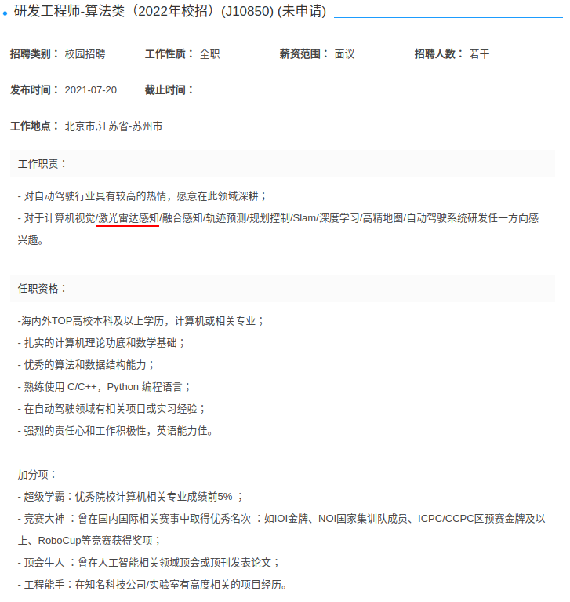

## 1.大疆车载==7.6到8.11==

https://we.dji.com/zh-CN/position/detail?positionId=1412238815588519936

`内推码：UJ8YFPM3`

7.6到8.11

## 2.图森未来

https://app.mokahr.com/campus_apply/tusenweilai/3232#/

## 3.滴滴[==6.30实习截止==]

https://app.mokahr.com/campus_apply/didiglobal/40516#/job/cbab0580-909d-4e4d-b854-c47e3d8ac4e1

## 4.阿里

https://talent.alibaba.com/campus/

## 5.蔚来==8.15==

https://campus.nio.com/campus_apply/nio888/36824/#/

**内推码:**

KeDkmE

## 6.小马智行

https://app.mokahr.com/campus_apply/pony/2735#/

## 7.元戎启行

## 8.海康威视[有内推8.31]

`内推码:TT382P`

https://campushr.hikvision.com/JobDetails.html?id=b626b22584f0407ab92307f5165d87e2&type=0

## 9.小米

## 10.赢彻科技

## 11.华为==offer==

## 12.360

## 13.理想

https://app.mokahr.com/campus_apply/chehejia/40949#/job/272a6d7f-6026-42b6-8bbc-f89d5383dac4

## 14.小鹏

NTAGyJa

https://app.mokahr.com/campus_apply/xiaopeng/22#/job/f6383b8e-a979-4f6e-9e4a-bc6ab9da0cca

## 15.商汤==offer==

内推码:umghlk

https://hr.sensetime.com/SU604c56f9bef57c3d1a752c60/pb/posDetail.html?postId=60e65a992f9d2456451c0729&postType=campus

## 16.智加

https://app.mokahr.com/apply/plus/38772#/job/b0df7a2f-9f23-4490-967e-44ed851efc1e

## 17.毫末智行

https://wecruit.hotjob.cn/SU612068f50dcad4106f0e563a/pb/posDetail.html?postId=6115473dbef57c653309f9e7&postType=campus

## 18.momenta==[8.15]==

有内推

https://momenta.zhiye.com/zpdetail/620530563

Lidar感知算法工程师

工作职责：
1.参与自动驾驶Lidar感知算法设计和开发，包括但不限于3D目标检测、分割、跟踪；
2.参与Lidar感知算法在不同级别自动驾驶产品中的落地与优化。

任职资格：
1. 深刻理解深度学习，有独立分析问题、定位问题、解决问题的能力；
2. 出色的编程能力，熟悉C++或Python；
3. 要有不唯上、不唯书的独立思考精神，从自动驾驶的真正需求出发，有抛开学术界标准范式，重新定义问题的勇气和魄力；
4. 有相关方向的顶会、顶刊论文发表加分，有国际竞赛获奖经历加分；
5. 有大型工程项目落地经验、优秀开源项目开发经历优先。

## 19.美团==[10.14]==

+ 北斗计划
+ ****

## 20.Autox

## 21.百度==[08.26]==

## 22.吉利

https://job.geely.com/hcm-web/#/job-detail/societySpecial/682594/9

## 23.禾赛

## 24.轻舟智航

内推码:

`NTAF7g9`

https://app.mokahr.com/campus_apply/qcraft/27173#/job/ffb2d44a-45d4-464b-8404-e33d3684e22f

## 25.速腾聚创[-9.15]

https://app.mokahr.com/campus_apply/robosense/40975#/job/3bc535ee-0442-404a-b54f-314e1dac05f0

## 26.新石器无人车

https://www.neolix.cn/joinus.html

hr@neolix.cn

## 27.地平线==[08.31]==

http://horizon.hotjob.cn/wt/Horizon/web/index/webPositionN310!getOnePosition?postId=129716&recruitType=1&brandCode=1&importPost=0&columnId=1

## 28.京东[10.27]

http://campus.jd.com/#/details?id=1510

`内推码:BXF6`

## 29.畅行智能

## 30.博世中国

## 31.奥比中光==[8.15]==

## 32.纵目科技

