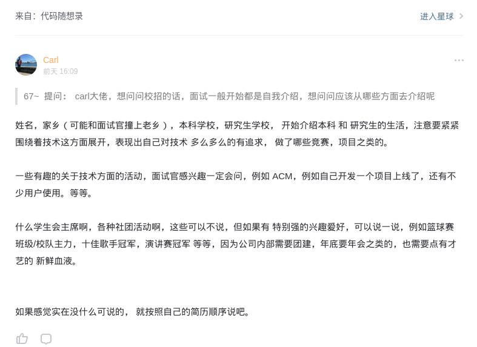

我叫沈万成,来自江苏徐州,本科就读于中国矿业大学,然后保研到国防科技大学无人车实验室读研究生.

我在本科加入了大学生创新训练中心后,开始接触到机器人和无人驾驶方面的知识,在大三时和同学一起制作了一个基于Arduino的循迹避障小车,本科毕设做的是基于车载视频的行人检测,分别使用传统方法和基于深度学习的方法进行了实验.

研一主要是专业课程的学习,在研一下学期末尾开始逐步接触到实验室的一些项目,在这一年的时间中,通过与实验室同学和工程师的合作，我从对无人车的硬件和软件都有了更系统的认识,对建图,定位,感知,规划,决策,控制这些无人车模块有了或多或少的了解,也学习了ros的使用,同时也看到了无人驾驶发展中遇到的种种困境；

我主要做的工作是基于激光雷达的环境感知,掌握激光雷达的标定,点云数据的读取,基于地面分割的可通行区域检测,点云聚类以及特征提取,基于此实现车辆以及行人的检测和跟踪,环境中动态目标的检测.

我们发现对高精度地图的依赖太过强烈，但是高精度地图有时候并不是必需的，我们实验室这几年一直尝试在做一种类人导航的方式去引导无人车，目前有了一个视觉初版方案

