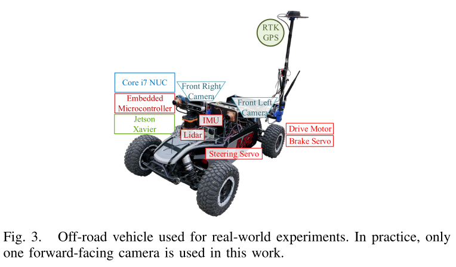
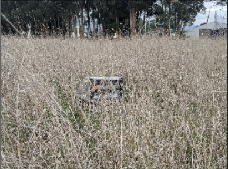

## 0.强化学习类脑导航框架

+ 类脑导航算法的计算框架，在该框架下描述并详细论述了类脑导航算法的网络模型的设计，包括感知模型、记忆推理模型和规划决策模型；以及网络模型的训练，包括学习算法和经验生成

+ 经验生成+智能体+学习算法

+ 感知+记忆推理+规划决策

  感知模型要利用机器视觉领域优秀成果，尝试用辅助任务优化强化学习训练以适应非静态导航问题；

  记忆推理模型应使用有记忆能力的神经网络，复杂的记忆结构或机制对导航至关重要

  

  

## 1.Self-Supervised, Goal-Conditioned Policies for Navigation in Unstructured Environments

2020

> 赋予了机器人两种比较高级的人类导航能力:
>
> 1.看到一个场景,可以找到"路",知道哪里可以安全行驶的能力,类似探索能力，人类的直觉（环境理解）
>
> 2.在1的基础上 增加目标点信息, 可以安全行驶到目标点的能力

问题：

1.实际规划时需要事先提供waypoints吗？

2.怎样采集训练数据并进行训练?

3.系统架构，网络结构是怎样的？

答案：

1. waypoints 需要事先提供，是里程计坐标系下的goal-point？论文中关于waypoints 描述的不是很清晰
2. 分为两部分
   1. non-goal-conditioned：图片+IMU加速度
   2. goal-conditioned：在采集图片的同时记录轨迹数据，对于每个训练mini-batch，从数据集的轨迹中随机选择一组轨迹和这些轨迹内的时间戳。 每个采样的item都与未来的某个时间戳（仅限于确保目标不会太远）随机关联，这被解释为一个目标。
3. 没有说自监督是怎么训练的，两部分网络是怎样训练的也没有说
4. 

​		==这个图片很多条轨迹是怎样生成的也没有说。。。==

### 1.introduction

我们的方法从学习一种非目标条件但安全的导航策略==开始==，该策略寻求更好的地形特征或科学上理想的观测结果。

通过自监督强化学习或者行为克隆,机器人可以按照期望的行为安全行驶,但是它无法到达特定的目标点

使用 hindsight relabel ,通过 goal-seeking行为来增强这类策略，从而解决这个问题

使用non-goal-conditioned policy进行探索，并使用一个视觉里程计记录轨迹，得到一个由图像、动作和位置组成的数据集，

把记录的轨迹分成若干段，每一个分段的终点位置作为这段数据的goal waypoint

然后使用这些goal_direced的分段数据来训练一个  goal-conditioned navigation policy

### 2.BACKGROUND AND RELATED WORK

这篇论文建立在 基于传感器的导航技术、模仿学习、强化学习 的基础上

非结构化的环境经常呈现独特的导航挑战，包括对环境的不完整认识，噪声对环境的反应干扰，识别自由空间，推断可通行地形。

常用的做法是先语义分割，然后路径规划，但是语义分割很难分出来可通行的区域

> swc:即使是使用lidar进行地形估计, 根据不同的环境也需要设置不同的阈值来判定是否为可通行区域

一种方法是使用专家演示(expert demonstrations)来推断可通行的类(r监督,无监督的方法来分割可通行区域)

#### Imitation Learning:

模仿学习

直接根据输入图像预测 动作（行为模仿）

一些作者也把模仿学习作为一种==识别环境中自然路径==的方法

这类方法采集数据的方式：

>通常，一个摄像头直接对准道路，另外几个摄像头安装在偏移位置[14,22]。这样，捕捉到的图像就可以自动标记为机器人应该采取的相应行动，以及转向路径。

#### Reinforcement Learning:

强化学习

在强化学习中，机器人通过==最大化一组状态-动作对的期望奖励==来学习导航策略。

这些方法可以分为model-free 和 model-based 的

VPNs

GCGS（也是本文团队?）

作者之前的一篇论文使用此类方法添加对于地形粗糙度的预测，从而用于非结构化场景中的导航

#### Goal-Conditioned Navigation

有目标点条件下的导航

在典型的导航学习场景中，往往只考虑一个单一的任务，例如沿着车道行驶或驶向一个固定的目标，我们还想考虑目标点制约的策略。

==条件模仿学习==在过去的几年得到了广泛的研究

它与 ==目标强化学习==由许多联系，尤其在 批处理案例 中；

#### Self-Supervised Learning

自监督学习

相关工作：

1.直接从无监督或最小标记的惯性测量单元(IMU)数据 学习地形分类和控制政策选择

2.使用记录的力扭矩信息来标记地形数据

我们的工作接近于信息路径规划的动机,这类方法在基于边界探索的同时 需要估计周围环境的地图

相反，我们的工作不假设地图，因为它不需要在地图中执行探索开发，因为它直接使用反应性策略，而不是由感知、地图、路径规划和跟踪组成。

### APPROACH

我们的系统设计的目的是从通过自监督学习训练的较低层次策略中提取出一个对导航有用的导向目标的策略。

我们设计的目的是让高水平的行为，如相关的科学数据收集或路径点跟随，和谐地建立在低水平的行为之上，如避障。

尽管我们的方法足够灵活，适用于行为克隆策略，==在本节中，我们将重点关注用于越野导航的自我监督学习的模型。==

#### A. Model Overview

我们首先从非目标条件下的深度学习开始,在固定视界上==预测地形粗糙度和碰撞概率的模型==,网络结构和GCGS类似,GCGS以前被证明在短期控制情况下可以产生良好的表现.

网络结构:

输入:

1. 历史4张图像 $S_t$     -> 前半部分网络的输入
2. 控制命令序列$a_t,a_{t+1},...a_{t+H-1}$       ->  后半部分网络(LSTM)的输入
3. 目标信息 $g_t$

输出:

$y_t\in C$预测地形的类别,C:   0代表完全的光滑,数字越大代表地形越粗糙,|C|-1代表障碍物

该体系结构在假定标签之间的条件独立性的情况下，对地形类别的联合概率进行建模

交叉熵+L2正则化进行训练

#### B. Planning

规划是通过==最大化==规划范围内的预期回报来执行的。

每一种地形类别都有一个奖励值（reward），光滑的地形得分最高，障碍物的得分为0

使用随机 K-shooting 方法在每个时间步长生成一组随机的 K 个动作 rollouts（轨迹）

每个轨迹的预期累积奖励是每个预测地形类别的单个奖励的总和。

我们的策略应用具有最高感知奖励的轨迹中的第一个动作。

以 MPC 方式在每个时间步重复规划，以补偿建模错误。

#### C. System Overview

系统组成：

嵌入式微控制器

工控机

前视相机：采集数据

Lidar：激光雷达仅用于执行短距离碰撞检测并充当碰撞传感器并测量障碍物的瞬时存在。

IMU：测量地形的粗糙程度

> 测量机器人 IMU 在 60 Hz 下收集的 20 个样本的短时间窗口上报告的均方根 (RMS) 线性加速度，来估计经过地形的瞬时粗糙度分数

#### D. Hindsight Relabelling

为了训练goal-conditioned model，我们通过允许机器人使用非目标条件地形模型进行探索，同时记录相对姿态来生成位置感知数据集location-aware dataset。

这些轨迹被分解为用于导航任务的示例：机器人应该执行哪个动作才能到达特定位置？

使用与`<<Hindsight experience replay>>`中类似的方法从采集的轨迹中采样目标点goals:

> 对于每个训练mini-batch，从数据集的轨迹中随机选择一组轨迹和这些轨迹内的时间戳。 
>
> 每个采样的item都与未来的某个时间戳（仅限于确保目标不会太远）随机关联，这被解释为一个目标。

在与hindsight relabelling重新标记的目标相关联后，可以应用于goal-conditioned network的训练元组的格式为

$<s_i,g_i,\hat a_i>$其中 $s_i $是图像状态，$g_i$是相对目标，$\hat a_i $是 所采取的行动。

#### E. Goal Conditioning

我们提出的目标条件导航策略是通过使用相对于机器人当前帧的way_point   gt 来增强非目标条件地形预测模型来实现的

> non-goal-conditioned terrain prediction model + input waypoint $g_t$

输入目标点向量在与图片卷积层的输出相乘之前先通过一个全连接层（见网络结构图）

在实践中，我们假设我们的方法可以在无法访问全局位置坐标时使用。 因此，我们使用机载状态估计（例如 IMU、GPS 或视觉里程计）来计算相对于机器人起始位置的相对偏移量。

### IV. EXPERIMENTS

我们创建了训练轨迹并从均值 ≈28 m 和标准差 ≈13 m 的正态分布中采样了连续的waypoints。

+ non-goal-conditioned model： 在光滑地面上行驶的比例增加了
+ goal-conditioned model：在避障+光滑地面行驶的前提下，可以到达目标点

## 2.Learning to Drive Off Road on Smooth Terrain in Unstructured Environments Using an On-Board Camera and Sparse Aerial Images

2020

> Self-Supervised, Goal-Conditioned Policies for Navigation in Unstructured Environments
>
> 中 进行地形粗糙度估计和避障的方法

**问题:**

1. 有没有说明图片中很多条预选路径是怎样生成的？
1. 导航时需要提供目标点吗，是在探索吗？
1. 系统结构，网络结构是怎样的？
1. 怎样生成训练数据，怎样训练？
1. 预测出的地形粗糙程度是怎样表现的？按像素进行分割？分类问题？

**回答：**

1. 没有说明
2. 没有说明
3. 看下文
4. 看下文
5. 好像是一个分类问题，但是涉及到强化学习，不太确定

### I. INTRODUCTION

在本文中，我们提出了一个学习导航的系统优先选择平滑地形（见图 1），在自然、非结构化环境中使用车载摄像头和稀疏航拍图像进行越野驾驶的策略。 

然而，==本文的重点不是道路分类本身，而是提出一种在线自适应自监督学习方法==，用于在崎岖地形中进行越野驾驶，并探索空中和第一人称（地面）的合成，在这种情况下进行感知。

在训练时，使用IMU来估计地形的粗糙度，使用一个短距离lidar来测量障碍物

为了或得更加丰富的视觉信息，使用前视相机和无人机航拍融合，添加航拍图像提高了预测性能，尤其是在存在急转弯轨迹或视觉障碍的情况下。

### II. RELATED WORK

#### A. Imitation Learning for Visual Navigation Learning

1989年就有了行为克隆的研究， 使用网络，输入视觉信息，直接输出转角等控制量

End to end learning for self-driving cars： 

使用人类演示从单个前置摄像头预测转向角。 从左侧和右侧的摄像机收集额外的训练图像，以描述车辆偏离航线时的恢复情况。 这些图像的标签分别调整为向右和向左。

**一些研究人员通过跟随follow自然或人造路径探索了森林和非结构化环境中的自主导航**

> A trail-following robotwhich uses appearance and structural cues：
> 使用立体相机和激光雷达的外观和基于结构的模型来预测最可能的路径

一些人把路径导航问题看做是图片分类问题

> A Machine Learning Approach to Visual Perception of Forest Trails for Mobile Robots

使用左中右三个相机采集数据进行训练

图像标有所需的偏航动作，其中左偏移和右偏移摄像机用于描绘学习者偏离专家路径时的情况（前向图像标记为零偏航角，而左右图像分别标记为右偏航角，左偏航角）。 然后使用 MAV 验证 DNN 以自主导航森林小径。

本文团队之前的一篇工作

> Visionbased autonomous underwater swimming in dense coral for combined collision avoidance and target selection

使用行为克隆，预测yaw 和 pitch 两个角度，引导水下机器人无碰撞的到达感兴趣区域

多次部署期间反复标记、训练和评估我们的基于图像的控制器，直到机器人达到可接受的性能

#### B. Semantic Segmentation for Terrain Traversability 

在存在不同地形的情况下，一种常见的视觉导航方法是两步走，视觉语义分割，然后是几何路径规划。

#### C. Air-Assisted Ground Vehicle Navigation

有的工作是使用航拍图来进行地形预测

#### D. Sensor Fusion

### III. PRELIMINARIES

#### A. Reinforcement Learning

强化学习

#### B. Value Prediction Networks and Generalized Computation Graphs

Value Prediction Network

结合了有模型和无模型的强化学习方法

Khan等人提出了一个和VPN相似的网络

> Self-Supervised Deep Reinforcement Learning with Generalized Computation Graphs for Robot Navigation

被称为Generalized Computation Graphs (GCG)，用于在短预测范围内避免碰撞的任务

### IV. MODEL OVERVIEW

#### A. Representation

我们提出了一个深度学习模型来预测固定规划周期（H个时间步长）内的地形粗糙度和碰撞概率，在这个规划周期内进行规划以得出行动策略。

使用和GCG类似的结构

该模型对输入==图像状态==$s_t$和==转向命令==的动作序列进行操作

图像状态包括当前帧图像和过去历史M帧图像

对于这个输入序列，模型预测规划周期内每个地形分类的概率

$y_t\in C$预测地形的类别,C:   0代表完全的光滑,数字越大代表地形越粗糙,|C|-1代表障碍物

油门被假定为常数，因此不存在于动作空间中；

该体系结构在假定标签之间的条件独立性的情况下，对地形类别的联合概率进行建模

在价值预测网络VPN的背景下，预测的地形标签充当奖励值。 为了对更理想或更平滑的地形类别实施更高的奖励，我们将标签重新映射到奖励值：
$$
r_t=|C|-1-y_t
$$

#### B. Network Architecture and Objective Function

图像状态$s_t$通过卷积层形成LSTM的初始隐藏状态

转向动作$a_t$和预测的地形类别概率$p(\hat y_{t+1})$构成RNN的输入-输出对

**损失函数：**

实例化的网络：

M=4

单张图像是$72*128*3$

4张图像拼接在一起是$72*128*12$

使用四层卷积层，卷积核数量、大小、步长：

（32，64，64，64）

（8x8,4x4,4x4,3x3）

(4,2,2,1)

#### C. Planning

在规划阶段，我们想要解出在 H 的规划周期内最大化预期奖励的行动轨迹

为了求解这个优化问题，使用随机k-shooting 方法

K 个动作 rollout 是随机生成的，每第 k 个 (1 ≤ k ≤ K) rollout

使用我们学习的模型进行评估以预测预期的累积轨迹奖励

我们的策略应用具有最高感知回报的轨迹中的第一个动作。

 遵循模型预测控制范例，计划在每个时间步长重复。

### V. SYSTEM OVERVIEW

许多工作已经考虑使用 IMU 来测量道路粗糙度 。 类似地，我们测量机器人 IMU 在短时间窗口内报告的均方根 (RMS) 线性加速度，以近似穿越地形的瞬时粗糙度分数。

### VI. EXPERIMENTS

#### A. Simulation

仿真环境

**1.Data Collection:**

数据采集和训练是Off-Policy

我们发现在每个时间步应用随机探索动作会产生过度卡顿和多样性不足的轨迹

相反，从高斯分布中抽取随机时间间隔，在此期间应用随机、均匀采样的转向动作并保持恒定。

在此间隔期间的每个时间步长中，对动作应用了额外但很小的高斯噪声。 这个过程被反复重复

收集了大约 75,000 个样本，相当于约 3.5 小时的驾驶时间，地形真值和碰撞标签直接从仿真环境中查询得到；

**2.Off-Policy Training**

off-policy:强化学习术语

短期预测似乎准确率更高

**3.On-Policy Evaluation**

#### B. Real-world Field Trials

**1.Data Collection**

采集的训练轨迹数据包括：

图像，与图像对应的航拍图，标记好的地形类别和转向动作

每次经过0.35m采集一次数据，并不是固定的时间间隔采集一次数据，使用这种采样方法是为了减轻由于电池电压耗尽等因素导致的无意速度变化。

规划周期 H=16

==地形标记遵循纯粹的自监督方法==

测量了 IMU 垂直于地平面的方向上的 RMS 线性加速度值，IMU频率是60HZ，一个采集窗口采集20帧数据

通过傅里叶变换获得这个短窗口信号的频率表示，然后将幅度分量放入除以频率的 15 个 bin 直方图中。

直方图用来做一个特征向量，经过K-Means聚类处理生成标签？

车载激光雷达用于标记障碍物并在发生物理碰撞之前先发制人地停止车辆

**2.Training and Evaluation:**

## 3.BADGR: An Autonomous Self-Supervised Learning-Based Navigation System

2021

前面两篇论文读的不是很明白，难道是因为不了解自监督和强化学习吗？

希望这篇文章有所收获

赋予无人车的能力:

> 1.导航到目标点
>
> 2.避障
>
> 3.优先行驶在更平坦的地面上
>
> 4.随着学习的增加,导航能力越来越强

**问题：**

1. 需要提供waypoints吗，是否有里程计存在？
2. 文中图7中  发散的各个待选轨迹是怎样生成的？是有很多轨迹点组成的吗？
3. 系统的输入输出？输入的一系列未来动作是固定的一个集合吗？
4. 训练数据怎样生成？

**回答：**

1. 只使用GPS作为全局坐标,在导航时需要提供目标点的GPS坐标
1. 没有说明,猜测是根据模型输出的K个动作画出来的,需要看代码确定
1. 输入:图片+未来动作,未来动作的含义需要代码确定
1. 随机游走,使用lidar和imu判断障碍物和崎岖地面,没有仔细说

在这项工作中，我们研究如何使用一种从经验中学习物理导航可供性的方法来超越这些纯粹基于几何的方法

BADGR 可以在具有几何分散的障碍物的现实世界城市和越野环境中导航，它还可以结合地形偏好，泛化到新环境，并通过收集更多数据继续自主改进。

### I. INTRODUCTION

> 赋予无人车三种能力
>
> 1.避障
>
> 2.优先行驶在更平坦的地面上
>
> 3.随着学习的增加,导航能力越来越强

移动机器人的导航通常被认为主要是一个几何问题，其目的是构建环境的局部或全局地图，然后通过该地图规划路径。

缺点：

开放世界的移动机器人导航通常会带来一些挑战，而这些挑战很难用纯粹的几何世界观来解决

比如这种比较高的草，纯几何会认为这是障碍物，但实际上是可通行的；

传统上，导航问题的这些方面是从语义理解的角度来解决的，使用在人类提供的可通行或路面标签上训练的计算机视觉方法，

然而，可通行性、颠簸性和其他与移动性相关的属性是**环境的物理属性**，原则上机器人可以通过经验学习，无需人工监督。

==在本文中，我们研究了从经验中自主、自我监督的学习如何使机器人能够使用原始视觉感知而无需人类提供的标签或几何地图来了解其环境中的可供性affordances。==

我们不是使用人类监督来教机器人如何导航，而是研究如何通过机器人自己过去的经验提供回顾性的自我监督：对于许多物理上显着的导航目标，例如避免碰撞或在崎岖不平的地形上更喜欢平稳，机器人可以自主衡量它实现目标的程度，然后**回顾性地标记之前的经验**，以学习这些目标的预测模型。

==例如，通过经历碰撞和崎岖地形，机器人可以学习，给定观察结果和未来动作的候选计划，哪些动作可能导致地形崎岖或平坦，哪些动作可能导致碰撞。==

==这实际上构成了一个自监督的多任务强化学习问题==

基于这个想法，我们提出了一个完全自主、自我改进、基于端到端学习的移动机器人导航系统，我们称之为 BADGR；

==BADGR 通过在现实世界环境中收集off-policy数据（例如来自随机控制策略的数据）来工作，并使用这些数据来训练模型来预测未来的相关事件，例如碰撞、位置或地形属性，给定当前传感器读数和记录的未来执行动作==

使用此模型，BADGR 可以规划未来并执行避免某些事件（例如碰撞）的操作，并主动寻找其他事件（例如平滑地形）。

BADGR 构成了一个完全自主的自我改进系统，因为它收集数据，以自我监督的方式标记数据，训练预测模型以进行计划和行动，并且可以自主收集额外的数据以进一步改进自身。

虽然我们用于构建 BADGR 的特定组件借鉴了先前的工作 [8, 9]，但我们首次证明基于这些组件的完整系统可以推理几何和非几何导航目标，从off-policy中学习，不需要任何人工标记，不需要昂贵的传感器或模拟数据，可以通过自主收集的数据进行改进，并在现实世界环境中工作。

### II. RELATED WORK

自主导航的主要方法是让机器人构建地图，在地图中定位，并使用地图来规划和执行使机器人能够到达目标的动作。

这种同步定位和地图绘制 (SLAM) 和规划方法 [1] 取得了令人瞩目的成果，是当前最先进的自主导航技术的基础，但是这类方法仍然存在一些局限，例如无纹理场景中的性能下降，需要昂贵的传感器，以及——最重要的是——==不会随着机器人在世界上的行为而变得更好==

基于学习的方法通过从数据中学习的方法有很大的希望可以解决这些局限；

1. 一种对SLAM这类方法的改进是直接估计场景的几何形状，然而，这些方法的局限性在于几何图形只是环境的部分描述，只学习几何会导致意想不到的后果，例如认为一片高大的草地是不可穿越的
2. 基于语义分割的方法，给输入传感器数据打上语义标签，例如：平坦、崎岖等，然而，这些方法通常依赖于现有的 SLAM 方法或人类来提供语义标签，这意味着这些方法要么继承了几何方法的局限性，要么不能自主自我改进。
3. 基于模仿学习的方法，也是依赖人类进行专家演示，不构成一个不断自我完善的系统
4. 端到端 强化学习，本文使用的方法，改进了之前一些方法的不足

与BADGR很相似的工作是 GCG 和 CAPs，但是GCG只学习怎样去避障，CAPs需要监督信息才能避障

### III. BERKELEY AUTONOMOUS DRIVING GROUND ROBOT(BADGR)

BADGR 通过在现实世界环境中自主收集大量off-policy的数据来运作。

使用这些数据，BADGR 以==自我监督==的方式标记相关事件（例如碰撞或崎岖地形），并将这些标记的事件添加回数据集。 

然后，BADGR 训练一个**预测模型**，该模型将当前观察结果（例如摄像机图像）和未来动作序列（例如线速度和角速度命令）作为输入，并预测相关的未来事件。

在部署经过训练的 BADGR 系统时，用户设计一个奖励函数，根据这些相关事件对他们希望机器人完成的任务进行编码——==例如在避免碰撞和崎岖地形的同时达到目标==——然后机器人自主规划和执行==使该奖励最大化的行动==。

为了构建基于自监督学习的导航系统，我们必须假设机器人可以进行回顾性监督，==retrospective supervision==

这意味着机器人必须能够体验诸如碰撞之类的事件，然后学会在未来避免（或寻找）此类事件；

因此，做出以下假设：

1. 机器人只能学出来它所经历的事件，并且这些事件可以使用板载传感器进行测量
2. 经历这些事件，即使是碰撞等不被期望的事件也是可以接受的

#### A. Mobile Robot Platform

通过指定所需的线速度和角速度来控制机器人，这些线速度和角速度用作低级差动驱动控制器的设定点。

安装的传感器：

1. 6D IMU
2. GPS：用于全局位姿估计
3. 码盘：测量车轮速度
4. 两个前置的170视角的640x480的相机
5. 2D lidar
6. 指南针

工控机：TX2

一块SSD硬盘，每分钟1.3GB

#### B. Data Collection

#### B. Data Collection

我们设计的数据收集方法能够在最少的人工干预下收集大量不同的数据进行训练。

当设计数据采集策略时==第一个需要考虑的是学习算法是否需要on-policy的数据==。

on-policy数据收集需要在使用当前政策收集数据和使用最近收集的数据重新训练政策之间交替；

on-policy数据收集是非常不可取的，因为只有最近收集的数据才能用于训练； 所有以前收集的数据必须被丢弃

相比之下，off-policy学习算法可以使用任何控制策略收集的数据来训练策略

设计数据收集策略时的==第二个考虑因素是确保充分探索环境==，同时确保机器人执行它在测试时实际希望执行的动作序列。

单纯的统一随机控制策略是不够的，因为机器人将主要直线驱动，这是由于机器人的线速度和角速度动作接口，这将导致探索不足和不切实际的测试时间动作序列。

因此，我们==使用时间相关的随机游走控制策略来收集数据==

当机器人使用随机控制策略收集数据时，它需要==一种机制来检测它是否发生碰撞或卡住==，并需要一个自动控制器进行自我重置以继续收集数据。

使用lidar来检测障碍物是否很近，IMU检测是否因为障碍物卡住了

==一旦检测到碰撞，一个简单的重置策略就会命令机器人后退和旋转。==

当机器人收集数据时，所有原始传感器数据都保存在机上。 当天的数据收集完成后，将数据复制到台式机上，然后下采样到 4Hz。

#### C. Self-Supervised Data Labelling

BADGR 然后遍历原始的、二次采样的数据并计算特定导航事件的标签。 这些事件包括可以以自监督的方式从数据中提取的任何与导航相关的内容。

在我们的实验中，我们考虑三种不同的事件：==碰撞、颠簸和位置==。

**碰撞事件：**

在城市环境中，当 LIDAR 测量到障碍物接近时，或者在越野环境中，当 IMU 检测到线性加速度和角速度突然下降时，碰撞事件被计算为发生。

**颠簸事件：**

当 IMU 测量的角速度高于某个阈值时发生。

**位置事件：**

位置由车载状态估计器确定，该估计器融合了车轮里程计和 IMU 以形成本地位置估计

在 BADGR 迭代数据、计算每个时间点的事件标签并将这些事件标签添加回数据集后，BADGR 可以训练一个模型来预测哪些操作会导致哪些导航事件。

#### D. Predictive Model

学习到的预测模型将当前传感器观察结果和**一系列未来预期动作**作为输入，并预测未来的导航事件。

我们将这个模型表示为$f_\theta(o_t,a_{t:t+H}) \to \hat e_{t:t+h}^{0:K}$

一个由向量$\theta$参数化的函数$f$

**函数输入：**

当前传感器观察:$o_t$

一系列H个未来预期动作$a_{t:t+H}=(a_t,a_{t+1},...,a_{t+H-1})$，==这些动作是事先确定的吗？==

**函数输出：**

K个不同的未来的事件

$\hat e_{t:t+h}^{k}=\hat e_{t}^k,\hat e_{t+1}^k,...,\hat e_{t+H-1}^k \forall k\in\{0,\dots,K-1\}$

即，每一个动作输出K个不同的事件；

我们学习的模型是基于图像的、以动作为条件的action-conditioned预测深度神经网络，

该模型经过训练,使用来自收集到的数据集中的观察、动作和事件标签,以最小化损失函数，该函数惩罚预测事件和真实事件之间的距离

对于每一个动作来说，如果是离散动作，损失函数$\mathcal L^k$就是交叉熵损失函数，如果是连续的动作，就使用均方根误差。

#### E. Planning

我们首先定义一个奖励函数$R(\hat e_{t:t+h}^{0:K})$，它根据模型预测的未来事件对我们希望机器人做什么进行编码。

例如，奖励功能可以鼓励朝着目标行驶，同时阻止碰撞或在崎岖的地形上行驶

使用这个损失函数和训练好的预测模型，我们在每个时间步解决以下规划问题：

执行第一个动作，并按照模型预测控制的框架继续计划和执行。

使用==零阶随机优化器==来解（2）

 

#### F. Algorithm Summary

训练和应用的伪代码：

在训练期间，BADGR 通过根据数据收集策略执行动作来收集数据，并记录传感器的观测和执行的动作；

接下来，BADGR 使用收集到的数据集对事件标签进行自监督，这些标签被重新添加到数据集中。 然后使用该数据集来训练学习的预测模型。

在部署 BADGR 时，用户首先定义一个奖励函数，该函数编码了他们希望机器人完成的特定任务。

然后BADGR使用训练好的预测模型，当前帧状态和奖励函数，规划出一系列动作使得奖励函数取得最大值

机器人执行这个计划中的第一个动作，BADGR 继续在计划和执行之间交替，直到任务完成

#### IV. EXPERIMENTS

测试任务包括：

1. 到达一个GPS位置
2. 避障
3. 优先在更光滑的地形而不是崎岖的地形上行驶

为了让 BADGR 完成这些任务，我们设计了 BADGR 用于规划的奖励函数：

$\alpha^{POS}$和$\alpha^{BUM}$是人为指定的标量参数,表示机器人应该在多大程度上关心达到目标和避免崎岖的地形

怎样设计奖励函数来编码这个多目标的任务呢?

1. 首先, 每一个单独的奖励的值都在0,1之间
2. 其次，我们确保碰撞奖励总是主导其他奖励：如果机器人预测它会发生碰撞，所有单独的奖励都被分配到它们的最大值 1,相反，如果机器人预测它不会发生碰撞，则所有单独的奖励都会分配给它们各自的值

**两个对比实验:**

1. 在行驶到目标点的过程中,使用一个单线雷达进行避障
2. naive:简单的直接行驶到目标点

请注意，对于所有任务，只有一个 GPS 坐标,目标点的位置,了机器人。 这个单一的 GPS 坐标不足以成功导航，因此机器人必须使用其他机载传感器才能完成任务;

**城市环境:**

给定一个目标点,从5个不同的地点出发,每个出发点尝试5次

BADGR和lidar都可以顺利到达目标,但是lidar的方法无法避免行驶在起伏崎岖的地形上;

虽然分辨率足够高的 3D LIDAR 原则上可以识别地形的颠簸并自动检测铺砌的路径，但 3D 几何并不是地形属性的完美指标。 例如，让我们比较高草与砾石地形。 从几何上讲，高草比砾石更颠簸，但在实际驾驶这些地形时，高草会带来更平稳的骑行。 

这个例子强调了这样一个想法，即几何形状和物理显着属性（例如地形是平滑的还是崎岖的）之间没有明确的映射。

BADGR 通过使用原始机载观测（在本例中为 IMU 读数）直接了解环境的物理显着特性来确定地形是否崎岖不平，从而克服了这一限制。

我们的方法不对几何形状进行假设，而是让预测模型从机载传感器学习相关性；

下图显示了我们的预测模型成功地学习了哪些图像和动作序列会导致碰撞和崎岖地形，哪些不会。

**越野环境:**

lidar的方法会把很高的草认为是无法通行的障碍物

**Self-improvement:**

为了对额外数据如何适应新环境进行初步评估，我们进行了一项对照研究，其中 BADGR 从一个区域收集和训练数据，移动到一个新的目标区域，最初在该区域导航失败，但在收集和训练来自该地区的额外数据之后就成功了;

zero-shot:

在原始数据上面进行训练得到的模型,在目标环境中无法正常工作

target domain only:

只使用目标环境的数据进行训练,不能保证每次导航都能成功

Finetuned:

采集目标环境的数据在原始模型上进行finetuning,每次都能导航成功

==该实验不仅表明 BADGR 可以随着收集更多数据而改进，而且先前积累的经验实际上可以在 BADGR 遇到新环境时加速政策学习==

从这些结果中，我们可以合理地推断，随着 BADGR 在越来越多的环境中收集数据，在每个新环境中成功学习导航所需的时间应该越来越少；

 我们希望未来的工作能够评估这些真正持续和终身学习的能力。

**Generalization泛化能力:**

使用全部收集到的42小时的数据进行训练,然后在陌生的环境中测试模型的泛化性能

该结果表明，如果 BADGR 在足够大且多样化的数据集上收集和训练，它可以推广到新环境。

### V. DISCUSSION

虽然 BADGR 可以随着收集更多数据而改进，但这种改进需要收集不可忽视的数据量并从头开始重新训练

以在线方式适应的方法可以在部署时提高 BADGR 的性能。

由于数据收集策略与环境中其他代理之间的交互产生的数据偏差，使用来自非静态环境的数据收集和训练可能具有挑战性;

