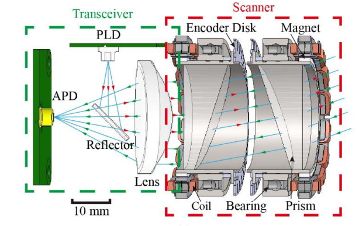
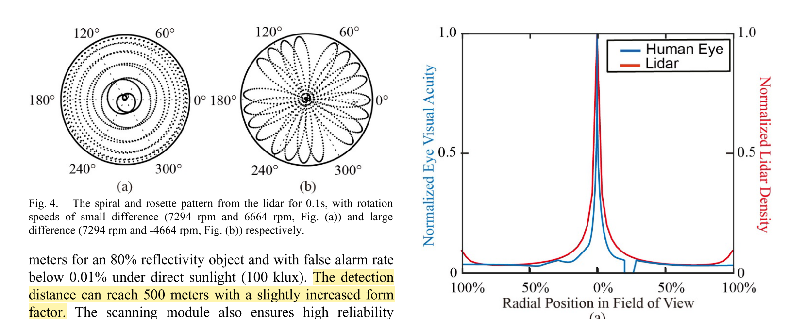
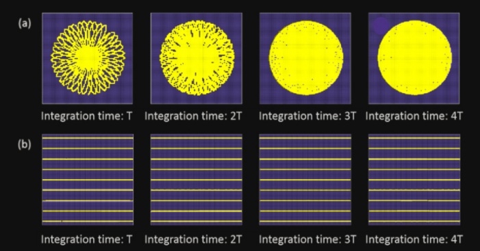
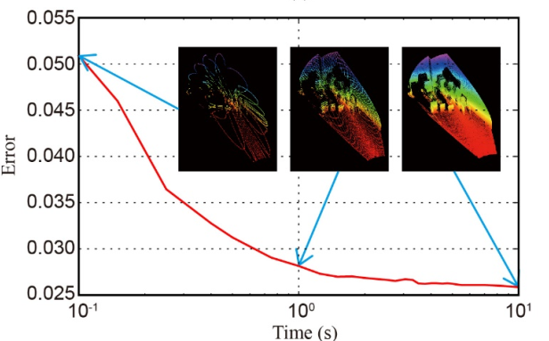
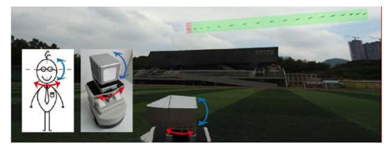

## 1.扫描原理介绍

<u>Low-cost Retina-like Robotic Lidars Based on Incommensurable Scanning</u>

1. Similar to the fovea in human retina, this lidar features a peaked central angular density, enabling in applications that prefers eye-like attention.

**与人类视网膜结构的中央凹类似，这种雷达特点是中间扫描密度最高**

2.Featuring an angular density distribution similar to human retina, this lidar is ideal for scene perception and tracking applications inspired by the attention mechanism of human vision. The unique scanning method could also enable capturing the field of view (FoV) in high resolution provided enough accumulation time, which is beneficial for various robotic applications

**3.目前主流的激光雷达是多线机械扫描**

The dominant type of existing robotic lidars are based on
multi-line mechanical scanning due to its simplicity and the achievements in autonomous
driving competitions from
DARPA grand to urban challenges 

4.The FoV of this lidar is determined by the vertical space span of the PLD and APD assemblies (Fig. 1(a)) relative to the telescoping lenses. The vertical resolution is thus determined by the number of transceivers within the FoV

**5.动态范围问题**

**6.Risley prism pairs**

Risley prism pair, composed of two refractive prisms serially mounted provides another simple yet versatile optical scanning method.

Unique advantages in prism-based approaches such as low cost, small form factor

**7.Retina-like scanning pattern**

论文中对这种分布的形成进行了证明

**8.Incommensurable scanning pattern**

Non-repeating pattern is a natural consequence of this lidar design which could provide a high-resolution description of the environment.

As the scanning time increases from 0.2s to 40s, the 3D view obtains higher coverage resolution

**9.Performance upgradability in point density and FoV**

A、Scanning density improvement with packaged arrays

B、Customized FoV with simultaneously controlled prisms

In many robotic applications, such as high speed self-driving cars,close-to-rectangle FoV is required.
In the horizontal direction, a lidar should cover a horizontal FoV as large as possible to sense the surroundings and events.

**10.应用**

**A.Calibration of lidar and IMU**

The incommensurable scan can be valuable in extrinsic calibration between the lidar and other sensors.

利用点云的非重复扫描特性，积分后，点云密度会更高，对积分后的两帧点云求取位姿变换，利用手眼标定与IMU标定；

多帧累积的方法同样适应与雷达-相机和多雷达系统的标定。

**B.Intruder UAV detection and tracking**

论文附录给出了算法具体实现

Multi-line lidars is insufficient in detecting the intruders if they appear in the gap between any two lines.

与人眼类似，检测到目标后，转动头部，将其移动到视野中心区域。

After a successful object detection by the peripheral regions, eyes are turned by extraocular muscles, the neck or the body to project the image of the object onto the high-resolution fovea region 

受此启发，激光雷达可以增加一个两自由度的万向框架系统，用于类似眼睛的机器人目标检测和跟踪

Inspired by this, the lidar can be augmented with a two-degree-of-freedom gimbal system for eye-like robotic object detection and tracking

**C. Demonstration of applications in self-driving cars**

two applications which are essential in self-driving cars: object detection and tracking, and lidar odometry and mapping.  Both of the two algorithms run on the Xavier in real-time.

1) Object detection and tracking

The detection program consists of three parts, namely,detection, segmentation and tracking.

**detection**：FPN

**segmentation**：splits the ground points based on the points height and normal vector.

Then the ground, foreground objects and background objects are clustered and fused with the detection results in the first part to produce more reliable and accurate segmentation results.

**tracking：**

pairs for each object in the current frame according to the distance of these objects from the last frame, and smooth the trajectory of each object via a Kalman filtering method.

2) Lidar odometry and mapping (LOAM)

## 2.Pre-Propress

高斯过程所需的计算量较大，另外，你目前没有发现虚警是不是因为实车实验较少？或者测试的场地环境类型较少？有没有测试过起伏路面？

仅仅根据回波强度还是有部分烟雾的噪点去除不掉，你能结合其它特征，通过进一步滤波把这些噪声点去掉吗？比如通过运动特征？因为如果是静态障碍，其运动方向与本车运动方向相反，大小相当。那么与这种运动差别较大的障碍点，反射率又比较低的点，是不是自然就可以被过滤掉？