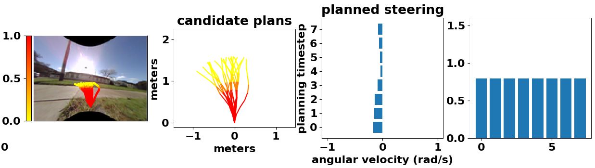

#### 1.使用官方测试集测试

目前每一帧耗时大概500ms，纯python

需要预测4096条轨迹的代价，将模型输入复制4096份耗时450ms

改为预测2048条轨迹：复制输入需要220ms，整体280ms

下为测试结果，颜色越深，代价越大，

从左至右为：

输入图像，候选规划轨迹，预测转向，预测速度

共预测2048条动作序列，均匀采样20条进行显示

`color:bumpy`

`color:collision`

#### 2.使用CMU校园仿真环境测试bumpy

由于预测`collision`的模型同时也要负责预测`gps`位置，所以目前还只能单独测试`bumpy`模型的泛化性

一些阴影部分的`bumpy`也很大，下第一张图，所以使用视觉作为输入会不可靠，使用点云鲁棒性会更高，也有可能是训练次数不够的原因

#### 3.直接使用模型输出控制车辆在CMU校园仿真环境中行驶

由于缺少位置输入，只是预测`bumpy`，无法预测`collision`导致车辆频繁发生碰撞

关于论文三章的内容，最近在看一篇有关‘类脑导航’的综述，还没读完，目前的规划是

第一章做偏感知的内容，基于深度学习的可通行路径预测，预测轨迹点的bumpy+collision

第二章做偏导航规划的内容，在第一章的基础上，给定目标信息后可以自主导航到目标点附近

第三章做模型自我更新的内容，从与环境交互或者增加少量训练数据 学习到更强的导航能力