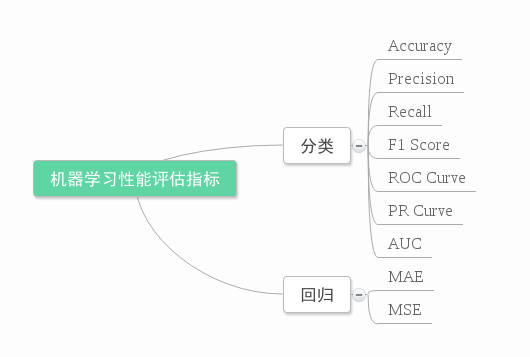

## 0.常用评价指标

### 0.1 precision and recall

[csdn](https://blog.csdn.net/quiet_girl/article/details/70830796)



**混淆矩阵**

True Positive(真正，TP)：将正类预测为正类数

True Negative(真负，TN)：将负类预测为负类数

False Positive(假正，FP)：将负类预测为正类数误报 (Type I error)

False Negative(假负，FN)：将正类预测为负类数→漏报 (Type II error)


**1、准确率（Accuracy）**

准确率(accuracy)计算公式为：


注：准确率是我们最常见的评价指标，而且很容易理解，就是被分对的样本数除以所有的样本数，通常来说，正确率越高，分类器越好。
准确率确实是一个很好很直观的评价指标，但是有时候准确率高并不能代表一个算法就好。比如某个地区某天地震的预测，假设我们有一堆的特征作为地震分类的属性，类别只有两个：0：不发生地震、1：发生地震。一个不加思考的分类器，对每一个测试用例都将类别划分为0，那那么它就可能达到99%的准确率，但真的地震来临时，这个分类器毫无察觉，这个分类带来的损失是巨大的。为什么99%的准确率的分类器却不是我们想要的，因为这里数据分布不均衡，类别1的数据太少，完全错分类别1依然可以达到很高的准确率却忽视了我们关注的东西。再举个例子说明下。在正负样本不平衡的情况下，准确率这个评价指标有很大的缺陷。比如在互联网广告里面，点击的数量是很少的，一般只有千分之几，如果用acc，即使全部预测成负类（不点击）acc也有 99% 以上，没有意义。因此，单纯靠准确率来评价一个算法模型是远远不够科学全面的。

**2、错误率（Error rate）**

错误率则与准确率相反，描述被分类器错分的比例，error rate = (FP+FN)/(TP+TN+FP+FN)，对某一个实例来说，分对与分错是互斥事件，所以accuracy =1 - error rate。

**3、灵敏度（sensitive）**

sensitive = TP/P，表示的是所有正例中被分对的比例，衡量了分类器对正例的识别能力。

**4、特效度（sensitive）**

specificity = TN/N，表示的是所有负例中被分对的比例，衡量了分类器对负例的识别能力。

**5、精确率、精度（Precision）**

精确率(precision)定义为：


表示被分为正例的示例中实际为正例的比例。

**6、召回率（recall）**

召回率是覆盖面的度量，度量有多个正例被分为正例，recall=TP/(TP+FN)=TP/P=sensitive，可以看到召回率与灵敏度是一样的。

**7、综合评价指标（F-Measure）**
P和R指标有时候会出现的矛盾的情况，这样就需要综合考虑他们，最常见的方法就是F-Measure（又称为F-Score）。
F-Measure是Precision和Recall加权调和平均：

当参数α=1时，就是最常见的F1，也即

可知F1综合了P和R的结果，当F1较高时则能说明试验方法比较有效。

**8、其他评价指标**

计算速度：分类器训练和预测需要的时间；

鲁棒性：处理缺失值和异常值的能力；

可扩展性：处理大数据集的能力；

可解释性：分类器的预测标准的可理解性，像决策树产生的规则就是很容易理解的，而神经网络的一堆参数就不好理解，我们只好把它看成一个黑盒子。

下面来看一下ROC和PR曲线（以下内容为自己总结）：

**1、ROC曲线：**
ROC（Receiver Operating Characteristic）曲线是以假正率（FP_rate）和真正率（TP_rate）为轴的曲线，ROC曲线下面的面积我们叫做AUC，如下图所示：


图片根据Paper：Learning from eImbalanced Data画出

其中: T P r a t e = T P P c TP_{rate}=\frac{TP}{P_c}*T**P**r**a**t**e*=*P**c**T**P*, F P r a t e = F P N c FP_rate=\frac{FP}{N_c}*F**P**r**a**t**e*=*N**c**F**P*
（1）曲线与FP_rate轴围成的面积（记作AUC）越大，说明性能越好，即图上L2曲线对应的性能优于曲线L1对应的性能。即：曲线越靠近A点（左上方）性能越好，曲线越靠近B点（右下方）曲线性能越差。
（2）A点是最完美的performance点，B处是性能最差点。
（3）位于C-D线上的点说明算法性能和random猜测是一样的–如C、D、E点。位于C-D之上（即曲线位于白色的三角形内）说明算法性能优于随机猜测–如G点，位于C-D之下（即曲线位于灰色的三角形内）说明算法性能差于随机猜测–如F点。
（4）虽然ROC曲线相比较于Precision和Recall等衡量指标更加合理，但是其在高不平衡数据条件下的的表现仍然过于理想，不能够很好的展示实际情况。

**2、PR曲线：**
即，PR（Precision-Recall）曲线。
举个例子（例子来自Paper：Learning from eImbalanced Data）：
假设N_c>>P_c（即Negative的数量远远大于Positive的数量），若FP很大，即有很多N的sample被预测为P，因为F P r a t e = F P N c FP_{rate}=\frac{FP}{N_c}*F**P**r**a**t**e*​=*N**c*​*F**P*​，因此FP_rate的值仍然很小（如果利用ROC曲线则会判断其性能很好，但是实际上其性能并不好），但是如果利用PR，因为Precision综合考虑了TP和FP的值，因此在极度不平衡的数据下（Positive的样本较少），PR曲线可能比ROC曲线更实用。

## 1.KNN及KD树  球树


## 2.DBSCAN及其kd树改进版

DBSCAN（Density-Based Spatial Clustering of Applications with Noise）聚类算法，是一种基于高密度连通区域的、基于密度的聚类算法，能够将具有足够高密度的区域划分为簇(Cluster)，并在具有噪声的数据中发现任意形状的簇。DBSCAN算法通过距离定义出一个密度函数，计算出每个样本附近的密度，从而根据每个样本附近的密度值来找出那些样本相对比较集中的区域，这些区域就是我们要找的簇。

### 2.1 DBSCAN算法的基本原理

其它聚类方法大都是基于对象之间的距离进行聚类，聚类结果是球状的簇。DBSCAN 算法利用簇的高密度连通性，寻找被低密度区域分离的高密度区域，可以发现任意形状的簇，其基本思想是:对于一个簇中的每个对象，在其给定半径的领域中包含的对象不能少于某一给定的最小数目。

DBSCAN算法中有**两个重要参数**：$ε$表示定义密度时的邻域半径，$M$ 表示定义核心点时的阈值。

考虑数据集合$X$={$x^{(1)}$,$x^{(2)}$,...,$x^{(n)}$}，引入以下概念与记号。

1. **$ε$邻域**

设$x$∈$X$，称

​                                                         $N_{ε}(x)$={$y$∈$X$ : $d$($y$,$x$) ≤$ε$}


为$X$的$ε$邻域。显然，$x$∈$N_{ε}(x)$

为了简单起见，节点$x^{(i)}$与其下标$i$一一对应，引入记号

$N$$ε$($i$)={$j$:  $d$($y$($j$),$x$($i$))≤$ε$;   $y$($j$),$x$($i$)∈$X$}

2. **密度**

设$x$∈$X$，称$ρ$($x$)=|$N$$ε$($x$)|为$x$的密度。密度是一个整数，且依赖于半径$ε$。

3. **核心点(核心对象)**

设$x$∈$X$，若$ρ$($x$)≥$M$，则称$x$为$X$的核心点。记由$X$中所有核心点构成的集合为$X$$c$，并记$X$$n$$c$=$X$−$X$$c$表示$X$中所有非核心点构成的集合。

4. 边界点

若$x$∈$X$$n$$c$，且∃$y$∈$X$，满足$y$∈$N$$ε$($x$)⋂$X$$c$，即$X$的非核心点$x$的$ε$邻域中存在核心点，则称$x$ 为$X$的边界点。记由$X$中所有边界点构成的集合为$X$$b$$d$。

此外，边界点也可以这么定义，若$x$∈$X$$n$$c$，且$x$落在某个核心点的$ε$邻域内，则称$x$为$X$的边界点。一个边界点可能同时落入一个或多个核心点的$ε$邻域内。

5. 噪声点

记$X$$n$$o$$i$=$X$−($X$$c$⋃$X$$b$$d$)，若$x$∈$X$$n$$o$$i$，则称$x$为噪音点。

至此，我们严格给出了核心点、边界点和噪音点的数学定义，且满足$X$=$X$$c$⋃$X$$b$$d$⋃$X$$n$$o$$i$.


​																*图1：核心点、边界点和噪声点*

直观地说，**核心点**对应**稠密区域内部**的点，**边界点**对应**稠密区域边缘**的点，而**噪音点**对应**稀疏区域**中的点。

数据集通过聚类形成的子集是簇。核心点位于簇的内部，它确定无误地属于某个特定的簇；噪音点是数据集中的干扰数据，它不属于任何一个簇；边界点是一类特殊的点，它位于一个或几个簇的边缘地带，可能属于一个簇，也可能属于另外一个簇，其归属并不明确。

6. **密度直达**

设$x$,$y$∈$X$. 若满足$x$∈$X$$c$，则称$y$是$x$密度直达的。

7. **密度可达**

设$p$(1),$p$(2),...,$p$($m$)∈$X$，其中$m$≥2。若它们满足：$p$($i$+1) 是从$p$($i$)密度直达的，其中$i$=1,2,...,$m$−1，则称$p$($m$) 是从$p$(1) 中密度可达的。

​	7.1  当$m$=2时，密度可达即为密度直达。实际上，密度可达是密度直达的传递闭包。

​	7.2  密度可达关系不具有对称性。若$p$($m$)是从$p$(1)密度可达的，那么$p$(1) 不一定是从$p$($m$)密度可达的。根据上述定义可知，$p$(1),$p$(2),...,$p$($m$−1)必须为核心点，而$p$($m$)可以是核心点，也可以是边界点。当$p$($m$)是边界点时，$p$(1)一定不是从$p$($m$)密度可达的。

8. **密度相连**

设$x$,$y$,$z$∈$X$，若$y$和$z$均是从$x$密度可达的，则称$y$和$z$是密度相连的。显然，密度相连具有对称性。


eps = r

minPts = 3

M­是从P“密度直达”；Q也是从­M“密度直达”；基于上述结果，Q是从P“密度可达”；但P从Q无法“密度可达”(非对称),因为Q不是核心点。

类似地，S和R从O是“密度可达”的；O、R和S均是“密度相连”（对称）的

9. **簇（cluster）**

非空集合$C$⊂$X$，如果$C$满足：对于$x$,$y$∈$X$

- 若$x$∈$C$，且$y$是从$x$密度可达的，则$y$∈$C$，
- 若$x$∈$C$，$y$∈$C$，则$x$,$y$是密度相连的。

则称$C$是$X$的一个簇。

​	DBSCAN 算法基于以下一个基本事实：对于任一核心点$x$，数据集$X$中所有从$x$ 密度可达的数据点可以构成一个完整的簇$C$，且$x$∈$C$。

​	其核心思想描述如下:从**某个选定的核心点出发**，不断向**密度可达**的区域扩张，从而得到一个包含核心点和边界点的最大化区域，区域中任意两点密度相连。

### 2.2 DBSCAN算法的实现

《数据挖掘概念与技术》给出的算法伪代码如下:


考虑数据集合$X$={$x_{1}$(1),$x$(2),...,$x$($n$)}。

DBSCAN算法的目标是将数据集合$X$分成$K$个簇及噪声点集合，其中$K$也是由算法得到，为此，引入簇的标记数组
$$
m_i=\left\{
\begin{aligned}
j,  &&若x^{(i)}属于第j个簇\\
-1, &&若x^{(i)}为噪声点 \\
\end{aligned}
\right.
$$

DBSCAN算法的目标就是生成标记数组$m$$_i$,   $i$=1,...,$n$.

为了保证可以更有效地实现算法1中第3句随机选择一个unvisited对象$p$，设计了一个数据结构visitlist，其中包含两个列表visitedlist和unvisitedlist，分别用于存储已访问的点和未访问的点，每次从unvisitedlist 中取点可以保证每次取到的点都是未访问过的点，实现代码如下：

代码1：visitlist数据结构

```python
 1 # visitlist类用于记录访问列表
 2 # unvisitedlist记录未访问过的点
 3 # visitedlist记录已访问过的点
 4 # unvisitednum记录访问过的点数量
 5 class visitlist:
 6     def _init_(self, count=0):
 7         self.unvisitedlist=[i for i in range(count)]
 8         self.visitedlist=list()
 9         self.unvisitednum=count
10 
11     def visit(self, pointId):
12         self.visitedlist.append(pointId)
13         self.unvisitedlist.remove(pointId)
14         self.unvisitednum -= 1
```

DBSCAN算法实现代码如下:

代码2：DBSCAN算法实现

```python
 1 import numpy as np
 2 import matplotlib.pyplot as plt
 3 import math
 4 import random
 5 
 6 def  dist(a, b):
 7     # 计算a,b两个元组的欧几里得距离
 8     return math.sqrt(np.power(a-b, 2).sum())
 9 
10 def my_dbscanl(dataSet, eps, minPts):
11     # numpy.ndarray的 shape属性表示矩阵的行数与列数
12     nPoints = dataSet.shape[0]
13     # (1)标记所有对象为unvisited
14     # 在这里用一个类vPoints进行买现
15     vPoints = visitlist(count=nPoints)
16     # 初始化簇标记列表C,簇标记为 k
17     k = -1
18     C = [-1 for i in range(nPoints)]
19     while(vPoints.unvisitednum > 0):
20         # (3)随机上选择一个unvisited对象p
21         P = random.choice(vPoints.unvisitedlist)
22         # (4)标记p为visited
23         vPoints.visit(p)
24         # (5)if p的$\varepsilon$-邻域至少有MinPts个对象
25         # N是p的$\varepsilon$-邻域点列表
26         N = [i for i in range(nPoints) if dist(dataSet[i], dataSet[p])<= eps]
27         if  len(N) >= minPts:
28             # (6)创建个新簇C，并把p添加到C
29             # 这里的C是一个标记列表，直接对第p个结点进行赋植
30             k += 1
31             C[p]=k
32             # (7)令N为p的ε-邻域中的对象的集合
33             # N是p的$\varepsilon$-邻域点集合
34             # (8) for N中的每个点p'
35             for p1 in N:
36                 # (9) if p'是unvisited
37                 if p1 in vPoints.unvisitedlist:
38                     # (10)标记p’为visited
39                     vPoints.visit(p1)
40                     # (11) if p'的$\varepsilon$-邻域至少有MinPts个点，把这些点添加到N
41                     # 找出p'的$\varepsilon$-邻域点，并将这些点去重添加到N
42                     M=[i for i in range(nPoints) if dist(dataSet[i], \
43                         dataSet[p1]) <= eps]
44                     if len(M) >= minPts:
45                         for i in M:
46                             if i not in N:
47                                 N.append(i)
48                     # (12) if p'还不是任何簇的成员，把P'添加到C
49                     # C是标记列表，直接把p'分到对应的簇里即可
50                     if  C[p1] == -1:
51                         C[p1]= k
52         # (15)else标记p为噪声
53         else:
54             C[p]=-1
55 
56     # (16)until没有标t己为unvisitedl内对象
57     return C
```

 利用sklearn生成数据集，共2500条数据，并利用matplotlib画出散点图，代码如下:

代码3：生成数据集

```python
 1 import numpy as np
 2 import matplotlib.pyplot as plt
 3 from sklearn import datasets
 4 
 5 X1, Y1 = datasets.make_circles(n_samples=2000, factor=0.6, noise=0.05,
 6                                random_state=1)
 7 X2, Y2 = datasets.make_blobs(n_samples=500, n_features=2, centers=[[1.5,1.5]],
 8                              cluster_std=[[0.1]], random_state=5)
 9 
10 X = np.concatenate((X1, X2))
11 plt.figure(figsize=(12, 9), dpi=80)
12 plt.scatter(X[:,0], X[:,1], marker='.')
13 plt.show()
```

 

​											图2：数据集散点图

设置参数Eps=0.1, MinPts=10，聚类结果如下图：

 

​												图3：聚类结果

### 2.3 利用KD树进行优化

KD树（K-Dimensional Tree），是一种分割k维数据空间的数据结构，是二叉搜索树在多维条件下的推广。主要应用于多维空间关键数据的搜索。KD树的介绍见：https://www.jianshu.com/p/ffe52db3e12b，不赘述。

利用scipy实现KD树的构造和查询，对代码2的算法进行改进，代码如下:

代码4：DBSCAN算法的优化实现

```python
 1 import numpy as np
 2 import matplotlib.pyplot as plt
 3 import math
 4 import random
 5 from scipy.spatial import KDTree
 6 
 7 def my-dbscan2(dataSet, eps, minPts):
 8     # numpy.ndarray的 shape属性表示矩阵的行数与列数
 9     # 行数即表小所有点的个数
10     nPoints = dataSet.shape[0]
11     # (1) 标记所有对象为unvisited
12     # 在这里用一个类vPoints进行实现
13     vPoints = visitlist(count=nPoints)
14     # 初始化簇标记列表C，簇标记为 k
15     k = -1
16     C = [-1 for i in range(nPoints)]
17     # 构建KD-Tree，并生成所有距离<=eps的点集合
18     kd = KDTree(X)
19     while(vPoints.unvisitednum>0):
20         # (3) 随机选择一个unvisited对象p
21         p = random.choice(vPoints.unvisitedlist)
22         # (4) 标t己p为visited
23         vPoints.visit(p)
24         # (5) if p 的$\varepsilon$-邻域至少有MinPts个对象
25         # N是p的$\varepsilon$-邻域点列表
26         N = kd.query_ball_point(dataSet[p], eps)
27         if len(N) >= minPts:
28             # (6) 创建个一个新簇C，并把p添加到C
29             # 这里的C是一个标记列表，直接对第p个结点进行赋值
30             k += 1
31             C[p] = k
32             # (7) 令N为p的$\varepsilon$-邻域中的对象的集合
33             # N是p的$\varepsilon$-邻域点集合
34             # (8) for N中的每个点p'
35             for p1 in N:
36                 # (9) if p'是unvisited
37                 if p1 in vPoints.unvisitedlist:
38                     # (10) 标记p'为visited
39                     vPoints.visit(p1)
40                     # (11) if p'的$\varepsilon$-邻域至少有MinPts个点，把这些点添加到N
41                     # 找出p'的$\varepsilon$-邻域点，并将这些点去重新添加到N
42                     M = kd.query_ball_point(dataSet[p1], eps)
43                     if len(M) >= minPts:
44                         for i in M:
45                             if i not in N:
46                                 N.append(i)
47                     # (12) if p'还不是任何簇的成员，把p'添加到c
48                     # C是标记列表，直接把p'分到对应的簇里即可
49                     if C[p1] == -1
50                         C[p1] = k
51         # (15) else标记p为噪声
52         else:
53             C[p1] = -1
54 
55     # (16) until没有标记为unvisited的对象
56     return C
```

 以代码3中生成的2500条数据作为测试，比较优化前后的算法性能


```
1 import time
2 start = time.time()
3 C1 = my_dbscanl(X, 0.1, 10)
4 end = time.time()
5 print "`运行时间`:", end - start
6 plt.scatter(X[:, 0], X[:, 1], c=C1, marker='.')
7 plt.show()
8 >>> `运行时间：`29.1249849796
```


​																			图4：优化前算法结果

```python
1 import time
2 start = time.time()
3 C2 = my_dbscan2(X, 0.1, 10)
4 end = time.time()
5 print "运行时间:", end - start
6 plt.scatter(X[:, 0], X[:, 1], c=C2, marker='.')
7 plt.show()
8 >>> 运行时间：4.72340583801
```

 

​						图5：优化后算法结果

可以看到优化后的算法运行时间从29.12s降到了4.72s，优化的效果非常明显。

\4. 后记

上文仅仅是对DBSCAN算法的思想与实现进行了简略摘要，是学习算法的一个过程。算法的学习还比较粗劣和浅层，在实践应用中上述代码并不实用。如果需要使用DBSCAN的算法求解聚类问题，建议使用sklearn自带的DBSCAN函数。以代码3中生成数据为例：

```python
 1 # DBSCAN eps = 0.1, MinPts = 10
 2 import time
 3 from sklearn.cluster import DBSCAN
 4 start = time.time()
 5 C = DBSCAN(eps=0.1, min_pts=10).
 6 end = time.time()
 7 print "运行时间：", end - start
 8 plt.scatter(X[:, 0], X[:, 1], c=C, marker='.')
 9 plt.show()
10 >>> 运行时间：0.0240921974182
```


## 3.生长法聚类

  历史：区域生长是一种古老的图像分割方法，最早的区域生长图像分割方法是由Levine等人提出的。该方法一般有两种方式，一种是先给定图像中要分割的目标物体内的一个小块或者说种子区域(seed point)，再在种子区域基础上不断将其周围的像素点以一定的规则加入其中，达到最终将代表该物体的所有像素点结合成一个区域的目的；另一种是先将图像分割成很多的一致性较强，如区域内像素灰度值相同的小区域，再按一定的规则将小区域融合成大区域，达到分割图像的目的，典型的区域生长法如T. C. Pong等人提出的基于小面（facet）模型的区域生长法，区域生长法固有的缺点是往往会造成过度分割，即将图像分割成过多的区域 。  

区域生长是一种串行区域分割的图像分割方法，其优点是基本思想相对简单，通常能将具有相同特征的联通区域分割出来，并能提供很好的边界信息和分割结果。在没有先验知识可以利用时，可以取得最佳的性能，可以用来分割比较复杂的图象，如自然景物。但是，区域生长法是一种==迭代==的方法，==空间和时间开销都比较大==，噪声和灰度不均一可能会导致空洞和过分割，并在对图像中的阴影效果处理上往往不是很好。 

区域生长的基本思想是将具有相似性质的像素集合起来构成区域。

具体先对每个需要分割的区域找一个==种子像素==作为生长的起点，然后将种子像素周围邻域中与种子像素具有相同或相似性质的像素（根据某种事先确定的生长或相似准则来判定）合并到种子像素所在的区域中。将这些新像素当做新的种子像素继续进行上面的过程，直到再没有满足条件的像素可被包括进来，这样，一个区域就长成了。

区域生长是指从某个像素出发，按照一定的准则，逐步加入邻近像素，当满足一定的条件时，区域生长终止。

区域生长的好坏决定于

1.初始点（种子点）的选取。

2.生长准则。

3.终止条件。

区域生长是从某个或者某些像素点出发，最后得到整个区域，进而实现目标的提取。

简单来说下三个法则，对出需要分割的图像：

1、选取图像中的一点为种子点（种子点的选取需要具体情况具体分析）。

2、在种子点处进行8邻域或4邻域扩展，判定准则是：如果考虑的像素与种子像素灰度值差的绝对值小于某个门限T，则将该像素包括进种子像素所在的区域。

3、当不再有像素满足加入这个区域的准则时，区域生长停止。


区域生长实现的步骤如下:

1. 对图像顺序扫描!找到第1个还没有归属的像素, 设该像素为(x0, y0);

2. 以(x0, y0)为中心, 考虑(x0, y0)的8邻域像素(x, y)，如果(x,, y)满足生长准则, 将(x, y)与(x0, y0)合并(在同一区域内), 同时将(x, y)压入堆栈;

3. 从堆栈中取出一个像素, 把它当作(x0, y0)返回到步骤2;

4. 当堆栈为空时!返回到步骤1;

5. 重复步骤1 - 4直到图像中的每个点都有归属时。生长结束。

进一步解释：注意“没有归属”四个字，从种子点出发，在其8领域内查找满足生长准则的点归并到种子点所在区域内，在程序中就是通过 push 到 stack 堆栈中来实现，每一个被遍历的元素都会被标记，凡是被标记的元素在下次检测的时候都不会被考虑，因为它已经有了“归属”，区域生长的目的也就是将“归属”于种子点区域的部分分割出来而已。随着迭代次数的增加，每次在 top 一个元素并 pop 后加入到 stack 中的元素慢慢变少，直到停止生长为止！


大体思路是这样的：

> 1、遍历全图，寻找是否还有undetermined的点，如有，作为种子

> 2、进行单种子的区域生长算法，生长出的区域记入矩阵mask

> 3、如果mask记录的区域面积足够大，把mask中的区域记录到矩阵dest中，状态为determined；如果mask记录的区域面积太小，把mask中的区域记录到矩阵dest中，状态为ignored（忽略分割出来面积过小的区域）

> 4、重复上述步骤，直到全图不存在undetermined的点

```C++
#include <iostream>

#include <stack>

#include <opencv2\opencv.hpp>

using namespace std;
using namespace cv;

// 8 邻域
static Point connects[8] = { Point(-1, -1), Point(0, -1), Point(1, -1), Point(1, 0), Point(1, 1), Point(0, 1), Point(-1, 1), Point(-1, 0)};

int main()
{
	// 原图
	Mat src = imread("img2.jpg", 0);
	// 结果图
	Mat res = Mat::zeros(src.rows, src.cols, CV_8U);
	// 用于标记是否遍历过某点
	Mat flagMat;
	res.copyTo(flagMat);
	// 二值图像
	Mat bin;
	threshold(src, bin, 80, 255, CV_THRESH_BINARY);
    // 初始3个种子点
    stack<Point> seeds;
    seeds.push(Point(0, 0));
    seeds.push(Point(186, 166));
    seeds.push(Point(327, 43));
    res.at<uchar>(0, 0) = 255;
    res.at<uchar>(166, 186) = 255;
    res.at<uchar>(43, 327) = 255;

    while (!seeds.empty())
    {
        Point seed = seeds.top();
        seeds.pop();

        // 标记为已遍历过的点
        flagMat.at<uchar>(seed.y, seed.x) = 1;

        // 遍历8邻域
        for (size_t i = 0; i < 8; i++)
        {
            int tmpx = seed.x + connects[i].x;
            int tmpy = seed.y + connects[i].y;

            if (tmpx < 0 || tmpy < 0 || tmpx >= src.cols || tmpy >= src.rows)
                continue;
            // 前景点且没有被标记过的点
            if (bin.at<uchar>(tmpy, tmpx) != 0 && flagMat.at<uchar>(tmpy, tmpx) == 0)
            {
                res.at<uchar>(tmpy, tmpx) = 255; // 生长
                flagMat.at<uchar>(tmpy, tmpx) = 1; // 标记
                seeds.push(Point(tmpx, tmpy)); // 种子压栈
            }
        }
    }

    imshow("RES",res);
    imwrite("res.jpg", res);
    waitKey(0);
    return 1;
}
```

```C++
//区域生长，4连通区域，基于一个种子点，种子点可以自选，种子点在seed图像内设置为255
void Grow(IplImage* src,IplImage* src1,IplImage* seed, int t1)//gray=255
{
	stack <seedpoint> seedd;//定义一个堆栈
	seedpoint point;//堆栈的元素为point
	// 获取图像数据,保存种子区域
	int height     = seed->height;
	int width      = seed->width;  
	int step       = seed->widthStep;
	uchar* seed_data    = (uchar *)seed->imageData;
	uchar* src_data     =(uchar *)src->imageData;
	uchar* src1_data    =(uchar*)src1->imageData;
	int temp;//用于当前点的像素值
	for(int i=0;i<height;i++)
	{
		for(int j=0;j<width;j++)
		{
			if(seed_data[i*step+j]==255)
			{
				point.x=i;
				point.y=j;
				temp = src1_data[point.x*step+point.y];
				seedd.push(point);
			}
		}
	}
	seedpoint temppoint;//临时存放种子点的中间变量
	while(!seedd.empty())
	{
	    point=seedd.top();           //返回栈顶数据，不删除	
	    seedd.pop();                 //栈顶数据出栈,删除栈顶元素，但不返回其值
	
		if((point.x>0)&&(point.x<(height-1))&&(point.y>0)&&(point.y<(width-1)))//如果种子点在图像范围内，分别检测其8个邻域点
		{
			//邻域一点像素为0，即不是种子点本身，并且该点与种子点之差小于设定的阈值
			if((seed_data[(point.x-1)*step+point.y]==0)&&(abs(src1_data[(point.x-1)*step+point.y]-temp) < t1))
			{
				//cvSet2D(seed,(point.x-1),point.y,pixel);
				seed_data[(point.x-1)*step+point.y]=255;
				src_data[(point.x-1)*step+point.y]=src1_data[(point.x-1)*step+point.y];
				temppoint.x=point.x-1;
				temppoint.y=point.y;
				seedd.push(temppoint);
			}
			if((seed_data[point.x*step+point.y+1]==0)&&(abs(src1_data[point.x*step+point.y+1]-temp) < t1))
			{
				//cvSet2D(seed,(point.x),(point.y+1),pixel);
				seed_data[point.x*step+point.y+1]=255;
				src_data[point.x*step+point.y+1]=src1_data[point.x*step+point.y+1];
				temppoint.x=point.x;
				temppoint.y=point.y+1;
				seedd.push(temppoint);
			}
			if((seed_data[point.x*step+point.y-1]==0)&&(abs(src1_data[point.x*step+point.y-1]-temp) < t1))
			{
				//cvSet2D(seed,(point.x),(point.y-1),pixel);
				seed_data[point.x*step+point.y-1]=255;
				src_data[point.x*step+point.y-1]=src1_data[point.x*step+point.y-1];
				temppoint.x=point.x;
				temppoint.y=point.y-1;
				seedd.push(temppoint);
			}
			if((seed_data[(point.x+1)*step+point.y]==0)&&(abs(src1_data[(point.x+1)*step+point.y]-temp) < t1))
			{
				//cvSet2D(seed,(point.x),(point.y+1),pixel);
				seed_data[(point.x+1)*step+point.y]=255;
				src_data[(point.x+1)*step+point.y]=src1_data[(point.x+1)*step+point.y];
				temppoint.x=point.x+1;
				temppoint.y=point.y;
				seedd.push(temppoint);
			}
/////////////////////////////////////////////////////////////////////////////////////////////////////////////
			if((seed_data[(point.x-1)*step+point.y-1]==0)&&(abs(src1_data[(point.x-1)*step+point.y-1]-temp) < t1))
			{
				//cvSet2D(seed,(point.x-1),point.y,pixel);
				seed_data[(point.x-1)*step+point.y-1]=255;
				src_data[(point.x-1)*step+point.y-1]=src1_data[(point.x-1)*step+point.y-1];
				temppoint.x=point.x-1;
				temppoint.y=point.y-1;
				seedd.push(temppoint);
			}
			if((seed_data[(point.x-1)*step+point.y+1]==0)&&(abs(src1_data[(point.x-1)*step+point.y+1]-temp) < t1))
			{
				//cvSet2D(seed,(point.x-1),point.y,pixel);
				seed_data[(point.x-1)*step+point.y+1]=255;
				src_data[(point.x-1)*step+point.y+1]=src1_data[(point.x-1)*step+point.y+1];
				temppoint.x=point.x-1;
				temppoint.y=point.y+1;
				seedd.push(temppoint);
			}
			if((seed_data[(point.x+1)*step+point.y-1]==0)&&(abs(src1_data[(point.x+1)*step+point.y-1]-temp) < t1))
			{
				//cvSet2D(seed,(point.x-1),point.y,pixel);
				seed_data[(point.x+1)*step+point.y-1]=255;
				src_data[(point.x+1)*step+point.y-1]=src1_data[(point.x+1)*step+point.y-1];
				temppoint.x=point.x+1;
				temppoint.y=point.y-1;
				seedd.push(temppoint);
			}
			if((seed_data[(point.x+1)*step+point.y+1]==0)&&(abs(src1_data[(point.x+1)*step+point.y+1]-temp) < t1))
			{
				//cvSet2D(seed,(point.x-1),point.y,pixel);
				seed_data[(point.x+1)*step+point.y+1]=255;
				src_data[(point.x+1)*step+point.y+1]=src1_data[(point.x+1)*step+point.y+1];
				temppoint.x=point.x+1;
				temppoint.y=point.y+1;
				seedd.push(temppoint);
			}
		}
	} 
}
```

## 4.开集分类问题

思路：
1.使用**异常检测**领域的相关技术手段，比如 **oneclasssvm，iforest，auto encoder**等等，把训练集中没有的类别数据当作异常，使用异常检测的方法对其进行检测。
2.使用**聚类**的方法，对训练集中数据进行聚类操作，每个类别的数据聚在一起，设定相关的阈值，如果新的样本距每个类别的中心距离都超过了阈值，则认为该样本是其他类别。

目前只有这两种大概的思路，欢迎大家进行补充交流。

补充：昨天搜了一波论文，发现这类问题可以归类到**open set recognition**里面，即开放集识别，开放集分类是一个处理“未知”类的问题，这些类不包含在训练数据集中，而传统分类器假设只有已知类出现在测试环境中。其实，大多数应用真正想落地，是避不开这个问题的，不知道为何研究的确并不多，近两三年才逐渐有些研究者关注，出了一些文章，还是集思广益，多多交流哈。

### 4.1 异常检测

from:

[李宏毅深度学习笔记（十）Anomaly Detection（异常检测）]: https://blog.csdn.net/comli_cn/article/details/103068352?utm_medium=distribute.pc_relevant.none-task-blog-BlogCommendFromMachineLearnPai2-2.nonecase&amp;depth_1-utm_source=distribute.pc_relevant.none-task-blog-BlogCommendFromMachineLearnPai2-2.nonecase

#### 4.1.1 异常检测的定义

简单来说异常检测就是在一大堆数据中将正常的数据和异常的数据分开，把异常数据检测出来。

具体方法就是通过训练集训练出一个可以用来做**分类**的函数。在进行异常检测的时候所提供的训练集有下面几种类型：
1、训练集里面的样本都有标记，如果在测试集里根据分类函数分出来的某个样本不属于训练集里的任何一个类别则判定该样本为**未知**；(==路口识别的else属于此类数据集==)
2、训练集里所有样本均为正常样本；
3、训练集里存在少许异常样本，但大多数均为正常样本，但是没标记。
所以异常检测和普通分类问题的最大区别就在于异常检测中异常的样本极少，而普通分类中几种样本的数量上不会有太大的差异。

#### 4.1.2 异常检测的指标

在用训练出来的分类函数对测试集进行分类之后，模型会输出两个参数，一个是**所分类别**，另一个是对所分类别的**置信度**。

如何评判一个模型的好坏呢？

我们一般会用分类的准确率的高低来评判一个模型的好坏，但是在异常检测中由于异常样本数极少，所以不管用什么模型来进行分类，分类准确率都会比较高。

第一种情况

## 5.决策树

### 5.1  决策树基本概念

决策树模型成树形结构，在分类问题中，表示基于特征对实例进行分类的过程。


### 5.2 Hunt算法

决策树递归：


hunt：每个属性只使用一次

1.如果训练集中样本全都属于同一类，只有一个根节点

2.分到最后一个属性，还是无法完全分类，或者属性值都一样无法划分，就把node标记为叶子节点，类别为数据集中样本数最多的类


**hunt选择最优划分属性a_*作为根节点**

### 5.3 信息增益算法ID3


第二种选取方法更好

+ ID3算法主要针对属性选择问题
+ 使用==信息增益度==选择测试属性


**信息熵**的概念:


### 5.4 增益比率C4.5


​                                                                                                                                                                                                                                                                                                                                                                                                                                                                                                                                                                                                                                                                                                                                                                                                                                                                                                                                                                                                         

大致了解了一下决策树的构建和分类原理，后面的cart，剪枝没有看，接下来看adaboost

## 6.Adaboost

