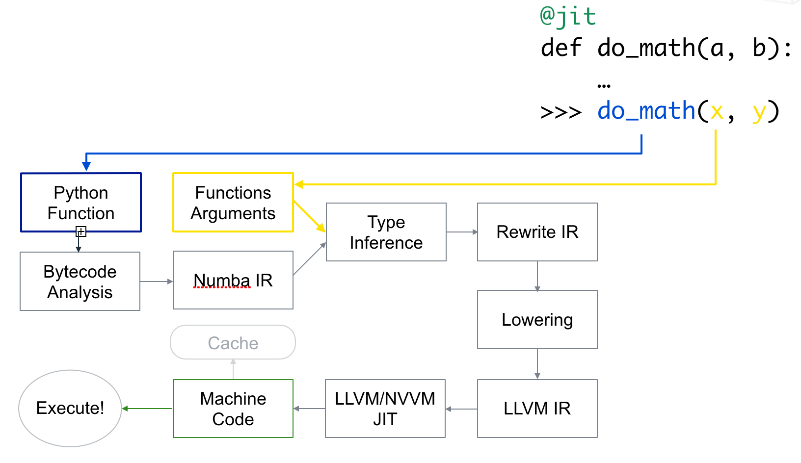
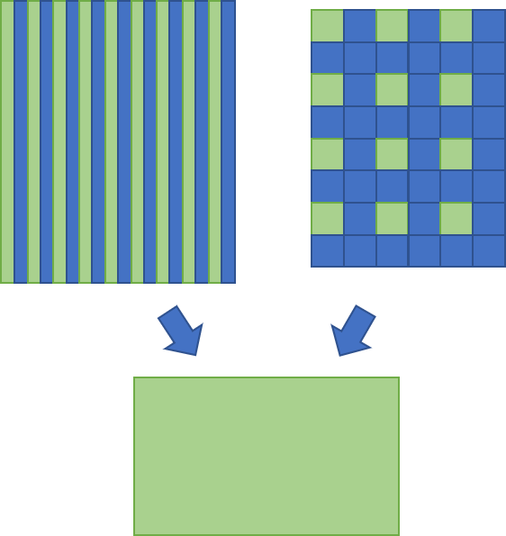
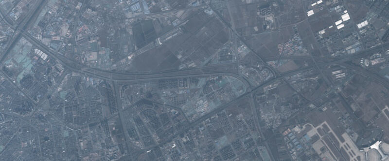
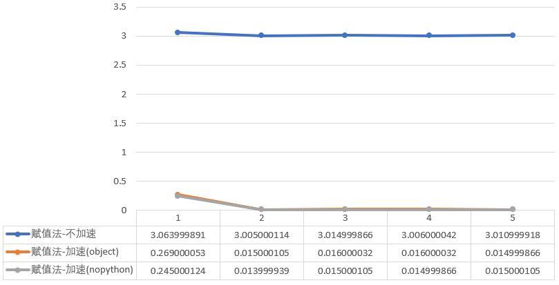
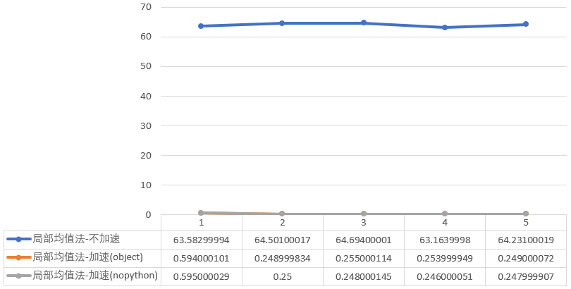

http://zhaoxuhui.top/blog/2019/01/17/PythonNumba.html

# Python的Numba库学习笔记

Tags: [GPU](http://zhaoxuhui.top/tags#GPU)

+ [1.Numba安装](http://zhaoxuhui.top/blog/2019/01/17/PythonNumba.html#1numba安装)
+ [2.最简单的使用方法](http://zhaoxuhui.top/blog/2019/01/17/PythonNumba.html#2最简单的使用方法)
+ [3.适合Numba加速的代码](http://zhaoxuhui.top/blog/2019/01/17/PythonNumba.html#3适合numba加速的代码)
+ [4.Numba加速评价](http://zhaoxuhui.top/blog/2019/01/17/PythonNumba.html#4numba加速评价)
+ [5.Numba常用关键字](http://zhaoxuhui.top/blog/2019/01/17/PythonNumba.html#5numba常用关键字)
+ [6.影像降采样实例](http://zhaoxuhui.top/blog/2019/01/17/PythonNumba.html#6影像降采样实例)
+ [7.参考资料](http://zhaoxuhui.top/blog/2019/01/17/PythonNumba.html#7参考资料)

------

Numba通过使用[LLVM](http://llvm.org/)技术，将Python代码编译生成优化后的机器码，可以大幅提高代码执行效率。 关于如何使用Numba，New York University有一个很好的教程，讲解清晰、示例简单，可以学习一下，点击[查看](https://nyu-cds.github.io/python-numba/)。当然如果愿意看我的笔记也可以。

在之前有过关于CUDA加速的[笔记](http://zhaoxuhui.top/blog/2017/04/08/CUDA学习笔记1.html)，不过那个是C++的。而且后来因为种种原因，也就再也没有用过GPU加速了。最近因为毕业设计，又需要用到GPU加速等技术，所以就再来学习研究一下Python加速相关内容。

针对Python加速，之前也[提到过](http://zhaoxuhui.top/blog/2018/07/19/PythonMultiprocessing.html)，可以使用多线程、多进程，更有效果的是Numba，官网对它的定位是“一个Python编译器”。

```
	Numba, a Python compiler from Anaconda that can compile Python code for execution on CUDA-capable GPUs, provides Python developers with an easy entry into GPU-accelerated computing and a path for using increasingly sophisticated CUDA code with a minimum of new syntax and jargon. 
```

Numba是一个源于Anaconda的Python编译器，它可以在支持CUDA的GPU上编译Python可执行代码。Numba给Python开发者提供了一个简单入门GPU加速计算的方式，以及学习最少新语法、术语就可以使用日益复杂的CUDA代码的捷径。

在GTC2017的[tutorial](https://github.com/ContinuumIO/gtc2017-numba/blob/master/1 - Numba Basics.ipynb)中也提到：Numba is a just-in-time, type-specializing, function compiler for accelerating numerically-focused Python.(Numba是一个实时、类型专门化的函数编译器，用于加速以数字计算为重点的Python编程)。

需要注意的是Numba不仅仅可以实现**GPU加速**，还可以利用**多核CPU**实现加速。换句话说，在某些没有GPU或者不支持CUDA的GPU电脑上，Numba依旧可以充分利用CPU的计算能力提升效率。

```
	With Numba, it is now possible to write standard Python functions and run them on a CUDA-capable GPU. Numba is designed for array-oriented computing tasks, much like the widely used NumPy library. The data parallelism in array-oriented computing tasks is a natural fit for accelerators like GPUs.
```

Numba的工作原理描述如下：

```
	Numba reads the Python bytecode for a decorated function and combines this with information about the types of the input arguments to the function. It analyzes and optimizes your code, and finally uses the LLVM compiler library to generate a machine code version of your function, tailored to your CPU capabilities. This compiled version is then used every time your function is called.
```

编译与使用流程如下图所示。

#### 1.Numba安装

在CUDA Python[网页](https://developer.nvidia.com/how-to-cuda-python)中有如下描述：

```
	To run CUDA Python, you will need the CUDA Toolkit installed on a system with CUDA capable GPUs. 

	To get started with Numba, the first step is to download and install the Anaconda python distribution that includes many popular packages. Once you have Anaconda installed, install the required CUDA packages by typing conda `install numba cudatoolkit pyculib`.
```

因此，如果只是跑代码的话，安装CUDA Toolkit就可以了。如果既需要写又需要运行的话，那么使用`conda`命令输入`conda install numba cudatoolkit`即可安装。实际经过测试不安装`pyculib`一样可以运行代码。更多关于Installation的内容可参考官方[用户手册](http://numba.pydata.org/numba-doc/latest/user/installing.html)。

检测是否安装成功可以`import numba`，如果没有报错则基本说明安装成功了。

#### 2.最简单的使用方法

一句话总结：使用Numba最简单的方式就是在函数定义前加`@jit`。

Numba通过在函数定义前加`decorator(修饰符)`来申明是否进行加速。如上文所说，最简单的使用方法是`@jit`。对于Numba的`@jit`有两种编译模式：`nopython`和`object`模式。

`nopython`模式会完全编译这个被修饰的函数，函数的运行与Python解释器完全无关，不会调用Python的C语言API。如果想获得最佳性能，推荐使用此种模式。同时由于`@jit(nopython=True)`太常用了，Numba提供了`@njit`修饰符，和这句话等价，方便使用。但这种模式要求函数中所有变量的类型都可以被编译器推导(一些基本类型，如不能是一些库或自己定义的数据类型等)，否则就会报错。

`object`模式中编译器会自动识别函数中循环语句等可以编译加速的代码部分，并编译成机器码，对于剩下不能识别的部分交给Python解释器运行。如果想获取最佳性能，避免使用这种方法(For best performance avoid using this mode!)。

如果没设置参数`nopython=True`，Numba首先会尝试使用`nopython`模式，如果因为某些原因无法使用，则会使用`object`模式。加了`nopython`后则会强制编译器使用`nopython`模式，但如果代码出现了不能自动推导的类型，有报错的风险。

下面代码演示了使用Numba加速。

```
# coding=utf-8
from numba import jit
from numpy import arange


@jit(nopython=True)
def sum2d(arr):
    M, N = arr.shape
    result = 0.0
    for i in range(M):
        for j in range(N):
            result += arr[i, j]
    return result


a = arange(9).reshape(3, 3)
for i in range(10000000):
    sum2d(a)
```

运行上述代码，Numba加速后大约3.5s完成，而将`@jit(nopython=True)`注释掉即变回普通函数，运行大约需要22.9s。加速效果还是很明显的。

Numba对于`jit`也提供了参数，叫做function signature(中文不知道如何翻译合适，暂且叫函数签名好了)。通过在`jit`后指定函数的输入输出数据类型，可以获得轻微的速度提升，因为编译器不需要在编译的时候自动推导类型了。坏处就是函数不能再接受其它类型的数据了。如下是function signature的示例。

```
@jit(float64(int32, int32))
def f(x, y):
    # A somewhat trivial example
    return (x + y) / 3.14
```

这里`jit`后面的就是function signature。`float64`表示输出数据类型，`int32`表示输入数据类型。如果嫌太麻烦还可以简写成`@jit(f8(i4,i4))`，关于简写的对照表可以[参考这里](http://numba.pydata.org/numba-doc/0.31.0/reference/types.html#numbers)。 如果输入输出参数是矩阵类型，则用`:`表示维度，如二维的`float32`矩阵表示为`float32[:,:]`，根据简写规则可以写为`f4[:,:]`。

#### 3.适合Numba加速的代码

```
	If your code is numerically orientated (does a lot of math), uses NumPy a lot and/or has a lot of loops, then Numba is often a good choice.
```

正如上面提到的，Numba更适合于矩阵的并行计算。因此如果在代码中出现了其它库的函数，Numba可能就无法正常识别了，最后只能把代码交给常规的Python Interpreter运行。 同时如果一个`jit`函数中调用了非`jit`函数，会一定程度上拖慢函数运行速度。如果是自己定义的函数，可以考虑把这些函数都变成`jit`。 而对于一些第三方库的函数，如OpenCV的`imread()`函数、特征提取函数、匹配函数等等，尽量不写在`jit`函数中。否则这样运行可能会增加额外的时间消耗，导致最后速度反而变慢了。下面的这段代码利用Numba就可以比较好的执行。

```
from numba import jit
import numpy as np

x = np.arange(10000).reshape(100, 100)


@jit(nopython=True)  # Set "nopython" mode for best performance, equivalent to @njit
def go_fast(a):  # Function is compiled to machine code when called the first time
    trace = 0
    for i in range(a.shape[0]):  # Numba likes loops
        trace += np.tanh(a[i, i])  # Numba likes NumPy functions
    return a + trace  # Numba likes NumPy broadcasting


print(go_fast(x))
```

下面这段则不能很好执行。

```
from numba import jit
import pandas as pd

x = {'a': [1, 2, 3], 'b': [20, 30, 40]}

@jit
def use_pandas(a): # Function will not benefit from Numba jit
    df = pd.DataFrame.from_dict(a) # Numba doesn't know about pd.DataFrame
    df += 1                        # Numba doesn't understand what this is
    return df.cov()                # or this!

print(use_pandas(x))
```

#### 4.Numba加速评价

在Python中对代码耗时统计的常规方式是使用`time`模块，在统计Numba函数耗时的时候也不例外。但有一点需要注意的是，Numba在第一次运行你写的代码时会即时编译，编译会消耗一定的时间。编译好之后Numba会将机器码先缓存起来，第二次再调用的时候就不会再编译而是直接运行了。这与Numba的运行原理有关。

因此在统计Numba代码耗时的时候不应该以第一次运行该函数的时间为准，或者使用`timeit`模块。如下代码演示了耗时统计方式。

```
from numba import jit
import numpy as np
import time

x = np.arange(100).reshape(10, 10)


@jit(nopython=True)
def go_fast(a):  # Function is compiled and runs in machine code
    trace = 0
    for i in range(a.shape[0]):
        trace += np.tanh(a[i, i])
    return a + trace


# DO NOT REPORT THIS... COMPILATION TIME IS INCLUDED IN THE EXECUTION TIME!
start = time.time()
go_fast(x)
end = time.time()
print("Elapsed (with compilation) = %s" % (end - start))

# NOW THE FUNCTION IS COMPILED, RE-TIME IT EXECUTING FROM CACHE
start = time.time()
go_fast(x)
end = time.time()
print("Elapsed (after compilation) = %s" % (end - start))
```

在我电脑上第一次耗时越0.3s，第二次耗时为0.0s(已经小到显示不出来了)。在文档中有这样一段话：

```
	Assuming Numba can operate in nopython mode, or at least compile some loops, it will target compilation to your specific CPU. Speed up varies depending on application but can be one to two orders of magnitude. 
```

也就是说Numba大约能对代码提升一到两个数量级的效率。

#### 5.Numba常用关键字

以下是一些Numba关键字，有些暂时还没有学到，就简单先把原文复制过来了。

Numba decorators:

+ `@njit`：等价于`@jit(nopython=True)`
+ `@vectorize`：produces NumPy `ufunc` s (with all the `ufunc` methods supported).
+ `guvectorize`：produces NumPy generalized `ufunc` s.
+ `stencil`：declare a function as a kernel for a stencil like operation.
+ `jitclass`： for jit aware classes.
+ `cfunc`：declare a function for use as a native call back (to be called from C/C++ etc).
+ `overload`： register your own implementation of a function for use in nopython mode, e.g. `@overload(scipy.special.j0)`.

A universal function (or `ufunc` for short) is a function that operates on NumPy arrays (ndarrays) in an element-by-element fashion. They support array broadcasting, type casting, and several other standard features. A `ufunc` is a “vectorized” wrapper for a function that takes a fixed number of scalar inputs and produces a fixed number of scalar outputs. Many of NumPy’s builtin operators are `ufuncs`.

也就是说所谓Numpy的`ufunc`是Numpy的函数类型，并不陌生。只要你使用Numpy的自带函数，就是`ufunc`类型的函数了。可以通过`print type(np.sin)`来输出查看，可以看到`sin`函数就是`ufunc`类型。

Using the `@vectorize` decorator, Numba can compile a pure Python function into a `ufunc` that operates over NumPy arrays as fast as traditional `ufuncs` written in C. Using `@vectorize`, you write your function as operating over input scalars, rather than arrays. Numba will generate the surrounding loop (or kernel) allowing efficient iteration over the actual inputs.

Extra options available in some decorators:

+ `parallel = True`： enable the automatic parallelization of the function.
+ `fastmath = True`：enable fast-math behaviour for the function.

ctypes/cffi/cython interoperability:

+ `cffi`：The calling of CFFI functions is supported in `nopython` mode.
+ `ctypes`： The calling of ctypes wrapped functions is supported in `nopython` mode.
+ Cython exported functions are callable.

#### 6.影像降采样实例

在图像处理中，降采样是经常需要使用到的功能。降采样常用的算法有两类，一类是“直接抽取法”，想法很简单。即根据目标影像大小，对原始影像采用隔行隔列或者小窗抽取的办法，得到降采后的影像，如下示意图所示。绿色列或像素表示抽取的部分。

另一类是局部窗口均值法。即将原始影像分成一个个的局部小窗口，每个小窗口通过各种算法选出一个“代表”，作为降采后该窗口所对应像素的灰度值。常见的算法有平均值法、高斯加权平均法、非极大值抑制等等。直接抽取法中的小窗抽取其实可以看作是局部窗口法的特例，即都取固定位置的像素作为代表。

相比较而言，局部窗口均值法的效果要优于直接抽取法，但缺点是速度较慢。直接抽取法优势在于计算速度非常快(只有查找-赋值操作)，但效果相较于局部窗口均值法差一些。

下面代码实现了降采算法，并利用Numba进行了加速。除了Numba外，还引用了OpenCV库用于读写影像，Numpy库用于生成指定大小的新影像，time库用于对代码进行计时统计。

```
# coding=utf-8
from numba import jit
import numpy as np
import cv2
import time


@jit(nopython=True)
def getDownSampleValue(img, i, j, win_size):
    end_x = i + win_size
    end_y = j + win_size
    win = img[i:end_x, j:end_y]
    sum_val = 0
    for i in range(win.shape[0]):
        for j in range(win.shape[1]):
            sum_val += win[i, j]
    mean_val = int(sum_val / (win_size * win_size))
    return mean_val


@jit(nopython=True)
def localMean(img_new, new_height, new_width, down_size, img):
    # 计算局部均值方法，效果较好，速度相对较慢
    for i in range(new_height):
        for j in range(new_width):
            img_new[i, j] = getDownSampleValue(img, i * down_size, j * down_size, down_size)


@jit(nopython=True)
def directAssign(img_new, new_height, new_width, down_size, img):
    # 直接赋值，速度更快
    for i in range(new_height):
        for j in range(new_width):
            img_new[i, j] = img[i * down_size, j * down_size]


def downResample(img, down_size, method=1):
    height = img.shape[0]
    width = img.shape[1]

    # print "old size:", height, width

    new_height = height / down_sample
    new_width = width / down_sample

    # print "new size:", new_height, new_width

    img_new = np.zeros([new_height, new_width], img.dtype)

    if method == 1:
        directAssign(img_new, new_height, new_width, down_size, img)
    elif method == 2:
        localMean(img_new, new_height, new_width, down_size, img)
    return img_new


if __name__ == '__main__':
    down_sample = 2
    img = cv2.imread("img.jpg", cv2.IMREAD_GRAYSCALE)

    for i in range(5):
        t1 = time.time()
        img_res = downResample(img, down_sample, method=1)
        t2 = time.time()
        print 'cost time:', t2 - t1

    cv2.imwrite("img_res.jpg", img_res)
```

代码对一个12000×5000大小的影像进行了测试，测试图片如下。测试结果如下。对于直接法，加速前平均耗时3.0202秒，采用object模式后0.0662秒，提升97.81%，采用nopython模式加速后0.0608秒，提升97.99%。对于局部均值法，加速前平均耗时64.0346秒，object模式0.3202秒，提升99.50%，nopython模式0.3174秒，提升99.50%。

可以看出，不管是哪一种方法，采用Numba加速后提升效率非常好。同时仔细看数据会发现，Numba第一次运行代码时耗时较久，之后就非常快了。 完整代码、测试数据、结果在Github，[点击查看](https://github.com/zhaoxuhui/ImageDownsampleWithNumba)。

#### 7.参考资料

+ [1]https://developer.nvidia.com/how-to-cuda-python
+ [2]http://numba.pydata.org/numba-doc/latest/index.html
+ [3]http://numba.pydata.org/numba-doc/latest/user/5minguide.html
+ [4]https://devblogs.nvidia.com/numba-python-cuda-acceleration/
+ [5]https://github.com/ContinuumIO/gtc2017-numba
+ [6]https://nyu-cds.github.io/python-numba/