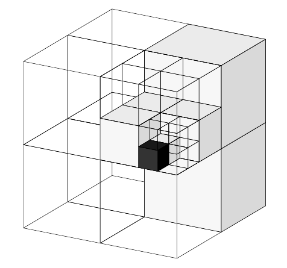
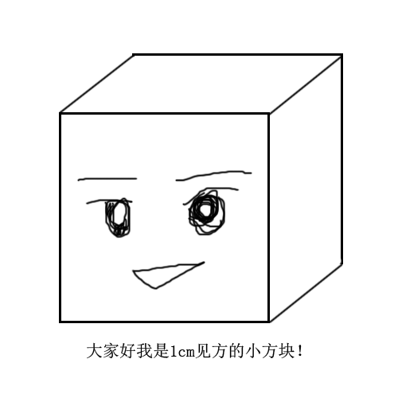
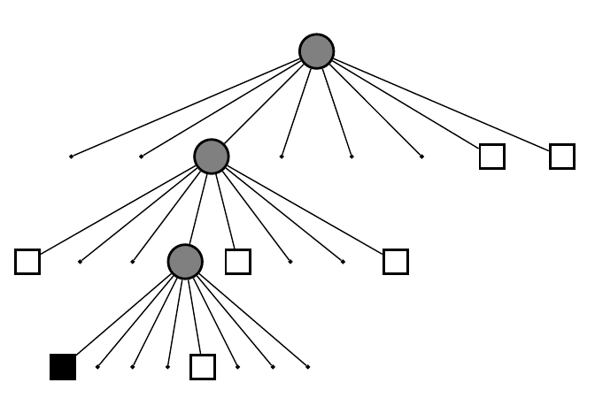

# Octomap

## 0.安装

## 1.Octomap简介

https://www.cnblogs.com/gaoxiang12/p/5041142.html

octomap是一种基于八叉树的三维地图创建工具, 可以显示包含无障碍区域及未映射区域的完整3D图形, 而且基于占有率栅格的传感器数据可以在多次测量中实现融合和更新; 地图可提供多种分辨率, 数据可压缩, 存储紧凑. 事实上, octomap的代码主要包含两个模块: 三维地图创建工具octomap和可视化工具octovis。
相比点云，能够省下大把的空间。octomap建立的地图大概是这样子的：（从左到右是不同的分辨率）

由于八叉树的原因，它的地图像是很多个小方块组成的（很像《我的世界》这种沙盒类游戏）。当分辨率较高时，方块很小；分辨率较低时，方块很大。每个方块表示该格被占据的概率。因此你可以查询某个方块或点“是否可以通过”，从而实现不同层次的导航。简而言之，环境较大时采用较低分辨率，而较精细的导航可采用较高分辨率。

### 1.1八叉树的表达

　　八叉树，也就是传说中有八个子节点的树！是不是很厉害呢？至于为什么要分成八个子节点，想象一下一个正方形的方块的三个面各切一刀，不就变成八块了嘛！如果你想象不出来，请看下图：

 

　　实际的数据结构呢，就是一个树根不断地往下扩，每次分成八个枝，直到叶子为止。叶子节点代表了分辨率最高的情况。例如分辨率设成0.01m，那么每个叶子就是一个1cm见方的小方块了呢！

　　

　　每个小方块都有一个数描述它是否被占据。在最简单的情况下，**可以用0－1两个数表示（太简单了所以没什么用**）。**通常还是用0～1之间的浮点数表示它==被占据的概率==**。0.5表示未确定，越大则表示被占据的可能性越高，反之亦然。由于它是八叉树，那么一个节点的八个孩子都有一定的概率被占据或不被占据啦！（下图是一棵八叉树）

　　用树结构的好处时：**当某个节点的子结点都“占据”或“不占据”或“未确定”时，就可以把它给剪掉**！换句话说，如果没必要进一步描述更精细的结构（孩子节点）时，我们只要一个粗方块（父节点）的信息就够了。这可以省去很多的存储空间。因为我们不用存一个“全八叉树”呀！

### 1.2 八叉树的更新

