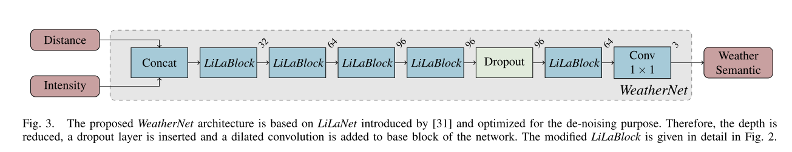
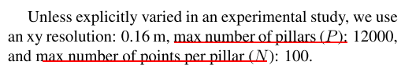
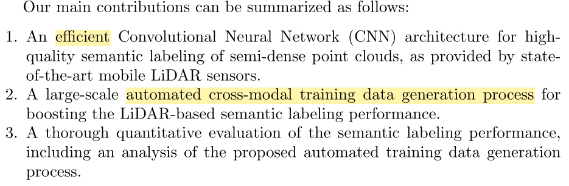

[TOC]

### 1.Drosophila-Inspired 3D Moving Object Detection Based on Point Clouds

#### keys:

proposed a novel bio-inspired 3D moving object detection approach. It is composed of two stages. 

In the first stage, the coarse-to-fine motion detector searches the motion area based on the EMD model and extract the moving point clouds to form object proposals. 

In the second stage, the point clouds of the proposals are segmented into foreground and background,Our network then classifies the foreground points and predicts the 3D boxes.

### 2.SLAM in dynamic environments via ML-RANSAC

SLAM和动态目标检测跟踪结合在一起,并不是分成两个部分去做


### 3.DynaSLAM: Tracking, Mapping, and Inpainting in Dynamic Scenes

基于ORB-SLAM2

维护一张静态地图,并且合成没有动态物体的RGB图片,并且对有遮挡的部分进行补全


### 4.SegMatch: Segment based Place Recognition for 3D point clouds-2017-ICRA

**两个问题:**

1.是否使用了语义信息

2.segment是什么含义

3.如何进行匹配matching,rt如何获得

**主要思想**:segment matching

算法代码已经开源,看完这个系列的论文之后再决定是否跑源码


### 5.Fog removal using laser beam pentration,laser intensity,and geometrical features for 3D measurement in fog-filled room

2016 

**问题：**

1.去除fog的流程

下面有贴图，先体素化，提取特征值，和intensity一起组成特征，使用SVM分类

2.怎样识别错误点云数据并进行修正的？


3.怎样使用SVM以及KNN进行分类的？

#### 1.Introduction

1. 毫米波雷达和超宽带雷达别广泛用于在heavy-fog中测距，是它们的空间分辨率很低；

2. Lidar的空间精度更高，虽然多回波功能可以穿过fog测量物体，但是仍然会存在很多错误数据和测距错误；
3. This study proposes a method for fog detection and elimination from 3D point cloud data measured in fog-filled environments.


==c,d是建图的效果吗？？不像是直接测量得到的==

#### 2.Related work

1. 摄像头方案，光流分析烟雾的运动，但是无法处理heavy-fog
2. 热成像摄像头 Thermal cameras may be an effective solution for 3D measurements in heavy fog
3. 毫米波雷达、超宽带雷达和超声波传感器拥有比激光雷达更长的波长，可以穿过烟雾，但是它们测距精度较低；
4. 使用点云分类算法检测坏点
5. 反射强度＋几何信息[11]

#### 3.Method

1. 自然雨雾的颗粒大小为１-30um,激光雷达波长905 nm位于其中

2. 由烟雾引起的错误测量和距离错误；

3. This study pro-poses a feature-based fog elimination method. The laser intensity, geometrical features, and laser penetration are used as features. Machine learning techniques (SVM and
   KNN) are used for classification.

4. Eigenvalues are selected as geometrical features because the fog data has a wide dis-tribution in the local area, and the eigenvalues can represent the variation in 3D space.

5. This classification requires features that classify the point cloud data into fog and background objects.

6. 五个特征：见下面截图

7. To obtain eigenvalues, the 3D point cloud data are divided into the voxel space V = {v1, v2, … vi, …, vN}. Each voxel is analyzed using principal component analysis.

   根据PCA的计算过程，首先计算每个voxel中的协方差矩阵，然后得到三个特征向量$$\lambda_0>\lambda_1>\lambda_2$$

   用特征值之间的比值将３维特征值特征降维到２维：


The average received laser intensity of the point cloud in each voxel is used as f3


8. The distance error is corrected using a distance error correction method.

#### 4.Evaluation

1. 整体流程


### 6.CNN-based Lidar Point Cloud De-Noising in Adverse Weather

2020-ICRA

**问题：**

1.基于几何滤波的有哪些方法？

2.训练数据怎样产生？

3.去雾的流程？

#### 1.Introduction

1. 基于空间信息的去噪算法：

   De-Noising of Lidar Point Clouds Corrupted by Snowfall

2. 提出了一种数据增强方法在良好天气中仿真恶劣天气

   Seeing Through Fog Without Seeing Fog: Deep Sensor Fusion in the Absence of Labeled Training Data

#### 2.Related Work

**A. Dense Point Cloud De-Noising**

2D depth image:

(1)Spatial smoothing filter:

高斯低通滤波器，中值滤波器，双边滤波器

(2)Statistical filter methods:

==最大似然估计==或者==贝叶斯统计==

(3)segment-based filters:

区域生长、最大后验估计、边缘检测

**B. Spase Point cloud De-Noising**

1. 基于空间临近或者统计分布的噪点去除：

   statistical outlier removal (SOR)

   radius outlier removal (ROR) filter

   dynamic radius outlier removal (DROR) filter
   
2. In addition, sparsity is not a valid feature to filter scatter caused by fog or drizzle, as soon as the density of the distribution of water drops increases

**C. Semantic Segmentation for Sparse Point Clouds**

point cloud转成图像然后输入二维网络：

BEV or range-image

#### 3.Method

**A. Lidar 2D Images**

投影到圆柱面，得到距离图和强度图

**B. Autolabeling for Noise Caused By Rain or Fog**

在静止的干净场景,采集f帧lidar image 图像,累积起来

在同样的场景中加入雨雾等,再采集lidar Image,和这f帧参考图像直接相减,根据差值判断是否为加入的雨雾信息


**C.Data Augmentation**


#### Net





### 7.A Probability Occupancy Grid Based Approach for Real-Time LiDAR Ground Segmentation

2019

问题：

1.怎样进行运动补偿的？

2.概率是怎样获得的？

3.斜率函数slope function怎样使用的？

#### Related Work

1.A naive approach could discard all points which are under a certain predefined height.

2.A slightly better approach is accomplished through the application of the Random Sample Consensus
(RANSAC) for fitting the ground model in the presence of many data outliers

3.上面两种方法在不是平整的地面上表现不好

4.Fastsegmentation of 3D point clouds for ground vehicles：值得阅读实现

#### Method

1.outline


**A. LiDAR Motion Distortion and Correction**

1.Therefore, Iterative Closest Point (ICP) algorithm based on Kd-tree is proposed to align the point clouds.

2.根据点到无人车的距离，把点云分成三个区域，小于五米的内心圆形区域是其他两个区域的“参考”


**B. Probability Occupancy Grid Map Modeling (OGM)**

1.构建极坐标栅格地图


$$
M=\begin{Bmatrix}
B_i^j|0<i\leqslant m,0<j\leqslant n
\end{Bmatrix}
$$


m是径向bin的个数，n是seg的数量

 Each bin is being evaluated as one of two states: ground or non-ground.

2.概率占据栅格问题的**目标**是在给定历史传感器观测$$z_{1...k}$$和position of sensor$$x_{1...k}$$的情况下估计每一个bin的占据概率(Pr)


Unfortunately, the dimensionality of the problem to besolved is huge since there are $$2^{|m·n|}$$ possible states. 
假设栅格之间条件独立：


Thus, the problem is transformed to be evaluating the state of each individual grid


### ==8.Learning-based Path Planning for Autonomous Exploration of Subterranean Environments==

2020 **ICRA**

问题：

1.是否


**核心:**

在此我们提出学习型勘计划器(LBPlanner),旨在提供规划性能类似于GBPlanner，但在计算成本大量减少,同时减少了对保持环境的一致的在线重建地图的需求。

利用最近提出的基于图的路径规划器GBPlanner作为“训练数据”，使用模仿学习的方法，得到了一种能够指导机器人自主探索井下巷道和隧道的训练策略。

传统的探索路径规划算法需要致密采样,详细的碰撞检测和体积增益计算,还有占用地图表示的地图,需要大量的计算时间和计算资源

LBP解释了典型隧道的拓扑特征：多分支、很长的路径等

LBP并没有使用传统的体素表示法比如octomap对环境进行建模，而是使用滑动窗口内的雷达观测

#### related work

机器人对未知环境的探索

1.

未知空间的体积探测一直是由基于边界frontier-based的方法[15]解决的，其中路径规划算法的目标是主动引导机器人走向其传感器感知范围的边界

这是一种贪心的策略，每次走到最远的地方，这样机器人可能会反复经过同一个地点，效率不高；

2.

类似地，基于采样的方法也被使用，其目的是采样“next–best–view”，以最大限度地扩大对未知空间的体积观测。

3.

多目标规划，多层规划，局部规划和全局重规划结合

4.

机器学习用来导航

Learning to plan via neural exploration-exploitation trees

#### 问题陈述

M:整体地图

M_E:已经探索的

M_U:未探索的

d_max:深度传感器S的最远有效观测距离,F_H,F_V是它的水平和垂直视角

机器人在t时刻的状态:[x_t,y_t,z_t,heading_t]


#### PROPOSED APPROACH

##### A.使用专家规划器进行模仿学习


### 9.Second: Sparsely embedded convolutional detection

2018

问题：

1.空间稀疏卷积的定义，结构以及代码实现；

2.新的角度损失函数的定义；

3.数据增强技术的实现过程


1.见稀疏卷积.md

2.使用sin()函数代替

3.把ground truth中的物体放到一个集合里面,然后随机把它们添加进一帧点云中,还有加噪声等操作

#### Related Work

1.Front-View- and Image-Based Methods Methods

2.Bird’s-Eye-View-Based Methods

MV3D

A key problem with all of these approaches, however,is that many data points are dropped when generating a BEV map, resulting in a considerable loss of information on the vertical axis.

3.3D-Based Methods

#### SECOND Detector

**1.Network Architecture**


**1.1 pointcloud grouping**

follow the simple procedure described in voxelnet to obtain a voxel representation of
point cloud data

We first preallocate buffers based on the specified limit on the number of voxels;
then, we iterate over the point cloud and assign the points to their associated voxels, and we save the
voxel coordinates and the number of points per voxel.

我们首先根据对体素数量的指定限制预先分配缓冲区;然后，我们在点云上迭代并将点分配给它们相关的体素，并保存体素坐标和每个体素的点数

We check the existence of the voxels based on a hash table during the iterative process.

在迭代过程中，基于哈希表，检查体素是否存在。

If the voxel related to a point does not yet exist, we set the corresponding value in the hash table

如果一个点关联的体素还没有存在，在哈希表中设置相关的值

otherwise, we increment the number of voxels by one

否则，将相应的体素中点数加一。

The iterative process will stop once the number of voxels reaches the specified limit.

Finally, we obtain all voxels, their coordinates and the number of points per voxel for the actual number of voxels.

体素数量，根据检测类别不同来设定，把**点云进行裁切**

车辆一类：[0,70.4] [-40,40] [-3,1] m

行人，自行车：[0,48] [-20,20] [-3,1] m

对于小型模型，为了提高推理速度，将点云裁切为：

[0,52.8] [-32,32] [-3,1] m

The cropped areas need to be slightly adjusted based on the voxel size to ensure that the sizes of the generated feature maps can be correctly downsampled in the subsequent networks.

裁剪区域需要根据体素大小进行轻微调整，以确保生成的特征图大小可以在后续的网络中正确地下采样。

体素尺寸大小：

vD = 0.4 × vH = 0.2 × vW = 0.2 m.

对于车辆检测任务，每个体素中点数最大为T=35,

which is selected based on the distribution of the number of points pervoxel in the KITTI dataset;

对于行人和自行车，T=45

**1.2 Voxelwise Feature Extractor**

使用和VoxelNet中的方法提取每一个voxel的特征


As a whole, the voxelwise feature extractor consists of several VFE layers and an FCN layer.

2个VFE层，一个全连接层

==**VoxelNet中的描述**==


**Voxel Partition**

Suppose the point cloud encompasses 3D space with range D, H, W along the Z, Y, X axes respectively

We define each voxel of size vD, vH, and vW accordingly.

The resulting 3D voxel grid is of size D^'^ = D/vD,H^'^ = H/vH,W^'^ = W/vW. Here, for simplicity, we assume D, H, W are a multiple of vD, vH, vW

**Grouping**

We group the points according to the voxel they reside in.

Therefore, after grouping, a voxel will contain a variable number of points.

**Random Sampling**

To this end, we randomly sample a fixed number, T, of points from those voxels containing more
than T points.

This sampling strategy has two purposes,
(1) computational savings
(2) decreases the imbalance of points between the voxels which reduces the sampling bias, and adds more variation to training.\

==**Stacked Voxel Feature Encoding**==


1. 对于一个非空的`voxel`:  $V=\{p_i=[x_i,y_i,z_i,r_i]^T\in R^4\}_{i=1,2,...t}$,t<=T   

2. 首先计算t个点的质心,记为$(v_x,v_y,v_z)$

> 把每个点到质心的偏移量和原始信息组合起来,形成输入网络的7维特征:

3. $V_{in}=\{\hat{p_i}=[x_i,y_i,z_i,r_i,x_i-v_x,y_i-v_y,z_i-v_z]^t\in R^7\}_{i=1...t}$

4. 将其输入FCN,得到一个特征向量$f_i\in R^m$,编码了体素内的形状
5. 对于从体素中提取到的t个$f_i$,进行最大池化,得到$\tilde f\in R^m$,作为$V$的==局部聚合特征==
6. 最后,把$\tilde f 和 f_i$拼接在一起形成point-wise特征输出$f^{out}_i=[f^T_i,\tilde f^T]^T\in R^{2m}$
7. 一个非空`voxel`经过一个`VFE`得到输出特征$V_{out}=\{f^{out}_i\}_{i=1...t}$
8. All non-empty voxels are encoded in the same way and they share the same set of parameters in FCN
9. 上一次的输出$V_{out}$作为下次`FCN`的输入$V_{in}$,继续提取特征,从`3`开始重复

> point-wise ==> voxel-wise

最后一层VFE的输出经过一个`FCN`,再maxpooling,得到voxel-wise 特征

==//End VoxelNet==

**1.3 Sparse Convolutional Middle Extractor**

`Spatially-sparse convolutional neural networks`首先提出空间稀疏卷积

In this approach,output points are not computed if there is no related input point.

As an alternative to normal sparse convolution,submanifold convolution [27] restricts an output location to be active if and only if the corresponding input location is active.

下面是关于稀疏卷积的计算和优化

==很复杂，先跳过去。。。==

**1.4 Region Proposal Network**

In this work, we use a single shot multibox detector (SSD)-like [32] architecture to construct an RPN architecture.

The RPN architecture is composed of three stages.

Each stage starts with a downsampled convolutional layer,which is followed by several convolutional layers. After each convolutional layer, BatchNorm and ReLU layers are applied. We then upsample the output of each stage to a feature map of the same size and concatenate these feature maps into one feature map. Finally, three 1 × 1 convolutions are applied for the prediction of class, regression offsets and direction.


**1.5 Anchors and Targets**

Because the objects to be detected are of approximately fixed sizes, we use **fixed-size anchors** determined based on the means of the sizes and center locations of all ground truths in the KITTI
training set with rotations of 0 and 90 degrees.

Each anchor is assigned a one-hot vector of classification targets, a 7-vector of box regression
targets and a one-hot vector of direction classification targets.

7维的回归目标：


**2.Training and Inference**

**2.1 Loss**

**Sine-Error Loss for Angle Regression**

为了解决`VoxelNet`中角度损失函数存在的问题:0和pi表示一个方向,但是损失却很大,提出一种新的角度损失函数:
$$
L_\theta=SmoothL1(sin(\theta_p-\theta_t))
$$


**Focal Loss for Classification**

**2.2. Data Augmentation**

==数据增强==

**Sample Ground Truths from the Database**

First, we generated a database containing the labels of all ground truths and their associated point cloud data (points inside the 3D bounding boxes of the ground truths) from the training dataset. Then, during training, we randomly selected several ground truths from this database and introduced them into the current training point cloud via concatenation. Using this approach, we could greatly increase the number of ground truths per point cloud and simulate objects existing in different environments.

**Object Noise**


**Global Rotation and Scaling**


**2.4 Network Details**

有两种网络,大的和小的

对于大网络,`VEF`层是`VFE(32)`和`VFE(128)`

+ 原始是`10*400*352`的稀疏`voxel`,输入网络是`7*10*400*352`
+ 经过第一层`VFE`,变成`64*10*400*352`,经过第二层,变成`128*10*400*352`


### 10.PointPillars: Fast Encoders for Object Detection from Point Clouds

2019 CVPR

问题:

1.提取特征的方法?

2.点云的表示方法?

3.为什么要在SECOND的代码上面进行改变实现PointPillars?

回答:

1.

首先在xy平面进行固定栅格尺寸的栅格化,形成一个个的pillar,对于在每一个pillar中的点,除了xyz之外添加别的属性:

$r, (x_c, y_c, z_c), (x_p, y_p)$,得到一个9维的点,

下面对照论文中的网络结构图看会比较直观


然后把非空的pillar堆叠在一起,形成一个(D,P,N)的tensor,对每一个点进行PointNet提取特征,得到(C,P,N)的tensor,这是point-wise特征,

一个最大池化,得到pillar-wise的特征,形成(C,P)的tensor,可以这样理解,高C,宽P的矩阵,C是特征的维数,P是pillar的个数

最后,根据每一个pillar的index,把这个(C,P)大的每一列都放到H*W的栅格上,这里的H,W就是第一步栅格化后的栅格map尺寸大小,C是特征维数,这就形成了一张伪图像;

2.点云表示为pillar,正方形的柱子

3.架构相似,相同的损失函数,相同的anchor策略


**1.introduction**


**2.PointPillars Network**

PointPillars以点云为输入,估计车辆,行人,骑行者的3D box,网络主要分为三个阶段:


(1)一个特征编码网络,将点云转化为2D伪图像pseudo- image;

(2)一个2D卷积backbone将(1)中的伪图像转化为高级的表示;

(3)一个检测头dection head,检测并回归出3D框

**2.1 Pointcloud to Pseudo-Image**

To apply a 2D convolutional architecture, we first con-vert the point cloud to a pseudo-image.

+ 第一步,将点云投影到x-y平面,等间距栅格化,得到一个pillar的集合
+ 第二步,栅格化后,对每一个pillar中的点属性进行增强,增加$r, x_c, y_c, z_c, x_p, y_p$,r:反射率,下标c表示到pillar中所有点的几何中心的偏移,下标p表示到pillar的xy中心的偏移,最后和x,y,z加起来能得到9维的点,比voxelnet多了两个:$x_p, y_p$

==增加6个属性的含义:==


​	由于点云的稀疏性,大多数pillars都是空的,非空的pillar中通常也只有几个点,==这种稀疏性得到了利用==:


+ 第三步,得到致密的tensor:(D,P,N)

  D:每一个点的特征维数

  P:非空pillar个数

  N:每一个pillar中点的数量

  If a sample or pillar holds too much data to fit in this tensor, the data is randomly sam- pled. Conversely, if a sample or pillar has too little data to populate the tensor, zero padding is applied.

> ==**有个问题:**==
>
> 对于一个点(x,y,z),怎样确定(P,N)坐标?

+ 第四步,用一个简化版的PointNet:FC+BN+ReLU处理每一个点,得到(C,P,N)的tensor
+ 第五步,最大池化,得到(C,P)的tensor
+ 第六步,编码完成后,特征被分散回原来的pillar位置,得到一个(C,H,W)的伪图像

**2.2 Backbone**

使用和VoxelNet中类似的backbone:


有两个子网络构成:

Head一个自上而下的网络以越来越小的空间分辨率(?)产生特征，另一个网络对自上而下的特征进行上采样和连接

**2.3Detection Head**


**3.Implementation Details**

**3.1 Network**


**3.2 Loss**

使用和SECOND相同的损失函数


**4.Experimental setup**



**预测步骤:**


### 11.Falco: Fast likelihood‐based collision avoidance with extension to human‐guided navigation

**Journal of Field Robotics**

**快速基于可能性的避碰扩展到人类导航**

2020 zhang ji

**问题:**

1.如何对环境进行建模,确定性已知 概率性已知?

2.怎样实现最大化到达目标点可能性的导航?

3.支持在没有先验地图的情况下工作,怎样工作的?

4.human guidance怎么使用的?

5.怎样应用在道路上行驶,在地图的边上行驶?


**答案:**


#### 摘要:

我们提出一种规划方法，以在混乱复杂的环境中实现快速自主飞行。

通常，在复杂环境中进行自主导航需要对由k-连接的网格或概率方案生成的图(graph)进行连续搜索。

当车辆行驶时，用来自车载传感器的数据更新图是昂贵的，尤其是在路径必须是运动学上可行的情况下，在图上的搜索也是如此。

我们建议避免在线搜索以减少计算复杂度。==我们的方法在两个单独的区域中对环境进行了不同的建模==。

障碍被认为在传感器范围内是确定性已知的，而在传感器范围之外是概率已知的。本方法不是搜索成本最低的路径（通常是最短的路径）,而是最大化确定导航下一步的目标的可能性。

有了这样的问题表述，使用轨迹库实现的在线方法可以使用调制解调器嵌入式计算机上的单个中央处理单元线程在0.2-0.3毫秒内确定路径。该方法支持使用和不使用先验地图的两种配置。两种配置均可用于规划目标。此外，后者可以允许人类通过定向输入进行导航的导航。

在实验中，它使轻型无人机能够在复杂的森林环境中以10 m / s的速度飞行。

#### 1.Introduction

典型路径规划的方法是使用分层方法，将规划问题分成两个子问题。

第一个问题解决了一个全局规划问题，可能借助于一个启发式算法来确保路径不会陷入局部极小。

第二个问题同时并行解决了一个的局部规划问题，以跟踪全局路径并进行避障;

提出了一种大量减少计算量的方法:

使低计算复杂度成为可能的关键思想是==避免在线搜索==

我们不再搜索由机载传感器不断更新的图，而是从可能性的角度制定规划问题,寻找一条路径,到达下一步目标的可能性最大,这是通过在==两个单独的区域==中对配置空间进行不同的建模

在传感器范围内，障碍物被认为是确定已知的，因为它们被机载传感器感知到，在传感器范围之外是概率已知的，因为它们来自先验地图。

使用一个轨迹库用于跨传感器范围的概率桥接，其中==轨迹被分成组==,在导航的过程中,论文中的方法==评价每一个组来确定路径==;


### 12.Boosting LiDAR-based Semantic Labeling by Cross-Modal Training Data Generation

问题:

1.网络架构是怎样的

2.自动标注怎样实现

3.算法耗时如何?

4.在rangenet++中有提到这篇工作吗?


#### Introduction

1.We show that the datasets obtained with thisapproach significantly boost the LiDAR-based semantic labeling performance,in particular when augmented with a small manually annotated dataset for fine-tuning.

2.



#### Related Work

1.RGB-D

2.直接处理点云

​	PointNet,PointNet++:室内表现较好,室外不太行

​	PointCNN

3.在直角坐标系 表示 点云 : 计算量太大 预测太慢

​	Voxel (SEGCloud) or an OctTree (OctNet)

4.输入点云 转换成 2D 图像

俯视图用于 道路 检测 Fast LIDAR-based Road Detection Using Fully Convolutional Neural Networks

柱面投影

#### Method

**1.LiDAR Images**

点云进行圆柱投影

对于没有返回的点,在range-image中设为无效

**2.Class Mapping**

Mapping of the Cityscapes label set [1] to the reduced LiDAR label set

**3.LiLaNet Network Architecture**

To cope with the low resolution and extreme asymmetry in the aspect ratio of the used LiDAR
images, we propose a dedicated network block called LiLaBlock, which is inspired by the GoogLeNet inception modules .


**4.Autolabeling**

由于数据的稀疏还有比图像多了一个维度 ,手工标注3D样本,很费时,很困难

所以,提出了一种自动标注方法:


一个相机视角不足,使用多个相机


**Point Projection**


先用一小部分的人工标注数据进行训练,然后用autolabeling得到的数据进行fintuning


### 13.What You See is What You Get: Exploiting Visibility for 3D Object Detection

问题:

1.可见性的概念

2.怎样进行ray-casting

一个物体后面的区域会被遮挡

once a particular scene element is measured at a particular depth, visibility ensures that all other scene elements behind it along its line-of-sight are occluded.

Indeed, representing a LiDAR sweep as a collection of (x, y, z) points fundamen-tally destroys such visibility information if normalized (e.g.,when centering point clouds).


当输入数据是传感器采集到的数据时,比如雷达,需要考察点云的不确定性.


#### Compute Visibility through Raycasting Physical

However, coordinates are by no means the only information offered by such active sensing. Crucially, it also provides estimates of freespace along the ray of the pulse.

点和自由空间之间的**因果关系**,点出现在自由空间结束的地方,通过从传感器原点画一条线到一个3D点可以实现这一过程

计算这条线段中所有的体素,线段上的体素被标记为"free",除了最后一个包含三维点的体素被标记为"occupied"

这样,所有的体素都被标记为占用,空闲和未知三种状态

**Efficient voxel traversal:**

利用点云的稀疏性对体素进行高效的遍历

对于一条给定的射线,我们只需要遍历在这条射线上的体素,

直观来说,在遍历的过程中,算法枚举当前体素的6轴邻居去确定哪些与当前射线相交.

然后它简单地向具有 共面 的邻近体素前进

算法从原点处的 体素 出发,到3D点占据的体素时终止(占据是预先计算好的)

为了减少聚集体素状态时的离散化效应,遵守Octomap(5.1)中列出的最佳实践

**Online occupancy mapping**

We follow Octomap [9]’s formulation and use their off-the-shelf hyper-parameters, e.g. the log-odds of observing freespace and occupied space

代码:https://github.com/peiyunh/wysiwyg


### 14.A Fast Voxel Traversal Algorithm for Ray Tracing


遍历算法分为两个阶段:

The equation of the ray is:
$$
\vec u + t \ \vec v \ for \ t\ge0 \\
\vec u=[X,Y]  \ 起始点\\
\vec v=[kX,kY] \ 斜率
$$
$$
t \in [0,1]
$$

> 可以这么理解:
>
> u:起点
>
> e:终点
>
> v:速度
>
> t:一秒
>
> 射线ray在一秒之内,可以从u移动到e

1.初始化

确认ray开始的体素,如果射线的原点在网格外，我们找到射线进入网格的点，并取相邻的体素

整形变量X,Y初始化为开始体素的坐标

变量stepX和stepY被初始化为1或-1，表明当射线穿过体素边界时X和Y是增加还是减少(这是由$\vec v$的X和Y分量的符号决定的)

下一步,确定射线穿过第一个体素竖直边界的t值(即用的时间),存在变量`tMaxX`中,`tMaxX=1/v.x`,

​			 确定射线穿过第一个体素水平边界的t值(即用的时间),存在变量`tMaxY`中,`tMaxY=1/v.y`,			

最后,计算`tDeltaX,tDeltaY`,水平穿过一个竖直边界的时间`tDeltaX=1/v.x`,竖直穿过一个水平边界的时间`tDeltaY=1/v.y`

2.增量遍历

```
loop{
	if(tMaxX < tMaxY) {
		tMaxX = tMaxX + tDeltaX; // 水平方向时间自增,竖直方向保持不变
		X = X + stepX;			 // 水平方向体素坐标自增,竖直方向保持不变
	} else {
		tMaxY = tMaxY + tDeltaY;
		Y = Y + stepY;
	}
	NextVoxel(X,Y)
}
```

### 15.Real-time Soft Body 3D Proprioception via Deep Vision-based Sensing

通过深度视觉进行实时的软体3D检测

ICRA 2020

问题:


### ==16.Efficient and Robust LiDAR-Based End-to-End Navigation==

代码即将开源:https://le2ed.mit.edu/

**问题:**

1.怎样得到预测的不确定性的

2.模型的输入输出是什么

3.怎样控制车辆行驶的

4.在gps缺失还有导航地图不准确的情况下,表现如何?有哪些策略?


#### Introduction

1.不使用高精度地图,使用弱定位信息和稀疏的拓扑地图实现点到点的导航

> [5] “Variational End-toEnd Navigation and Localization,”  (ICRA), 2019.
> [6]  “Urban Driving with Conditional Imitation Learning,”  (ICRA), 2020

不过5,6高度依赖图像,但是图像很容易受到影响,而lidar不会


2.lidar数据量太大,很多工作都是将3D转为2D来做,这样计算效率很高,但是损失了原始点云中关键的深度信息.


3.实际的无人驾驶导航不仅仅需要高效,精确,更需要稳定鲁棒,但是端到端的模型非常容易受到噪声的影响,不够稳定.

为了解决这个问题,一个可行的解决办法是利用多帧的时序信息,多帧作为输入

> End-to-End Learning of Driving Models from Large-Scale Video Dataset,CVPR,2017

但是这样做对于3D数据来说,很不高效,

相反，通过==训练一个模型来额外预测未来的控制==，并应用里程数校正的融合，驱动命令可能会稳定下来。

此外，通过考虑未来行为中的潜在歧义以及意料之外的分布外(OOD)事件(如传感器故障)，捕捉与每个预测相关的模型的置信度可以实现更大的鲁棒性。


**4.主要贡献;**

+ 高效的点云处理网络 Fast-LiDARNet,直接处理原始的3D点云数据

+ Hybrid Evidential Fusion,混合证据融合,

  一种新的不确定性感知融合算法，该算法直接学习预测的不确定性，自适应融合相邻帧的预测，实现鲁棒自主控制

#### related work

##### End-to-End Autonomous Driving

一些使用稀疏的拓扑地图来导航的工作:

> Autonomous Vehicle Navigation in Rural Environments Without Detailed Prior Maps  (ICRA), 2018
>
> “MapLite: Autonomous Intersection Navigation Without a Detailed Prior Map,”  (RA-L), 2019.
>
> “OpenStreetMap: User-Generated StreetMaps,” IEEE Pervasive Computing, 2008.
>

这些方法很大程度上是基于规则的,和端到端的方法相比没有优势

近期的一些工作将视觉与深度信息融合,来改善控制,但是它们把3D信息投影到2D,损失了关键的几何信息.

##### Hardware-Efficient LiDAR Processing

高效的点云处理

##### Uncertainty-Aware Learning

不确定性学习

[35-37]

环境,传感器数据,决策的不确定性

> Uncertainty-Aware Short-Term Motion Prediction of Traffic Actors for Autonomous Driving
>
> Deep Orientation Uncertainty Learning based on a Bingham Loss
>
> Evaluating Uncertainty Quantification in End-to-End Autonomous Driving Control
>

这包括估计预测的不确定性，并系统地利用不确定性和控制决策来增加鲁棒性。


也可以使用贝叶斯网络来预测不确定性,这就不谈了


相反，证据深度学习**evidential deep learning**的目的是直接学习潜在的知识不确定性分布，使用神经网络估计不确定性，而不需要抽样;

> Deep Evidential Regression
>
> Evidential Deep Learning to Quantify Classification Uncertainty
>

##### Method


### 17.Ensemble of shape functions for 3D object classification

#### D2


**提取方法:**

从点云中随机采样点对,计算它们之间的距离,使用它们之间的距离构成直方图


### 18.Low-complexity Point Cloud Filtering for LiDAR by PCA-based Dimension Reduction

基于PCA做点云去噪

**问题:**

1.去噪的流程?

2.可以用来去除大面积的粉尘吗?


### 19.DeepGoal: Learning to drive with driving intention from human control demonstration

从人类控制 演示 中学习驾驶意图

**问题:**

1.有哪些端到端 的 模型?

2.怎样使用公共路线信息,类似导航地图的信息?可以不使用这个信息吗?

3.只是中间结果? 怎样使用这个信息? 和端到端有哪些不同?

4.怎样将传感器 从 camera 更换成 lidar

**答案:**


#### Abstract:

意图区域遵循道路的结构和公共线路规划(导航地图)中的目标方向,在没有传统的精确定位的情况下解决了无人车去哪里的问题;

然后将这个学习到的视觉意图投影到车体局部坐标系并和障碍物感知融合在一起,得到一张导航得分图;

整个系统的核心是一个 弱监督 cGAN-LSTM 模型,训练它来学习从人类演示到驾驶意图的映射;

#### 1. Introduction

**1.端到端的方法:**

[1] End to End Learning for Self-Driving Cars

[2] End-to-end driving via conditional imitation learning,

[3] End-to-end learning of driving models from large-scale video datasets,

**2.端到端 存在的问题:**

1. 单一的网络很难映射出非常复杂的关系,需要非常丰富的有监督数据,因为驾驶变化很多,所以数据非常庞大
2. 阻碍视觉传感器和其他测距传感器的中间 融合,这些测距传感器对避障很有帮助,因此,端到端不够安全,在高频控制回路中,一个很小的视觉误差就造成严重的后果;

**3.一些加入额外的路线规划作为网络的输入,比如说 路线图,方向引导**

[4] Intention-net: Integrating planning and deep learning for goal-directed autonomous navigation	

[5] End-to-end learning of driving models with surround-view cameras and route planners

[6] Conditional affordance learning for driving in urban environments

**4.**

为了解决end2end方法的挑战，我们专注于学习一种==可解释的表示==，遵循人类如何驾驶与路线规划的方式。

人类可能会依靠导航软件中规划的路线来确定通往目标的方向，然后利用道路语义等视觉线索来推断开车的方向;

有了目标导向区域，他们在不同的驾驶场景下执行灵活的车辆控制

具体的控制规则可能会改变，例如，沿着城市道路网的一个车道线行驶,或注意在校园中意想不到的障碍物;

然而，==目标导向视觉区域==总是根据局部道路情况形成，保持了整体的驾驶方向感，从而实现对车辆的控制。我们称这个区域为==驾驶意图==。

**5.pipeline**


1. 采用编码器-解码器结构，从图像感知和路径规划中学习上述驾驶意图

2. 对于 路径 规划,使用[5] 中的方法,借助导航软件给出的路径规划信息
3. 把驾驶意图区域 投影到 一个局部 导航得分地图上,和测距信息融合
4. 编码了目标方向信息的导航得分图可以直接用于接下来的运动生成(规划)

**6.**

为了避免在图像上对行驶意图区域的定义和手工标注,从人类演示中学习;具体地说，就是人控制车辆按照计划的路线向目标前进;

然后对每一个图像感知，其近地面可通行区域满足当前驱动意图，并可投影到图像平面上作为监督信息;

==一个挑战是,在每一个路口或者岔路的地方,驾驶演示只会覆盖一个单独的方向==,但是在测试的时候路线规划可能是不同的方向,只要驱动意图在视觉观察和局部路线规划上都是合理的，驱动意图就是有效的

==所以学习任务不是像素级别的模仿,而是结构的推理==

1. 所以使用一个弱监督的模型,使用cGAN-LSTM 网络,adversarial loss function;该网络学习生成一个与人操纵的真实区域难以区分的==虚假==驾驶意图区域;然后将生成的结果作为一个整体进行惩罚，隐式学习道路语义、规划意图以及它们之间的相关性

2. 使用LSTM单元来考虑时间连续性,来增强性能;

**算法的整体框架:**

左边是训练数据,图像+局部导航规划+人类演示,输入cGAN-LSTM,

右边是使用训练完成的模型进行测试,

输入图像和导航地图给出的引导方向,

输出驾驶意图区域,

然后和测距信息融合投影到导航得分图上,

生成运动规划的方向


**7.总结**

文章的贡献:

+ 开发了一种基于学习的汽车驱动系统。该系统从图像和低成本的gps路线规划中学习，无需精确定位即可获得带有方向信息的驾驶意图区域。该方法降低了end2end 方法的复杂性，可以有效地集成到模块化运动规划中
+ 从有限的单模态演示数据中,使用cGAN-LSTM学习

#### 2.Related work

传统的车辆控制包括:建图,定位,路径规划,运动规划,每一个模块的性能提升都很困难;

本节介绍两种基于学习的系统,它们旨在解决传统自动驾驶中存在的一些痛点:

**end2end, direct perception**

##### 2.1 end2end

出发点，传统系统架构的中间阶段的性能可能与最终目标(即车辆的控制)不一致。

[1] End to end learning for self-driving cars

第一个证明了CNN直接通过视觉输入控制车辆的强大能力;

[2] End-to-end driving via conditional imitation learning

通过有条件的模仿学习来学习驾驶模型来计算运动指令，该学习方法结合了高级指令输入，考虑了模仿学习的可重复性

[4] Intention-net: Integrating planning and deep learning for goal-directed autonomous navigation

从现有的局部路径规划(DWA)中采集控制指令,提出了一种两阶段方法来减轻对本地定位先验知识的依赖;

[5] End-to-end learning of driving models with surround-view cameras and route planners

使用360度的环视相机和从商业地图得到的规划信息来学习一个端到端的驾驶模型.基于RNN,使用GPS和公共地图生成转向角和速度;但是不可避免的会有人为干预.

[14] Variational end-to-end navigation and localization

估计一个变分网络以获得可能控制命令的完整概率分布； 然而，当结合特定的导航指示器时，它们仍然解决了某些控制命令的精确形式,输入和这篇文章类似;

##### 2.2 Direct perception approaches. 

另一个想法仍然实现了环境的中间表示，同时向车辆直接使用迈进了一步

[15] Deepdriving: Learning affordance for direct perception in autonomous driving

第一次提及这个概念,涉及到周围汽车和道路标记的多个距离回归任务

[16] Deep learning algorithm for autonomous driving using googlenet

对[15]进行了改进,使用了不同的CNN来映射从图像到规划提示

[17] Learning from maps: Visual common sense for autonomous driving

开发了一个利用公共谷歌街景和 OpenStreetMap 的模型，用于根据车载摄像头的图像推断道路布局和车辆相对姿态

[18] Find your own way: Weakly-supervised segmentation of path proposals for urban autonomy

可通行区域正是车辆之前访问过的区域，可以作为注释投影到图像中。

[18-20] : 可通行区域的检测

#### 3.Methods


##### 3.1. Weakly-supervised driving intention learning

**1.Network design**

驾驶意图学习被构建为结构推理过程，以遵循图像中的道路情况和局部路线规划中的规划意图。 由于人类演示仅涵盖每个岔路口和交叉路口的单个方向，而在测试期间可以提供通往不同目标的路线计划，因此学习不被视为像素级的模仿和回归。

GAN 由一个生成器和一个判别器组成

网络结构图:


conditional GAN + UNet + LSTM

参考:

[22] Image-to-image translation with conditional adversarial networks

它通过对抗性训练隐含地学习了它们的内在相关性，并且可以在通过对抗性训练与它们的内在相关性相结合时进行泛化以允许不同的驾驶意图，并且可以在面对新场景时进行泛化以允许不同的驾驶意图。

**2.Data preparation**

为了学习驾驶意图区域,需要感知图像,局部路线规划,驾驶意图区域的标注;

更重要的是,需要专门建立这些输入数据之间的相关性;

+ **Local route plan**

  局部路线规划信息的获取

  致力于按照人类的方式来获取本地路线计划，使用带有GPS信号的公共导航软件

  开发了一种离线路线渲染方法，它利用公共地图和车辆演示轨迹之间的空间对齐信息:

  **(a):**

  给定来自百度地图的公共地图数据，全局路线R的标注方式与导航软件相似

  **(b):**

  把全局路线 R 离散化,得到全局路线点 $R_d$

  **(c):**

  沿全局路线进行人类示范驾驶后，可以获得车辆姿态，如蓝点所示,记为$T_r$

  车辆位姿的获取,使用传统的定位算法,使用作者之前的工作[19]

  从车辆姿态到公共路线地图的**空间对齐**现在是对齐**两组平面点** $R_d$ 和 $T_r$的任务

  使用DTW(dynamic time warping)算法,DTW在时域中经常用来**匹配时间序列**

  **DTW将自动warping扭曲 时间序列（即在时间轴上进行局部的缩放），使得两个序列的形态尽可能的一致**，得到最大可能的相似度。

  

  通过分配每个路段的行进方向，可以在各种实验设置下裁剪不同的本地路线计划。

  

  对齐之后就获得了车辆每一个位姿下对应的局部路线规划图;

+ **Driving intention annotation**

  驾驶意图区域标注

  通过在指定路线规划下,在当前图像上投影车辆经过的区域来标注驾驶意图区域

  

  对于每个图像，车辆在近地面的未来姿态首先被投影到图像平面上,

  然后根据车辆宽度去扩大 这些位姿 来指示当前的驾驶意图

  这样得到的驾驶意图既满足 路线规划 也 满足 图像中的道路语义


### 20.Variational End-to-End Navigation and Localization

**变分网络 端到端 导航和定位**

建立了一种新的混合粗粒度路线图和原始感知数据的变分模型来直接学习自动驾驶汽车的转向控制。

我们演示了基于路线地图的确定性控制预测，各种不同的可能控制命令的可能性估计，以及基于地图的定位校正和位置识别。

我们制定了一个具体的姿态估计算法，使用我们学到的网络来推理机器人在环境中的定位，并证明在我们得到的姿态减少了不确定性(更大的置信度)

**问题:**

1.怎样实现点到点的导航的,需要哪些输入信息,输出是什么;

2.怎样实现在未知的地方进行定位和导航

3.怎样将传感器数据换成雷达的?


虽然最近有处理导航指令形式的扩展，但这些工作无法捕捉可能采取的行动的完整分布，并无法推断机器人在环境中的定位。

根据地图和观测到的可视道路拓扑之间的对应关系，受到人类驾驶员可以执行的粗略定位的启发,使用模型来定位;

可以在没有去过的地方进行点到点的导航


#### 1.Introduction

人类驾驶员有一种天生的能力，==即使在极其有限的观察下，也能对驾驶环境的高层结构进行推理==。

利用这种能力将==高级驾驶指令与具体的控制指令==联系起来，甚至在没有具体定位信息的情况下也能更好地定位自己;

受到这些能力的启发，我们开发了一个学习引擎，使机器人车辆能够学习如何在端到端自动驾驶系统中使用地图。

==粗粒度地图==为我们提供了对环境的更高层次的理解，这既是因为它们扩展了范围，也是因为它们经过提炼的性质。

这允许在具有长期目标的层次结构框架内推理低级控制，以及本地化、防止漂移和在可能的情况下执行循环关闭。


### 21.Maximum Likelihood Path Planning for Fast Aerial Maneuvers and Collision Avoidance

问题:

