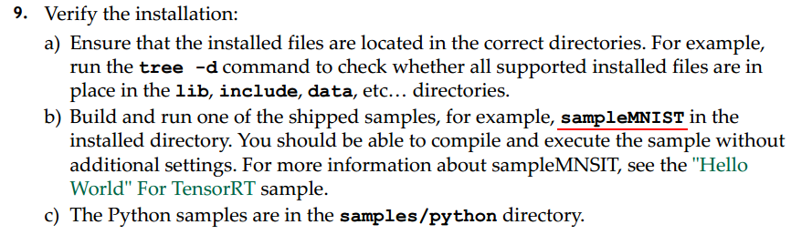

# PyTorch->ONNX->TensorTR

## 0.安装

`https://docs.nvidia.com/deeplearning/tensorrt/archives/index.html`

官网上有历史版本,点击`TensorRT Support Matrix`可以查看支持的软件版本,选择适合平台的.


本机各软件版本:

```
Ubuntu 16.04     
CUDA   10.1		nvcc --version
CUDNN  7.6.5    cat /usr/local/cuda/include/cudnn.h | grep CUDNN_MAJOR -A 2
```

参照官方安装教程进行安装:

step1:下载 

​	tar形式的安装包

step2:解压 

​	`tar xzvf TensorRT-6.0.1.5.Ubuntu-16.04.x86_64-gnu.cuda-10.1.cudnn7.6.tar.gz` 

step3:添加环境变量

```shell
gedit ~/.bashrc # 打开环境变量文件
# 将下面三个环境变量写入环境变量文件并保存
export LD_LIBRARY_PATH=TensorRT解压路径/lib:$LD_LIBRARY_PATH
export CUDA_INSTALL_DIR=/usr/local/cuda-10.1
export CUDNN_INSTALL_DIR=/usr/local/cuda-10.1
# 使刚刚修改的环境变量文件生效
$ source ~/.bashrc
```

不需要python接口,所以带python的都不安装

step4:确认是否安装成功

安装成功;



## 1.视频记录

[B站](https://www.bilibili.com/video/BV1Pe411x7qr)

[视频中源码地址](https://github.com/dlunion/tensorRTIntegrate)

### 1.1 python入门篇

### 1.2 PyTorch入门篇，numpy和torch讲解，分类器实现

### 1.3 PyTorch检测器实现

