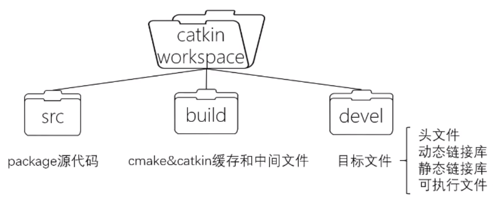
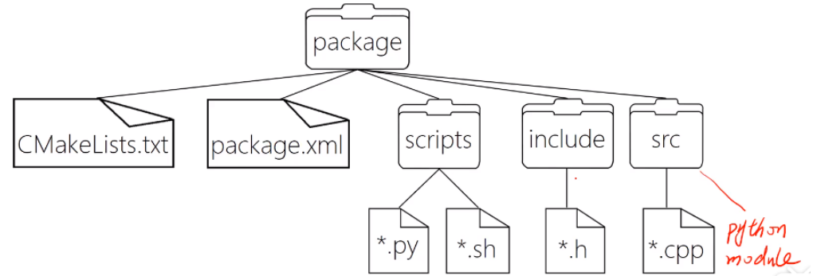
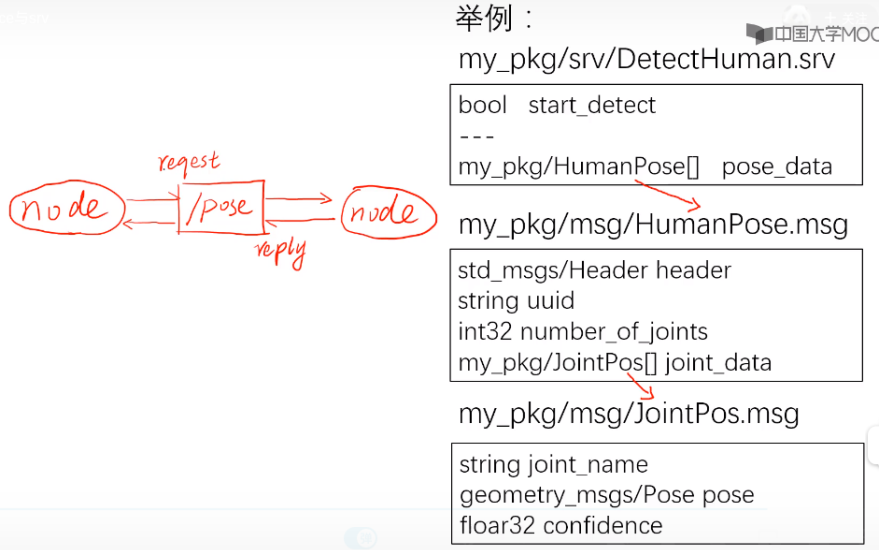
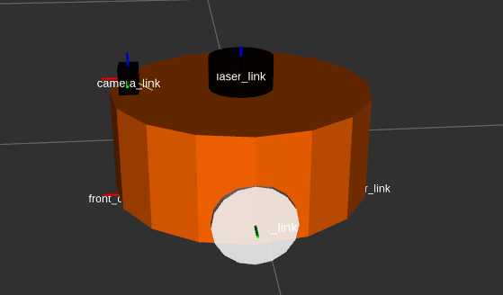
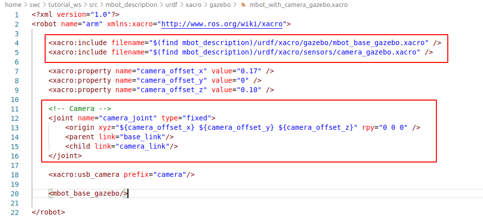

[TOC]
## 1.ROS介绍及安装

### 1.1 ROS简介


+ robot,laser,map,location,planner都是节点,采用分布式架构有很多好处,比如更换一个新的雷达,只要更换laser这个节点,通信什么的都不要更改.

ros提供的工具有：

+ 仿真
+ 数据可视化
+ 图形界面
+ 数据记录

ros提供了很多基础功能包:

+ 控制
+ 规划
+ 感知
+ 建图

### 1.2 ROS安装

#### 1.2.1 安装

① 添加sources.list
`$ sudo sh -c '. /etc/lsb-release && echo "deb http://mirrors.ustc.edu.cn/ros/ubuntu/ $`
`DISTRIB_CODENAME main" > /etc/apt/sources.list.d/ros-latest.list'`
		这一步配置将镜像添加到Ubuntu系统源列表中， 建议使用国内或镜像源， 这样能够保证下载速度。 本例使用的是中国科技大学的源。
② 添加keys
`		$ sudo apt-key adv --keyserver hkp://ha.pool.sks-keyservers.net:80 --recv-key 421C365B`
`D9FF1F717815A3895523BAEEB01FA116`

​		ROS官网`www.ros.org`上面有最新的keys,公钥是Ubuntu系统的一种安全机制， 也是ROS安装中不可缺的一部分。
③ 系统更新
`$ sudo apt-get update && sudo apt-get upgrade`

④ 安装ROS
		ROS中有很多函数库和工具， 官网提供了四种默认的安装方式， 当然也可以单独安装某个特定的软件包。 这四种方式包括桌面完整版安装、 桌面版安装， 基础版安装、 单独软件包安装。 推荐安装桌面完整版安装（ 包含ROS、 rqt、 rviz、 通用机器人函数库、 2D/3D仿真器、 导航以及2D/3D感知功能） ， 如下：
Ubuntu 16.04安装Kinetic版本
`$ sudo apt-get install ros-kinetic-desktop-full # Ubuntu 16.04`
Ubuntu 14.04安装Lndigo版本
`$ sudo apt-get install ros-indigo-desktop-full # Ubuntu 14.04`
如果你不想安装桌面完整版， 你还可以尝试以下三种方式安装：
		桌面版安装（ 包含ROS、 rqt、 rviz以及通用机器人函数库）
`sudo apt-get install ros-kinetic-desktop`
基础版安装（ 包含ROS核心软件包、 构建工具以及通信相关的程序库， 无GUI工具）
`sudo apt-get install ros-kinetic-ros-base`
单独软件包安装（ 这种安装方式在运行ROS缺少某些package依赖时会经常用到。 你可以安装某个指定的ROS软件包,使用软件包名称替换掉下面的PACKAGE）
`sudo apt-get install ros-kinetic-PACKAGE`
例如系统提示找不到slam-gmapping， 你就可以：
`sudo apt-get install ros-kinetic-slam-gmapping`
要查找可用的软件包， 请运行：
`apt-cache search ros-kinetic`


#### 1.2.2 配置ROS

配置ROS是安装完ROS之后必须的工作。
① 初始化rosdep
`$ sudo rosdep init && rosdep update`
这一步初始化rosdep， 是使用ROS之前的必要一步。 rosdep可以方便在你需要编译某些源码的时候为其安装一些系统依赖， 同时也是某些ROS核心功能组件所必需用到的工具。
② ROS环境配置
`#For Ubuntu 16.04`
`$ echo "source /opt/ros/kinetic/setup.bash" >> ~/.bashrc`
`#For Ubuntu 14.04`
`$ echo "source /opt/ros/indigo/setup.bash" >> ~/.bashrc`
注意： ROS的环境配置， 使得你每次打开一个新的终端， ROS的环境变量都能够自动配置好， 也就是添加到bash会话中， 因为命令 source /opt/ros/kinetic/setup.bash 只在当前终端有作用， 即具有单一时效性， 要想每次新开一个终端都不用重新配置环境， 就用echo语句将命令添加到bash会话中。
③ 安装rosinstall

​		rosinstall 是ROS中一个独立分开的常用命令行工具， 它可以方便让你通过一条命令就可以给某个ROS软件包下载很多源码树。 在ubuntu上安装这个工具， 请运行：
`		$ sudo apt-get install python-rosinstall`

#### 1.2.3 比较好用的ros ide RoboWare studio

未果

没有找到安装包,官网好像挂了

github:https://github.com/tonyrobotics/roboware-studio

## 2.ROS的工程结构/文件系统


### 2.1 catkin   工作空间

catkin: ROS定制的编译构建系统,是对CMake的扩展,

在工作空间组织和管理功能包的文件夹,用catkin工具来编译

查看工作空间

`printenv | grep ROS`

有时候会用到catkin命令,使用命令行安装:

`sudo apt install python-catkin-tools`

#### 2.1.1 建立工作空间

`$ mkdir -p tutorial_ws/src #创建catkin工作空间`(名字自定义,但是要有src文件夹)

`$ cd ~/catkin_ws #回到工作空间,catkin_make必须在工作空间下执行`
`$ catkin_make #开始编译`
`$ source ~/catkin_ws/devel/setup.bash #刷新坏境`   !!!!  要把这句话写进~/.bashrc里面

```bash
sudo gedit ~/.bashrc
source ~/.bashrc
```

===新的工作空间路径要添加到最后,不然会自动忽略!!!==

确认环境变量添加成功：`printenv | grep ROS`

或者

`echo $ROS_PACKAGE_PATH`

上述指令完成后的文件结构:



我们需要写的代码都在src里面,build和devel是catkin_make自动生成的

src里面放的是packages,packag是编译的最基本单元,在编译时， catkin编译系统会递归的查找和编译 src/ 下的每一个源代码包


#### 2.1.1 package(功能包)

package

+ ros软件的基本组织形式
+ catkin编译的基本单元
+ 一个package可以包含多个可执行文件（节点）

功能包的常见文件（夹）组成


+ src/: 存放ROS的源代码， 包括C++的源码和(.cpp)以及Python的module(.py)
+ include/: 存放C++源码对应的头文件
+ scripts/: 存放可执行脚本， 例如shell脚本(.sh)、 Python脚本(.py)
+ msg/: 存放自定义格式的消息(.msg)
+ srv/: 存放自定义格式的服务(.srv)
+ models/: 存放机器人或仿真场景的3D模型(.sda, .stl, .dae等)
+ urdf/: 存放机器人的模型描述(.urdf或.xacro)
+ launch/: 存放launch文件(.launch或.xml)


==如果想要catkain编译系统识别为package,就必须包含,CMakeLists.txt和package.xml文件==

+ CMakeLists.txt: 定义package的包名、 依赖、 源文件、 目标文件等编译规则， 是package
  不可少的成分

  会自动生成一个模板,照着改就行了

  

+ package.xml: 描述package的包名、 版本号、 作者、 依赖等信息， 是package不可少的成分 
  
+ 这个文件也是自动生成一个模板,一般只要更改<build_depend>和<run_depend>
  


+ 代码放在哪里?

  

+ package里面也可以放自定义通信格式:
  + 消息msg
  + 服务srv
  + 动作action


+ package里面还可以存放launch以及配置文件
  + launch文件(launch):一次性运行多个可执行文件
  + 配置文件(yaml)


+ 总结

  

+ 常用指令

  

+ 创建功能包

  ~/catkin_ws/src下:

  `catkin_create_pkg test_tutorials std_msgs rospy roscpp`

+ 编译功能包:

  首先切换到自己的ROS工作空间： `$ cd ~/catkin_ws`
  如果你想编译整个工作空间里面的包：`$ catkin_make`
  如果你只想编译工作空间某一个包：`$ catkin_make  -DCATKIN_WHITELIST_PACKAGES= "包名"`
  例如：
  `$ catkin_make  -DCATKIN_WHITELIST_PACKAGES="beginner_tutorials"`

#### 2.1.2 metapackage

metapackage:自身没有什么内容, 但是依赖了很多包


## 3. 通信架构

### 3.1 master 和 node

+ master

  每个node启动时都要向master注册

  管理node之间的通信


+ roscore

  启动roscore：

  `roscore`

  master: 节点管理器

  rosout：日志输出

  parameter server: 参数服务器

+ node

  ros的进程

  pkg里的可执行文件运行的实例

+ rosrun

  启动一个node

  `rosrun [pkg_name] [node_name]` 

+ rosnode

  列出当前运行的node信息：

  `rosnode list`

  显示某个node的详细信息：

  `rosnode info [node_name]`

  结束某个node

  `rosnode kill [node_name]`

+ roslaunch

  启动master和多个node

  `roslaunch [pkg_name] [file_name.launch]`

  自动启动master ，launch文件规定各个节点的启动规则

+ launch 文件

  

launch文件照着模板改就行了。

### 3.2 通信方式

+ topic

+ Service

+ Parameter Service

+ Action

#### 3.2.1 Topic

节点间通过node通信,一个发,一个收

是ros中的异步通信方式，node间通过publish-subscribe机制通信


异步通信:发送之后不用返回信息,没有阻塞现象

多个node可以往同一个`/topic`发消息,多个node也可以订阅同一个`/topic`


#### 3.2.2 Messasge

+ topic内容的数据格式(类,结构体),是一种格式规范,每一条消息的数据格式

+ Message相当于类        `/topic`里面具体`publish`的消息就是对象

+ 会被用来生成不同语言的源代码。

+ 定义在`pkg/msg/*.msg`文件中

+ msg文件实际上就是每行声明一个数据类型和变量名,可以使用的数据类型如下：

  基本msg包括：

  bool,int8,int16,int32,int64,uint

  float32,float64,string

  time,duration,header

  可变长数组：array[]   (相当于vector)

  固定长度数组array[C]

+ 具体message例子


+ 在ROS中有一个特殊的数据类型： Header，它含有时间戳和坐标系信息。在msg文件
  的第一行经常可以看到Header header的声明。 下面是一个msg文件的样例，它使用了Header， string，和其他另外两个消息类型。
  
+ ```bash
  Header header
  string child_frame_id
  geometry_msgs/PoseWithCovariance pose
  geometry_msgs/TwistWithCovariance twist
  ```

+ 有时候消息是这样的:

  + topic_demo/gps
  + 应该是package_name/msg_name

#### 3.2.3 相关命令1


查看`/topic`间的关系图:`rqt_graph`

#### 3.2.4 Service

topcic是publish和subscribe的单向模式,有时候可能满足不了我们的要求

是ros中的同步通信方式，node间通过request-reply方式通信


**同步:nodeA request请求后,会一直等待结果,可能会发生阻塞.**


topic:接收信息后,会调用Callback函数对数据进行处理

#### 3.2.5 srv

srv定义Service通信的数据格式,定义在*.srv文件中

相当于topic的message



```cmake
bool start_detect              # request的格式
---
my_pkg/HumanPose[] pose_data	# reply的格式
								# srv只能嵌套msg,不能嵌套srv
```

#### 3.2.6 相关命令2


#### 3.2.7 自定义格式需要额外添加的

+ 要确保msg文件被转换成为C++， Python和其他语言的源代码，就必须确保package.xml包含以下两条语句。
  + `<build_depend>message_generation</build_depend>`
  + `<run_depend>message_runtime</run_depend>   [run->exec]`
  + `<package>` 不要有format=2.0
  
+ 在 CMakeLists.txt文件中，利用find_packag函数，增加对message_generation的依赖，这样就可以生成消息了。

  

####  3.2.8 Parameter Server


+ 用命令行读写参数服务器

  

+ launch文件读写参数服务器

  

+ node方式读写

  后面roscpp,rospy再学

#### 3.2.9 Action

类似Service，带有状态反馈的通信方式

通常用在长时间、可抢占的任务中


## 4.常用工具

仿真：gazebo

调试、可视化：Rviz、rqt

命令行工具：rostopic、rosbag

专用工具：Moveit！

### 4.1 Gazebo

是一种简单的机器人仿真工具

使用ODE物理引擎

用于动力学、导航、感知等任务的模拟

### 4.2 RViz

可视化工具

### 4.3 rqt

很常用的一些命令行命令：

rqt_graph：显示通信架构

rqt_plot：绘制各个消息曲线

rqt_console:查看日志

### 4.4 rosbag

ros命令行工具，用于记录和回放数据流


**记录：**

记录所有topic到bag中：

`rosbag record -a`

记录某些topic到bag中，并指定bag文件名

`rosbag record -O bag_name.bag /topic1_name /topic2_name /xxx`

有时候消息数据量过大，会导致录制失败，需要增大缓存：

> Use an internal buffer of SIZE MB (Default: 256, 0 = infinite). This is the message queue of the recorder object, before messages are being passed on to the bag. Lowering this value might result in messages being dropped before they reach the recording process.

```
rosbag record -b 1024 <topic-names>
```

**回放：**

直接回放：

```text
rosbag play record.bag
```

以 0.5 倍速回放，也就是以录制频率的一半回放：

```text
rosbag play -r 0.5 record.bag
```

在回放的过程中可以按下空格来暂停和继续

循环播放：

```
rosbag play -l record.bag
```

**查看bag包信息：**

```
rosbag info record.bag
```

## 5.Client Library CPP

client library:

提供ros编程的库/接口

例如：建立node、发布消息、调用服务等

提供cpp和python两种语言支持，一般使用cpp

+ roscpp

+ rospy

### 5.1 roscpp

ros提供的使用C++和topic,service,param等交互的接口

roscpp位于 /opt/ros/kinetic 之下， 用C++实现了ROS通信。 在ROS中， C++的代码是通过catkin这个编译系统（ 扩展的CMake） 来进行编译构建的。 所以简单地理解， 你也可以把roscpp就当作为一个C++的库， 我们创建一个CMake工程， 在其中include了roscpp等ROS的libraries， 这样就可以在工程中使用ROS提供的函数了。通常我们要调用ROS的C++接口， 首先就需要 `#include <ros/ros.h>` 。

roscpp的主要部分包括：

+ ros::init() : 解析传入的ROS参数， 创建node第一步需要用到的函数

+ ros::NodeHandle : 和topic、 service、 param等交互的公共接口

+ ros::master : 包含从master查询信息的函数

+ ros::this_node： 包含查询这个进程(node)的函数

+ ros::service： 包含查询服务的函数

+ ros::param： 包含查询参数服务器的函数， 而不需要用到NodeHandle

+ ros::names： 包含处理ROS图资源名称的函数

  

+ 具体可见： http://docs.ros.org/api/roscpp/html/index.html

#### 5.1.1 ros::init()

   ```C++
   void ros::init()   //解析ros参数,为本node命名
   ```


#### 5.1.2 ros::NodeHandle Class (类)

   ```C++
   // 创建话题的publisher
   ros::Publisher advertise(const string &topic, uint32_t queue_size, bool latch=false);
   //第一个参数为发布话题的名称
   //第二个是消息队列的最大长度， 如果发布的消息超过这个长度而没有被接收， 那么就的消息就会出队。 通常设为一
   个较小的数即可。
   //第三个参数是是否锁存。 某些话题并不是会以某个频率发布， 比如/map这个topic， 只有在初次订阅或者地图更新
   这两种情况下， /map才会发布消息。 这里就用到了锁存。
   //创建话题的subscriber
   ros::Subscriber subscribe(const string &topic, uint32_t queue_size, void(*)(M));
   //第一个参数是订阅话题的名称
   //第二个参数是订阅队列的长度， 如果受到的消息都没来得及处理， 那么新消息入队， 就消息就会出队
   //第三个参数是回调函数指针， 指向回调函数来处理接收到的消息
   //创建服务的server， 提供服务
   ros::ServiceServer advertiseService(const string &service, bool(*srv_func)(Mreq &, Mre
   s &));
   //第一个参数是service名称
   //第二个参数是服务函数的指针， 指向服务函数。 指向的函数应该有两个参数， 分别接受请求和响应。
   //创建服务的client
   ros::ServiceClient serviceClient(const string &service_name, bool persistent=false);
   //第一个函数式service名称
   //第二个参数用于设置服务的连接是否持续， 如果为true， client将会保持与远程主机的连接， 这样后续的请求会
   快一些。 通常我们设为flase
   //查询某个参数的值
   bool getParam(const string &key, std::string &s);
   bool getParam (const std::string &key, double &d) const；
   bool getParam (const std::string &key, int &i) const；
   //从参数服务器上获取key对应的值， 已重载了多个类型
   //给参数赋值
   void setParam (const std::string &key, const std::string &s) const；
   void setParam (const std::string &key, const char *s) const;
   void setParam (const std::string &key, int i) const;
   //给key对应的val赋值， 重载了多个类型的val
   ```

#### 5.1.3 ros::spin() 和 ros::spinOnce() 区别及详解

###### 1 函数意义

首先要知道，这俩兄弟学名叫**ROS消息回调处理函数**。它俩通常会出现在ROS的主循环中，程序需要不断调用ros::spin() 或 ros::spinOnce()，**两者区别在于前者调用后不会再返回，也就是你的主程序到这儿就不往下执行了，而后者在调用后还可以继续执行之后的程序。**

其实消息回调处理函数的原理非常简单。我们都知道，ROS存在消息发布订阅机制，什么？不知道？不知道还不快去：http://wiki.ros.org/ROS/Tutorials （ROS官方基础教程) 瞅瞅。

好，我们继续，如果你的程序写了相关的消息订阅函数，那么程序在执行过程中，除了主程序以外，ROS还会自动在后台按照你规定的格式，==接受订阅的消息，但是所接到的消息并不是立刻就被处理，而是**必须**要等到ros::spin()或ros::spinOnce()执行的时候才被调用，这就是消息回调函数的原理==

###### 2 区别

就像上面说的，ros::**spin()** 在调用后不会再返回，也就是你的主程序到这儿就不往下执行了，而 **ros::spinOnce()** 后者在调用后还可以继续执行之后的程序。

其实看函数名也能理解个差不多，一个是一直调用；另一个是只调用一次，**如果还想再调用，就需要加上循环了**。

这里一定要记住，**ros::spin()函数一般不会出现在循环中**，因为程序执行到spin()后就不调用其他语句了，也就是说该循环没有任何意义，还有就是**spin()函数后面一定不能有其他语句(return 0 除外)，有也是白搭，不会执行的**。**ros::spinOnce()的用法相对来说很灵活**，但往往需要考虑调用消息的时机，调用频率，以及消息池的大小，==这些都要根据现实情况协调好，不然会造成数据丢包或者延迟的错误==

###### 3 常见使用方法

这里需要**特别强调**一下，如果大兄弟你的程序写了相关的**消息订阅函数**，那**千万千万千万**不要忘了在相应位置**加上ros::spin()或者ros::spinOnce()**函数，不然你是永远都得不到另一边发出的数据或消息的，博主血的教训，万望紧记

**3.1 ros::spin()**

ros::spin()函数用起来比较简单，一般都在主程序的最后，加入该语句就可。例子如下：

> **发送端：**

```C++
#include "ros/ros.h"
#include "std_msgs/String.h"
#include <sstream>
 
int main(int argc, char **argv)
{
    ros::init(argc, argv, "talker");
    ros::NodeHandle n;
    ros::Publisher chatter_pub = n.advertise<std_msgs::String>("chatter", 1000);
    ros::Rate loop_rate(10);
 
    int count = 0;
    while (ros::ok())
    {
        std_msgs::String msg;
        std::stringstream ss;
        ss << "hello world " << count;
        msg.data = ss.str();
        ROS_INFO("%s", msg.data.c_str());
 
        /**
         * 向 Topic: chatter 发送消息, 发送频率为10Hz（1秒发10次）；消息池最大容量1000。
         */
        chatter_pub.publish(msg);
 
        loop_rate.sleep();
        ++count;
    }
    return 0;
}
```

> **接收端**

```C++
#include "ros/ros.h"
#include "std_msgs/String.h"
 
void chatterCallback(const std_msgs::String::ConstPtr& msg)
{
    ROS_INFO("I heard: [%s]", msg->data.c_str());
}
 
int main(int argc, char **argv)
{
    ros::init(argc, argv, "listener");
    ros::NodeHandle n;
    ros::Subscriber sub = n.subscribe("chatter", 1000, chatterCallback);
 
    /**
     * ros::spin() 将会进入循环， 一直调用回调函数chatterCallback(),每次调用1000个数据。
     * 当用户输入Ctrl+C或者ROS主进程关闭时退出，
     */
    ros::spin();
    return 0;
}
```

**3.2 ros::spinOnce()**

对于ros::spinOnce()的使用，虽说比ros::spin()更自由，可以出现在程序的各个部位，但是需要注意的因素也更多。比如：

**1 对于有些传输特别快的消息，尤其需要注意合理控制消息池大小和ros::spinOnce()执行频率; 比如消息送达频率为10Hz, ros::spinOnce()的调用频率为5Hz，那么消息池的大小就一定要大于2，才能保证数据不丢失，无延迟。**

 ```C++
/**接收端**/
#include "ros/ros.h"
#include "std_msgs/String.h"
  
void chatterCallback(const std_msgs::String::ConstPtr& msg)
{
    /*...TODO...*/ 
}
  
int main(int argc, char **argv)
{
    ros::init(argc, argv, "listener");
    ros::NodeHandle n;
    ros::Subscriber sub = n.subscribe("chatter", 2, chatterCallback);
  
    ros::Rate loop_rate(5);
    while (ros::ok())
    {
        /*...TODO...*/ 
 
        ros::spinOnce();
        loop_rate.sleep();
    }
    return 0;
 ```

**2. ros::spinOnce()用法很灵活，也很广泛，具体情况需要具体分析。但是对于用户自定义的周期性的函数，最好和ros::spinOnce并列执行，不太建议放在回调函数中；**

 ```C++
/*...TODO...*/
ros::Rate loop_rate(100);
  
while (ros::ok())
{
    /*...TODO...*/
    user_handle_events_timeout(...);
 
    ros::spinOnce();                 
    loop_rate.sleep();
}
 ```

### 5.2 topic_demo

Topic是ROS里一种异步通信的模型， 一般是节点间分工明确， 有的只负责发送， 有的只负责接收处理。 对于绝大多数的机器人应用场景， 比如传感器数据收发， 速度控制指令的收发，Topic模型是最适合的通信方式。

一个消息收发的例子： 自定义一个类型为gps的消息（ 包括位置x， y和工作状态state信息）, 一个node
以一定频率发布模拟的gps消息， 另一个node接收并处理， 算出到原点的距离。

步骤：

1. 建立package
2. 自定义msg文件
3. talker.cpp
4. listener.cpp
5. CmakeList.txt & package.xml

**1.创建package**

**1. 创建package**

```shell
cd ~/tutorial_ws/src
catkin_creat_pkg topic_demo roscpp rospy std_msgs
```

**2. 新建自定义msg**

```shell
cd topic_demo/
mkdir msg
cd msg
gedit gps.msg
```


catkin_make 会把`*.msg`文件编译成`*.h`文件,`#include`一下就可以使用了

```cpp
#include "topic_demo/gps.h"
topic_demo::gps msg;
```

**3. talk.cpp**

+ .pro文件的写法,主要是加入ros和msg生成的h文件

```shell
# topic_demo.pro
TEMPLATE = app
CONFIG += console c++11
CONFIG -= app_bundle
CONFIG -= qt

SOURCES += \
    talker.cpp

LIBS += \
    -L/usr/local/lib \
    -L/opt/ros/kinetic/lib \
    -lroscpp -lrospack -lpthread -lrosconsole -lrosconsole_log4cxx\
    -lrosconsole_backend_interface -lxmlrpcpp -lroscpp_serialization -lrostime  -lcpp_common  -lroslib -lroslib


HEADERS += \


INCLUDEPATH +=\
/opt/ros/kinetic/include\
/home/swc/tutorial_ws/devel/include/     # 这个就是ros工作空间的/devel/include/
```

```c++
/*talker.cpp*/
#include <iostream>
#include "ros/ros.h"
#include "topic_demo/gps.h"

using namespace std;

int main(int argc,char** argv)
{
    ros::init(argc,argv,"talker");  //初始化,解析参数,命名节点为"talker"
    ros::NodeHandle nh;             //创建句柄,实例化node
    topic_demo::gps msg;            //创建gps消息
    msg.x = 1.0;                    //msg初始化
    msg.y = 1.0;
    msg.state = "working";
    ros::Publisher pub = nh.advertise<topic_demo::gps>("gps_info",1);//创建publisher
    //ros::Publisher pub = nh.advertise<消息格式>("topic名称",queue_size)
    //queue_size表示缓存队列长度,随时发送接收,设置成1这样比较小的数是可以的
    ros::Rate loop_rate(1.0);//ros::Rate是控制循环的一个类,定义循环发布的频率,这里是1Hz
    while(ros::ok())         //ros::ok() 表示只要ros没有关闭,就一直循环
    {
        //模拟数据的变化
        msg.x = 1.03 * msg.x;//以指数增长,每隔1秒
        msg.y = 1.01 * msg.y;
        //输出当前msg,ROS_INFO和printf(),cout 类似
        ROS_INFO("Talker_____:GPS:x = %f,y = %f",msg.x,msg.y); 
        pub.publish(msg);       //发布消息
        loop_rate.sleep();      //根据定义的发布频率,sleep一秒钟
    }
    return 0;
}
```

**4.listener.cpp**

```C++
/*listener.cpp*/
#include "ros/ros.h"
#include "topic_demo/gps.h"

//topic_demo::gps::ConstPtr也是一个类
//它是一个常指针,指向topic_demo::gps
//回调函数
void gpsCallback(const topic_demo::gps::ConstPtr& msg)
{
    float distance;
    float x = msg->x;
    float y = msg->y;
    distance = sqrt(pow(x,2)+pow(y,2));
    ROS_INFO("Listener_____distance to ogigin:%f,state:%s",distance,msg->state);
}

int main(int argc, char **argv)
{
    ros::init(argc,argv,"listener");
    ros::NodeHandle nh;
    /*
    创建subscribe
    ros::Subscriber sub = nh.subscribe("监听话题名称",消息队列长度,回调函数(指针);
    "监听话题名称":和publisher设置成一样
    消息队列长度,一般消息来了马上就会被处理掉,所以不要设置的太大,除非想对数据进行缓存,延迟处理
    回调函数:处理从"监听话题"上收到的消息
    */
    ros::Subscriber sub = nh.subscribe("gps_info",1,gpsCallback);
    /*
    实际上,没来一个消息,就把它放在队列里,并不是来一个就会自动处理一个,要调用一个spin()函数
    spin()函数,查看当前队列里面有没有消息,有的话,就调用回调函数进行处理,把队列清空,如果队列是空的,就不会处理
    反复调用当前可触发的回调函数,是一个阻塞的函数,执行到这一句,反复查看有没有可执行的回调函数
    还有一个ros::spinOnce()函数,只查看一次有没有可执行的回调函数,如果没有就往下执行
    */
    ros::spin();
    return 0;
}
```

**5.修改CMakeLists.txt和package.xml**

*CMakeLists.txt*

```cmake
cmake_minimum_required(VERSION 2.8.3)   # CMAKE版本
project(topic_demo)		        # 项目名称

find_package(catkin REQUIRED COMPONENTS	# 指定依赖
  roscpp
  rospy
  std_msgs
message_generation
)
				
add_message_files(			# 添加自定义的msg
   FILES
gps.msg
)

generate_messages(DEPENDENCIES std_msgs)# 生成msg对应的h文件

catkin_package(CATKIN_DEPENDS roscpp rospy std_msgs message_runtime)# 用于配置ROS和package配置文件和Cmake文件

include_directories(include ${catkin_INCLUDE_DIRS})    # 指定C/C++的头文件路径

add_executable(talker src/talker.cpp)			# 生成可执行目标文件
add_dependencies(talker topic_demo_generate_message_cpp)# 添加依赖,必须有这句来生成msg?
target_link_libraries(talker ${catkin_LIBRARIES})		# 链接

add_executable(listener src/listener.cpp)
add_dependencies(listener topic_demo_generate_message_cpp)
target_link_libraries(listener ${catkin_LIBRARIES})
```

*package.xml*   中添加两句

`<build_depend>message_generation</build_depend>`
`<run_depend>message_runtime</run_depend> `

**6.编译运行**

`catkin_make`

`rosrun topic_demo talker`

`rosrun topic_demo listener`


也可以在qt里面编译运行listener.cpp,效果一样的

查看话题间关系:`rqt_graph`


**7.先接收消息,处理之后发出去**


```c++
/*listener.cpp*/
#include "ros/ros.h"
#include "topic_demo/gps.h"

topic_demo::gps gps_data;//转存接收到的数据

void gpsCallback(const topic_demo::gps::ConstPtr& msg)
{
    gps_data = *msg;
    gps_data.state = "received";
    float distance;
    float x = msg->x;
    float y = msg->y;
    distance = sqrt(pow(x,2)+pow(y,2));
    //ROS_INFO("Listener_____distance to ogigin:%f,state:%s",distance,msg->state.c_str());
}

int main(int argc, char **argv)
{
    ros::init(argc,argv,"listener");
    ros::NodeHandle nh;
    ros::Publisher pub = nh.advertise<topic_demo::gps>("gps_receive",1);
    ros::Subscriber sub = nh.subscribe("gps_info",1,gpsCallback);
    ros::Rate loop_rate(1.0);
    while(ros::ok())
    {
        ros::spinOnce();//要设置成spinOnce(),不然跑不出来
        pub.publish(gps_data);//也可以在回调函数里面pub
	ROS_INFO("publish  success");
        loop_rate.sleep();
    }
    return 0;
}
```

```c++
/*listener2.cpp*/
#include "ros/ros.h"
#include "topic_demo/gps.h"

void gpsCallback(const topic_demo::gps::ConstPtr& msg)
{
    float distance;
    float x = msg->x;
    float y = msg->y;
    distance = sqrt(pow(x,2)+pow(y,2));
    ROS_INFO("Listener2_____distance to ogigin:%f,state:%s",distance,msg->state.c_str());
}

int main(int argc, char **argv)
{
    ros::init(argc,argv,"listener2");
    ros::NodeHandle nh;
    ros::Subscriber sub = nh.subscribe("gps_receive",1,gpsCallback);
    ros::Rate loop_rate(1.0);
    while(ros::ok())
    {
        ros::spin();
	loop_rate.sleep();
    }
    return 0;
}
```


**8.话题名称相关**

以下代码显示了常用的话题的声明，我们通过修改话题名称来理解名称的用法。

```c++
int main(int argc, char** argv) 		 // 节点主函数
{
    ros::init( argc, argv, "node1"); 		 // 初始化节点
	{
    ros::NodeHandle nh; 				
    // 声明发布者,话题名 = bar
    // 声明节点句柄
    ros::Publisher node1_pub = nh.advertise<std_msg::Int32>("bar" , 10);
	}
}
```

​       这里的节点名称是/node1。如果您用一个没有任何字符的相对形式的bar来声明一个发布者,这个话题将和/bar具有相同的名字。

​		如果以如下所示使用斜杠(/)字符用作全局形式,话题名也是/bar。

`ros::Publisher node1_pub = nh.advertise<std_msg::Int32>(“/bar”, 10);`
       但是,如果使用波浪号(~)字符将其声明为私有,则话题名称将变为/node1/bar。

`ros::Publisher node1_pub = nh.advertise<std_msg::Int32>(“~bar”, 10);`

这可以按照下表所示的各种方式使用。其中/wg意味着命名空间的修改。这在下面的描述中更详细地讨论。

| Node      | Relative(基本)       | Global            | Private                     |
| --------- | -------------------- | ----------------- | --------------------------- |
| /node1    | bar->/bar            | /bar->/bar        | ~bar->/node1/bar            |
| /wg/node2 | bar->/wg/bar         | /bar->/bar        | ~bar->/wg/node2/bar         |
| /wg/node3 | foo/bar->/wg/foo/bar | /foo/bar->/foo/ba | ~foo/bar->/wg/node3/foo/bar |

### 5.3 service_demo

services是另一种ros通信的方式，具体介绍3.2.4    3.2.5


**demo功能：**

实现两个整数的相加

客户端：发送两个整数

服务端：返回求和

 **1.自定义srv文件**

和topic的msg类似，在功能包中新建一个srv文件夹，里面保存自定义的srv文件

```sh
# 客户端发送的
int64 a
int64 b
# 客户端和服务端用---隔开
---
# 服务端返回的
int64 sum
```

**2.生成C++可以调用的格式**

修改Cmakelists.txt package.xml

在**package.xml**中添加功能包依赖：

```xml
<?xml version="1.0"?>
<package format="2">
  <name>service_demo</name>
  <version>0.0.0</version>
  <description>service_demo</description>
  <maintainer email="swc@todo.todo">swc</maintainer>

  <license>TODO</license>
    
  <buildtool_depend>catkin</buildtool_depend>
  <build_depend>roscpp</build_depend>
  <build_depend>rospy</build_depend>
  <build_depend>std_msgs</build_depend>
  <build_depend>message_generation</build_depend>

  <build_export_depend>roscpp</build_export_depend>
  <build_export_depend>rospy</build_export_depend>
  <build_export_depend>std_msgs</build_export_depend>

  <exec_depend>roscpp</exec_depend>
  <exec_depend>rospy</exec_depend>
  <exec_depend>std_msgs</exec_depend>
  <exec_depend>message_runtime</exec_depend>  

  <!-- The export tag contains other, unspecified, tags -->
  <export>
    <!-- Other tools can request additional information be placed here -->

  </export>
</package>

```

在**Cmakelists.txt**中添加依赖选项

```txt
cmake_minimum_required(VERSION 3.0.2)
project(service_demo)

find_package(catkin REQUIRED COMPONENTS
  roscpp
  rospy
  std_msgs
  message_generation
)

################################################
## Declare ROS messages, services and actions ##
################################################

## Generate services in the 'srv' folder
add_service_files(
  FILES
  AddTwoInts.srv
)


## Generate added messages and services with any dependencies listed here
generate_messages(
  DEPENDENCIES
  std_msgs
)


###################################
## catkin specific configuration ##
###################################
catkin_package(
#  INCLUDE_DIRS include
#  LIBRARIES service_demo
 CATKIN_DEPENDS roscpp rospy std_msgs message_runtime
#  DEPENDS system_lib
)

###########
## Build ##
###########

## Specify additional locations of header files
## Your package locations should be listed before other locations
include_directories(
include
  ${catkin_INCLUDE_DIRS}
)
```

然后编译，生成h文件

**3.客户端程序编写**


```C++
/**
 * AddTwoInts Client
 */
 
#include <cstdlib>
#include "ros/ros.h"
#include "learning_communication/AddTwoInts.h"

int main(int argc, char **argv)
{
  // ROS节点初始化
  ros::init(argc, argv, "add_two_ints_client");
  
  // 从终端命令行获取两个加数
  if (argc != 3)
  {
    ROS_INFO("usage: add_two_ints_client X Y");
    return 1;
  }

  // 创建节点句柄
  ros::NodeHandle n;
  
  // 创建一个client，请求add_two_int service，service消息类型是learning_communication::AddTwoInts
  // 发送到的服务器提供的服务名：add_two_ints
  ros::ServiceClient client = n.serviceClient<learning_communication::AddTwoInts>("add_two_ints");
  
  // 创建learning_communication::AddTwoInts类型的service消息
  learning_communication::AddTwoInts srv;
  srv.request.a = atoll(argv[1]);
  srv.request.b = atoll(argv[2]);
  
  // 发布service请求，等待加法运算的应答结果，调用服务，如果call成功，返回true，并且srv.response中的值有效，反之亦然
  if (client.call(srv))
  {
    ROS_INFO("Sum: %ld", (long int)srv.response.sum);
  }
  else
  {
    ROS_ERROR("Failed to call service add_two_ints");
    return 1;
  }

  return 0;
}
```

**4.服务端程序编写**


```cpp
/**
 * AddTwoInts Server
 */
 
#include "ros/ros.h"
#include "learning_communication/AddTwoInts.h"

// service回调函数，输入参数req，输出参数res
// 回调函数的参数好像只能这么写：req；res，尝试只传AddTwoInts报错
bool add(learning_communication::AddTwoInts::Request  &req,
         learning_communication::AddTwoInts::Response &res)
{
  // 将输入参数中的请求数据相加，结果放到应答变量中
  res.sum = req.a + req.b;
  ROS_INFO("request: x=%ld, y=%ld", (long int)req.a, (long int)req.b);
  ROS_INFO("sending back response: [%ld]", (long int)res.sum);
  
  return true;
}

int main(int argc, char **argv)
{
  // ROS节点初始化
  ros::init(argc, argv, "add_two_ints_server");
  
  // 创建节点句柄
  ros::NodeHandle n;

  // 创建一个名为add_two_ints的server，将其广播到ros
  // 注册回调函数add()
  ros::ServiceServer service = n.advertiseService("add_two_ints", add);
  
  // 循环等待回调函数
  ROS_INFO("Ready to add two ints.");
  ros::spin();

  return 0;
}
```

### 5.4 param_demo

用到的时候再看

## 6.Client Library Python

#### 6.1 rospy


暂时不用python编程,用到再学

[TODO]

## 7.TF & URDF & Xacro & gazebo

**TF**:坐标系变换

**URDF**:统一机器人

### 7.1 TF相关概念


**TransformStamped.msg**  定义了两个坐标系之间的变换


下面两种消息格式是一样的


### 7.2  tf in C++


#### 1.实现一个TF广播器

+ 定义TF广播器transform_broadcaster
+ 创建坐标变换值
+ 发布坐标变换sendTransform

```C++
#include <ros/ros.h>
#include <tf/transform_broadcaster.h>
#include <turtlesim/Pose.h>

std::string turtle_name;

void poseCallback(const turtlesim::PoseConstPtr& msg)
{
    // tf广播器bianhuan
    // 1.创建TransformBroadcaster的对象来发送变换
    static tf::TransformBroadcaster br;

    // 根据乌龟当前的位姿，设置相对于世界坐标系的坐标变换
    // 定义坐标变化变量
    tf::Transform transform;
    // 2.设置tf变换的 平移矩阵
    transform.setOrigin( tf::Vector3(msg->x, msg->y, 0.0) );
    // 欧拉角
    tf::Quaternion q;
    // 二维,只有偏航角
    q.setRPY(0, 0, msg->theta);
    // 3.设置tf变换的 旋转
    transform.setRotation(q);

    // 4.发布坐标变换
    // 发送 turtle_name 相对于 “world”的坐标变换 到 TF树 
    br.sendTransform(tf::StampedTransform(transform, ros::Time::now(), "world", turtle_name));
}
int main(int argc, char** argv)
{
    // 初始化节点
    ros::init(argc, argv, "my_tf_broadcaster");
    if (argc != 2)
    {
        ROS_ERROR("need turtle name as argument"); 
        return -1;
    };
    turtle_name = argv[1];

    // 订阅乌龟的pose信息
    ros::NodeHandle node;
    ros::Subscriber sub = node.subscribe(turtle_name+"/pose", 10, &poseCallback);

    ros::spin();

    return 0;
};
```

#### 2.实现一个TF监听器

+ 定义TF监听器TransformListener
+ 查找坐标变换 waitforTransform  lookuptransform

```C++
#include <ros/ros.h>
#include <tf/transform_listener.h>
#include <geometry_msgs/Twist.h>
#include <turtlesim/Spawn.h>

int main(int argc, char** argv)
{
    // 初始化节点
    ros::init(argc, argv, "my_tf_listener");

    ros::NodeHandle node;

    // 通过服务调用，产生第二只乌龟turtle2
    ros::service::waitForService("spawn");
    ros::ServiceClient add_turtle =
    node.serviceClient<turtlesim::Spawn>("spawn");
    turtlesim::Spawn srv;
    add_turtle.call(srv);

    // 定义turtle2的速度控制发布器
    ros::Publisher turtle_vel =
    node.advertise<geometry_msgs::Twist>("turtle2/cmd_vel", 10);

    // 1.建立tf监听器
    tf::TransformListener listener;

    ros::Rate rate(10.0);
    while (node.ok())
    {
        tf::StampedTransform transform;
        try
        {
            // 2.查找turtle2与turtle1的坐标变换
            listener.waitForTransform("/turtle2", "/turtle1", ros::Time(0), ros::Duration(3.0));
            // 3.如果查找到了,把最新时刻ros::Time(0)的坐标变换赋值给transform
            listener.lookupTransform("/turtle2", "/turtle1", ros::Time(0), transform);
        }
        catch (tf::TransformException &ex) 
        {
            ROS_ERROR("%s",ex.what());
            ros::Duration(1.0).sleep();
            continue;
        }

        // 根据turtle1和turtle2之间的坐标变换，计算turtle2需要运动的线速度和角速度
        // 并发布速度控制指令，使turtle2向turtle1移动
        geometry_msgs::Twist vel_msg;
        vel_msg.angular.z = 4.0 * atan2(transform.getOrigin().y(),
                                        transform.getOrigin().x());
        vel_msg.linear.x = 0.5 * sqrt(pow(transform.getOrigin().x(), 2) +
                                      pow(transform.getOrigin().y(), 2));
        turtle_vel.publish(vel_msg);

        rate.sleep();
    }
    return 0;
}
```

### 7.3 URDF机器人建模


#### 1.link


```xml
<link name="link name">
	<inertial>...</inertial>
    <visual>...</visual>     		<!--外观参数-->
    <collision>...</collision>		<!--碰撞属性-->
</link>
```

#### 2.joint


```xml
<joint name = "name of joint" type = "joint type">
	<parent link = "parent_link"/>
    <child link = "child_link"/>
    <calibration .../>
    <dynammics damping .../>
    <limit effort ... />
</joint>
```

#### 3.robot


#### 4.操作

```sh
catkin_create_pkg bot_description urdf xacro   # 创建功能包description
```

**创建launch文件显示机器人**

```xml
<!-- show_bot.launch -->
<launch>
    <!-- 一般情况下只要修改这一句就可以,导入自己的urdf文件 -->
    <param name="robot_description" textfile="$(find bot_description)/urdf/first_bot.urdf" />

    <!-- 设置GUI参数，显示关节控制插件 -->
    <param name="use_gui" value = "true" />

    <!-- 运行joint_state_publisher节点，发布机器人的关节状态 -->
    <node name = "joint_state_publisher" pkg = "joint_state_publisher" type = "joint_state_publisher" />

    <!-- 运行robot_state_publisher节点,发布tf -->
    <node name = "robot_state_publisher" pkg = "robot_state_publisher" type = "state_publisher" />

    <!-- 运行rviz可视化界面 -->
    <node name = "rviz" pkg = "rviz" type = "rviz" args = "-d $(find bot_description)/config/first_bot.rviz" required="true />
</launch>
```


**step 1 建立机器人主体**

urdf文件中不能有中文!!下面的中文注释要删除

```xml
<?xml version="1.0" ?>  
<robot name="first_bot">
    <!-- 机器人主体 base_link -->
    <link name="base_link">
        <!-- 外观 -->
        <visual>
            <!-- 坐标位置 -->
            <origin xyz="0 0 0" rpy="0 0 0"/>
            <!-- 圆柱体 -->
            <geometry>
                <cylinder length="0.16" radius="0.20"/>
            </geometry>
            <!-- 颜色 rgba -->
            <material name="yellow">
                <color rgba="1 0.4 0 1"/>
            </material>
        </visual>
    </link>
</robot>
```

运行launch文件显示:

`roslaunch bot_description show_bot.launch `

 

**step2  加入车轮**

```xml
<!--连接左轮和车体 -->
<joint name="left_wheel_joint" type="conti通过多个nuous">
    <origin xyz="0 0.19 -0.05" rpy="0 0 0"/>
    <parent link="base_link"/>
    <child link="left_wheel_link"/>
    <axis xyz="0 1 0"/>
</joint>

<!--左轮模型-->
<link name="left_wheel_link">
    <visual>
        <origin xyz="0 0 0" rpy="1.5707 0 0" />
        <geometry>
            <cylinder radius="0.06" length = "0.025"/>
        </geometry>
        <material name="white">
            <color rgba="1 1 1 0.9"/>
        </material>
    </visual>
</link>

<!-- 右轮 -->
<joint name="right_wheel_joint" type="continuous">
    <origin xyz="0 -0.19 -0.05" rpy="0 0 0"/>
    <parent link="base_link"/>
    <child link="right_wheel_link"/>
    <axis xyz="0 1 0"/>
</joint>

<link name="right_wheel_link">
    <visual>
        <origin xyz="0 0 0" rpy="1.5707 0 0" />
        <geometry>
            <cylinder radius="0.06" length = "0.025"/>
        </geometry>
        <material name="white">
            <color rgba="1 1 1 0.9"/>
        </material>
    </visual>
</link>
```


**step3 使用球体创建前后支撑轮**

```xml
    <joint name="front_caster_joint" type="continuous">
        <origin xyz="0.18 0 -0.095" rpy="0 0 0"/>
        <parent link="base_link"/>
        <child link="front_caster_link"/>
        <axis xyz="0 1 0"/>
    </joint>

    <link name="front_caster_link">
        <visual>
            <origin xyz="0 0 0" rpy="0 0 0"/>
            <geometry>
                <sphere radius="0.015" />
            </geometry>
            <material name="black">
                <color rgba="0 0 0 0.95"/>
            </material>
        </visual>
    </link>

    <joint name="back_caster_joint" type="continuous">
        <origin xyz="-0.18 0 -0.095" rpy="0 0 0"/>
        <parent link="base_link"/>
        <child link="back_caster_link"/>
        <axis xyz="0 1 0"/>
    </joint>

    <link name="back_caster_link">
        <visual>
            <origin xyz="0 0 0" rpy="0 0 0"/>
            <geometry>
                <sphere radius="0.015" />
            </geometry>
            <material name="black">
                <color rgba="0 0 0 0.95"/>
            </material>
        </visual>
    </link>
```


**step4 创建传感器--外观**

```xml
<!-- camera-->
<link name="camera_link">
    <visual>
        <origin xyz=" 0 0 0 " rpy="0 0 0" />
        <geometry>
            <box size="0.03 0.04 0.04" />
        </geometry>
        <material name="black">
            <color rgba="0 0 0 0.95"/>
        </material>
    </visual>
</link>

<joint name="camera_joint" type="f通过多个ixed">
    <origin xyz="0.17 0 0.10" rpy="0 0 0"/>
    <parent link="base_link"/>
    <child link="camera_link"/>
</joint>
<!-- lidar-->
<link name="laser_link">
    <visual>
        <origin xyz=" 0 0 0 " rpy="0 0 0" />
        <geometry>
            <cylinder length="0.05" radius="0.05"/>
        </geometry>
        <material name="black"/>
    </visual>
</link>

<joint name="laser_joint" type="fixed">
    <origin xyz="0 0 0.105" rpy="0 0 0"/>
    <parent link="base_link"/>
    <child link="laser_link"/>
</joint>
```




**step4 创建传感器--功能**

TODO

**step5 检查URDF模型整体结构**

`urdf_to_graphiz mbot_base.urdf`


minibus:


### 7.4 Xacro


#### **1.常量的定义和使用**

```xml
<!-- 常量定义 -->
<xacro:property name = "M_PI" value = "3.14159" />
<!-- 常量使用 ${常量名+数学运算}-->
<origin xyz ="0 0 0" rpy = "${M_PI/2} 0 0 " />
```

> 注意:所有数学运算都会转换成浮点数,以保证精度

#### **2.宏定义与调用**

```xml
<!-- 宏定义 -->
<xacro:macro name = "name" params="A B C">
	...
</xacro:macro>
<!-- 宏调用-->
<name A="A_value" B="B_value" C="C_value" />
```

#### **3.文件包含**

```XML
<xacro:include filename = "$(find mbot_description)/urdf/xacro/bot_base.xacro" />
```

#### 4.实例

```XML
<?xml version="1.0"?>
<!-- m_bot.xacro -->
<robot name="mbot" xmlns:xacro="http://www.ros.org/wiki/xacro">

    <!-- PROPERTY LIST -->
    <xacro:property name="M_PI" value="3.1415926"/>
    <xacro:property name="base_radius" value="0.20"/>
    <xacro:property name="base_length" value="0.16"/>

    <xacro:property name="wheel_radius" value="0.06"/>
    <xacro:property name="wheel_length" value="0.025"/>
    <xacro:property name="wheel_joint_y" value="0.19"/>
    <xacro:property name="wheel_joint_z" value="0.05"/>

    <xacro:property name="caster_radius" value="0.015"/> <!-- wheel_radius - ( base_length/2 - wheel_joint_z) -->
    <xacro:property name="caster_joint_x" value="0.18"/>

    <!-- Defining the colors used in this robot -->
    <material name="yellow">
        <color rgba="1 0.4 0 1"/>
    </material>
    <material name="black">
        <color rgba="0 0 0 0.95"/>
    </material>
    <material name="gray">
        <color rgba="0.75 0.75 0.75 1"/>
    </material>
    
    <!-- Macro for robot wheel -->
    <xacro:macro name="wheel" params="prefix reflect">
        <joint name="${prefix}_wheel_joint" type="continuous">
            <origin xyz="0 ${reflect*wheel_joint_y} ${-wheel_joint_z}" rpy="0 0 0"/>
            <parent link="base_link"/>
            <child link="${prefix}_wheel_link"/>
            <axis xyz="0 1 0"/>
        </joint>

        <link name="${prefix}_wheel_link">
            <visual>
                <origin xyz="0 0 0" rpy="${M_PI/2} 0 0" />
                <geometry>
                    <cylinder radius="${wheel_radius}" length = "${wheel_length}"/>
                </geometry>
                <material name="gray" />
            </visual>
        </link>
    </xacro:macro>

    <!-- Macro for robot caster -->
    <xacro:macro name="caster" params="prefix reflect">
        <joint name="${prefix}_caster_joint" type="continuous">
            <origin xyz="${reflect*caster_joint_x} 0 ${-(base_length/2 + caster_radius)}" rpy="0 0 0"/>
            <parent link="base_link"/>
            <child link="${prefix}_caster_link"/>
            <axis xyz="0 1 0"/>
        </joint>

        <link name="${prefix}_caster_link">
            <visual>
                <origin xyz="0 0 0" rpy="0 0 0"/>
                <geometry>
                    <sphere radius="${caster_radius}" />
                </geometry>
                <material name="black" />
            </visual>
        </link>
    </xacro:macro>

    <!-- Macro for robot base -->
    <xacro:macro name="mbot_base">
        <link name="base_footprint">
            <visual>
                <origin xyz="0 0 0" rpy="0 0 0" />
                <geometry>
                    <box size="0.001 0.001 0.001" />
                </geometry>
            </visual>
        </link>

        <joint name="base_footprint_joint" type="fixed">
            <origin xyz="0 0 ${base_length/2 + caster_radius*2}" rpy="0 0 0" />        
            <parent link="base_footprint"/>
            <child link="base_link" />
        </joint>

        <link name="base_link">
            <visual>
                <origin xyz=" 0 0 0" rpy="0 0 0" />
                <geometry>
                    <cylinder length="${base_length}" radius="${base_radius}"/>
                </geometry>
                <material name="yellow" />
            </visual>
        </link>

        <wheel prefix="left" reflect="-1"/>
        <wheel prefix="right" reflect="1"/>

        <caster prefix="front" reflect="-1"/>
        <caster prefix="back" reflect="1"/>
    </xacro:macro>
</robot>
```

mbot.xacro

```xml
<?xml version="1.0"?>
<robot name="arm" xmlns:xacro="http://www.ros.org/wiki/xacro">

    <xacro:include filename="$(find bot_description)/urdf/xacro/mbot_base.xacro" />
	
    <!-- 只使用定义的base -->
    <mbot_base/>
</robot>
```

#### 5.模型的显示


方法二 :写launch文件

例子:display_mbot_base_xacro.launch

```xml
<launch>
	<arg name="model" default="$(find xacro)/xacro --inorder '$(find bot_description)/urdf/xacro/mbot.xacro'" /> <!-- 模型地址 -->
    
	<arg name="gui" default="true" />

	<param name="robot_description" command="$(arg model)" />

    <!-- 设置GUI参数，显示关节控制插件 -->
	<param name="use_gui" value="$(arg gui)"/>

    <!-- 运行joint_state_publisher节点，发布机器人的关节状态  -->
	<node name="joint_state_publisher" pkg="joint_state_publisher" type="joint_state_publisher" />

	<!-- 运行robot_state_publisher节点，发布tf  -->
	<node name="robot_state_publisher" pkg="robot_state_publisher" type="robot_state_publisher" />

    <!-- 运行rviz可视化界面 -->
	<node name="rviz" pkg="rviz" type="rviz" args="-d $(find mbot_description)/config/mbot.rviz" required="true" />

</launch>
```

`roslaunch bot_description display_mbot_base_xacro.launch` 


### 7.5 ArbotiX+rviz功能仿真


使用这个功能包可以接收cmd_vel,让小车动起来

**安装ArbotiX**

`sudo apt-get install ros-kinetic-arbotix-*`

**step1: 创建launch文件**


**step2: 创建配置文件** fake_mbot_arbotix.yaml

```yaml
controllers: {
   base_controller: {
       type: diff_controller, 
       base_frame_id: base_footprint, 
       base_width: 0.26, 
       ticks_meter: 4100, 
       Kp: 12, 
       Kd: 12, 
       Ki: 0, 
       Ko: 50, 
       accel_limit: 1.0 
    }
}
```

**step3: 启动仿真器**

`roslaunch bot_description arbotix_mbot_with_camera_xacro.launch `


**step4: 启动键盘控制**

`roslaunch mbot_teleop mbot_teleop.launch`


## 7+. Gazebo

**仿真步骤:**

+ 配置机器人模型
+ 创建仿真环境
+ 开始仿真

### 1.配置机器人模型

#### step1 为link添加惯性参数和碰撞属性

```xml
 <link name="${prefix}_wheel_link">
     <visual>
         <origin xyz="0 0 0" rpy="${M_PI/2} 0 0" />
         <geometry>
             <cylinder radius="${wheel_radius}" length = "${wheel_length}"/>
         </geometry>
         <material name="gray" />
     </visual>
     <!--惯性参数和碰撞属性 -->
     <collision>
         <origin xyz="0 0 0" rpy="${M_PI/2} 0 0" />
         <geometry>
             <cylinder radius="${wheel_radius}" length = "${wheel_length}"/>
         </geometry>
     </collision>
     <cylinder_inertial_matrix  m="${wheel_mass}" r="${wheel_radius}" h="${wheel_length}" />
</link>
```

#### step2:为link添加gazebo标签

```xml
<gazebo reference="${prefix}_wheel_link">
    <material>Gazebo/Gray</material>  (可以直接这样使用颜色)
</gazebo>
```


#### step3:为joint添加传动装置

```xml
<!-- Transmission is important to link the joints and the controller -->
<transmission name="${prefix}_wheel_joint_trans">
    <type>transmission_interface/SimpleTransmission</type>
    <joint name="${prefix}_wheel_joint" >
        <hardwareInterface>hardware_interface/VelocityJointInterface</hardwareInterface>
    </joint>
    <actuator name="${prefix}_wheel_joint_motor">
        <hardwareInterface>hardware_interface/VelocityJointInterface</hardwareInterface>
        <mechanicalReduction>1</mechanicalReduction>
    </actuator>
</transmission>
```

#### step4:添加gazebo控制器插件


###  2.创建仿真环境

#### step1 在gazebo中加载机器人模型

`/home/swc/tutorial_ws/src/mbot_gazebo/launch/view_mbot_gazebo_empty_world.launch`

空模型中的机器人模型

```xml
<launch>
    <!-- 设置launch文件的参数 -->
    <arg name="paused" default="false"/>
    <arg name="use_sim_time" default="true"/>
    <arg name="gui" default="true"/>
    <arg name="headless" default="false"/>
    <arg name="debug" default="false"/>

    <!-- 运行gazebo仿真环境 -->
    <include file="$(find gazebo_ros)/launch/empty_world.launch">
        <arg name="debug" value="$(arg debug)" />
        <arg name="gui" value="$(arg gui)" />
        <arg name="paused" value="$(arg paused)"/>
        <arg name="use_sim_time" value="$(arg use_sim_time)"/>
        <arg name="headless" value="$(arg headless)"/>
    </include>

    <!-- 加载机器人模型描述参数 -->
    <param name="robot_description" command="$(find xacro)/xacro --inorder '$(find mbot_description)/urdf/xacro/gazebo/mbot_gazebo.xacro'" /> 

    <!-- 运行joint_state_publisher节点，发布机器人的关节状态  -->
    <node name="joint_state_publisher" pkg="joint_state_publisher" type="joint_state_publisher" ></node> 

    <!-- 运行robot_state_publisher节点，发布tf  -->
    <node name="robot_state_publisher" pkg="robot_state_publisher" type="robot_state_publisher"  output="screen" >
        <param name="publish_frequency" type="double" value="50.0" />
    </node>

    <!-- 在gazebo中加载机器人模型-->
    <node name="urdf_spawner" pkg="gazebo_ros" type="spawn_model" respawn="false" output="screen"
          args="-urdf -model mbot -param robot_description"/> 

</launch>
```

**显示**

`roslaunch mbot_gazebo view_mbot_gazebo_empty_world.launch` 


#### step2 创建仿真环境

**第一种方法:直接添加环境模型**

insert下有很多现有模型,可以直接添加


**第二种方法:使用building editor**

Edit-->Building Editor


使用wall等组件搭建:


搭完之后保存:

file-->save


保存model之后,file-->exit,模型就放到gazebo环境里面了


 最后保存这个world:

file--->save world as

保存到ros包的worlds文件夹下


#### step3:把机器人放到新建的world里面

修改launch文件:

/home/swc/tutorial_ws/src/mbot_gazebo/launch/view_mbot_gazebo_my_room.launch


运行这个launch文件:`roslaunch mbot_gazebo view_mbot_gazebo_my_room.launch `


### 3.开始仿真

​	**启动仿真环境**: `roslaunch mbot_gazebo view_mbot_gazebo_play_ground.launch `(经典模型)


​	rostopic list查看话题列表:

​	

**/cmd_vel** 速度控制是gazebo的差速控制器插件订阅的:


启动**键盘控制**节点,向/cmd_vel发布消息,便可以控制小车运动

### 4.传感器仿真

#### 4.1 摄像头

**摄像头单独的xacro文件,加入gazebo中的camera插件**


**小车+摄像头的xacro**



**launch**文件:


**启动仿真环境**

`roslaunch mbot_gazebo view_mbot_with_camera_gazebo.launch `

rostopic list


`rqt_iamge_view`查看图像


### 4.2雷达仿真


**小结:**


## 8.建图与定位


ROS中的地图是发一个消息,/map **栅格地图**,就是一个图面


### 8.1 Gmapping


## 9.ROS分布式通信

ROS是一种**分布式**软件框架，节点之间通过**松耦合**的方式进行组合。

### 9.1 实现分布式多机通信

#### 9.1.1 设置IP地址，确保底层链路的联通

​	有两台主机，一台是手中pc，另一个是远端pc（树莓派ubuntu，工控机）

​	在两台主机上都设置对方的IP地址和计算机名

​	在终端输入ifconfig可以查看本机IP地址：inet addr ：192.168.43.2


​	在远端PC机编辑host文件：

​	`sudo gedit /etc/hosts`

​	添加：

​	`192.168.43.2	swc-Legion-Y7000P-2019`

​	然后ping测试

​	`ping swc-Legion-Y7000P-2019 `

​	如果ping成功，则说明远端PC向本机通讯没有问题

​	**同样的，在本地PC进行相同操作；**

​	两台计算机都ping成功后，说明两台计算机之间可以正常通信

#### 9.1.2 在从机端设置ROS_MASTER_URI,让从机找到ROS MASTER

​	ROS系统只能存在**一个ROS MASTER**，roscore命令只能运行在一台计算机上，所以要在从机上进行**环境变量**的设置，告诉它ROS_MASTER是运行在哪里的：

​	加入ROS_MASTER在本机，从机是远端PC，在远端设置环境变量，编辑bashrc文件

​	`sudo gedit .bashrc`

​	添加：

​	`export ROS_MASTER_URI = http://swc-Legion-Y7000P-2019:11311`

#### ♦9.1.3 Ubuntu计算机局域网连接

==从机通过wifi和主机连接==

主机ROS设置：

192.168.0.102：本机IP

在bashrc文件中添加:

export ROS_MASTER_URI=http://192.168.0.102:11311

export ROS_IP=192.168.0.102


从机ROS设置：

192.168.0.102：主机IP

192.168.0.122：从机IP

在bashrc文件中添加:

export ROS_MASTER_URI=http://192.168.0.102:11311

export ROS_IP=192.168.0.122

[下面是CSDN上面比较复杂的设置方法,一般不需要看]

##### **（1）本机静态IP的设置：**

from：

[csdn]: https://blog.csdn.net/qq1187239259/article/details/80022272?utm_medium=distribute.pc_relevant.none-task-blog-BlogCommendFromMachineLearnPai2-1.channel_param&amp;depth_1-utm_source=distribute.pc_relevant.none-task-blog-BlogCommendFromMachineLearnPai2-1.channel_param

**1、准备**

  主机A：ubuntu16.04

  主机B：ubuntu16.04

**2、主机A有两个网卡，一个接外网，一个与主机B相接。**


使用命令**iwconfig**可以查看主机所有网卡。

如上图笔者的A主机(笔记本)上的网卡有：

wlp2s0 ： 这个是无线网卡。

enp1s0 ： 有线网卡，与B主机相连的网卡。

其它与我们无关，无需关心。

**3、配置A的静态IP**

编辑文件

`sudo gedit /etc/network/interfaces `

给接口`enp1s0`配置静态IP地址，如下图


（其中 `#=====================`下面的内容为新添加部分)

**重启接口enp1s0**  

（注：重启可能会出错，先不管它，这只会影响到步骤5的结果，如果需立即处理请步骤6）

 `ifdonw enp1s0`

 `ifup enp1s0`

 `ifconfig` 命令查看enp1s0   ip配置是否成功（成功的效果如下图）


**4、配置B静态IP**

  同样是修改B主机上的 /etc/network/interfaces 这个文件。修改为 


（注意：B主机的配置中多了dns-nameservers 这一项）

重启B的接口，同A，不多说。

到现在为止，在B主机上执行命令 ping 192.168.50.1 可以正常ping 通，说明以上工作都正确了。

**5、配置NAT**

这一步是为了B主机能通过A主机访问外网。

在A主机上依次执行

 `ip_forward : echo 1 > /proc/sys/net/ipv4/ip_forward` 

`iptables -F`

`iptables -P INPUT ACCEPT`

`iptables -P FORWARD ACCEPT`

`iptables -t nat -A POSTROUTING -o wlp2s0 -j MASQUERADE`   （wlp2s0为A主机接外网的网卡）

至此，B主机能访问外网，在B主机上执行ping www.baidu.com 能正常ping通。

**6、错误解决**

重启接口的过程中可能会出现错误

**Error: /etc/resolv.conf isn't a symlink**

**这个错误的解决方法：**

1），把**/etc/resolv.conf** 文件拷贝到目录：/run/resolvconf/ 下
2），删除**/etc/resolv.conf**

3），建立软连接：ln -s ../run/resolvconf/resolv.conf  /etc/resolv.conf


## 10.Launch文件的写法

作者：isl_qdu
链接：https://www.jianshu.com/p/e55850b87c7d

### 10.1简介

​		从 ROS 角度来看，机器人系统就是一堆 node 和 topic （再添加一些 parameter, service 等）构成的网络（rosgraph），其中每个 node 都可以完成一定的功能。通常一个机器人运行时要开启很多 node，如果一个 node 一个 node 的启动，比较麻烦。**通过 launch文件以及 roslaunch 命令可以一次性启动多个 node，并且可以设置丰富的参数**。

​		目前来看，官方 ros package 大部分都包含名为  launch 的文件夹，里面存放了 launch 文件。我们自己编写的 package 也应该尽量使用这种结构，方便“一键启动”。

### 10.2 运行launch文件

用 roslaunch 命令启动 launch 文件至少有两种方式：

1.借助 ros package 路径启动

格式如下：

```bash
roslaunch  pkg_name  launchfile_name.launch 
```

2.直接给出 launch 文件的绝对路径

格式如下：

```bash
roslaunch path_to_launchfile
```

不论用上述哪种方式启动 launch 文件，都可以在后边添加参数，比较常见的参数有

+ `--screen`: 令 ros node 的信息（如果有的话）输出到屏幕上，而不是保存在某个 log 文件中，这样比较方便调试
+ `arg:=value`: 如果 launch 文件中有待赋值的变量，可以通过这种方式**赋值**，例如：

```bash
roslaunch   pkg_name  launchfile_name  model:=urdf/myfile.urdf  # launch file 中有参数 “model” 需要赋值
```

或

```bash
roslaunch  pkg_name  launchfile_name  model:='$(find urdf_pkg)/urdf/myfile.urdf' # 用 find 命令提供路径
```

roslaunch 命令运行时首先会检测系统的`rosmaster`是否运行，如果已经启动，就用现有的 `rosmaster`；如果没有启动，会先启动`rosmaster`,然后再执行 launch 文件中的设置，一次性把多个节点按照我们预先的配置启动起来。

需要注意的是， launch 文件不需要编译，设置好之后可以直接用上述方式运行。

### 10.3 launch文件格式

**==替代参数==**

find


launch 文件本质上是一种 **xml** 文件，可以在头部添加

```xml
<?xml version="1.0"?>
```

在某些编辑器中可以高亮显示关键字，方便阅读。

与其他 xml 格式的文件类似，launch 文件也是通过**标签 (tag)** 的方式书写。

**主要的 ==tag== 如下：**

```xml
<launch>                <!--根标签-->
<node>                  <!--需要启动的node及其参数-->
<include>               <!--包含其他launch-->
<machine>               <!--指定运行的机器-->
<env-loader>            <!--设置环境变量-->
<param>                 <!--定义参数到参数服务器-->
<rosparam>              <!--加载yaml文件中的参数到参数服务器-->
<arg>                   <!--定义变量-->
<remap>                 <!--设定 topic 映射-->
<group>                 <!--设定分组-->
</launch>               <!--根标签-->
```

`<launch>,<node>`

==**launch node**==

这两个tag是launch文件的核心部分,基本格式如下:

```xml
<launch>
    <node pkg="package_name" type="executable_file" name="node_name1"/>
    <node pkg="another_package" type="another_executable" name="another_node"></node>
    ...
</launch>
```

其中,

+ `pkg` 是节点所在的 package 名称
+ `type`是 package 中的**可执行文件**，如果是 python 或者 Julia 编写的，就可能是 .py 或者 .jl 文件，如果是 c++ 编写的，就是源文件编译之后的可执行文件的名字。 
+ python文件要给权限才能运行: `sudo chmod a+x filename.py`
+ `name`是节点启动之后的**名字**, 每一个节点都要有自己独一无二的名字。

**注意**： roslaunch 不能保证 node 的启动顺序，因此 launch 文件中所有的 node 都应该对启动顺序有鲁棒性。

实际上` <node> `中除了 `pkg`, `type`, `name` 之外还可以设置更多参数，如下：

```xml
<launch>
    <node
        pkg=""
        type=""
        name=""  
        respawn="true" 
        required="true"
        launch-prefix="xterm -e"
        output="screen"
        ns="some_namespace"
    />
</launch>
```

上述命令中，

+ `respawn`：若该节点关闭，是否自动重新启动

+ `required`：若该节点关闭，是否关闭其他所有节点

+ `launch-prefix`： 是否新开一个窗口执行。例如，需要通过窗口进行机器人移动控制的时候，应该为控制 node 新开一个窗口；或者当 node 有些信息输出，不希望与其他 node 信息混杂在一起的时候。

+ `output`：默认情况下，launch 启动 node 的信息会存入下面的 log 文件中

  ```cpp
  /.ros/log/run_id/node_name-number-stdout.log
  ```

  可以通过此处参数设置，令信息显示在屏幕上

+ `ns`：将 node 归入不同的 namespace，即在 node name 前边加 `ns` 指定的前缀。为了实现这类操作，在 node 源文件中定义 node name 和 topic name 时要采用 relative name， 即不加slash符号 `/`.

**==remap==**

​		经常作为 node tag 的子 tag 出现，可以用来**修改 topic**。 在很多 rosnode 源文件中，可能并没有指定接收的或者发送的 topic，而仅仅是用 `input_topic` 和 `output_topic` 代替，这样在使用中需要将抽象的 topic 名字替换成具体场景中的 topic 名字。

​		简单地说， remap 的作用就是方便同一个 node 文件被应用到不同的环境中，用 remap 从外部修改一下 topic 即可，不需要改变源文件。

remap 常见的使用格式如下：

```bash
<node pkg="some" type="some" name="some">
    <remap from="origin" to="new" />
</node>
```

from="origin"  原topic

 to="new"		映射到的topic

给定一个订阅"chatter"topic的node,但是仅有一个发布"hello"话题的节点,他们的类型是一样的,想把"hello"话题的节点传送到需要"chatter"topic的node,只需要:

`<remap from="chatter" to="hello" />`

**==include==**

这个标签的作用是将另外一个 launch 文件添加到本 launch 文件中，类似 launch 文件的**嵌套**。

基本格式：

```xml
<include file="path-to-launch-file" />
```

上边的文件路径可以给具体路径，但是一般来说为了程序的可移植性，最好借助 `find` 命令给出文件路径：

```xml
<include file="$(find package-name)/launch-file-name" />
```

上述命令中，`$(find package-name)` **等价于本机中相应 package 的路径**。这样即使换了其他机子，只要安装了同样的 package，就可以找到对应的路径。

有时，另一个 launch 引入的 node 可能需要统一命名，或者具有类似特征的 node 名字，比如 /vehicle1/gps, /vehicle1/lidar, /vehicle1/imu，即 node 具有统一的前缀，方便查找。这可以通过设置 `ns` （namespace）属性来实现，命令如下：

```xml
<include file="$(find package-name)/launch-file-name " ns="namespace_name" />
```

**==arg==**

launch文件的局部变量

通过 `<arg> `tag 可以使参数重复使用，也便于多处同时修改。
 `<arg> `三种常用方法:

+ `<arg name="foo">`:  声明一个 arg，但不赋值。稍后可以通过命令行赋值，或者通过 `<include> `tag 赋值。
+ `<arg name="foo" default="1">`: 赋默认值。这个值可以被命令行和`<include> `tag 重写。
+ `<arg name="foo" value="1">`:  赋固定值，这个值不可以被改写.

从 command-line 赋值

```bash
roslaunch package_name file_name.launch  arg1:=value1  arg2:=value2
```

**变量替换** `$(find *)` 和 `$(arg *)`

在 launch 文件中常用的变量替换形式有两个

+ `$(find pkg)`： 例如`$(find rospy)/manifest.xml`. 如果可能，强烈推荐这种基于 package 的路径设置
+ `$(arg arg_name)`： 将此处替换成 `<arg>` tag 指定的 arg value.

例如:

```xml
<arg name="gui" default="true" />  
# 先设置默认值，如果没有额外的赋值，就用这个默认值了

<param name="use_gui" value="$(arg gui)"/>
```

另一个例子:

```xml
<node name="add_two_ints_client" pkg="beginner_tutorials" type="add_two_ints_client" args="$(arg a) $(arg b)" />
```

这样设置之后，在启动 roslaunch 时，可以为 args 赋值

```go
roslaunch beginner_tutorials launch_file.launch a:=1 b:=5
```

**==param==** 和 **==rosparam==**

全局变量

提到 param 首先要知道 parameter server, 它由 ROS Master 管理，提供了一个共享的字典 (dict) 类型数据。节点通过这个 server **存储、获取运行时所需的参数**。

param server 设计时就不是针对高速存取的，因此一般只适合存放静态数据，例如配置参数.

由于是全局可获取, 我们可以很容易的查看其中的 param 并且修改。

param 的命名与 topic 和 node 相同，都是有 namespace hierarchy 结构的，这可以防止不同来源的名字冲突。它的存取也是体现了结构性，例如下边的 params

```swift
/camera/left/name: leftcamera
/camera/left/exposure: 1
/camera/right/name: rightcamera
/camera/right/exposure: 1.1
```

对于上述数据，

+ 如果读取参数 `/camare/left/name` 可以得到 `leftcamera`

+ 如果读取param`/camera/left`可以得到 dict 为

  ```xml
  {name: leftcamera, exposure: 1}
  ```

+ 如果读取 param `/camera`，则得到 dict 为

  ```css
  {left: {name: leftcamera, exposure: 1}, 
   right: {name: rightcamera, exposure: 1.1}} 
  ```

**==param==**

与 arg 不同，param 是**共享**的，并且它的取值不仅限于 value，还可以是文件，甚至是一行命令。

+ 格式

  ```xml
  <param name="param_name" type="type1" value="val"/>     # type可以省略，系统自动判断
  <param name="param_name" textfile="$(find pkg)/path/file"/>     # 读取 file 存成 string
  <param name="param_name" command="$(find pkg)/exe '$(find pkg)/arg.txt'"/>
  ```

+ 实例：

```xml
 <param name="param" type="yaml" command="cat '$(find pkg)/*.yaml'"/> # command 的结果存在 param 中
```

param 可以是在 global scope 中，它的 name 就是原本的 name，也可以在某个更小的 scope 中，比如 node，那么它在全局的名字就是 node/param 形式.

例如在 **global scope** 中定义如下 param

```xml
<param name="publish_frequency" type="double" value="10.0" />
```

再在 **node scope** 中定义如下 param

```xml
 <node name="node1" pkg="pkg1" type="exe1">
    <param name="param1" value="False"/>
  </node>
```

如果用 `rosparam list`列出server 中的 param，则有

```xml
/publish_frequency
/node1/param1   # 自动加上了 namespace 前缀
```

注意：虽然 param 名字前加了 namespace，但是依然 global viewable

**==rosparam==**

<param> 只能对单个 param 操作，而且只有三种：value, textfile, command 形式，返回的是单个 param 的内容。
 <rosparam> 则可以批量操作，还包括一些对参数设置的命令，如 dump, delete 等

+ load : 从 YAML 文件中加载一批 param，格式如下：

  ```xml
  <rosparam command="load" file="$(find rosparam)/example.yaml" />
  ```
  
+ delete: 删除某个 param

  ```xml
  <rosparam command="delete" param="my_param" />
  ```
  
+ 类似 <param> 的赋值操作

  ```xml
  <rosparam param="my_param">[1,2,3,4]</rosparam>
  ```
  
  或者

  ```xml
  <rosparam>
  a: 1
  b: 2
  </rosparam>
  ```

<rosparam>  tag 也可以放在 <node> tag 中, 此时 param 名字前边都加上 node namespace.

**==group==**

如果要对多个 node 进行同样的设置，比如都在同一个特定的 namespace，remap 相同的topic 等，可以用 <group> tag。

在 group 中可以使用**所有常见的 tag** 进行设置，例如

```xml
<group ns="wg2">
    <remap from="chatter" to="talker"/> # 对该 group 中后续所有 node 都有效
    <node ... />
    <node ... >
        <remap from="chatter" to="talker1"/> # 各个 node 中可以重新设置 remap
    </node>
</group>
```

### 10.4 实例

**1.最简单**

```xml
# start ros node
<launch>
    # 这里的name和程序里面init的名字是一个东西，不能重名，在这里，name的值会取代程序里的值
    <node pkg = "package-name" name = "name1" type = "excutable-name"/>
    <node pkg = "package-name" name = "name2" type = "excutable-name"/>
</launch>
```

**2.**

## 11.参数的使用


**ROS MASTER**里面有一个**全局字典**  参数服务器， **Parameter Server**，任何节点都可以访问

#### 


+ 用命令行读写参数服务器

  

**roscpp实现**

roscpp提供了两套，一套是放在`ros::param namespace`下，另一套是在`ros::NodeHandle`下，这两套API的操作基本一样。
 推荐使用`ros::param`的方式，因为`ros::param`给人感觉，增删改善参数是静态的，实例无关的，这更像参数的本质。

**（1）ros::param 方式**

```C++
/**
 * 该例程设置/读取海龟例程中的参数
 */
#include <string>
#include <ros/ros.h>
#include <std_srvs/Empty.h>

int main(int argc, char **argv)
{
	int red, green, blue;

    // ROS节点初始化
    ros::init(argc, argv, "parameter_config");

    // 创建节点句柄
    ros::NodeHandle node;

    // 读取背景颜色参数
	ros::param::get("/background_r", red);
	ros::param::get("/background_g", green);
	ros::param::get("/background_b", blue);

	ROS_INFO("Get Backgroud Color[%d, %d, %d]", red, green, blue);

	// 设置背景颜色参数
	ros::param::set("/background_r", 255);
	ros::param::set("/background_g", 255);
	ros::param::set("/background_b", 255);

	ROS_INFO("Set Backgroud Color[255, 255, 255]");

    // 读取背景颜色参数
	ros::param::get("/background_r", red);
	ros::param::get("/background_g", green);
	ros::param::get("/background_b", blue);

	ROS_INFO("Re-get Backgroud Color[%d, %d, %d]", red, green, blue);

	// 调用服务，刷新背景颜色
	ros::service::waitForService("/clear");
	ros::ServiceClient clear_background = node.serviceClient<std_srvs::Empty>("/clear");
	std_srvs::Empty srv;
	clear_background.call(srv);
	
	sleep(1);

    return 0;
}
```

```C++
#include<ros/ros.h>

int main(int argc, char **argv)
{
    ros::init(argc, argv, "param_demo");
    ros::NodeHandle nh;
    int parameter1, parameter2, parameter3, parameter4, parameter5;
    
    // get param
    bool ifget1 = ros::param::get("param1", parameter1);
    
    
    // set param
    parameter4 = 4;
    ros::param::set("param4", parameter4);
    
    
    // check param
    bool ifparam6 = ros::param::has("param6");
    if(ifparam6) { 
        ROS_INFO("Param6 exists"); 
    }
    else { 
        ROS_INFO("Param6 doesn't exist"); 
    }
    

    // delete param
    bool ifdeleted6 = ros::param::del("param6");
    if(ifdeleted6) { 
        ROS_INFO("Param6 deleted"); 
    } 
    else { 
        ROS_INFO("Param6 not deleted"); 
    }
    
    // get all param names.     New in ROS indigo
    std::vector<std::string> keys;
    ros::param::search(keys);
    
    return 0;
}
```

**（2）ros::NodeHandle 方式**

```cpp
#include<ros/ros.h>

int main(int argc, char **argv)
{
    ros::init(argc, argv, "param_demo");
    ros::NodeHandle nh;
    int parameter1, parameter2, parameter3, parameter4, parameter5;
    
    // get param 1
    bool ifget2 = nh.getParam("param2",parameter2);
    
    // get param 3.  33333 is default value. When no param3, parameter3=33333.
    nh.param("param3", parameter3, 33333);


    // set param
    parameter5 = 5;
    nh.setParam("param5",parameter5);


    // check param
    bool ifparam5 = nh.hasParam("param5");
    if(ifparam5) {
        ROS_INFO("Param5 exists");
    }
    else {
        ROS_INFO("Param5 doesn't exist");
    }
    

    // delete param
    bool ifdeleted5 = nh.deleteParam("param5");
    if(ifdeleted5) {
        ROS_INFO("Param5 deleted");
    }
    else {
        ROS_INFO("Param5 not deleted");
    }
    
    // get all param names.     New in ROS indigo
    std::vector<std::string> keys;
    nh.getParamNames(keys);
    
    return 0;
}
```

有时会看到 `ros::NodeHandle n;` 和 `ros::NodeHandle nh("~");` 两种用法。

`ros::NodeHandle n;`是全局命名空间。

`ros::NodeHandle nh("~");`是局部命名空间

如下一个lauch文件，有两个`serial`参数，一个全局的，一个局部：

```xml
<launch>
    <!-- global serial -->
    <param name="serial" value="5" />
    <node name="name_demo" pkg="name_demo" type="name_demo" output="screen">
        <!-- local serial -->
        <param name="serial" value="10" />
    </node>
</launch>
```

使用两种命名空间句柄获取全局和局部参数的用法如下：

```cpp
#include <ros/ros.h>

int main(int argc, char* argv[])
{
    int serial_number = -1;
    ros::init(argc, argv, "name_demo");

    ros::NodeHandle nh_global;
    ros::NodeHandle nh_local("~");

    // global namespace
    nh_global.getParam("serial", serial_number);                // get global serial    
    nh_global.getParam("name_demo/serial", serial_number);      // get local serial. add "name_demo/"

    
    // local namespace
    nh_local.getParam("serial", serial_number);                 // get local serial
    nh_local.getParam("/serial", serial_number);                // get global serial. add "/"

    ros::spin();
    return 0;
}
```

 **在 launch 文件中载入参数**

代码修改参数，必须重新编译。
launch文件可以方便的修改参数。

param_demo.launch：

```xml
<launch>
    <!--param-->
    <param name="param1" value="1" />
    <param name="param2" value="2" />

    <!--rosparam-->
    <rosparam>   
        param3: 3
        param4: 4
        param5: 5
    </rosparam>
    
    <node pkg="param_demo" type="param_demo" name="param_demo" output="screen" />
</launch>
```

## 12.ROS多传感器时间同步

**1.引言**
本小节针对在ROS节点中需要订阅两个及两个以上的话题时，需要保持对这两个话题数据的同步，且需要同时接收数据一起处理然后当做参数传入到另一个函数中。
研究背景：realsenseT265 和 realsense D435 都有IMU数据，但是这两个传感器都将imu的数据拆开进行发布了，区分了线加速度和角加速，而在有一些场合我们需要合并使用。

**2.方法一:利用全局变量TimeSynchronizer**

```
1.message_filter ::subscriber 分别订阅不同的输入topic

2.TimeSynchronizer<Image,CameraInfo> 定义时间同步器;

3.sync.registerCallback 同步回调

4.void callback(const ImageConstPtr&image,const CameraInfoConstPtr& cam_info) 带多消息的消息同步自定义回调函数

5.相关API:
http://docs.ros.org/api/message_filters/html/c++/classmessage__filters_1_1TimeSynchronizer.html
```


```C++
#include <message_filters/subscriber.h>

#include <message_filters/synchronizer.h>

#include <message_filters/sync_policies/approximate_time.h>

#include <boost/thread/thread.hpp>

using namespace message_filters;

void imu_callback(const sensor_msgs::ImuConstPtr &imu_msg_accel, const sensor_msgs::ImuConstPtr &imu_msg_gyro)
{
	    double t = imu_msg_accel->header.stamp.toSec();
	    double dx = imu_msg_accel->linear_acceleration.x;
	    double dy = imu_msg_accel->linear_acceleration.y;
	    double dz = imu_msg_accel->linear_acceleration.z;
	    double rx = imu_msg_gyro->angular_velocity.x;
	    double ry = imu_msg_gyro->angular_velocity.y;
	    double rz = imu_msg_gyro->angular_velocity.z;
			Vector3d gyr(rx, ry, rz);
		Vector3d acc(dx, dy, dz);
	   /**
	  	处理函数 ......
	   */
}

int main(int argc, char** argv)
{
	// 需要用message_filter容器对两个话题的数据发布进行初始化，这里不能指定回调函数
    message_filters::Subscriber<sensor_msgs::Imu> sub_imu_accel(n,IMU_TOPIC_ACCEL,2000,ros::TransportHints().tcpNoDelay());
    message_filters::Subscriber<sensor_msgs::Imu> sub_imu_gyro(n,IMU_TOPIC_GYRO,2000,ros::TransportHints().tcpNoDelay());

  		// 将两个话题的数据进行同步
		typedef sync_policies::ApproximateTime<sensor_msgs::Imu, sensor_msgs::Imu> syncPolicy;
	  	Synchronizer<syncPolicy> sync(syncPolicy(10), sub_imu_accel, sub_imu_gyro);  
	  	// 指定一个回调函数，就可以实现两个话题数据的同步获取
	  	sync.registerCallback(boost::bind(&imu_callback, _1, _2));
    
  	ros::spin();
  	return 0;
}
```

参考连接:http://wiki.ros.org/message_filters

**补充**:用 TimeSynchronizer 改写成类形式中间出现了一点问题.后就改写成message_filters::Synchronizer的形式

**4.方法二: 利用类成员message_filters::Synchronizer**
1 . 头文件

```C++
#include <message_filters/subscriber.h>

#include <message_filters/synchronizer.h>

#include <message_filters/sync_policies/approximate_time.h>
```

**2 . 定义消息同步机制和成员变量**

```
typedef message_filters::sync_policies::ApproximateTime<nav_msgs::Odometry,sensor_msgs::Image> slamSyncPolicy;
message_filters::Subscriber<nav_msgs::Odometry>* odom_sub_ ;             // topic1 输入
message_filters::Subscriber<sensor_msgs::Image>* img_sub_;   // topic2 输入
message_filters::Synchronizer<slamSyncPolicy>* sync_;
```

3 .类构造函数中开辟空间new

```C++
  odom_sub_ = new message_filters::Subscriber<nav_msgs::Odometry>(ar_handle, "/odom", 1);
    img_sub_  = new message_filters::Subscriber<sensor_msgs::Image>(ar_handle, "/usb_cam/image_raw", 1);

sync_ = new  message_filters::Synchronizer<slamSyncPolicy>(slamSyncPolicy(10), *odom_sub_, *img_sub_);
sync_->registerCallback(boost::bind(&QrSlam::combineCallback,this, _1, _2));
```

4.类成员函数回调处理

```C++
void QrSlam::combineCallback(const nav_msgs::Odometry::ConstPtr& pOdom, const sensor_msgs::ImageConstPtr& pImg)  //回调中包含多个消息
{
    //TODO
    fStampAll<<pOdom->header.stamp<<"    "<<pImg->header.stamp<<endl;
    getOdomData(pOdom);                   //
    is_img_update_ = getImgData(pImg);    // 像素值
    cout << "stamp x y theta v w " << robot_odom_.stamp<<" "<<robot_odom_.x << " "<< robot_odom_.y << " " << robot_odom_.theta
         << " " << robot_odom_.v << " " << robot_odom_.w << std::endl;
    fOdom << "stamp x y theta v w " << robot_odom_.stamp<<" "<<robot_odom_.x << " "<< robot_odom_.y << " " << robot_odom_.theta
          << " " << robot_odom_.v << " " << robot_odom_.w << std::endl;
    pixDataToMetricData();
    static bool FINISH_INIT_ODOM_STATIC = false;
    if(FINISH_INIT_ODOM_STATIC)
    {
        ekfslam(robot_odom_);
    }
    else if(is_img_update_)
    {
        if(addInitVectorFull())
        {
            computerCoordinate();
            FINISH_INIT_ODOM_STATIC = true;
        }
    }
}
```

