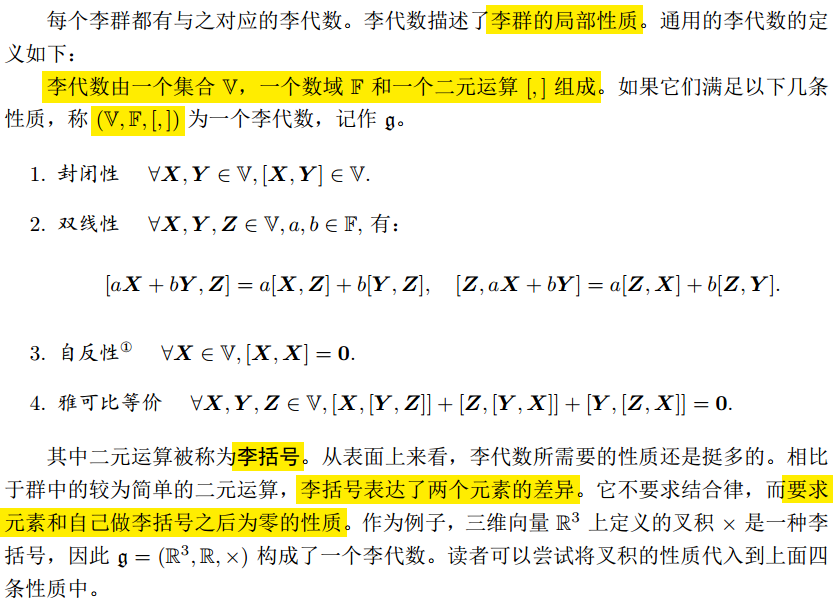

> 滤波器(随机估计)
>
> 坐标系  刚体运动
>
> 回路和图优化
>
> 视觉几何?


## 基本理论一:坐标系|刚体运动

### 1.旋转矩阵

A:world frame

B:body frame


==标量r~ij~可用每个矢量在其参考坐标系中单位方向上投影的分量表示==

下面的截图出自台大机器人学课件1


#### **旋转矩阵的用法总结:**


#### **旋转矩阵与转角**


##### **1.fixed angles**

固定x y z轴,转动的顺序不同,最后的状态也不同

逆时针为正


Atan2(x,y):根据xy值可以确定象限,atan()无法区分象限

##### 2.Euler angles

按照被转动对象的三个坐标轴转动


euler angles和fixed angles 相反的顺序,最后的状态相同


**小结**


四元数的运算效率更加高

### 2. 旋转+平移=转移矩阵


### **转移矩阵用法总结:**


### 转移矩阵的运算

#### 1.连续运算


#### 2.转移矩阵的逆矩阵


#### 3.连续运算,求未知的相对关系


### 3.四元数


## 基本理论二: 李群与李代数  Lie Group

### 1.李群

+ 除了要对**刚体运动**进行描述,还要对它进行**估计**和**优化**

+ 李代数 无约束优化


### 2.李代数





### 3.指数与对数映射


### 4.李代数求导与扰动模型


 


### 5.Sophus库的使用

```C++
#include <iostream>
#include <cmath>

#include "eigen3/Eigen/Core"
#include "eigen3/Eigen/Geometry"

#include "sophus/so3.hpp"
#include "sophus/se3.hpp"

using namespace std;
using Eigen::Matrix3d;
using Eigen::Vector3d;
using Eigen::Quaterniond;
using Eigen::AngleAxisd;


int main(int argc,char* argv[])
{
    // 沿Z轴转90度的旋转矩阵
    Matrix3d R = AngleAxisd(M_PI / 2, Vector3d(0, 0, 1)).toRotationMatrix();
    // 或者四元数
    Quaterniond q(R);
    Sophus::SO3d SO3_R(R);              // Sophus::SO3d可以直接从旋转矩阵构造
    Sophus::SO3d SO3_q(q);              // 也可以通过四元数构造
    // 二者是等价的
    cout << "SO(3) from matrix:\n" << SO3_R.matrix() << endl;
    cout << "SO(3) from quaternion:\n" << SO3_q.matrix() << endl;
    cout << "they are equal" << endl;

    // 使用对数映射获得它的李代数
    Vector3d so3 = SO3_R.log();
    cout << "so3 = " << so3.transpose() << endl;
    // hat 为向量到反对称矩阵
    cout << "so3 hat=\n" << Sophus::SO3d::hat(so3) << endl;
    // 相对的，vee为反对称到向量
    cout << "so3 hat vee= " << Sophus::SO3d::vee(Sophus::SO3d::hat(so3)).transpose() << endl;

    // 增量扰动模型的更新
    Vector3d update_so3(1e-4, 0, 0); //假设更新量为这么多
    Sophus::SO3d SO3_updated = Sophus::SO3d::exp(update_so3) * SO3_R;
    cout << "SO3 updated = \n" << SO3_updated.matrix() << endl;

    cout << "*******************************" << endl;
    // 对SE(3)操作大同小异
    Vector3d t(1, 0, 0);           // 沿X轴平移1
    Sophus::SE3d SE3_Rt(R, t);           // 从R,t构造SE(3)
    Sophus::SE3d SE3_qt(q, t);            // 从q,t构造SE(3)
    cout << "SE3 from R,t= \n" << SE3_Rt.matrix() << endl;
    cout << "SE3 from q,t= \n" << SE3_qt.matrix() << endl;
    // 李代数se(3) 是一个六维向量，方便起见先typedef一下
    typedef Eigen::Matrix<double, 6, 1> Vector6d;
    Vector6d se3 = SE3_Rt.log();
    cout << "se3 = " << se3.transpose() << endl;
    // 观察输出，会发现在Sophus中，se(3)的平移在前，旋转在后.
    // 同样的，有hat和vee两个算符
    cout << "se3 hat = \n" << Sophus::SE3d::hat(se3) << endl;
    cout << "se3 hat vee = " << Sophus::SE3d::vee(Sophus::SE3d::hat(se3)).transpose() << endl;

    // 最后，演示一下更新
    Vector6d update_se3; //更新量
    update_se3.setZero();
    update_se3(0, 0) = 1e-4;
    Sophus::SE3d SE3_updated = Sophus::SE3d::exp(update_se3) * SE3_Rt;
    cout << "SE3 updated = " << endl << SE3_updated.matrix() << endl;

    return 0;
}
```

## 基本理论三:非线性优化

### 1.状态估计问题


## ICP原理及其实现

[参考1](https://zhuanlan.zhihu.com/p/104735380)

截图:


