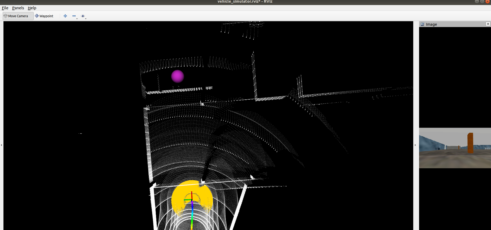

https://zhuanlan.zhihu.com/p/389756544

https://www.bilibili.com/video/BV1uP4y1578V?from=search&seid=752522631854093150&spm_id_from=333.337.0.0

### 1.系统安装

需要先安装ros然后再安装TARE这套系统

```bash
git clone https://github.com/HongbiaoZ/autonomous_exploration_development_environment.git
cd autonomous_exploration_development_environment
git checkout melodic(noetic)
catkin_make
```

下载仿真环境模型文件放到`/src/vehicle_simulator/mesh/`下

demo测试：

```bash
source devel/setup.sh
roslaunch vehicle_simulator system_garage.launch
```



在rviz中选择waypoint，然后在点云中单击选择目标点，机器人就会被引导到这一点

### 2.打开仿真环境

```bash
roslaunch vehicle_simulator system_environment.launch
system_environment 中的 environment可以是：
'campus', 'indoor', 'garage', 'tunnel', and 'forest'.
```

### 3.启动FAR_Planner

```
roslaunch far_planner far_planner.launch
```

