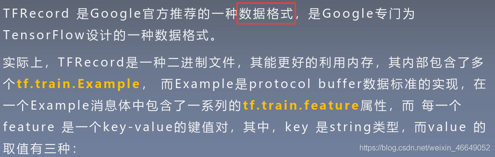
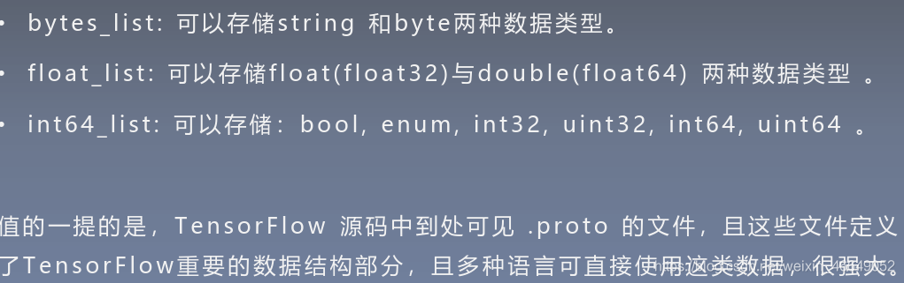
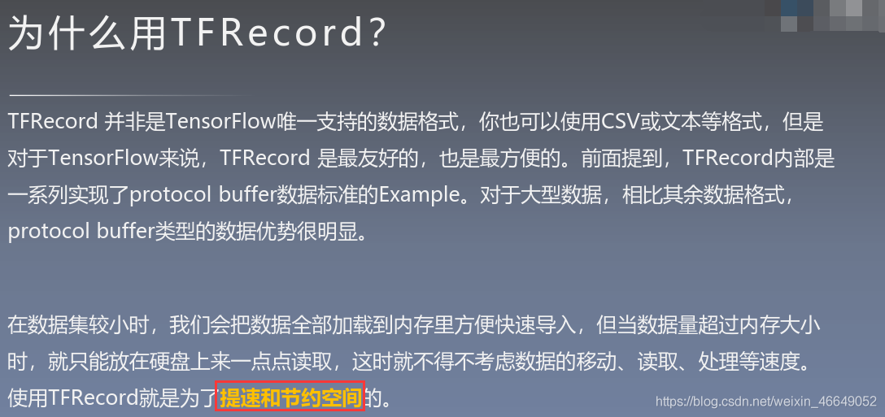
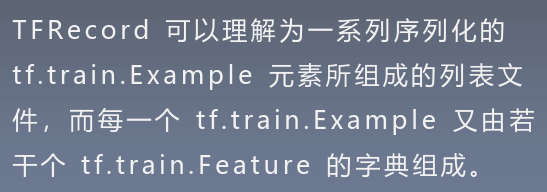
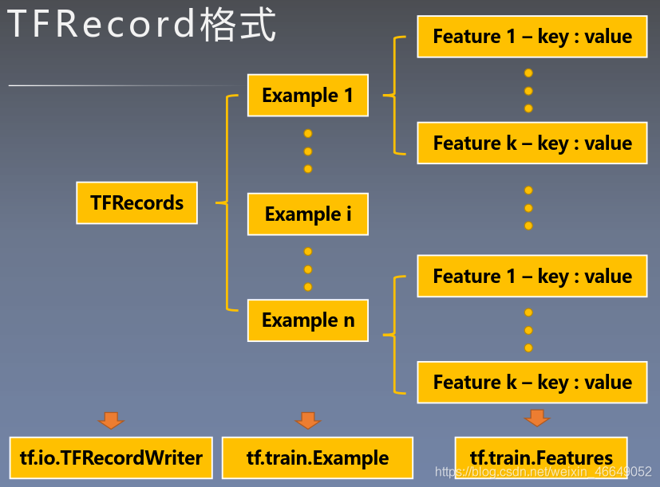
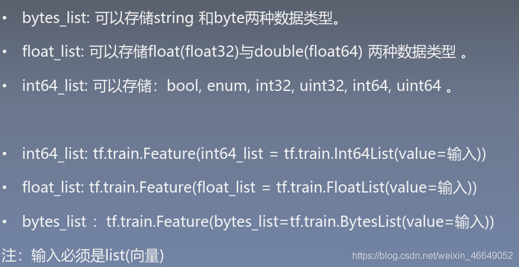

# TFRecords

> 因为BADGR源码中使用tfrecords作为训练数据，所以学习一下tfrecords的制作和使用

[from_csdn](https://blog.csdn.net/weixin_46649052/article/details/108849333?ops_request_misc=%257B%2522request%255Fid%2522%253A%2522163888145416780255294700%2522%252C%2522scm%2522%253A%252220140713.130102334.pc%255Fblog.%2522%257D&request_id=163888145416780255294700&biz_id=0&utm_medium=distribute.pc_search_result.none-task-blog-2~blog~first_rank_v2~rank_v29-12-108849333.pc_v2_rank_blog_default&utm_term=%E6%B7%B1%E5%BA%A6%E5%AD%A6%E4%B9%A0)

## 1.TFRecord简介

### 1.1 TFRecord是什么

`TFRecord --> Example --> feature --> key-value键值对，并且value的取值有三种`





### 1.2 为什么用TFRecord



### 1.3 TFRecord格式

`TFRecord --> Example --> feature --> key-value键值对，并且value的取值有三种`







## 2.写入TFRecord

为了将形式各样的数据集整理为 `TFRrcord`格式， 我们可以对数据集中的**每个元素**进行以下步骤：

1. 读取该数据元素到**内存**
2. 建立**Feature的字典**
3. 将该元素转换为 `tf.train.Example`对象，每一个`tf.train.Example`由若干个`tf.train.Feature`的字典组成
4. 将该 `tf.train.Example`对象**序列化为字符串**，并通过一个预先定义的`tf.io.TFRecordWriter`写入TFRecord文件

示例：

```python
test_cat_filenames = [test_cats_dir + filename for filename in os.listdir(test_cats_dir)]
test_dog_filenames = [test_dogs_dir + filename for filename in os.listdir(test_dogs_dir)]
test_filenames = test_cat_filenames + test_dog_filenames
test_labels = [0] * len(test_cat_filenames) + [1] * len(test_dog_filenames)

with tf.io.TFRecordWriter(test_tfrecord_file) as writer:
    for filename, label in zip(test_filenames, test_labels):
        # 1.读取该数据元素到 内存
        image = open(filename, 'rb').read()  # 读取数据集图片到内存， image为一个 Byte 类型 的字符串 ‘rb’
        # 2.建立 Feature的字典
        feature = {
            'image':tf.train.Feature(bytes_list=tf.train.BytesList(value=[image])),  # 图片是一个 Byte 对象
            'label':tf.train.Feature(bytes_list=tf.train.Int64List(value=[label]))  # 标签是一个 Int 对象
        }
        # 3.通过字典建立 Example
        example = tf.train.Example(features=tf.train.Features(feature=feature))
        serialized = example.SerializeToString()  # 将 Example 序列化
        writer.write(serialized)  # 写入TFRecord 文件
```

`Feature`类型只接受 list 数据， 但是如果 数据类型 是 矩阵或者 张量 该如何处理？

+ 转成list类型： 将张量flatten 成 list（也就是向量）， 再用写入list的方式写入

+ 转成string 类型：将张量用 .tostring() 转换成string类型， 再用

  `tf.train.Feature(bytes_list=tf.train.BytesList(value=[input.tostring()]))`来存储

## 3.读取TFRecord文件

读取TFRecord文件步骤：

1. 通过`tf.data.TFRecordDataset	`读入原始的TFRecord文件，此时文件中的`tf.train.Example`对象**尚未被反序列化**，获得一个`tf.data.Dataset`数据集对象；
2. 定义**Feature**结构，告诉编码器每个Feature的类型是什么；
3. 通过Dataset.map方法，对该数据集对象中的每一个序列化的Example字符串执行`tf.io.parse_single_example`函数，从而实现**反序列化**

示例：

```python
# 2.定义Feature结构，告诉编码器每个Feature的类型是什么
feature_description = {
    'image':tf.io.FixedLenFeature([],tf.string),
    'label':tf.io.FixedLenFeature([],tf.int64),
}
# 3.解码序列化的Example
def _parse_example(example_string):
    feature_dict = tf.io.parse_single_example(example_string,feature_description)
    feature_dict['image'] = tf.io.decode_jpeg(feature_dict['image'])  # 解码jpeg图片
    feature_dict['image'] = tf.image.resize(feature_dict['image'], [256, 256]) / 255.0
    return feature_dict['image'], feature_dict['label']

batch_sz = 32

train_dataset = tf.data.TFRecordDataset("train.tfrecords")  # 1.read TFRecord file => 一个一个的Example
train_dataset = train_dataset.map(_parse_example)
train_dataset = train_dataset.shuffle(100000).batch(batch_sz)
```

 
