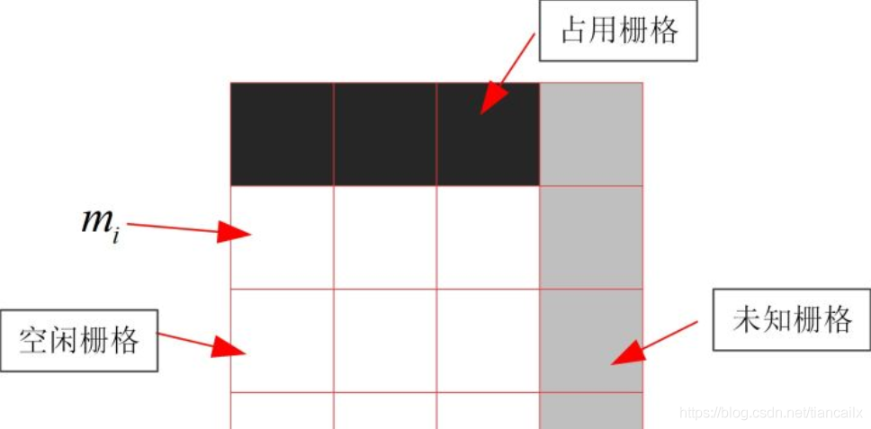
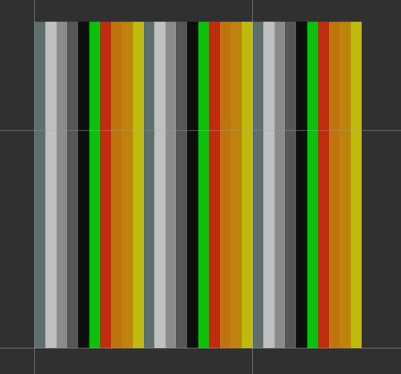

# 从零开始搭二维激光SLAM 

**学习动机:** 

为了让正障碍图更加稳定,需要多帧累积,建立子图,薛含章师兄已经给了代码,主要思想是使用贝叶斯滤波,但是代码逻辑不知道,直接看很难找到头绪,所以先看`从零开始搭二维激光SLAM`这个公众号的内容,实现简单的二维SLAM

在网页上面看比较方便,

[CSDN-从零开始搭二维激光SLAM](https://blog.csdn.net/tiancailx/article/details/110822624)

## 一 前言

### 1 SLAM是什么

​		SLAM(simultaneous localization and mapping)的中文翻译为 同步定位与地图构建。

​		目的有2个，一个是进行定位，一个是进行周围环境的地图的构建，二者相互依赖，只有同时进行求解才能够解决这个问题。

### 2 SLAM的目的或应用是什么

个人认为SLAM最大的应用就是建图，通过SLAM的处理，获得一个能够在之后继续使用的地图。而由于SLAM本身包含了定位，当不保存地图的时候，SLAM也可以当成个定位算法来用。

+ 二维激光SLAM构建的二维栅格地图，可以用来做机器人的定位与导航。
+ 三维激光SLAM构建的三维点云地图，可以用来做无人车的定位与导航，也可以用来做三维建模。
+ 视觉SLAM构建的稀疏点云地图，可以用来做定位。
+ 视觉SLAM构建的半稠密与稠密的点云地图，可以用来做定位与导航，也可以用来做VR领域的交互场景，也可以用来做三维建模

### 3 SLAM的三个模块

==众所周知，目前阶段，SLAM的框架大体上已经固定了，分为前端里程计模块，后端优化模块，以及回环检测模块。==

接下来，我将简要介绍这三个模块的功能，以及实现每个模块的方法。

#### 3.1 前端里程计

##### 3.1.1 什么是前端里程计

机器人的轮子上有种叫做编码器的传感器，用于测量轮子具体走了多远。前端里程计也是同样的目的，就是为了测量机器人从开始后到现在到底走了多远，与初始位置处的相对距离和相对姿态（位姿）。

##### 3.1.2 怎么实现呢

对于激光SLAM来说，激光雷达的频率一般是10Hz-40Hz之间。我只要确定第一帧雷达数据与第二帧雷达数据的时间间隔内，机器人走了多远，再确定第二帧到第三帧雷达数据的时间间隔内，机器人走了多远（位姿变换），==依次类推，我们就可以一直确定机器人到底走了多远，确定机器人当前的位姿与初始时刻的相对位姿。==

对于视觉SLAM来说，摄像头的数据是一帧一帧的图像，可能是RGB彩色图像，也可能是彩色图像加上深度图像。一般的处理方法为在图像中提取特征点，然后确定特征点在空间中的坐标值，通过这些特征点，确定机器人在2帧图像间的位姿变换，再确定第二帧图像与第三帧图像间的位姿变换，依次类推，就可以确定了机器人当前的位姿与初始时刻的相对位姿。

==上述过程确定了机器人相对于初始时刻以及相对于每帧数据到来时的位姿变换，这个过程就是定位的过程==。

##### 3.1.3 具体实现方法

==对于激光SLAM来说，求从前一帧雷达数据到当前帧雷达数据间的位姿变换，一般将这个过程称为 扫描匹配(scan-matching) 过程==。scan就是雷达的数据，通过与前一帧数据进行匹配，从而确定处位姿变换。

目前的扫描匹配方法为:

+ scan-to-scan：雷达数据与雷达数据进行匹配
+ scan-to-map：雷达数据与地图进行匹配
+ scan-to-submap：雷达数据与子地图进行匹配
+ map-to-map：地图与地图进行匹配

==对于视觉SLAM来说==，求从前一帧图像到当前帧图像间的位姿变换，一般将这个过程称为 BA(Bundle Adjustment)，求解BA的方法有很多，由于目前我对视觉SLAM了解不多，不在这里进行更多的说明。

#### 3.2 后端优化

##### 3.2.1 为什么需要后端优化

不管是使用编码器得到的里程计，还是前端计算出来的里程计，==都不是完全准确的==。

即使选用的编码器十分精确，当轮子在光滑的地面上出现打滑时（数据比实际值偏大）或者在轮子路过了一个坑或者土包时，都会导致里程计的测量值与实际值不匹配。

同样的，由于所有传感器都是存在误差的，我们通过前端里程计计算出来的里程计数值也一定是存在误差的，而且这个误差将随着时间的增长而不断增大。

==这将导致机器人的位置与实际的位置相差的越来越大，最终导致机器人的位置与真实的位置不符，不能构建很好的地图。==

##### 3.2.2 什么是后端优化

由于前端里程计会有累计误差，==那有没有一种方法可以将这种累计误差减小甚至消除掉呢？==

这就是后端优化的作用，==通过图结构，将机器人的各个位姿以及生成的地图数据，进行联合优化，通过优化求解，将所有的误差平均分散到每个机器人位姿以及每个地图数据上去，当我的优化过程十分完美的时候，这些累计误差可以减小到可以忽略的地步。==

对于激光SLAM与视觉SLAM，他们的后端优化过程都是差不多的，==都是通过图结构来减小误差==，只不过由于传感器的数据类型不同，具体的实现方法也不完全相同。

#### 3.3 回环检测

我们可以通过后端优化来减小位姿，那么，有没有一种==比较强的约束来对优化的方程进行约束==呢？

答案肯定是存在的，那就是回环检测。

当我们人类从公园的东门出发，转了10分钟之后再回到东门，我们可以轻而易举的分辨出这就是之前我来过的地点，和之前的东门是同一个东门。

但是，对于机器人而言，同样从东门出发，走了10分钟。由于机器人的位姿是通过逐步累加得到的，这样的计算存在累计误差，当机器人再次回到东门时，有可能机器人认为自己还和东门差距20米。这20米就是机器人由于长时间定位产生的偏差。

我们可以通过某种手段，将当前传感器感知的环境信息，与机器人之前构建的地图相对比，如果匹配程度很高，则我们认为，机器人到了一个之前去过的地方，那么当前的位置应该与之前路过这个位置时相距不会太远(约束)。

我们==可以将这个约束，输入到后端优化过程中，当做一个新的并且十分强烈的约束，通过这个强烈的约束，当我们进行优化完成后，能够大幅度的进行误差的消除==。

### 4 SLAM的发展

#### 4.1 高精确度地图

这是目前学术研究的重点，很多的工作量都是为了如何构建更准确，更精确的地图。

#### 4.2 长期环境下的建图

人们接触的环境从来没有一成不变的，但是我们每次进行SLAM保存的地图都是不会再变换的，如何在不占资源的情况下，一边运行着导航任务，一边将之前的地图进行更新，也是一个研究重点。目前已经有几家公司可以做到。

#### 4.3 减小计算量

目前的各个SLAM算法都有着不小的计算量，如果要是能够实时运行稠密地图的构建，那么将会把VR领域抬到一个新的高峰。这也是我一直关注这VR领域的原因。

#### 4.4 语义SLAM

人们可以通过眼睛来感知环境的同时，识别出能看到的物体的名字与种类。语义SLAM同样可以做到这样，具有语义标签的环境地图将会对导航产生更大的帮助。

#### 4.5 感知代替SLAM

当机器人的理解能力逐步提升，我们就不需要再去单纯地构建地图，机器人所见即可为一个地图，像人一样的感知周围环境，即可确定自身位置，这就不再需要去保存地图。

## 二 基于ICP这一类的帧间匹配


## 三 栅格地图

栅格地图就是用一个个栅格组成的网格来代表地图. 栅格里可以存储不同的数值, 代表这个栅格的不同含义.

ROS的栅格地图使用白色代表空闲，也就是可通过区域，其存储的值为 0；

黑色代表占用，也就是不可通过区域，其存储的值为 100；

灰色代表未知，就是说目前还不清楚这个栅格是否可以通过，其存储的值为 -1．

栅格地图由于其 占用与空闲的表示方法，在ROS中又被称为占用地图．

栅格地图的示意图如下图所示：


### 2 ROS中的数据类型

接下来看一下ROS中的栅格地图的消息类型，

```sh
$ rosmsg show nav_msgs/OccupancyGrid 
std_msgs/Header header          # 数据的消息头
  uint32 seq                    # 数据的序号
  time stamp                    # 数据的时间戳
  string frame_id               # 地图的坐标系
nav_msgs/MapMetaData info       # 地图的一些信息
  time map_load_time            # 加载地图的时间
  float32 resolution            # 地图的分辨率，一个格子代表着多少米，一般为0.05，[m/cell]
  uint32 width                  # 地图的宽度，像素的个数, [cells]
  uint32 height                 # 地图的高度，像素的个数, [cells]
  geometry_msgs/Pose origin     # 地图左下角的格子对应的物理世界的坐标，[m, m, rad]
    geometry_msgs/Point position
      float64 x
      float64 y
      float64 z
    geometry_msgs/Quaternion orientation
      float64 x
      float64 y
      float64 z
      float64 w

# 地图数据，优先累加行，从（0,0）开始。占用值的范围为[0,100]，未知为-1。

int8[] data    
```


可以看到，消息可以分为3个部分，消息头header，地图信息info，地图数据data．

地图信息info储存了地图相关的信息，包括 加载地图的时间，地图的分辨率，地图的宽度与高度，以及地图左下角栅格对应的物理坐标．

地图本身是只有像素坐标的，其像素坐标系为坐下角为(0, 0) 的坐标系．通过左下角栅格对应的物理坐标 origin 以及 分辨率，再通过 **像素** * **分辨率** + origin , 将像素坐标转成物理世界的坐标，从而确定了整个地图的物理坐标．

地图数据data是一维的，我们在赋值之前要首先对这个一维数组进行初始化，数据的大小就是所有像素的个数．

遍历的时候要注意方向，这个数据是以行为主要递增方向的．也就是说遍历的时候要先遍历第一行的所有数据，然后再遍历第二行的所有数据．

### 3 代码

接下来，通过代码展示一下如何在ROS中发布一张地图．

#### 3.1 获取代码

代码已经提交在github上了，如果不知道github的地址的朋友, 请在我的公众号: 从零开始搭激光SLAM 中回复 开源地址 获得。

推荐使用 git clone 的方式进行下载, 因为代码是正处于更新状态的, git clone 下载的代码可以使用 git pull 很方便地进行更新.

本篇文章对应的代码为 Creating-2D-laser-slam-from-scratch/lesson4/src/occupancy_grid/occupancy_grid.cc。

#### 3.2 main

main函数中，首先声明了一个OccupancyGrid类的对象，然后以1Hz的频率重复调用PublishMap()函数．

```C++
int main(int argc, char **argv)
{
    ros::init(argc, argv, "lesson4_make_occupancy_grid_map");
    OccupancyGrid occupancy_grid;
    ros::Rate rate(1);

    while (ros::ok())
    {
        ROS_INFO("publish occupancy map");
        occupancy_grid.PublishMap();
        rate.sleep();
    }
    return (0);
}
```


#### 3.3 occupancy_grid类

类的声明如下，内容很少．

首先，想要发布栅格地图，要包含 <nav_msgs/OccupancyGrid.h>这个头文件．

声明了2个Publisher，其中map_publisher_是用来发布map完整数据的．

map_publisher_metadata_只是用来发布地图信息的，不包含data数据，所以这个话题下的数据量要明显少于map话题下的数据量．适用于只需要知道地图相关信息或者尺寸，不需要知道地图实际data数值的情况．

```C++
#include <iostream>

#include <chrono>

#include <ros/ros.h>

#include <nav_msgs/OccupancyGrid.h>

class OccupancyGrid
{
private:
    ros::NodeHandle node_handle_;           // ros中的句柄
    ros::Publisher map_publisher_;          // 声明一个Publisher
    ros::Publisher map_publisher_metadata_; // 声明一个Publisher
    nav_msgs::OccupancyGrid map_;           //用来发布map的实体对象

public:
    OccupancyGrid();
    void PublishMap();
};
```

#### 3.4 OccupancyGrid()构造函数

```C++
// 构造函数
OccupancyGrid::OccupancyGrid()
{
    // \033[1;32m，\033[0m 终端显示成绿色
    ROS_INFO_STREAM("\033[1;32m----> Make Occupancy Grid Map by no move started.\033[0m");

map_publisher_ = node_handle_.advertise<nav_msgs::OccupancyGrid>("map", 1, true);
map_publisher_metadata_ = node_handle_.advertise<nav_msgs::MapMetaData>("map_metadata", 1, true);

// 对map_进行初始化
map_.header.frame_id = "map";

// 地图的分辨率为0.05m,代表一个格子的距离是0.05m
map_.info.resolution = 0.05;

// 地图图片像素的大小, width为地图的宽度是多少个像素
map_.info.width = 30;
map_.info.height = 30;

// 如果要表示地图图片为多少米的话,就需要用实际长度除以分辨率,得到像素值
// map_.info.width = 100 / map_.info.resolution;
// map_.info.height = 100 / map_.info.resolution;

// 地图左下角的点对应的物理坐标
map_.info.origin.position.x = 0.0;
map_.info.origin.position.y = 0.0;

// 对数组进行初始化, 数组的大小为实际像素的个数
map_.data.resize(map_.info.width * map_.info.height);

}
```


#### 3.5 PublishMap()

代码很简单，只说明其中几点．

遍历的时候要注意顺序，是行优先的顺序
为data赋值之前要进行初始化，代码里为data赋予了 从-1到254之间的不同的值，实际使用时只需要赋予 -1, 0, 100 这三种值即可

```C++
void OccupancyGrid::PublishMap() {
    auto start_time_ = std::chrono::steady_clock::now();

    // 通过二维索引算出来的一维索引
    int index = 0;

    // 10种情况
    int count = 10;

    // 固定列, 优先对行进行遍历
    for(int h=0;h<map_.info.height;++h) {
        for(int w=0;w<map_.info.width;++w) {
            index = w + h*map_.info.width;
            int value = index % count;
            switch (value) {
            case 0:
                // 0代表空闲, 100代表占用, -1代表未知, 默认值为0
                // 为map赋予不同的值来体验效果, 从-1 到 254
                map_.data[index] = -1;
                break;
            case 1:
                map_.data[index] = 0;
                break;
            case 2:
                map_.data[index] = 30;
                break;
            case 3:
                map_.data[index] = 60;
                break;
            case 4:
                map_.data[index] = 100;
                break;
            case 5:
                map_.data[index] = 120;
                break;
            case 6:
                map_.data[index] = 150;
                break;
            case 7:
                map_.data[index] = 200;
                break;
            case 8:
                map_.data[index] = 210;
                break;
            case 9:
                map_.data[index] = 250;
                break;
            }
        }
    }

    // 设置这一帧地图数据的时间戳
    map_.header.stamp = ros::Time::now();

    // 发布map和map_metadata话题
    map_publisher_.publish(map_);
    map_meta_publisher_.publish(map_.info);

    auto end_time_ = std::chrono::steady_clock::now();
    auto time_used_ = std::chrono::duration_cast<std::chrono::duration<double>>(end_time_ - start_time_);
    std::cout << "used time: " << time_used_.count() *1000 << " ms。\n" << std::endl;

}
```

### 4 运行


#### 4.3 运行结果

启动之后，会在rviz中显示出如下画面．



可以看到，虽然ROS官方中将栅格地图的值限定为 0-100，实际上将大于100的值填入栅格中也是可以在rviz中显示出来的．

值为0-100的颜色变换为从白色到黑色，值为100-254的颜色变化为从红色到黄色．

其实，这个栅格的值可以为任意值，只要接收map信息的节点做相应的处理即可．


同时会在终端中打印出如下消息．

```
used time: 0.057559 ms。

used time: 0.053858 ms。

used time: 0.060546 ms。
```

可以看的，现在发布一次30*30=900个像素点的地图的时间还是很小的．

但是，当实际SLAM的过程中，如果构建100m * 100m范围的地图，分辨率为0.05的情况下，那地图的像素点将达到400万个，这时发布一次地图所需要的时间将变为 0.09秒，也就是说，当地图再大点的情况下，我们发布地图的频率将不足1Hz.

所以，大部分SLAM算法将发布地图单独设置了一个线程，并让它以较低的频率进行更新．

这样又不会阻塞历程计部分的计算，也不会让地图的更新变得越来越滞后．

### 5 总结与Next

本篇文章中简单实现了如何发布一个OccupancyGrid类型的地图。

体会了向地图中填入不同数值时地图在rviz中的显示情况，我也是第一次见到彩色的栅格地图。。。

体会了栅格地图遍历一次的用时，地图越大，耗时也越大。

下篇文章将借鉴GMapping中构建地图的方式，将雷达数据填充到栅格地图当中。

## 四 基于GMapping的栅格地图的构建

### 1 GMapping简介

GMapping是ROS中navigation导航包集中推荐的二维建图算法包，由于其实现时间早，所以各种书中的demo使用的SLAM基本都是GMapping，同时GMapping网上的教程也是最多的．

GMapping是基于粒子滤波算法实现的SLAM，通过里程计数据获取粒子群的先验位姿，再通过雷达数据与地图的匹配程度对所有粒子进行打分，通过分数高的粒子群来近似机器人的真实位姿．

GMapping的具体实现是在open_gmapping包里，后来又在ROS中做了个封装包slam_gmapping．gmapping在ROS中的wiki地址为 http://wiki.ros.org/gmapping

### 2 代码

open_gmapping的代码比较复杂，比较乱． csdn博主 白茶-清欢 对 open_gmapping 与 slam_gmapping 两个包进行了重写，整理了代码使得代码结构更加清晰，同时添加了注释，还增加了激光雷达数据的畸变校正功能．

本篇文章的代码实现是参考于 csdn博主 白茶-清欢 注释简化之后的GMapping．其地址为 csdn 白茶-清欢: https://blog.csdn.net/zhao_ke_xue/article/details/109712355

本篇文章对应的代码为 Creating-2D-laser-slam-from-scratch/lesson4/src/gmapping/ 与 Creating-2D-laser-slam-from-scratch/lesson4/include/gmapping/

#### 2.2 回调函数