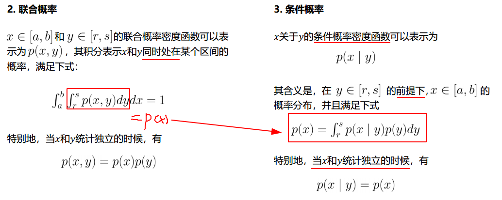
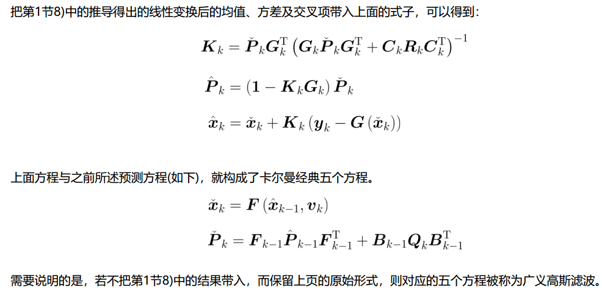
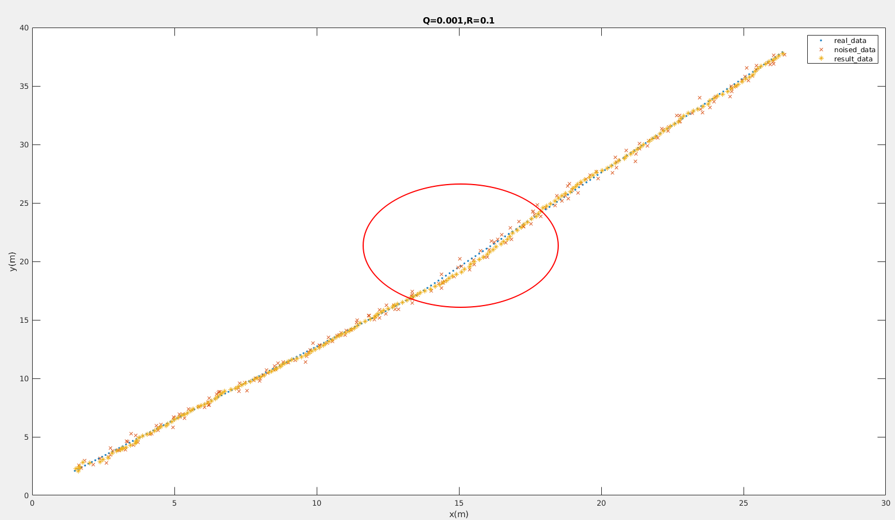

# 0. 学习动机

方舱医院中为了改善cartographer定位会出现的跳变现象，使用IMU进行航迹推算，将它们的定位结果进行简单的融合，当cartographer定位和IMU推算的结果差距不大时，IMU使用cartographer的结果，重新开始航迹推算，如果差距过大，选择相信更加稳定的IMU结果，用IMU的结果在地图中进行重定位；

可以改善地图定位的跳变现象，但是当地图定位慢慢发生偏移的时候，由于设置阈值的关系，IMU会被地图定位带偏，所以，为了更好的对定位结果进行融合，需要使用滤波器的方法。

与此同时，为了实现新型的地面分割算法，也需要滤波器的知识，所以学习以卡尔曼滤波为代表的滤波方法。

学习方式为：

1.【网课】深蓝学院-多传感器融合定位-第四章；

2.【博客】

## 0.1 通俗理解卡尔曼滤波

### 0.1.1

假设你有两个传感器，测的是同一个信号。可是它们每次的读数都不太一样，怎么办？

**取平均。**

再假设你知道其中贵的那个传感器应该准一些，便宜的那个应该差一些。那有比取平均更好的办法吗？

**加权平均。**

怎么加权？假设两个传感器的误差都符合正态分布，假设你知道这两个正态分布的方差，用这两个方差值，（此处省略若干数学公式），你可以得到一个“最优”的权重。

接下来，重点来了：假设你只有一个传感器，但是你还有一个数学模型。模型可以帮你算出一个值，但也不是那么准。怎么办？

**把模型算出来的值，和传感器测出的值，（就像两个传感器那样），取加权平均。**

OK，最后一点说明：你的模型其实只是一个步长的，也就是说，知道x(k)，我可以求x(k+1)。问题是x(k)是多少呢？答案：x(k)就是你上一步卡尔曼滤波得到的、所谓加权平均之后的那个、对x在k时刻的最佳估计值。

于是**迭代**也有了。

这就是卡尔曼滤波。

（无公式）

作者：Kent Zeng
链接：https://www.zhihu.com/question/23971601/answer/26254459
来源：知乎
著作权归作者所有。商业转载请联系作者获得授权，非商业转载请注明出处。

# 1. 滤波器作用


融合直观的解释：

点云匹配：==观测==，波动比较大

IMU：比较稳定，可以作为==预测==，但是有累积误差

可以使用点云匹配的结果对IMU进行修正

最后得到一个没有累积误差而且波动比较小的结果。

# 2. 概率基础知识

## 2.1 概率、概率密度


概率密度直观上就是==概率==的形状，表示在区间的分布情况，上图中，一个值落在[a,b]的概率是100%，但是落在中间某两个值之间的概率就需要使用概率密度函数来计算；

## 2.2 联合概率与条件概率

条件概率p(x|y)：在y发生下x发生的概率

如果x，y统计独立，即x，y没有关系，y对x没有影响，那么，p(x|y)=p(x)

如果y对x有影响，y取任何一个值，x都有一个概率p(x)，为了得到完整的p(x),对y进行积分。

## 2.3 贝叶斯公式/推断


贝叶斯估计具有**非常重大的意义**：

已知状态先验->可以推断出后验概率，也就是状态估计

比如说：

以下雨为一个状态x，当下雨时有乌云y的概率为先验p(y|x),使用贝叶斯公式可以得到p(x|y)，即，当有乌云时，会下雨的概率，这就是对状态x的估计。

## 2.4 高斯概率密度函数

### 2.4.1 高斯概率密度函数


卡尔曼滤波以==高斯概率==函数为基础

### 2.4.2 联合高斯密度函数


------


(包括以后）最终目的就是为了获得==p(x|y)==

### 2.4.3 高斯随机变量的线性分布


# 3. 滤波器基本原理

## 3.1 状态估计模型


## 3.2 贝叶斯滤波 


==马尔可夫性==：当前状态$x_{k}$只和前一时刻$x_{k-1}$有关
$$
p(x)=\int p(x|y)p(y)dy\tag{1}
$$
利用$({1})$ 可以让任意其他变量$y$与$x$发生关系，将$y$变成$x_{k-1}$,$x_{k}$就和$x_{k-1}$发生了关联.


## 3.3 卡尔曼滤波(KF)推导


**线性假设下:**

运动方程:
$$
x_{k}=f(x_{k-1},u_k)+\varepsilon_k=A_kx_{k-1}+B_ku_k+\varepsilon_k
$$
观测方程:
$$
z_{k}=h(x_k)+\delta_k=C_kx_k+\delta_k
$$




.........


我认为不需要掌握卡尔曼滤波器的具体数学推导,只需要记住卡尔曼滤波的五个方程,理解物理意义,根据实际要求使用KF.


**信息加权,权重调节**:

卡尔曼滤波核心思想是将预测的状态和观测的状态进行加权融合,权重调节由卡尔曼增益K控制;

预测噪声方差R

观测噪声方差Q

谁越小,就越相信谁,体现在K:


# 4.编程实现及测试

```C++
#ifndef MYKALMANFILTER_H
#define MYKALMANFILTER_H

/******************************************************************************
 * @file       mykalmanfilter.h
 * @brief      XXXX Function
 *             标准卡尔曼滤波,只用于目标位置速度跟踪
 * @author     swc<shenwancheng19@nudt.edu.cn>
 * @date       2021/04/21
 * @history
 *****************************************************************************/

#include <Eigen/Dense>

/** kalman filter
x(k) = F * x(k-1) + B * u(k) + w(k)
z(k) = H * x(k)   + v(k)

prediction:
    x(k|k-1) = F * x(k-1) + B * u(k)
    P(k|k-1) = F * P(k-1) * Ft + Q

y = z(k) - H*x(k|k-1)
S = H * P(k|k-1)  * Ht + R
        ||
        ||
        \/
K(k) = P(k|k-1)*Ht / S

update:
    x(k) = x(k|k-1) + K(k)*y
    P(k) = (I-K * H) * P(k|k-1)
*/

class myKalmanFilter
{
public:
    myKalmanFilter(int state_dim=4,int measurement_dim=2);

    void initialize(Eigen::VectorXf& first_measurement);

    void predict();

    void update();

    void set_measurement(Eigen::VectorXf& measurement);

    void set_Q(double Q=1);

    void set_R(double R);

    void set_delta_t(double delta_t);

    Eigen::VectorXf get_x() const;

public:
    // state vector
    Eigen::VectorXf x_;
    Eigen::VectorXf x_predicted_;
    int state_dim_;
    // state transistion matrix
    Eigen::MatrixXf F_;
    // state covariance matrix
    Eigen::MatrixXf P_;
    Eigen::MatrixXf P_predicted_;
    // process noise covariance matrix
    Eigen::MatrixXf Q_;
    // measurement vector
    Eigen::VectorXf z_;
    int measurement_dim_;
    // measurement matrix
    Eigen::MatrixXf H_;
    // measurement noise covariance matrix
    Eigen::MatrixXf R_;

    bool is_initialized_;
    // whether have measurement data
    bool is_measured_;
};

#endif // MYKALMANFILTER_H
```

```C++
#include "mykalmanfilter.h"

myKalmanFilter::myKalmanFilter(int state_dim, int measurement_dim)
{
    state_dim_        = state_dim;
    measurement_dim_  = measurement_dim;
    x_           = Eigen::VectorXf::Zero(state_dim_);
    x_predicted_ = Eigen::VectorXf::Zero(state_dim_);

    F_           = Eigen::MatrixXf::Zero(state_dim_,state_dim_);

    z_           = Eigen::VectorXf::Zero(measurement_dim_);
    H_           = Eigen::MatrixXf::Zero(measurement_dim_,state_dim_);

    P_           = Eigen::MatrixXf::Zero(state_dim_,state_dim_);
    P_predicted_ = Eigen::MatrixXf::Zero(state_dim_,state_dim_);

    Q_ = Eigen::MatrixXf::Zero(state_dim_,state_dim_);
    R_ = Eigen::MatrixXf::Zero(measurement_dim_,measurement_dim_);
    // NOTE(swc):状态转移矩阵,不包含delta_t,使用set_delta_t()进行设置
    for(int i=0;i<state_dim_;++i)
        F_(i,i) = 1.0;
    // 观测矩阵
    for(int i=0;i<measurement_dim_;++i)
        H_(i,i) = 1.0;

    is_initialized_ = false;

    is_measured_    = false;
}

void myKalmanFilter::initialize(Eigen::VectorXf &first_measurement)
{
    // 第一帧,用观测值初始化
    for(int i=0;i<measurement_dim_;++i)
        x_(i)   = first_measurement(i);
    // NOTE(swc):先给P一个比较大的值,随着迭代,方差会逐渐收敛稳定
    for(int i=0;i<state_dim_;++i)
        P_(i,i) = 10.0;
    is_initialized_ = true;
}

void myKalmanFilter::predict()
{
    // NOTE(swc):不考虑系统控制输入u
    x_predicted_ = F_ * x_;
    P_predicted_ = F_ * P_ * F_.transpose() + Q_;
}

void myKalmanFilter::update()
{
    if(is_measured_) {
        is_measured_ = false;
        Eigen::VectorXf y = z_- H_ * x_predicted_;
        Eigen::MatrixXf S = H_ * P_predicted_ * H_.transpose() + R_;
        // kalam gain
        Eigen::MatrixXf K = P_predicted_ * H_.transpose() * S.inverse();

        Eigen::MatrixXf I = Eigen::MatrixXf::Identity(state_dim_,state_dim_);
        x_ = x_predicted_ + K * y;
        P_ = (I - K * H_) * P_predicted_;
    } else {
        x_ = x_predicted_;
        P_ = P_predicted_;
    }
}

void myKalmanFilter::set_measurement(Eigen::VectorXf &measurement)
{
    z_ = measurement;
    is_measured_ = true;
}

void myKalmanFilter::set_Q(double Q)
{
    // defalut Q = 1
    // NOTE(swc):对转移模型的信任度
    // 设置的越小,越信任转移模型,对突变的反应很慢
    for(int i=0;i<state_dim_;++i) {
        Q_(i,i) = Q;
    }
}

void myKalmanFilter::set_R(double R)
{
    // NOTE(swc):对测量模型的信任度
    for(int i=0;i<measurement_dim_;++i) {
        R_(i,i) = R;
    }
}

void myKalmanFilter::set_delta_t(double delta_t)
{
    // NOTE(swc):测量值先不考虑速度,只考虑位置,measurement_dim_<state_dim
    // 二维物体跟踪
    F_(0,2) = delta_t;
    F_(1,3) = delta_t;
}

Eigen::VectorXf myKalmanFilter::get_x() const
{
    return x_;
}
```

```C++
#include <iostream>

#include <opencv/cv.h>
#include <time.h>

#include "mykalmanfilter.h"

using std::cout;
using std::endl;

myKalmanFilter* KF = new myKalmanFilter(4,2);

Eigen::MatrixXf noised_data_mat = Eigen::MatrixXf::Zero(200,2);

cv::RNG rng((unsigned)time(NULL));

// 生成真实数据和观测数据,保存到txt文件中
void generate_data() {
    FILE* fp = fopen("./real_data.txt","w");
    FILE* fp2= fopen("./noised_data.txt","w");
    float x_0 = 1.5;// m
    float y_0 = 2.1;// m
    // 高斯噪声
    float x_noise,y_noise;

    float v_x = 1.2;// m/s
    float v_y = 1.5;// m/s
    float delta_t = 0.1;//s
    // generate 100 frames data
    for(int i=0;i<100;++i) {
        x_noise = rng.gaussian(0.2);
        y_noise = rng.gaussian(0.2);
        fprintf(fp,"%f %f\n",x_0,y_0);
        fprintf(fp2,"%f %f\n",x_0+x_noise,y_0+y_noise);
        printf("%f %f\n",x_noise,y_noise);
        x_0 += v_x*delta_t;
        y_0 += v_y*delta_t;
    }
    // 后100帧改变速度
    v_x += 0.1;
    v_y += 0.6;
    for(int i=0;i<100;++i) {
        x_noise = rng.gaussian(0.2);
        y_noise = rng.gaussian(0.2);
        fprintf(fp,"%lf %lf\n",x_0,y_0);
        fprintf(fp2,"%f %f\n",x_0+x_noise,y_0+y_noise);
        printf("%f %f\n",x_noise,y_noise);
        x_0 += v_x*delta_t;
        y_0 += v_y*delta_t;
    }
    fclose(fp);
}
// 从保存的txt文件中,读取观测数据,保存到eigen矩阵中
void read_data() {
    FILE* fp = fopen("./noised_data.txt","r");
    if(fp!=nullptr) {
        printf("----------- start read ---------------------\n");
        for(int line=0;line<200;line++){
            fscanf(fp,"%f %f",&noised_data_mat(line,0),&noised_data_mat(line,1));
            printf("line %d %f %f\n",line,noised_data_mat(line,0),noised_data_mat(line,1));
        }
         printf("----------- read finish ---------------------\n");
        fclose(fp);
    } else
        printf("open real_data.txt error!\n");
}
// 封装的读取数据函数,输入函数,输出一行观测数据
Eigen::VectorXf get_data(int i) {
    Eigen::VectorXf this_data =  Eigen::VectorXf::Zero(2);
    this_data(0) = noised_data_mat(i,0);
    this_data(1) = noised_data_mat(i,1);
    return this_data;
}

int main()
{
    if(0)
    generate_data();
    if(1) {
        read_data();
        // 保存滤波结果
        FILE* fp = fopen("./result_data.txt","w");
        // 设置Q,R
        KF->set_Q(0.01);
        KF->set_R(0.1);

        for(int i=0;i<200;++i) {
            // 获取观测值
            Eigen::VectorXf this_measurement = get_data(i);
            if(!KF->is_initialized_) {
                KF->set_delta_t(0.1);
                // 使用第一次观测初始化滤波器
                KF->initialize(this_measurement);
                fprintf(fp,"%f %f\n",KF->x_(0),KF->x_(1));
                printf("kalman %d v_x:%f v_y:%f \n",i,KF->x_(2),KF->x_(3));
            } else {
                // 模拟数据丢失,每10帧 丢一次数据
                if(i%10!=0)
                    KF->set_measurement(this_measurement);
                KF->set_delta_t(0.1);
                KF->predict();
                KF->update();
                fprintf(fp,"%f %f\n",KF->x_(0),KF->x_(1));
                printf("kalman %d v_x:%f v_y:%f \n",i,KF->x_(2),KF->x_(3));
            }
        }
    }
    return 0;
}
```

matlab分析结果:

```matlab
real_data   = load('./real_data.txt');
noised_data = load('./noised_data.txt');
result_data = load('./result_data.txt');
X = real_data(:,1);
Y = real_data(:,2);

X_noised = noised_data(:,1);
Y_noised = noised_data(:,2);

X_result = result_data(:,1);
Y_result = result_data(:,2);

VX_result = result_data(:,3);
VY_result = result_data(:,4);
figure(1);
plot(X,Y,'.');hold on;
plot(X_noised,Y_noised,'x');hold on;
plot(X_result,Y_result,'*');hold on;
legend('real\_data','noised\_data','result\_data');
xlabel('x(m)');
ylabel('y(m)');
title('Q=0.01,R=0.1');
figure(2);
T=[1:200];
T1=[1:0.5:100];
T2=[100:0.5:200];
plot(T,VX_result,'x');hold on;
plot(T,VY_result,'*');hold on;
plot(T1,1.2,'b.');hold on;
plot(T1,1.5,'b.');hold on;
plot(T2,1.3,'b.');hold on;
plot(T2,2.1,'b.');hold on;
legend('v\_x','v\_y');
xlabel('time)');
ylabel('m/s');
title('Q=0.01,R=0.1');
```

测试结果:


速度估计




**速度估计**


> Q越小
>
> 相信预测更多一点,如果符合状态转移模型,估计精度很高,发生变化时,反应的也比较慢

# 5.粒子滤波

